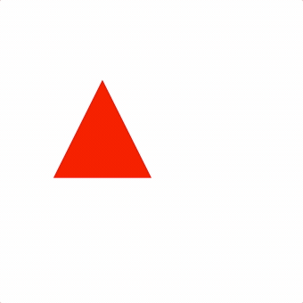

# FigureOne

Draw, animate and interact with shapes, text, plots and equations. Create interactive slide shows, and interactive videos.

The library used to draw interactive slides at <a href="https://www.thisiget.com">thisiget.com</a>.

See the [Tutorials](./docs/tutorials), [API Reference](https://airladon.github.io/FigureOne/api/) and [Examples](./docs/examples) and you'll be making beautiful, interactive figures in no time.

The examples are also hosted on this repository's GitHub Pages site [here](https://airladon.github.io/FigureOne/).


## Getting Started

Load the FigureOne library into your HTML file:

```html
<script type="text/javascript" src='https://cdn.jsdelivr.net/npm/figureone@0.7.3/figureone.min.js'></script>
```

Create a `div` element to attach the figure to:
```html
<div id="figureOneContainer" style="width: 500px; height: 500px; background-color: white;"></div>
```

Then in javascript, create a figure and a shape within it:

```js
const figure = new Fig.Figure();

// Create the shape
figure.add(
  {
    name: 'tri',
    method: 'triangle',
    options: {
      width: 1,
      height: 1,
      color: [1, 0, 0, 1],
    },
  },
);

// Animate the shape
figure.getElement('tri').animations.new()
  .position({ target: [1, 0], duration: 1 })
  .rotation({ target: Math.PI, duration: 2 })
  .position({ target: [0, 0], duration: 1 })
  .start();
```

And you will see:



The [Tutorials](./docs/tutorials) build on this and introduce FigureOne's concepts and features in simplified examples.

## Examples

### **[Interactive Angle](./docs/examples/Interactive%20Angle)**


### **[Pythagorean Equation Animation](./docs/examples/Pythagorean%20Theorem)**


### **[Create a Sine Wave](./docs/examples/Sine%20Wave)**


### **[Total Angle of a Polygon](./docs/examples/Total%20Angle%20of%20a%20Polygon)**


### **[Sine Limit](./docs/examples/Sine%20Limit)**


### **[Traveling Wave 01 - Shifting Equations](./docs/examples/Traveling%20Wave%2001%20-%20Shifting%20Equations)**


### **[Traveling Wave 02 - Sine Wave](./docs/examples/Traveling%20Wave%2002%20-%20Sine%20Waves)**


### **[Traveling Wave 03 - Velocity Frequency Wavelength](./docs/examples/Traveling%20Wave%2003%20-%20Velocity%20Frequency%20Wavelength)**


### **[Holiday Equation](./docs/examples/Holiday%20Equation)**


## **[Interactive Video - Tiling](docs/examples/Interactive%20Video%20-%20Tiling)**


## **[Interactive Video - Trig 1 - Trig Functions](docs/examples/Interactive%20Video%20-%20Trig%201%20-%20Trig%20Functions)**


## **[Interactive Video - Trig 2 - Names](docs/examples/Interactive%20Video%20-%20Trig%202%20-%20Names)**


## **[Interactive Video - Trig 3 - Relationships](docs/examples/Interactive%20Video%20-%20Trig%203%20-%20Relationships)**


## NPM Package

On projects that are bundled with tools such as Webpack, it can be useful to use the FigureOne NPM package:

`npm install figureone`

Then within your project you can:

```js
import Fig from 'figureone';

const figure = new Fig.Figure();
```

Flow typed files are included in the package for type checking in the editor.

