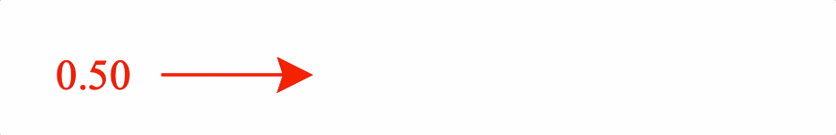

<!-- Generated by documentation.js. Update this documentation by updating the source code. -->

### Table of Contents

-   [Introduction][1]
-   [Diagram][2]
-   [Diagram][3]
    -   [spaceTransforms][7]
    -   [add][9]
    -   [addElements][12]
    -   [addElement][15]
    -   [getElement][18]
    -   [setTouchable][21]
    -   [getRemainingAnimationTime][23]
    -   [stop][25]
    -   [animateNextFrame][27]
-   [OBJ_Diagram][29]
-   [Diagram Elements][31]
-   [DiagramElement][32]
    -   [setPosition][35]
    -   [setRotation][37]
    -   [setScale][39]
    -   [setTransform][41]
    -   [setColor][43]
    -   [dim][45]
    -   [setDimColor][46]
    -   [undim][48]
    -   [getPath][49]
    -   [pulse][50]
    -   [getScale][52]
    -   [getRotation][53]
    -   [getPosition][55]
    -   [show][57]
    -   [setTouchable][58]
    -   [setTouchableRect][60]
    -   [setMovable][62]
    -   [hide][64]
    -   [toggleShow][65]
    -   [getTransform][66]
    -   [isMoving][67]
    -   [isAnimating][68]
-   [DiagramElementPrimitive][69]
    -   [setAngleToDraw][71]
-   [DiagramElementCollection][73]
    -   [toFront][75]
    -   [toBack][77]
    -   [add][79]
    -   [getElement][81]
    -   [getElements][83]
-   [Geometric Classes][85]
-   [Point][86]
    -   [x][89]
    -   [y][90]
    -   [\_dup][91]
    -   [scale][92]
    -   [sub][95]
    -   [add][98]
    -   [distance][101]
    -   [round][104]
    -   [clip][107]
    -   [transformBy][110]
    -   [rotate][113]
    -   [isEqualTo][116]
    -   [isNotEqualTo][119]
    -   [zero][122]
    -   [Unity][123]
-   [Rect][124]
    -   [left][127]
    -   [width][128]
    -   [height][129]
    -   [bottom][130]
    -   [top][131]
    -   [right][132]
    -   [\_dup][133]
    -   [isPointInside][134]
    -   [round][137]
-   [Line][139]
    -   [setP1][142]
    -   [setP2][144]
    -   [getPoint][146]
    -   [getYFromX][148]
    -   [getXFromY][150]
    -   [getYIntercept][152]
    -   [getXIntercept][153]
    -   [getGradient][154]
    -   [angle][155]
    -   [round][156]
    -   [length][158]
    -   [midPoint][159]
    -   [pointAtPercent][160]
    -   [pointAtLength][162]
    -   [hasPointAlong][164]
    -   [distanceToPoint][166]
    -   [hasPointOn][168]
    -   [isEqualTo][170]
    -   [isWithinDelta][172]
    -   [hasLineWithin][174]
    -   [isAlongLine][176]
    -   [isWithinLine][178]
    -   [offset][180]
    -   [isParallelWith][182]
    -   [intersectsWith][184]
-   [Translation][186]
    -   [matrix][188]
    -   [sub][189]
    -   [add][191]
    -   [mul][193]
    -   [round][195]
    -   [\_dup][197]
-   [Rotation][198]
    -   [matrix][200]
    -   [sub][201]
    -   [round][203]
    -   [add][205]
    -   [mul][207]
    -   [\_dup][209]
-   [Scale][210]
    -   [matrix][212]
    -   [sub][213]
    -   [round][215]
    -   [add][217]
    -   [mul][219]
    -   [\_dup][221]
-   [Transform][222]
    -   [standard][225]
    -   [translate][226]
    -   [rotate][228]
    -   [scale][230]
    -   [remove][232]
    -   [calcMatrix][234]
    -   [t][236]
    -   [clipRotation][238]
    -   [updateTranslation][240]
    -   [s][242]
    -   [toDelta][244]
    -   [updateScale][246]
    -   [r][248]
    -   [updateRotation][250]
    -   [m][252]
    -   [matrix][253]
    -   [isSimilarTo][254]
    -   [isEqualTo][256]
    -   [isWithinDelta][258]
    -   [sub][260]
    -   [add][262]
    -   [mul][264]
    -   [transform][266]
    -   [transformBy][269]
    -   [round][272]
    -   [clip][274]
    -   [isZero][276]
    -   [\_dup][278]
    -   [identity][279]
-   [Shapes][280]
-   [OBJ_Generic][281]
-   [OBJ_Line][284]
-   [OBJ_Polyline][287]
-   [OBJ_Arrow][290]
-   [OBJ_Triangle][293]
-   [OBJ_Rectangle][296]
-   [OBJ_Ellipse][299]
-   [OBJ_Polygon][302]
-   [OBJ_Star][305]
-   [OBJ_Grid][308]
-   [Advanced Shapes][311]
-   [AdvancedLine][312]
    -   [line][314]
    -   [pulseWidth][315]
    -   [setMovable][317]
    -   [updateMoveTransform][319]
    -   [setAutoUpdate][321]
    -   [getLength][323]
    -   [getAngle][324]
    -   [setLabel][326]
    -   [getLabel][328]
    -   [setLabelToRealLength][329]
    -   [updateLabel][330]
    -   [setLength][332]
    -   [setEndPoints][334]
    -   [grow][336]
    -   [getP1][338]
    -   [getP2][339]
-   [ADV_Line][340]
-   [AdvancedAngle][342]
    -   [setAutoUpdate][345]
    -   [setAngle][347]
    -   [getAngle][349]
    -   [setLabel][351]
    -   [getLabel][353]
    -   [setLabelToRealAngle][354]
    -   [updateLabel][355]
    -   [pulseAngle][357]
    -   [setMovable][359]
-   [ADV_Angle][361]
-   [AdvancedPolyline][363]
    -   [updatePoints][365]
    -   [reversePoints][367]
    -   [setPositionWithoutMoving][369]
    -   [setRotationWithoutMoving][371]
    -   [setScaleWithoutMoving][373]
    -   [hideAngles][375]
    -   [hideSides][376]
    -   [showAngles][377]
    -   [showSides][378]
-   [ADV_Polyline][379]
-   [AdvancedAxis][381]
    -   -   [Example][382]
        -   [Example][383]
        -   [Example][384]
        -   [Example][385]
        -   [Example][386]
    -   [valueToDraw][387]
    -   [drawToValue][389]
    -   [inAxis][391]
-   [ADV_Axis][393]
-   [Text][395]
-   [OBJ_Text][396]
-   [OBJ_TextLine][399]
-   [OBJ_TextLines][402]
-   [Animation][405]
-   [AnimationManager][406]
    -   [new][409]
    -   [builder][412]
    -   [rotation][414]
    -   [scale][417]
    -   [trigger][419]
    -   [delay][421]
    -   [translation][423]
    -   [position][425]
    -   [color][427]
    -   [opacity][429]
    -   [transform][431]
    -   [dissolveIn][433]
    -   [dissolveOut][435]
    -   [dim][437]
    -   [undim][439]
    -   [scenario][441]
    -   [scenarios][443]
    -   [cancel][445]
    -   [start][447]
    -   [getRemainingTime][449]
-   [AnimationBuilder][451]
    -   [custom][453]
    -   [rotation][455]
    -   [position][457]
    -   [translation][459]
    -   [scale][461]
    -   [transform][463]
    -   [scenario][465]
    -   [scenarios][467]
    -   [color][469]
    -   [opacity][471]
    -   [dissolveOut][473]
    -   [dissolveIn][475]
    -   [dim][477]
    -   [undim][479]
    -   [delay][481]
    -   [trigger][483]
    -   [inParallel][485]
    -   [inSerial][487]
-   [PositionAnimationStep][489]
-   [RotationAnimationStep][492]
-   [ScaleAnimationStep][495]
-   [TransformAnimationStep][498]
-   [ScenarioAnimationStep][501]
-   [PulseAnimationStep][504]
-   [ColorAnimationStep][507]
-   [DimAnimationStep][510]
-   [UndimAnimationStep][513]
-   [OpacityAnimationStep][516]
-   [DissolveInAnimationStep][519]
-   [DissolveOutAnimationStep][522]
-   [TriggerAnimationStep][525]
-   [CustomAnimationStep][528]
-   [SerialAnimationStep][531]
-   [ParallelAnimationStep][534]
-   [DelayAnimationStep][537]
-   [Equations][539]
-   [Equation][540]
    -   [eqn][543]
    -   [setFormSeries][545]
    -   [getFormSeries][547]
    -   [addElements][548]
    -   [addForms][550]
    -   [getCurrentForm][552]
    -   [setCurrentForm][553]
    -   [showForm][555]
    -   [getForm][557]
    -   [goToForm][559]
    -   [prevForm][561]
    -   [nextForm][563]
    -   [replayCurrentForm][565]
-   [EQN_Equation][567]
-   [Equation Layout][569]
-   [EQN_Fraction][570]
-   [EQN_Root][573]
-   [EQN_Subscript][576]
-   [EQN_Superscript][579]
-   [EQN_SuperscriptSubscript][582]
-   [EQN_Matrix][585]
-   [EQN_Integral][588]
-   [EQN_SumOf][591]
-   [EQN_ProdOf][594]
-   [EQN_Bar][597]
-   [EQN_Bracket][600]
-   [EQN_Box][603]
-   [EQN_Strike][606]
-   [EQN_StrikeComment][609]
-   [EQN_Comment][612]
-   [EQN_Pad][615]
-   [EQN_Scale][618]
-   [EQN_Container][621]
-   [EQN_Annotate][624]
-   [Equation Symbols][627]
-   [EQN_VinculumSymbol][628]
-   [EQN_BoxSymbol][631]
-   [EQN_ArrowSymbol][634]
-   [EQN_SumSymbol][637]
-   [EQN_ProdSymbol][640]
-   [EQN_IntegralSymbol][643]
-   [EQN_StrikeSymbol][646]
-   [EQN_BracketSymbol][649]
-   [EQN_AngleBracketSymbol][652]
-   [EQN_BraceSymbol][655]
-   [EQN_BarSymbol][658]
-   [EQN_SquareBracketSymbol][661]
-   [EQN_RadicalSymbol][664]
-   [2D Geometry Tools][667]
-   [minAngleDiff][668]
-   [getTriangleCenter][671]
-   [polarToRect][674]
-   [rectToPolar][677]
-   [threePointAngle][680]
-   [threePointAngleMin][683]
-   [clipAngle][686]
-   [Math tools][689]
-   [round][690]
-   [range][692]
-   [randSign][694]
-   [randInt][695]
-   [rand][697]
-   [randElement][699]
-   [randElements][701]
-   [removeRandElement][703]
-   [Misc Diagram Element][705]
-   [DiagramElementMoveFreely][706]
-   [DiagramElementMove][708]
-   [Scenarios][710]
-   [ElementMovementState][712]
-   [ElementPulseState][714]
-   [ElementState][716]
-   [DrawingObject][718]
-   [DiagramPrimitives][720]
    -   [generic][721]
    -   [polyline][723]
    -   [polygon][725]
    -   [star][727]
    -   [rectangle][729]
    -   [ellipse][731]
    -   [triangle][733]
    -   [grid][735]
    -   [line][737]
    -   [arrow][739]
    -   [textLine][741]
    -   [textLines][743]
    -   [text][745]
    -   [collection][747]
-   [Misc Geometry][749]
-   [TypeParsablePoint][750]
-   [TypeParsableLine][752]
-   [TypeParsableRect][754]
-   [TypeParsableTransform][756]
-   [getPoint][758]
-   [getPoints][760]
-   [getScale][762]
-   [getLine][764]
-   [getRect][766]
-   [getTransform][768]
-   [OBJ_QuadraticBezier][770]
-   [Intersect][772]
-   [Misc Shapes][774]
-   [OBJ_Texture][775]
-   [OBJ_TextDefinition][777]
-   [OBJ_Font][779]
-   [OBJ_TextLineDefinition][782]
-   [OBJ_TextLinesDefinition][784]
-   [OBJ_TextModifierDefinition][786]
-   [OBJ_TextModifiersDefinition][788]
-   [OBJ_PulseScale][790]
-   [OBJ_CurvedCorner][792]
-   [OBJ_LineStyle][794]
-   [CPY_Step][796]
-   [TypeDash][799]
-   [ArrowHead][800]
-   [OBJ_LineArrow][801]
-   [OBJ_LineArrows][804]
-   [OBJ_Scenario][806]
-   [OBJ_MovableAngle][808]
-   [TypeAngleLabelOptions][810]
-   [OBJ_AngleCurve][812]
-   [OBJ_AngleArrows][814]
-   [TypeAngleArrows][816]
-   [OBJ_AngleCorner][817]
-   [OBJ_PulseAngle][819]
-   [OBJ_AngleSet][821]
-   [OBJ_AngleAnimationStep][823]
-   [OBJ_PulseAngleAnimationStep][825]
-   [TypeLineLabelOptions][827]
-   [OBJ_PulseWidth][829]
-   [OBJ_MovableLine][831]
-   [OBJ_LengthAnimationStep][833]
-   [OBJ_PulseWidthAnimationStep][835]
-   [OBJ_PolylinePad][837]
-   [OBJ_PolylineCustomization][838]
-   [TypeLabelOrientation][841]
-   [TypeLabelLocation][842]
-   [TypeLabelSubLocation][843]
-   [OBJ_ValidShapeHideThresholds][844]
-   [OBJ_ValidShape][846]
-   [SUB_PolylineUpdatePoints][848]
-   [OBJ_PolylineAngle][849]
-   [OBJ_PolylineSide][850]
-   [OBJ_PolylinePadSingle][851]
-   [Misc Animation][853]
-   [AnimationStep][854]
    -   [getRemainingTime][857]
    -   [start][859]
-   [ElementAnimationStep][861]
-   [OBJ_PositionAnimationStep][863]
-   [OBJ_RotationAnimationStep][865]
-   [OBJ_ElementAnimationStep][867]
-   [OBJ_ScenarioVelocity][869]
-   [OBJ_AnimationBuilder][871]
-   [OBJ_AnimationStep][873]
-   [OBJ_AnimationStart][875]
-   [OBJ_SerialAnimationStep][877]
-   [OBJ_ParallelAnimationStep][879]
-   [OBJ_ScaleAnimationStep][881]
-   [OBJ_CustomAnimationStep][883]
-   [OBJ_TransformAnimationStep][885]
-   [OBJ_ScenarioAnimationStep][887]
-   [OBJ_TriggerAnimationStep][889]
-   [OBJ_Pulse][891]
-   [OBJ_PulseAnimationStep][894]
-   [OBJ_ColorAnimationStep][896]
-   [OBJ_OpacityAnimationStep][898]
-   [OBJ_ScenariosAnimationStep][900]
-   [AnimationProgression][902]
-   [TypeWhen][904]
-   [AnimationStartTime][905]
-   [Misc Equation][906]
-   [EquationFunctions][907]
    -   [container][908]
    -   [brac][910]
    -   [bar][912]
    -   [annotate][914]
    -   [scale][916]
    -   [frac][918]
    -   [supSub][920]
    -   [sup][922]
    -   [sub][924]
    -   [box][926]
    -   [pad][928]
    -   [topBar][930]
    -   [bottomBar][932]
    -   [matrix][934]
    -   [int][936]
    -   [sumOf][938]
    -   [prodOf][940]
    -   [topComment][942]
    -   [bottomComment][944]
    -   [strike][946]
    -   [topStrike][948]
    -   [bottomStrike][950]
-   [EQN_Annotation][952]
-   [EQN_EncompassGlyph][955]
-   [EQN_LeftRightGlyph][958]
-   [EQN_TopBottomGlyph][961]
-   [EQN_Glyphs][964]
-   [TypeEquationElements][966]
-   [TypeEquationPhrase][967]
-   [TypeFormAlignment][969]
-   [TypeFormAnimationProperties][971]
-   [TypeFormTranslationProperties][974]
-   [TypeEquationFormObject][976]
-   [TypeEquationForm][979]
-   [TypeEquationForms][980]
-   [TypeFormRestart][981]
-   [TypeEquationGoToFormOptions][983]
-   [TypeEquationTextElement][985]
-   [OBJ_AxisTicks][987]
-   [OBJ_AxisLabels][990]
-   [TypeAxisTitle][993]
-   [OBJ_SurroundAnimationStep][994]
-   [EquationLabel][996]

## Introduction

This will introduce some key terms and concepts that are found frequently throughout the documentation.

This is a work in progress and the entire API is not yet documented.

#### Diagrams, Primitives and Collections

**FigureOne** allows you to create a _figure_, or _diagram_ that can be both interactive and animated.

A diagram has one or more _diagram elements_. A diagram element is a simple shape, some text, or it may be a collection of other elements. These elements combine to create a complex drawing, graph or equation.

In the language of **FigureOne**, there are two types of [DiagramElements][998]:

-   [DiagramElementPrimitive][69] - an element that will draw something to the screen, such as a line, shape or text
-   [DiagramElementCollection][73] - collections of primitives or other collections

Each [DiagramElement][32] has a [Transform][222] that may contain one or more translations, rotations and scaling factors. When the element is rendered to the screen, the transform will be applied. In the case of a [DiagramElementPrimitive][69], the shape or text will be transformed. In the case of a [DiagramElementCollection][73], all the diagram elements it contains will have the transform applied to them.

This means there is a heierachy of [DiagramElement][32] objects, where the parent transform is applied to (cascaded with) the child transform. Therefore collections can be thought of as modular building blocks of a more complex figure.

Changing an element's transform moves the element through space. Changing the element's transform over time animates the element.

#### An Example

Let's say we want to create a rotating labeled line. As the line is rotated, the label follows the line.

<p style="text-align: center"></p>

To create this diagram, we might use a diagram element hierarchy like:

<p style="text-align: center"></p>

The drawn elements, the line and text, are primitives. They are created in the simple no rotation case. If the line is 0.8 long, and it starts at (0, 0), then the text might be at (0.4, 0.1)

<p style="text-align: center"></p>

The diagram itself has limits that define the coordinate window that can be shown, in this case its bottom left is the origin, and it is 3 wide and 2 high. We want the collection to be rotated, with the center of rotation at the center of the diagram. Therefore we apply a rotation and translation transform to the collection.

<p style="text-align: center"></p>

There are several different ways to create the same diagram, but this way is used as it highlights how a collection can be used to transform a group of primitive elements.

#### Coordinate spaces

FigureOne renders shapes in WebGL, text in Context2D and can even manipulate html elements as diagram elements. As WebGL is used most in FigureOne, it will be used as an example to introduce coorindate spaces and why they matter.

WebGL is rendered in a html [canvas][999] element.

The [canvas][999] element is defined in screen pixels. The WebGL view re-maps the canvas pixels to -1 to +1 coordinates in both the vertical and horizontal directions, independent on the aspect ratio of the canvas.

When the canvas aspect ratio is not a square, or it is more convenient to create a diagram in a coordinate space not mapped between -1 to +1, then it is useful to have a separate _diagram space_. In the example above, the diagram space re-maps the _GL space_ to 0 to 3 in the horizontal and 0 to 2 in the vertical.

These are three examples of different coordinate spaces - _pixel space_, _GL space_ and _diagram space_.

If you want to move or modify an element, you need to think about what you want to modify it _relative_ to. Do you want to move it relative to other elements in the diagram? In other words, do you want to move it in _diagram space_? Or do you want to move it relative to other elements within the parent, or local collection - _local space_. Alternately, you might want to modify the vertices of the shape, in _vertex space_.

In simple diagrams, where no collections are used, or collections don't transform their child elements you don't really need to think about what space you are working in. Diagram space will be the same as local space and vertex space. You won't care about the higher level GL or pixel spaces.

But if you have transformed collections, or if you are tying an element to a location on the screen you will need to convert points between the different spaces. In addition, it is useful to know about these different spaces as sometimes they are referred to in the documentation.

One way to think about what space you are modifying is:

-   Elements that are direct children of the diagram: element transforms are in diagram space
-   Elements that are direct children of a collection: element transforms are in local space (the space of the parent colleciton)
-   Vertex definitions in element primitives: vertex space

For example, a square might be defined in vertex space as a square with length 1, centered around the origin.

The transform of the diagram element primitive that controls the square will move the square in _local space_ - the space relative to all other elements that are the children of the same parent collection.

If the parent collection's parent is the diagram itself, then its transform will move the colleciton in diagram space.

Converting between spaces is relatively straight forward. All diagram elements have methods to find their position or bounds in _diagram_, _local_ or _vertex_ space. The diagram has transforms that allow conversion between _diagram_, _GL_ and _pixel_ spaces.

Where this is useful is if two primitives have different parents, and you want to move one to be in the same position as the other. To do this you would convert the target element position to _diagram space_, and then to the _local space_ of the element to move.

#### Drawing

When it is time to draw the scene, the diagram will pass an initial transform to the first element in the hierarchy. In the example above, the "Labeled Line" collection. This transform will include any translations and scaling needed to convert from _diagram_ space to _GL_ space for actual rendering.

The "Labeled Line" collection will then cascade this transform with it's own rotation and translation transform, and pass this to its children, the "Label" and "Line" primitives.

The "Label" primitive has it's own transform that translates it to the middle of the horizontal line in _local_ space. The transform will be combined with the one from its parent, creating a final transform to draw the label with.

The primitive's shape or text definition never needs to change. At draw time, it is simply transformed by it's own transform and all the ancestors directly above it in the hierarchy. This is the same method used by WebGL as it reduces the amount of memory that needs to be loaded into the graphics memory each draw frame. All the vertices of a shape are loaded into the graphics memory just once, and each frame just a transform is passed informs the graphics processor how to orient the vertices.

If you have a dynamic shape whose vertices do change every frame (like a morphing animation), you can choose to load the vertices every frame. However, depending on the performance of the browser's host machine, and the number of vertices being adjusted, you might see a performance impact compared to a shape with a similar amount of vertices that do not change.

#### Code

Finally, let's see the code for the example above. Two files, `index.html` and `index.js` should be in the same folder.

```html
<!-- index.html -->
<!doctype html>
<html>
<body>
    <div id="figureOneContainer" style="width: 1200px; height: 800px; background-color: white;">
    </div>
    <script type="text/javascript" src='https://cdn.jsdelivr.net/npm/figureone@0.2.3/figureone.min.js'></script>
    <script type="text/javascript" src='./index.js'></script>
</body>
</html>
```

```javascript
// index.js
const diagram = new Fig.Diagram({ limits: [0, 0, 6, 4 ]});
diagram.addElement(
  {
    name: 'labeledLine',
    method: 'collection',
    addElements: [
      {
        name: 'line',
        method: 'line',
        options: {
          p1: [0, 0],
          p2: [2, 0],
          width: 0.01,
          color: [0, 0, 1, 1],
        },
      },
      {
        name: 'label',
        method: 'text',
        options: {
          text: 'Line 1',
          position: [1, 0.1],
          font: { color: [0, 0, 1, 1] },
          xAlign: 'center',
        },
      },
    ],
    options: {
      position: [3, 2],
    },
    mods: {
      isTouchable: true,
      isMovable: true,
      touchInBoundingRect: true,
      move: {
        type: 'rotation',
      },
    },
  },
);
diagram.elements.isTouchable = true;
```

#### Using FigureOne

The example above shows how a figure can be defined with simple javascript objects, able to be encoded simply in JSON. This means complex figures or modules can be shared and reused easily.

For many uses, it is fine to fully define a diagram and all its elements before a user interacts with it.

Diagrams can also be defined more dynamically, such as in the example below which has exactly the same function as the example above.

```javascript
// index.js
const diagram = new Fig.Diagram({ limits: [0, 0, 6, 4 ]});

const label = diagram.create.text({
  text: 'Line 1',
  position: [1, 0.1],
  font: { color: [0, 0, 1, 1] },
  xAlign: 'center',
});
const line = diagram.create.line({
  p1: [0, 0],
  p2: [2, 0],
  width: 0.01,
  color: [0, 0, 1, 1],
});
const labeledLine = diagram.create.collection({});
diagram.elements.add('labeledLine', labeledLine);
labeledLine.add('line', line);
labeledLine.add('label', label);
labeledLine.setPosition(3, 2);
labeledLine.move.type = 'rotation';
labeledLine.touchInBoundingRect = true;
labeledLine.setMovable();
```


## Diagram


## Diagram

Class to create a diagram.

By default, a diagram will attach a WebGL canvas and Context2D
canvas to the html `div` element with id `"figureOneContainer"`.

To attach to a different `div`, use the `htmlId` property in the class
constructor.

The diagram manages all drawing elements, rendering the drawing elements
on browser animation frames and listens for guestures from the user.

The diagram also has a recorder, allowing to record and playback states,
and gestures.

If a diagram is paused, then all drawing element animations will
also be paused.

It also has a number of convenience functions for create drawing elements
already attached to the drawing canvases, and useful transforms for
converting between the different spaces (e.g. pixel, GL, diagram).

### Parameters

-   `options` **[OBJ_Diagram][1000]** 

### Properties

-   `create` **[DiagramPrimitives][1001]** create elements with this

### Examples

```javascript
// Simple html and javascript example to create a diagram, and add a
// hexagon.
//
// For additional examples, see https://github.com/airladon/FigureOne
//
// Two files `index.html` and `index.js` in the same directory

// index.html
<!doctype html>
<html>
<body>
    <div id="figureOneContainer" style="width: 800px; height: 800px; background-color: white;">
    </div>
    <script type="text/javascript" src='https://cdn.jsdelivr.net/npm figureone@0.2.3/figureone.min.js'></script>
    <script type="text/javascript" src='./index.js'></script>
</body>
</html>

// index.js
const diagram = new Fig.Diagram({ limits: [-1, -1, 2, 2 ]});
diagram.addElement(
  {
    name: 'p',
    method: 'polygon',
    options: {
      radius: 0.5,
      fill: true,
      sides: 6,
    },
  },
);
diagram.initialize();
```

```javascript
// Alternately, an element can be added programatically
// index.js
const diagram = new Fig.Diagram({ limits: [-1, -1, 2, 2 ]});
const hex = diagram.create.polygon({
  radius: 0.5,
  fill: true,
  sides: 6,
});
diagram.add('hexagon', hex);
```

### spaceTransforms

Useful transforms between spaces at the diagram level and above.

Type: {glToDiagram: [Transform][1002], diagramToGL: [Transform][1002], pixelToDiagram: [Transform][1002], diagramToPixel: [Transform][1002], pixelToGL: [Transform][1002], glToPixel: [Transform][1002], diagramToCSSPercent: [Transform][1002]}

#### Properties

-   `glToDiagram` **[Transform][1002]** 
-   `diagramToGL` **[Transform][1002]** 
-   `pixelToDiagram` **[Transform][1002]** 
-   `diagramToPixel` **[Transform][1002]** 
-   `pixelToGL` **[Transform][1002]** 
-   `glToPixel` **[Transform][1002]** 
-   `diagramToCSSPercent` **[Transform][1002]** 

### add

Add a [DiagramElement][32] to the diagram with some `name`.

#### Parameters

-   `name` **[string][1003]** 
-   `diagramElement` **([DiagramElementPrimitive][1004] \| [DiagramElementCollection][1005])** 

#### Examples

```javascript
const hex = diagram.create.polygon({
  radius: 0.5,
  fill: true,
  sides: 6,
});
diagram.add('hexagon', hex);
```

### addElements

Add elements from element definitions to the diagram.

#### Parameters

-   `elementsToAdd` **[Array][1006]&lt;TypeAddElementObject>** array of element definitions
-   `collection` **[DiagramElementCollection][1005]** the
    collection to add elements to (optional, default `this.elements`)
-   `addElementsKey` **[string][1003]** key to add elements (optional, default `'addElements'`)

#### Examples

```javascript
diagram.addElements([
  {
    name: 'hex',
    method: 'polygon',
    options: {
      radius: 0.5,
      fill: true,
      sides: 6,
      position: [-0.5, 0],
    },
  },
  {
    name: 'tri',
    method: 'polygon',
    options: {
      radius: 0.5,
      fill: true,
      sides: 3,
      position: [0.5, 0],
    },
  },
]);
```

### addElement

Add an element from an element definitions to the diagram.

#### Parameters

-   `elementDefinition` **TypeAddElementObject** array of element definitions
-   `rootCollection` **[DiagramElementCollection][1005]**  (optional, default `this.elements`)
-   `addElementsKey` **[string][1003]** key to add elements (optional, default `'addElements'`)
-   `collection` **[DiagramElementCollection][1005]** the
    collection to add elements to (optional, default `this.elements`)

#### Examples

```javascript
diagram.addElement({
  name: 'hex',
  method: 'polygon',
  options: {
    radius: 0.5,
    fill: true,
    sides: 6,
    position: [-0.5, 0],
  },
});
```

### getElement

-   **See: <a href="#diagramelementcollectiongetelement">element.getElement</a>
    **

Get element from element name or path.

#### Parameters

-   `elementName` **[string][1003]** 

#### Examples

```javascript
// Get a diagram element and rotate it
diagram.addElements([
  {
    name: 'hex',
    method: 'polygon',
    options: {
      radius: 0.5,
      fill: true,
      sides: 6,
      position: [-0.5, 0],
    },
  },
  {
    name: 'tri',
    method: 'polygon',
    options: {
      radius: 0.5,
      fill: true,
      sides: 3,
      position: [0.5, 0],
    },
  },
]);

const hex = diagram.getElement('hex');
hex.animations.new()
  .rotation({ target: Math.PI, duration: 2, delay: 1 })
  .start();
```

### setTouchable

Set the diagram to be touchable.

Using <a href="#diagramelementsettouchable">element.setTouchable</a> will
automatically set this.

#### Parameters

-   `touchable` **[boolean][1007]**  (optional, default `true`)

### getRemainingAnimationTime

Get remaining animation durations of running animations

#### Parameters

-   `nowIn` **[number][1008]**  (optional, default `this.globalAnimation.now()/1000`)

### stop

Stop all animations, movement and pulses in diagram.

#### Parameters

-   `how` **(`"freeze"` \| `"cancel"` \| `"complete"` \| `"animateToComplete"` \| `"dissolveToComplete"`)**  (optional, default `'cancel'`)

### animateNextFrame

Force diagram to draw on next available animation frame.

#### Parameters

-   `draw` **[boolean][1007]**  (optional, default `true`)
-   `fromWhere` **[string][1003]**  (optional, default `''`)

## OBJ_Diagram

Diagram options object

### Properties

-   `htmlId` **[string][1003]?** HTML `div` tag `id` to tie diagram to (`"figureOneContainer"`)
-   `limits` **[TypeParsableRect][1009]?** limits (bottom left
     corner at (-1, -1), width 2, height 2)

## Diagram Elements


## DiagramElement

Diagram Element base class

The set of properties and methods shared by all diagram elements

A diagram element has several color related properties. Color is
defined as an RGBA array with values between 0 and 1. The alpha
channel defines the transparency or opacity of the color where
1 is fully opaque and 0 is fully transparent.

The `color` property stores the element's current color, while the
`defaultColor` property stores the element's color when not dimmed or
dissolving. Color should only be set using the `setColor` method.

An element can be "dimmed" or "undimmed". For instance,
a red element might turn grey when dimmed. The property
`dimColor` stores the desired color to dim to and should be set with
`setDimColor()`

An element can be dissolved in or out with animation. Dissolving
an element out transitions its opacity from its current value to 0.
The `opacity` property is used when dissolving. The opacity is multiplied by
the alpha channel of `color` to net a final opacity. Opacity should not be
set directly as it will be overwritten by dissolve animations.

### Parameters

-   `transform` **[Transform][1002]**  (optional, default `new Transform()`)
-   `diagramLimitsOrDiagram` **([Diagram][1010] \| [Rect][1011])**  (optional, default `new Rect(-1,-1,2,2)`)
-   `parent` **([DiagramElement][1012] | null)**  (optional, default `null`)

### Properties

-   `name` **[string][1003]** reference name of element
-   `isShown` **[boolean][1007]** if `false` then element will not be processed on
    next draw
-   `transform` **[Transform][1002]** transform to apply element
-   `lastDrawTransform` **[Transform][1002]** transform last used for drawing -
    includes cascade or all parent transforms
-   `parent` **([DiagramElement][1012] | null)** parent diagram element - `null` if
    at top level of diagram
-   `diagram` **[Diagram][1010]** diagram element is attached to
-   `isTouchable` **[boolean][1007]** must be `true` to move or execute `onClick`
-   `isMovable` **[boolean][1007]** must be `true` to move
-   `color` **\[[number][1008], [number][1008], [number][1008], [number][1008]]** element's current
    color defined as red, green, blue, alpha with range 0 to 1
-   `dimColor` **\[[number][1008], [number][1008], [number][1008], [number][1008]]** color to use when
    dimming element
-   `opacity` **[number][1008]** number between 0 and 1 that is multiplied with
    `color` alpha channel to get final opacity
-   `move` **[DiagramElementMove][1013]** movement parameters
-   `scenarios` **[Scenarios][1014]** scenario presets
-   `animations` **[AnimationManager][1015]** element animation manager
-   `subscriptions` **SubscriptionManager** subscription manager for
    element

### setPosition

Conveniently set the first `translation` of the element's `transform`.

#### Parameters

-   `pointOrX` **([TypeParsablePoint][1016] \| [number][1008])** x coordinate or full point
    definition
-   `y` **[number][1008]** y coordinate if `pointOrX` is just the x coordinate (`0`) (optional, default `0`)

### setRotation

Conveniently set the first `rotation` of the element's `transform`.

#### Parameters

-   `rotation` **[number][1008]** 

### setScale

Conveniently set the first `scale` of the element's `transform`.

#### Parameters

-   `scaleOrX` **([TypeParsablePoint][1016] \| [number][1008])** horizontal scale - either
    define as full x-y point, or as a number. If scaleOrX is a `number` and
    `y` is null, then both `x` and `y` will be equally scaled
-   `y` **([number][1008] | null)** y coordinate if `scaleOrX` is a `number` (`null`) (optional, default `null`)

### setTransform

Set transform of element. Setting through this method will ensure
`setTransfrom` subscription will publish, and transform will be
appropriately clipped.

#### Parameters

-   `transform` **[Transform][1002]** 

Returns **void** 

### setColor

Set element color.

#### Parameters

-   `color` **\[[number][1008], [number][1008], [number][1008], [number][1008]]** RGBA color from 0 to 1
-   `setDefault` **[boolean][1007]?** also set the default color to this color (optional, default `true`)

### dim

Set element color to `dimColor`

### setDimColor

Set `dimColor` property

#### Parameters

-   `color` **[Array][1006]&lt;[number][1008]>** 

### undim

Set element color to `defaultColor`

### getPath

Return diagram path of element

Returns **[string][1003]** path of element relative to diagram

### pulse

Pulse element.

An element can be pulsed in scale, a rotation or a translation.

The scale pulse can either be a single pulse, or a number of copies with a
range of scales - which has the effect of making regular polygons thick.

Either pass in a callback, or an options object defining the pulse and
callback.

#### Parameters

-   `optionsOrDone` **(null | [OBJ_Pulse][1017] | function (): void)**  (optional, default `null`)

### getScale

Return the first scale in the element's transform. Will return
`[1, 1]` if element's transform doesn't have a scale.

Returns **[Point][1018]** scale

### getRotation

Return the first rotation in the element's transform. Will return
`0` if the element's transform doesn't have a rotation.

#### Parameters

-   `normalize` **(`"0to360"` \| `"-180to180"` \| `""`)** how to normalize the
    returned angle where `''` returns the raw angle (optional, default `''`)

Returns **[Point][1018]** scale

### getPosition

Get position of element

By default the first translation of the element's transform is returned.
This is effectively the element's location in 'local' coordinates.

The position of the element relative to its horizontal and vertical bounds
can also be returned. Use `xAlign` to find the x coordinate of the left,
center, right or percentage width from left of the element. Use `yAlign`
to find the bottom, middle, top or percentage height from bottom of the
element.

#### Parameters

-   `space` **(`"local"` \| `"diagram"` \| `"gl"` \| `"draw"`)** the space to return
    the position in (optional, default `'local'`)
-   `xAlign` **(`"center"` \| `"left"` \| `"right"` \| `"location"` \| [number][1008])** horizontal alignment of position. Use a `number` to define the horizontal
    position in percentage width from the left. (optional, default `'location'`)
-   `yAlign` **(`"middle"` \| `"top"` \| `"bottom"` \| `"location"` \| [number][1008])** vertical alignment of position. Use a `number` to define the vertical
    position in percentage height from the bottom. (optional, default `'location'`)

### show

Show element

### setTouchable

`true` set this element as touchable and configures all parent elements
to accept touches for their children

`false` makes this element not touchable.

#### Parameters

-   `touchable` **[boolean][1007]** 

### setTouchableRect

Make the touchable border of this element a rect encompassing it
plus some `touchable` buffer on all sides.

#### Parameters

-   `touchable` **[number][1008]**  (optional, default `0`)

### setMovable

Configure all parents to make this element touchable, and
make this element touchable and movable

#### Parameters

-   `movable` **[boolean][1007]** `true` to make movable, `false` to not (optional, default `true`)

### hide

Hide element

Returns **void** 

### toggleShow

Toggle hide/show of element

### getTransform

Get current transform of element.

Returns **[Transform][1002]** 

### isMoving

Returns **[boolean][1007]** `true` if element is moving

### isAnimating

Returns **[boolean][1007]** `true` if element is animating

## DiagramElementPrimitive

**Extends DiagramElement**

Primitive diagram element

A primitive diagram element is one that handles an object (`drawingObject`)
that draws to the screen. This object may be a [VertexObject][1019], a
[TextObject][1020] or a [{HTMLObject][1021]}.

### Parameters

-   `drawingObject` **[DrawingObject][1022]** an object that handles drawing
    to the screen or manages a HTML element
-   `transform` **[Transform][1002]** initial transform to set (optional, default `new Transform()`)
-   `color` **\[[number][1008], [number][1008], [number][1008], [number][1008]]** color to set (optional, default `[0.5,0.5,0.5,1]`)
-   `diagramLimits` **[Rect][1011]** limits of diagram (optional, default `new Rect(-1,-1,2,2)`)
-   `parent` **([DiagramElement][1012] | null)** parent element (optional, default `null`)

### setAngleToDraw

Set angle to draw.

Some primitive elements can be partially drawn to some angle.

An angle of -1 represents the maximum angle allowed by the primitive.

#### Parameters

-   `angle` **[number][1008]** Angle to draw (optional, default `-1`)

## DiagramElementCollection

**Extends DiagramElement**

Collection diagram element

A collection manages a number of children [DiagramElements][998], be they
primitives or collections.

A collection's transform will be passed onto all the children elements.

### Parameters

-   `transform` **[Transform][1002]** initial transform to set (optional, default `new Transform()`)
-   `diagramLimits` **[Rect][1011]** limits of diagram (optional, default `new Rect(-1,1,2,2)`)
-   `parent` **([DiagramElement][1012] | null)** parent element (optional, default `null`)
-   `border` **([Array][1006]&lt;[Array][1006]&lt;[Point][1018]>> | `"children"` \| `"rect"` \| [number][1008])**  (optional, default `'children'`)
-   `touchBorder` **([Array][1006]&lt;[Array][1006]&lt;[Point][1018]>> | `"border"` \| [number][1008] \| `"rect"`)**  (optional, default `'border'`)
-   `holeBorder` **[Array][1006]&lt;[Array][1006]&lt;[Point][1018]>>**  (optional, default `[[]]`)

### toFront

Move child elements to end of draw order - effectively moving to the start
of the drawn collection. Later elements in the array will be further forward.

#### Parameters

-   `elementsIn` **([Array][1006]&lt;([string][1003] \| [DiagramElement][1012])> | [string][1003] \| [DiagramElement][1012])** 
-   `elements` **([Array][1006]&lt;([string][1003] \| [DiagramElement][1012])> | [string][1003] \| [DiagramElement][1012])** 

### toBack

Move child elements to start of draw order - effectively moving them to
the back of the drawn collection. Later elements in the `elements` array
will be drawn further back.

#### Parameters

-   `elementsIn` **([Array][1006]&lt;([string][1003] \| [DiagramElement][1012])> | [string][1003] \| [DiagramElement][1012])** 
-   `elements` **([Array][1006]&lt;([string][1003] \| [DiagramElement][1012])> | [string][1003] \| [DiagramElement][1012])** 

### add

Add a diagram element to the collection.

#### Parameters

-   `name` **[string][1003]** reference name of element
-   `element` **[DiagramElement][1012]** element to add
-   `index` **[number][1008]** index to add in the `drawOrder` where -1 appends the
    element to the end of the draw order, (optional, default `-1`)

### getElement

Get element from an element path with '.' separators.

For instance, if a collection has a child collection 'a', which
has a child primitive 'b', then the path would be: 'a.b'.

#### Parameters

-   `elementPath` **(null | [string][1003] \| [DiagramElement][1012])**  (optional, default `null`)

Returns **([DiagramElement][1012] | null)** element at path. If `elementPath`
is `null`, then this element is returned. If `elementPath` is invalid
then `null` is returned.

### getElements

Returns an array of result from
[getElement][1023] calls on an
array of paths.

#### Parameters

-   `children` **[Array][1006]&lt;([string][1003] \| [DiagramElement][1012])>** 

Returns **[Array][1006]&lt;[DiagramElement][1012]>** Array of
[getElement][1023] results

## Geometric Classes

To define many shapes, geometric primitives (not to be confused with diagram element primitives) such as points and lines need to be used.

FigureOne includes classes that define a:

-   [Point][86]
-   [Line][139]
-   <a href="#rect">Rectangle</a>
-   [Translation][186] transform
-   [Rotation][198] transform
-   [Scale][92] transform
-   <a href="transform">Transform Chain</a>

Each of these classes have convenience methods that make it easy to to work with them such as

-   Checking if two points are equal or within some delta
-   Adding, subtracting and multiplying points
-   Checking if a point is on a line
-   Finding the intersection between two lines
-   Transforming a point with a transform
-   Chaining transforms together

There are many more methods in each class and it is recommended you quickly review them so you know what is available and don't need to reimplement existing logic.

Many of these classes are used by each other. For instance, [Line][139] makes a lot of use of [Point][86]. Therefore instead of defining a point by creating a class each time, short hand, parsable equivalents for Points, Lines, Rectangles and Transforms are available. For more information refer to:

-   [TypeParsablePoint][750]
-   [TypeParsableLine][752]
-   [TypeParsableRect][754]
-   [TypeParsableTransform][756]


## Point

Object representing a point.

Contains methods that makes it conventient to add, subtract and
transform points.

### Parameters

-   `x` **[number][1008]** x coordinate of point
-   `y` **[number][1008]** y coordinate of point

### Examples

```javascript
// get Point from Fig
const { Point } = Fig;

// define a point at (0, 2)
const p = new Point(0, 2);

// find the distance to another point (0, 1) which will be 1
const d = p.distance([0, 1]);

// add to another point (3, 1) which will result in (3, 3)
const q = p.add(3, 1);
```

### x

x value of point

Type: [number][1008]

### y

y value of point

Type: [number][1008]

### \_dup

Return a duplicate of the [Point][86] object

Returns **[Point][1018]** 

### scale

Scale x and y values of point by scalar

#### Parameters

-   `scalar` **[number][1008]** 

#### Examples

```javascript
p = new Point(1, 1);
s = p.scale(3);
// s = Point{x: 3, y: 3};
```

Returns **[Point][1018]** 

### sub

Subtract (x, y) values or a [Point][86] and return the difference as a new [Point][86]

#### Parameters

-   `pointOrX` **([Point][1018] \| [number][1008])** 
-   `y` **[number][1008]**  (optional, default `0`)

#### Examples

```javascript
p = new Point(3, 3);
d = p.sub(1, 1)
// d = Point{x: 2, y: 2}

p = new Point(3, 3);
q = new Point(1, 1);
d = p.sub(q)
// d = Point{x: 2, y: 2}
```

Returns **[Point][1018]** 

### add

Add (x, y) values or a [Point][86] and return the sum as a new [Point][86]

#### Parameters

-   `pointOrX` **([Point][1018] \| [number][1008])** 
-   `y` **[number][1008]**  (optional, default `0`)

#### Examples

```javascript
p = new Point(3, 3);
d = p.add(1, 1)
// d = Point{x: 4, y: 4}

p = new Point(3, 3);
q = new Point(1, 1);
d = p.add(q)
// d = Point{x: 4, y: 4}
```

Returns **[Point][1018]** 

### distance

Return the distance between the point and the origin

#### Parameters

-   `toPointIn` **([TypeParsablePoint][1016] | null)**  (optional, default `null`)

#### Examples

```javascript
p = new Point(1, 1);
d = p.distance();
// d = 1.4142135623730951
```

Returns **[number][1008]** 

### round

Return a new point with (x, y) values rounded to some precision

#### Parameters

-   `precision` **[number][1008]**  (optional, default `8`)

#### Examples

```javascript
p = new Point(1.234, 1.234);
q = p.round(2);
// q = Point{x: 1.23, y: 1.23}
```

Returns **[Point][1018]** 

### clip

Return a new point that is clipped to min and max values from the origin.

Use a point as a parameter to define different (x, y) min/max values,
a number to define the same (x, y) min/max values, or null to have no
min/max values.

#### Parameters

-   `min` **([Point][1018] \| [number][1008] | null)** 
-   `max` **([Point][1018] \| [number][1008] | null)** 

#### Examples

```javascript
p = new Point(2, 2);
q = p.clip(1, 1);
// q = Point{x: 1, y: 1}

p = new Point(2, 2);
q = p.clip(1, null);
// q = Point{x: 1, y: 2}

p = new Point(-2, -2);
minClip = new Point(-1, -1.5);
q = p.clip(minClip, null);
// q = Point{x: -1, y: -1.5}
```

Returns **[Point][1018]** 

### transformBy

Transform the point with a 3x3 matrix (2 dimensional transform)

#### Parameters

-   `matrix` **[Array][1006]&lt;[number][1008]>** 

#### Examples

```javascript
// Transform a point with a (2, 2) translation then 90º rotation
p = new Point(1, 1);
m = new Transform().translate(2, 2).rotate(Math.PI / 2).matrix();
// m = [0, -1, -2, 1, 0, 2, 0, 0, 1]
q = p.transformBy(m)
// q = Point{x: -3, y: 3}
```

Returns **[Point][1018]** 

### rotate

Rotate a point some angle around a center point

#### Parameters

-   `angle` **[number][1008]** in radians
-   `center` **[Point][1018]**  (optional, default `new Point(0,0)`)

#### Examples

```javascript
// Rotate a point around the origin
p = new Point(1, 0);
q = p.rotate(Math.PI)
// q = Point{x: -1, y: 0}

// Rotate a point around (1, 1)
p = new Point(2, 1);
q = p.rotate(Math.PI, new Point(1, 1))
// q = Point{x: 0, y: 1}
```

Returns **[Point][1018]** 

### isEqualTo

Compare two points for equality to some precision

#### Parameters

-   `p` **[Point][1018]** 
-   `precision` **[number][1008]**  (optional, default `8`)

#### Examples

```javascript
p = new Point(1.123, 1.123);
q = new Point(1.124, 1.124);
p.isEqualTo(q)
// false

p.isEqualTo(q, 2)
// true
```

### isNotEqualTo

Compare two points for unequality to some precision

#### Parameters

-   `p` **[Point][1018]** 
-   `precision` **[number][1008]?** 

#### Examples

```javascript
p = new Point(1.123, 1.123);
q = new Point(1.124, 1.124);
p.isNotEqualTo(q)
// true

p.isNotEqualTo(q, 2)
// false
```

### zero

Return a point at (0, 0)

Returns **[Point][1018]** 

### Unity

Return a point at (1, 1)

Returns **[Point][1018]** 

## Rect

An object representing a rectangle.

### Parameters

-   `left` **[number][1008]** left location
-   `bottom` **[number][1008]** bottom location
-   `width` **[number][1008]** rectangle width
-   `height` **[number][1008]** rectangle height

### Examples

```javascript
// get Rect from Fig
const { Rect } = Fig;

// define a rect centered at origin with width 4 and height 2
const r = new Rect(-2, -1, 4, 2);
```

### left

Left side x coordinate

### width

Rectange width

### height

Rectangle height

### bottom

Bottom side y coordinate

### top

Top side y coordinate

### right

Right side x coordinate

### \_dup

Return a duplicate rectangle object

### isPointInside

Returns `true` if `point` is within on on the border of the rectangle

#### Parameters

-   `point` **[TypeParsablePoint][1016]** point to test
-   `precision` **[number][1008]** precision to test (optional, default `8`)

#### Examples

```javascript
const r = new Rect(-2, -1, 4, 2);

// check if point is within the rectangle (will return `true`)
const result = r.isPointInside([0, 1]);
```

### round

Returns a rectangle with coordinates rounded to `precision`

#### Parameters

-   `precision` **[number][1008]** precision to test (optional, default `8`)

## Line

Object representing a line.

A line is defined by two points, or a point and the distance and
angle to another point.

A finite line exists only between these two points.

An infinite line can extend beyond either or both of the points to infinity.

A line can also be defined as an infinite line by saying it extends beyond one

### Parameters

-   `p1` **[TypeParsablePoint][1016]** 
-   `p2OrMag` **([TypeParsablePoint][1016] \| [number][1008] | null)** 
-   `angle` **[number][1008]**  (optional, default `0`)
-   `ends` **(`0` \| `1` \| `2`)** number of ends the line has. `2` ends is a finite
    line. `1` end is an infinite line that terminates at the first point, and
    goes through the second point to infinity. `0` ends is an infinite line
    that goes through both first and second points to infinity. (optional, default `2`)

### Examples

```javascript
// get Line from Fig
const { Line } = Fig;

// define a finite line from [0, 0] to [1, 0] with a point, magnitude and
// angle
const l1 = new Line([0, 0], 1, 0)

// define a finite line from [0, 0] to [1, 0] with two points
const l2 = new Line([0, 0], [1, 0])

// define an infinite line from [0, 0], through [1, 0] and to infinity
const l3 = new Line([0, 0], [1, 0], 1)

// define an infinite line trough [0, 0] and [1, 0]
const l4 = new Line([0, 0], [1, 0], 0)
```

### setP1

Change p1 of the line

#### Parameters

-   `p1` **[TypeParsablePoint][1016]** 

### setP2

Change p2 of the line

#### Parameters

-   `p2` **([Point][1018] | \[[number][1008], [number][1008]])** 

### getPoint

Get p1 or p2

#### Parameters

-   `index` **(`1` \| `2`)**  (optional, default `1`)

Returns **[Point][1018]** 

### getYFromX

Get the y coordinate of a point on the line with a given x coordinate

#### Parameters

-   `x` **[number][1008]** 

Returns **([number][1008] | null)** where `null` is returned if the line is vertical

### getXFromY

Get the x coordinate of a point on the line with a given y coordinate

#### Parameters

-   `y` **[number][1008]** 

Returns **([number][1008] | null)** where `null` is returned if the line is horiztonal

### getYIntercept

Get the y intercept (at x = 0) of line

Returns **([number][1008] | null)** where `null` is returned if the line is vertical

### getXIntercept

Get the x intercept (at y = 0) of line

Returns **([number][1008] | null)** where `null` is returned if the line is horizontal

### getGradient

Get the gradient of the line

Returns **[number][1008]** 

### angle

Get the angle of the line from p1 to p2

Returns **[number][1008]** 

### round

Return a duplicate line with values rounded to `precision`

#### Parameters

-   `precision` **[number][1008]**  (optional, default `8`)

Returns **[Line][1024]** 

### length

Return the distance between p1 and p2. Note, for infinite lines
this will still return the distance between p1 and p2 that defines
the line.

Returns **[number][1008]** 

### midPoint

Return the midpoint between p1 and p2.

Returns **[Point][1018]** 

### pointAtPercent

Return the point along some percent of the distance between p1 and p2.

#### Parameters

-   `percent` **[number][1008]** 

Returns **[Point][1018]** 

### pointAtLength

Return the point along the line at some length from p1

#### Parameters

-   `length` **[number][1008]** 

Returns **[Point][1018]** 

### hasPointAlong

`true` if `point` is along the line extended to infinity on both ends

#### Parameters

-   `point` **[TypeParsablePoint][1016]** 
-   `precision` **[number][1008]**  (optional, default `8`)

Returns **[boolean][1007]** 

### distanceToPoint

Perpendicular distance from `point` to line

#### Parameters

-   `point` **[TypeParsablePoint][1016]** 
-   `precision` **[number][1008]**  (optional, default `8`)

Returns **[number][1008]** 

### hasPointOn

`true` if `point` is on the line.

If the line has 2 or 1 finite ends, point must be on or between the
defined ends.

#### Parameters

-   `point` **[TypeParsablePoint][1016]** 
-   `precision` **[number][1008]**  (optional, default `8`)

Returns **[boolean][1007]** 

### isEqualTo

`true` if two lines are equal to within some rounding `precision`.

#### Parameters

-   `line2` **[Line][1024]** 
-   `precision` **[number][1008]**  (optional, default `8`)

Returns **[boolean][1007]** 

### isWithinDelta

`true` if two lines are within a delta of each other.

This is distinct from a rounding precision as it is an absolute
delta.

#### Parameters

-   `line2` **[Line][1024]** 
-   `delta` **[number][1008]**  (optional, default `0.00000001`)

Returns **[boolean][1007]** 

### hasLineWithin

`true` if this line is within `line2`

#### Parameters

-   `line2` **[Line][1024]** 
-   `precision` **[number][1008]**  (optional, default `8`)

Returns **[boolean][1007]** 

### isAlongLine

`true` if this line is along the infinite length of `line2`

#### Parameters

-   `line2` **[Line][1024]** 
-   `precision` **[number][1008]**  (optional, default `8`)

Returns **[boolean][1007]** 

### isWithinLine

`true` if this line is contained within `line2`

#### Parameters

-   `line2` **[Line][1024]** 
-   `precision` **[number][1008]**  (optional, default `8`)

Returns **[boolean][1007]** 

### offset

Create a line that is offset by some distance from this line.

`'left'`, `'right'`, `'top'` and `'bottom'` are relative to cartesian
coordinates.

`'positive'` to the right of a vertical line defined from bottom to top and
above a horizontal line defined from right to left. Another way to think of
it is if lines are used to create a polygon in the positive rotation
direction (CCW), the the `'positive'` side will be on the outside of the
polygon.

`'negative'` is then the inside of the same polygon.

#### Parameters

-   `direction` **(`"left"` \| `"right"` \| `"top"` \| `"bottom"` \| `"positive"` \| `"negative"`)** 
-   `dist` **[number][1008]** 

Returns **[Line][1024]** 

### isParallelWith

`true` if this line is parralel with `line2`

#### Parameters

-   `line2` **[Line][1024]** 
-   `precision` **[number][1008]**  (optional, default `8`)

Returns **[boolean][1007]** 

### intersectsWith

The intersection between this line and `line2`.

The returned result is an [Intersect][772] object with keys `intersect`,
`alongLine` and `withinLine`. The `intersect` is found by extending both
lines to infinity and recording where they cross. If the two lines never
cross, and are not collinear, then the result will be `undefined`.
`alongLine` and `withinLine` can then be used as metadata to defermine if
the intersection is within finite lines or not.

The properties of the two lines, such as whether they have zero, finite,
or infinite length, and are parallel or collinear will define the result.

If the lines are not parallel and/or collinear then the returned intercept
will be the point where the two lines, extended to infinity, cross. The
`withinLine` returned property can then be used to determine if the
intercept point is within this line.

If one of the lines has zero length, then `intersect` will only be
defined if p1 of the zero length line lies along the other line.

If both of the lines have zero length, then `intersect` will only be
defined if p1 of both lines is the same.

If the lines are parallel and not collinear, then `intercept` will be
undefined.

If lines are collinear then the `intercept` point will be defined by how
many finite ends the lines have and wheter the lines are overlapping or
not

Lines are equal:

-   0 ends: take the yIntercept (or xIntercept if vertical)
-   1 ends: take the p1 point
-   2 ends: take the midPoint

One line within the other: take mid point between mid points

-   2 ends around 2 ends: take the midPoint of the two midPoints
-   0 ends around 2 ends: take the midPoint of the 2 ends
-   0 ends around 1 ends: take the p1 of the 1 ends
-   1 end around 1 end: take the midPoint between the p1s
-   1 end around 2 ends: take the midPoint of the two ends

Lines are not overlapping:

-   Both 2 ends - take midPoint between 2 closest ends
-   Both 1 ends - take midPoint between 2 p1s
-   One 1 end and 2 end - take midPoint between p1 and closest point

Lines are partially overlapping:

-   Both 2 ends - take midPoint between 2 overlapping ends
-   Both 1 ends - take midPoint between both p1s
-   One 1 end and 2 end - take midPoint between overlapping end and p1

#### Parameters

-   `line2` **[Line][1024]** 
-   `precision` **[number][1008]**  (optional, default `8`)

Returns **[Intersect][1025]** 

## Translation

**Extends Point**

Translation transform element

### Parameters

-   `txOrTranslation` **([Point][1018] \| [number][1008])** translation or x value of
    translation
-   `ty` **[number][1008]** y value of translation (only used if `txOrTranslation`
    is a `number`) (optional, default `0`)
-   `name` **[string][1003]** name to identify translation when included in a more
    complex [Transform][222] (optional, default `''`)

### matrix

Returns a translation matrix

Returns **[Array][1006]&lt;[number][1008]>** 

### sub

Subtract `translationToSub` from this translation

#### Parameters

-   `translationToSub` **([Translation][1026] \| [Point][1018] \| [number][1008])**  (optional, default `new Translation(0,0)`)
-   `y` **[number][1008]**  (optional, default `0`)

Returns **[Translation][1026]** 

### add

Add `translationToAdd` to this translation

#### Parameters

-   `translationToAdd` **([Translation][1026] \| [Point][1018] \| [number][1008])**  (optional, default `new Translation(0,0)`)
-   `y` **[number][1008]**  (optional, default `0`)

Returns **[Translation][1026]** 

### mul

Multiply `translationToMul` to this translation

#### Parameters

-   `translationToMul` **[Translation][1026]**  (optional, default `new Translation(1,1)`)

Returns **[Translation][1026]** 

### round

Round this translation to some `precision`

#### Parameters

-   `precision` **[number][1008]**  (optional, default `8`)

Returns **[Translation][1026]** 

### \_dup

Return a duplicate translation

## Rotation

Rotation transform element

### Parameters

-   `rotationAngle` **([number][1008] \| [string][1003])** 
-   `name` **[string][1003]** name to give to rotation to identify it in a more
    complex [Transform][222] (optional, default `''`)

### matrix

Return a rotation matrix representing the rotation

Returns **[Array][1006]&lt;[number][1008]>** 

### sub

Subtract `rotToSub` from this rotation

#### Parameters

-   `rotToSub` **[Rotation][1027]**  (optional, default `new Rotation(0,this.name)`)

Returns **[Rotation][1027]** 

### round

Round this rotation to some `precision`

#### Parameters

-   `precision` **[number][1008]**  (optional, default `8`)

Returns **[Rotation][1027]** 

### add

Add `rotToAdd` to this rotation

#### Parameters

-   `rotToAdd` **[Rotation][1027]**  (optional, default `new Rotation(0,this.name)`)

Returns **[Rotation][1027]** 

### mul

Multiply `rotToMul` to this rotation

#### Parameters

-   `rotToMul` **[Rotation][1027]**  (optional, default `new Rotation(1,this.name)`)

Returns **[Rotation][1027]** 

### \_dup

Return a duplicate rotation

Returns **[Rotation][1027]** 

## Scale

**Extends Point**

Scale transform element

### Parameters

-   `sxOrScale` **([Point][1018] \| [number][1008])** scale or x value of
    scale
-   `sy` **[number][1008]?** 
-   `nameIn` **[string][1003]**  (optional, default `''`)
-   `ty` **[number][1008]** y value of scale (only used if `sxOrScale`
    is a `number`)
-   `name` **[string][1003]** name to identify scale when included in a more
    complex [Transform][222]

### matrix

Returns a scale matrix

Returns **[Array][1006]&lt;[number][1008]>** 

### sub

Subtract `scaleToSub` from this scale

#### Parameters

-   `scaleToSub` **([Scale][1028] \| [Point][1018] \| [number][1008])**  (optional, default `new Scale(0,0)`)
-   `y` **[number][1008]**  (optional, default `0`)

Returns **[Scale][1028]** 

### round

Round this scale to some `precision`

#### Parameters

-   `precision` **[number][1008]**  (optional, default `8`)

Returns **[Scale][1028]** 

### add

Add `scaleToAdd` to this scale

#### Parameters

-   `scaleToAdd` **([Scale][1028] \| [Point][1018] \| [number][1008])**  (optional, default `new Scale(0,0)`)
-   `y` **[number][1008]**  (optional, default `0`)

Returns **[Scale][1028]** 

### mul

Multiply `scaleToMul` to this scale

#### Parameters

-   `scaleToMul` **([Scale][1028] \| [Point][1018] \| [number][1008])**  (optional, default `new Scale(1,1)`)

Returns **[Scale][1028]** 

### \_dup

Return a duplicate of this scale

Returns **[Scale][1028]** 

## Transform

Object that represents a chain of [Rotation][198], [Translation][186] and
[Scale][92] transforms

Use `translate`, `scale` and `rotate` methods to create chains (see example).

### Parameters

-   `chainOrName` **([Array][1006]&lt;([Translation][1026] \| [Rotation][1027] \| [Scale][1028])> | [string][1003])** chain
    of transforms to initialize this Transform with, or name of transform if
    not initializing with transforms. (optional, default `[]`)
-   `name` **[string][1003]** transform name if `chainOrName` defines initializing
    transforms (optional, default `''`)

### Examples

```javascript
// Create a tranform that first scales, then rotates then translates
const t1 = new Transform().scale(2, 2).rotate(Math.PI).translate(1, 1)
```

### standard

Return a standard unity transform chain that includes scale, rotation and
translation blocks

Returns **[Transform][1002]** 

### translate

Return a duplicate transform with an added [Translation][186] transform

#### Parameters

-   `xOrTranslation` **([number][1008] \| [Point][1018])** 
-   `y` **[number][1008]**  (optional, default `0`)
-   `name` **[string][1003]**  (optional, default `this.name`)

Returns **[Transform][1002]** 

### rotate

Return a duplicate transform with an added [Rotation][198] transform

#### Parameters

-   `r` **[number][1008]** 
-   `name` **[string][1003]**  (optional, default `this.name`)

Returns **[Transform][1002]** 

### scale

Return a duplicate transform with an added [Scale][92] transform

#### Parameters

-   `xOrScale` **([number][1008] \| [Point][1018])** 
-   `y` **[number][1008]**  (optional, default `0`)
-   `name` **[string][1003]**  (optional, default `this.name`)

Returns **[Transform][1002]** 

### remove

Remove some transforms from this transform chain

#### Parameters

-   `transformNames` **([string][1003] \| [Array][1006]&lt;[string][1003]>)** 

Returns **[Transform][1002]** 

### calcMatrix

Transform matrix of the transform chain

#### Parameters

-   `orderStart` **[number][1008]**  (optional, default `0`)
-   `orderEnd` **[number][1008]**  (optional, default `this.order.length-1`)

Returns **[Array][1006]&lt;[number][1008]>** 

### t

Retrieve the nth [Translation][186] transform value from this transform
chain where n = `translationIndex`. If `translationIndex` is invalid
(like if it is larger than the number of `Translation` transforms available)
then `null` will be returned.

#### Parameters

-   `translationIndex` **[number][1008]**  (optional, default `0`)

Returns **([Point][1018] | null)** 

### clipRotation

Clip all [Rotation][198] transforms within this transform chain to
angles between 0º-360º, -180º-180º, or not at all (`null`)

#### Parameters

-   `clipTo` **(`"0to360"` \| `"-180to180"` | null)** 

### updateTranslation

Return a duplicate transform chain with an updated the nth
[Translation][186] transform where n = `index`

#### Parameters

-   `x` **([number][1008] \| [Point][1018])** 
-   `yOrIndex` **[number][1008]**  (optional, default `0`)
-   `index` **[number][1008]**  (optional, default `0`)

Returns **[Transform][1002]** 

### s

Retrieve the nth [Scale][92] transform value from this transform
chain where n = `scaleIndex`. If `scaleIndex` is invalid
(like if it is larger than the number of `Scale` transforms available)
then `null` will be returned.

#### Parameters

-   `scaleIndex` **[number][1008]**  (optional, default `0`)

Returns **([Point][1018] | null)** 

### toDelta

Return an interpolated transform between this transform and `delta` at
some `percent` between the two.

Interpolation can either be `'linear'` or '`curved'`.

#### Parameters

-   `delta` **[Transform][1002]** 
-   `percent` **[number][1008]** 
-   `translationStyle` **(`"linear"` \| `"curved"`)** 
-   `translationOptions` **pathOptionsType** 

Returns **[Transform][1002]** 

### updateScale

Return a duplicate transform chain with an updated the nth
[Scale][92] transform where n = `index`

#### Parameters

-   `x` **([number][1008] \| [Point][1018])** 
-   `yOrIndex` **[number][1008]?**  (optional, default `null`)
-   `index` **[number][1008]**  (optional, default `0`)

Returns **[Transform][1002]** 

### r

Retrieve the nth [Rotation][198] transform value from this transform
chain where n = `rotationIndex`. If `scaleIndex` is invalid
(like if it is larger than the number of `Rotation` transforms available)
then `null` will be returned.

#### Parameters

-   `rotationIndex` **[number][1008]**  (optional, default `0`)

Returns **([Point][1018] | null)** 

### updateRotation

Return a duplicate transform chain with an updated the nth
[Rotation][198] transform where n = `index`

#### Parameters

-   `r` **[number][1008]** 
-   `index` **[number][1008]**  (optional, default `0`)

Returns **[Transform][1002]** 

### m

Return the matrix that respresents the cascaded transform chain

Returns **[Array][1006]&lt;[number][1008]>** 

### matrix

Return the matrix that respresents the cascaded transform chain

Returns **[Array][1006]&lt;[number][1008]>** 

### isSimilarTo

`true` if `transformToCompare` has the same order of [Rotation][198],
[Scale][92] and [Translation][186] transform elements in the transform
chain.

#### Parameters

-   `transformToCompare` **[Transform][1002]** 

Returns **[boolean][1007]** 

### isEqualTo

`true` if `transformToCompare` is equal to this transform within some
`precision`.

#### Parameters

-   `transformToCompare` **[Transform][1002]** 
-   `precision` **[number][1008]**  (optional, default `8`)

Returns **[boolean][1007]** 

### isWithinDelta

`true` if `transformToCompare` is wihtin some `delta` of this transform.
`isEqualTo` rounds the values to some precision to compare values. In
comparison this will directly compare the delta between values. This may
be more useful than rounding when values are close to rounding thresholds.

#### Parameters

-   `transformToCompare` **[Transform][1002]** 
-   `delta` **[number][1008]**  (optional, default `0.00000001`)

Returns **[boolean][1007]** 

### sub

-   **See: <a href="#transformissimilarto">Transform.isSimilarTo</a>
    **

Subtract each chain element in `transformToSubtract` from each chain
element in this transform chain. Both transform
chains must be similar and have the same order of [Rotation][198],
[Scale][92] and [Translation][186] transform elements

#### Parameters

-   `transformToSubtract` **[Transform][1002]**  (optional, default `new Transform()`)

Returns **[Transform][1002]** 

### add

-   **See: <a href="#transformissimilarto">Transform.isSimilarTo</a>
    **

Add each chain element in `transformToSubtract` to each chain
element in this transform chain. Both transform
chains must be similar and have the same order of [Rotation][198],
[Scale][92] and [Translation][186] transform elements

#### Parameters

-   `transformToAdd` **[Transform][1002]**  (optional, default `new Transform()`)

Returns **[Transform][1002]** 

### mul

-   **See: <a href="#transformissimilarto">Transform.isSimilarTo</a>
    **

Multiply each chain element in `transformToSubtract` with each chain
element in this transform chain. Both transform
chains must be similar and have the same order of [Rotation][198],
[Scale][92] and [Translation][186] transform elements

#### Parameters

-   `transformToMul` **[Transform][1002]**  (optional, default `new Transform()`)

Returns **[Transform][1002]** 

### transform

Return a transform chain whose order is `initialTransform` and then this
transform chain

#### Parameters

-   `initialTransform` **[Transform][1002]** 

#### Examples

```javascript
// rotate and then translate
const rotation = new Transform().rotate(Math.PI / 2);
const translation = new Transform().translate(0.5, 0);
const t = translation.transform(rotation)
```

Returns **[Transform][1002]** 

### transformBy

Return a transform chain whose order is this transform chain, then the
`t` chain.

#### Parameters

-   `t` **[Transform][1002]** 

#### Examples

```javascript
// rotate and then translate
const rotation = new Transform().rotate(Math.PI / 2);
const translation = new Transform().translate(0.5, 0);
const t = rotation.transformBy(translation)
```

Returns **[Transform][1002]** 

### round

Return a duplicate transform with all values rounded

#### Parameters

-   `precision` **[number][1008]**  (optional, default `8`)

Returns **[Transform][1002]** 

### clip

-   **See: <a href="#transformissimilarto">Transform.isSimilarTo</a>
    **

Return a duplicate transform that is clipped to `minTransform` and
`maxTransform`. Both `minTransform` and `maxTransform` must be similar
to this transform meaning they must all share the same order of
[Rotation][198], [Scale][92] and [Translation][186] transform elements.

Use `limitLine` to clip the first [Translation][186] transform in the
chain to within a [Line][139].

#### Parameters

-   `minTransform` **[Transform][1002]** 
-   `maxTransform` **[Transform][1002]** 
-   `limitLine` **(null | [Line][1024])** 

### isZero

`true` if all transforms within the transform chain are below the
`zeroThreshold`

#### Parameters

-   `zeroThreshold` **[number][1008]**  (optional, default `0`)

Returns **[boolean][1007]** 

### \_dup

Return a duplicate transform.

Returns **[Transform][1002]** 

### identity

Return a duplicate transform chain where all transforms are
identity transforms.

## Shapes

Each [DiagramElementPrimitive][69] element manages drawing a shape, drawing text, or manipulating a HTML element.

FigureOne's built-in shapes are drawn using WebGL, which uses triangles to create different shapes. To draw a shape, you define the verticies of the triangles. Every drawing frame (animation or screen refresh), the color of the vertices and the transform that moves them around is used to render the final shape to the screen.

### <a id="drawing-boilerplate"></a> Drawing Boilerplate

To test examples within the 'Drawing Shapes' sections of the API reference create an `index.html` file and `index.js` file.

All examples are snippets which can be appended to the end of the `index.js` file.

```html
<!-- index.html -->
<!doctype html>
<html>
<body>
    <div id="figureOneContainer" style="width: 800px; height: 800px; background-color: white;">
    </div>
    <script type="text/javascript" src='https://cdn.jsdelivr.net/npm/figureone@0.2.3/figureone.min.js'></script>
    <script type="text/javascript" src='./index.js'></script>
</body>
</html>
```

```javascript
// index.js
const diagram = new Fig.Diagram({ limits: [-3, -3, 6, 6], color: [1, 0, 0, 1], lineWidth: 0.01 });
```

### Quick Start

Let's start by creating a [DiagramElementPrimitive][69] element that draws a polygon and adding it to the diagram.

```javascript
// create the `DiagramElementPrimitive`
const p = diagram.create.polygon({
  radius: 0.2,
  fill: true,
  color: [0, 0, 1, 1],
  sides: 6,
});
// add it to the diagram
diagram.elements.add('p', p);
```

Another way to create and add the same shape to the diagram is to use the `Diagram.addElement` or `Diagram.addElements` method:

```javascript
diagram.addElement({
  name: 'p',
  method: 'polygon',
  options: {
    radius: 0.2,
    fill: true,
    color: [0, 0, 1, 1],
    sides: 6,
  },
});
```

Both ways create the same element. The first way is more programatic and especially useful when extending shape creation classes. In comparison, the second way can allow you to layout an entire diagram in a single object that is compatible with JSON. This means it is relatively straight forward to share diagram elements between projects. When using code folding in an IDE, the second way also makes it easy to work with diagrams with many elements.

For most of the API reference, the second way will be used.

### Built-in Shapes

There are several built in shape methods that can be used to create complex diagrams:

-   <a href="#obj_line">line</a>
-   <a href="#obj_polyline">polyline</a>
-   <a href="#obj_triangle">triangle</a>
-   <a href="#obj_rectangle">rectangle</a>
-   <a href="#obj_polygon">polygon</a>

### Drawing a generic shape

While there are several built-in shapes such as polygons, rectangles and polylines in FigureOne, there is also a 'generic' method that will allow creation of any shape.

To use the generic method however, it is important to understand how WebGL uses triangles to create shapes.

Any shape can be quantized into triangles. For instance, the digram below shows a rectangle broken into two triangles with vertices labeled.

<p style="text-align: center"></p>

To draw this shape, you would need to draw the two triangles, which means drawing 6 vertices:

-   1, 2, 3
-   1, 3, 4

```javascript
diagram.addElement({
  name: 'rectangle',
  method: 'generic',
  options: {
    points: [
      [-2, -1], [-2, 1], [2, 1],
      [-2, -1], [2, 1], [2, -1],
    ],
    drawType: 'triangles',
  },
});
```

This method will be able to draw almost anything.

However, for some shapes there are simpler ways to draw the same thing with fewer repeated vertices.

#### drawType: 'strip'

A strip starts with one triangle, and then every subsequent vertex will create a triangle with the last two vertices.

Therefore, to draw the same rectangle we would draw the first triangle with the vertices 2, 1 and then 3. Then 1 and 3 could be used with 4 to create the second triangle.

```javascript
diagram.addElement({
  name: 'rectangle',
  method: 'generic',
  options: {
    points: [
      [-2, 1], [-2, -1], [2, 1],  // first triangle
      [2, -1],                    // second triangle formed with vertices 1 and 3
    ],
    drawType: 'strip',
  },
});
```

This method works well for continuous shapes, but will not work for shapes that have gaps.

A good example of a shape that works with `'strip'` is below. The vertices are labeled in the order they would be defined.

<p style="text-align: center"></p>

#### drawType: 'fan'

A fan starts with one point. The next two points create the first triangle, and then every subsequent point uses the first and last point to create the next triangle.

Therefore, to draw the same rectangle we would draw the first point 1, then complete the first triangle with 2 and 3. Then we would draw point 4 to make the second triangle with points 1 and 3.

```javascript
diagram.addElement({
  name: 'rectangle',
  method: 'generic',
  options: {
    points: [
      [-2, -1],         // first point (vertex 1)
      [-2, 1], [2, 1],  // complete first triangle (vertices 2, 3)
      [2, -1],          // second triangle formed with first and last vertex (1, 3)
    ],
    drawType: 'fan',
  },
});
```

This method works for any shape that can be broken into triangles that all share a common point. For example:

<p style="text-align: center"></p>

Note, `'strip'` can create any shape `'fan'` can, but it can be a little more involved. For instance, the shape above would need to duplicate one of the vertices to fully fill it:

<p style="text-align: center"></p>

#### drawType: 'lines'

`'lines'` is the final style that WebGL accepts for drawing primitives. In this case vertex pairs are used to create lines.

This is not useful for drawing filled shapes, but is useful for drawing thin outlines.

For instance, to draw a rectangle outline:

```javascript
diagram.addElement({
  name: 'rectangle',
  method: 'generic',
  options: {
    points: [
      [-2, -1], [-2, 1],  // left edge
      [-2, 1], [2, 1],    // top edge
      [2, 1], [2, -1],    // right edge
      [2, -1], [-2, -1],  // bottom edge
    ],
    drawType: 'lines',
  },
});
```


## OBJ_Generic

-   **See: To test examples, append them to the
    <a href="#drawing-boilerplate">boilerplate</a>
    **

![][1029]

Options object for a [DiagramElementPrimitive][69] of a generic shape

`points` will define either triangles or lines which combine
to make the shape.

`drawType` defines what sort of triangles or lines the `points` make
and is analagous to WebGL [drawing primitives][1030]
where the mapping between the two are:

-   `'triangles'`: TRIANGLES
-   `'strip'`: TRIANGLE_STRIP
-   `'fan'`: TRIANGLE_FAN
-   `'lines'`: LINES

The most useful, common and generic `drawType` is `'triangles'`
which can be used to create any shape.

The shape is colored with either `color` or `texture`.

The shape's points can be duplicated using the `copy` property
to conveniently create multiple copies (like grids) of shapes.

The shape will have a touch `border` which may also have `holes`
or areas where touching has no effect.

### Properties

-   `points` **[Array][1006]&lt;[TypeParsablePoint][1016]>** 
-   `drawType` **(`"triangles"` \| `"strip"` \| `"fan"` \| `"lines"`)?** (`'triangles'`)
-   `copy` **([Array][1006]&lt;([CPY_Step][1031] \| [string][1003])> | [CPY_Step][1031])?** use `drawType` as
    `'triangles'` when using copy (`[]`)
-   `color` **[Array][1006]&lt;[number][1008]>?** (\`[1, 0, 0, 1])
-   `texture` **[OBJ_Texture][1032]?** override `color` with a texture if defined
-   `border` **([Array][1006]&lt;[Array][1006]&lt;[TypeParsablePoint][1016]>> | null)?** border used for
    keeping shape within limits
-   `touchBorder` **([Array][1006]&lt;[Array][1006]&lt;[TypeParsablePoint][1016]>> | `"rect"` \| `"border"` | null)?** border used for touching
-   `hole` **([Array][1006]&lt;[Array][1006]&lt;[TypeParsablePoint][1016]>> | null)?** borders where
    touching will not work
-   `position` **[TypeParsablePoint][1016]?** will overwrite first translation
    transform of `transform` chain
-   `transform` **[Transform][1002]?** 
-   `pulse` **([OBJ_PulseScale][1033] \| [number][1008])?** set default scale pulse options
    (`OBJ_PulseScale`) or pulse scale directly (`number`)
-   `holeBorder` **(`"none"` \| [Array][1006]&lt;[Array][1006]&lt;[TypeParsablePoint][1016]>>)?** 

### Examples

```javascript
// Square and triangle
diagram.addElement({
  name: 'squareAndTri',
  method: 'generic',
  options: {
    points: [
      [-1, 0.5], [-1, -0.5], [0, 0.5],
      [0, 0.5], [-1, -0.5], [0, -0.5],
      [0, -0.5], [1, 0.5], [1, -0.5],
    ],
  },
});
```

```javascript
// rhombus with larger touch borders
diagram.addElement({
  name: 'rhombus',
  method: 'generic',
  options: {
    points: [
      [-0.5, -0.5], [0, 0.5], [1, 0.5],
      [-0.5, -0.5], [1, 0.5], [0.5, -0.5],
    ],
    border: [[
      [-1, -1], [-0.5, 1], [1.5, 1], [1, -1],
    ]],
  },
  mods: {
    isTouchable: true,
    isMovable: true,
    move: {
      bounds: 'diagram',
    },
  },
});
diagram.setTouchable();
```

```javascript
// Grid of triangles
diagram.addElement({
  name: 'gridOfTris',
  method: 'generic',
  options: {
    points: [
      [-1, -1], [-0.7, -1], [-1, -0.7],
    ],
    copy: [
      { along: 'x', num: 5, step: 0.4 },
      { along: 'y', num: 5, step: 0.4 },
    ],
  },
});
```

## OBJ_Line

-   **See: To test examples, append them to the
    <a href="#drawing-boilerplate">boilerplate</a>
    **

Line definition options object.

![][1034]

A line can either be defined as two points `p1` and `p2`, or
a single points `p1`, a `length` and an `angle`.

The line has some `width` that will be filled on both sides
of the line points evenly (`'mid'`), or on one side only.
The line's `'positive'` side is the side to which it rotates toward
when rotating in the positive angle direction around `p1`.
Similarly the line's `'negative'` side is the opposite.

The line can be solid or dashed where dashing is defined as an
array of numbers. The first number is the length of solid line and the
second is the length of the gap. If a third number is defined, then it is
the length of the next solid line, and so on. The dash pattern will repeat.

The line can have arrows at one or both ends using the `arrow` property.

### Properties

-   `p1` **[TypeParsablePoint][1016]?** start point of line
-   `p2` **[TypeParsablePoint][1016]?** end point of line
-   `length` **[number][1008]?** length of line from `p1`
-   `angle` **[number][1008]?** angle of line from `p1`
-   `width` **[number][1008]?** (`0.01`)
-   `widthIs` **(`"mid"` \| `"outside"` \| `"inside"` \| `"positive"` \| `"negative"`)?** defines how the width is grown from the polyline's points.
    Only `"mid"` is fully compatible with all options in
    `arrow` and `dash`. (`"mid"`)
-   `dash` **[Array][1006]&lt;[number][1008]>?** leave empty for solid line - use array of
    numbers for dash line where first number is length of line, second number is
    length of gap and then the pattern repeats - can use more than one dash length
    and gap  - e.g. [0.1, 0.01, 0.02, 0.01] produces a lines with a long dash,
    short gap, short dash, short gap and then repeats.
-   `arrow` **([OBJ_LineArrows][1035] \| [ArrowHead][1036])?** either an object defining custom
    arrows or a string representing the name of an arrow head style can be used.
    If a string is used, then the line will have an arrow at both ends.
    Arrows are only available for `widthIs: 'mid'` and `linePrimitives: false`
-   `linePrimitives` **[boolean][1007]?** Use WebGL line primitives instead of
    triangle primitives to draw the line (`false`)
-   `lineNum` **[boolean][1007]?** Number of line primitives to use when
    `linePrimitivs`: `true` (`2`)
-   `copy` **([Array][1006]&lt;([CPY_Step][1031] \| [string][1003])> | [CPY_Step][1031])?** make copies of
    the line
-   `color` **[Array][1006]&lt;[number][1008]>?** (`[1, 0, 0, 1]`)
-   `texture` **[OBJ_Texture][1032]?** Override color with a texture
-   `pulse` **[number][1008]?** set the default pulse scale
-   `position` **[Point][1018]?** convenience to override Transform translation
-   `transform` **[Transform][1002]?** (`Transform('line').standard()`)
-   `border` **(`"line"` \| `"positive"` \| `"negative"` \| [Array][1006]&lt;[Array][1006]&lt;[TypeParsablePoint][1016]>> | `"rect"`)?** border of the line can be the line itself (`'outline'`), can be the rect
    encompassing the line (`'rect'`) or a custom set of points
    (`Array<Array<TypeParsablePoint>>`) (`'outline'`)
-   `touchBorder` **(`"border"` \| `"rect"` \| [Array][1006]&lt;[Array][1006]&lt;[TypeParsablePoint][1016]>> | [number][1008])?** touch border of the line can be the same as the border (`'border'`),
    completely custom (`Array<Array<TypeParsablePoint>>`), the enclosing
    rectangle (`rect`) or the same as the border with some buffer that
    effectively increases the width of the line on either side of it
    (`number`) - (`'border'`)
-   `holeBorder` **(`"none"` \| `"positive"` \| `"negative"` \| [Array][1006]&lt;[Array][1006]&lt;[TypeParsablePoint][1016]>>)?** hole border of the line can be the points on the `positive` or `negative`
    side of the line, completely custom (`Array<Array<TypeParsablePoint>>`)
    or `'none'` is the default (`'none'`)

### Examples

```javascript
// Simple line defined by two points
diagram.addElement({
  name: 'l',
  method: 'line',
  options: {
    p1: [0, 0],
    p2: [0, 1],
    width: 0.02,
  },
});
```

```javascript
// Dashed line defined by a point, a length and an angle
diagram.addElement({
  name: 'l',
  method: 'line',
  options: {
    p1: [0, 0],
    length: 1,
    angle: Math.PI / 2,
    width: 0.03,
    dash: [0.1, 0.02, 0.03, 0.02],
  },
});
```

```javascript
// Line with two different arrows on ends
diagram.addElement({
  name: 'l',
  method: 'line',
  options: {
    p1: [0, 0],
    p2: [0, 1],
    width: 0.03,
    arrow: {
      start: 'rectangle',
      end: 'barb',
    },
  },
});
```

## OBJ_Polyline

-   **See: To test examples, append them to the
    <a href="#drawing-boilerplate">boilerplate</a>
    **

Polyline shape options object

![][1037]

A polyline is a series of lines that are connected end to end. It is defined
by a series of points which are the ends and corners of the polyline.

The series of points is a zero width ideal polyline, and so to see it we must
give it some width. This width can either be grown on one side of the
ideal polyline or grown on both sides of it equally.

Here we define a line's side as either the _positive_ side, or _negative_
side. If a line is defined from p1 to p2, then the _positive_ side is the
side where the line moves if it is rotated around p1 in the positive (counter
clockwise) direction. Thus the order of the points that define the line
defines which side is positive and negative. A polyline is made up of many
lines end to end, and thus itself will have a positive and negative side
dependent on the order of points.

Each point, or line connection, creates a corner that will have an _inside_
angle (&lt;180º) and an _outside_ angle (>180º or reflex angle).

Growing width on an outside corner can be challenging. As the corner becomes
sharper, the outside width joins at a point further and further from the
ideal corner. Eventually trucating the corner makes more visual sense
and therefore, a minimum angle (`minAutoCornerAngle`) is used to
specify when the corner should be drawn, and when it should be truncated.

By default, the border of the polyline is the line itself (`border` =
`'line'`). The border can also just be the points on the positive side of
the line, or the negative side of the line. This is useful for caturing
the hole shape of a closed polyline within a border. The border can also
be the encompassing rectangle of the polyline (`border` = `'rect'`) or
defined as a custom set of points.

The touch border can either be the same as the border (`'border'`), the
encompassing rect (`'rect'`), a custom set of points, or the same as the
line but with some buffer that effectively increases the width on both sides
of the line.

### Properties

-   `points` **[Array][1006]&lt;[TypeParsablePoint][1016]>** 
-   `width` **[number][1008]?** (`0.01`)
-   `close` **[boolean][1007]?** close the polyline on itself (`false`)
-   `widthIs` **(`"mid"` \| `"outside"` \| `"inside"` \| `"positive"` \| `"negative"`)?** defines how the width is grown from the polyline's points.
    Only `"mid"` is fully compatible with all options in
    `cornerStyle` and `dash`. (`"mid"`)
-   `cornerStyle` **(`"auto"` \| `"none"` \| `"radius"` \| `"fill"`)?** `"auto"`:
    sharp corners sharp when angle is less than `minAutoCornerAngle`, `"none"`: no
    corners, `"radius"`: curved corners, `"fill"`: fills the gapes between the line
    ends, (`"auto"`)
-   `cornerSize` **[number][1008]?** only used when `cornerStyle` = `radius` (`0.01`)
-   `cornerSides` **[number][1008]?** number of sides in curve - only used when
     `cornerStyle` = `radius` (`10`)
-   `cornersOnly` **[boolean][1007]?** draw only the corners with size `cornerSize` (`false`)
-   `cornerLength` **[number][1008]?** use only with `cornersOnly` = `true` -
    length of corner to draw (`0.1`)
-   `minAutoCornerAngle` **[number][1008]?** see `cornerStyle` = `auto` (`π/7`)
-   `dash` **[Array][1006]&lt;[number][1008]>?** leave empty for solid line - use array of
    numbers for dash line where first number is length of line, second number is
    length of gap and then the pattern repeats - can use more than one dash length
    and gap  - e.g. [0.1, 0.01, 0.02, 0.01] produces a lines with a long dash,
    short gap, short dash, short gap and then repeats.
-   `arrow` **([OBJ_LineArrows][1035] \| [ArrowHead][1036])?** either an object defining custom
    arrows or a string representing the name of an arrow head style can be used.
    If a string is used, then the line will have an arrow at both ends.
    Arrows are only available for `close: false`,
    `widthIs: 'mid'` and `linePrimitives: false`
-   `linePrimitives` **[boolean][1007]?** Use WebGL line primitives instead of
    triangle primitives to draw the line (`false`)
-   `lineNum` **[boolean][1007]?** Number of line primitives to use when
    `linePrimitivs`: `true` (`2`)
-   `copy` **([Array][1006]&lt;([CPY_Step][1031] \| [string][1003])> | [CPY_Step][1031])?** make copies of
    the polyline
-   `color` **[Array][1006]&lt;[number][1008]>?** (`[1, 0, 0, 1]`)
-   `texture` **[OBJ_Texture][1032]?** Override color with a texture
-   `pulse` **[number][1008]?** set the default pulse scale
-   `position` **[Point][1018]?** convenience to override Transform translation
-   `transform` **[Transform][1002]?** (`Transform('polyline').standard()`)
-   `border` **(`"line"` \| `"positive"` \| `"negative"` \| [Array][1006]&lt;[Array][1006]&lt;[TypeParsablePoint][1016]>> | `"rect"`)?** border of the line can be the points on the `'positive'`, `'negative'`
    of the line, can be the line itself (`'line'`), can be the rect
    encompassing the line (`'rect'`) or a custom set of points
    (`Array<Array<TypeParsablePoint>>`) (`'line'`),
-   `touchBorder` **(`"border"` \| `"rect"` \| [Array][1006]&lt;[Array][1006]&lt;[TypeParsablePoint][1016]>> | [number][1008])?** touch border of the line can be the same as the border (`'border'`),
    completely custom (`Array<Array<TypeParsablePoint>>`), the enclosing
    rectangle (`rect`) or the same as the border with some buffer that
    effectively increases the width of the line on either side of it
    (`number`) - (`'border'`)
-   `holeBorder` **(`"none"` \| `"positive"` \| `"negative"` \| [Array][1006]&lt;[Array][1006]&lt;[TypeParsablePoint][1016]>>)?** hole border of the line can be the points on the `positive` or `negative`
    side of the line, completely custom (`Array<Array<TypeParsablePoint>>`)
    or `'none'` is the default (`'none'`)
-   `forceCornerLength` **[boolean][1007]?** 

### Examples

```javascript
// Line
diagram.addElement(
  {
    name: 'p',
    method: 'polyline',
    options: {
      points: [[-0.5, -0.5], [-0.1, 0.5], [0.3, -0.2], [0.5, 0.5]],
      width: 0.05,
    },
  },
);
```

```javascript
// Square with rounded corners and dot-dash line
diagram.addElement(
  {
    name: 'p',
    method: 'polyline',
    options: {
      points: [[-0.5, -0.5], [0.5, -0.5], [0.5, 0.5], [-0.5, 0.5]],
      width: 0.05,
      dash: [0.17, 0.05, 0.05, 0.05],
      close: true,
      cornerStyle: 'radius',
      cornerSize: 0.1,
    },
  },
);
```

```javascript
// Corners only of a triangle
diagram.addElement(
 {
   name: 'p',
   method: 'polyline',
   options: {
     points: [[-0.5, -0.5], [0.5, -0.5], [0, 0.5]],
     width: 0.05,
     close: true,
     cornersOnly: true,
     cornerLength: 0.2,
   },
 },
);
```

```javascript
// Zig zag with arrows
diagram.addElement({
  name: 'arrowedLine',
  method: 'polyline',
  options: {
    points: [[0, 0], [1, 0], [0, 0.7], [1, 0.7]],
    width: 0.05,
    cornerStyle: 'fill',
    arrow: {
      scale: 0.7,
      start: {
        head: 'triangle',
        reverse: true,
      },
      end: 'barb',
    },
  },
});
```

## OBJ_Arrow

Arrow options object.

![][1038]

An arrow has a head, tail, length and width. The `head` defines the head
style of the arrow. The `length`, `width` (or `radius` for polygon and circle
head styles) define the size of the arrow and `tail` defines wether it has a
tail and how long it is.

All properties have default values that can be scaled with the `scale`
property. So a `scale` of 2 will double the size of the default arrow.

An arrow can be aligned and oriented with `align` and `angle`. `align`
positions the tip, start, tail or middle part of the arrow at (0, 0) in
draw space. This part of the arrow will therefore be at the `position`
or translation of the `transform`. `angle` then gives the arrow some drawn
rotation.

Alignment definitions are:

-   `tip`: arrow tip
-   `start`: opposite side of `tip`
-   `mid`: mid points between `start` and `tip` - useful for polygon, circle
    and bar arrows without tails when the head should be on a point, not next
    to it
-   `tail`: the end of the tail when a tail exists, or where a tail would start
    if it doesn't exist.

Setting the `tail` property to `false` will draw only the arrow head,
`true` will draw a tail of length 0, and a tail with a custom length
can be defined with a `number`. A tail length of 0 will only extend a tail
to the boundaries of the head. A positive tail, will extend it beyond the
boundaries.

For arrow heads that use `length` and `width` properties, the `length` is the
dimension along the line. It includes both the head and the tail, so an arrow
with length 1 and tailLength 0.4 will have a head length of 0.6.

For `polygon` and `circle` arrows, only `radius` and `tail` are used to
determine the dimension of the arrow (`length` and `width` are ignored).

### Properties

-   `head` **[ArrowHead][1036]?** head style (`'triangle'`)
-   `scale` **[number][1008]?** scale the default dimensions of the arrow
-   `length` **[number][1008]?** dimension of the arrow head along the line
-   `width` **[number][1008]?** dimension of the arrow head along the line width
-   `rotation` **[number][1008]?** rotation of the polygon when `head = 'polygon'`
-   `sides` **[number][1008]?** number of sides in polygon or circle arrow head
-   `radius` **[number][1008]?** radius of polygon or circle arrow head
-   `barb` **[number][1008]?** barb length (along the length of the line) of the
    barb arrow head
-   `tailWidth` **[number][1008]?** width of the line that joins the arrow - if
    defined this will create minimum dimensions for the arrow
-   `tail` **([boolean][1007] \| [number][1008])?** `true` includes a tail in the arrow of
    with `tailWidth`. A `number` gives the tail a length where 0 will not
    extend the tail beyond the boundaries of the head
-   `align` **(`"tip"` \| `"start"` \| `"mid"` \| `"tail"`)?** define which part of
    the arrow is aligned at (0, 0) in draw space (`'tip'`)
-   `angle` **[number][1008]?** angle the arrow is drawn at (`0`)
-   `copy` **([Array][1006]&lt;([CPY_Step][1031] \| [string][1003])> | [CPY_Step][1031])?** make copies of
    the arrow
-   `color` **[Array][1006]&lt;[number][1008]>?** (`[1, 0, 0, 1]`)
-   `texture` **[OBJ_Texture][1032]?** Override color with a texture
-   `position` **[Point][1018]?** convenience to override Transform translation
-   `transform` **[Transform][1002]?** (`Transform('arrow').standard()`)
-   `pulse` **([number][1008] \| [OBJ_PulseScale][1033])?** set the default pulse scale

### Examples

```javascript
// Triangle arrow with tail
diagram.addElement({
  name: 'a',
  method: 'arrow',
  options: {
    head: 'triangle',
    tail: 0.15,
    length: 0.5,
  },
});
```

```javascript
// Barb arrow with 0 tail
diagram.addElement({
  name: 'a',
  method: 'arrow',
  options: {
    head: 'barb',
    angle: Math.PI / 2,
    tail: 0,
  },
});
```

```javascript
// Create a vector map with arrows by copying an original arrow by a
// transforms defining the position, rotation and scale of the arrows

// Create transforms to apply to each arrow
const r = Fig.range(0, Math.PI / 2, Math.PI / 18);
const x = [0, 1, 2, 0, 1, 2, 0, 1, 2];
const y = [0, 0, 0, 1, 1, 1, 2, 2, 2];
const s = [0.5, 0.8, 0.4, 0.6, 0.8, 0.6, 0.5, 0.8, 0.6];
const transforms = [];
for (let i = 0; i < 9; i += 1) {
  transforms.push(new Fig.Transform().scale(s[i], s[i]).rotate(r[i]).translate(x[i], y[i]));
}

// Create arrow and copy to transforms
diagram.addElement({
  name: 'a',
  method: 'arrow',
  options: {
    head: 'barb',
    align: 'mid',
    length: 0.7,
    copy: {
      to: transforms,
      original: false,
    },
  },
});
```

## OBJ_Triangle

-   **See: To test examples, append them to the
    <a href="#drawing-boilerplate">boilerplate</a>
    **

Triangle shape options object

![][1039]

The most generic way to define a triangle is with three points (`points`
property). When using `points`, all the other properties that can also
define a triangle are ignored: `width`, `height`, `top`,
`SSS`, `ASA`, `AAS`, `SAS`, `direction`, `rotation`, `xAlign` and `yAlign`.

The other ways to define a triangle are (in order of highest override
preference to lowest if more than one is defined in the object):

-   `ASA` or Angle-Side-Angle
-   `SAS` or Side-Angle-Side
-   `AAS` or Angle-Angle-Side
-   `SSS` or Side-Side-Side
-   `width`, `height` and `top` location

All these methods also use `direction` to define the triangles, and
`rotation`, `xAlign` and `yAlign` to position the triangles. Each corner
and side of the triangle is indexed, and can be used for positioning.

![][1040]

A triangle starts with an angle (a1) at (0, 0) and base side extending along
the x axis to a second angle a2. The base side is side 1 (s1).

Angles a1 and a2 exten the triangle above s1 if `direction` is `1`, and
below s1 when `direction` is `-1`.

s2, a3, and s3 are then the consecutive sides and angles.

Triangles can be defined with a combination of side length and angle using
`ASA`, `SAS`, `AAS` and `SSS`, where the first side or angle is s1 or a1
respectively, and the subsequent sides and angles progress consecutively.
For instance, `ASA` defines the angle a1, then side length s1, then angle
a2. `SSS` defines the side lenghts s1, s2 then s3. All these combinations of
three properties are sufficient to define a unique triangle completely.

When defining the triangle with `width`, `height` and `top`, the base side
s1 is the width, and the top point is either aligned with the `left`,
`center` or `right` of the base at some `height` above s1.

When defined, a triangle's a1 corner will be at (0, 0), and s1 will be along
the x axis. Next, a `rotation` can be applied to the triangle. A `rotation`
can either be a `number` rotating it relative to its definition, or relative
to one of its sides: s1, s2 or s3.

Finally, the triangle can be positioned (in vertex space) using `xAlign` and
`yAlign`. An `xAlign` of `'left'` will position the triangle so that it's
left most point will be at (0, 0). Similarly, a `yAlign` of `'top'` will
position the triangle so its top most point is at (0, 0). Triangles
can also be aligned by angles (corners) and side mid points. For instance, an
`xAlign` of `'a2'`, will position the a2 corner at x = 0. Similarly a
`yAlign` of `'s3'` will position the triangle vertically such that the mid
point of s3 is at y = 0. `'centroid'` is relative to the geometric center of
the triangle.

Once a triangle is defined and positioned in vertex space, it can then be
copied (`copy`) if more than one triangle is desired.

The triangle(s) can then be positioned (`position`) or transformed
(`transform`) in the DiagramElementPrimitive local space.

Triangles can either be a solid fill, texture fill or outline. When `line`
is not defined, the triangle will be filled.

### Properties

-   `points` **[Array][1006]&lt;[Point][1018]>?** defining points will take precedence over
    all other ways to define a triangle.
-   `width` **[number][1008]?** (`1`)
-   `height` **[number][1008]?** (`1`)
-   `top` **(`"left"` \| `"right"` \| `"center"`)?** (`center`)
-   `SSS` **\[[number][1008], [number][1008], [number][1008]]?** 
-   `ASA` **\[[number][1008], [number][1008], [number][1008]]?** 
-   `AAS` **\[[number][1008], [number][1008], [number][1008]]?** 
-   `SAS` **\[[number][1008], [number][1008], [number][1008]]?** 
-   `direction` **(`1` \| `-1`)?** 
-   `xAlign` **(`"left"` \| `"center"` \| `"right"` \| [number][1008] \| `"a1"` \| `"a2"` \| `"a3"` \| `"s1"` \| `"s2"` \| `"s3"` \| `"centroid"`)?** (`'centroid'`)
-   `yAlign` **(`"bottom"` \| `"middle"` \| `"top"` \| [number][1008] \| `"a1"` \| `"a2"` \| `"a3"` \| `"s1"` \| `"s2"` \| `"s3"` \| `"centroid"`)?** (`'centroid'`)
-   `corner` **[OBJ_CurvedCorner][1041]?** define for rounded corners
-   `line` **[OBJ_LineStyle][1042]?** line style options - do not use any corner
    options
-   `copy` **([Array][1006]&lt;([CPY_Step][1031] \| [string][1003])> | [CPY_Step][1031])?** make copies of
    the rectangle
-   `color` **[Array][1006]&lt;[number][1008]>?** (`[1, 0, 0, 1]`)
-   `texture` **[OBJ_Texture][1032]?** Override color with a texture
-   `position` **[Point][1018]?** convenience to override Transform translation
-   `transform` **[Transform][1002]?** (`Transform('rectangle').standard()`)
-   `pulse` **([number][1008] \| [OBJ_PulseScale][1033])?** set the default pulse scale
-   `rotation` **([number][1008] | {side: [number][1008], angle: [number][1008]})?** 

### Examples

```javascript
// Right angle triangle
diagram.addElement({
  name: 't',
  method: 'triangle',
  options: {
    width: 0.5,
    height: 1,
    top: 'right',
  },
});
```

```javascript
// 30-60-90 triangle with dashed line
const t = diagram.create.triangle({
  options: {
    ASA: [Math.PI / 2, 1, Math.PI / 6],
    line: {
      width: 0.02,
      dash: [0.12, 0.04],
    },
  },
});
diagram.elements.add('t', t);
```

```javascript
// Star from 4 equilateral triangles
diagram.addElement({
  name: 'star',
  method: 'triangle',
  options: {
    SSS: [1, 1, 1],
    xAlign: 'centroid',
    yAlign: 'centroid',
    copy: {
      along: 'rotation',
      num: 3,
      step: Math.PI / 6,
    },
  },
});
```

## OBJ_Rectangle

-   **See: To test examples, append them to the
    <a href="#drawing-boilerplate">boilerplate</a>
    **

Rectangle shape options object

![][1043]

### Properties

-   `width` **[number][1008]?** (`1`)
-   `height` **[number][1008]?** (`1`)
-   `yAlign` **(`"bottom"` \| `"middle"` \| `"top"` \| [number][1008])?** (`'middle'`)
-   `xAlign` **(`"left"` \| `"center"` \| `"right"` \| [number][1008])?** (`'center'`)
-   `corner` **[OBJ_CurvedCorner][1041]?** define for rounded corners
-   `line` **[OBJ_LineStyle][1042]?** line style options - do not use any corner
    options
-   `copy` **([Array][1006]&lt;([CPY_Step][1031] \| [string][1003])> | [CPY_Step][1031])?** make copies of
    the rectangle
-   `color` **[Array][1006]&lt;[number][1008]>?** (`[1, 0, 0, 1]`)
-   `texture` **[OBJ_Texture][1032]?** Override color with a texture
-   `pulse` **([number][1008] \| [OBJ_PulseScale][1033])?** set the default pulse scale
-   `position` **[Point][1018]?** convenience to override Transform translation
-   `transform` **[Transform][1002]?** (`Transform('rectangle').standard()`)
-   `pulse` **([number][1008] \| [OBJ_PulseScale][1033])?** set the default pulse scale
-   `border` **(`"outline"` \| `"rect"` \| [Array][1006]&lt;[Array][1006]&lt;[TypeParsablePoint][1016]>>)?** the rectangle border can either be the outline of the rectangle
    (`'outline'`), an encompassing rect (`'rect'`) or a custom set of points
    `Array<Array<TypeParsablePoint>>` - (`'outline'`)
-   `touchBorder` **([number][1008] \| `"border"` \| `"rect"` \| [Array][1006]&lt;[Array][1006]&lt;[TypeParsablePoint][1016]>>)?** the touch border can be the same as the border (`'border'`), can be the
    encompassing rect (`'rect'`), can be a buffer around the shape with
    some with `number`, or can be a custom set of points
    (`Array<Array<TypeParsablePoint>>`) - (`'border'`)
-   `holeBorder` **(`"none"` \| [Array][1006]&lt;[Array][1006]&lt;[TypeParsablePoint][1016]>>)?** hole border of the rectangle can be the points custom points
    (`Array<Array<TypeParsablePoint>>`) or `'none'` - (`'none'`)

### Examples

```javascript
// Filled rectangle
diagram.addElement({
  name: 'r',
  method: 'rectangle',
  options: {
    width: 1,
    height: 0.5,
  },
});
```

```javascript
// Corners with radius and dashed line
diagram.addElement({
  name: 'r',
  method: 'rectangle',
  options: {
    width: 0.5,
    height: 0.5,
    line: {
      width: 0.02,
      dash: [0.05, 0.03]
    },
    corner: {
      radius: 0.1,
      sides: 10,
    },
  },
});
```

```javascript
// Rectangle copies rotated
diagram.addElement({
  name: 'r',
  method: 'rectangle',
  options: {
    width: 0.5,
    height: 0.5,
    line: {
      width: 0.01,
    },
    copy: {
      along: 'rotation',
      num: 3,
      step: Math.PI / 2 / 3
    },
  },
});
```

## OBJ_Ellipse

-   **See: To test examples, append them to the
    <a href="#drawing-boilerplate">boilerplate</a>
    **

Ellipse shape options object

![][1044]

### Properties

-   `width` **[number][1008]?** (`1`)
-   `height` **[number][1008]?** (`1`)
-   `yAlign` **(`"bottom"` \| `"middle"` \| `"top"` \| [number][1008])?** (`'middle'`)
-   `xAlign` **(`"left"` \| `"center"` \| `"right"` \| [number][1008])?** (`'center'`)
-   `sides` **[number][1008]?** number of sides to draw ellipse with (`20`)
-   `line` **[OBJ_LineStyle][1042]?** line style options - do not use any corner
    options
-   `copy` **([Array][1006]&lt;([CPY_Step][1031] \| [string][1003])> | [CPY_Step][1031])?** make copies of
    the rectangle
-   `color` **[Array][1006]&lt;[number][1008]>?** (`[1, 0, 0, 1]`)
-   `texture` **[OBJ_Texture][1032]?** Override color with a texture
-   `pulse` **([number][1008] \| [OBJ_PulseScale][1033])?** set the default pulse scale
-   `position` **[Point][1018]?** convenience to override Transform translation
-   `transform` **[Transform][1002]?** (`Transform('rectangle').standard()`)
-   `border` **(`"outline"` \| `"rect"` \| [Array][1006]&lt;[Array][1006]&lt;[TypeParsablePoint][1016]>>)?** the rectangle border can either be the outline of the rectangle
    (`'outline'`), an encompassing rect (`'rect'`) or a custom set of points
    `Array<Array<TypeParsablePoint>>` - (`'outline'`)
-   `touchBorder` **([number][1008] \| `"border"` \| `"rect"` \| [Array][1006]&lt;[Array][1006]&lt;[TypeParsablePoint][1016]>>)?** the touch border can be the same as the border (`'border'`), can be the
    encompassing rect (`'rect'`), can be a buffer around the shape with
    some with `number`, or can be a custom set of points
    (`Array<Array<TypeParsablePoint>>`) - (`'border'`)
-   `holeBorder` **(`"none"` \| [Array][1006]&lt;[Array][1006]&lt;[TypeParsablePoint][1016]>>)?** hole border of the rectangle can be the points custom points
    (`Array<Array<TypeParsablePoint>>`) or `'none'` - (`'none'`)
-   `fill` **[boolean][1007]?** 

### Examples

```javascript
// Filled ellipse
diagram.addElement({
  name: 'e',
  method: 'ellipse',
  options: {
    height: 1,
    width: 0.5,
    sides: 100,
  },
});
```

```javascript
// Dashed line circle
diagram.addElement({
  name: 'e',
  method: 'ellipse',
  options: {
    height: 1,
    width: 1,
    sides: 100,
    line: {
      width: 0.02,
      dash: [0.05, 0.02],
    },
  },
});
```

```javascript
// Ellipse grid
diagram.addElement({
  name: 'e',
  method: 'ellipse',
  options: {
    height: 0.08,
    width: 0.2,
    sides: 20,
    copy: [
      { along: 'x', step: 0.25, num: 5 },
      { along: 'y', step: 0.15, num: 5 },
    ]
  },
});
```

## OBJ_Polygon

-   **See: To test examples, append them to the
    <a href="#drawing-boilerplate">boilerplate</a>
    **

Polygon or partial polygon shape options object

![][1045]

### Properties

-   `sides` **[number][1008]?** (`4`)
-   `radius` **[number][1008]?** (`1`)
-   `rotation` **[number][1008]?** shape rotation during vertex definition
    (different to a rotation step in a trasform) (`0`)
-   `offset` **[TypeParsablePoint][1016]?** shape center offset from origin
    during vertex definition (different to a translation step in a transform)
    (`[0, 0]`)
-   `sidesToDraw` **[number][1008]?** number of sides to draw (all sides)
-   `angleToDraw` **[number][1008]?** same as `sidesToDraw` but using angle for
    the definition (`2π`)
-   `direction` **(`-1` \| `1`)?** direction to draw polygon where 1 is
    counter clockwise and -1 is clockwise (`1`)
    center. This is different to position or transform as these translate the
    vertices on each draw. (`[0, 0]`)
-   `line` **[OBJ_LineStyle][1042]?** line style options
-   `copy` **([Array][1006]&lt;([CPY_Step][1031] \| [string][1003])> | [CPY_Step][1031])?** make copies of
    the polygon if defined. If using fill and copying, use `fill`: `'tris'`
-   `color` **[Array][1006]&lt;[number][1008]>?** (`[1, 0, 0, 1`])
-   `texture` **[OBJ_Texture][1032]?** Override color with a texture
-   `position` **[Point][1018]?** convenience to override Transform translation
-   `transform` **[Transform][1002]?** (`Transform('polygon').standard()`)
-   `pulse` **([number][1008] \| [OBJ_PulseScale][1033])?** set the default pulse scale
-   `border` **(`"outline"` \| `"rect"` \| [Array][1006]&lt;[Array][1006]&lt;[TypeParsablePoint][1016]>>)?** the polygon border can either be the outline of the polygon (`'outline'`),
    the rectangle that encompasses the polygon (`'rect'`) or a custom set
    of points `Array<Array<TypeParsablePoint>>` - (`'outline'`)
-   `touchBorder` **([number][1008] \| `"border"` \| `"rect"` \| [Array][1006]&lt;[Array][1006]&lt;[TypeParsablePoint][1016]>>)?** the touch border can be the same as the border (`'border'`), can be the
    encompassing rect (`'rect'`), can be a buffer around the shape with
    some with `number`, or can be a custom set of points
    (`Array<Array<TypeParsablePoint>>`) - (`'border'`)
-   `holeBorder` **(`"none"` \| [Array][1006]&lt;[Array][1006]&lt;[TypeParsablePoint][1016]>>)?** hole border of the line can be the points custom points
    (`Array<Array<TypeParsablePoint>>`) or `'none'` - (`'none'`)

### Examples

```javascript
// Simple filled hexagon
diagram.addElement({
  name: 'hexagon',
  method: 'polygon',
  options: {
    sides: 6,
    radius: 0.5,
  },
});
```

```javascript
// Circle from dashed line
const circ = diagram.create.polygon({
  sides: 100,
  radius: 0.5,
  line: {
    width: 0.03,
    dash: [0.1, 0.03 ],
  },
});
diagram.elements.add('circle', circ);
```

```javascript
// Half octagon rotated
diagram.addElement({
  name: 'halfOctagon',
  method: 'polygon',
  options: {
    sides: 8,
    radius: 0.5,
    angleToDraw: Math.PI,
    line: {
      width: 0.03,
    },
    direction: -1,
    rotation: Math.PI / 2,
  },
});
```

## OBJ_Star

-   **See: To test examples, append them to the
    <a href="#drawing-boilerplate">boilerplate</a>
    **

Star options object

![][1046]

### Properties

-   `sides` **[number][1008]?** (`4`)
-   `radius` **[number][1008]?** (`1`)
-   `innerRadius` **[number][1008]?** (`radius / 2`)
-   `rotation` **[number][1008]?** shape rotation during vertex definition
    (different to a rotation step in a trasform) (`0`)
-   `offset` **[TypeParsablePoint][1016]?** shape center offset from origin
    during vertex definition (different to a translation step in a transform)
    (`[0, 0]`)
-   `line` **[OBJ_LineStyle][1042]?** line style options
-   `copy` **([Array][1006]&lt;([CPY_Step][1031] \| [string][1003])> | [CPY_Step][1031])?** make copies of
    the polygon if defined. If using fill and copying, use `fill`: `'tris'`
-   `color` **[Array][1006]&lt;[number][1008]>?** (`[1, 0, 0, 1`])
-   `texture` **[OBJ_Texture][1032]?** Override color with a texture
-   `position` **[Point][1018]?** convenience to override Transform translation
-   `transform` **[Transform][1002]?** (`Transform('polygon').standard()`)
-   `pulse` **([number][1008] \| [OBJ_PulseScale][1033])?** set the default pulse scale
-   `border` **(`"outline"` \| `"rect"` \| [Array][1006]&lt;[Array][1006]&lt;[TypeParsablePoint][1016]>>)?** the polygon border can either be the outline of the polygon (`'outline'`),
    the rectangle that encompasses the polygon (`'rect'`) or a custom set
    of points `Array<Array<TypeParsablePoint>>` - (`'outline'`)
-   `touchBorder` **([number][1008] \| `"border"` \| `"rect"` \| [Array][1006]&lt;[Array][1006]&lt;[TypeParsablePoint][1016]>>)?** the touch border can be the same as the border (`'border'`), can be the
    encompassing rect (`'rect'`), can be a buffer around the shape with
    some with `number`, or can be a custom set of points
    (`Array<Array<TypeParsablePoint>>`) - (`'border'`)
-   `holeBorder` **(`"none"` \| [Array][1006]&lt;[Array][1006]&lt;[TypeParsablePoint][1016]>>)?** hole border of the line can be the points custom points
    (`Array<Array<TypeParsablePoint>>`) or `'none'` - (`'none'`)

### Examples

```javascript
// Simple 5 pointed star
diagram.addElement({
  name: 's',
  method: 'star',
  options: {
    radius: 0.5,
    sides: 5,
  },
});
```

```javascript
// 7 pointed dashed line star
diagram.addElement({
  name: 's',
  method: 'star',
  options: {
    radius: 0.5,
    innerRadius: 0.3,
    sides: 7,
    line: {
      width: 0.02,
      dash: [0.05, 0.01],
    },
  },
});
```

```javascript
// Star surrounded by stars
diagram.addElement({
  name: 's',
  method: 'star',
  options: {
    radius: 0.1,
    sides: 5,
    rotation: -Math.PI / 2,
    // line: { width: 0.01 },
    copy: [
      {
        to: [0.6, 0],
        original: false,
      },
      {
        along: 'rotation',
        num: 16,
        step: Math.PI * 2 / 16,
        start: 1,
      },
      {
        to: new Fig.Transform().scale(3, 3).rotate(Math.PI / 2),
        start: 0,
        end: 1,
      },
    ],
  },
});
```

## OBJ_Grid

-   **See: To test examples, append them to the
    <a href="#drawing-boilerplate">boilerplate</a>
    **

Grid shape options object

![][1047]

A grid is a rectangle divided into a series of vertical and horizontal lines.

The rectangle is defined by `bounds`.

`xNum` and `yNum` can be used to defined a number of equally spaced lines
in the rectangle (including the edges).

Alternatively `xStep` and `yStep` can be used to define the spacing between
lines from the bottom left corner.

The line width and style is defined with `line`.

### Properties

-   `bounds` **[TypeParsableRect][1009]?** rectangle definition
-   `xStep` **[number][1008]?** distance between vertical lines in grid from
    left - use this instead of `xNum`.
-   `yStep` **[number][1008]?** distance between horizontal lines in grid from
    bottom - use this instead of `yNum`
-   `xNum` **[number][1008]?** number of vertical lines in grid including top and
    bottom lines - overrides xStep
-   `yNum` **[number][1008]?** number of horizontal lines in grid including left
    and right lines - overrides yStep
-   `line` **[OBJ_LineStyle][1042]?** line style options - do not use any corner
    options
-   `copy` **([Array][1006]&lt;([CPY_Step][1031] \| [string][1003])> | [CPY_Step][1031])?** make copies of
    the rectangle
-   `color` **[Array][1006]&lt;[number][1008]>?** (`[1, 0, 0, 1]`)
-   `texture` **[OBJ_Texture][1032]?** Override color with a texture
-   `position` **[Point][1018]?** convenience to override Transform translation
-   `transform` **[Transform][1002]?** (`Transform('rectangle').standard()`)
-   `pulse` **([number][1008] \| [OBJ_PulseScale][1033])?** set the default pulse scale

### Examples

```javascript
// Grid defined by xStep and yStep
diagram.addElement({
  name: 'g',
  method: 'grid',
  options: {
    bounds: [-0.5, -0.5, 1, 1],
    xStep: 0.25,
    yStep: 0.25,
    line: {
      width: 0.03,
    },
  },
});
```

```javascript
// Grid defined by xNum and yNum with dashed lines
const grid = diagram.create.grid({
  bounds: [-0.5, -0.5, 1, 1],
  xNum: 4,
  yNum: 4,
  line: {
    width: 0.03,
    dash: [0.1, 0.02],
  },
});
diagram.elements.add('g', grid);
```

```javascript
// Grid of grids
diagram.addElement({
  name: 'g',
  method: 'grid',
  options: {
    bounds: [-0.7, -0.7, 0.6, 0.6],
    xNum: 4,
    yNum: 4,
    line: {
      width: 0.03,
    },
    copy: [
      { along: 'x', num: 1, step: 0.8},
      { along: 'y', num: 1, step: 0.8},
    ],
  },
});
```

## Advanced Shapes

FigureOne provides a number of advanced shapes that combine simple shapes into more interesting objects.

Advanced shapes are usually [DiagramElementCollection][73]s that orchestrate a number of [DiagramElementPrimitives][1048], and provide methods to dynamically update and change the shapes.


## AdvancedLine

**Extends DiagramElementCollection**

-   **See: See [OBJ_LengthAnimationStep][833] for angle animation step options.

    See [OBJ_PulseWidthAnimationStep][835] for pulse angle animation step
    options.

    To test examples below, append them to the
    <a href="#drawing-boilerplate">boilerplate</a>.
    **

[DiagramElementCollection][73] representing a line.

<p class="inline_gif"></p>

<p class="inline_gif"></p>

<p class="inline_gif"></p>

This object defines a convient and powerful line
[DiagramElementCollection][73] that includes a solid or dashed line,
arrows, a label annotation that can self align with line orientation, and
some methods to make it convient to use dynamically.

See [ADV_Line][340] for the options that can be used when creating the line.

The object contains a two additional animation steps. `length`
animates changing the line length, and `pulseWidth` animates the
`pulseWidth` method. The animation steps are available in
the animation manager ([DiagramElement][32].animations),
and in the animation builder
(<a href="#animationmanagernew">animations.new</a>
and <a href="#animationmanagerbuilder">animations.builder</a>).

Some of the useful methods included in an advanced line are:

-   <a href="#advancedlinepulsewidth">pulseWidth</a> - pulses the line without
    changing its length
-   <a href="#advancedlinegrow">grow</a> - starts and animation that executes
    a single `length` animation
     step
-   <a href="#advancedlinesetmovable">grow</a> - overrides
     <a href="#diagramelementsetmovable">DiagramElement.setMovable</a> and
     allowing for more complex move options.

### Examples

```javascript
// Pulse an annotated line
diagram.addElement({
  name: 'l',
  method: 'advanced.line',
  options: {
    p1: [-1, 0],
    p2: [1, 0],
    arrow: 'triangle',
    label: {
      text: 'length',
      offset: 0.04,
    },
  },
});

diagram.elements._l.pulseWidth({ duration: 2 });
```

```javascript
// Animate growing a line while showing it's length
diagram.addElement({
  name: 'l',
  method: 'advanced.line',
  options: {
    p1: [-1, 0],
    p2: [-0.5, 0],
    align: 'start',
    arrow: { end: { head: 'barb', scale: 2 } },
    label: {
      text: null,
      offset: 0.03,
      precision: 2,
      location: 'start'
    },
  },
});

const l = diagram.elements._l;
l.animations.new()
  .length({ start: 0.5, target: 2, duration: 2 })
  .start();
```

```javascript
// Example showing dashed line with an equation label that stays horizontal
const l = diagram.advanced.line({
  p1: [0, 0],
  p2: [1.4, 0],
  align: 'start',
  label: {
    text: {                             // label text is an equation
      elements: {
        twopi: '2\u03C0',
      },
      forms: {
        base: ['twopi', ' ', { frac: ['a', 'vinculum', 'b'] } ]
      },
    },
    offset: 0.03,
    orientation: 'horizontal',          // keep label horizontal
    location: 'top',                    // keep label on top of line
  },
  dash: [0.08, 0.02, 0.02, 0.02],
});
diagram.add('l', l);
l.setMovable({ type: 'centerTranslateEndRotation'})
l.setAutoUpdate();
```

### line

[Line][139] object that represents the line.

Type: [Line][1024]

### pulseWidth

Pulse the line so that it's width pulses and its length doesn't change.

The pulse scales of the line, label and arrows can all be defined
separately.

#### Parameters

-   `options` **[OBJ_PulseWidth][1049]**  (optional, default `{}`)

### setMovable

Use this method to enable or disable movability of the line.

#### Parameters

-   `movableOrOptions` **([OBJ_MovableLine][1050] \| [boolean][1007])?** `true` to
    make movable, `false` to make not movable or use options to
    set different kinds of movability.

### updateMoveTransform

Use this to manually update the rotation of the line collection.

#### Parameters

-   `t` **[Transform][1002]**  (optional, default `this.transform._dup()`)

### setAutoUpdate

Turn on and off auto label location and orientation updates when line
transform changes. When a line is created with a label, auto update
is turned off by default.

#### Parameters

-   `update` **[boolean][1007]**  (optional, default `true`)

### getLength

Get line length

Returns **[number][1008]** 

### getAngle

Get line angle

#### Parameters

-   `units` **(`"deg"` \| `"rad"`)?**  (optional, default `'rad'`)

Returns **[number][1008]** 

### setLabel

Change the text of the label

#### Parameters

-   `text` **[string][1003]** 

### getLabel

Get the text of the label

### setLabelToRealLength

Set the label to be the real length of the line

### updateLabel

Manually update the label orientations with a custom rotation offset.

Automatic updating can be done with
<a href="advancedline#setautoupdate">setAutoUpdate</a>

#### Parameters

-   `rotationOffset` **([number][1008] | null)**  (optional, default `null`)

### setLength

Set the length of the line

#### Parameters

-   `length` **[number][1008]** 
-   `align` **(`"start"` \| `"end"` \| `"center"` \| [number][1008])**  (optional, default `this.align`)

### setEndPoints

Change the line position, length and angle using end points and an offset.

For most lines, an offset of 0 will be desired, as this will position the
line ends to be at `p1` and `p2`.

A non-positive offset will position the line in parallel with `p1` and `p2`
but some offset away. A positive offset will position the line on the side
it will rotate toward with positive rotation.

#### Parameters

-   `p1` **[TypeParsablePoint][1016]** 
-   `p2` **[TypeParsablePoint][1016]** 
-   `offset` **[number][1008]**  (optional, default `0`)

### grow

Create a new animation that executes a single grow animation step.

#### Parameters

-   `options` **[OBJ_LengthAnimationStep][1051]** 

### getP1

Return the start point of the line

Returns **[Point][1018]** 

### getP2

Return the end point of the line

Returns **[Point][1018]** 

## ADV_Line

Advanced Line options object

The Advanced Line is a convient and powerful line
[DiagramElementCollection][73] that includes the line, arrows, a label
annotation and some methods to make it convient to use dynamically.

A line can either be defined by its two end points (`p1`, `p2`), or a
point (`p1`), `length` and `angle`.

`offset` can be used to draw the line some offset away from the line
definition where a positive offset is on the side of the line that the line
rotates toward when rotating in the positive direction. This is especially
useful for creating lines that show dimensions of shapes.

The line also has a control point which is positioned on the line with the
`align` property. The control point is the line's center of rotation, and
fixes the point from which the line changes length.

For instance, setting the control point at `align: 'start'` will mean that
if the line can rotate, it will rotate around `p1`, and if the length is
changed, then `p1` will remain fixed while `p2` changes.

`width` sets the width of the line. Setting the width to 0 will hide the
line itself, but if arrows or a label are defined they will still be
displayed.

Use the `label` property to define and position a label relative to the line.
The label can be any string, equation or the actual length of the line and
be oriented relative to the line or always be horizontal.

Use the `arrow` and `dash` properties to define arrows and the line style.

Pulsing this collection normally would pulse both the length and width of
the line. If it often desirable to pulse a line without changing its length,
and so this collection provides a method `pulseWidth` to allow this. This
options object can define the default values for pulseWidth if desired.

Default pulse values can then be specified with the `pulse` property.

### Properties

-   `p1` **[TypeParsablePoint][1016]?** 
-   `p2` **[TypeParsablePoint][1016]?** 
-   `position` **[TypeParsablePoint][1016]?** 
-   `length` **[number][1008]?** 
-   `angle` **[number][1008]?** 
-   `offset` **[number][1008]?** 
-   `align` **(`"start"` \| `"end"` \| `"center"` \| [number][1008])?** 
-   `width` **[number][1008]?** 
-   `label` **[TypeLineLabelOptions][1052]?** 
-   `color` **[Array][1006]&lt;[number][1008]>?** 
-   `touchBorder` **([Array][1006]&lt;[Array][1006]&lt;[TypeParsablePoint][1016]>> | `"border"` \| [number][1008] \| `"rect"`)?** 
-   `arrow` **[OBJ_LineArrows][1035]** 
-   `dash` **[Array][1006]&lt;[number][1008]>** 
-   `pulseWidth` **[OBJ_PulseWidth][1049]?** 
-   `pulse` **[OBJ_Pulse][1017]** 
-   `move` **{type: (`"translation"` \| `"rotation"` \| `"centerTranslateEndRotation"` \| `"scale"`)?, middleLength: [number][1008]?, includeLabelInTouchBoundary: [boolean][1007]?}?** 

## AdvancedAngle

**Extends DiagramElementCollection**

-   **See: See [OBJ_AngleAnimationStep][823] for angle animation step options.

    See [OBJ_PulseAngleAnimationStep][825] for pulse angle animation step
    options.

    To test examples below, append them to the
    <a href="#drawing-boilerplate">boilerplate</a>.
    **

[DiagramElementCollection][73] representing an angle.

![][1053]

<p class="inline_gif"></p>

<p class="inline_gif"></p>

This object defines a convient and powerful angle
[DiagramElementCollection][73] that includes one or more curve annotations,
arrows, a label annotation that can self align and
some methods to make it convient to use dynamically.

See [ADV_Angle][361] for the options that can be used when creating the
angle.

The object contains two additional animation steps `angle` and `pulseAngle`
that animate a change in angle, and animate a pulsing of the angle
respectively. The animation steps are available in
the animation manager ([DiagramElement][32].animations),
and in the animation builder
(<a href="#animationmanagernew">animations.new</a>
and <a href="#animationmanagerbuilder">animations.builder</a>).

Some of the useful methods included in an advanced angle are:

-   <a href="#advancedanglepulseangle">pulseangle</a> - customize pulsing the
    angle without
-   <a href="#advancedanglesetmovable">setMovable</a> - overrides
     <a href="#diagramelementsetmovable">DiagramElement.setMovable</a> and
     allowing for more complex move options.

### Properties

-   `animations` **AdvancedAngleAnimationManager** element animation manager

### Examples

```javascript
// Angle with size label
diagram.addElement({
  name: 'a',
  method: 'advanced.angle',
  options: {
    angle: Math.PI / 4,
    label: null,
    curve: {
      radius: 0.5,
      width: 0.01,
    },
    corner: {
      width: 0.01,
      length: 1,
    },
  }
});
```

```javascript
// Right angle, created from diagram.advanced
const a = diagram.advanced.angle({
  angle: Math.PI / 2,
  curve: {
    autoRightAngle: true,
    width: 0.01,
  },
  corner: {
    width: 0.01,
    length: 1,
  },
});
diagram.add('a', a);
```

```javascript
// Multi colored angle with arrows and an equation label
diagram.addElement({
  name: 'a',
  method: 'advanced.angle',
  options: {
    angle: Math.PI / 4 * 3,
    label: {
      text: {
        elements: {
          theta: { text: '\u03b8', color: [1, 0, 1, 1] },
        },
        forms: {
          0: { frac: ['theta', 'vinculum', '2']},
        },
      },
      offset: 0.05,
      location: 'inside',
      color: [0, 0, 1, 1],
    },
    curve: {
      radius: 0.5,
      width: 0.01,
    },
    arrow: 'barb',
    corner: {
      width: 0.01,
      length: 1,
      color: [0, 0.5, 0, 1],
    },
  }
});
```

```javascript
// Multiple curve angle, without corner
const a = diagram.advanced.angle({
  angle: Math.PI / 4,
  curve: {
    num: 3,
    step: -0.03,
    radius: 0.5,
    width: 0.01,
  },
  label: {
    text: 'a',
    offset: 0.05,
  },
});
diagram.add('a', a);
```

```javascript
// Change angle animation
diagram.addElement({
  name: 'a',
  method: 'advanced.angle',
  options: {
    angle: Math.PI / 4,
    label: null,
    curve: {
      radius: 0.5,
      width: 0.01,
    },
    corner: {
      width: 0.01,
      length: 1,
    },
  }
});
diagram.elements._a.animations.new()
  .angle({ start: Math.PI / 4, target: Math.PI / 4 * 3, duration: 3 })
  .start();
```

```javascript
// Movable angle
diagram.addElement({
  name: 'a',
  method: 'advanced.angle',
  options: {
    angle: Math.PI / 4 * 3,
    label: {
      text: null,
      location: 'outside',
      orientation: 'horizontal',
      offset: 0.1,
      update: true,
      sides: 200,
    },
    curve: {
      radius: 0.3,
      fill: true,
    },
    corner: {
      width: 0.02,
      length: 1,
      color: [0.4, 0.4, 0.4, 1],
    },
  }
});
diagram.elements._a.setMovable({
  startArm: 'rotation',
  endArm: 'angle',
  movePadRadius: 0.3,
});
```

### setAutoUpdate

Turn on and off auto label location and orientation updates when angle
transform changes. When an angle is created with a label, auto update
is turned off by default.

Manual updates can be performed with
<a href="advancedangle#udpatelabel">updateLabel</a>

#### Parameters

-   `update` **[boolean][1007]**  (optional, default `true`)

### setAngle

Set the angle. The same direction and angle sign must be used as when
originally defined.

#### Parameters

-   `options` **[OBJ_AngleSet][1054]**  (optional, default `{}`)

### getAngle

Get the current angle in degrees or radians

#### Parameters

-   `units` **(`"deg"` \| `"rad"`)**  (optional, default `'rad'`)

### setLabel

Set the label text

#### Parameters

-   `text` **[string][1003]** 

### getLabel

Get the label text

### setLabelToRealAngle

Set the label to be the real angle

### updateLabel

Manually update the label orientations with a custom rotation offset.

Automatic updating can be done with
<a href="advancedangle#setautoupdate">setAutoUpdate</a>

#### Parameters

-   `rotationOffset` **([number][1008] | null)**  (optional, default `this.getRotation()`)

### pulseAngle

Pulse the angle where each element can be pulsed in a custom way.

The pulse scales of the curve, label, corner and arrows can all be defined
separately.

#### Parameters

-   `options` **[OBJ_PulseAngle][1055]**  (optional, default `{}`)

### setMovable

Use this method to enable or disable movability of the line.

#### Parameters

-   `movableOrOptions` **([OBJ_MovableAngle][1056] \| [boolean][1007])?** `true` to
    make movable, `false` to make not movable or use options to
    set different kinds of movability.

## ADV_Angle

Advanced Angle options object

The Advanced Angle is a convient and powerful angle
[DiagramElementCollection][73] that can draw one or several arcs of an
angle annotation, a label, arrows, and the corner of an angle. It also
includes some methods to make it convient to use dynamically.

There are two ways to define an angle. With a `position`, `startAngle` and
`angle`, or with three points. The angle can then be annotated with a curve
and a label on either side of the corner using the `direction` property.

The first way to define an angle is with `position`, `startAngle` and
`angle`. `position` is the location of the vertex of the corner.
Two lines join to make a corner, from which an angle annotation can be
superimposed. The first line is defined with `startAngle` and the second
line defined by `angle` relative to the first line. `angle` can either be
positive or negative to define the second line.

The second way to define an angle is with three points `p1`, `p2` and `p3`.
`p2` is the vertex position of the corner. Line21 is first line of the
corner and Line23 is the second.

An angle can be annotated with a `curve` (or many multiple curves) and a
`label`. `direction` defines which side of the corner the annotations will
be drawn. `direction` can either be positive or negative (`1` or `-1`).

A positive direction will place the annotations:

-   on the angle formed between `startAngle` and `angle`
-   _OR_ the angle formed between Line21 and Line23 in the positive rotation
    direction

A negative direction will place the annotations on the other side of the
corner.

A curve with multiple lines and/or arrows can be defined with `curve`.

A label that can be the real angle in degrees or radians, text or an
equation can be defined with `label`.

The annotations will be placed at some radius from the corner vertex.
`offset` can be used to draw the line some offset away from the line
definition where a positive offset is on the side of the line that the line
rotates toward when rotating in the positive direction.

Pulsing this collection normally would pulse the scale of everything.
If it often desirable to pulse only parts of the angle in special ways.
Therefore this collection provides a method `pulseAngle` to allow this.
This options object can define the default values for pulseAngle if desired.

### Properties

-   `position` **[Point][1018]?** position of the angle vertex
-   `startAngle` **[number][1008]?** rotation where the angle should start
-   `angle` **[number][1008]?** size of the angle
-   `p1` **[Point][1018]?** alternate way to define startAngle with `p2` and `p3`
-   `p2` **[Point][1018]?** alternate way to define position of the angle vertex
    with `p2` and `p3`
-   `p3` **[Point][1018]?** alternate way to define size of angle with `p2` and
    `p3`
-   `direction` **(`1` \| `-1`)?** side of the corner the angle annotations
    reside
-   `curve` **[OBJ_AngleCurve][1057]?** options for a curve annotation
-   `arrow` **[TypeAngleArrows][1058]?** options for arrow annotations
-   `corner` **[OBJ_AngleCorner][1059]?** options for drawing a corner
-   `label` **[TypeAngleLabelOptions][1060]?** options for label annotations
-   `color` **[Array][1006]&lt;[number][1008]>?** default color
-   `pulseAngle` **[OBJ_PulseAngle][1055]?** default pulseAngle options

## AdvancedPolyline

**Extends DiagramElementCollection**

-   **See: To test examples below, append them to the
    <a href="#drawing-boilerplate">boilerplate</a>.
    **

[DiagramElementCollection][73] representing a polyline.

![][1061]

<p class="inline_gif"></p>

<p class="inline_gif"></p>

This object defines a convient and powerful polyline
[DiagramElementCollection][73] that includes a solid or dashed,
open or closed polyline, arrows, angle annotations for polyline corners,
side annotations for straight lines between points and move pads at polyline
points to dynamically adjust the polyline.

See [ADV_Polyline][379] for the options that can be used when creating the
line.

Available subscriptions:

-   `'updatePoints'`: [SUB_PolylineUpdatePoints][848]

### Examples

```javascript
// Polyline with angle annotations
diagram.addElement({
  name: 'p',
  method: 'advanced.polyline',
  options: {
    points: [[1, 0], [0, 0], [0.5, 1], [1.5, 1]],
    arrow: 'triangle',
    angle: {
      label: null,
      curve: {
        radius: 0.3,
      },
    },
  }
});
```

```javascript
// Triangle with unknown angle
diagram.addElement({
  name: 'p',
  method: 'advanced.polyline',
  options: {
    points: [[1, 1], [1, 0], [0, 0]],
    close: true,
    side: {
      label: null,
    },
    angle: {
      label: {
        text: '?',
        offset: 0.05,
      },
      curve: {
        radius: 0.4,
      },
      show: [1],
    },
  }
});
```

```javascript
// Dimensioned square
diagram.addElement({
  name: 'p',
  method: 'advanced.polyline',
  options: {
    points: [[0, 1], [1, 1], [1, 0], [0, 0]],
    close: true,
    side: {
      showLine: true,
      offset: 0.2,
      color: [0, 0, 1, 1],
      arrow: 'barb',
      width: 0.01,
      label: null,
      dash: [0.05, 0.02],
      0: { label: { text: 'a' } },    // Customize side 0
    },
    angle: {
      curve: {
        autoRightAngle: true,
        radius: 0.3,
      },
    },
  }
});
```

```javascript
// User adjustable polyline
diagram.addElement({
  name: 'p',
  method: 'advanced.polyline',
  options: {
    points: [[-0.5, 1], [1, 1], [0, 0], [1, -0.5]],
    dash: [0.05, 0.02],
    pad: {
      radius: 0.2,
      color: [1, 0, 0, 0.5],    // make alpha 0 to hide pad
      isMovable: true,
    },
  },
});
```

```javascript
// Annotations that automatically updates as user changes triangle
diagram.addElement({
  name: 'p',
  method: 'advanced.polyline',
  options: {
    points: [[-1, 1], [1, 1], [0, 0]],
    close: true,
    makeValid: {
      shape: 'triangle',
      hide: {
        minAngle: Math.PI / 8,
      },
    },
    side: {
      showLine: true,
      offset: 0.2,
      color: [0.3, 0.6, 1, 1],
      arrow: 'barb',
      width: 0.01,
      label: {
        text: null,
      },
    },
    angle: {
      label: null,
      curve: { radius: 0.25 },
    },
    pad: {
      radius: 0.4,
      color: [1, 0, 0, 0.005],
      isMovable: true,
    },
  },
});
```

### updatePoints

Update the polyline with new point locations.

Will publish [SUB_PolylineUpdatePoints][848] unless
`doNotPublishUpdatePoints` is `true`.

#### Parameters

-   `newPointsIn` **[Array][1006]&lt;[Point][1018]>** 
-   `doNotPublishUpdatePoints` **[boolean][1007]**  (optional, default `false`)

### reversePoints

Reverse points in the polyline.

Will publish [SUBSCRIPTION_PolylineUpdatePoints][1062] unless
`doNotPublishUpdatePoints` is `true`.

#### Parameters

-   `doNotPublishUpdatePoints` **[boolean][1007]** if `true` the `updatePoints`
    subscription will not be published. (optional, default `true`)

### setPositionWithoutMoving

The Advanced Polyline is a [DiagramElementCollection][73], with a
transform that includes a translation, or position, transform element.

Changing the position element of the transform would normally move
everything in the collection. This method instead changes the position
without moving everything by updating the polyline points with an
offset that is the opposite new position.

#### Parameters

-   `newPositionPointOrX` **([Point][1018] \| [number][1008])** 
-   `newPositionY` **[number][1008]**  (optional, default `0`)

### setRotationWithoutMoving

The Advanced Polyline is a [DiagramElementCollection][73], with a
transform that includes a rotation transform element.

Changing the rotation element of the transform would normally rotate
everything in the collection. This method instead changes the rotation
without rotating everything by updating the polyline points with a
rotation that is the negative of the `newRotation`.

#### Parameters

-   `newRotation` **[number][1008]** 

### setScaleWithoutMoving

The Advanced Polyline is a [DiagramElementCollection][73], with a
transform that includes a scale transform element.

Changing the scale element of the transform would normally scale
everything in the collection. This method instead changes the scale
without scaling everything by updating the polyline points with a
scale that is the inverse of the new scale.

#### Parameters

-   `newScalePointOrX` **([Point][1018] \| [number][1008])** 
-   `newScaleY` **[number][1008]**  (optional, default `0`)

### hideAngles

Hide all angle annotations.

### hideSides

Hide all side annotations.

### showAngles

Show all angle annotations.

### showSides

Hide all side annotations.

## ADV_Polyline

**Extends OBJ_Polyline**

Advanced Polyline options object

The Advanced Polyline is a convient and powerful polyline
[DiagramElementCollection][73] that includes the polyline,
angle annotations, side label and arrow annotations, and movable
pads on each polyline point for the user to adjust dynamically.

The polyline itself is defined with an [OBJ_Polyline][287] options Object.

Angle and side annotations can be defined as [ADV_Angle][361] and
[ADV_Line][340], and movable pads defined with
([OBJ_Polygon][302] & [OBJ_PolylinePad][837]).

Angles, sides and pads can all be defined either as an options object
or an array of options objects. If an array, then each element in the
array will correspond with a pad on the polyline. If there are less
elements in the array than pads on the polyline, then the elements
will recycle from the start.

Using object definitions allows for a definition of all angles, sides and
pads. To customize for specific side, angle or pad indexes use =
[OBJ_PolylineCustomization][838].

Type: any

### Properties

-   `showLine` **[boolean][1007]?** `false` will hide the polyline's line (`true`)
-   `angle` **([OBJ_PolylineAngle][1063] \| [Array][1006]&lt;[ADV_Angle][1064]>)?** angle annotations - leave undefined for no angle annotations
-   `side` **([OBJ_PolylineSide][1065] \| [Array][1006]&lt;[ADV_Line][1066]>)?** side annotations - leave undefined for no side annotations
-   `pad` **([OBJ_PolylinePad][1067] \| [Array][1006]&lt;[OBJ_PolylinePadSingle][1068]>)?** move pad - leave undefined for no move pads
-   `makeValid` **(null | [OBJ_ValidShapeHideThresholds][1069])?** if defined, whenever
    points are updated the shape will be checked to ensure consistency with
    displayed labels of angles and sides.

## AdvancedAxis

**Extends DiagramElementCollection**

-   **See: [ADV_Axis][393] for parameter descriptions
    **

[DiagramElementCollection][73] representing an Axis.

This object defines an axis with an axis line, tick marks, labels,
grid lines and a title.

See [ADV_Axis][393] for the options that can be used when creating
the axis.

An axis is drawn to a `length`. It will have values along its length
from `start` to `stop`. Ticks, grid lines and labels are all drawn
at axis value positions. All other dimensions, such as line lengths,
widths, positions, spaces and offsets are defined in draw space, or in the
same space as the `length` of the axis.

The object contains additional methods that convert between axis values
and draw space positions, as well as a convenience method to report if a
value is within an axis.

-   <a href="#advancedaxisvaluetodraw">valueToDraw</a>
-   <a href="#advancedaxisdrawtovalue">drawToValue</a>
-   <a href="#advancedaxisinaxis">inAxis</a>

To test examples below, append them to the
<a href="#drawing-boilerplate">boilerplate</a>.

For more examples of axis labels and axis ticks, see [OBJ_AxisLabels][990]
and [OBJ_AxisTicks][987].

#### Example

```javascript
// By default an axis is an 'x' axis
diagram.addElement({
  name: 'x',
  method: 'advanced.axis',
  options: {
    ticks: true,
  },
});
```

![][1070]

#### Example

```javascript
// An axis can also be created and then added to a diagram
// An axis can have specific start and stop values
// An axis can be a y axis
const axis = diagram.advanced.axis({
  axis: 'y',
  start: -10,
  stop: 10,
  ticks: { step: 5 },
})
diagram.add('axis', axis);
```

![][1071]

#### Example

```javascript
// An axis can have multiple sets of ticks and a title
diagram.addElement({
  name: 'x',
  method: 'advanced.axis',
  options: {
    ticks: [
      { step: 0.2, length: 0.1 },
      { step: 0.05, length: 0.05, offset: 0 },
    ],
    title: 'time (s)',
  },
});
```

![][1072]

#### Example

```javascript
// An axis line and ticks can be customized to be dashed
// and have arrows
diagram.addElement({
  name: 'x',
  method: 'advanced.axis',
  options: {
    length: 2.5,
    start: -130,
    stop: 130,
    line: {
      dash: [0.01, 0.01],
      arrow: 'barb',
    },
    ticks: {
      start: -100,
      stop: 100,
      step: 25,
      dash: [0.01, 0.01],
    },
    labels: { precision: 0 },
    title: {
      font: { style: 'italic' },
      text: 'x',
      position: [2.65, 0.03],
    },
  },
});
```

![][1073]

#### Example

```javascript
// An axis title can have grid lines extend from it, and titles with more
// formatting
diagram.addElement({
  name: 'x',
  method: 'advanced.axis',
  options: {
    stop: 2,
    ticks: { step: 0.5 },
    grid: [
      { step: 0.5, length: 1, color: [0.5, 0.5, 0.5, 1] },
      { step: 0.1, length: 1, dash: [0.01, 0.01], color: [0.7, 0.7, 0.7, 1] },
    ],
    title: {
      font: { color: [0.4, 0.4, 0.4, 1] },
      text: [
        'Total Time',
        { 
          text: 'in seconds',
          font: { size: 0.1 },
          lineSpace: 0.12,
        },
      ],
    },
  },
});
```

![][1074]

### valueToDraw

Convert an axis value or values to a draw space position or positions.

'x' axes have a draw space position of 0 on the left end of the axis and
'y' axes have a draw space position of 0 on the bottom end of the axis.

#### Parameters

-   `value` **([number][1008] \| [Array][1006]&lt;[number][1008]>)** 

Returns **[number][1008]** draw space position

### drawToValue

Convert an axis draw space value or values to an axis value or values.

'x' axes have a draw space position of 0 on the left end of the axis and
'y' axes have a draw space position of 0 on the bottom end of the axis.

#### Parameters

-   `value` **([number][1008] \| [Array][1006]&lt;[number][1008]>)** 

Returns **[number][1008]** draw space position

### inAxis

Check if a value is within the axis.

#### Parameters

-   `value` **[number][1008]** 

Returns **[boolean][1007]** `true` if value is within length of axis.

## ADV_Axis

Advanced Axis options object.

An axis can be used to create a number line, used as an axis in
[ADV_Plot][1075] and/or used to plot a [ADV_Trace][1076] against.

An axis is a line that may have

-   tick marks
-   labels
-   grid lines
-   a title

An axis is drawn to a `length`. It will have values along its length
from `start` to `stop`. Ticks, grid lines and labels are all drawn
at axis value positions. All other dimensions, such as line lengths,
widths, positions, spaces and offsets are defined in draw space, or in the
same space as the `length` of the axis.

### Properties

-   `axis` **(`"x"` \| `"y"`)?** `'x'` axes are horizontal, `'y'` axes are
    vertical (`'x'`)
-   `length` **[number][1008]?** length of the axis
-   `line` **([OBJ_Line][1077] \| [boolean][1007])?** line style of the axis - `null` will draw
    no line. By default, a solid line will be drawn if not defined.
-   `start` **[number][1008]?** start value of axis (`0`)
-   `stop` **[number][1008]?** stop value of axis. `stop` must be larger than
    `start` (`start + 1`)
-   `ticks` **([OBJ_AxisTicks][1078] \| [Array][1006]&lt;[OBJ_AxisTicks][1078]> | [boolean][1007])?** tick
    options. Use an Array to setup multiple sets/styles of ticks. Use a boolean
    value to turn ticks on or off. (`false`)
-   `labels` **([OBJ_AxisLabels][1079] \| [Array][1006]&lt;[OBJ_AxisLabels][1079]> | [boolean][1007])?** label
    options.
    Use an array to setup multiple sets of labels, and use a boolean to turn
    labels on and off (`true` if ticks exits, `false` otherwise)
-   `grid` **([OBJ_AxisTicks][1078] \| [Array][1006]&lt;[OBJ_AxisTicks][1078]> | [boolean][1007])?** grid
    options. Use an array for multiple sets of grids, and use a boolean to
    turn grids on and off (`false`)
-   `title` **([TypeAxisTitle][1080] \| [boolean][1007])?** axis title (`false`)
-   `color` **[Array][1006]&lt;[number][1008]>?** default color of axis
-   `font` **[OBJ_Font][1081]?** default font of axis (used by title and labels)
-   `show` **[boolean][1007]?** `false` hides the axis. Two axes are needed
    to plot an [AdvancedTrace][1082] on a [AdvancedPlot][1083], but if either or
    both axes aren't to be drawn, then use `false` to hide each axis (`true`)
-   `auto` **\[[number][1008], [number][1008]]?** Will select automatic values for
    `start`, `stop`, and `step` that cover the range [min, max]
-   `name` **[string][1003]?** axis name - used to define which axes a trace
    should be plotted against in an [AdvancedPlot][1083].
-   `position` **[TypeParsablePoint][1016]?** axis position (`[0, 0]`)

## Text

FigureOne provides text layout for both simple text, and lines of text with rich formatting.

### <a id="text-boilerplate"></a> Text Boilerplate

To test examples within the 'Drawing Text' sections of the API reference create an `index.html` file and `index.js` file.

All examples are snippets which can be appended to the end of the `index.js` file.

```html
<!-- index.html -->
<!doctype html>
<html>
<body>
    <div id="figureOneContainer" style="width: 800px; height: 800px; background-color: white;">
    </div>
    <script type="text/javascript" src='https://cdn.jsdelivr.net/npm/figureone@0.2.3/figureone.min.js'></script>
    <script type="text/javascript" src='./index.js'></script>
</body>
</html>
```

A grid is included in this javascript file to make it obvious how text is aligned and justified

```javascript
// index.js
const diagram = new Fig.Diagram({ limits: [-3, -3, 6, 6], color: [1, 0, 0, 1], lineWidth: 0.01 });
diagram.addElements([
  {
    name: 'origin',
    method: 'polygon',
    options: {
      radius: 0.01,
      line: { width: 0.01 },
      sides: 10,
      color: [0.7, 0.7, 0.7, 1]
    },
  },
  {
    name: 'gridMinor',
    method: 'grid',
    options: {
      bounds: [-3, -3, 6, 6],
      yStep: 0.1,
      xStep: 0.1,
      color: [0.7, 0.7, 0.7, 1],
      line: { width: 0.001 },
    },
  },
  {
    name: 'gridMajor',
    method: 'grid',
    options: {
      bounds: [-3, -3, 6, 6],
      yStep: 0.5,
      xStep: 0.5,
      color: [0.8, 0.8, 0.8, 1],
      line: { width: 0.004 }
    },
  },
]);
```

### Quick Start - `text`

Let's start by creating a [DiagramElementPrimitive][69] element that writes 'hello world' to the diagram.

<p style="text-align: center"></p>

```javascript
diagram.addElement(
  {
    name: 'simpleText',
    method: 'text',
    options: {
      text: 'hello world',
      xAlign: 'center',
      yAlign: 'middle',
    },
  },
);
```

The text has been horizontally aligned to its center, and vertically aligned to its middle around its default location of `(0, 0)`.

As this is a [DiagramElementPrimitive][69], transforms can be applied to it, and it can be touched and moved. For instance, the example below will rotate the text when it is dragged with a touch from the user.

```javascript
diagram.addElement(
  {
    name: 'spinner',
    method: 'text',
    options: {
      text: 'hello world',
      xAlign: 'center',
      yAlign: 'middle',
      touchBorder: 0.5,   // add a touch buffer of 0.5 around the text
    },
    mods: {
      isTouchable: true,
      isMovable: true,
      move: { type: 'rotation' },
    }
  },
);
diagram.setTouchable();
```

The same `text` method can be used to create text at different locations.

<p style="text-align: center"></p>

```javascript
diagram.addElement(
  {
    name: 'compass',
    method: 'text',
    options: {
      text: [
        {
          text: 'North',
          location: [0, 0.5],
        },
        {
          text: 'East',
          location: [0.5, 0],
        },
        {
          text: 'South',
          location: [0, -0.5],
        },
        {
          text: 'West',
          location: [-0.5, 0],
        },
      ],
      xAlign: 'center',
      yAlign: 'middle',
    },
  },
);
```

See [OBJ_Text][396] to apply custom formatting to each element in the `text`, but note that all the text in a sinle element will have the same formatting.

### Arranging text in a line - `text.line`

Often a phrase of text will want to apply specific formatting to a word or part of the phrase.

The above example can be used to do this, but it is cumbersome as the locations of part of the phrase with different formatting will need to be experimented with.

Alternately, `text.line` can be used as it will automatically layout the text elements from left to right based on their calculated widths.

<p style="text-align: center"></p>

```javascript
diagram.addElement(
  {
    name: 'formattedLine',
    method: 'text.line',
    options: {
      line: [
        'hello ',
        {
          text: 'world',
          font: { color: [0, 0, 1, 1], style: 'italic' },
        },
        ' it is great to meet you',
      ],
      xAlign: 'center',
      yAlign: 'middle',
    },
  },
);
```

See [OBJ_TextLine][399] for more options including how to superscript and subscript text, or move it out of the line layout completely.

### Rich lines - `text.lines`

`text.line` keeps the text and formatting definitions next to each other in the API.

When using more text, it is sometimes useful to split these in the API to make it easier to read the text.

`text.lines` uses the special character `'|'` to surround parts of a phrase that needs to me modified with custom formating. The modifier definitions are then provided later in the interface.

The same example above can be done with `text.lines`:

```javascript
diagram.addElement(
  {
    name: 'formattedLine',
    method: 'text.lines',
    options: {
      lines: [
        'hello |world| it is great to see you',
      ],
      modifiers: {
        world: {
          font: { color: [0, 0, 1, 1], style: 'italic' },
        }
      },
      xAlign: 'center',
      yAlign: 'middle',
    },
  },
);
diagram.setTouchable();
```

`text.lines` also allows for multiple lines of text to be laid out and justified.

<p style="text-align: center"></p>

```javascript
diagram.addElement(
  {
    name: 't',
    method: 'text.lines',
    options: {
      lines: [
        'This is the |first| line',
        'This is the |second| line - and it is long',
        'This is the |third| line'
      ],
      modifiers: {
        first: {
          font: { color: [0, 0, 1, 1], style: 'italic' },
        },
        second: {
          font: { color: [0, 0.6, 0.6, 1], style: 'italic' },
        },
        third: {
          font: { color: [1, 0, 1, 1], style: 'italic' },
        },
      },
      xAlign: 'center',
      yAlign: 'middle',
      justify: 'center',
    },
  },
);
```

For more properties of `text.lines` see [OBJ_TextLines][402].


## OBJ_Text

-   **See: To test examples, append them to the
    <a href="#text-boilerplate">boilerplate</a>
    **

One or more text strings.

![][1084]

![][1085]

Simple text options object.

Use this to make a [DiagramElementPrimitive][69] that renders text.

`text` can either be a single string, or an array of
[OBJ_TextDefinition][777] objects to define multiple strings. Each string
can have a different location, alignment (`xAlign`, `yAlign`) and formatting.

[DiagramElementPrimitive][69] objects allow for a callback to be defined
when they are touched by a user. In text [DiagramElementPrimitive][69],
each string can have its own callback assigned using the `onClick` property
of [OBJ_TextDefinition][777]. In addition custom touch borders to make it
easier to click the strings can be defined.

Note: there is a slight performance improvement in including multiple
strings at different locations in the same [DiagramElementPrimitive][69],
rather than creating a [DiagramElementPrimitive][69] for each string.

### Properties

-   `text` **([string][1003] \| [OBJ_TextDefinition][1086] \| [Array][1006]&lt;([string][1003] \| [OBJ_TextDefinition][1086])>)** text to draw, either as a single string or multiple strings in an array
-   `font` **[OBJ_Font][1081]?** default font to apply to all text
-   `xAlign` **(`"left"` \| `"right"` \| `"center"`)?** default horizontal text
    alignment for `text` relative to `location` (default: `"left"`)
-   `yAlign` **(`"bottom"` \| `"baseline"` \| `"middle"` \| `"top"`)?** default
    vertical text alignment for `text` relative to `location` (default: `"baseline"`)
-   `color` **[Array][1006]&lt;[number][1008]>?** (default: `[1, 0, 0, 1`])
-   `position` **[TypeParsablePoint][1016]?** if defined, overrides translation
    in transform
-   `transform` **[TypeParsableTransform][1087]?** (default: `Transform('text').standard()`)
-   `border` **(`"text"` \| `"rect"` \| [Array][1006]&lt;[Array][1006]&lt;[TypeParsablePoint][1016]>>)?** border can be custom (`Array<TypeParsablePoint>`), set to `'rect'` for the
    encompassing rectangle around all text borders combined,
    or set to `'text'` for the individual text borders (default: `'text'`)
-   `touchBorder` **(`"text"` \| `"rect"` \| [number][1008] \| `"border"` \| [Array][1006]&lt;[Array][1006]&lt;[TypeParsablePoint][1016]>>)?** touch border can be custom (`Array<TypeParsablePoint>`), set to `'rect'` for
    the encompassing rectangle around all text touch borders, set to `'text'`
    for the individual text touch borders (`'text'`), set to `'border'` to be the
    same as the element border or a (`number`) for a rectangle with some buffer
    around all text touch borders combined into an encompassing rect (default: `'text'`)

### Examples

```javascript
// Single string
diagram.addElement(
  {
    name: 't',
    method: 'text',
    options: {
      text: 'hello',
      xAlign: 'center',
      yAlign: 'middle',
    },
  },
);
```

```javascript
// Multi string
diagram.addElement(
  {
    name: 't',
    method: 'text',
    options: {
      text: [
        {
          text: 'hello',
          font: { style: 'italic', color: [0, 0.5, 1, 1], size: 0.1 },
          xAlign: 'left',
          yAlign: 'bottom',
          location: [-0.35, 0],
        },
        {
          text: 'world',
          location: [0, -0.1],
        },
      ],
      xAlign: 'center',
      yAlign: 'middle',
      font: { size: 0.3 },
      color: this.defaultColor,
    },
  },
);
```

## OBJ_TextLine

-   **See: To test examples, append them to the
    <a href="#text-boilerplate">boilerplate</a>
    **

Text Line

![][1088]

Array of strings that are arranged into a line. Each string is arranged so
that it is to the right of the previous string.

Strings can be arranged out of the line flow by using the `inLine` property
in [OBJ_TextLineDefinition][782].

### Properties

-   `line` **[Array][1006]&lt;([string][1003] \| [OBJ_TextLineDefinition][1089])>?** array of strings,
    to layout into a line
-   `font` **[OBJ_Font][1081]?** Default font for strings in line
-   `color` **[Array][1006]&lt;[number][1008]>?** Default color for strings in line
    (`[1, 0, 0, 1`])
-   `yAlign` **(`"bottom"` \| `"baseline"` \| `"middle"` \| `"top"`)?** vertical
    alignment of line with `position` (`baseline`)
-   `position` **[TypeParsablePoint][1016]?** if defined, overrides translation
    in transform
-   `transform` **[TypeParsableTransform][1087]?** (`Transform('text').standard()`)
-   `border` **(`"text"` \| `"rect"` \| [Array][1006]&lt;[Array][1006]&lt;[TypeParsablePoint][1016]>>)?** border can be custom (`Array<TypeParsablePoint>`), set to `'rect'` for the
    encompassing rectangle around all text borders combined,
    or set to `'text'` for the individual text borders (`'rect'`)
-   `touchBorder` **(`"text"` \| `"rect"` \| [number][1008] \| `"border"` \| [Array][1006]&lt;[Array][1006]&lt;[TypeParsablePoint][1016]>>)?** touch border can be custom (`Array<TypeParsablePoint>`), set to `'rect'` for
    the encompassing rectangle around all text touch borders, set to `'text'`
    for the individual text touch borders (`'text'`), set to `'border'` to be the
    same as the element border or a (`number`) for a rectangle with some buffer
    around all text touch borders combined into an encompassing rect (`'rect'`)
-   `xAlign` **(`"left"` \| `"right"` \| `"center"`)** 

### Examples

```javascript
// "Hello to the world1" with highlighted "to the" and superscript "1"
diagram.addElement(
  {
    name: 'line',
    method: 'text.line',
    options: {
      line: [
        'Hello ',
        {
          text: 'to the',
          font: {
            style: 'italic',
            color: [0, 0.5, 1, 1],
          },
        },
        ' world',
        {
          text: '1',
          offset: [0, 0.1],
          font: { size: 0.1, color: [0, 0.6, 0, 1] },
        },
      ],
      xAlign: 'center',
      yAlign: 'bottom',
      font: {
        style: 'normal',
        size: 0.2,
      },
      color: this.defaultColor,
    },
  },
);
```

## OBJ_TextLines

-   **See: To test examples, append them to the
    <a href="#text-boilerplate">boilerplate</a>
    **

Text Lines

![][1090]

![][1091]

Layout multiple lines of text, justified to the `left`,
`center` or `right`.

Each line is defined by a string in `lines`.

A word or phrase within the line can have custom formatting by defining a
unique ID surrounded in “|” characters. The unique id is then used as a key
in the modifiers object to define the formatting and replacement text. By
default, the unique id will be used as the replacement text.

Each line can have custom formatting or justification by defining a
[OBJ_TextLinesDefinition][784] object instead or a string in the lines
array.

To escape the modifier special character "|", use a forward slash. e.g.

`"This line has a uses the special char: /|"`

### Properties

-   `text` **[Array][1006]&lt;([string][1003] \| [OBJ_TextLinesDefinition][1092])>?** array of line
    strings
-   `modifiers` **[OBJ_TextModifiersDefinition][1093]?** modifier definitions
-   `font` **[OBJ_Font][1081]?** Default font to use in lines
-   `color` **[Array][1006]&lt;[number][1008]>?** Default color to use in lines
    (`[1, 0, 0, 1`])
-   `lineSpace` **[number][1008]?** Space between baselines of lines
    (`font.size * 1.2`)
-   `yAlign` **(`"bottom"` \| `"baseline"` \| `"middle"` \| `"top"`)?** vertical
    alignment of lines with `position` (`baseline`)
-   `position` **[TypeParsablePoint][1016]?** if defined, overrides translation
    in transform
-   `transform` **[TypeParsableTransform][1087]?** (`Transform('text').standard()`)
-   `border` **(`"text"` \| `"rect"` \| [Array][1006]&lt;[Array][1006]&lt;[TypeParsablePoint][1016]>>)?** border can be custom (`Array<TypeParsablePoint>`), set to `'rect'` for the
    encompassing rectangle around all text borders combined,
    or set to `'text'` for the individual text borders (`'rect'`)
-   `touchBorder` **(`"text"` \| `"rect"` \| [number][1008] \| `"border"` \| [Array][1006]&lt;[Array][1006]&lt;[TypeParsablePoint][1016]>>)?** touch border can be custom (`Array<TypeParsablePoint>`), set to `'rect'` for
    the encompassing rectangle around all text touch borders, set to `'text'`
    for the individual text touch borders (`'text'`), set to `'border'` to be the
    same as the element border or a (`number`) for a rectangle with some buffer
    around all text touch borders combined into an encompassing rect (`'rect'`)
-   `justify` **(`"left"` \| `"center"` \| `"right"`)?** 
-   `xAlign` **(`"left"` \| `"right"` \| `"center"`)** 

### Examples

```javascript
// "Two justified lines"
diagram.addElement(
  {
    name: 't',
    method: 'text.lines',
    options: {
      text: [
        'First line',
        'This is the second line',
      ],
      font: {
        style: 'normal',
        size: 0.2,
      },
      justify: 'center',
      color: this.defaultColor,
    },
  },
);
```

```javascript
// "Example showing many features of textLines"
diagram.addElement(
  {
    name: 'lines',
    method: 'textLines',
    options: {
       text: [
         'Lines justified to the left',
         'A |line| with a |modified_phrase|',
         {
           line: 'A |line| with custom defaults',
           font: {
             style: 'italic',
             color: [0, 0.5, 1, 1],
           },
         },
       ],
       modifiers: {
         modified_phrase: {
           text: 'modified phrase',
           font: {
             style: 'italic',
             color: [0, 0.5, 1, 1],
           },
         },
         line: {
           font: {
             family: 'Times New Roman',
             color: [0, 0.6, 0, 1],
             style: 'italic',
           },
         },
       },
       font: {
         family: 'Helvetica Neue',
         weight: '200',
         style: 'normal',
         size: 0.2,
       },
       justify: 'left',
       lineSpace: -0.4,
       position: [-0.5, 0.1],
     },
  },
);
```

## Animation

Animations change diagram elements over time.

Each diagram element has its own [AnimationManager][406] (`animations` property) that can coordinate animations for any element.

An animation is a number of [AnimationStep][854]s in either series or parallel. The animation manager provides a way to create these steps, as well as build them into a complete animation.

### <a id="animation-boilerplate"></a> Animation Boilerplate

To test examples within the 'Animation' section of the API reference create an `index.html` file and `index.js` file.

All examples are snippets which can be appended to the end of the `index.js` file.

```html
<!-- index.html -->
<!doctype html>
<html>
<body>
    <div id="figureOneContainer" style="width: 800px; height: 800px; background-color: white;">
    </div>
    <script type="text/javascript" src='https://cdn.jsdelivr.net/npm/figureone@0.2.3/figureone.min.js'></script>
    <script type="text/javascript" src='./index.js'></script>
</body>
</html>
```

A grid is included in this javascript file to make it obvious how shapes are animated

```javascript
// index.js
const diagram = new Fig.Diagram({ limits: [-3, -3, 6, 6], color: [1, 0, 0, 1], lineWidth: 0.01 });

// grid
diagram.addElements([
  {
    name: 'origin',
    method: 'polygon',
    options: {
      radius: 0.01,
      line: { width: 0.01 },
      sides: 10,
      color: [0.7, 0.7, 0.7, 1]
    },
  },
  {
    name: 'grid',
    method: 'grid',
    options: {
      bounds: [-3, -3, 6, 6],
      yStep: 0.1,
      xStep: 0.1,
      color: [0.7, 0.7, 0.7, 1],
      line: { width: 0.001 },
    },
  },
  {
    name: 'gridMajor',
    method: 'grid',
    options: {
      bounds: [-3, -3, 6, 6],
      yStep: 0.5,
      xStep: 0.5,
      color: [0.8, 0.8, 0.8, 1],
      line: { width: 0.004 }
    },
  },
]);

// shape to animate
diagram.addElement(
  {
    name: 'p',
    method: 'polygon',
    options: {
      sides: 4,
      fill: true,
      radius: 0.5,
      position: [0, 0],
    },
  },
);
const p = diagram.getElement('p');
```

### Animation Examples

Let's create a simple animation. Start by defining a diagram and retrieving the element to animate by creating the boilerplate files [above][1094].

A [PositionAnimationStep][489] can be created to translate the shape, and a [RotationAnimationStep][492] to rotate it

```javascript
const translate = p.animations.position({ target: [1, 0], duration: 2 });
const rotate = p.animations.rotation({ target: Math.PI, duration: 2 });
```

The animation can then be created and started

```javascript
p.animations.new()
  .then(translate)
  .then(rotate)
  .start();
```

<p style="text-align: center"></p>

A more convenient way to chain animation steps in series is to create them inline. The <a href="#animationmanagernew">animations.new</a> method returns an [AnimationBuilder][451] that allows for inline step creation.

```javascript
p.animations.new()
  .position({ target: [1, 0], duration: 2 })
  .rotation({ target: Math.PI, duration: 2 })
  .start();
```

An animation manager is tied to one element, but can be used to animate other elements too

```javascript
// add another element
diagram.addElement({
  name: 'q',
  method: 'polygon',
  options: {
    fill: true, radius: 0.5, sides: 3, position: [-1, 0]
  },
});

const q = diagram.getElement('q');

// Use p animation manager to animate q
p.animations.new()
  .translation({ target: [1, 0], duration: 2 })
  .rotation({ element: q, target: Math.PI / 3 * 2, duration: 2})
  .start();
```

<p style="text-align: center"></p>

Multiple animations can be added to a single element, but if they modify the same property of the element, then the latter one will overwrite the earlier on each animation frame. In the next example, both animations animate different parts of the element's transform and so will happen in parallel.

```javascript
// animate the translation
p.animations.new()
  .translation({ target: [1, 0], duration: 2 })
  .start();

// animate the rotation
p.animations.new()
  .rotation({ target: Math.PI / 2 * 3, duration: 2 })
  .start();
```

<p style="text-align: center"></p>

While this is one way to do a parallel animation, a more convenient way (especially when dealing with many steps) is to use a parallel animation step:

```javascript
p.animations.new()
  .inParallel([
    p.animations.translation({ target: [1, 0], duration: 2 }),
    p.animations.rotation({ target: Math.PI / 2 * 3, duration: 2 }),
    p.animations.color({ target: [0, 0, 1, 1], delay: 1, duration: 2 }),
  ])
  .start();
```

<p style="text-align: center"></p>

Callbacks can be defined when animations finish

```javascript
p.animations.new()
  .delay(1)
  .transform({ target: new Fig.Transform().scale(0.5, 2).rotate(Math.PI).translate(1, 0), duration: 2 })
  .scale({ target: [1, 1], duration: 2 })
  .dissolveOut(1)
  .whenFinished(() => { console.log('animation done') })
  .start();
```

<p style="text-align: center"></p>

### Stopping animations

Animations can be stopped from the animation, element and diagram levels.

```javascript
p.animations.new('mover')
  .position({ target: [1, 0], duration: 4})
  .start();

// after 1 second, cancel the specific animation by freezing it in place
setTimeout(() => {
  p.animations.cancel('mover', 'freeze');
}, 1000);
```

```javascript
p.animations.new()
  .position({ target: [1, 0], duration: 4})
  .start();

// after 1 second, cancel all an element's animations by instantly completing them
setTimeout(() => {
  p.stop('complete');
}, 1000);
```

```javascript
p.animations.new()
  .position({ target: [1, 0], duration: 4})
  .start();

// after 1 second, cancel all diagram animations by freezing them
setTimeout(() => {
  diagram.stop('freeze');
}, 1000);
```


## AnimationManager

-   **See: [DiagramElement][32]
    **
-   **See: [AnimationBuilder][451]
    **

Animation Manager

This class manages animations and creates animation steps for use in
animations.

Each [DiagramElement][32] has its own `AnimationManager` in the
`animations` property, though any
animation manager can animate any other element. Therefore all parallel
animations can go through the same manager, or be spread throughout
different element's animation managers. Spread animations out between
elements, or keeping them all in one `AnimationManager` can change how
readable code is, how convenient it is to cancel running animations, and
what order the animations are performed in (`AnimationManager`s tied
to elements drawn earlier will perform their animation steps before those
tied to elements drawn later). `AnimationManager`s will only be processed
on each animation frame if the element they are tied to is not hidden.

The `animations` property within `AnimationManager` is simply an array that
contains a number [AnimationStep][854]s that are executed in parallel.
Typically, these steps would themselves be [SerialAnimationStep][531]s or a
series of animations. This means the animation manager is running a number of
animation series in parallel.

The `AnimationManager`s on [DiagramElement][32]s should be used instead
of instantiating this class separately, as those on `DiagramElements` will
be automatically processed every animation frame.

### Properties

-   `state` **(`"animating"` \| `"idle"` \| `"waitingToStart"`)** 
-   `animations` **[Array][1006]&lt;[AnimationStep][1095]>** 
-   `subscriptions` **SubscriptionManager** 

### Examples

```javascript
// At its heart the `AnimationManager` is just executing
// an array of animation steps.

// Create animation steps
const position = new Fig.Animation.PositionAnimationStep({
  element: p,
  target: [1, 0],
  duration: 2,
});
const rotation = new Fig.Animation.RotationAnimationStep({
  element: p,
  target: Math.PI,
  duration: 2,
});

// Combine the animations into a SerialAnimationStep
const series = new Fig.Animation.SerialAnimationStep([
  position,
  rotation,
]);

// Add the animations to the animation manager and start
p.animations.animations.push(series);
p.animations.start();
```

```javascript
// Using the `new` method in `AnimationManager` creates a convenient
// `AnimationBuilder` which extends a `SerialAnimationStep` by using
// a fluent API pattern
//
// Create animation steps
const position = new Fig.Animation.PositionAnimationStep({
  element: p,
  target: [1, 0],
  duration: 2,
});
const rotation = new Fig.Animation.RotationAnimationStep({
  element: p,
  target: Math.PI,
  duration: 2,
});

// Build and start the animation
p.animations.new()
  .then(position)
  .then(rotation)
  .start();
```

```javascript
// `AnimationStep`s can also be created from the `AnimationManager`
// with the added convenience that the `DiagramElement` that
// has the `AnimationManager` will be used as the default
// `element` property. This combined with the `AnimationBuilder`
// makes defining most animations clean and readable code

// Build and start the animation
p.animations.new()
  .position({ target: [1, 0], duration: 2 })
  .rotation({ target: Math.PI, duration: 2 })
  .start();
```

```javascript
// Parallel animations however still need to use explicit animation steps.
// Creating the steps from the `AnimationManager` means the `element` doesn't
// need to be defined.
//
p.animations.new()
  .inParallel([
    p.animations.position({ target: [1, 0], duration: 2 }),
    p.animations.rotation({ target: Math.PI, duration: 2 })
  ])
  .start();
```

### new

New animation builder attached to this animation manager

#### Parameters

-   `name` **[string][1003]?** 

#### Examples

```javascript
p.animations.new()
  .position({ target: [0.5, 0], duration: 2 })
  .rotation({ target: Math.PI, duration: 2 })
  .start();
```

Returns **any** AnimationBuilder

### builder

Animation builder object

#### Parameters

-   `options` **[OBJ_AnimationBuilder][1096]** 

Returns **[AnimationBuilder][1097]** 

### rotation

Create a Rotation animation step that uses this element by default

#### Parameters

-   `options` **[OBJ_RotationAnimationStep][1098]** 

#### Examples

```javascript
const rot = p.animations.rotation({ target: Math.PI, duration: 2 });
p.animations.new()
  .then(rot)
  .start();
```

Returns **[RotationAnimationStep][1099]** 

### scale

Create a Scale animation step tied to this element

#### Parameters

-   `options` **[OBJ_ScaleAnimationStep][1100]** 

Returns **[ScaleAnimationStep][1101]** 

### trigger

Create a Trigger animation step

#### Parameters

-   `options` **[OBJ_TriggerAnimationStep][1102]** 

Returns **[TriggerAnimationStep][1103]** 

### delay

Create a Delay animation step
Use the `duration` value in `options` to define delay duration

#### Parameters

-   `delayOrOptions` **([number][1008] \| [OBJ_AnimationStep][1104])**  (optional, default `{}`)

Returns **[DelayAnimationStep][1105]** 

### translation

Create a Translation or Position animation step tied to this element

#### Parameters

-   `options` **[OBJ_PositionAnimationStep][1106]** 

Returns **[PositionAnimationStep][1107]** 

### position

Create a Translation or Position animation step tied to this element

#### Parameters

-   `options` **[OBJ_PositionAnimationStep][1106]** 

Returns **[PositionAnimationStep][1107]** 

### color

Create a Color animation step tied to this element

#### Parameters

-   `options` **[OBJ_ColorAnimationStep][1108]** 

Returns **[ColorAnimationStep][1109]** 

### opacity

Create a Opacity animation step tied to this element

#### Parameters

-   `options` **[OBJ_OpacityAnimationStep][1110]** 

Returns **[OpacityAnimationStep][1111]** 

### transform

Create a Transform animation step tied to this element

#### Parameters

-   `options` **[OBJ_TransformAnimationStep][1112]** 

Returns **[TransformAnimationStep][1113]** 

### dissolveIn

Create a Dissolve in animation step
Use the `duration` value in `options` to define dissolving duration

#### Parameters

-   `durationOrOptions` **([number][1008] \| [OBJ_ElementAnimationStep][1114])**  (optional, default `{}`)
-   `timeOrOptions` **([number][1008] \| [OBJ_ElementAnimationStep][1114])** 

Returns **[DissolveInAnimationStep][1115]** 

### dissolveOut

Create a Dissolve out animation step
Use the `duration` value in `options` to define dissolving duration

#### Parameters

-   `durationOrOptions` **([number][1008] \| [OBJ_ElementAnimationStep][1114])**  (optional, default `{}`)

Returns **[DissolveOutAnimationStep][1116]** 

### dim

Create a Dim color animation step
Use the `duration` value in `options` to define dimming duration

#### Parameters

-   `durationOrOptions` **([number][1008] \| [OBJ_ElementAnimationStep][1114])**  (optional, default `{}`)

Returns **[DimAnimationStep][1117]** 

### undim

Create a Undim color animation step
Use the `duration` value in `options` to define undimming duration

#### Parameters

-   `durationOrOptions` **([number][1008] \| [OBJ_ElementAnimationStep][1114])**  (optional, default `{}`)

Returns **[UndimAnimationStep][1118]** 

### scenario

Create a Scenario animation step tied to this element

#### Parameters

-   `options` **[OBJ_ScenarioAnimationStep][1119]** 

Returns **[ScenarioAnimationStep][1120]** 

### scenarios

Create a Parallel animation step that animates
all child elements with the target scenario name

#### Parameters

-   `options` **[OBJ_ScenariosAnimationStep][1121]** 

Returns **[ParallelAnimationStep][1122]** 

### cancel

Cancel one or all animations managed by this manager (in the `animations`
array).

#### Parameters

-   `name` **(null | [string][1003])** name of animation or `null` to cancel all
    (`null`)
-   `force` **(null | `"complete"` \| `"freeze"`)** force the animation to complete
    or freeze - `null` will perform the default operation (`null`) (optional, default `null`)

### start

Start one or all animations managed by this manager (in the `animations`
array).

#### Parameters

-   `options` **[OBJ_AnimationStart][1123]?** 

### getRemainingTime

Get remaining duration of all animations

#### Parameters

-   `now` **[number][1008]** define this if you want remaining duration from a
    custom time (optional, default `new GlobalAnimation().now()/1000`)

## AnimationBuilder

**Extends SerialAnimationStep**

-   **See: <a href="#animationmanagernew">AnimationManager.new</a>
    **

Animation Builder

Convenient way to build animation steps in serial. Each step returns the
same builder object, and so chaining in a fluent like API can be achieved.

### Examples

```javascript
p.animations.new()
  .delay(1)
  .position({ target: [1, 0], duration: 2 })
  .delay(1)
  .rotate({ target: Math.PI, duration: 2 })
  .start();
```

### custom

Add a custom animation step that uses this element by default

#### Parameters

-   `optionsIn` **...[Array][1006]&lt;[OBJ_CustomAnimationStep][1124]>** 
-   `options` **[OBJ_CustomAnimationStep][1124]** 

Returns **[AnimationBuilder][1097]** 

### rotation

Add a rotation animation step that uses this element by default

#### Parameters

-   `options` **[OBJ_RotationAnimationStep][1098]** 

Returns **[AnimationBuilder][1097]** 

### position

Add a position animation step that uses this element by default

#### Parameters

-   `options` **[OBJ_PositionAnimationStep][1106]** 

Returns **[AnimationBuilder][1097]** 

### translation

Add a translation animation step that uses this element by default

#### Parameters

-   `options` **[OBJ_PositionAnimationStep][1106]** 

Returns **[AnimationBuilder][1097]** 

### scale

Add a scale animation step that uses this element by default

#### Parameters

-   `options` **[OBJ_ScaleAnimationStep][1100]** 

Returns **[AnimationBuilder][1097]** 

### transform

Add a transform animation step that uses this element by default

#### Parameters

-   `options` **OBJ_ScaleAnimaOBJ_TransformAnimationStepionStep** 

Returns **[AnimationBuilder][1097]** 

### scenario

Add a scenario animation step that uses this element by default

#### Parameters

-   `options` **[OBJ_ScenarioAnimationStep][1119]** 

Returns **[AnimationBuilder][1097]** 

### scenarios

Add a scenarios animation step that uses this element by default

#### Parameters

-   `options` **[OBJ_ScenariosAnimationStep][1121]** 

Returns **[AnimationBuilder][1097]** 

### color

Add a color animation step that uses this element by default

#### Parameters

-   `options` **[OBJ_ColorAnimationStep][1108]** 

Returns **[AnimationBuilder][1097]** 

### opacity

Add an opacity animation step that uses this element by default

#### Parameters

-   `options` **[OBJ_OpacityAnimationStep][1110]** 

Returns **[AnimationBuilder][1097]** 

### dissolveOut

Add an dissolve out animation step that uses this element by default

#### Parameters

-   `durationOrOptions` **[OBJ_ElementAnimationStep][1114]**  (optional, default `{}`)
-   `args` **...[Array][1006]&lt;[OBJ_ElementAnimationStep][1114]>** 

Returns **[AnimationBuilder][1097]** 

### dissolveIn

Add an dissolve in animation step that uses this element by default

#### Parameters

-   `durationOrOptions` **[OBJ_ElementAnimationStep][1114]**  (optional, default `{}`)
-   `args` **...[Array][1006]&lt;[OBJ_ElementAnimationStep][1114]>** 

Returns **[AnimationBuilder][1097]** 

### dim

Add an dim animation step that uses this element by default

#### Parameters

-   `durationOrOptions` **[OBJ_ElementAnimationStep][1114]**  (optional, default `{}`)
-   `args` **...[Array][1006]&lt;[OBJ_ElementAnimationStep][1114]>** 

Returns **[AnimationBuilder][1097]** 

### undim

Add an undim animation step that uses this element by default

#### Parameters

-   `durationOrOptions` **[OBJ_ElementAnimationStep][1114]**  (optional, default `{}`)
-   `args` **...[Array][1006]&lt;[OBJ_ElementAnimationStep][1114]>** 

Returns **[AnimationBuilder][1097]** 

### delay

Add a delay animation step

#### Parameters

-   `delayOrOptions` **([number][1008] \| [OBJ_AnimationStep][1104])**  (optional, default `{}`)
-   `args` **...[Array][1006]&lt;[OBJ_AnimationStep][1104]>** 
-   `durationOrOptions` **[OBJ_AnimationStep][1104]** 

Returns **[AnimationBuilder][1097]** 

### trigger

Add a trigger animation step

#### Parameters

-   `triggerOrOptions` **[OBJ_TriggerAnimationStep][1102]**  (optional, default `{}`)
-   `args` **...[Array][1006]&lt;[OBJ_TriggerAnimationStep][1102]>** 

Returns **[AnimationBuilder][1097]** 

### inParallel

Add a parallel animation step

#### Parameters

-   `stepsOrOptions` **([Array][1006]&lt;([AnimationStep][1095] | null)> | [OBJ_ParallelAnimationStep][1125])**  (optional, default `{}`)
-   `options` **...[Array][1006]&lt;[OBJ_ParallelAnimationStep][1125]>** 

Returns **[AnimationBuilder][1097]** 

### inSerial

Add a serial animation step

#### Parameters

-   `stepsOrOptions` **([Array][1006]&lt;([AnimationStep][1095] | null)> | [OBJ_SerialAnimationStep][1126])**  (optional, default `{}`)
-   `options` **...[Array][1006]&lt;[OBJ_SerialAnimationStep][1126]>** 

Returns **[AnimationBuilder][1097]** 

## PositionAnimationStep

**Extends ElementAnimationStep**

-   **See: To test examples, append them to the
    <a href="#animation-boilerplate">boilerplate</a>
    **

Position animation step

![][1127]

The position animation step animates the first [Translation][186] transform
in the [DiagramElement][32]'s [Transform][222].

By default, the position will start with the element's current position.

Use either `delta` or `target` to define it's end point.

The path of travel between `start` and `target` can either be a straight
line (`'linear'`) or a quadratic bezier curve (`'curve'`)

For custom paths, the [CustomAnimationStep][528] can be used.

### Parameters

-   `options` **[OBJ_PositionAnimationStep][1106]** 

### Examples

```javascript
// Using duration
p.animations.new()
  .position({ target: [1, 0], duration: 2 })
  .start()
```

```javascript
// Using velocity
p.animations.new()
  .position({ target: [1, 0], velocity: 0.5 })
  .start()
```

```javascript
// Linear and curved path
p.animations.new()
  .delay(1)
  .position({ target: [1, 0], duration: 2 })
  .position({
    target: [0, 0],
    duration: 2,
    path: {
      style: 'curve',
      magnitude: 0.8,
      direction: 'up',
    },
  })
  .start();
```

```javascript
// Different ways to create a stand-alone step
const step1 = p.animations.position({ target: [1, 0], duration: 2 });
const step2 = new Fig.Animation.PositionAnimationStep({
  element: p,
  target: [0, 0],
  duration: 2,
});

p.animations.new()
  .then(step1)
  .then(step2)
  .start();
```

## RotationAnimationStep

**Extends ElementAnimationStep**

-   **See: To test examples, append them to the
    <a href="#animation-boilerplate">boilerplate</a>
    **

Rotation animation step

![][1128]

The rotation animation step animates the first [Rotation][198] transform
in the [DiagramElement][32]'s [Transform][222].

By default, the rotation will start with the element's current rotation.

Use either `delta` or `target` to define it's end point

`clipTo` will clip the element's rotation during animation

### Parameters

-   `options` **[OBJ_RotationAnimationStep][1098]** 

### Examples

```javascript
// Using duration
p.animations.new()
  .rotation({ target: Math.PI, duration: 2 })
  .start();
```

```javascript
// Using velocity
p.animations.new()
  .rotation({ target: Math.PI, velocity: Math.PI / 2 })
  .start();
```

```javascript
// Different ways to create a stand-alone step
const step1 = p.animations.rotation({ target: Math.PI, duration: 2 });
const step2 = new Fig.Animation.RotationAnimationStep({
  element: p,
  target: 0,
  direction: -1,
  duration: 2,
});

p.animations.new()
  .then(step1)
  .then(step2)
  .start();
```

## ScaleAnimationStep

**Extends ElementAnimationStep**

-   **See: To test examples, append them to the
    <a href="#animation-boilerplate">boilerplate</a>
    **

Scale Animation Step

![][1129]

The scale animation step animates the first [Scale][92] transform
in the [DiagramElement][32]'s [Transform][222].

By default, the scale will start with the element's current scale.

Use either `delta` or `target` to define it's end point.

Scale can be defined as either a point or number. If number,
both x and y scale terms will be the same.

### Parameters

-   `options` **[OBJ_ScaleAnimationStep][1100]** 

### Examples

```javascript
// Using duration
p.animations.new()
  .scale({ target: 2, duration: 2 })
  .start();
```

```javascript
// Using velocity
p.animations.new()
  .scale({ target: 2, velocity: 0.5 })
  .start();
```

```javascript
// Different ways to create a stand-alone step
const step1 = p.animations.scale({ target: 1.5, duration: 2 });
const step2 = new Fig.Animation.ScaleAnimationStep({
  element: p,
  target: 1,
  duration: 2,
});

p.animations.new()
  .then(step1)
  .then(step2)
  .start();
```

## TransformAnimationStep

**Extends ElementAnimationStep**

-   **See: To test examples, append them to the
    <a href="#animation-boilerplate">boilerplate</a>
    **

Transform Animation Step

![][1130]

By default, the transform will start with the element's current transform.

A [Transform][222] chains many transform links where each link might be
a [Rotation][198], [Scale][92] or [Translation][186] transform.

`start`, `target` and `delta` should have the same order of transform links
as the `element`'s transform.

The [TransformAnimationStep][498] will animate each of these links with the
same duration. If `velocity` is used to calculate the duration, then the link
with the longest duration will define the duration of the animation.
`velocity` can either be a transform with the same order of transform links
as the `element` or it can be a constant value, which will be applied to
all transform links. `velocity` cannot be 0.

Use either `delta` or `target` to define it's end point of the animation.

### Parameters

-   `options` **[OBJ_TransformAnimationStep][1112]** 

### Examples

```javascript
// Using duration
p.animations.new()
  .transform({
    target: new Fig.Transform().scale(2, 2).rotate(0.5).translate(1, 0),
    duration: 2,
  })
  .start();
```

```javascript
// Using velocity as a transform
p.animations.new()
  .transform({
    target: new Fig.Transform().scale(2, 2).rotate(0.5).translate(1, 0),
    velocity: new Fig.Transform().scale(0.5, 0.5).rotate(0.25).translate(0.5, 0.5),
  })
  .start();
```

```javascript
// Using velocity as a number
p.animations.new()
  .transform({
    target: new Fig.Transform().scale(2, 2).rotate(0.5).translate(1, 0),
    velocity: 0.5,
  })
  .start();
```

```javascript
// Using TypeParsableTransform as transform definition
p.animations.new()
  .transform({
    target: [['s', 1.5, 1.5], ['r', 0.5], ['t', 1, 0]],
    duration: 2,
  })
  .start();
```

```javascript
// Different ways to create a stand-alone step
const step1 = p.animations.transform({
  target: [['s', 1.5, 1.5], ['r', 1], ['t', 1, 0]],
  duration: 2,
});
const step2 = new Fig.Animation.TransformAnimationStep({
  element: p,
  target: [['s', 1, 1], ['r', 0], ['t', 0, 0]],
  duration: 2,
});

p.animations.new()
  .then(step1)
  .then(step2)
  .start();
```

## ScenarioAnimationStep

**Extends ElementAnimationStep**

-   **See: To test examples, append them to the
    <a href="#animation-boilerplate">boilerplate</a>
    **

Scenario Animation Step

![][1131]

A scenario defines an element's transform and color and can be used to make
code more readable and reusable.

By default, the scenario will start with the element's current transform and
color.

### Parameters

-   `options` **[OBJ_ScenarioAnimationStep][1119]** 

### Examples

```javascript
// NOTE - use these scenario definitions for all examples below
p.scenarios['center'] = { position: [0, 0], scale: [1, 1], color: [1, 0, 0, 1] };
p.scenarios['right'] = { position: [1, 0], scale: [2, 1], color: [0, 0, 1, 1] };
p.scenarios['bottom'] = { position: [0, -0.5], scale: [0.5, 1], color: [0, 0.5, 0, 1] };
```

```javascript
// Using duration
p.animations.new()
  .scenario({ target: 'right', duration: 2 })
  .scenario({ target: 'bottom', duration: 2 })
  .scenario({ target: 'center', duration: 2 })
  .start();
```

```javascript
// Using velocity
p.animations.new()
  .scenario({
    target: 'right',
    velocity: { position: 0.5, scale: 0.2 },
  })
  .scenario({ target: 'bottom', velocity: { position: 0.5 } })
  .scenario({ target: 'center', velocity: { color: 0.2 } })
  .start();
```

```javascript
// Different ways to create a stand-alone step
const step1 = p.animations.scenario({
  target: 'right',
  duration: 2,
});
const step2 = new Fig.Animation.ScenarioAnimationStep({
  element: p,
  target: 'bottom',
  duration: 2,
});

p.animations.new()
  .then(step1)
  .then(step2)
  .start();
```

## PulseAnimationStep

**Extends ElementAnimationStep**

-   **See: To test examples, append them to the
    <a href="#animation-boilerplate">boilerplate</a>
    **

Pulse animation step

![][1132]

The pulse animation step animates a pulse.

The options are the same as those in the \* <a href="#diagramelementpulse">pulse</a> method.

### Parameters

-   `optionsIn` **...[Array][1006]&lt;[OBJ_PulseAnimationStep][1133]>** 
-   `options` **[OBJ_RotationAnimationStep][1098]** 

### Examples

```javascript
// Scale pulse, rotation pulse and translation pulse
p.animations.new()
  .pulse({
    scale: 1.5,
    duration: 1,
  })
  .pulse({
    duration: 1,
    rotation: 0.15,
    frequency: 4,
  })
  .pulse({
    duration: 1,
    translation: 0.02,
    min: -0.02,
    frequency: 4,
  })
  .start();
```

```javascript
// Different ways to create a stand-alone step
const step1 = p.animations.pulse({
  scale: 1.5,
  duration: 1,
});
const step2 = new Fig.Animation.PulseAnimationStep({
  element: p,
  rotation: 0.15,
  frequency: 4,
});
p.animations.new()
  .then(step1)
  .then(step2)
  .start();
```

## ColorAnimationStep

**Extends ElementAnimationStep**

-   **See: To test examples, append them to the
    <a href="#animation-boilerplate">boilerplate</a>
    **

Color animation Step

![][1134]

By default, the color will start with the element's current color.

Use either `delta` or `target` to define the end color

In an interactive diagram, it is often useful to highlight elements of the
diagram by coloring them and greying out, or dimming the elements not of
interest. As such, a [DiagramElement][32] has several color attributes:

-   color - current color
-   dimColor - color to dim to
-   defaultColor - color to undim to

The `target` property can accept `'dim'` and `'undim'` as shortcuts to dim
or undim the element.

In addition, the [DimAnimationStep][510] and [UndimAnimationStep][513] can
be used to do the same, which is especially useful when trying to build
easy to read code in a complex animation.

### Parameters

-   `options` **[OBJ_ColorAnimationStep][1108]** 

### Examples

```javascript
// Using duration
p.animations.new()
  .color({ target: [0, 0, 1, 1], duration: 1 })
  .color({ target: [0, 0.8, 0, 1], duration: 1 })
  .color({ target: [1, 0, 0, 1], duration: 1 })
  .start();
```

```javascript
// dim and undim an element using dim and undim animation steps
p.animations.new()
  .dim(1)
  .delay(1)
  .undim(1)
  .start();
```

```javascript
// Different ways to create a stand-alone step
const step1 = p.animations.color({
  target: [0, 0, 1, 1],
  duration: 2,
});
const step2 = new Fig.Animation.ColorAnimationStep({
  element: p,
  target: [0, 0.8, 0, 1],
  duration: 2,
});

p.animations.new()
  .then(step1)
  .then(step2)
  .start();
```

## DimAnimationStep

**Extends ColorAnimationStep**

-   **See: To test examples, append them to the
    <a href="#animation-boilerplate">boilerplate</a>
    **

Dim color animation step

![][1135]

Animates color of element to the `dimColor` property of [DiagramElement][32]

### Parameters

-   `durationOrOptions` **([number][1008] \| [OBJ_ElementAnimationStep][1114])** 

### Examples

```javascript
// Simple dim
p.animations.new()
  .dim(2)
  .start();
```

```javascript
// Dim using options object
p.animations.new()
  .dim({ delay: 1, duration: 2 })
  .start();
```

```javascript
// Different ways to create a stand-alone step
const step1 = p.animations.dim(2);
const step2 = new Fig.Animation.DimAnimationStep({
  element: p,
  duration: 2,
});

p.animations.new()
  .then(step1)
  .undim(1)
  .then(step2)
  .start();
```

## UndimAnimationStep

**Extends ColorAnimationStep**

-   **See: To test examples, append them to the
    <a href="#animation-boilerplate">boilerplate</a>
    **

Undim color animation step

![][1136]

Animates color of element to the `defaultColor` property of [DiagramElement][32]

### Parameters

-   `durationOrOptions` **([number][1008] \| [OBJ_ElementAnimationStep][1114])** 

### Examples

```javascript
// Simple undim
p.dim();
p.animations.new()
  .undim(2)
  .start();
```

```javascript
// Undim using options object
p.dim();
p.animations.new()
  .undim({ delay: 1, duration: 2 })
  .start();
```

```javascript
// Different ways to create a stand-alone step
const step1 = p.animations.undim(2);
const step2 = new Fig.Animation.UndimAnimationStep({
  element: p,
  duration: 2,
});

p.dim();
p.animations.new()
  .then(step1)
  .dim(1)
  .then(step2)
  .start();
```

## OpacityAnimationStep

**Extends ElementAnimationStep**

-   **See: To test examples, append them to the
    <a href="#animation-boilerplate">boilerplate</a>
    **

Opacity Animation Step

![][1137]

A [DiagramElement][32] has `color` and `opacity` properties. The `color`
property has an alpha channel that defines opacity, but it should be used
as a base color definition, and not used to dissolve an element in and out.

Therefore, to animate an element's opacity or temporarily dissolve in or out
an element, use an opacity animation step.

The `opacity` is multiplied by the
`color` alpha channel to get the final opacity of the element.

By default, the opacity will start with the [DiagramElement][32]'s current
opacity unless dissolving. If dissolving, the opacity will start at `0` if
dissolving in, or `1` if dissolving out unless `dissolveFromCurrent` is
`true` in which case the opacity will start from the current opacity.

The [DissolveInAnimationStep][519] and [DissolveOutAnimationStep][522]
extend the `OpacityAnimationStep` to make it even more convenient to
dissolve.

### Parameters

-   `options` **[OBJ_OpacityAnimationStep][1110]** 

### Examples

```javascript
// Using numerical values for opacity
p.animations.new()
  .opacity({ target: 0.4, duration: 2 })
  .opacity({ target: 1, duration: 2 })
  .start();
```

```javascript
// Dissolve out then in
p.animations.new()
  .opacity({ dissolve: 'out', duration: 2 })
  .opacity({ dissolve: 'in', duration: 2 })
  .start();
```

```javascript
// Using the dissolve animation step
p.animations.new()
  .dissolveOut(2)
  .dissolveIn({ delay: 1, duration: 2 })
  .start();
```

```javascript
// Different ways to create a stand-alone step
const step1 = p.animations.opacity({
  target: 0,
  duration: 2,
});
const step2 = new Fig.Animation.OpacityAnimationStep({
  element: p,
  target: 1,
  duration: 2,
});
const step3 = p.animations.dissolveOut({
  duration: 2,
});
const step4 = new Fig.Animation.DissolveInAnimationStep({
  element: p,
  duration: 2,
});

p.animations.new()
  .then(step1)
  .then(step2)
  .then(step3)
  .then(step4)
  .start();
```

## DissolveInAnimationStep

**Extends OpacityAnimationStep**

-   **See: To test examples, append them to the
    <a href="#animation-boilerplate">boilerplate</a>
    **

Dissolve in animation step

![][1138]

Animates opacity of element to dissolve in.

### Parameters

-   `durationOrOptions` **([number][1008] \| [OBJ_ElementAnimationStep][1114])** 

### Examples

```javascript
// Simple dissolve in
p.setOpacity(0)
p.animations.new()
  .dissolveIn(2)
  .start();
```

```javascript
// Dissolve in using options object
p.setOpacity(0);
p.animations.new()
  .dissolveIn({ delay: 1, duration: 2 })
  .start();
```

```javascript
// Different ways to create a stand-alone step
const step1 = p.animations.dissolveIn(2);
const step2 = new Fig.Animation.DissolveInAnimationStep({
  element: p,
  duration: 2,
});

p.setOpacity(0);
p.animations.new()
  .then(step1)
  .dissolveOut(1)
  .then(step2)
  .start();
```

## DissolveOutAnimationStep

**Extends OpacityAnimationStep**

-   **See: To test examples, append them to the
    <a href="#animation-boilerplate">boilerplate</a>
    **

Dissolve out animation step

![][1139]

Animates opacity of element to dissolve out.

### Parameters

-   `durationOrOptions` **([number][1008] \| [OBJ_ElementAnimationStep][1114])** 

### Examples

```javascript
// Simple dissolve out
p.animations.new()
  .dissolveOut(2)
  .start();
```

```javascript
// Dissolve out using options object
p.animations.new()
  .dissolveOut({ delay: 1, duration: 2 })
  .start();
```

```javascript
// Different ways to create a stand-alone step
const step1 = p.animations.dissolveOut(2);
const step2 = new Fig.Animation.DissolveOutAnimationStep({
  element: p,
  duration: 2,
});

p.animations.new()
  .then(step1)
  .dissolveIn(1)
  .then(step2)
  .start();
```

## TriggerAnimationStep

**Extends AnimationStep**

-   **See: To test examples, append them to the
    <a href="#animation-boilerplate">boilerplate</a>
    **

Trigger Animation Step

![][1140]

A trigger step executes a custom function

A `delay` will delay the triggering of the custom function
while `duration` will pad time at the end of the trigger before
the animation step finishes.

### Parameters

-   `options` **([OBJ_TriggerAnimationStep][1102] | function (): void)** 

### Examples

```javascript
// Simple trigger
p.animations.new()
  .position({ target: [1, 0], duration: 2 })
  .trigger(() => { console.log('arrived at (1, 0)') })
  .position({ target: [0, 0], duration: 2 })
  .trigger(() => { console.log('arrived at (0, 0)') })
  .start();
```

```javascript
// Trigger with delay, duration and payload
const printPosition = (pos) => {
  console.log(`arrived at ${pos}`);
};

p.animations.new()
  .position({ target: [1, 0], duration: 2 })
  .trigger({
    delay: 1,
    callback: printPosition,
    payload: '(1, 0)',
    duration: 1,
  })
  .position({ target: [0, 0], duration: 2 })
  .trigger({ callback: printPosition, payload: '(0, 0)' })
  .start();
```

```javascript
// Different ways to create a stand-alone step
const step1 = p.animations.trigger({
  callback: () => { console.log('arrived at (1, 0)') },
});
const step2 = new Fig.Animation.TriggerAnimationStep({
  callback: () => { console.log('arrived at (0, 0)') },
});

p.animations.new()
  .position({ target: [1, 0], duration: 2 })
  .then(step1)
  .position({ target: [0, 0], duration: 2 })
  .then(step2)
  .start();
```

## CustomAnimationStep

**Extends AnimationStep**

-   **See: To test examples, append them to the
    <a href="#animation-boilerplate">boilerplate</a>
    **

Custom animation step

![][1141]

Custom animation steps are useful for orchestrating complex animations, or
performing non-linear animations.

This step will execute a custom callback function on each animation frame
for the duration of the animation. The callback function will be passed the
percentage progress of the animation.

The percentage progress can either be linear with time, or non-linear.
Built-in non-linear progressions are `'easeinout'`, `'easein`' and
`'easeout'` which will slow progress at the start or end of the animation.
A function to create a custom non-linear progressor can also be used.

### Parameters

-   `options` **[OBJ_CustomAnimationStep][1124]** 

### Examples

```javascript
// Move an object through a sine wave of wavelength 1 from
// x = -1 to x = 1
function sine(percentComplete) {
  const x = -1 + percentComplete * 2;
  const y = 0.5 * Math.sin(Math.PI * 2 * x);
  p.setPosition(x, y);
}

p.animations.new()
  .custom({ callback: sine, duration: 5 })
  .start();
```

## SerialAnimationStep

**Extends AnimationStep**

-   **See: To test examples, append them to the
    <a href="#animation-boilerplate">boilerplate</a>
    **

Execute an array of [AnimationStep][854]s in series.

![][1142]

Often the [AnimationBuilder][451] class which extends
`SerialAnimationStep` can be used to create serial animations
in a more clean way.

### Parameters

-   `steps` **([Array][1006]&lt;[AnimationStep][1095]> | [OBJ_SerialAnimationStep][1126])** animation steps to perform in serial

### Examples

```javascript
// Using a SerialAnimation step can be cumbersome, but
// can be useful if modularizing animations between files
const Rot = Fig.Animation.RotationAnimationStep;
const Delay = Fig.Animation.DelayAnimationStep;
const Pos = Fig.Animation.PositionAnimationStep;

const series = new Fig.Animation.SerialAnimationStep([
  new Rot({ element: p, target: Math.PI / 2, duration: 2 }),
  new Delay({ duration: 0.2 }),
  new Rot({ element: p, target: Math.PI, duration: 2 }),
  new Delay({ duration: 0.2 }),
  new Rot({ element: p, target: 0, direction: -1, duration: 1.3, progression: 'easein' }),
  new Pos({ element: p, target: [1, 0], duration: 2, progression: 'easeout' }),
]);

p.animations.animations.push(series);
p.animations.start()
```

```javascript
// Same animation but with `AnimationBuilder` (which is an extension of
// `SerialAnimationStep`)
p.animations.new()
  .rotation({ target: Math.PI / 2, duration: 2 })
  .delay(0.2)
  .rotation({ target: Math.PI, duration: 2 })
  .delay(0.2)
  .rotation({ target: 0, duration: 1, direction: -1, progression: 'easein' })
  .position({ target: [1, 0], duration: 2, progression: 'easeout' })
  .start();
```

## ParallelAnimationStep

**Extends AnimationStep**

-   **See: To test examples, append them to the
    <a href="#animation-boilerplate">boilerplate</a>
    **

Execute an array of `{@link AnimationStep}`s in parallel.

![][1143]

The parallel animation step will not complete till all steps are finished.

### Parameters

-   `steps` **([Array][1006]&lt;[AnimationStep][1095]> | [OBJ_SerialAnimationStep][1126])** animation steps to perform in serial

### Examples

```javascript
p.animations.new()
  .inParallel([
    p.animations.position({ target: [1, 0], duration: 2 }),
    p.animations.scale({ target: 2, duration: 2 }),
  ])
  .start();
```

```javascript
// One of the parallel steps is a series of steps
p.animations.new()
  .delay(1)
  .inParallel([
    p.animations.builder()
      .scale({ target: 0.5, duration: 1 })
      .scale({ target: 2, duration: 1 })
      .scale({ target: 1, duration: 2 }),
    p.animations.color({ target: [0, 0, 1, 1], duration: 4 }),
    p.animations.rotation({ target: Math.PI, duration: 4 }),
  ])
  .start();
```

## DelayAnimationStep

**Extends AnimationStep**

Delay animation step

While all animations steps accept a delay property,
having this step sometimes makes the animation seem
more readable.

### Parameters

-   `delayOrOptions` **([number][1008] \| [OBJ_AnimationStep][1104])** 

## Equations

An equation is a set of terms and operators arranged to make some mathematical statement.

Consider the equation:

`a = b + c`

Where the terms and operators are:

-   terms: `a`, `b`, `c`
-   operators: `=`, `+`

An equation can have different **forms**. One form is above, but it can be rearranged into a different form:

`a - b = c`

If FigureOne, an equation is a collection ([DiagramElementCollection][73]) of **terms** and **operators** (which are [DiagramElementPrimitive][69]s). A **form** defines the layout of terms and operators to create an equation. An equation can have many forms, and animation can be used to move between forms.

As the equation, terms and operators are all [DiagramElement][32]s, then they have all the same interactivety and animation abilities as shapes and text.

### <a id="equation-boilerplate"></a> Equation Boilerplate

To test examples within the 'Equation' section of the API reference create an `index.html` file and `index.js` file.

All examples are snippets which can be appended to the end of the `index.js` file.

```html
<!-- index.html -->
<!doctype html>
<html>
<body>
    <div id="figureOneContainer" style="width: 800px; height: 800px; background-color: white;">
    </div>
    <script type="text/javascript" src='https://cdn.jsdelivr.net/npm/figureone@0.2.3/figureone.min.js'></script>
    <script type="text/javascript" src='./index.js'></script>
</body>
</html>
```

```javascript
// index.js
const diagram = new Fig.Diagram({ limits: [-3, -3, 6, 6], color: [1, 0, 0, 1], lineWidth: 0.01 });
```

### Quick Start

First let's create an equation, with red as the default color:

```javascript
const equation = diagram.create.equation({ color: [1, 0, 0, 1] });
```

Next lets add the definitions for the terms and operators, or the equation elements. The keys of the object are unique identifiers that will be used in the equation forms to layout the elements appropriately. The values of the object are the text to display in the equation, or objects that define the text with additional options including formatting.

```javascript
equation.addElements({
  a: 'a',
  b: 'b',
  c: { text: 'c', color: [0, 0, 1, 1] },
  equals: ' = ',
  times: ' \u00D7 ',
});
```

The simplest form defintion is one that lays out the elements in a line. Here the array values are the unique identifiers (the keys) of the `addElements` object:

```javascript
equation.addForms({
  a: ['a', 'equals', 'b', 'times', 'c'],
});
```

An array of elements is called an _equation phrase_. In the example above, the form is a simple phrase, but in more complicated examples there may be several nested phrases.

Finally, we can add the equation to the diagram and show the form:

```javascript
diagram.add('equation', equation);
equation.showForm('b');
```

![][1144]

### Symbols and Equation Functions

Mathematics has many special symbols that operate on terms, or annotate an equation. These symbols usually have a special layout relative to the terms they operate on.

FigureOne treats symbols like any other equation element, and uses [DiagramElementPrimitive][69]s to draw them. FigureOne then provides a series of functions that can layout terms around these symbols.

Let's take the equation from the last example, and show the form as a fraction.

Start by adding a vinculum symbol (with id 'v') to the equation's elements:

```javascript
equation.addElements({
  v: { symbol: 'vinculum'},
});
```

The `equation` is a [DiagramElementCollection][73] with an `eqn` property that contains equation specific information, such as forms and special layout functions, such as `frac`. Let's use this to add the form:

```javascript
const e = equation.eqn.functions;
equation.addForms({
  b: ['b', 'equals', e.frac(['a', 'v', 'c'])],
});
```

Finally, we can display the form:

```javascript
equation.showForm('b');
```

![][1145]

Combine all the steps above gives:

```javascript
const equation = diagram.create.equation({ color: [1, 0, 0, 1] });
equation.addElements({
  a: 'a',
  b: 'b',
  c: 'c',
  v: { symbol: 'vinculum'},
  equals: ' = ',
  times: ' \u00D7 ',
});

const e = equation.eqn.functions;
equation.addForms({
  a: ['a', 'equals', 'b', 'times', 'c'],
  b: ['b', 'equals', e.frac(['a', 'v', 'c'])],
});

diagram.add('equation', equation);
equation.showForm('a');
```

### Equation Animation

Equations can animate between forms. For example, to animate from form `a` to `b` in the equation above:

```javascript
equation.showForm('a');
equation.goToForm({
  form: 'b',
  animate: 'move',
  duration: 2,
});
```

![][1146]

The animation can be improved by moving the terms of the equation in curves instead of linearly. To do this we can use the object definition of a form that also defines translation animation properties:

```javascript
equation.addForms({
  bCurve: {
    content: ['b', 'equals', { frac: ['a', 'v', 'c'] }],
    animation: {
      translation: {
        a: { style: 'curve', direction: 'up', mag: 0.8 },
        b: { style: 'curve', direction: 'down', mag: 1.2 },
      },
    },
  },
});

equation.showForm('a');
equation.goToForm({
  form: 'bCurve',
  animate: 'move',
  duration: 2,
  delay: 1,
});
```

![][1147]

### Object Definition

Similar to shapes and text, the same equation above can be defined with an options object. For complicated equations, options objects can be used with code folding in an IDE to more easily read and navigate an equation definition. Also, because object form is JSON compatible, complex equations can be easily shared.

```javascript
diagram.addElement(
  {
    name: 'equation',
    method: 'equation',
    options: {
      color: [1, 0, 0, 1],
      font: { size: 0.2 },
      elements: {
        a: 'a',
        b: 'b',
        c: 'c',
        v: { symbol: 'vinculum'},
        equals: ' = ',
        times: ' \u00D7 ',  // unicode times symbol
      },
      forms: {
        a: ['a', 'equals', 'b', 'times', 'c'],
        b: ['b', 'equals', { frac: ['a', 'v', 'c'] }],
        bCurve: {
          content: ['b', 'equals', { frac: ['a', 'v', 'c'] }],
          animation: {
            translation: {
              a: { style: 'curve', direction: 'up', mag: 0.8 },
              b: { style: 'curve', direction: 'down', mag: 1.2 },
            },
          },
        },
      },
    },
  },
);
const equation = diagram.getElement('equation')
equation.showForm('a');
```

### Equation highlighting and interactivity

Just like any [DiagramElement][32], an equation or its elements can be pulsed, touched or moved.

For example, an element can be pulsed:

```javascript
// Pulse the c element
equation.showForm('b')
equation._c.pulse({ scale: 2, yAlign: 'top' });
```

![][1148]

An element can be touched:

```javascript
equation.showForm('b')
equation._c.setTouchable();
equation._c.onClick = () => { console.log('c was touched') }
```

![][1149]

And the equation can be moved:

```javascript
equation.showForm('b')
equation.setTouchableRect(0.5);
equation.setMovable();
```

![][1150]

Here we are putting a buffer of 0.5 around the bounding rect of the equation to make it easy to touch and drag around.

### Managing Equations

Complicated equations can have long, complicated definitions that are hard to read.

Therefore there are several useful shortcuts when defining equations that are useful to improve readability.

#### Inline element definitions

Equation elements can all be defined in the `elements` property. However, simple elements that have the same text as the unique id that would be used to identify it can be defined inline.

For instance, we can recreate an example above as:

```javascript
diagram.addElement({
  name: 'eqn',
  method: 'equation',
  options: {
    elements: {
      times: ' \u00D7 ',
      equals: ' = ',
    },
    forms: {
      // 'a', 'b', and 'c' are defined inline
      1: ['a', 'equals', 'b', 'times', 'c'],
    },
  },
});
diagram.elements._eqn.showForm('1');
```

![][1151]

Elements defined inline can be used in other forms:

```javascript
diagram.addElement({
  name: 'eqn',
  method: 'equation',
  options: {
    elements: {
      times: ' \u00D7 ',
      equals: ' = ',
      v: { symbol: 'vinculum' },
    },
    forms: {
      1: ['a', 'equals', 'b', 'times', 'c'],
      2: ['b', 'equals', { frac: ['a', 'v', 'c'] }],
    },
  },
});
diagram.elements._eqn.showForm('1');
diagram.elements._eqn.goToForm({
  form: 2,
  animate: 'move',
  delay: 1,
});
```

![][1152]

Even symbols can be defined inline:

```javascript
diagram.addElement({
  name: 'eqn',
  method: 'equation',
  options: {
    elements: {
      equals: ' = ',
    },
    forms: {
      1: ['b', 'equals', { frac: ['a', 'vinculum', 'c'] }],
    },
  },
});
diagram.elements._eqn.showForm('1');
```

Underscores have a special meaning for inline definitions.

Underscores before text will be hidden when rendered, but can make unique ids that are valid javascript object keys (a requirement for a unique id). In javascript, a space cannot be the first character of an object key, but it can be after the first character.

Underscores after text can be used to create unique identifiers and therefore used to make multiple elements with the same text. The underscore, and all text after it will not be rendered.

```javascript
diagram.addElement({
  name: 'eqn',
  method: 'equation',
  options: {
    forms: {
      1: ['2', 'a', '_ = ', 'a_1', '_ + ', 'a_2'],
    },
  },
});
diagram.elements._eqn.showForm('1');
```

![][1153]

Underscores can also be used to give inline symbol definitions unqiue identifiers. In this case, the text before the underscore is the unique identifier, and the text after defines the symbol.

```javascript
diagram.addElement({
  name: 'eqn',
  method: 'equation',
  options: {
    forms: {
      1: ['b', '_ = ', { frac: ['a', 'v_vinculum', 'c'] }],
      2: ['c', '_ = ', { frac: ['a', 'v', 'b'] }],
    },
  },
});
diagram.elements._eqn.showForm('1');
diagram.elements._eqn.goToForm({
  form: 2,
  animate: 'move',
  delay: 1,
});
```

![][1154]

#### Function Definitions

Function definitions can either be array definitions (an equation phrase) or object definitions. Array definitions are useful in simple definitions with minimal layout customizations. Object definitions are more readable when many options are required to customize a layout, or the input to the functions are more complicated equation phrases.

Array definitions, or equation phrases, can also be spread over several lines to increase readability.

```javascript
diagram.addElement({
  name: 'eqn',
  method: 'equation',
  options: {
    elements: {
      v: { symbol: 'vinculum' },
    },
    forms: {
      // Array definition for simple fraction
      1: { frac: ['a', 'v', 'b']},
      // Object definition for fraction with complex phrases
      2: {
        frac: {
          numerator: ['a', '_ + ', 'c'],
          symbol: 'v',
          denominator: ['t', { sub: ['b', '2'] }],
        },
      },
      // Array definition split over several lines
      3: {
        frac: [
          ['a', '_ + ', 'x'],
          'v',
          ['t', { sub: ['b', '3'] }],
        ],
      },
      // Object definition when additional options are needed
      4: {
        frac: {
          numerator: 'a',
          symbol: 'v',
          denominator: 'b',
          numeratorSpace: 0.07,
          denominatorSpace: 0.07,
          overhang: 0.1,
          scale: 1.5,
        },
      },
    },
    formSeries: ['1', '2', '3', '4'],
  },
});
diagram.elements._eqn.showForm('1');
const eqn = diagram.elements._eqn;
eqn.onClick = () => eqn.nextForm();
eqn.setTouchableRect(0.5);
eqn.showForm('1');
```

![][1155]

#### Phrases

Often different forms of an equation reuse equation phrases, like fractions. To make equation forms more readable, it can be useful to define a phrase once, and then refer to its identifier throughout the forms.

```javascript
diagram.addElement({
  name: 'eqn',
  method: 'equation',
  options: {
    elements: {
      v: { symbol: 'vinculum' },
      times: ' \u00d7 ',
      div: ' \u00f7 ',
      lb: { symbol: 'bracket', side: 'left' },
      rb: { symbol: 'bracket', side: 'right' },
    },
    phrases: {
      ac: ['a', '_ + ', 'c'],
      // Phrases can be nested
      br: { brac: ['lb', 'ac', 'rb'] },
    },
    forms: {
      1: ['d', 'times', 'br'],
      2: ['d', 'times', { bottomComment: ['br', ['div', 'b']] }],
      3: ['d', 'times', { frac: ['ac', 'v', 'b']},],
    },
    formSeries: ['1', '2', '3'],
  },
});
diagram.elements._eqn.showForm('1');
const eqn = diagram.elements._eqn;
eqn.onClick = () => eqn.nextForm();
eqn.setTouchableRect(0.5);
eqn.showForm('1');
```

![][1156]

### Form Series

The above example uses a _form series_. A form series allows animation between equation forms using the
<a href="#equationnextform">equation.nextForm</a> and <a href="#equationprevform">equation.prevForm</a> methods.


## Equation

**Extends DiagramElementCollection**

An Equation is a collection of elements that can be arranged into different
forms.

`Equation` should be instantiated from an _object definition_, or from
the `diagram.create.equation` method.

### Parameters

-   `options` **[EQN_Equation][1157]** 

### Examples

```javascript
// Create with options definition
diagram.addElement({
  name: 'eqn',
  method: 'equation',
  options: {
    elements: {
      a: 'a',
      b: { color: [0, 0, 1, 1] },
      c: 'c',
      equals: ' = ',
      plus: ' + ',
    },
    forms: {
      1: ['a', 'equals', 'b', 'plus', 'c'],
    },
  },
});
// `eqn` is the instance of `Equation`
const eqn = diagram.elements._eqn;
eqn.showForm('1');
```

```javascript
// Create with methods
const eqn = diagram.create.equation();
eqn.addElements({
  a: 'a',
  b: { color: [0, 0, 1, 1] },
  c: 'c',
  equals: ' = ',
  plus: ' + ',
});
eqn.addForms({
  1: ['a', 'equals', 'b', 'plus', 'c'],
});
diagram.add('eqn', eqn);
eqn.showForm('1');
```

### eqn

Equation parameters and functions

Type: {forms: {}, functions: [EquationFunctions][1158], symbols: EquationSymbols, currentForm: [string][1003], font: DiagramFont, scale: [number][1008], formSeries: {}, currentFormSeries: [Array][1006]&lt;[string][1003]>, currentFormSeriesName: [string][1003], formDefaults: any, isAnimating: [boolean][1007], descriptionElement: ([DiagramElementPrimitive][1004] | null), descriptionPosition: [Point][1018], formRestart: {moveFrom: ([Point][1018] \| [DiagramElementCollection][1005])?, pulse: {duration: [number][1008], scale: [number][1008], element: [DiagramElement][1012]}?}?}

#### Properties

-   `functions` **[EquationFunctions][1158]** equation functions

### setFormSeries

Set the current form series to 'name'

#### Parameters

-   `name` **[string][1003]** 

### getFormSeries

Get the current form series name

Returns **[string][1003]** 

### addElements

Add elements to equation.

#### Parameters

-   `elems` **[TypeEquationElements][1159]** 

### addForms

Add forms to equation.

#### Parameters

-   `forms` **[TypeEquationForms][1160]** 

### getCurrentForm

Get the current equation form

Returns **EquationForm?** 

### setCurrentForm

Set current equation form - Note, this does not show the form.

#### Parameters

-   `formOrName` **(EquationForm | [string][1003])** 

### showForm

Show equation form

#### Parameters

-   `formOrName` **(EquationForm | [string][1003])** 
-   `animationStop` **[boolean][1007]**  (optional, default `true`)

### getForm

Get an equation form object from a form name

#### Parameters

-   `formOrName` **([string][1003] | EquationForm)** 

Returns **(null | EquationForm)** 

### goToForm

Start an animation to an equation form

#### Parameters

-   `optionsIn` **[TypeEquationGoToFormOptions][1161]**  (optional, default `{}`)

### prevForm

Animate to previous form in the current form series

#### Parameters

-   `durationOrOptions` **([number][1008] | null | [TypeEquationGoToFormOptions][1161])**  (optional, default `null`)
-   `delay` **[number][1008]**  (optional, default `0`)

### nextForm

Animate to next form in the current form series

#### Parameters

-   `durationOrOptions` **([number][1008] | null | [TypeEquationGoToFormOptions][1161])**  (optional, default `null`)
-   `delay` **[number][1008]**  (optional, default `0`)

### replayCurrentForm

Start from previous form and animate to current form

#### Parameters

-   `duration` **[number][1008]** 

## EQN_Equation

Options objects to construct an [Equation][540] class. All properties are optional.

### Properties

-   `color` **[Array][1006]&lt;[number][1008]>?** default: [0.5, 0.5, 0.5, 1]
-   `scale` **[number][1008]?** default: 0.7
-   `elements` **[TypeEquationElements][1159]?** default: {}
-   `defaultFormAlignment` **[TypeFormAlignment][1162]?** default:
    { fixTo: new [Point][86](0, 0), xAlign: 'left', yAlign: 'baseline}
-   `forms` **[TypeEquationForms][1160]?** default: {}
-   `formSeries` **([Array][1006]&lt;[string][1003]> | [Object][1163]&lt;[Array][1006]&lt;[string][1003]>>)?** an object
    with each key being a form series name, and each value an array for form
    names. If defined as an array, then a form series object is created where
    the form series name is 'base'. Default: {}
-   `defaultFormSeries` **[string][1003]?** If more than one form series is
    defined, then a default must be chosen to be the first current one. Default:
    first form defined
-   `formRestart` **[TypeFormRestart][1164]?** default: null
-   `font` **DiagramFont?** default [DiagramFont][1165]('Times
    New Roman', 'normal', 0.2, '200', 'left', 'alphabetic', color)
-   `position` **[Point][1018]?** default: new [Point][86](0, 0)
-   `formDefaults` **{alignment: [TypeFormAlignment][1162]?, elementMods: {}, animation: [TypeFormAnimationProperties][1166]}** 
-   `transform` **[Transform][1002]?** 

## Equation Layout


## EQN_Fraction

-   **See: To test examples, append them to the
    <a href="#equation-boilerplate">boilerplate</a>
    **

Equation fraction options

![][1167]

A fraction has a numerator, denominator and vinculum symbol (line).

Options can be an object, or an array in the property order below


### Properties

-   `numerator` **[TypeEquationPhrase][1168]** 
-   `symbol` **[string][1003]** Vinculum symbol
-   `denominator` **[TypeEquationPhrase][1168]** 
-   `scale` **[number][1008]?** (`1`)
-   `numeratorSpace` **[number][1008]?** (`0.05`)
-   `denominatorSpace` **[number][1008]?** (`0.05`)
-   `overhang` **[number][1008]?** Vinculum extends beyond the content
    horizontally by the this amount (`0.05`)
-   `offsetY` **[number][1008]?** Offset fraction in y (`0.07`)
-   `fullContentBounds` **[boolean][1007]?** Use full bounds with content (`false`)

### Examples

```javascript
// Simple
diagram.addElement({
  name: 'eqn',
  method: 'equation',
  options: {
    forms: {
      1: { frac: ['a', 'vinculum', 'b'] },
    },
  },
});
diagram.elements._eqn.showForm('1');
```

```javascript
// Example showing object and array fraction definitions, and nesting
diagram.addElement({
  name: 'eqn',
  method: 'equation',
  options: {
    elements: {
      v1: { symbol: 'vinculum' },
      v2: { symbol: 'vinculum' },
      plus: '  +  ',
    },
    forms: {
      // Fraction object form
      1: {
        frac: {
          numerator: 'a',
          denominator: 'b',
          symbol: 'v1',
        },
      },
      // Fraction array form
      2: { frac: ['a', 'v1', 'd'] },
      // Nested
      3: {
        frac: {
          numerator: [{ frac: ['a', 'v1', 'd', 0.7] }, 'plus', '_1'],
          symbol: 'v2',
          denominator: 'b',
        }
      },
    },
    formSeries: ['1', '2', '3'],
  },
});
const eqn = diagram.elements._eqn;
eqn.onClick = () => eqn.nextForm();
eqn.setTouchableRect(0.5);
eqn.showForm('1');
```

```javascript
// Create equation object then add to diagram
const eqn = diagram.create.equation({
  elements: {
      v1: { symbol: 'vinculum' },
      v2: { symbol: 'vinculum' },
      plus: '  +  ',
    },
    forms: {
      1: {
        frac: {
          numerator: 'a',
          denominator: 'b',
          symbol: 'v1',
        },
      },
      2: { frac: ['a', 'v1', 'd'] },
      3: {
        frac: {
          numerator: [{ frac: ['a', 'v1', 'd', 0.7] }, 'plus', '_1'],
          symbol: 'v2',
          denominator: 'b',
        }
      },
    },
    formSeries: ['1', '2', '3'],
});
diagram.add('eqn', eqn);
eqn.onClick = () => eqn.nextForm();
eqn.setTouchableRect(0.5);
eqn.showForm('1');
```

## EQN_Root

-   **See: To test examples, append them to the
    <a href="#equation-boilerplate">boilerplate</a>
    **

Equation root

![][1169]

Surround an equation phrase with a radical symbol and add a custom root if
needed

Options can be an object, or an array in the property order below.


### Properties

-   `symbol` **[string][1003]** radical symbol
-   `content` **[TypeEquationPhrase][1168]** 
-   `inSize` **[boolean][1007]?** `false` excludes radical symbol and root (if
    defined) from size of resulting phrase (`true`)
-   `space` **[number][1008]?** (`0.02`) default space between content and
    radical symbol in left, right, top and bottom directions.
-   `topSpace` **[number][1008]?** space between content top and radical symbol
    horiztonal line (`space`)
-   `rightSpace` **[number][1008]?** radical symbol overhang of content on right
    (`space`)
-   `bottomSpace` **[number][1008]?** radical symbol descent below content
    (`space`)
-   `leftSpace` **[number][1008]?** space between radical symbol up stroke and
    content (`space`)
-   `root` **[TypeEquationPhrase][1168]?** custom root
-   `rootOffset` **[number][1008]?** custom root offset (`[0, 0.06]`)
-   `rootScale` **[number][1008]?** custom root scale (`0.6`)
-   `fullContentBounds` **[boolean][1007]?** use full bounds of content,
    overriding any `inSize=false` properties in the content (`false`)
-   `useFullBounds` **[boolean][1007]?** make the bounds of this phrase equal to
    the full bounds of the content even if `fullContentBounds=false` and the
    brackets only surround a portion of the content (`false`)

### Examples

```javascript
// Simple
diagram.addElement({
  name: 'eqn',
  method: 'equation',
  options: {
    forms: {
      1: { root: ['radical', 'a'] },
    },
  },
});
diagram.elements._eqn.showForm('1');
```

```javascript
// Example showing object and array root definitions, and custom roots
diagram.addElement({
  name: 'eqn',
  method: 'equation',
  options: {
    elements: {
      r: { symbol: 'radical' },
      plus: '  +  ',
    },
    formDefaults: { alignment: { fixTo: 'd' } },
    forms: {
      // Root object form
      1: {
        root: {
          symbol: 'r',
          content: ['a', 'plus', 'd'],
        },
      },
      // Root array form
      2: { root: ['r', 'd'] },
      // Cube root
      3: { root: { content: 'd', symbol: 'r', root: '_3' } },
    },
    formSeries: ['1', '2', '3'],
  },
});
const eqn = diagram.elements._eqn;
eqn.onClick = () => eqn.nextForm();
eqn.setTouchableRect(0.5);
eqn.showForm('1');
```

```javascript
// Create equation object then add to diagram
const eqn = diagram.create.equation({
  elements: {
    r: { symbol: 'radical' },
    plus: '  +  ',
  },
  formDefaults: {
    alignment: { fixTo: 'd' },
  },
  forms: {
    1: {
      root: {
        symbol: 'r',
        content: ['a', 'plus', 'd'],
      },
    },
    2: { root: ['r', 'd'] },
    3: { root: { content: 'd', symbol: 'r', root: '_3' } },
  },
  formSeries: ['1', '2', '3'],
});
diagram.add('eqn', eqn);
eqn.onClick = () => eqn.nextForm();
eqn.setTouchableRect(0.5);
eqn.showForm('1');
```

## EQN_Subscript

-   **See: To test examples, append them to the
    <a href="#equation-boilerplate">boilerplate</a>
    **

Equation subscript

![][1170]

Options can be an object, or an array in the property order below


### Properties

-   `content` **[TypeEquationPhrase][1168]** 
-   `subscript` **[TypeEquationPhrase][1168]** 
-   `scale` **[number][1008]?** scale of subscript (`0.5`)
-   `offset` **[TypeParsablePoint][1016]?** offset of subscript (`[0, 0]`)
-   `inSize` **[boolean][1007]?** `true` excludes subscript from size of
    resulting phrase (`true`)

### Examples

```javascript
//Simple
diagram.addElement({
  name: 'eqn',
  method: 'equation',
  options: {
    forms: {
      1: { sub: ['x', '_2'] },
    },
  },
});
diagram.elements._eqn.showForm('1');
```

```javascript
// Example showing different subscript options
diagram.addElement({
  name: 'eqn',
  method: 'equation',
  options: {
    forms: {
      // Object form
      1: {
        sub: {
          content: 'x',
          subscript: 'b',
        },
      },
      // Array form
      2: [{ sub: ['x', 'b'] }, ' ', { sub: ['y', 'd'] }],
      3: { sub: ['x', ['b', '  ', '+', '  ', 'd']] },
      // Subscript offset to adjust layout to keep animation smooth
      4: {
        sub: {
          content: 'x',
          subscript: { frac: [['b', '  ', '+', '  ', 'd'], 'vinculum', '_2'] },
          offset: [-0.025, -0.02],
        },
      },
    },
    formSeries: ['1', '2', '3', '4'],
  },
});
const eqn = diagram.elements._eqn;
eqn.onClick = () => eqn.nextForm();
eqn.setTouchableRect(0.5);
eqn.showForm('1');
```

## EQN_Superscript

-   **See: To test examples, append them to the
    <a href="#equation-boilerplate">boilerplate</a>
    **

Equation superscript

![][1171]

Options can be an object, or an array in the property order below


### Properties

-   `content` **[TypeEquationPhrase][1168]** 
-   `superscript` **[TypeEquationPhrase][1168]** 
-   `scale` **[number][1008]?** scale of superscript (`0.5`)
-   `offset` **[TypeParsablePoint][1016]?** offset of superscript (`[0, 0]`)
-   `inSize` **[boolean][1007]?** `true` excludes superscript from size of
    resulting phrase (`true`)

### Examples

```javascript
// Simple
diagram.addElement({
  name: 'eqn',
  method: 'equation',
  options: {
    forms: {
      1: { sup: ['e', 'x'] },
    },
  },
});
diagram.elements._eqn.showForm('1');
```

```javascript
// Examples of superscript animations
diagram.addElement({
  name: 'eqn',
  method: 'equation',
  options: {
    forms: {
      // Object form
      1: {
        sup: {
          content: 'e',
          superscript: 'x',
        },
      },
      // Array form
      2: [{ sup: ['e', 'x'] }, '  ', { sup: ['e_1', 'y'] }],
      3: { sup: ['e', ['x', '  ', '+', '  ', 'y']] },
    },
    formSeries: ['1', '2', '3'],
  },
});
const eqn = diagram.elements._eqn;
eqn.onClick = () => eqn.nextForm();
eqn.setTouchableRect(0.5);
eqn.showForm('1');
```

## EQN_SuperscriptSubscript

-   **See: To test examples, append them to the
    <a href="#equation-boilerplate">boilerplate</a>
    **

Equation superscript and subscript

![][1172]

Options can be an object, or an array in the property order below


### Properties

-   `content` **[TypeEquationPhrase][1168]** 
-   `superscript` **[TypeEquationPhrase][1168]** 
-   `subscript` **[TypeEquationPhrase][1168]** 
-   `scale` **[number][1008]?** scale of superscript (`0.5`)
-   `superscriptOffset` **[TypeParsablePoint][1016]?** offset of superscript (`[0, 0]`)
-   `subscriptOffset` **[TypeParsablePoint][1016]?** offset of subscript (`[0, 0]`)
-   `inSize` **[boolean][1007]?** `true` excludes superscript from size of
    resulting phrase (`true`)

### Examples

```javascript
// Simple
diagram.addElement({
  name: 'eqn',
  method: 'equation',
  options: {
    forms: {
      1: { supSub: ['x', 'b', 'a'] },
    },
  },
});
diagram.elements._eqn.showForm('1'); *
```

```javascript
// Example showing different super-sub script options
diagram.addElement({
  name: 'eqn',
  method: 'equation',
  options: {
    forms: {
      // Object form
      1: {
        supSub: {
          content: 'x',
          superscript: 'b',
          subscript: 'a',
        },
      },
      // Array form
      2: [{ supSub: ['x', 'b', 'a'] }, '  ', { supSub: ['x_1', 'c', 'a_1'] }],
      3: { supSub: ['x', ['b', '  ', '+', '  ', 'c'], 'a'] },
    },
    formSeries: ['1', '2', '3'],
  },
});
const eqn = diagram.elements._eqn;
eqn.onClick = () => eqn.nextForm();
eqn.setTouchableRect(0.5);
eqn.showForm('1');
```

## EQN_Matrix

-   **See: To test examples, append them to the
    <a href="#equation-boilerplate">boilerplate</a>
    **

Equation matrix

![][1173]

Options can be an object, or an array in the property order below


### Properties

-   `order` **\[[number][1008], [number][1008]]?** (`[1, length-of-content]`)
-   `left` **[string][1003]?** left bracket symbol
-   `content` **[Array][1006]&lt;[TypeEquationPhrase][1168]>?** Array of equation phrases
    where each element is a matrix element
-   `right` **[string][1003]?** right bracket symbol
-   `scale` **[number][1008]?** scale of matrix elements (`0.7`)
-   `fit` **(`"max"` \| `"min"` \| [TypeParsablePoint][1016])?** cell size -
    `min` each cell is a rectangle with width equal to largest width in its
    column, and height equal to largest height in its row - `max`
    all cells are a square with dimension equal to the largest dimension of the
    largest cell - `point` all cells are a rectangle with width as point.x and
    height as point.y - note - `max` and `point` only work with
    `yAlign`=`'middle'` (`'min'`)
-   `space` **[TypeParsablePoint][1016]?** space between each cell
    (`[0.05, 0.05]`)
-   `yAlign` **(`"baseline"` \| `"middle"`)?** align cells in a row with the
    text baseline, or middle of the cell (`baseline`)
-   `brac` **[EQN_Bracket][1174]?** bracket options not including
    the symbols (`{}`)
-   `fullContentBounds` **[boolean][1007]?** use full bounds of content,
    overriding any `inSize=false` properties in the content (`false`)

### Examples

```javascript
// Simple
diagram.addElement({
  name: 'eqn',
  method: 'equation',
  options: {
    elements: {
      lb: { symbol: 'squareBracket', side: 'left' },
      rb: { symbol: 'squareBracket', side: 'right' },
    },
    forms: {
      1: { matrix: [[2, 2], 'lb', ['a', 'b', 'c', 'd'], 'rb'] },
    },
  },
});
diagram.elements._eqn.showForm('1');
```

```javascript
// Some different bar examples
diagram.addElement({
  name: 'eqn',
  method: 'equation',
  options: {
    elements: {
      lb: { symbol: 'squareBracket', side: 'left' },
      rb: { symbol: 'squareBracket', side: 'right' },
      v: { symbol: 'vinculum' },
    },
    phrases: {
      f: { frac: ['a', 'v', 'b'] },
    },
    forms: {
      // Array equation 2x2 matrix
      1: { matrix: [[2, 2], 'lb', ['a', 'b', 'c', 'd'], 'rb'] },
      // Object definition vector
      2: {
        matrix: {
          content: ['a', 'b', 'c', 'd'],
          left: 'lb',
          right: 'rb',
          order: [1, 4],
        },
      },
      // Additional options for layout
      3: {
        matrix: {
          content: ['f', 'wxyz', 'c', 'd'],
          symbol: 'bSqr',
          left: 'lb',
          right: 'rb',
          order: [2, 2],
        },
      },
      // Fixed size matrix cells
      4: {
        matrix: {
          content: ['f', 'wxyz', 'c', 'd'],
          symbol: 'bSqr',
          left: 'lb',
          right: 'rb',
          order: [2, 2],
          fit: [0.2, 0.2],
          yAlign: 'middle',
        },
      },
    },
    formSeries: ['1', '2', '3', '4']
  },
});
const eqn = diagram.elements._eqn;
eqn.onClick = () => eqn.nextForm();
eqn.setTouchableRect(0.5);
eqn.showForm('1');
```

## EQN_Integral

-   **See: To test examples, append them to the
    <a href="#equation-boilerplate">boilerplate</a>
    **

Equation integral

![][1175]

Place an integral (with optional limits) before an equation phrase

Options can be an object, or an array in the property order below.


### Properties

-   `symbol` **[string][1003]** 
-   `content` **[TypeEquationPhrase][1168]** 
-   `from` **[TypeEquationPhrase][1168]?** bottom limit
-   `to` **[TypeEquationPhrase][1168]?** top limit
-   `inSize` **[boolean][1007]?** `false` excludes box symbol from size of
    resulting phrase (`true`)
-   `space` **[number][1008]?** horizontal space between symbol and content (`0.05`)
-   `topSpace` **[number][1008]?** space between content top and symbol top (`0.1`)
-   `bottomSpace` **[number][1008]?** space between content bottom and symbol bottom (`0.1`)
-   `height` **[number][1008]?** force height of symbol
-   `yOffset` **[number][1008]?** y offset of symbol (`0`)
-   `scale` **[number][1008]?** content scale (`1`)
-   `fromScale` **[number][1008]?** scale of _from_ (bottom) limit (`0.5`)
-   `toScale` **[number][1008]?** scale of _to_ (top) limit (`0.5`)
-   `fromOffset` **[TypeParsablePoint][1016]?** from limit offest ( `side`:
    `[0, 0]`, `topBottom`: `[0, -0.04]`, `topBottomCenter`: `[0, -0.04]`)
-   `toOffset` **[TypeParsablePoint][1016]?** to limit offest (`side`: `[0, 0]`
    `topBottom`: `[0, 0.04]`, `topBottomCenter`: `[0, 0.04]`)
-   `limitsPosition` **(`"side"` \| `"topBottom"` \| `"topBottomCenter"`)?** limits
    relative to symbol. `side` is to the right of the symbol ends, `topBottom`
    is above and below the symbol ends and `topBottomCenter` is above and below
    the integral mid point (`'side'`)
-   `limitsAroundContent` **[boolean][1007]?** `false` means content left is
    aligned with furthest right of limits
-   `fromXPosition` **(`"left"` \| `"center"` \| `"right"` \| [number][1008])?** x position
    of limit relative to the symbol (`side`: `0.5`, `topBottom`: `0.1`,
    `topBottomCenter`: `'center'`)
-   `fromYPositio` **(`"bottom"` \| `"top"` \| `"middle"` \| `"baseline"` \| [number][1008])?** y position of the limit relavite to the symbol (`'bottom'`)
-   `fromXAlign` **(`"left"` \| `"center"` \| `"right"` \| [number][1008])?** limit x
    alignment (`side`: `'left'`, `topBottom`: `center`,
    `topBottomCenter`: `'center'`)
-   `fromYAlign` **(`"bottom"` \| `"top"` \| `"middle"` \| `"baseline"` \| [number][1008])?** limit y alignment (`side`: `'middle'`, `topBottom`: `'top'`,
    `topBottomCenter`: `'top'`)
-   `toXPosition` **(`"left"` \| `"center"` \| `"right"` \| [number][1008])?** x position
    of limit relative to the symbol (`side`: `'right'`, `topBottom`: `0.9`,
    `topBottomCenter`: `'center'`)
-   `toYPosition` **(`"bottom"` \| `"top"` \| `"middle"` \| `"baseline"` \| [number][1008])?** y position of the limit relavite to the symbol (`side`: `'top'`,
    `topBottom`: `top`, `topBottomCenter`: `'top'`)
-   `toXAlign` **(`"left"` \| `"center"` \| `"right"` \| [number][1008])?** limit x
    alignment (`side`: `'left'`, `topBottom`: `center`,
    `topBottomCenter`: `'center'`)
-   `toYAlign` **(`"bottom"` \| `"top"` \| `"middle"` \| `"baseline"` \| [number][1008])?** limit y alignment (`side`: `'middle'`, `topBottom`: `bottom`,
    `topBottomCenter`: `'bottom'`)
-   `fullContentBounds` **[boolean][1007]?** use full bounds of content,
    overriding any `inSize=false` properties in the content (`false`)
-   `useFullBounds` **[boolean][1007]?** make the bounds of this phrase equal to
    the full bounds of the content even if `fullContentBounds=false` and the
    brackets only surround a portion of the content (`false`)

### Examples

```javascript
// Simple
diagram.addElement({
  name: 'eqn',
  method: 'equation',
  options: {
    forms: {
      1: { int: ['int', 'x dx', 'a', 'b'] },
    },
  },
});
diagram.elements._eqn.showForm('1');
```

```javascript
// Example showing different integral options
diagram.addElement({
  name: 'eqn',
  method: 'equation',
  options: {
    elements: {
      i: { symbol: 'int' },
      // ic: { symbol: 'int', num: 1, type: 'line' },
    },
    formDefaults: { alignment: { fixTo: 'x' } },
    forms: {
      // Root object form
      1: {
        int: {
          symbol: 'i',
          content: ['x', ' ', 'dx'],
          from: 'a',
          to: 'b',
        },
      },
      // Root array form
      2: { int: ['i', ['x', '  ', '+', ' ', '_1', ' ', 'dx'], 'a', 'b'] },
      // Indefinite tripple integral
      3: { int: ['i', ['x', '  ', '+', ' ', '_1', ' ', 'dx']] },
      // Custom spacing
      4: {
        int: {
          symbol: 'i',
          content: ['x', '  ', '+', ' ', '_1', ' ', 'dx'],
          to: 'b',
          from: { frac: ['a', 'vinculum', 'd + 2'] },
          topSpace: 0.2,
          bottomSpace: 0.2,
          limitsAroundContent: false,
        },
      },
    },
    formSeries: ['1', '2', '3', '4'],
  },
});
const eqn = diagram.elements._eqn;
eqn.onClick = () => eqn.nextForm();
eqn.setTouchableRect(0.5);
eqn.showForm('1');
```

## EQN_SumOf

-   **See: To test examples, append them to the
    <a href="#equation-boilerplate">boilerplate</a>
    **

Equation sum of

![][1176]

Place an equation phrase in a sum of operation

Options can be an object, or an array in the property order below


### Properties

-   `symbol` **[string][1003]** 
-   `content` **[TypeEquationPhrase][1168]** 
-   `from` **[TypeEquationPhrase][1168]?** 
-   `to` **[TypeEquationPhrase][1168]?** 
-   `inSize` **[boolean][1007]?** `false` excludes sum of operator from size of
    resulting phrase (`true`)
-   `space` **[number][1008]?** horiztonaly space between symbol and content (`0.1`)
-   `topSpace` **[number][1008]?** space symbol extends above content top (`0.07`)
-   `bottomSpace` **[number][1008]?** space symbol extends below content bottom (`0.07`)
-   `height` **[number][1008]?** force height of symbol overwriting `topSpace`
-   `yOffset` **[number][1008]?** offset of symbol in y (`0`)
-   `scale` **[number][1008]?** content scale (`1`)
-   `fromScale` **[number][1008]?** scale of _from_ phrase (`0.5`)
-   `toScale` **[number][1008]?** scale of _to_ phrase (`0.5`)
-   `fromSpace` **[number][1008]?** space between symbol and `from` phrase
    (`0.04`)
-   `toSpace` **[number][1008]?** space between symbol and `to` phrase (`0.04`)
-   `fromOffset` **[TypeParsablePoint][1016]?** offset of `from` phrase (`[0, 0]`)
-   `toOffset` **[TypeParsablePoint][1016]?** offset of `to` phrase (`[0, 0]`)
-   `fullContentBounds` **[boolean][1007]?** use full bounds of content,
    overriding any `inSize=false` properties in the content (`false`)
-   `useFullBounds` **[boolean][1007]?** make the bounds of this phrase equal to
    the full bounds of the content even if `fullContentBounds=false` and the
    brackets only surround a portion of the content (`false`)

### Examples

```javascript
// Simple
diagram.addElement({
  name: 'eqn',
  method: 'equation',
  options: {
    forms: {
      1: { sumOf: ['sum', 'x', 'b', 'a'] },
    },
  },
});
diagram.elements._eqn.showForm('1');
```

```javascript
// Example showing different options
diagram.addElement({
  name: 'eqn',
  method: 'equation',
  options: {
    elements: {
      s: { symbol: 'sum', draw: 'dynamic' },
      inf: '\u221e',
    },
    forms: {
      // Object form
      1: {
        sumOf: {
          symbol: 's',
          content: [{ sup: ['x', 'n'] }],
          from: ['n_1', ' ', '=', ' ', '_0'],
          to: '_10',
        },
      },
      // Array form
      2: { sumOf: ['s', [{ sup: ['x', 'm'] }], 'm_1', null]},
      // Styling with options
      3: {
        sumOf: {
          symbol: 's',
          content: { frac: [['x', ' ', '+', ' ', 'm'], 'vinculum', 'a'] },
          from: ['m_1', ' ', '=', ' ', '_0'],
          to: 'inf',
          fromScale: 0.8,
          toScale: 0.8,
        },
      },
    },
    formSeries: ['1', '2', '3'],
  },
});
const eqn = diagram.elements._eqn;
eqn.onClick = () => eqn.nextForm();
eqn.setTouchableRect(0.5);
eqn.showForm('1');
```

## EQN_ProdOf

-   **See: To test examples, append them to the
    <a href="#equation-boilerplate">boilerplate</a>
    **

Equation product of

![][1177]

Place an equation phrase in a product of operation

Options can be an object, or an array in the property order below


### Properties

-   `symbol` **[string][1003]** 
-   `content` **[TypeEquationPhrase][1168]** 
-   `from` **[TypeEquationPhrase][1168]?** 
-   `to` **[TypeEquationPhrase][1168]?** 
-   `inSize` **[boolean][1007]?** `false` excludes product of operator from size of
    resulting phrase (`true`)
-   `space` **[number][1008]?** horiztonaly space between symbol and content (`0.1`)
-   `topSpace` **[number][1008]?** space symbol extends above content top (`0.07`)
-   `bottomSpace` **[number][1008]?** space symbol extends below content bottom (`0.07`)
-   `height` **[number][1008]?** force height of symbol overwriting `topSpace`
-   `yOffset` **[number][1008]?** offset of symbol in y (`0`)
-   `scale` **[number][1008]?** content scale (`1`)
-   `fromScale` **[number][1008]?** scale of _from_ phrase (`0.5`)
-   `toScale` **[number][1008]?** scale of _to_ phrase (`0.5`)
-   `fromSpace` **[number][1008]?** space between symbol and `from` phrase
    (`0.04`)
-   `toSpace` **[number][1008]?** space between symbol and `to` phrase (`0.04`)
-   `fromOffset` **[TypeParsablePoint][1016]?** offset of `from` phrase (`[0, 0]`)
-   `toOffset` **[TypeParsablePoint][1016]?** offset of `to` phrase (`[0, 0]`)
-   `fullContentBounds` **[boolean][1007]?** use full bounds of content,
    overriding any `inSize=false` properties in the content (`false`)
-   `useFullBounds` **[boolean][1007]?** make the bounds of this phrase equal to
    the full bounds of the content even if `fullContentBounds=false` and the
    brackets only surround a portion of the content (`false`)

### Examples

```javascript
// Simple
diagram.addElement({
  name: 'eqn',
  method: 'equation',
  options: {
    forms: {
      1: { prodOf: ['prod', 'x', 'b', 'a'] },
    },
  },
});
diagram.elements._eqn.showForm('1');
```

```javascript
// Example showing different options
diagram.addElement({
  name: 'eqn',
  method: 'equation',
  options: {
    elements: {
      p: { symbol: 'prod', draw: 'dynamic' },
      inf: '\u221e',
    },
    forms: {
      // Object form
      1: {
        prodOf: {
          symbol: 'p',
          content: [{ sup: ['x', 'n'] }],
          from: ['n_1', ' ', '=', ' ', '_0'],
          to: '_10',
        },
      },
      // Array form
      2: { prodOf: ['p', [{ sup: ['x', 'm'] }], 'm_1', null]},
      // Styling with options
      3: {
        prodOf: {
          symbol: 'p',
          content: { frac: [['x', ' ', '+', ' ', 'm'], 'vinculum', 'a'] },
          from: ['m_1', ' ', '=', ' ', '_0'],
          to: 'inf',
          fromScale: 0.8,
          toScale: 0.8,
        },
      },
    },
    formSeries: ['1', '2', '3'],
  },
});
const eqn = diagram.elements._eqn;
eqn.onClick = () => eqn.nextForm();
eqn.setTouchableRect(0.5);
eqn.showForm('1');
```

## EQN_Bar

-   **See: To test examples, append them to the
    <a href="#equation-boilerplate">boilerplate</a>
    **

Equation bar

![][1178]

Place a bar (or bracket) symbol to the side of an equation phrase

Options can be an object, or an array in the property order below


### Properties

-   `content` **[TypeEquationPhrase][1168]** 
-   `symbol` **[string][1003]** 
-   `inSize` **[boolean][1007]?** `false` excludes box symbol from size of
    resulting phrase (`true`)
-   `space` **[number][1008]?** space between content and the symbol (`0.03`)
-   `overhang` **[number][1008]?** amount symbol extends beyond content (`0`)
-   `length` **[number][1008]?** total length of symbol (overrides `overhang`)
-   `left` **[number][1008]?** amount symbol extends beyond content to the left
    (overrides `overhang` and `length`, and only for side `'top'` or `'bottom'`)
-   `left` **[number][1008]?** amount symbol extends beyond content to the right
    (overrides `overhang` and `length`, and only for side `'top'` or `'bottom'`)
-   `top` **[number][1008]?** amount symbol extends beyond content to the top
    (overrides `overhang` and `length`, and only for side `'left'` or `'right'`)
-   `top` **[number][1008]?** amount symbol extends beyond content to the bottom
    (overrides `overhang` and `length`, and only for side `'left'` or `'right'`)
-   `side` **(`"left"` \| `"right"` \| `"top"` \| `"bottom"`)?** (`top`)
-   `minContentHeight` **[number][1008]?** custom min content height for auto
    symbol sizing when side is `'top'` or `'bottom'`
-   `minContentDescent` **[number][1008]?** custom min content descent for auto
    symbol sizing when side is `'top'` or `'bottom'`
-   `minContentAscent` **[number][1008]?** custom min content ascent for auto
    symbol sizing when side is `'top'` or `'bottom'`
-   `descent` **[number][1008]?** force descent of symbol when side is `'top'` or
    `'bottom'` - height is forced with `length` property
-   `fullContentBounds` **[boolean][1007]?** use full bounds of content,
    overriding any `inSize=false` properties in the content (`false`)
-   `useFullBounds` **[boolean][1007]?** make the bounds of this phrase equal to
    the full bounds of the content even if `fullContentBounds=false` and the
    brackets only surround a portion of the content (`false`)

### Examples

```javascript
// Simple
diagram.addElement({
  name: 'eqn',
  method: 'equation',
  options: {
    elements: {
      bar: { symbol: 'bar', side: 'top' },
    },
    forms: {
      1: { bar: ['a', 'bar', 'top'] },
    },
  },
});
diagram.elements._eqn.showForm('1');
```

```javascript
// Some different bar examples
diagram.addElement({
  name: 'eqn',
  method: 'equation',
  options: {
    elements: {
      hBar: { symbol: 'bar', side: 'top' },
      vBar: { symbol: 'bar', side: 'right' },
      hArrow: { symbol: 'arrow', direction: 'right' },
    },
    forms: {
      // Array equation
      1: { bar: [['a', 'b'], 'hBar', 'top'] },
      // Object definition
      2: {
        bar: {
          content: ['a', 'b'],
          symbol: 'hBar',
          side: 'bottom',
        },
      },
      // Additional options for layout
      3: {
        bar: {
          content: ['a', 'b'],
          symbol: 'vBar',
          side: 'right',
          overhang: 0.1,
        },
      },
      // Vector arrow
      4: {
        bar: {
          content: ['a', 'b'],
          symbol: 'hArrow',
          side: 'top',
        },
      },
    },
    formSeries: ['1', '2', '3', '4']
  },
});
const eqn = diagram.elements._eqn;
eqn.onClick = () => eqn.nextForm();
eqn.setTouchableRect(0.5);
eqn.showForm('1');
```

## EQN_Bracket

-   **See: To test examples, append them to the
    <a href="#equation-boilerplate">boilerplate</a>
    **

Equation bracket

![][1179]

Surround an equation phrase with brackets

Options can be an object, or an array in the property order below


### Properties

-   `left` **[string][1003]?** left bracket symbol
-   `content` **[TypeEquationPhrase][1168]?** 
-   `right` **[string][1003]?** right bracket symbol
-   `inSize` **[boolean][1007]?** `false` excludes bracket symbols from
    size of resulting phrase (`true`)
-   `insideSpace` **[number][1008]?** space between brackets and content (`0.03`)
-   `outsideSpace` **[number][1008]?** space between brackets and neighboring
    phrases(`0.03`)
-   `topSpace` **[number][1008]?** how far the brackets extend above the content
    (`0.05`)
-   `bottomSpace` **[number][1008]?** how far the brackets extend below the
    content (`0.05`)
-   `minContentHeight` **[number][1008]?** if content height is less than this,
    then this number will be used when sizing the brackets (unless it is `null`)
    (`null`)
-   `minContentDescent` **[number][1008]?** if content descent is less than this,
    then this number will be used when sizing the brackets (unless it is `null`)
    (`null`)
-   `height` **[number][1008]?** force height of brackets (`null`)
-   `descent` **[number][1008]?** force descent of brackets (`null`)
-   `fullContentBounds` **[boolean][1007]?** use full bounds of content,
    overriding any `inSize=false` properties in the content (`false`)
-   `useFullBounds` **[boolean][1007]?** make the bounds of this phrase equal to
    the full bounds of the content even if `fullContentBounds=false` and the
    brackets only surround a portion of the content (`false`)

### Examples

```javascript
// For examples, two bracket symbols are defined as equation elements
eqn.addElements({
  lb: { symbol: 'bracket', side: 'left' }
  rb: { symbol: 'bracket', side: 'right' }
});
```

```javascript
// Simple
diagram.addElement({
  name: 'eqn',
  method: 'equation',
  options: {
    elements: {
      lb: { symbol: 'bracket', side: 'left' },
      rb: { symbol: 'bracket', side: 'right' },
    },
    forms: {
      1: ['a', { brac: ['lb', ['b', '_ + ', 'c'], 'rb'] }],
    },
  },
});
diagram.elements._eqn.showForm('1');
```

```javascript
// Some different bracket examples
diagram.addElement({
  name: 'eqn',
  method: 'equation',
  options: {
    elements: {
      lb: { symbol: 'bracket', side: 'left' },
      rb: { symbol: 'bracket', side: 'right' },
      lsb: { symbol: 'squareBracket', side: 'left' },
      rsb: { symbol: 'squareBracket', side: 'right' },
      leftBrace: { }
    },
    forms: {
      // Array definition
      1: ['a', { brac: ['lb', ['b', '_ + ', 'c'], 'rb'] }],
      // Object definition
      2: ['a', {
        brac: {
          left: 'lb',
          content: { frac: ['b', 'vinculum', 'c'] }, 
          right: 'rb',
        },
      }],
      // Square brackets
      3: ['a', { brac: ['lsb', ['b', '_ + ', 'c'], 'rsb'] }],
    },
    formSeries: ['1', '2', '3']
  },
});
const eqn = diagram.elements._eqn;
eqn.onClick = () => eqn.nextForm();
eqn.setTouchableRect(0.5);
eqn.showForm('1');
```

## EQN_Box

-   **See: To test examples, append them to the
    <a href="#equation-boilerplate">boilerplate</a>
    **

Equation box

![][1180]

Place a box symbol around an equation phrase

Options can be an object, or an array in the property order below


### Properties

-   `content` **[TypeEquationPhrase][1168]** 
-   `symbol` **[string][1003]** 
-   `inSize` **[boolean][1007]?** `false` excludes box symbol from size of
    resulting phrase (`false`)
-   `space` **[number][1008]?** space between box symbol and content on
    the left, right, bottom and top sides (`0`)
-   `topSpace` **[number][1008]?** use when top space between content and
     box should be different thant `space` property (`space`)
-   `rightSpace` **[number][1008]?** use when right space between content and
     box should be different thant `space` property (`space`)
-   `bottomSpace` **[number][1008]?** use when bottom space between content and
     box should be different thant `space` property (`space`)
-   `leftSpace` **[number][1008]?** use when left space between content and
     box should be different thant `space` property (`space`)
-   `fullContentBounds` **[boolean][1007]?** use full bounds of content,
    overriding any `inSize=false` properties in the content (`false`)
-   `useFullBounds` **[boolean][1007]?** make the bounds of this phrase equal to
    the full bounds of the content even if `fullContentBounds=false` and the
    brackets only surround a portion of the content (`false`)

### Examples

```javascript
// Simple
diagram.addElement({
  name: 'eqn',
  method: 'equation',
  options: {
    forms: {
      1: { box: ['a', 'box', true, 0.1] },
    },
  },
});
diagram.elements._eqn.showForm('1');
```

```javascript
// Some different box examples
diagram.addElement({
  name: 'eqn',
  method: 'equation',
  options: {
    elements: {
      box: { symbol: 'box' },
    },
    forms: {
      // Array equation
      1: ['a', { box: ['b', 'box'] }, 'c'],
      // Object definition
      2: {
        box: {
          content: ['a', 'b', 'c'],
          symbol: 'box',
        },
      },
      // Additional options for layout
      3: {
        box: {
          content: ['a', 'b', 'c'],
          symbol: 'box',
          space: 0.2,
        },
      },
      // Box is included in the layout spacing
      4: [
        'a',
        {
          box: {
            content: 'b',
            symbol: 'box',
            space: 0.2,
            inSize: true,
          },
        },
        'c'
      ],
    },
    formSeries: ['1', '2', '3', '4']
  },
});
const eqn = diagram.elements._eqn;
eqn.onClick = () => eqn.nextForm();
eqn.setTouchableRect(0.5);
eqn.showForm('1');
```

## EQN_Strike

-   **See: To test examples, append them to the
    <a href="#equation-boilerplate">boilerplate</a>
    **

Equation strike-through

![][1181]

Overlay a strike symbol on an equation phrase

Options can be an object, or an array in the property order below


### Properties

-   `content` **[TypeEquationPhrase][1168]** 
-   `symbol` **[string][1003]** 
-   `inSize` **[boolean][1007]?** `false` excludes strike symbol from size of
    resulting phrase (`false`)
-   `space` **[number][1008]?** amount the strike symbol overhangs the content on
    the left, right, bottom and top sides (`0.02`)
-   `topSpace` **[number][1008]?** use when top overhang between content and
     strike should be different thant `space` property (`space`)
-   `rightSpace` **[number][1008]?** use when right overhang between content and
     strike should be different thant `space` property (`space`)
-   `bottomSpace` **[number][1008]?** use when bottom overhang between content and
     strike should be different thant `space` property (`space`)
-   `leftSpace` **[number][1008]?** use when left overhang between content and
     strike should be different thant `space` property (`space`)
-   `fullContentBounds` **[boolean][1007]?** use full bounds of content,
    overriding any `inSize=false` properties in the content (`false`)
-   `useFullBounds` **[boolean][1007]?** make the bounds of this phrase equal to
    the full bounds of the content even if `fullContentBounds=false` and the
    brackets only surround a portion of the content (`false`)

### Examples

```javascript
// Simple
diagram.addElement({
  name: 'eqn',
  method: 'equation',
  options: {
    elements: {
      x: { symbol: 'strike', color: [0.6, 0.6, 0.6, 1] },
    },
    forms: {
      1: [{ strike: ['a', 'x']}, ' ', 'b'],
    },
  },
});
diagram.elements._eqn.showForm('1');
```

```javascript
// Some different strike examples
diagram.addElement({
  name: 'eqn',
  method: 'equation',
  options: {
    elements: {
      s1: { symbol: 'strike', color: [0.6, 0.6, 0.6, 1] },
      s2: { symbol: 'strike', style: 'forward', color: [0.6, 0.6, 0.6, 1] },
    },
    forms: {
      // Array definition
      1: [{ strike: ['a', 's1']}, ' ', 'b'],
      // Object definition
      2: {
        strike: {
          content: ['a', '_ + ', 'b'],
          symbol: 's1',
        },
      },
      // Additional options to make strike overhang more
      3: {
        strike: {
          content: ['a', 'b'],
          symbol: 's1',
          topSpace: 0.2,
          rightSpace: 0.2,
          leftSpace: 0.2,
          bottomSpace: 0.2,
        },
      },
      // Forward strike
      4: { strike: [['a', '_ +', 'b'], 's2'] },
    },
    formSeries: ['1', '2', '3', '4']
  },
});
const eqn = diagram.elements._eqn;
eqn.onClick = () => eqn.nextForm();
eqn.setTouchableRect(0.5);
eqn.showForm('1');
```

## EQN_StrikeComment

-   **See: To test examples, append them to the
    <a href="#equation-boilerplate">boilerplate</a>
    **

Equation strike with comment options used with `topStrike` and `bottomStrike`
functions.

![][1182]

Options can be an object, or an array in the property order below


### Properties

-   `content` **[TypeEquationPhrase][1168]** 
-   `symbol` **[string][1003]** strike symbol
-   `comment` **[TypeEquationPhrase][1168]** 
-   `inSize` **[boolean][1007]?** `false` excludes the symbol and comment from
    thre resulting size of the equation phrase (`true`)
-   `space` **[number][1008]?** top, right, bottom and left extension of symbol
    beyond content (`0.03`)
-   `scale` **[number][1008]?** comment scale (`0.6`)
-   `commentSpace` **[number][1008]?** space from symbol to comment (`0.03`)

### Examples

```javascript
// Simple
diagram.addElement({
  name: 'eqn',
  method: 'equation',
  options: {
    elements: {
      x: { symbol: 'strike', color: [0.6, 0.6, 0.6, 1] },
    },
    forms: {
      1: { topStrike: ['radius', 'x', 'radius = 1'] },
    },
  },
});
diagram.elements._eqn.showForm('1');
```

```javascript
// Some different strike examples
diagram.addElement({
  name: 'eqn',
  method: 'equation',
  options: {
    elements: {
      s1: { symbol: 'strike', style: 'forward', color: [0.6, 0.6, 0.6, 1] },
    },
    forms: {
      // Array equation
      1: { topStrike: ['radius', 's1', 'radius = 1'] },
      // Object definition
      2: {
        bottomStrike: {
          content: 'radius',
          symbol: 's1',
          comment: 'radius = 1',
        },
      },
      // Additional options for layout
      3: {
        bottomStrike: {
          content: 'radius',
          comment: 'radius = 1',
          symbol: 's1',
          scale: 0.8,
          space: 0.1,
          commentSpace: 0.01,
        },
      },
    },
    formSeries: ['1', '2', '3']
  },
});
const eqn = diagram.elements._eqn;
eqn.onClick = () => eqn.nextForm();
eqn.setTouchableRect(0.5);
eqn.showForm('1');
```

## EQN_Comment

-   **See: To test examples, append them to the
    <a href="#equation-boilerplate">boilerplate</a>
    **

Equation comment options used with `topComment` and `bottomComment`
functions.

![][1183]

A symbol between the content and comment is optional.

Options can be an object, or an array in the property order below


### Properties

-   `content` **[TypeEquationPhrase][1168]** 
-   `comment` **[TypeEquationPhrase][1168]** 
-   `symbol` **[string][1003]?** optional symbol between content and comment
-   `contentSpace` **[number][1008]?** space from content to symbol (`0.03`)
-   `commentSpace` **[number][1008]?** space from symbol to comment (`0.03`)
-   `scale` **[number][1008]?** comment scale (`0.6`)
-   `inSize` **[boolean][1007]?** `false` excludes the symbol and comment from
    thre resulting size of the equation phrase (`true`)
-   `fullContentBounds` **[boolean][1007]?** use full bounds of content,
    overriding any `inSize=false` properties in the content (`false`)
-   `useFullBounds` **[boolean][1007]?** make the bounds of this phrase equal to
    the full bounds of the content even if `fullContentBounds=false` and the
    brackets only surround a portion of the content (`false`)

### Examples

```javascript
// Simple
diagram.addElement({
  name: 'eqn',
  method: 'equation',
  options: {
    forms: {
      1: { topComment: ['radius', 'r = 1'] },
    },
  },
});
diagram.elements._eqn.showForm('1');
```

```javascript
// Some different comment examples
diagram.addElement({
  name: 'eqn',
  method: 'equation',
  options: {
    elements: {
      bBkt: { symbol: 'bracket', side: 'bottom' },
      tBrc: { symbol: 'brace', side: 'top' },
      bSqr: { symbol: 'squareBracket', side: 'bottom' },
    },
    forms: {
      // Array equation
      1: { topComment: ['a \u00d7 b \u00d7 c', 'b = 1, c = 1', 'tBrc'] },
      // Object definition
      2: {
        bottomComment: {
          content: 'a \u00d7 b \u00d7 c',
          symbol: 'bBkt',
          comment: 'b = 1, c = 1',
        },
      },
      // Additional options for layout
      3: {
        bottomComment: {
          content: 'a \u00d7 b \u00d7 c',
          symbol: 'bSqr',
          comment: 'b = 1, c = 1',
          contentSpace: 0.1,
          commentSpace: 0.1,
          scale: 0.7,
        },
      },
      // Just comment
      4: {
        bottomComment: {
          content: 'a \u00d7 b \u00d7 c',
          comment: 'for a > 3',
        },
      },
    },
    formSeries: ['1', '2', '3', '4']
  },
});
const eqn = diagram.elements._eqn;
eqn.onClick = () => eqn.nextForm();
eqn.setTouchableRect(0.5);
eqn.showForm('1');
```

## EQN_Pad

-   **See: To test examples, append them to the
    <a href="#equation-boilerplate">boilerplate</a>
    **

Equation padding options.

![][1184]

Pads the size of the equation phrase with space.

Options can be an object, or an array in the property order below


### Properties

-   `content` **[TypeEquationPhrase][1168]** 
-   `top` **[number][1008]?** (`0`)
-   `right` **[number][1008]?** (`0`)
-   `bottom` **[number][1008]?** (`0`)
-   `left` **[number][1008]?** (`0`)

### Examples

```javascript
// Simple
diagram.addElement({
  name: 'eqn',
  method: 'equation',
  options: {
    forms: {
      1: ['a', { pad: ['b', 0.1, 0.1, 0.1, 0.1] }, 'c'],
    },
  },
});
diagram.elements._eqn.showForm('1');
```

```javascript
// Some different padding examples
diagram.addElement({
  name: 'eqn',
  method: 'equation',
  options: {
    forms: {
      // No padding
      1: ['a', 'b', 'c'],
      // Array form
      2: ['a', { pad: ['b', 0.1, 0.1, 0.1, 0.1] }, 'c'],
      // Object form
      3: [
        'a',
        {
          pad: {
            content: 'b',
            left: 0.3,
            right: 0.1,
          },
        },
        'c',
      ],
    },
    formSeries: ['1', '2', '3'],
  },
});
const eqn = diagram.elements._eqn;
eqn.onClick = () => eqn.nextForm();
eqn.setTouchableRect(0.5);
eqn.showForm('1');
```

## EQN_Scale

-   **See: To test examples, append them to the
    <a href="#equation-boilerplate">boilerplate</a>
    **

Equation scale

![][1185]

Scale an equation phrase

Options can be an object, or an array in the property order below


### Properties

-   `content` **[TypeEquationPhrase][1168]** 
-   `scale` **[number][1008]?** (`1`)
-   `fullContentBounds` **[boolean][1007]?** Use full bounds with content (`false`)

### Examples

```javascript
// Simple
diagram.addElement({
  name: 'eqn',
  method: 'equation',
  options: {
    forms: {
      2: ['a', { scale: ['b', 2] }, 'c'],
    },
  },
});
diagram.elements._eqn.showForm('1');

// Some different bracket examples
diagram.addElement({
  name: 'eqn',
  method: 'equation',
  options: {
    forms: {
      // Default
      1: ['a', 'b', 'c'],
      // Array definition magnify
      2: ['a', { scale: ['b', 2] }, 'c'],
      // Object definition shrink
      3: [
        'a',
        {
          scale: {
            content: ['b', 1],
            scale: 0.5,
          },
        },
        'c',
      ],
      // Back to start
      4: ['a', { scale: ['b', 1] }, 'c'],
    },
    formSeries: ['1', '2', '3']
  },
});
const eqn = diagram.elements._eqn;
eqn.onClick = () => eqn.nextForm();
eqn.setTouchableRect(0.5);
eqn.showForm('1');
```

## EQN_Container

-   **See: To test examples, append them to the
    <a href="#equation-boilerplate">boilerplate</a>
    **

Equation container options

![][1186]

A container is useful to fix spacing around content as it changes between
equation forms.

Options can be an object, or an array in the property order below


### Properties

-   `content` **[TypeEquationPhrase][1168]** 
-   `width` **[number][1008]?** (`null`)
-   `descent` **[number][1008]?** (`null`)
-   `ascent` **[number][1008]?** (`null`)
-   `xAlign` **(`"left"` \| `"center"` \| `"right"` \| [number][1008])?** (`'center'`)
-   `yAlign` **(`"bottom"` \| `"middle"` \| `"top"` \| `"baseline"` \| [number][1008])?** (`'baseline'`)
-   `fit` **(`"width"` \| `"height"` \| `"contain"`)?** fit width,
    ascent and descent to either match width, height or fully contain the content (`null`)
-   `scale` **[number][1008]?** (`1`)
-   `fullContentBounds` **[boolean][1007]?** (`false`)

### Examples

```javascript
// Example showing the difference between with and without container
diagram.addElement({
  name: 'eqn',
  method: 'equation',
  options: {
    forms: {
      // Container object definition
      1: [
        'length',
        {
          container: {
            content: 'width',
            width: 0.5,
          },
        },
        'height',
      ],
      // Container array definition
      2: ['length', { container: ['w', 0.5] }, 'height'],
      // No container
      3: ['length', ' ', 'w', ' ', 'height']
    },
    formSeries: ['1', '2', '3'],
  },
});
const eqn = diagram.elements._eqn;
eqn.onClick = () => eqn.nextForm();
eqn.setTouchableRect(0.5);
eqn.showForm('1');
```

```javascript
// Create equation object then add to diagram
const eqn = diagram.create.equation({
  forms: {
    1: [
      'length',
      { container: { content: 'width', width: 0.5 } },
      'height',
    ],
    2: ['length', { container: ['w', 0.5] }, 'height'],
    3: ['length', ' ', 'w', ' ', 'height']
  },
  formSeries: ['1', '2', '3'],
});
diagram.add('eqn', eqn);
eqn.onClick = () => eqn.nextForm();
eqn.setTouchableRect(0.5);
eqn.showForm('1');
```

## EQN_Annotate

-   **See: To test examples, append them to the
    <a href="#equation-boilerplate">boilerplate</a>
    **

Equation annotation

![][1187]

An annotation is an equation phrase ('annotation') which is laid out relative
to another equation phrase ('content'). For example:

<pre>
                 AAAA
                 AAAA
         CCCCCCCC
         CCCCCCCC
         CCCCCCCC
         CCCCCCCC
</pre>

The options for defining how to annotate one equation phrase with another is
[EQN_Annotation][952]

Content can also be annotated with a glyph (that itself may also be
annotated). The glyph can either encompass the content, or can be to the
top, bottom, left or right of the content

<pre>
                        Top Glyph
                 GGGGGGGGGGGGGGGGGGGGGGG
                 GGGGGGGGGGGGGGGGGGGGGGG     Encompassing Glyph
                                           /
                                         /
       GGG       GGGGGGGGGGGGGGGGGGGGGGG        GGG
       GGG       GGG                 GGG        GGG
       GGG       GGG     CCCCCCC     GGG        GGG
Left   GGG       GGG     CCCCCCC     GGG        GGG   Right
Glyph  GGG       GGG     CCCCCCC     GGG        GGG   Glyph
       GGG       GGG                 GGG        GGG
       GGG       GGGGGGGGGGGGGGGGGGGGGGG        GGG


                 GGGGGGGGGGGGGGGGGGGGGGG
                 GGGGGGGGGGGGGGGGGGGGGGG
                      Bottom Glyph
</pre>

This function is used internally by almost all equation functions
(except for fraction) for their layout. As such, it is very generic and
powerful. It should also almost never neeed to be used as most layouts
can be achieved with a different functions that will have more succinct
code that is more readable.

This is provided so all layout corner cases not covered by the functions
above are possible - including with custom glyphs.

Options can _only_ be an object.

### Properties

-   `content` **[TypeEquationPhrase][1168]** 
-   `annotation` **[EQN_Annotation][1188]?** use for just one annotation
-   `annotations` **[Array][1006]&lt;[EQN_Annotation][1188]>?** use for multiple annotations
-   `inSize` **[boolean][1007]?** `true` means resulting size includes
    annotations (`true`)
-   `space` **[number][1008]?** extend resulting equation phrase size by space on
    top, right, bottom and left sides (`0`)
-   `topSpace` **[number][1008]?** extend resulting equation phrase size by space
    on top
-   `bottomSpace` **[number][1008]?** extend resulting equation phrase size by
    space on bottom
-   `leftSpace` **[number][1008]?** extend resulting equation phrase size by space
    on left
-   `rightSpace` **[number][1008]?** extend resulting equation phrase size by
    space on right
-   `contentScale` **[number][1008]?** scale content (`1`)
-   `glyphs` **[EQN_Glyphs][1189]?** glyphs to annotate content with
-   `fullContentBounds` **[boolean][1007]?** use full bounds of content,
    overriding any `inSize=false` properties in the content (`false`)
-   `useFullBounds` **[boolean][1007]?** make the bounds of this phrase equal to
    the full bounds of the content even if `fullContentBounds=false` and the
    brackets only surround a portion of the content (`false`)

### Examples

```javascript
// Some different annotation examples
diagram.addElement({
  name: 'eqn',
  method: 'equation',
  options: {
    elements: {
      bar: { symbol: 'bar', side: 'right' },
    },
    forms: {
      // Single annotation
      1: {
        annotate: {
          content: 'a',
          annotation: {
            content: 'bbb',
            yPosition: 'top',
            yAlign: 'bottom',
            xPosition: 'left',
            xAlign: 'right',
            scale: 0.5,
          },
        },
      },
      // Multiple annotations
      2: {
        annotate: {
          content: 'a',
          annotations: [
            {
              content: 'bbb',
              yPosition: 'top',
              yAlign: 'bottom',
              xPosition: 'left',
              xAlign: 'right',
              scale: 0.5,
            },
            {
              content: 'ccc',
              xPosition: 'right',
              yPosition: 'middle',
              xAlign: 'left',
              yAlign: 'middle',
              scale: 0.5,
              offset: [0.05, 0],
            },
          ],
        },
      },
      // With glyph
      3: {
        annotate: {
          content: 'a',
          glyphs: {
            left:{
              symbol: 'bar',
              overhang: 0.1,
              annotation: {
                content: 'bbb',
                xPosition: 'right',
                yPosition: 'bottom',
                xAlign: 'left',
                yAlign: 'middle',
                scale: 0.5,
              },
            },
          },
        },
      },
    },
    formSeries: ['1', '2', '3'],
  },
});
const eqn = diagram.elements._eqn;
eqn.onClick = () => eqn.nextForm();
eqn.setTouchableRect(0.5);
eqn.showForm('1');
```

## Equation Symbols


## EQN_VinculumSymbol

Vinculum equation symbol

<pre>
                         width
      |<---------------------------------------->|
      |                                          |
      |                                          | ____
      00000000000000000000000000000000000000000000   A
      00000000000000000000000000000000000000000000   |  lineWidth
      00000000000000000000000000000000000000000000 __V_

</pre>

### Properties

-   `symbol` **`"vinculum"`** 
-   `color` **[Array][1006]&lt;[number][1008]>?** (equation color)
-   `lineWidth` **[number][1008]?** (`0.01`)
-   `draw` **(`"static"` \| `"dynamic"`)?** `'dynamic'` updates vertices on
    resize, `'static'` only changes scale transform (`dynamic`)
-   `staticWidth` **([number][1008] \| `"first"`)?** used when `draw`=`static`.
    `number` sets width of static symbol - `'first'` calculates and sets width
    based on first use (`'first'`)
-   `staticHeight` **([number][1008] \| `"first"`)?** 

### Examples

```javascript
eqn.addElements({
  v: {
    symbol: 'vinculum',
    color: [1, 0, 0, 1],
    lineWidth: 0.01,
  },
})
```

## EQN_BoxSymbol

Box equation symbol

<pre>
                                         width
                |<--------------------------------------------------->|
                |                                                     |
                |                                                     |

        ------- 0000000000000000000000000000000000000000000000000000000
        A       0000000000000000000000000000000000000000000000000000000
        |       0000                                               0000
        |       0000                                               0000
        |       0000                                               0000
 height |       0000                                               0000
        |       0000                                               0000
        |       0000                                               0000
        |       0000                                               0000
        |       0000                                               0000
        |       0000000000000000000000000000000000000000000000000000000
        V______ 0000000000000000000000000000000000000000000000000000000

</pre>

### Properties

-   `symbol` **`"box"`** 
-   `color` **[Array][1006]&lt;[number][1008]>?** (equation color)
-   `lineWidth` **[number][1008]?** (`0.01`)
-   `fill` **[boolean][1007]?** (`false`)
-   `width` **[number][1008]?** force width instead of auto calculation
-   `height` **[number][1008]?** force height instead of auto calculation
-   `draw` **(`"static"` \| `"dynamic"`)?** `'dynamic'` updates vertices on
    resize, `'static'` only changes scale transform (`dynamic`)
-   `staticWidth` **([number][1008] \| `"first"`)?** used when `draw`=`static`.
    `number` sets width of static symbol - `'first'` calculates and sets width
    based on first use
-   `staticHeight` **([number][1008] \| `"first"`)?** used when `draw`=`static`.
    `number` sets height of static symbol - `'first'` calculates and sets height
    based on first use

### Examples

```javascript
eqn.addElements({
  b: {
    symbol: 'box',
    color: [1, 0, 0, 1],
    lineWidth: 0.01,
    fill: false,
  },
})
```

## EQN_ArrowSymbol

Arrow equation symbol

<pre>
                            arrowWidth
                        |<--------------->|
                        |                 |
                        |                 |
                 -------|------- 0        |
                 A      |      00000      |
   arrowHeight   |      |     0000000     |
                 |      |   00000000000   |
                 V      | 000000000000000 |
                 ------ 0000000000000000000
                              0000000
                              0000000
                              0000000
                              0000000
                              0000000
                              0000000
                              0000000
                              0000000
                              0000000
                              0000000
                              0000000
                              0000000
                              0000000
                              0000000
                              0000000
                              0000000
                              |     |
                              |     |
                              |<--->|
                             lineWidth
</pre>

### Properties

-   `symbol` **`"arrow"`** 
-   `color` **[Array][1006]&lt;[number][1008]>?** (equation color)
-   `direction` **(`"up"` \| `"down"` \| `"left"` \| `"right"`)?** (`'right'`)
-   `lineWidth` **[number][1008]?** (`0.01`)
-   `arrowWidth` **[number][1008]?** (`0.01`)
-   `arrowHeight` **[number][1008]?** (`0.04`)
-   `lineWidth` **[number][1008]?** (`0.01`)
-   `draw` **(`"static"` \| `"dynamic"`)?** `'dynamic'` updates vertices on
    resize, `'static'` only changes scale transform (`dynamic`)
-   `staticHeight` **([number][1008] \| `"first"`)?** used when `draw`=`static`.
    `number` sets height of static symbol - `'first'` calculates and sets height
    based on first use (`'first'`)

### Examples

```javascript
eqn.addElements({
  a: {
    symbol: 'arrow',
    color: [1, 0, 0, 1],
    direction: 'right'
    lineWidth: 0.01,
    arrowHeight: 0.02,
    arrowWidth: 0.02,
  },
})
```

## EQN_SumSymbol

Sum equation symbol

<pre>
         ---------- 00000000000000000000000000000000000
         A            0000000                     000000
         |              0000000                      000
         |                0000000                      00
         |                  0000000
         |                    0000000
         |                      0000000
         |                        0000000
         |                          0000000
         |                            0000000
         |                              0000000
         |                                000000
         |                                  000
         |                                0000
  height |                              0000
         |                            0000   \
         |                          0000      \
         |                        0000         lineWidth
         |                      0000
         |                    0000
         |                  0000
         |                0000                          00
         |              0000                          000|
         |            0000                         000000|
         V          000000000000000000000000000000000000 |
         --------  000000000000000000000000000000000000  |
                  |                                      |
                  |                                      |
                  |                 width                |
                  |<------------------------------------>|
</pre>

### Properties

-   `symbol` **`"sum"`** 
-   `color` **[Array][1006]&lt;[number][1008]>?** (equation color)
-   `lineWidth` **[number][1008]?** (`height * 0.88 / (25 * height + 15)`)
-   `sides` **[number][1008]?** number of sides that make up serif curve (`5`)
-   `draw` **(`"static"` \| `"dynamic"`)?** `'static'` updates vertices on
    resize, `'static'` only changes scale transform (`dynamic`)
-   `staticHeight` **([number][1008] \| `"first"`)?** used when `draw`=`static`.
    `number` sets height of static symbol - `'first'` calculates and sets height
    based on first use (`'first'`)

### Examples

```javascript
eqn.addElements({
  s: {
    symbol: 'sum',
    color: [1, 0, 0, 1],
    lineWidth: 0.01
    sides: 5,
  },
})
```

## EQN_ProdSymbol

Product equation symbol used in [EQN_ProdOf][594]

<pre>
                                         width
               |<--------------------------------------------------------->|
               |                                                           |
               |                                                           |
               |                                                           |
               |                          lineWidth                        |
               |                            /                              |
               |                           /                               |
         ---- 00000000000000000000000000000000000000000000000000000000000000
         A         000000000000000000000000000000000000000000000000000000
         |           00000000000000000000000000000000000000000000000000
         |            00000000000                         00000000000
         |            00000000000                         00000000000
         |            00000000000                         00000000000
         |            00000000000                         00000000000
         |            00000000000                         00000000000
         |            00000000000                         00000000000
         |            00000000000                         00000000000
         |            00000000000                         00000000000
         |            00000000000                         00000000000
 height  |            00000000000                         00000000000
         |            00000000000                         00000000000
         |            00000000000                         00000000000
         |            00000000000                         00000000000
         |            00000000000                         00000000000
         |            00000000000                         00000000000
         |            00000000000                         00000000000
         |            00000000000                         00000000000
         |            00000000000                         00000000000
         |            00000000000                         00000000000
         |            00000000000                         00000000000
         |            00000000000                         00000000000
         |           0000000000000                       00000000000000
         V         00000000000000000                   000000000000000000
         ----- 0000000000000000000000000           00000000000000000000000000
</pre>

### Properties

-   `symbol` **`"prod"`** 
-   `color` **[Array][1006]&lt;[number][1008]>?** (equation color)
-   `lineWidth` **[number][1008]?** (related to height)
-   `sides` **[number][1008]?** number of sides that make up serif curve (`5`)
-   `draw` **(`"static"` \| `"dynamic"`)?** `'static'` updates vertices on
    resize, `'static'` only changes scale transform (`dynamic`)
-   `staticHeight` **([number][1008] \| `"first"`)?** used when `draw`=`static`.
    `number` sets height of static symbol - `'first'` calculates and sets height
    based on first use (`'first'`)

### Examples

```javascript
eqn.addElements({
  p: {
    symbol: 'prod',
    color: [1, 0, 0, 1],
    lineWidth: 0.01
    sides: 5,
  },
})
```

## EQN_IntegralSymbol

Integral equation symbol used in [EQN_Integral][588]

<pre>
     --------------------------------------------------   0000000
    A                                              000000011111111
    |                                         0000000   111111111111
    |                                       0000000    11111111111111
    |                                      0000000     11111111111111
    |                                     0000000       111111111111
    |                                   000000000         11111111
    |                                  000000000
    |                                 0000000000
    |                                 000000000
    |                                0000000000
    |                                0000000000
    |                               00000000000
    |                              00000000000
    |                              000000000000
    |                             000000000000      lineWidth
    | height              ------->000000000000<----------
    |                             000000000000
    |                             000000000000
    |                            000000000000
    |                             00000000000
    |                            00000000000
    |                            0000000000
    |                            0000000000
    |     Serif                  000000000
    |       \                   000000000
    |        \                 0000000000
    |      11111111           000000000
    |    111111111111       00000000
    |   11111111111111     0000000
    |   11111111111111   0000000
    |    111111111111   0000000
    V      111111110000000
    -------  0000000
</pre>

### Properties

-   `symbol` **`"int"`** 
-   `color` **[Array][1006]&lt;[number][1008]>?** (equation color)
-   `lineWidth` **[number][1008]?** (related to height)
-   `sides` **[number][1008]?** number of sides that make up s curve (`30`)
-   `num` **[number][1008]?** number of integral symbols (`1`)
-   `type` **(`"line"` \| `"generic"`)?** `line` draws a circle through the
     symbols denoting a line integral (`generic`)
-   `tipWidth` **[number][1008]?** width of s curve tip (related to lineWidth)
-   `serif` **[boolean][1007]?** `false` to remove serifs (`true`)
-   `serifSides` **[number][1008]?** number of sides in serif circles (`10`)
-   `lineIntegralSides` **[number][1008]?** number of sides in line integral circle (`20`)
-   `draw` **(`"static"` \| `"dynamic"`)?** `'static'` updates vertices on
    resize, `'static'` only changes scale transform (`dynamic`)
-   `staticHeight` **([number][1008] \| `"first"`)?** used when `draw`=`static`.
    `number` sets height of static symbol - `'first'` calculates and sets height
    based on first use (`'first'`)

### Examples

```javascript
eqn.addElements({
int: {
  symbol: 'int',
  color: [0.95, 0, 0, 1],
  lineWidth: 0.01,
  sides: 20,
  num: 2,
  type: 'generic',
  tipWidth: null,
  serif: true,
  serifSides: 10,
  lineIntegralSides: 20,
  draw: 'static',
  staticHeight: 'first',
},
```

## EQN_StrikeSymbol

Strike equation symbol used in [EQN_Strike][606].

Four styles of strike symbol are available:

<pre>


         000         000
           000     000
             000 000
               000                       0000000000000000
             000 000
           000     000
         000         000
              cross                         horizontal


                     000                 000
                   000                     000
                 000                         000
               000                             000
             000                                 000
           000                                     000
         000                                         000
            forward                        backward

</pre>

### Properties

-   `symbol` **`"strike"`** 
-   `color` **[Array][1006]&lt;[number][1008]>?** (equation default)
-   `style` **(`"cross"` \| `"forward"` \| `"back"` \| `"horizontal"`)?** (`'cross'`)
-   `lineWidth` **[number][1008]?** (`0.015`)
-   `width` **[number][1008]?** force width of strike (normally defined by
    content size)
-   `height` **[number][1008]?** force height of strike (normally defined by
    content size)
-   `draw` **(`"static"` \| `"dynamic"`)?** `'static'` updates vertices on
    resize, `'static'` only changes scale transform (`dynamic`)
-   `staticHeight` **([number][1008] \| `"first"`)?** used when `draw`=`static`.
    `number` sets height of static symbol - `'first'` calculates and sets height
    based on first use (`'first'`)
-   `staticWidth` **([number][1008] \| `"first"`)?** used when `draw`=`static`.
    `number` sets width of static symbol - `'first'` calculates and sets width
    based on first use (`'first'`)

### Examples

```javascript
// Typical
eqn.addElements({
  s: { symbol: 'strike', style: 'forward' },
});
```

```javascript
// All options
 eqn.addElements({
   s: {
     symbol: 'strike',
     style: 'cross',
     lineWidth: 0.01,
     width: 0.5,
     height: 0.5,
     draw: 'static',
     staticHeight: 'first',
     staticWidth: 'first',
   },
 });
```

## EQN_BracketSymbol

Bracket equation symbol

<pre>
                   tipWidth
                     ----->| |<---
                           | |
                           | |
                           000
                         0000
                       00000
                     000000
                    000000
                    000000
       lineWidth   000000
            ------>000000<---
                   000000
                   |000000
                   |000000
                   | 000000
                   |   00000
                   |     0000
                   |       000
                   |         |
                   |         |
                   |<------->|
                      width
</pre>

### Properties

-   `symbol` **`"bracket"`** 
-   `color` **[Array][1006]&lt;[number][1008]>?** (equation default)
-   `side` **(`"left"` \| `"right"` \| `"top"` \| `"bottom"`)?** how to orient the
    bracket ('left')
-   `sides` **[number][1008]?** number of sides in bracket curve (`10`)
-   `lineWidth` **[number][1008]?** (depends on height)
-   `tipWidth` **[number][1008]?** (depends on lineWidth)
-   `width` **[number][1008]?** force width bracket (normally depends on height)
-   `draw` **(`"static"` \| `"dynamic"`)?** `'static'` updates vertices on
    resize, `'static'` only changes scale transform (`dynamic`)
-   `staticHeight` **([number][1008] \| `"first"`)?** used when `draw`=`static`.
    `number` sets height of static symbol - `'first'` calculates and sets height
    based on first use (`'first'`)

### Examples

```javascript
// Typical
eqn.addElements({
  lb: { symbol: 'bracket', side: 'left' },
});
```

```javascript
// All options
 eqn.addElements({
   rb: {
     symbol: 'bracket',
     side: 'right',
     sides: 20,
     lineWidth: 0.01,
     tipWidth: 0.05,
     width: 0.5,
     draw: 'static',
     staticHeight: 'first',
   },
 });
```

## EQN_AngleBracketSymbol

Angle bracket equation symbol

<pre>
                     width
                  |<------->|
                  |         |
          --------|----- 0000
          A       |     0000
          |       |    0000
          |       |   0000
          |       |  0000
          |         0000
   height |        0000
          |        0000
          |         0000
          |          0000
          |           0000
          |            0000
          |             0000
          V_____________ 0000

</pre>

### Properties

-   `symbol` **`"angleBracket"`** 
-   `color` **[Array][1006]&lt;[number][1008]>?** (equation default)
-   `side` **(`"left"` \| `"right"` \| `"top"` \| `"bottom"`)?** how to orient the
    angle bracket ('left')
-   `lineWidth` **[number][1008]?** (depends on height)
-   `width` **[number][1008]?** force width bracket (normally depends on height)
-   `draw` **(`"static"` \| `"dynamic"`)?** `'static'` updates vertices on
    resize, `'static'` only changes scale transform (`dynamic`)
-   `staticHeight` **([number][1008] \| `"first"`)?** used when `draw`=`static`.
    `number` sets height of static symbol - `'first'` calculates and sets height
    based on first use (`'first'`)

### Examples

```javascript
// Typical
eqn.addElements({
  lb: { symbol: 'angleBracket', side: 'left' },
});
```

```javascript
// All options
 eqn.addElements({
   rb: {
     symbol: 'angleBracket',
     side: 'right',
     lineWidth: 0.01,
     width: 0.5,
     draw: 'static',
     staticHeight: 'first',
   },
 });
```

## EQN_BraceSymbol

Brace equation symbol

<pre>
               width
            |<------>|
            |        |
            |        |
            |      000
            |    000
            |   000
            |  0000
            |  0000
            |  0000
            |  0000
            |  000
            | 000
            000
              000
               000
               0000
               0000
               0000
               0000
          - - -0000 - - - -
         |      000        |
         |       000       |
         |         000     |
          - - - - - - - - -
                       \
                        \
                         \
     - - - - - - - - - - - - - - - - - - - - - - - - -
    |       00000000000000                            |
    |        00000000000000                           |
    |          000000000000                 tipWidth  |
    |            000000000000               |         |
    |              000000000000             |         |
    |                 0000000000000  _______V_        |
    |                     00000000000                 |
    |                         0000000_________        |
    |                                       A         |
     - - - - - - - - - - - - - - - - - - - - - - - - -

</pre>

### Properties

-   `symbol` **`"brace"`** 
-   `color` **[Array][1006]&lt;[number][1008]>?** (equation default)
-   `side` **(`"left"` \| `"right"` \| `"top"` \| `"bottom"`)?** how to orient the
    brace ('left')
-   `lineWidth` **[number][1008]?** (depends on height)
-   `tipWidth` **[number][1008]?** (depends on lineWidth)
-   `width` **[number][1008]?** force width bracket (normally depends on height)
-   `sides` **[number][1008]?** number of sides in curved sections (`10`)
-   `draw` **(`"static"` \| `"dynamic"`)?** `'static'` updates vertices on
    resize, `'static'` only changes scale transform (`dynamic`)
-   `staticHeight` **([number][1008] \| `"first"`)?** used when `draw`=`static`.
    `number` sets height of static symbol - `'first'` calculates and sets height
    based on first use (`'first'`)

### Examples

```javascript
// Typical
eqn.addElements({
  lb: { symbol: 'brace', side: 'left' },
});
```

```javascript
// All options
 eqn.addElements({
   rb: {
     symbol: 'brace',
     side: 'right',
     lineWidth: 0.01,
     tipWidth: 0.01,
     width: 0.5,
     draw: 'static',
     staticHeight: 0.5,
   },
 });
```

## EQN_BarSymbol

Bar equation symbol

<pre>

       >| |<---- lineWidth
        | |
        | |
        000
        000
        000
        000
        000
        000
        000
        000
        000
        000
        000

</pre>

### Properties

-   `symbol` **`"bar"`** 
-   `color` **[Array][1006]&lt;[number][1008]>?** (equation default)
-   `side` **(`"left"` \| `"right"` \| `"top"` \| `"bottom"`)?** how to orient the
    bar ('left')
-   `lineWidth` **[number][1008]?** (`0.01`)
-   `draw` **(`"static"` \| `"dynamic"`)?** `'static'` updates vertices on
    resize, `'static'` only changes scale transform (`dynamic`)
-   `staticHeight` **([number][1008] \| `"first"`)?** used when `draw`=`static`.
    `number` sets height of static symbol - `'first'` calculates and sets height
    based on first use (`'first'`)

### Examples

```javascript
// Typical
eqn.addElements({
  lb: { symbol: 'bar', side: 'left' },
});
```

```javascript
// All options
 eqn.addElements({
   rb: {
     symbol: 'bar',
     side: 'right',
     lineWidth: 0.01,
     draw: 'static',
     staticHeight: 0.5,
   },
 });
```

## EQN_SquareBracketSymbol

Square bracket equation symbol

<pre>

                           width
                 |<--------------------->|
                 |                       |
           ___                              ____
          A      0000000000000000000000000     A
          |      0000000000000000000000000     | tipWidth
          |      0000000000000000000000000  ___V
          |      00000000
          |      00000000
          |      00000000
          |      00000000
 height   |      00000000
          |      00000000
          |      00000000
          |      00000000
          |      00000000
          |      00000000
          |      0000000000000000000000000
          |      0000000000000000000000000
          V___   0000000000000000000000000

                 |      |
                 |      |
                 |<---->|
                line width

</pre>

### Properties

-   `symbol` **`"squareBracket"`** 
-   `color` **[Array][1006]&lt;[number][1008]>?** (equation default)
-   `side` **(`"left"` \| `"right"` \| `"top"` \| `"bottom"`)?** how to orient the
    square bracket ('left')
-   `lineWidth` **[number][1008]?** (`0.01`)
-   `tipWidth` **[number][1008]?** (`0.01`)
-   `width` **[number][1008]?** (depends on lineWidth)
-   `radius` **[number][1008]?** optional curved corner radius (`0`)
-   `sides` **[number][1008]?** number of sides in curve (`5`)
-   `draw` **(`"static"` \| `"dynamic"`)?** `'static'` updates vertices on
    resize, `'static'` only changes scale transform (`dynamic`)
-   `staticHeight` **([number][1008] \| `"first"`)?** used when `draw`=`static`.
    `number` sets height of static symbol - `'first'` calculates and sets height
    based on first use (`'first'`)

### Examples

```javascript
// Typical
eqn.addElements({
  lb: { symbol: 'squareBracket', side: 'left' },
});
```

```javascript
// All options
 eqn.addElements({
   rb: {
     symbol: 'squareBracket',
     side: 'right',
     lineWidth: 0.01,
     tipWidth: 0.01,
     width: 0.03
     radius: 0.05,
     sides: 10,
     draw: 'static',
     staticHeight: 0.5,
   },
 });
```

## EQN_RadicalSymbol

Radical equation symbol used in [EQN_Root][573].

The radical symbol allows customization on how to draw the radical. Mostly
it will not be needed, but for edge case equation layouts it may be useful.

<pre>

  height
  |
  |
  |_____________________________ XXXXXXXXXXXXXXXXXXXXXXXXXXXXXX
  A                             X|
  |   startHeight              X |   CCCCCCCCCCCCCCCCCCCCCCC
  |   |                       X  |   CCCCCCCCCCCCCCCCCCCCCCC
  |   |    tickHeight        X   |   CCCCCCCCCCCCCCCCCCCCCCC
  |   |    |                X    |   CCCCCCCCCCCCCCCCCCCCCCC
  |   |____V____           X     |   CCCCCCCCCCCCCCCCCCCCCCC
  |   A    |    X         X      |   CCCCCCCCCCCCCCCCCCCCCCC
  |   |    |__X |X       X       |   CCCCCCCCCCCCCCCCCCCCCCC
  |   |    A |  | X     X        |   CCCCCCCCCCCCCCCCCCCCCCC
  |   |      |  |  X   X         |   CCCCCCCCCCCCCCCCCCCCCCC
  |   |      |  |   X X          |   CCCCCCCCCCCCCCCCCCCCCCC
  V___V______|__|____X           |
             |  |    |           |
             |  |    |           |
  tickWidth >|--|<   |           |
             |  |    |           |
             |  |<-->|downWidth  |
             |                   |
             |<----------------->|
                    startWidth
</pre>

### Properties

-   `symbol` **`"radical"`** 
-   `color` **[Array][1006]&lt;[number][1008]>?** 
-   `lineWidth` **[number][1008]?** (`0.01`)
-   `width` **[number][1008]?** force width of content area (normally defined by content size)
-   `height` **[number][1008]?** force height of content area (normally defined by content size)
-   `startWidth` **[number][1008]?** (`0.5`)
-   `startHeight` **[number][1008]?** (`0.5`)
-   `maxStartWidth` **[number][1008]??** (`0.15`)
-   `maxStartHeight` **[number][1008]??** (`0.15`)
-   `tickHeight` **[number][1008]?** 
-   `tickWidth` **[number][1008]?** 
-   `downWidth` **[number][1008]?** 
-   `proportionalToHeight` **[boolean][1007]?** `true` makes `startHeight`,
    `startWidth`, `tickHeight`, `tickWidth`, and `downWidth` a percentage of
    height instead of absolute (`true`)
-   `lineWidth2` **[number][1008]?** lineWidth of down stroke (`2 x lineWidth`)
-   `draw` **(`"static"` \| `"dynamic"`)?** `'static'` updates vertices on
    resize, `'static'` only changes scale transform (`dynamic`)
-   `staticHeight` **([number][1008] \| `"first"`)?** used when `draw`=`static`.
    `number` sets height of static symbol - `'first'` calculates and sets height
    based on first use (`'first'`)
-   `staticWidth` **([number][1008] \| `"first"`)?** used when `draw`=`static`.
    `number` sets width of static symbol - `'first'` calculates and sets width
    based on first use (`'first'`)

### Examples

```javascript
// Typical
eqn.addElements({
  rad: {
    symbol: 'radical',
    color: [1, 0, 0, 1],
  },
});
```

```javascript
// All options
 eqn.addElements({
   rad: {
     symbol: 'radical',
     color: [1, 0, 0, 1],
     lineWidth: 0.01,
     lineWidth2: 0.02,
     width: 1.2,
     height: 0.8,
     startWidth: 0.04,
     startHeight: 0.04,
     tickHeight: 0.01,
     tickWidth: 0.01,
     downWidth: 0.01,
     maxStartWidth: 0.03,
     maxStartHeight: 0.03,
     proportionalToHeight: false,
     draw: 'dynamic',
   },
 });
```

## 2D Geometry Tools


## minAngleDiff

Get the minimum absolute angle difference between two angles

### Parameters

-   `angle1` **[number][1008]** 
-   `angle2` **[number][1008]** 

### Examples

```javascript
const minAngleDiff = Fig.minAngleDiff;
const d1 = minAngleDiff(0.1, 0.2);
console.log(d1);
// -0.1

const d2 = minAngleDiff(0.2, 0.1);
console.log(d2);
// 0.1

const d3 = minAngleDiff(0.1, -0.1);
console.log(d3);
// 0.2
```

## getTriangleCenter

Get center of a triangle

### Parameters

-   `p1` **[TypeParsablePoint][1016]** 
-   `p2` **[TypeParsablePoint][1016]** 
-   `p3` **[TypeParsablePoint][1016]** 

### Examples

```javascript
const getTriangleCenter = Fig.getTriangleCenter;

const center = getTriangleCenter([0, 0], [1, 0], [0, 1]);
console.log(center);
// Point {x: 0.3333333333333333, y: 0.3333333333333333}
```

## polarToRect

Polar coordinates to cartesian coordinates conversion

### Parameters

-   `mag` **[number][1008]** 
-   `angle` **[number][1008]** 

### Examples

```javascript
const polarToRect = Fig.polarToRect;
const p = polarToRect(Math.sqrt(2), Math.PI / 4);
console.log(p);
// Point {x: 1, y: 1)
```

## rectToPolar

Cartesian coordinates to polar coordinates conversion

### Parameters

-   `x` **([number][1008] \| [Point][1018])** 
-   `y` **[number][1008]**  (optional, default `0`)

### Examples

```javascript
const rectToPolar = Fig.rectToPolar;
const p = rectToPolar(0, 1);
console.log(p);
// {mag: 1, angle: 1.5707963267948966}
```

## threePointAngle

Returns the angle from the line (p1, p2) to the line (p1, p3) in the positive
rotation direction and normalized from 0 to Math.PI \* 2.

### Parameters

-   `p2` **[Point][1018]** 
-   `p1` **[Point][1018]** 
-   `p3` **[Point][1018]** 

### Examples

```javascript
const threePointAngle = Fig.threePointAngle;
const getPoint = Fig.getPoint;

const p1 = threePointAngle(getPoint([1, 0]), getPoint([0, 0]), getPoint([0, 1]));
console.log(p1);
// 1.5707963267948966

const p2 = threePointAngle(getPoint([0, 1]), getPoint([0, 0]), getPoint([1, 0]));
console.log(p2);
// 4.71238898038469
```

## threePointAngleMin

Returns the minimum angle from the line (p1, p2) to the line (p1, p3).

### Parameters

-   `p2` **[Point][1018]** 
-   `p1` **[Point][1018]** 
-   `p3` **[Point][1018]** 

### Examples

```javascript
const threePointAngleMin = Fig.threePointAngleMin;
const getPoint = Fig.getPoint;

const p1 = threePointAngleMin(getPoint([1, 0]), getPoint([0, 0]), getPoint([0, 1]));
console.log(p1);
// 1.5707963267948966

const p2 = threePointAngleMin(getPoint([0, 1]), getPoint([0, 0]), getPoint([1, 0]));
console.log(p2);
// -1.5707963267948966
```

## clipAngle

Clip and angle between 0 and 2π (`'0to360'`) or -π to π (`'-180to180'`).
`null` will return the angle between -2π to 2π.

### Parameters

-   `angleToClip` **[number][1008]** 
-   `clipTo` **(`"0to360"` \| `"-180to180"` | null | `"-360to360"` \| `"-360to0"`)** 

### Examples

```javascript
const clipAngle = Fig.clipAngle

const a1 = clipAngle(Math.PI / 2 * 5, '0to360');
console.log(a1);
// 1.5707963267948966

const a2 = clipAngle(Math.PI / 4 * 5, '-180to180');
console.log(a2);
// -2.356194490192345

const a3 = clipAngle(-Math.PI / 4 * 10, null);
console.log(a3);
// -1.5707963267948966
```

## Math tools


## round

Rounds a number or numbers in an array

### Parameters

-   `arrayOrValue` **([number][1008] \| [Array][1006]&lt;[number][1008]>)** Value or array of values to be rounded
-   `precision` **[number][1008]** Number of decimal places to round to (optional, default `5`)

Returns **([number][1008] \| [Array][1006]&lt;[number][1008]>)** Rounded value or array of values

## range

Creates an array with a range of numbers

### Parameters

-   `start` **[number][1008]** Range start
-   `stop` **[number][1008]** Range stop
-   `step` **[number][1008]** Range step (optional, default `1`)
-   `precision` **`8`** 

Returns **[Array][1006]&lt;[number][1008]>** Range of numbers in an array

## randSign

Return a -1 or 1 randomly

Returns **[number][1008]** \-1 or 1

## randInt

Return a random int.

If a `max = null`, then the returned integer will be in the range of 0 to
`minOrMax`.

Otherwise the returned value is in the range of `minOrMax` to `max`.

Use `sign` to also return a random sign (negative or positive);

### Parameters

-   `minOrMax` **[number][1008]** 
-   `max` **[number][1008]?**  (optional, default `null`)
-   `sign` **[boolean][1007]**  (optional, default `false`)

Returns **[number][1008]** random integer

## rand

Return a random number.

If a `max = null`, then the returned number will be in the range of 0 to
`minOrMax`.

Otherwise the returned value is in the range of `minOrMax` to `max`.

Use `sign` to also return a random sign (negative or positive);

### Parameters

-   `minOrMax` **[number][1008]** 
-   `max` **[number][1008]?**  (optional, default `null`)
-   `plusOrMinus` **[boolean][1007]**  (optional, default `false`)

Returns **[number][1008]** random number

## randElement

Get a random element from an array.

### Parameters

-   `inputArray` **[Array][1006]&lt;T>** 

Returns **T** 

## randElements

Get a number of random elements from an array.

### Parameters

-   `num` **[number][1008]** 
-   `inputArray` **[Array][1006]&lt;T>** 

Returns **[Array][1006]&lt;T>** 

## removeRandElement

Remove and return random element from an array.

### Parameters

-   `inputArray` **[Array][1006]&lt;T>** 

Returns **T** 

## Misc Diagram Element


## DiagramElementMoveFreely

Diagram element move freely parameters

If a diagram element is released from moving with some velocity
then these parameters will define how it continues to move freely

### Properties

-   `zeroVelocityThreshold` **TypeTransformValue** used to overcome
    limitations of floating point numbers not reaching 0
-   `deceleration` **TypeTransformValue** amount to decelerate in local
    space units per second squared
-   `bounceLoss` **TypeTransformValue** 0.5 results in 50% velocity loss
    if bouncing of boundary
-   `callback` **([string][1003] | function ([boolean][1007]): void)?** 

## DiagramElementMove

Diagram element move parameters

### Properties

-   `bounds` **TransformBounds** rectangle to limit movement within
-   `maxVelocity` **TypeTransformValue** maximum velocity allowed (5)
-   `freely` **[DiagramElementMoveFreely][1190]** free movement parameters
-   `canBeMovedAfterLosingTouch` **[boolean][1007]** touch or mouse dragging will
    continue to move element even after the touch/cursor position is outside
    the element boundary
-   `element` **([DiagramElement][1012] | null)** 
-   `sizeInBounds` **[boolean][1007]** 
-   `transformClip` **([string][1003] | function ([Transform][1002]): [Transform][1002]?)** 
-   `type` **(`"rotation"` \| `"translation"` \| `"scaleX"` \| `"scaleY"` \| `"scale"`)** 

## Scenarios

All scenarios set to element.

Scenarios are preset transforms, color and visibility settings that can be
easily animated to.

This is an object where the keys are scenario names and values are
[OBJ_Scenario][806] objects defining the scenario.

### Properties

-   `scenarioName` **[OBJ_Scenario][1191]** where scenarioName can be any
    string that names the scenario

## ElementMovementState

Element movement state

### Properties

-   `previousTime` **[number][1008]?** 
-   `previousTransform` **[Transform][1002]** 
-   `velocity` **[Transform][1002]** 

## ElementPulseState

Element pulse state

### Properties

-   `startTime` **[number][1008]?** 

## ElementState

Element state

### Properties

-   `isBeingMoved` **[boolean][1007]** 
-   `isMovingFreely` **[boolean][1007]** 
-   `movement` **[ElementMovementState][1192]** 
-   `isPulsing` **[boolean][1007]** 
-   `pulse` **[ElementPulseState][1193]** 
-   `preparingToStop` **[boolean][1007]** 

## DrawingObject

-   **See: [DiagramElementPrimitive][69]
    **

Drawing Object

Manages drawing an element to a WebGL or Context 2D canvas. Can also
be used to manage a HTML element on the screen.

### Properties

-   `border` **[Array][1006]&lt;[Array][1006]&lt;[Point][1018]>>** each array of points defines a
    closed boundary or border of the element. An element may have multiple
    closed borders. A border defines where a shape can be touched, or how it
    bounces of diagram boundaries
-   `holeBorder` **[Array][1006]&lt;[Array][1006]&lt;[Point][1018]>>** areas where a shape cannot be
    touched

## DiagramPrimitives

Built in dagiagram primitives.

Including simple shapes, grid and text.

### generic

-   **See: [OBJ_Generic][281] for options and examples.
    **

[DiagramElementPrimitive][69] that draws a generic shape.

#### Parameters

-   `optionsIn` **...[Array][1006]&lt;[OBJ_Generic][1194]>** 

### polyline

-   **See: [OBJ_Polyline][287] for options and examples.
    **

[DiagramElementPrimitive][69] that draws a polyline.

#### Parameters

-   `optionsIn` **...[Array][1006]&lt;[OBJ_Polyline][1195]>** 

### polygon

-   **See: [OBJ_Polygon][302] for options and examples.
    **

[DiagramElementPrimitive][69] that draws a regular polygon.

#### Parameters

-   `options` **...[Array][1006]&lt;[OBJ_Polygon][1196]>** 

### star

-   **See: [OBJ_Star][305] for options and examples.
    **

[DiagramElementPrimitive][69] that draws a star.

#### Parameters

-   `options` **...[Array][1006]&lt;[OBJ_Star][1197]>** 

### rectangle

-   **See: [OBJ_Rectangle][296] for options and examples.
    **

[DiagramElementPrimitive][69] that draws a rectangle.

#### Parameters

-   `options` **...[Array][1006]&lt;[OBJ_Rectangle][1198]>** 

### ellipse

-   **See: [OBJ_Ellipse][299] for options and examples.
    **

[DiagramElementPrimitive][69] that draws an ellipse.

#### Parameters

-   `options` **...[Array][1006]&lt;[OBJ_Ellipse][1199]>** 

### triangle

-   **See: [OBJ_Triangle][293] for options and examples.
    **

[DiagramElementPrimitive][69] that draws a triangle.

#### Parameters

-   `options` **...[Array][1006]&lt;[OBJ_Triangle][1200]>** 

### grid

-   **See: [OBJ_Grid][308] for options and examples.
    **

[DiagramElementPrimitive][69] that draws a grid.

#### Parameters

-   `optionsIn` **...[Array][1006]&lt;[OBJ_Grid][1201]>** 

### line

-   **See: [OBJ_Line][284] for options and examples.
    **

[DiagramElementPrimitive][69] that draws a line.

#### Parameters

-   `options` **...[OBJ_Line][1077]** 

### arrow

-   **See: [OBJ_Arrow][290] for options and examples.
    **

[DiagramElementPrimitive][69] that draws a line.

#### Parameters

-   `options` **...[Array][1006]&lt;[OBJ_Arrow][1202]>** 

### textLine

-   **See: [OBJ_TextLine][399] for options and examples.
    **

[DiagramElementPrimitive][69] that draws a line of text.

#### Parameters

-   `optionsIn` **...[Array][1006]&lt;[OBJ_TextLine][1203]>** 

### textLines

-   **See: [OBJ_TextLines][402] for options and examples.
    **

[DiagramElementPrimitive][69] that draws text lines.

#### Parameters

-   `optionsIn` **...[Array][1006]&lt;([OBJ_TextLines][1204] \| [string][1003])>** 

### text

-   **See: [OBJ_Text][396] for options and examples.
    **

[DiagramElementPrimitive][69] that draws text.

#### Parameters

-   `optionsIn` **...[Array][1006]&lt;[OBJ_Text][1205]>** 

### collection

Create a [DiagramElementCollection][73].

#### Parameters

-   `transformOrPointOrOptions` **([Transform][1002] \| [Point][1018] | {transform: [Transform][1002]?, position: [Point][1018]?, color: [Array][1006]&lt;[number][1008]>?, pulse: [number][1008]?, border: ([Array][1006]&lt;[Array][1006]&lt;[Point][1018]>> | `"children"` \| `"rect"` \| [number][1008]), touchBorder: ([Array][1006]&lt;[Array][1006]&lt;[Point][1018]>> | `"border"` \| [number][1008] \| `"rect"` \| `"children"`), holeBorder: ([Array][1006]&lt;[Array][1006]&lt;[Point][1018]>> | `"children"`)})**  (optional, default `{}`)
-   `moreOptions` **...[Array][1006]&lt;{transform: [Transform][1002]?, position: [Point][1018]?, color: [Array][1006]&lt;[number][1008]>?, pulse: [number][1008]?, border: ([Array][1006]&lt;[Array][1006]&lt;[Point][1018]>> | `"children"` \| `"rect"` \| [number][1008]), touchBorder: ([Array][1006]&lt;[Array][1006]&lt;[Point][1018]>> | `"border"` \| [number][1008] \| `"rect"` \| `"children"`), holeBorder: ([Array][1006]&lt;[Array][1006]&lt;[Point][1018]>> | `"children"`)}>** 

## Misc Geometry


## TypeParsablePoint

A [Point][86] can be defined in several ways

-   As a Point: new Point()
-   As an x, y tuple: [number, number]
-   As an x, y string: '[number, number]'
-   As a definition object: { f1Type: 'p', state: [number, number] }
    }


### Examples

```javascript
// p1, p2, p3 and p4 are all the same when parsed by `getPoint`
p1 = new Point(2, 3);
p2 = [2, 3];
p3 = '[2, 3]';
p4 = { f1Type: 'p', state: [2, 3] };
```

## TypeParsableLine

A [Line][139] is defined with either two points, or a point, magbintude and angle.
The end definitions define if the line is finite or infinite. And end
definition of `2` means both ends are finite and the line stops at its
definition. `1` means the first end is finite, and the line extends through
the second point to infinity. `0` means the line extends through both
points to infinite on either side.

A line can be defined in several ways.

As a Line: `new Line()`

-   As two points: `[{@link TypeParsablePoint}, {@link TypeParsablePoint}]`
-   As two points and end definitions:
    `[{@link TypeParsablePoint}, {@link TypeParsablePoint}, 2 | 1 | 0]`
-   As a point, mag angle: `[{@link TypeParsablePoint}, number, number]`
-   As a point, mag angle and end definitions: '[number, number, 2, 1, 0]'
-   As a definition object where state is
    \[[p1.x, p1.y], [p2.x, p2.y], endDefinition]:
    { f1Type: 'l', state: \[[number, number], [number, number], 2 | 1 | 0 }


### Examples

```javascript
// l1, l2, l3, l4, l5 and l6 are all the same if parsed by `getLine`
l1 = new Line([0, 0], [2, 2]);
l2 = new Line([0, 0], 2 * Math.sqrt(2), Math.PI / 4);
l3 = new Line([0, 0], [2, 2], 2);
l4 = [[0, 0], [2, 2]];
l5 = [[0, 0], 2 * Math.sqrt(2), Math.PI / 4];
l6 = [[0, 0], [2, 2], 2];
```

## TypeParsableRect

A [Rectangle][Rect][124] can be defined as either as an

-   Array (left, bottom, width, height)
-   a [Rect][124] class
-   a string representing the json definition of the
    array form, or a [TypeF1DefRect][1206].


### Examples

```javascript
// All rectangles are the same when parsed by `getRect` and have a lower
left corner of `(-2, -1)`, a width of `4`, and a height of `2`
const r1 = [-2, -1, 4, 2];
const r2 = new Fig.Rect(-2, -1, 4, 2);
const r3 = '[-2, -1, 4, 2]';
const r4 = {
  f1Type: 'rect',
  state: [-2, -1, 4, 2],
};
```

## TypeParsableTransform

A [Transform][222] can be defined in several ways
As a Transform: new Transform()
As an array of ['s', number, number], ['r', number] and/or ['t', number, number] arrays
As a string representing the JSON of the array form
}


### Examples

```javascript
// t1, t2, and t3 are all the same when parsed by `getTransform`
t1 = new Transform().scale(1, 1).rotate(0).translate(2, 2);
t2 = [['s', 1, 1], ['r', 0], ['t', 2, 2]];
t3 = '[['s', 1, 1], ['r', 0], ['t', 2, 2]]';
```

## getPoint

Parse a [TypeParsablePoint][750] and return a [Point][86].

### Parameters

-   `p` **[TypeParsablePoint][1016]** 

Returns **[Point][1018]** 

## getPoints

Parse an array of parsable point definitions ([TypeParsablePoint][750])
returning an array of points.

### Parameters

-   `points` **([TypeParsablePoint][1016] \| [Array][1006]&lt;[TypeParsablePoint][1016]>)** 

Returns **[Array][1006]&lt;[Point][1018]>** 

## getScale

Parse a scale definition and return a [Point][86] representing the scale
in x and y.
Scale can either be defined as a [TypeParsablePoint][750] or a `number` if
the x and y scale is equal.

### Parameters

-   `s` **([TypeParsablePoint][1016] \| [number][1008])** 

Returns **[Point][1018]** x and y scale

## getLine

Convert a parsable line definition to a [Line][139].

### Parameters

-   `l` **[TypeParsableLine][1207]** parsable line definition

Returns **[Line][1024]** `Line` object

## getRect

Convert a parsable rectangle definition to a [Rect][124].

### Parameters

-   `r` **[TypeParsableRect][1009]** parsable rectangle definition

Returns **[Rect][1011]** rectangle object

## getTransform

Convert a parsable transform definition to a [Transform][222].

### Parameters

-   `t` **[TypeParsableTransform][1087]** parsable transform definition

Returns **[Transform][1002]** transform object

## OBJ_QuadraticBezier

Curved translation path options, that defineds the control
point of a quadratic bezier curve.

Use `controlPoint` to define the control point directly. This
will override all other properties.

Otherwise `direction`, `magnitude` and `offset` can be used
to calculate the control point based on the start and end
points of the curve.

The control point is calculated by:

-   Define a line from start to target - it will have length `d`
-   Define a point `P` on the line
-   Define a control line from point `P` with length `d` and some
    angle delta from the original line.

The properties then customize this calculation:

-   `magnitude` will scale the distance d
-   `offset` will define where on the line point `P` is where `0.5` is
    the midpoint and `0.1` is 10% along the line from the start location
-   `direction` will define which side of the line the control line should be
    drawn
-   `angle` defines the angle delta between the line and the control line - by
     default this a right angle (Math.PI / 2)

The directions `'up'`, `'down'`, `'left'`, `'right'` all reference the side
of the line. The `'positive'`
direction is the side of the line that the line would move toward when
rotated in the positive direction around the start point. The
'`negative`' side of the line is then the opposite side.

These directions only work when the `angle` is between `0` and `Math.PI`.

### Properties

-   `controlPoint` **([TypeParsablePoint][1016] | null)** 
-   `magnitude` **[number][1008]** 
-   `offset` **[number][1008]** 
-   `angle` **[number][1008]** (`Math.PI / 2`)
-   `direction` **(`"positive"` \| `"negative"` \| `"up"` \| `"left"` \| `"down"` \| `"right"`)** 

## Intersect

Line intersection result object with keys:

### Properties

-   `intersect` **([undefined][1208] \| [Point][1018])** 
-   `alongLine` **[boolean][1007]** `true` if `intersect` is along line calling
    `intersectsWith`
-   `withinLine` **[boolean][1007]** `true` if `intersect` is within line calling
    `intersectsWith`

## Misc Shapes


## OBJ_Texture

Texture definition object

A texture file is an image file like a jpg, or png.

Textures can be used instead of colors to fill a shape in WebGL.

Textures are effectively overlaid on a shape. Therefore, to overlay the
texture with the correct offset, magnification and aspect ratio the texture
must be mapped to the space the shape's vertices are defined in
(vertex space).

This is done by defining a window, or rectangle, for the texture file
(`mapFrom`) and a similar window in vertex space (`mapTo`).
The texture is then offset and scaled such that its window aligns with the
vertex space window.

The texture file has coordinates of (0, 0) in the bottom left corner and
(1, 1) in the top right corner.

Therefore, to make a 1000 x 500 image fill a 2 x 1 rectangle in vertex space
centered at (0, 0) you would define:

    mapFrom: new Rect(0, 0, 1, 1)
    mapTo: new Rect(-1, -0.5, 2, 1)

If instead you wanted to zoom the image in the same rectange by a factor of 2
you could either:

    mapFrom: new Rect(0.25, 0.25, 0.5, 0.5)
    mapTo: new Rect(-1, -0.5, 2, 1)

or

    mapFrom: new Rect(0, 0, 1, 1)
    mapTo: new Rect(-2, -1, 4, 2)

Two ways of doing this are provided as sometimes it is more convenient to
think about the window on the image, and other times the window in vertex
space.

If the shape has fill outside the texture boundaries then either the
texture can be repeated, or a pixel from the border (edge) of the image is
used (called clamping to edge).
WebGL only allows images that are square with a side length that is a
power of 2 (such as 16, 32, 64, 128 etc) to be repeated. All other images
can only be clamped to their edge.

To repeat all other image resolutions, a texture can be mapped to a rectangle
and then the rectangle repeated throughout the diagram.

### Properties

-   `src` **[string][1003]** The url or location of the image
-   `mapTo` **[Rect][1011]?** vertex space window (`new Rect(-1, -1, 2, 2)`)
-   `mapFrom` **[Rect][1011]?** image space window (`new Rect(0, 0, 1, 1)`)
-   `repeat` **[boolean][1007]?** `true` will tile the image. Only works with
    images that are square whose number of side pixels is a power of 2 (`false`)
-   `onLoad` **function (): void?** 

## OBJ_TextDefinition

Text Definition object

Used within [OBJ_Text][396] to define a single string

### Properties

-   `text` **[string][1003]** string to show
-   `font` **[OBJ_Font][1081]?** font to apply to string
-   `location` **[TypeParsablePoint][1016]?** vertex space location to draw text
    (default: `[0, 0]`)
-   `xAlign` **(`"left"` \| `"right"` \| `"center"`)?** how to align text
    horizontally relative to `location` (default: from [OBJ_Text][396])
-   `yAlign` **(`"bottom"` \| `"baseline"` \| `"middle"` \| `"top"`)?** how to align
    text vertically relative to `location` (default: from [OBJ_Text][396])
-   `onClick` **([string][1003] | function (): void)?** function to execute on click
    within the `touchBorder`
-   `border` **(`"rect"` \| [Array][1006]&lt;[TypeParsablePoint][1016]>)?** border can be custom
    points (`Array<TypeParsablePoint>`) or set to `'rect'` for the encompassing
    rectangle of the text (default: `"rect"`)
-   `touchBorder` **(`"rect"` \| [number][1008] \| `"border"` \| [Array][1006]&lt;[TypeParsablePoint][1016]>)?** touch border can be custom points (`Array<TypeParsablePoint>`), set to
    `'rect'` for the encompassing rectangle of the text, set to `'border'` to be
    the same as the border of the text, or set to some buffer (`number`) around
    the rectangle (default: `"rect"`)

## OBJ_Font

Font definition object.

Text is drawn in a [Context2D canvas][1209] and so `family`, `style` and `weight` are any valid [options][1210].

`size` is the vertex space size of the font.

### Properties

-   `family` **[string][1003]?** The font family (`Times New Roman`)
-   `style` **(\`normal\` | \`italic\`)?** (`normal`)
-   `size` **[number][1008]?** size of font in vertex space (`0.2`)
-   `weight` **(`"normal"` \| `"bold"` \| `"lighter"` \| `"bolder"` \| `"100"` \| `"200"` \| `"300"` \| `"400"` \| `"500"` \| `"600"` \| `"700"` \| `"800"` \| `"900"`)?** font weight (`200`)
-   `color` **\[[number][1008], [number][1008], [number][1008], [number][1008]]?** Font color
    [red, green, blue, alpha] between 0 and 1 - (`[1, 0, 0, 1]`)
-   `opacity` **[number][1008]?** opacity multiplier (final opacity will be
    `opacity` \* `color` alpha) [`1`]

### Examples

```javascript
// Full font definition
const font = new DiagramFont({
  family: 'Helvetica',
  style: 'italic',
  weight: 'bold',
  color: [1, 1, 0, 1],
  opacity: 1,
});
```

```javascript
// Define style only, remaining properties are defaults
const font = new DiagramFont({
  style: 'italic',
});
```

## OBJ_TextLineDefinition

Line Text Definition object

Used to define a string within a text line primitive [OBJ_TextLine][399].

### Properties

-   `text` **[string][1003]?** string to show
-   `font` **[OBJ_Font][1081]?** font to apply to string
-   `offset` **[TypeParsablePoint][1016]?** offset to draw text (default: `[0, 0]`)
-   `inLine` **[boolean][1007]?** `false` means next text will follow previous
    and not this (default: `true`)
-   `onClick` **([string][1003] | function (): void)?** function to execute on click
    within the `touchBorder` of string
-   `border` **(`"rect"` \| [Array][1006]&lt;[TypeParsablePoint][1016]>)?** border can be custom
    (`Array<TypeParsablePoint>`) or set to `'rect'` for the encompassing
    rectangle of the text (default: `'rect'`)
-   `touchBorder` **(`"rect"` \| [number][1008] \| `"border"` \| [Array][1006]&lt;[TypeParsablePoint][1016]>)?** touch border can be custom (`Array<TypeParsablePoint>`), set to `'rect'` for
    the encompassing rectangle of the text, set to `'border'` to be the same as
    the border of the text, or set to some buffer (`number`) around
    the rectangle (default: `'rect'`)

## OBJ_TextLinesDefinition

Lines Text Definition object.

Used to define a string within a text lines primitive [OBJ_TextLines][402].

### Properties

-   `line` **[string][1003]?** string representing a line of text
-   `font` **[OBJ_Font][1081]?** line specific default font
-   `justify` **(`"left"` \| `"right"` \| `"center"`)?** line specific justification
-   `lineSpace` **[number][1008]?** line specific separation from baseline of
    this line to baseline of previous line

## OBJ_TextModifierDefinition

Modifier Text Definition object.

Used to define the modifiers of a string within a text lines primitive
[OBJ_TextLines][402].

### Properties

-   `text` **[string][1003]?** text to replace `modifierId` with - if `undefined`
    then `modifierId` is used
-   `font` **[OBJ_Font][1081]?** font changes for modified text
-   `inLine` **[boolean][1007]?** `false` if modified text should not contribute
    to line layout (defqult: `true`)
-   `onClick` **([string][1003] | function (): void)?** function to execute on click
    within the `touchBorder` of the modified text
-   `border` **(`"rect"` \| [Array][1006]&lt;[TypeParsablePoint][1016]>)?** border of modified
    text can be custom (`Array<TypeParsablePoint>`) or set to `'rect'` for the
    encompassing rectangle of the text (default: `'rect'`)
-   `touchBorder` **(`"rect"` \| [number][1008] \| `"border"` \| [Array][1006]&lt;[TypeParsablePoint][1016]>)?** touch border can be custom (`Array<TypeParsablePoint>`), set to `'rect'` for
    the encompassing rectangle of the text, set to `'border'` to be the same as
    the border of the text, or set to some buffer (`number`) around
    the rectangle (default: `'rect'`)
-   `offset` **[TypeParsablePoint][1016]?** 

## OBJ_TextModifiersDefinition

Modifier object.

Used to define the modifiers of a string within a text lines primitive
[OBJ_TextLines][402].

### Properties

-   `modifierId` **[OBJ_TextModifiersDefinition][1093]?** modifierId can be any
    key

## OBJ_PulseScale

Pulse options object

### Properties

-   `scale` **[number][1008]?** scale to pulse
-   `duration` **[number][1008]?** duration to pulse
-   `frequency` **[number][1008]?** frequency to pulse where 0

## OBJ_CurvedCorner

Curved Corner Definition

### Properties

-   `radius` **[number][1008]?** 
-   `sides` **[number][1008]?** 

## OBJ_LineStyle

Line style object

These properties are a subset of [OBJ_Polyline][287] which has more details
on how a line is defined.

### Properties

-   `widthIs` **(`"mid"` \| `"outside"` \| `"inside"` \| `"positive"` \| `"negative"`)?** defines how the width is grown from the polyline's points.
    Only `"mid"` is fully compatible with all options in
    `cornerStyle` and `dash`. (`"mid"`)
-   `cornerStyle` **(`"auto"` \| `"none"` \| `"radius"` \| `"fill"`)?** `"auto"`:
    sharp corners sharp when angle is less than `minAutoCornerAngle`, `"none"`: no
    corners, `"radius"`: curved corners, `"fill"`: fills the gapes between the line
    ends, (`"auto"`)
-   `cornerSize` **[number][1008]?** only used when `cornerStyle` = `radius` (`0.01`)
-   `cornerSides` **[number][1008]?** number of sides in curve - only used when
     `cornerStyle` = `radius` (`10`)
-   `cornersOnly` **[boolean][1007]?** draw only the corners with size `cornerSize` (`false`)
-   `cornerLength` **[number][1008]?** use only with `cornersOnly` = `true` -
    length of corner to draw (`0.1`)
-   `minAutoCornerAngle` **[number][1008]?** see `cornerStyle` = `auto` (`π/7`)
-   `dash` **[Array][1006]&lt;[number][1008]>?** leave empty for solid line - use array of
    numbers for dash line where first number is length of line, second number is
    length of gap and then the pattern repeats - can use more than one dash length
    and gap  - e.g. [0.1, 0.01, 0.02, 0.01] produces a lines with a long dash,
    short gap, short dash, short gap and then repeats.
-   `linePrimitives` **[boolean][1007]?** Use WebGL line primitives instead of
    triangle primitives to draw the line (`false`)
-   `lineNum` **[boolean][1007]?** Number of line primitives to use when
    `linePrimitivs`: `true` (`2`)
-   `forceCornerLength` **[boolean][1007]?** 

## CPY_Step

![][1211]

Copy Step options object

A copy step defines how to copy existing points.

An array of copy steps will cumulatively copy points from an original set of
points.

So, if there are two copy steps then:

-   the first step will copy the original points
-   the second step will copy the original points and the first copy of the
    points

For example, a grid of a shape can be made with two copy steps. The first
replicates the shape along the x axis, creating a line of shapes. The second
copy step then replicates the line of shapes in the y axis, creating a grid
of shapes.

Each copy step appends its copied points onto an array of points that
started with the original points. By default, copy steps operate on all
points created in previous steps. However, the properties `start` and `end`
can be used to make the current step only operate on a subset of the points.

`start` and `end` refer to the indexes of the copy steps where the original
points is at index 0, and the first copy step is at index 1. Copy step
arrays can also include _marker strings_ which make defining `start` and
`end` more convient (see the third example below). These marker strings
can be used as `start` and `end` values. Marker strings are included
in the copy step indexing.

There are two main ways to make a copy, either copy the points `to` a
location, or copy the points `along` a path.

When using the `to` property, if a [Point][86] is defined
then the points will be copied to that point. If a [Transform][222] is
defined, then a copy of the points will be transformed by that transform. An
array of points and transforms can be defined to make multiple copies of the
points.

When using the `along` property, the points are copied a number (`num`) of
times along a path with some `step`. The paths can be horiztonal (`'x'`),
vertical (`'y'`), at an angle (`number`) or through a `'rotation'` around
a `center` point.

When copying along a line (`along` is `'x'`, `y'` or a `number`), then
`step` will be the distance offset along the line.

When copying along a rotation (`along` is `'rotation'`), then `step` will be
the angular step in radians.

Any step can use the `original` property - but it will only operate on the
last step that uses it. When `original` is `false`, then all points before
that copy step will not be included in the returned Point array.

### Properties

-   `to` **([TypeParsablePoint][1016] \| [TypeParsableTransform][1087] \| [Array][1006]&lt;([TypeParsablePoint][1016] \| [TypeParsableTransform][1087])>)?** copy points to
    a location or locations or transform a copy of the points
-   `along` **(`"x"` \| `"y"` \| [number][1008] \| `"rotation"` \| `"moveOnly"`)?** copy points
    along a linear path where `number` is a path at an angle in radians
-   `num` **[number][1008]?** the number of copies to make when copying `along` a
    path
-   `step` **[number][1008]?** distance between copies if `along` is `'x'` or
    `'y'` or a `number`, delta angle between copies if `along` is `'rotation'`
-   `center` **[TypeParsablePoint][1016]?** the center point about which to rotate
    the copies when using `along` = `'rotation'`
-   `start` **([number][1008] \| [string][1003])?** copy step index or marker defining the
    start of the points to copy
-   `end` **([number][1008] \| [string][1003])?** copy step index or marker defining the end
    of the points to copy
-   `original` **[boolean][1007]?** `false` excludes all points before this step
    in the final result (`true`)

### Examples

```javascript
// Grid copy
diagram.addElement({
  name: 'triGrid',
  method: 'polygon',
  options: {
    radius: 0.1,
    sides: 3,
    rotation: -Math.PI / 6,
    fill: 'tris',
    copy: [
      {
        along: 'x',
        num: 4,
        step: 0.3,
      },
      {
        along: 'y',
        num: 4,
        step: 0.3,
      },
    ],
  },
});
```

```javascript
// Radial lines copy
diagram.addElement({
  name: 'radialLines',
  method: 'generic',
  options: {
    points: [
      [-0.2, -0.1], [-0.2, 0.1], [0.2, 0.1],
      [-0.2, -0.1], [0.2, 0.1], [0.2, -0.1],
    ],
    copy: [
      {
        to: [[0.6, 0], [1.05, 0], [1.5, 0], [2.2, 0]],
      },
      {
        along: 'rotation',
        num: 5,
        step: Math.PI / 5,
        start: 1,              // only copy last step, not original points
      },
    ],
  },
});
```

```javascript
// Ring copy (without original shape)
diagram.addElement({
  name: 'halfRings',
  method: 'polygon',
  options: {
    radius: 0.1,
    sides: 20,
    fill: 'tris',
    copy: [
      'ring1',               // marker 1
      {
        to: [0.5, 0],
        original: false,     // don't include the original shape
      },
      {
        along: 'rotation',
        num: 7,
        step: Math.PI / 7,
        start: 'ring1',      // copy only from marker 1
      },
      'ring2',               // marker 2
      {
        to: [1, 0],
        start: 0,            // make a copy of the original shape only
        end: 1,
      },
      {
        along: 'rotation',
        num: 15,
        step: Math.PI / 15,
        start: 'ring2',      // copy points from Marker 2 only
      },
    ],
  },
});
```

## TypeDash

Defines whether a line is solid or dashed.

`Array<number>`

Leave empty for solid line.

Use array of numbers for a dashed line where indexes 0, 2, 4... are line
lengths and indexes 1, 3, 5... are gap lengths. If line is longer than
cumulative length of line and gap lengths, then pattern will repeat.

For example [0.1, 0.01, 0.02, 0.01] produces 0.1 length dash, then a 0.01
length gap, then a 0.02 length dash, then a 0.01 length gap. This pattern
will repeat for the length of the line.


## ArrowHead

-   **See: [OBJ_Arrow][290] for properties related to each arrow head
    **

Arrow heads

`'triangle' | 'circle' | 'line' | 'barb' | 'bar' | 'polygon' | 'rectangle'`

Type: (`"triangle"` \| `"circle"` \| `"line"` \| `"barb"` \| `"bar"` \| `"polygon"` \| `"reverseTriangle"`)

## OBJ_LineArrow

Arrow end for a line or polyline.

![][1212]

Arrows on the end of lines have many of the same properties as stand
alone arrows [OBJ_Arrow][290].

The `align` property descripes where the line stops relative to the arrow.
`'start'` will be most useful for pointed arrows. When there is no tail, or
a zero length tail, `'mid'` can be useful with '`polygon`', '`circle`' and
'`bar`' as then the shapes will be centered on the end of the line. Note
that in this case the shape will extend past the line.

### Properties

-   `head` **[ArrowHead][1036]?** head style (`'triangle'`)
-   `scale` **[number][1008]?** scale the default dimensions of the arrow
-   `length` **[number][1008]?** dimension of the arrow head along the line
-   `width` **[number][1008]?** dimension of the arrow head along the line width
-   `rotation` **[number][1008]?** rotation of the polygon when `head = 'polygon'`
-   `sides` **[number][1008]?** number of sides in polygon or circle arrow head
-   `radius` **[number][1008]?** radius of polygon or circle arrow head
-   `barb` **[number][1008]?** barb length (along the length of the line) of the
    barb arrow head
-   `tail` **([boolean][1007] \| [number][1008])?** `true` includes a tail in the arrow of
    with `tailWidth`. A `number` gives the tail a length where 0 will not
    extend the tail beyond the boundaries of the head
-   `align` **(`"start"` \| `"mid"`)?** define which part of
    the arrow is aligned at (0, 0) in draw space (`'start'`)

### Examples

```javascript
// Line with triangle arrows on both ends
diagram.addElement({
  name: 'a',
  method: 'polyline',
  options: {
    points: [[0, 0], [1, 0]],
    width: 0.02,
    arrow: 'triangle',
  },
});
```

```javascript
// Line with customized barb arrow at end only
diagram.addElement({
  name: 'a',
  method: 'shapes.line',
  options: {
    p1: [0, 0],
    p2: [0, 1],
    width: 0.02,
    arrow: {
      end: {
        head: 'barb',
        width: 0.15,
        length: 0.25,
        barb: 0.05,
        scale: 2
      },
    },
    dash: [0.02, 0.02],
  },
});
```

```javascript
// Three lines showing the difference between mid align and start align for
// circle heads
diagram.addElements([
  {
    name: 'reference',
    method: 'polyline',
    options: {
      points: [[0, 0.3], [0.5, 0.3]],
    },
  },
  {
    name: 'start',
    method: 'polyline',
    options: {
      points: [[0, 0], [0.5, 0]],
      arrow: {
        head: 'circle',
        radius: 0.1,
      },
    },
  },
  {
    name: 'mid',
    method: 'polyline',
    options: {
      points: [[0, -0.3], [0.5, -0.3]],
      arrow: {
        head: 'circle',
        radius: 0.1,
        align: 'mid',     // circle mid point is at line end
      },
    },
  },
]);
```

## OBJ_LineArrows

Line end's arrow definition options object.

`start` and `end` define the properties of the arrows at the start and
end of the line. Instead of defining [OBJ_LineArrow][801] objects for the
start and end, a string that is the arrow's `head` property can also be
used and the size dimensions will be the default.

All other properties will be used as the default for the `start` and
`end` objects.

If any of the default properties are defined, then the line will have
both a start and end arrow.

If only one end of the line is to have an arrow, then define only the
`start` or `end` properties and no others.

### Properties

-   `start` **([OBJ_LineArrow][1213] \| [ArrowHead][1036])?** arrow at start of line
-   `end` **([OBJ_LineArrow][1213] \| [ArrowHead][1036])?** arrow at end of line
-   `head` **[ArrowHead][1036]?** default head to use for start and end arrow
-   `scale` **[number][1008]?** default scale to use for start and end arrow
-   `length` **[number][1008]?** default length to use for start and end arrow
-   `width` **[number][1008]?** default width to use for start and end arrow
-   `rotation` **[number][1008]?** default rotation to use for start and end arrow
-   `sides` **[number][1008]?** default sides to use for start and end arrow
-   `radius` **[number][1008]?** default radius to use for start and end arrow
-   `barb` **[number][1008]?** default barb to use for start and end arrow
-   `tailWidth` **[number][1008]?** width of the line that joins the arrow - if
    defined this will create minimum dimensions for the arrow
-   `tail` **([boolean][1007] \| [number][1008])?** `true` includes a tail in the arrow of
    with `tailWidth`. A `number` gives the tail a length where 0 will not
    extend the tail beyond the boundaries of the head
-   `align` **(`"start"` \| `"mid"`)?** define which part of
    the arrow is aligned at (0, 0) in draw space (`'start'`)

## OBJ_Scenario

Transform, color and visbility scenario definition

`translation` will overwirte `position`, and `translation,`position`,
rotation` and `scale` overwrite the first equivalent transforms in
`transform`

### Properties

-   `position` **[TypeParsablePoint][1016]** 
-   `translation` **[TypeParsablePoint][1016]** 
-   `scale` **([TypeParsablePoint][1016] \| [number][1008])** 
-   `rotation` **[number][1008]** 
-   `transform` **[TypeParsableTransform][1087]** 
-   `color` **[Array][1006]&lt;[number][1008]>** 
-   `isShown` **[boolean][1007]** 

## OBJ_MovableAngle

Angle move options object.

The angle corner has two arms. The `startArm` is the first arm of the angle
(the one defined by <a href="adv_angle#startangle">startAngle</a>),
while the `endArm` is the second arm of the corner defined by
<a href="adv_angle#angle">angle</a>.

Both arms can be set to either rotate the angle (`'rotation'`) or change the
size of the angle (`'angle'`). Invisible touch pads are overlaid on the arms
with some `width`. When these pads are touched, the corresponding arm will
move. The pads extend past the arm ends by `width` as well.

If `movePadRadius` is greater than 0, then a pad with that radius will be
placed at the corner vertex. When this pad is touched, the angle will
translate.

### Properties

-   `startArm` **(`"rotation"` \| `"angle"` | null)?** 
-   `endArm` **(`"rotation"` \| `"angle"` | null)?** 
-   `movable` **[boolean][1007]?** `true` to make movable, `false` to not (`true`)
-   `movePadRadius` **[number][1008]?** radius of move pad (`0`)
-   `width` **[number][1008]?** width of pads over lines (`0.5`)

## TypeAngleLabelOptions

Advanced angle label options object.

An angle can be annotated with a label using the `text` property and can be:

-   text (`string`, or Array&lt;`string`)
-   an equation (`Equation`, `EQN_Equation`)
-   real length of line (`null`)

In all cases, an actual [Equation][540] is created as the label. The
equation can have multiple forms, which can be set using the `showForm`
method.

If `text`: `string`, then an equation with a single form named `base` will
be created with a single element being the string text.

If `text`: `Array<string>`, then an equation with a form for each element
of the array is created. Each form is named '0', '1', '2'... corresponding
with the index of the array. Each form is has a single element, being the
text at that index.

Use `text`: `Equation` or `EQN_Equation` to create completely custom
equations with any forms desirable.

If the label text is the real angle (`null`), then the number
of decimal places can be selected with `precision` and the units with
`units`.

By default, the label is placed at the same radius as the curve (if
a curve exists). An independant radius can be selected with `radius`.

The space between the radius and the label is defined with `offset`. An
`offset` of 0 puts the center of the label on the radius. Any
positive or negative value of offset will move the label so no part of the
label overlaps the line, and then the closest part of the label is separated
from the line by `offset`.

To situate the label, use `curvePosition`, `location` and
`subLocation`. By default the label will be a percentage `curvePosition`
of the angle. `location` then defines which side of the radius the label is
on, while `subLocation` defines the backup location for invalid cases of
`location`. See [TypeLabelLocation][842] and
[TypeLabelSubLocation][843]. `location` can additionaly place the
labels off the ends of the angle.

To automatically update the label location and orientation as the line
transform (translation, rotation or scale) changes then use `update: true`.

### Properties

-   `text` **(null | [string][1003] \| [Array][1006]&lt;[string][1003]> | [Equation][1214] \| [EQN_Equation][1157])** or equation to show. Use `null` to show real angle.
-   `units` **(`"degrees"` \| `"radians"`)** (`'degrees'`)
-   `precision` **[number][1008]?** (`0`)
-   `radius` **[number][1008]?** overwrite default radius
-   `offset` **[number][1008]?** space to radius (`0`)
-   `curvePosition` **[number][1008]?** where the label is along the curve of the
    angle, in percent of curve from the start of the angle (`0.5`)
-   `location` **[TypeLabelLocation][1215]?** (`'outside'`)
-   `subLocation` **[TypeLabelSubLocation][1216]?** 
-   `orientation` **[TypeLabelOrientation][1217]?** (`'horizontal'`)
-   `autoHide` **[number][1008]?** hide label if angle is less than value (`null`)
-   `autoHideMax` **[number][1008]?** hide label if angle is greater than value (`null`)
-   `update` **[boolean][1007]?** (`false`)
-   `scale` **[number][1008]?** size of the label
-   `color` **[Array][1006]&lt;[number][1008]>?** 

## OBJ_AngleCurve

Angle Curve options object.

The curve annotation of an Advanced Angle shape.

### Properties

-   `width` **[number][1008]?** Curve line width (`0.01`)
-   `fill` **[boolean][1007]?** Use a fill instead of a line (`false`)
-   `sides` **[number][1008]?** Number of sides in full circle curve (`100`)
-   `radius` **[number][1008]?** Curve radius (`0.5`)
-   `num` **[number][1008]?** Number of curves (`1`)
-   `step` **[number][1008]?** Step radius of curves if curve num > 1 (`0`)
-   `autoHideM` **[number][1008]??** if angle is less than this, hide curve
    (`null`)
-   `autoHideMax` **[number][1008]??** if angle is less than this, hide curve
    (`null`)
-   `autoRightAngle` **[boolean][1007]?** Right angle curve displayed when angle
    = π/2 (`false`)
-   `rightAngleRange` **[number][1008]?** Range around π/2 for right angle curve
    display (`0.01745329...` or 1 degree)
-   `autoHide` **[number][1008]??** 

## OBJ_AngleArrows

Additional arrow properties specific to advanced angle shapes.

By default, the arrows are placed at the same radius as the curve, but
the radius can be changed with `radius`.

By default, the arrows will hide when the angle is small enough where
the arrows will touch. To disable this, use `autoHide`.

As the curve is a polygon with a finite amount of sides, its actual length
can look like it changes when the angle changes and a smaller number of
sides are used. This can result in a gap sometimes appearing between the
curve and the arrow head. To eliminate this gap, allow the curve to overlap
with the arrow head a little with `curveOverlap`. Beware however, if using
transparency, a large overlap will be obvious as the semi opaque color will
be darker in the overlap area. Also, if pulsing curve thickness, then for
small arrow heads, large width pulse scales and large overlap, the curve
may break through the pointy edge of the arrow head. Therefore selecting
`curveOverlap` can be a delicate balance that depends on application.

### Properties

-   `curveOverlap` **[number][1008]?** the percent of the arrow that the curve
    overlaps with (`0.3`)
-   `autoHide` **[boolean][1007]?** `true` will hide the arrows when the angle is
    small enough that the arrows start to touch (`true`)
-   `radius` **[number][1008]?** location of the arrows, by default they will be
    at the radius of the curve.

## TypeAngleArrows

Arrow definition for advaned angles.

`string | (`[OBJ_LineArrows][804] `&` [OBJ_AngleArrows][814]`)`

Use `single` string to specify head type of two arrows with default
dimensions. Otherwise use options object to select and/or customize one or
both arrows.


## OBJ_AngleCorner

Advanced angle corner definition.

### Properties

-   `length` **[number][1008]?** length of corner's arms - by default it will be
    twice the length of the curve.
-   `width` **[number][1008]?** line width of the corner - by default it will be
    the same as the curve
-   `color` **[Array][1006]&lt;[number][1008]>?** 
-   `style` **(`"fill"` \| `"auto"` \| `"none"`)?** style of the corner

## OBJ_PulseAngle

Options object for setting properties of `pulseAngle`.

The `curve`, `corner`, `label` and `arrow` can all be
pulsed with a simple scale number, or customization using
the {@type OBJ_Pulse} object.

The `thick` property can be used to change the default scale pulse.
When a `1` is used, the angle will pulse from the vertex of the corner
in scale. When `thick` is greater than 1, then the `curve` will pulse in
thickness. Use a much smaller scale for curve when doing this.

NB: When pulsing the thickness of a curve, the end corners of the curve
may break through when the arrow heads are small or there is a large curve
overlap between curve and arrow head. Use [OBJ_AngleArrows][814] to
adjust `curveOverlap` and arrow head size, reduce the thickness scale, or
increase the arrow scale to compensate.

### Properties

-   `curve` **([number][1008] \| [OBJ_Pulse][1017])?** (`1.5`)
-   `corner` **([number][1008] \| [OBJ_Pulse][1017])?** (`1.5`)
-   `label` **([number][1008] \| [OBJ_Pulse][1017])?** (`1.5`)
-   `arrow` **([number][1008] \| [OBJ_Pulse][1017])?** (`1.5`)
-   `thick` **[number][1008]?** (`1`)
-   `duration` **[number][1008]?** in seconds
-   `frequency` **[number][1008]?** in Hz
-   `when` **[TypeWhen][1218]?** when to start the pulse (`'nextFrame'`)
-   `done` **function (): void?** execute when pulsing is finished

## OBJ_AngleSet

These properties are the same as the ones with the same names in
[ADV_Angle][361].

### Properties

-   `position` **[TypeParsablePoint][1016]?** 
-   `startAngle` **[number][1008]?** 
-   `angle` **[number][1008]?** 
-   `p1` **[TypeParsablePoint][1016]?** 
-   `p2` **[TypeParsablePoint][1016]?** 
-   `p3` **[TypeParsablePoint][1016]?** 

## OBJ_AngleAnimationStep

**Extends OBJ_CustomAnimationStep**

Angle animation step.

Type: any

### Properties

-   `start` **[number][1008]?** start angle (`current angle`)
-   `target` **[number][1008]?** angle to animate to (`current angle`)

## OBJ_PulseAngleAnimationStep

**Extends OBJ_TriggerAnimationStep**

Pulse angle animation step - see [OBJ_PulseAngle][819] for desicription of
properties.

Type: any

### Properties

-   `curve` **([number][1008] \| [OBJ_Pulse][1017])?** (`1.5`)
-   `corner` **([number][1008] \| [OBJ_Pulse][1017])?** (`1.5`)
-   `label` **([number][1008] \| [OBJ_Pulse][1017])?** (`1.5`)
-   `arrow` **([number][1008] \| [OBJ_Pulse][1017])?** (`1.5`)
-   `thick` **[number][1008]?** (`1`)
-   `duration` **[number][1008]?** in seconds
-   `frequency` **[number][1008]?** in Hz

## TypeLineLabelOptions

Advanced line label options object.

A line can be annotated with a label using the `text` property and can be:

-   text (`string`, or Array&lt;`string`)
-   an equation (`Equation`, `EQN_Equation`)
-   real length of line (`null`)

In all cases, an actual [Equation][540] is created as the label. The
equation can have multiple forms, which can be set using the `showForm`
method.

If `text`: `string`, then an equation with a single form named `base` will
be created with a single element being the string text.

If `text`: `Array<string>`, then an equation with a form for each element
of the array is created. Each form is named '0', '1', '2'... corresponding
with the index of the array. Each form is has a single element, being the
text at that index.

Use `text`: `Equation` or `EQN_Equation` to create completely custom
equations with any forms desirable.

If the label text is the real length of the line (`null`), then the number
of decimal places can be selected with `precision`.

The space between the line and the label is defined with `offset`. An
`offset` of 0 puts the center of the label on the line. Any
positive or negative value of offset will move the label so no part of the
label overlaps the line, and then the closest part of the label is separated
from the line by `offset`.

To situate the label on the line, use `linePosition`, `location` and
`subLocation`. By default the label will be a percentage `linePosition`
along the line. `location` then defines which side of the line the label is
on, while `subLocation` defines the backup location for invalid cases of
`location`. See [TypeLabelLocation][842] and
[TypeLabelSubLocation][843]. `location` can additionaly place the
labels off the ends of the line.

To automatically update the label location and orientation as the line
transform (translation, rotation or scale) changes then use `update: true`.

### Properties

-   `text` **(null | [string][1003] \| [Array][1006]&lt;[string][1003]> | [Equation][1214] \| [EQN_Equation][1157])** 
-   `precision` **[number][1008]?** 
-   `offset` **[number][1008]?** 
-   `linePosition` **[number][1008]?** 
-   `location` **[TypeLabelLocation][1215]?** 
-   `subLocation` **[TypeLabelSubLocation][1216]?** 
-   `orientation` **[TypeLabelOrientation][1217]?** 
-   `update` **[boolean][1007]?** (`false`)
-   `scale` **[number][1008]?** size of the label
-   `color` **[Array][1006]&lt;[number][1008]>?** 

## OBJ_PulseWidth

Width pulse options object.

### Properties

-   `line` **[number][1008]?** width scale
-   `label` **([number][1008] \| [OBJ_Pulse][1017])?** label pulse options or scale. Use
    the options object for more control of how the label is pulsed (for example
    if the label should be pulsed from its bottom rather than its center).
-   `arrow` **[number][1008]?** arrow pulse scale
-   `done` **function (): void?** execute when pulsing is finished
-   `duration` **[number][1008]?** pulse duration in seconds
-   `frequency` **[number][1008]?** pulse frequency in pulses per second
-   `when` **[TypeWhen][1218]?** when to start the pulse (`'nextFrame'`)

## OBJ_MovableLine

Line move options object.

The `'centerTranslateEndRotation`' movement will move the line
when touched within the `middleLength` percentage of the line
and rotate it otherwise.

### Properties

-   `movable` **[boolean][1007]?** `true` to make movable (`true`)
-   `type` **(`"translation"` \| `"rotation"` \| `"centerTranslateEndRotation"` \| `"scale"`)?** 
-   `middleLength` **[number][1008]?** length of the middle section of line that
    allows for translation movement in percent of total length (`0.333`)
-   `includeLabelInTouchBoundary` **[boolean][1007]?** `true` to include the
    line's label in the touch boundary for `'centerTranslateEndRotation'`
    ('false\`)

## OBJ_LengthAnimationStep

**Extends OBJ_CustomAnimationStep**

Grow line animation step.

Type: any

### Properties

-   `start` **[number][1008]?** line length to grow from (`current length`)
-   `target` **[number][1008]?** line length to grow to (`current length`)

## OBJ_PulseWidthAnimationStep

**Extends OBJ_TriggerAnimationStep**

Pulse Width animation step.

Type: any

### Properties

-   `line` **[number][1008]?** width scale
-   `label` **([number][1008] \| [OBJ_Pulse][1017])?** label pulse options or scale. Use
    the options object for more control of how the label is pulsed (for example
    if the label should be pulsed from its bottom rather than its center).
-   `arrow` **[number][1008]?** arrow pulse scale
-   `done` **function (): void?** execute when pulsing is finished
-   `duration` **[number][1008]?** pulse duration in seconds
-   `frequency` **[number][1008]?** pulse frequency in pulses per second

## OBJ_PolylinePad

**Extends OBJ_PolylinePadSingle, OBJ_PolylineCustomization**

## OBJ_PolylineCustomization

Side annotations, angle annotations and movable pads in an
[AdvancedPolyline][363] are defined with the options objects [ADV_Line][340],
[ADV_Angle][361] and ([OBJ_Polygon][302] & [OBJ_PolylinePadSingle][851])
respectively.

The properties in this object can be used in the side, angle and movable
pad object definitions to allow for customization of specific sides,
angles and movable pads.

Each side, angle and movable pad has an 0 based index associated with it.
The zero index pad is associated with the first point of the polyline. The
zero index side is between the first and second point of the polyline, and
the zero index angle is between the first, second and third point of the
polyline.

By default, any properties defined for <a href="adv_polyline#pad">pad</a>
will be applied to all pads of the polyline. To customize the first pad in
the polyline, an object property with name `'0'` can be used with a value
that includes the options object properties that should be customized.
Similary, for side and angle annotations, keys with the index name can be
used in their options objects to customize specific sides and angles.

The `show` and `hide` properties can be used to show and hide specific sides
and angles.

See [OBJ_PulseWidthAnimationStep][835] for pulse angle animation step
options.

### Properties

-   `show` **[Array][1006]&lt;[number][1008]>?** list of indexes to show
-   `hide` **[Array][1006]&lt;[number][1008]>?** list of indexes to hide
-   `_padIndex` **([ADV_Angle][1064] \| [ADV_Line][1066] \| [OBJ_PolylinePadSingle][1068])?** Customizations of annotation or pad by index where `_padIndex` should be an
    object key name that is the index

### Examples

```javascript
// Hide pad 0, and make pad 2 blue and not filled
diagram.addElement({
  name: 'p',
  method: 'advanced.polyline',
  options: {
    points: [[0, 0], [2, 0], [2, 2], [-2, 1]],
    pad: {
      radius: 0.2,            // OBJ_Polygon
      color: [1, 0, 0, 1],    // OBJ_Polygon
      touchBorder: 0.1,       // OBJ_Polygon
      isMovable: true,
      hide: [0],
      2: {                    // Custom pad 2 properties
        color: [0, 0, 1, 1],  // Make blue
        line: { width: 0.01 } // Use an outline instead of a fill
      },
    },
  }
});
```

```javascript
// Customization of side and angle annotations
diagram.addElement({
  name: 'p',
  method: 'advanced.polyline',
  options: {
    points: [[0, 0], [2, 0], [2, 2], [0, 2]],
    close: true,
    side: {
      showLine: false,
      label: {
        text: null,                 // By default, sides are length values
        location: 'negative',
      },
      0: { label: { text: 'a' } },  // Side 0 is 'a' instead of length
    },
    angle: {
      label: {
        text: '?',
        offset: 0.05,
      },
      curve: {
        radius: 0.4,
      },
      direction: 'negative',
      show: [2],                   // Only show angle annotation for angle 2
    },
  }
});
```

## TypeLabelOrientation

Orientation of the label.

`'horizontal' | 'toLine' | 'awayLine' | 'upright'`

Where:

-   `'horizontal'`: Label will be horizontal
-   `'baseToLine'`: Label will have same angle as line with text base toward
    the line
-   `'baseAway'`: Label will have same angle as line with text base away from
    the line
-   `'upright'`: Label will have same angle as line with text being more
    upright than upside down.


## TypeLabelLocation

Label location relative to the line.

`'top' | 'left' | 'bottom' | 'right' | 'start' | 'end' | 'positive' | 'negative'`

'`top`' is in the positive y direction and `'right'` is in the positive
x direction. '`bottom`' and '`left`' are the opposite sides respectively.

`'positive'` is on the side of the line that the line rotates toward when
rotating in the positive direction. `'negative'` is the opposite side.

`'start'` is the start end of the line, while `'end'` is the opposide end
of the line.


## TypeLabelSubLocation

Label sub location relative to line.

`'top' | 'left' | 'bottom' | 'right'`

The label sub location is a fallback for when an invalid case is encountered
by the primary location. When the primary location is `'top'` or `'bottom'`
and the line is perfectly vertical, then the sub location would be used.

Similarly, if the primary location is `'left'` or `'right'` and the line is
perfectly horizontal, then the sub location would be used.


## OBJ_ValidShapeHideThresholds

When shapes get too small, angle and side annotations can start to draw on
each other. This object defines thresholds for when the angle and side
annotations should be hidden.

### Properties

-   `minAngle` **(null | [number][1008])?** 
-   `maxAngle` **(null | [number][1008])?** 
-   `minSide` **(null | [number][1008])?** 

## OBJ_ValidShape

Makes the sides and angles of a closed polyline consistent. Also reverses
the point order if angles are on outside of shape instead of inside.

Floating point rounding errors will sometimes result in angles
and side lengths being slightly larger or smaller than is possible.
For instance, for a triangle, there may be a rare case where the three
angles add up to 181ª instead of 180ª as a result of rounding the angle
labels to no decimal places.

Making a shape consistent will go through all the side and angle labels
and correct them, displaying a value without rounding error.

Currently, only `'triangle'` is supported.

In addition, the angle and side annotations can be hidden if minimum
or maximum thresholds of angle and side values are crossed. For example,
for small triangles angle annotations may start to draw on top of each other
being messy.

### Properties

-   `shape` **`"triangle"`?** 
-   `hide` **[OBJ_ValidShapeHideThresholds][1069]?** 

## SUB_PolylineUpdatePoints

`'updatePoints'` subscription published whenever the Advanced Polyline
points are updated. No payload is passed to subscriber.

Type: \[]

## OBJ_PolylineAngle

**Extends ADV_Angle, OBJ_PolylineCustomization**

## OBJ_PolylineSide

**Extends ADV_Line, OBJ_PolylineCustomization**

## OBJ_PolylinePadSingle

**Extends ADV_Polygon**

Advanced Polyline pad addition options.

Each pad is associated with a point of the polyline.

### Properties

-   `isMovable` **[boolean][1007]?** `true` allows moving the pad and the
    associated polyline point (`false`)
-   `boundary` **(TypeRangeBoundsDefinition | TypeRectBoundsDefinition | RangeBounds | RectBounds | `"diagram"`)?** boundary the pad can move within

## Misc Animation


## AnimationStep

Animation step base class. All animation steps extend this class.

### Parameters

-   `optionsIn` **[OBJ_AnimationStep][1104]**  (optional, default `{}`)

### Properties

-   `duration` **[number][1008]** in seconds
-   `startDelay` **[number][1008]** delay before animation starts in seconds
-   `name` **[string][1003]** animation name identifier
-   `completeOnCancel` **(null | [boolean][1007])?** `true` to skip to end of
    animation on cancel
-   `removeOnFinish` **[boolean][1007]?** `true` to remove the animation from the
    animation manager when it is finished (`true`)
-   `precision` **[number][1008]?** precision to do calculations to (`8`)
-   `state` **(`"animating"` \| `"waitingToStart"` \| `"idle"` \| `"finished"`)** 

### getRemainingTime

Get remaining duration of the animation.

#### Parameters

-   `now` **[number][1008]** define this if you want remaining duration from a
    custom time (optional, default `new GlobalAnimation().now()/1000`)

### start

Start animation

#### Parameters

-   `startTime` **[AnimationStartTime][1219]**  (optional, default `null`)

## ElementAnimationStep

**Extends AnimationStep**

Animation Step tied to an element

Default values for the animation step will then come from this element.

### Parameters

-   `optionsIn` **[OBJ_ElementAnimationStep][1114]**  (optional, default `{}`)

## OBJ_PositionAnimationStep

**Extends OBJ_ElementAnimationStep**

-   **See: [PositionAnimationStep][489] for description and examples
    **

[PositionAnimationStep][489] options object

Type: any

### Properties

-   `start` **[TypeParsablePoint][1016]?** start position - if undefined then
    current position is used
-   `target` **[TypeParsablePoint][1016]?** target position - if undefined then
    `delta` is used
-   `delta` **[TypeParsablePoint][1016]?** target delta - only used if `target`
    is undefined
-   `velocity` **(null | [TypeParsablePoint][1016])?** velocity of
    position overrides `duration` - `null` to use `duration` (`null`)
-   `path` **OBJ_TranslationPath?** (`{ style: 'linear' }`)
-   `maxDuration` **([number][1008] | null)?** maximum duration to clip animation
    to where `null` is unlimited (`null`)

## OBJ_RotationAnimationStep

**Extends OBJ_ElementAnimationStep**

-   **See: [RotationAnimationStep][492] for description and examples
    **

[RotationAnimationStep][492] step options object

Type: any

### Properties

-   `start` **[number][1008]?** start rotation - current rotation used if
    undefined
-   `target` **[number][1008]?** target rotation - will overwrite `delta` rotation
-   `delta` **[number][1008]?** delta rotation that can be used instead of `target`
-   `velocity` **(null | [number][1008])?** velocity of rotation overrides
    `duration` - `null` to use `duration` (`null`)
-   `direction` **(`0` \| `1` \| `-1` \| `2`)?** where `0` is quickest direction, `1`
    is positive of CCW direction, `-1` is negative of CW direction and `2` is
    whichever direction doesn't pass through angle 0 (`0`).
-   `clipTo` **(`"0to360"` \| `"-180to180"` | null)?** (`null`)
-   `maxDuration` **([number][1008] | null)?** maximum duration to clip animation
    to where `null` is unlimited (`null`)

## OBJ_ElementAnimationStep

**Extends OBJ_AnimationStep**

[ElementAnimationStep][861] options object

Type: any

### Properties

-   `element` **[DiagramElement][1012]?** 
-   `progression` **(`"linear"` \| `"easeinout"` \| `"easein"` \| `"easeout"` \| [AnimationProgression][1220])?** how the animation progresses - defaults to `linear` for color, opacity and
    custom animations and `easeinout` for others

## OBJ_ScenarioVelocity

Transform, color and visbility scenario definition

`translation` will overwirte `position`, and `translation,`position`,
rotation` and `scale` overwrite the first equivalent transforms in
`transform`

### Properties

-   `position` **[TypeParsablePoint][1016]?** 
-   `translation` **[TypeParsablePoint][1016]?** 
-   `scale` **([TypeParsablePoint][1016] \| [number][1008])?** 
-   `rotation` **[number][1008]?** 
-   `transform` **[TypeParsableTransform][1087]?** 
-   `color` **[Array][1006]&lt;[number][1008]>?** 
-   `opacity` **[number][1008]?** 

## OBJ_AnimationBuilder

**Extends OBJ_SerialAnimationStep**

Animation builder options object

Type: any

### Properties

-   `element` **[DiagramElement][1012]?** 

## OBJ_AnimationStep

Animation Step options object

### Properties

-   `duration` **[number][1008]?** in seconds (`0`)
-   `delay` **[number][1008]?** delay before animation starts in seconds (`0`)
-   `name` **[string][1003]?** animation name identifier (a random string)
-   `removeOnFinish` **[boolean][1007]?** `true` to remove the animation from the
    animation manager when it is finished (`true`)
-   `completeOnCancel` **(null | [boolean][1007])?** `true` to skip to end of
    animation on cancel (`null`)
-   `precision` **[number][1008]?** precision to do calculations to (`8`)
-   `onFinish` **function ([boolean][1007]): void??** 

## OBJ_AnimationStart

Start animation options object.

### Properties

-   `name` **(null | [string][1003])?** name of animation to start - f null, then
    all animations associated with this animation manager will start (`null`)
-   `startTime` **[AnimationStartTime][1219]** when to
    start the animation

## OBJ_SerialAnimationStep

**Extends OBJ_AnimationStep**

Serial animation step options object

Type: any

### Properties

-   `steps` **[Array][1006]&lt;[AnimationStep][1095]>?** animation steps to execute in series

## OBJ_ParallelAnimationStep

**Extends OBJ_AnimationStep**

Parallel animation step options object

Type: any

### Properties

-   `steps` **[Array][1006]&lt;[AnimationStep][1095]>** animation steps to perform in parallel

## OBJ_ScaleAnimationStep

**Extends OBJ_ElementAnimationStep**

[ScaleAnimationStep][495] options object

Type: any

### Properties

-   `start` **([TypeParsablePoint][1016] \| [number][1008])?** 
-   `target` **([TypeParsablePoint][1016] \| [number][1008])?** 
-   `delta` **([TypeParsablePoint][1016] \| [number][1008])?** 
-   `velocity` **(null | [TypeParsablePoint][1016] \| [number][1008])?** velocity of scale
    overrides `duration` - `null` to use `duration` (`null`)
-   `maxDuration` **([number][1008] | null)?** maximum duration to clip animation
    to where `null` is unlimited (`null`)

## OBJ_CustomAnimationStep

**Extends OBJ_AnimationStep**

[CustomAnimationStep][528] options object

Type: any

### Properties

-   `callback` **([string][1003] | function (int): void)** function to run each
    animation frame
-   `startPercent` **[number][1008]?** percent to start animation at (`0`)
-   `progression` **(`"linear"` \| `"easeinout"` \| `"easein"` \| `"easeout"` \| [AnimationProgression][1220])?** 

## OBJ_TransformAnimationStep

**Extends OBJ_ElementAnimationStep**

[TransformAnimationStep][498] options object

Type: any

### Properties

-   `start` **[TypeParsableTransform][1087]?** 
-   `target` **[TypeParsableTransform][1087]?** 
-   `delta` **[TypeParsableTransform][1087]?** 
-   `velocity` **(null | [TypeParsableTransform][1087])?** velocity of
    transform overrides `duration` - `null` to use `duration` (`null`)
-   `path` **OBJ_TranslationPath?** translation path style and options
    (`{ style: 'linear' }`)
-   `rotDirection` **(`0` \| `1` \| `-1` \| `2`)?** where `0` is quickest direction,
    `1` is positive of CCW direction, `-1` is negative of CW direction and `2` is
    whichever direction doesn't pass through angle 0 (`0`).
-   `clipRotationTo` **(`"0to360"` \| `"-180to180"` | null)?** 
-   `maxDuration` **([number][1008] | null)?** maximum duration to clip animation
    to where `null` is unlimited (`null`)

## OBJ_ScenarioAnimationStep

**Extends OBJ_ElementAnimationStep**

[ScenarioAnimationStep][501] options object

Type: any

### Properties

-   `start` **([string][1003] \| [OBJ_Scenario][1191])?** 
-   `target` **([string][1003] \| [OBJ_Scenario][1191])?** 
-   `velocity` **(null | [string][1003] \| [OBJ_ScenarioVelocity][1221])?** velocity
    will override duration with a calculated duration based on
    the `start`, `target` and `velocity`. If `null` is used
    then `duration` will not be overriden. Any scenario velocity elements that
    are undefined will default to 1 (`null`)
-   `maxDuration` **([number][1008] | null)?** maximum duration to clip animation
    to where `null` is unlimited (`null`)
-   `zeroDurationThreshold` **[number][1008]?** value considered 0 to stop
    animation - this is useful when numbers get very small and rounding problems
    with javascripts floating point implementation arise
-   `path` **OBJ_TranslationPath?** translation path style and options
    (`{ style: 'linear' }`)
-   `rotDirection` **(`0` \| `1` \| `-1` \| `2`)?** where `0` is quickest direction,
    `1` is positive of CCW direction, `-1` is negative of CW direction and `2` is
    whichever direction doesn't pass through angle 0.
-   `clipRotationTo` **(`"0to360"` \| `"-180to180"` | null)?** 
-   `progression` **(`"linear"` \| `"easeinout"` \| `"easein"` \| `"easeout"` \| [AnimationProgression][1220])?** (`'easeinout'`)

## OBJ_TriggerAnimationStep

**Extends OBJ_AnimationStep**

[TriggernAnimationStep][1222] options object

Type: any

### Properties

-   `payload` **any?** payload to pass to callback (`null`)
-   `element` **[DiagramElement][1012]** [DiagramElement][32] to associate with
    callback - if the `callback` is a string then this element's
    [FunctionMap][1223] will be searched for the corresponding function

## OBJ_Pulse

Pulse options object

![][1224]

Pulsing can be useful to highlight a diagram element to a user, without
changing its underlying properties.

When an element is pulsed, it will be scaled, translated or rotated from
a start value (1 for scale, 0 for rotation and translation),
to a maximum value (`scale`, `translate` or `rotate`),
to a `min` value, and then back to the `start` value. An element can
be pulsed through this cycle `frequency` times per second, over some
`duration`.

The pulse does not change the [DiagramElement][32].transform property, and
only changes the draw transform.

By default, a scale or rotation pulse will scale or rotate around the the
center of the rectangle encompassing the border of the element. `centerOn`
can be used to define a different [DiagramElement][32] or point to center
on. If centering on a [DiagramElement][32], `xAlign` and `yAlign` can be
used to center on a point aligned within it. For instance, `xAlign: 'left'`
will center on a point on the left edte of the [DiagramElement][32].

The pulse can also draw multiple copies of the element with pulse transforms
distributed between the `min` and maximum pulse values. This is particularly
useful for shapes with outlines that have a regular spacing from a center
point (such as regular polygons) as it will look like the thickness of the
outlines are becomming thicker.

### Properties

-   `duration` **[number][1008]?** pulse duration in seconds (`1`)
-   `frequency` **[number][1008]?** pulse frequency in Hz - a frequency of zero
    will set the frequency so just one cycle will be performed in the duration
    (`0`)
-   `scale` **[number][1008]?** maximum scale value to pulse to (`1.5`)
-   `rotation` **[number][1008]?** maximum rotation value to pulse to
-   `translation` **[number][1008]?** maximum translation displacment value to
    pulse to (`1.5`)
-   `angle` **[number][1008]?** translation angle (`0`)
-   `min` **[number][1008]?** minimum value to pulse to
-   `centerOn` **(null | [DiagramElement][1012] \| [TypeParsablePoint][1016])?** center
    of scale or rotation pulse. By default, the element calling the pulse
    will be the default `centerOn`.
-   `xAlign` **(`"left"` \| `"center"` \| `"right"` \| `"location"` \| [number][1008])?** if `centerOn` is a [DiagramElement][32] then this property can be used to
    horizontally align the pulse center with the element. `'location'` is the
    (0, 0) draw space coordinate of the element. `number` defines the percent
    width from the left of the element (`'center'`)
-   `yAlign` **(`"bottom"` \| `"middle"` \| `"top"` \| `"location"` \| [number][1008])?** if `centerOn` is a [DiagramElement][32] then this property can be used to
    vertically align the pulse center with the element. `'location'` is the
    (0, 0) draw space coordinate of the element. `number` defines the percent
    width from the left of the element (`'center'`)
-   `space` **(`"diagram"` \| `"gl"` \| `"local"` \| `"draw"` \| `"pixel"`)?** if `centerOn` is a point, use this to define the space the point is in
    (`'diagram'`)
-   `num` **[number][1008]?** the number of draw copies of the pulse to make (`1`)
-   `done` **(null | [string][1003] | function (): void)?** callback when pulse is
    finished. If `string` then the element's [FunctionMap][1223] `fnMap` will be
    used (`null`)
-   `when` **[TypeWhen][1218]?** when to start the pulse (`'syncNow'`)
-   `progression` **(`"sinusoid"` \| `"triangle"`)?** function that defines
    how the scale should progress over time (`sinusoid`)
-   `x` **(`"left"` \| `"center"` \| `"right"` \| `"origin"` \| [number][1008])?** 
-   `y` **(`"bottom"` \| `"middle"` \| `"top"` \| `"origin"` \| [number][1008])?** 

### Examples

```javascript
// For all examples below, use this to add an element to the diagram
diagram.addElement({
  name: 'p',
  method: 'polygon',
  options: {
    radius: 0.3,
    line: { width: 0.05, },
  },
});

const p = diagram.getElement('p');
```

```javascript
// Scale pulse
p.pulse({
  duration: 1,
  scale: 1.3
});
```

```javascript
// Rotation pulse
p.pulse({
  duration: 1,
  rotation: 0.15,
  frequency: 4,
});
```

```javascript
// Translation pulse
p.pulse({
  duration: 1,
  translation: 0.02,
  min: -0.02,
  frequency: 4,
});
```

```javascript
// Thick pulse
p.pulse({
  duration: 1,
  scale: 1.1,
  min: 0.9,
  num: 7,
});
```

## OBJ_PulseAnimationStep

**Extends OBJ_ElementAnimationStep**

[PulseAnimationStep][504] options object

Type: any

### Properties

-   `frequency` **[number][1008]?** pulse frequency in Hz - a frequency of zero
    will set the frequency so just one cycle will be performed in the duration
    (`0`)
-   `scale` **[number][1008]?** maximum scale value to pulse to (`1.5`)
-   `rotation` **[number][1008]?** maximum rotation value to pulse to
-   `translation` **[number][1008]?** maximum translation displacment value to
    pulse to (`1.5`)
-   `angle` **[number][1008]?** translation angle (`0`)
-   `min` **[number][1008]?** minimum value to pulse to
-   `centerOn` **(null | [DiagramElement][1012] \| [TypeParsablePoint][1016])?** center
    of scale or rotation pulse. By default, the element calling the pulse
    will be the default `centerOn`.
-   `xAlign` **(`"left"` \| `"center"` \| `"right"` \| `"location"` \| [number][1008])?** if `centerOn` is a [DiagramElement][32] then this property can be used to
    horizontally align the pulse center with the element. `'location'` is the
    (0, 0) draw space coordinate of the element. `number` defines the percent
    width from the left of the element (`'center'`)
-   `yAlign` **(`"bottom"` \| `"middle"` \| `"top"` \| `"location"` \| [number][1008])?** if `centerOn` is a [DiagramElement][32] then this property can be used to
    vertically align the pulse center with the element. `'location'` is the
    (0, 0) draw space coordinate of the element. `number` defines the percent
    width from the left of the element (`'center'`)
-   `space` **(`"diagram"` \| `"gl"` \| `"local"` \| `"draw"` \| `"pixel"`)?** if `centerOn` is a point, use this to define the space the point is in
    (`'diagram'`)
-   `num` **[number][1008]?** the number of draw copies of the pulse to make (`1`)
-   `done` **(null | [string][1003] | function (): void)?** callback when pulse is
    finished. If `string` then the element's [FunctionMap][1223] `fnMap` will be
    used (`null`)
-   `when` **[TypeWhen][1218]?** when to start the pulse (`'syncNow'`)

## OBJ_ColorAnimationStep

**Extends OBJ_ElementAnimationStep**

[ColorAnimationStep][507] options object

Type: any

### Properties

-   `start` **[Array][1006]&lt;[number][1008]>?** 
-   `target` **([Array][1006]&lt;[number][1008]> | `"dim"` \| `"undim"`)?** use `dim` to animate to
    element's `dimColor`, and `undim` to animate to element's `defaultColor`
-   `delta` **[Array][1006]&lt;[number][1008]>?** 

## OBJ_OpacityAnimationStep

**Extends OBJ_ElementAnimationStep**

[OpacityAnimationStep][516] options object

Type: any

### Properties

-   `start` **[number][1008]?** 
-   `target` **[number][1008]?** 
-   `delta` **[number][1008]?** 
-   `dissolve` **(null | `"in"` \| `"out"`)** will override target opacity if not
    `null` (`null`)
-   `dissolveFromCurrent` **[boolean][1007]** (`false`)

## OBJ_ScenariosAnimationStep

**Extends OBJ_AnimationStep**

Scenarios animation step options object

Type: any

### Properties

-   `target` **[string][1003]** name of scenario

## AnimationProgression

Animation progression function.

As the animation time progresses, a percentage of the total animation
duration will be passed to this function.

This function then calculates and returns the percent progress of the
animation.

This function can be used to make non-linear progressions of an animation.
For instance, it could be used to create a progression that is slowed
at the start or end of the animation.

Type: function ([number][1008]): [number][1008]

### Parameters

-   `percent` **[number][1008]** percentage of duration

Returns **[number][1008]** percent of animation complete

## TypeWhen

`'nextFrame'` \| `'prevFrame'` \| `'syncNow'` \| `'now'`

`'syncNow'` is a synchronized 'now' time. The
first time 'syncNow' is used, the current time will be stored and used
for all subsequent calls to 'syncNow'. 'syncNow' is reset every
time a new animation frame is drawn, or 100ms after a first syncNow call
has been made after a reset.

'now' is the instantaneous time

`'nextFrame'` will be the time of the next animation frame

`'prevFrame'` is the time of the last animation frame


## AnimationStartTime

Animation start time options.

[TypeWhen][904] | number | null

When multiple animations need to be started, it is often
desirable to synchronise their start times.

`'nextFrame'` will start the animation on the
next animation frame. Starting several animations with `nextFrame`
will ensure they are all synchronized to that frame time.

Similarly `'prevFrame'` starts the animation on the last animation
frame.

`'syncNow'` will start an animation at a synchronized 'now' time. The
first time 'syncNow' is used, the current time will be stored and used
for all subsequent calls to 'syncNow'. 'syncNow' is reset every
time a new animation frame is drawn.

Alternately, `'now'` can be used which will use the current time as
the animation start time. As javascript is single threaded, using `'now`
on multiple animations will result in them all having slightly different
start times.

A custom time can be used if a `number` is defined.

`null` will result in `'nextFrame'` being used

Type: ([TypeWhen][1218] \| [number][1008] | null)

## Misc Equation


## EquationFunctions

Equation Functions.

Contains methods for all equation functions.

### container

-   **See: [EQN_Container][621] for description and examples
    **

Equation container function

#### Parameters

-   `options` **[EQN_Container][1225]** 

### brac

-   **See: [EQN_Bracket][600] for description and examples
    **

Equation bracket function

#### Parameters

-   `options` **[EQN_Bracket][1174]** 

### bar

-   **See: [EQN_Bar][597] for description and examples
    **

Equation bar function

#### Parameters

-   `options` **[EQN_Bar][1226]** 
-   `forceOptions` **[Object][1163]**  (optional, default `{}`)

### annotate

-   **See: [EQN_Annotate][624] for description and examples
    **

Equation annotate function

#### Parameters

-   `options` **[EQN_Annotate][1227]** 

### scale

-   **See: [EQN_Scale][618] for description and examples
    **

Equation annotate function

#### Parameters

-   `options` **[EQN_Scale][1228]** 

### frac

-   **See: [EQN_Fraction][570] for description and examples
    **

Equation fraction function

#### Parameters

-   `options` **[EQN_Fraction][1229]** 

### supSub

-   **See: [EQN_SuperscriptSubscript][582] for description and examples
    **

Equation super-sub script function

#### Parameters

-   `options` **[EQN_SuperscriptSubscript][1230]** 

### sup

-   **See: [EQN_Superscript][579] for description and examples
    **

Equation superscript function

#### Parameters

-   `options` **[EQN_Superscript][1231]** 

### sub

-   **See: [EQN_Subscript][576] for description and examples
    **

Equation subscript function

#### Parameters

-   `options` **[EQN_Subscript][1232]** 

### box

-   **See: [EQN_Box][603] for description and examples
    **

Equation box function

#### Parameters

-   `options` **[EQN_Box][1233]** 

### pad

-   **See: [EQN_Pad][615] for description and examples
    **

Equation pad function

#### Parameters

-   `options` **[EQN_Pad][1234]** 

### topBar

-   **See: [EQN_Bar][597] for description and examples
    **

Equation top bar function

#### Parameters

-   `options` **[EQN_Bar][1226]** 

### bottomBar

-   **See: [EQN_Bar][597] for description and examples
    **

Equation bottom bar function

#### Parameters

-   `options` **[EQN_Bar][1226]** 

### matrix

-   **See: [EQN_Matrix][585] for description and examples
    **

Equation matrix function

#### Parameters

-   `options` **[EQN_Matrix][1235]** 

### int

-   **See: [EQN_Integral][588] for description and examples
    **

Equation integral function

#### Parameters

-   `options` **[EQN_Integral][1236]** 

### sumOf

-   **See: [EQN_SumOf][591] for description and examples
    **

Equation sum of function

#### Parameters

-   `options` **[EQN_SumOf][1237]** 

### prodOf

-   **See: [EQN_ProdOf][594] for description and examples
    **

Equation product of function

#### Parameters

-   `options` **[EQN_ProdOf][1238]** 

### topComment

-   **See: [EQN_Comment][612] for description and examples
    **

Equation top comment of function

#### Parameters

-   `args` **...any** 
-   `options` **[EQN_Comment][1239]** 

### bottomComment

-   **See: [EQN_Comment][612] for description and examples
    **

Equation bottom comment of function

#### Parameters

-   `args` **...any** 
-   `options` **[EQN_Comment][1239]** 

### strike

-   **See: [EQN_Strike][606] for description and examples
    **

Equation strike of function

#### Parameters

-   `options` **[EQN_Strike][1240]** 

### topStrike

-   **See: [EQN_Strike][606] for description and examples
    **

Equation top strike of function

#### Parameters

-   `args` **...any** 
-   `options` **[EQN_Strike][1240]** 

### bottomStrike

-   **See: [EQN_Strike][606] for description and examples
    **

Equation bottom strike of function

#### Parameters

-   `args` **...any** 
-   `options` **[EQN_Strike][1240]** 

## EQN_Annotation

An annotation's layout is defined by its _position_ and _alignement_.
For instance, an annotation at the top right of the content:

<pre>
                 AAAA
                 AAAA
         CCCCCCCC
         CCCCCCCC
         CCCCCCCC
         CCCCCCCC
</pre>

has a _position_ relative to the content:

-   `xPosition`: `'right'`
-   `yPosition`: `'top'`

and an _alignment_ relative to the annotation:

-   `xAlign`: `'left'`
-   `yAlign`: `'bottom'`

In comparison, if `yAlign` were equal to `'top'`, then it would result in:

<pre>
         CCCCCCCCAAAA
         CCCCCCCCAAAA
         CCCCCCCC
         CCCCCCCC
</pre>

### Properties

-   `content` **[TypeEquationPhrase][1168]** 
-   `xPosition` **(`"left"` \| `"center"` \| `"right"` \| [number][1008])?** where number is
     the percentage width of the content (`'center'`)
-   `yPosition` **(`"bottom"` \| `"baseline"` \| `"middle"` \| `"top"` \| [number][1008])?** where number is the percentage height of the content (`'top'`)
-   `xAlign` **(`"left"` \| `"center"` \| `"right"` \| [number][1008])?** where number is
    the percentage width of the annotation (`'center'`)
-   `yAlign` **(`"bottom"` \| `"baseline"` \| `"middle"` \| `"top"` \| [number][1008])?** where
    number is the percentage width of the annotation (`'bottom'`)
-   `offset` **[Point][1018]?** annotation offset (`[0, 0]`)
-   `scale` **[number][1008]?** annotation scale (`1`)
-   `inSize` **[boolean][1007]?** (`true`)
-   `fullContentBounds` **[boolean][1007]?** (`false`)
-   `reference` **[string][1003]?** calling getBounds on a glyph can return a
    suggested position, alignment and offset of an annotation with some name. If
    this name is defined here, then `xPosition`, `yPosition`, `xAlign`, `yAlign`
    and `offset` will be overwritten with the glyph's suggestion.

### Examples

```javascript
annotate: {
   content: 'a',
   annotation: {
     content: 'b',
     xPosition: 'right',
     yPosition: 'top',
     xAlign: 'left',
     yAlign: 'bottom',
     offset: [0, 0],
     scale: 0.5,
     inSize: true,
     fullContentBounds: false,
     // reference: 'root'       // only used when annotating special glyphs
   },
 },
```

## EQN_EncompassGlyph

A glyph can encompass (surround or overlay) an equation phrase (_content_). The glyph
can also be annotated.

<pre>

      gggggggggggggg
      gggCCCCCCCCggg
      gggCCCCCCCCggg
      gggCCCCCCCCggg
      gggCCCCCCCCggg
      gggggggggggggg

</pre>

### Properties

-   `symbol` **[string][1003]** 
-   `annotation` **[EQN_Annotation][1188]?** use for one annotation only instead
    of property `annotations`
-   `annotations` **[Array][1006]&lt;[EQN_Annotation][1188]>?** use for one or more
    annotations
-   `space` **[number][1008]?** default space the glyph should extend beyond the
    top, right, left and bottom sides of the content (`0`)
-   `topSpace` **[number][1008]?** space the glyph extends beyond the content top
-   `rightSpace` **[number][1008]?** space the glyph extends beyond the content
    right
-   `bottomSpace` **[number][1008]?** space the glyph extends beyond the content
    bottom
-   `leftSpace` **[number][1008]?** space the glyph extends beyond the content
    left

### Examples

```javascript
// surrounding content with a box glyph
annotate: {
  content: 'a',
  glyphs: {
    encompass: {
      symbol: 'box',
      space: 0.1,     // e.g. only, this will be overwritten by next props
      topSpace: 0.1,
      rightSpace: 0.1,
      bottomSpace: 0.1,
      leftSpace: 0.1,
    },
  },
},
```

## EQN_LeftRightGlyph

A glyph can be to the left or right of an equation phrase (_content_).
The glyph can also be annotated.

<pre>

      ggg   CCCCCCCC   ggg
      ggg   CCCCCCCC   ggg
      ggg   CCCCCCCC   ggg
      ggg   CCCCCCCC   ggg

</pre>

### Properties

-   `symbol` **[string][1003]** 
-   `annotation` **[EQN_Annotation][1188]?** use for one annotation only instead
    of property `annotations`
-   `annotations` **[Array][1006]&lt;[EQN_Annotation][1188]>?** use for one or more
    annotations
-   `space` **[number][1008]?** horizontal space between glyph and content (`0`)
-   `overhang` **[number][1008]?** amount glyph extends above content top and
    below content bottom (`0`)
-   `topSpace` **[number][1008]?** amount glyph extends above content top
-   `bottomSpace` **[number][1008]?** amount glyph extends below content bottom
-   `minContentHeight` **[number][1008]?** force min content height for auto
    glyph scaling
-   `minContentDescent` **[number][1008]?** force min content descent for auto
    glyph scaling
-   `minContentAscent` **[number][1008]?** force min content ascent for auto
    scaling
-   `descent` **[number][1008]?** force descent of glyph
-   `height` **[number][1008]?** force height of glyph
-   `yOffset` **[number][1008]?** offset glyph in y (`0`)
-   `annotationsOverContent` **[boolean][1007]?** `true` means only glyph is
    separated from content by `space` and not annotations (false\`)

### Examples

```javascript
// Define glyph symbol
eqn.addElements({
  lb: { symbol: 'squareBracket', side: 'left' },
});
 // surrounding content with a box glyph
annotate: {
  content: 'a',
  glyphs: {
    left: {
      symbol: 'lb',
      space: 0.1,
      overhang: 0.2,
      topSpace: 0.1,
      bottomSpace: 0.1,
      minContentHeight: 0.3,
      minContentDescent: 0.1,
      descent: 0.1,
      height: 0.3,
      yOffset: 0,
      annotationsOverContent: true,
  },
},
```

## EQN_TopBottomGlyph

A glyph can be to the top or bottom of an equation phrase (_content_).
The glyph can also be annotated.

<pre>

         gggggggg
         gggggggg

         CCCCCCCC
         CCCCCCCC
         CCCCCCCC
         CCCCCCCC

         gggggggg
         gggggggg

</pre>

### Properties

-   `symbol` **[string][1003]** 
-   `annotation` **[EQN_Annotation][1188]?** use for one annotation only instead
    of property `annotations`
-   `annotations` **[Array][1006]&lt;[EQN_Annotation][1188]>?** use for one or more
    annotations
-   `space` **[number][1008]?** vertical space between glyph and content (`0`)
-   `overhang` **[number][1008]?** amount glyph extends above content top and
    below content bottom (`0`)
-   `width` **[number][1008]?** force width of glyph
-   `leftSpace` **[number][1008]?** amount glyph extends beyond content left
-   `rightSpace` **[number][1008]?** amount glyph extends beyond content right
-   `xOffset` **[number][1008]?** offset glyph in x (`0`)
-   `annotationsOverContent` **[boolean][1007]?** `true` means only glyph is
    separated from content by `space` and not annotations (false\`)

### Examples

```javascript
// Define glyph symbol
eqn.addElements({
  lb: { symbol: 'squareBracket', side: 'left' },
});
 // surrounding content with a box glyph
annotate: {
  content: 'a',
  glyphs: {
    left: {
      symbol: 'lb',
      space: 0.1,
      overhang: 0.2,
      width: 0.3,
      leftSpace: 0.1,
      rightSpace: 0.1,
      xOffset: 0,
      annotationsOverContent: true,
  },
},
```

## EQN_Glyphs

Object defining all the glyphs annotating some content.

Multiple glyphs are ok, but only one per position.

### Properties

-   `encompass` **[EQN_EncompassGlyph][1241]?** 
-   `top` **[EQN_TopBottomGlyph][1242]?** 
-   `right` **[EQN_LeftRightGlyph][1243]?** 
-   `bottom` **[EQN_TopBottomGlyph][1242]?** 
-   `left` **[EQN_LeftRightGlyph][1243]?** 

## TypeEquationElements

Object with multiple equation elements.

## TypeEquationPhrase

An equation phrase is used to define an equation form. An equation phrase
can either be the entirety of the form definition, or a series of nested
phrases.

-   An object or array definition (e.g. [EQN_Fraction][570])
-   A string that represents an equation element
-   An array of [TypeEquationPhrase][967]


### Examples

```javascript
:
forms: {
  form1: 'a'
  form2: ['a', 'equals', 'b']
  form3: [{
    frac: {
      numerator: 'a',
      symbol: 'v',
      denominator: '1'
    },
  }, 'equals', 'b'],
  form4: [{ frac: ['a', 'v', '1'], 'equals', 'b'}],
},
```

## TypeFormAlignment

Defines how to align a form

### Properties

-   `fixTo` **([DiagramElementPrimitive][1004] \| [DiagramElementCollection][1005] \| [Point][1018])** 
-   `xAlign` **TypeHAlign** 
-   `yAlign` **TypeVAlign** 

## TypeFormAnimationProperties

Duration and translation options for form animation

### Properties

-   `duration` **[number][1008]?** in seconds
-   `translation` **[Object][1163]&lt;[TypeFormTranslationProperties][1247]>?** 

### Examples

```javascript
// for an equation with two of its elements named 'a' and 'b'
{
  duration: 1,
  translation: {
    a: {
      direction: 'up',
      style: 'curved',
      mag: 0.5,
    },
    b: {
      direction: 'down',
      style: 'curved',
      mag: 0.2,
    },
  },
}
// Note, not all elements need to be defined - only those that need a custom
duration or shouldn't have a linear path
```

## TypeFormTranslationProperties

Form translation properties

### Properties

-   `style` **(`"curved"` \| `"linear"`)** element should move in a straight
    line, or through a curve. Default: `"linear"`
-   `direction` **(`"up"` \| `"down"`)?** curve only - element should move
    through an up or down curve
-   `mag` **[number][1008]?** the magnitude of the curve

## TypeEquationFormObject

In mathematics, an equation form is a specific arrangement of an equation's
terms and operators. Different forms will have different arrangements, that
that can be achieved by performing a series of operations to both sides of
the equation.

For instance, the equation:

a + b = c

can be rearranged to a different form:

a = c - b

From the diagram's perspective, a form is a specific layout of equation
elements.

This object defines a how the elements are laid out, what properties the
elements have, and some animation properties for when animating to this form.

In the [Equation][540] object, forms are defined with form names, and
subForm names. Most of the time, the subForm name can be ignored.
However, it is useful when dealing with units. Sometimes you will have a
series of forms you want to animate through, that will be slightly different
depending on the units (for example degrees vs radians). Defining one subForm
as degrees, and a second as radians allows switching between subForms without
complicating the overall equation navigation logic.

See the examples below for how to define subForms.

[Equation#addForms][1248].

### Properties

-   `content` **[TypeEquationPhrase][1168]** the equation phrase of the form
    defines how the elements are laid out
-   `scale` **[number][1008]?** a scaling factor for this form
-   `alignment` **[TypeFormAlignment][1162]?** how the Equation's position is aligned with
    this form
-   `subForm` **[string][1003]?** subForm name - default: `"base"`
-   `description` **[string][1003]?** a description associated with this form -
    used in equation navigator elements (@EquationNavigator)
-   `modifiers` **[object][1163]?** string modifiers for the description
-   `fromPrev` **[TypeFormAnimationProperties][1166]?** form animation
    properties if animating forward from the previous form in a formSeries
-   `fromNext` **[TypeFormAnimationProperties][1166]?** form animation
    properties if animating backward from the next form in a formSeries
-   `duration` **[TypeFormAnimationProperties][1166]?** animation move duration
     (fromNext and fromPrev are prioritized over this)
-   `translation` **[TypeFormTranslationProperties][1247]?** animation move
    style (fromNext and fromPrev are prioritized over this)
-   `elementMods` **[object][1163]?** properties to set in the equation element
    (@DiagramElementPrimitive) when this form is shown
-   `animation` **{duration: [number][1008]??, translation: [TypeFormTranslationProperties][1247]?}?** 

### Examples

```javascript
// Simple form definition of two different forms of the same equation and one
// of the elements is colored blue in one form and red in the other
forms: {
  form1: {
    content: ['a', 'plus', 'b', 'equals', 'c'],
    elementMods: {
      'a': { color: [0, 0, 1, 1] },
    }
  },
  form2: {
    content: ['a', 'equals', 'c', 'minus', 'b'],
    elementMods: {
      'a': { color: [1, 0, 0, 1] },
    }
  },
}
```

```javascript
// Example using subForms all defined at once
forms: {
  form1: {
    deg: ['a', 'deg'],
    rad: ['a', 'rad'],
  },
}
```

```javascript
// Example using subForms all defined separately
const eqn = new Equation();
eqn.addForms({
  deg: {
    content: ['a', 'deg'],
    subForm:'deg',
  }
});
eqn.addForms({
  rad: {
    content: ['a', 'rad'],
    subForm:'rad',
  }
});
```

```javascript
// Example showing all form options
forms: {
  form1: {
    content: ['a', 'b', 'c'],
    subForm: 'deg',
    scale: 1.2,
    alignment: {
      fixTo: 'b',
      xAlign: 'center',
      yAlign: 'bottom',
    },
    description: '|Form| 1 |description|',
    modifiers: {
      Form: html.highlight([1, 0, 0, 0]),
    },
    elementMods: {
      a: {
        color: color1,
        isTouchable: true,
      },
    },
    duration: 1,
    translation: {
      a: {
        style: 'curved',
        direction: 'up',
        mag: 0.95,
      },
      b: ['curved', 'down', 0.45],
    },
    fromPrev: {
      duration: null,
      translation: {
        a: ['curved', 'down', 0.2],
        b: ['curved', 'down', 0.2],
      },
    },
    fromNext: {
      duration: 2,
      translation: {
        a: ['curved', 'down', 0.2],
        b: ['curved', 'down', 0.2],
      },
    },
  },
}
```

## TypeEquationForm

A single form definition can either be:

-   an equation phrase [TypeEquationPhrase][967]
-   or an equation form object [TypeEquationFormObject][976]
-   or an object of subforms:

     {
        subform1: ([TypeEquationPhrase][967] \| [TypeEquationFormObject][976]),
        subform2: ...
     },


## TypeEquationForms

An object of equation forms where each key is the form name and each value
is a form defintion [TypeEquationForm][979]


## TypeFormRestart

When an equation form series is restarted, or cycled back to the first form
in the series, then two special animations can be defined with this object:

-   `moveFrom`: the equation will move from a location (usually another equation of the same form)
-   `pulse`: An element will be pulsed when the animation is finished.

The default values in the pulse object are are:

-   `duration`: 1s
-   `scale`: 1.1

### Properties

-   `formRestart` **{moveFrom: ([Point][1018]? | [DiagramElementCollection][1005])?, pulse: {duration: [number][1008]?, scale: [number][1008]?, element: [DiagramElement][1012]??}?}?** 

## TypeEquationGoToFormOptions

Options object for [Equation#goToForm][1251].

Often, `goToForm` is called to animate from a shown form to a desired form.
Therefore there will be some equation elements that:

-   Are currently shown, but need to be hidden as they are not in the desired form
-   Are currently shown, are in the desired form, and need to be moved to the
    correct layout position for the desired form
-   Are currently hidden and need to be shown in the desired form

The order that elements are shown, hidden and moved is defined by the
`animate` property:

-   `'move'`: Dissolve out elements to hide, move existing elements to new,
    dissolve in elements that need to be shown
-   `'dissolveInThenMove'`: Dissolve out the elements to hide, dissolve in the
    elements that need to be shown in the correct locations of the form, then
    move existing elements to their correct locations
-   `'dissolve'`: Dissolve out the entire current form, and then dissolve in the entire new form
-   `'moveFrom'`: Shows the desired form at the position defined in the
    formRestart property of [EQN_Equation][567], then moves it to the
    current location
-   `'pulse'`: Same as `'dissolve'`, but once finished will pulse the element
    defined in the pulse object in the formRestart property of [EQN_Equation][567]

If a form is already animating, then the `ifAnimating` property will define
the behavior of the animation:

-   `cancelGoTo: true`, `skipToTarget: true`: Current animation will skip to
    the end, and current goTo call will be cancelled
-   `cancelGoTo: true`, `skipToTarget: false`: Current animation will stop in
    its current state, and current goTo call will be cancelled
-   `cancelGoTo: false`, `skipToTarget: true`: Current animation will skip to
    the end, and current goTo call will then be executed
-   `cancelGoTo: false`, `skipToTarget: false`: Current animation will stop in
    its current state, and current goTo call will be executed

### Properties

-   `name` **[string][1003]?** form name to goto
-   `index` **[number][1008]?** form index to goto (can be used instead of name)
-   `animate` **(`"move"` \| `"dissolve"` \| `"moveFrom"` \| `"pulse"` \| `"dissolveInThenMove"`)?** default: `"dissolve"`
-   `delay` **[number][1008]?** delay before goto start. Default: `0`
-   `dissolveOutTime` **[number][1008]?** Default: 0.4 of duration, or 0.4s if
    no duration
-   `duration` **[number][1008]?** animation duration. Default: `null`
-   `blankTime` **[number][1008]?** time between dissolve out and dissolve in
    when animating with `dissolve` or `pulse`. Default: 0.2 of duration, or 0.2s
    if no duration
-   `dissolveInTime` **[number][1008]?** Default: 0.4 of duration, or 0.4s if
    no duration
-   `prioritizeFormDuration` **[boolean][1007]?** use duration from the form
    definition [TypeEquationFormObject][976]. Default: `true`
-   `fromWhere` **(`"fromPrev"` \| `"fromNext"`)?** prioritze _fromPrev_ or
    _fromNext_ duration from the form definition. [TypeEquationFormObject][976]
    Default: `null`
-   `ifAnimating` **{cancelGoTo: [boolean][1007]?, skipToTarget: [boolean][1007]?}?** 
-   `callback` **([string][1003] | function (): void)??** 

## TypeEquationTextElement

Definition of a text or symbol equation element. Symbol properties take
receive priority over text properties, so if 'symbol' is defined, then 'text'
will be ignored.


### Properties

-   `text` **[string][1003]?** Text element only
-   `font` **DiagramFont?** Text element only
-   `style` **(`"italic"` \| `"normal"`)?** Text element only
-   `symbol` **[string][1003]?** Symbol element only
-   `side` **(`"top"` \| `"left"` \| `"bottom"` \| `"right"`)?** Symbol element only
-   `mods` **[object][1163]?** Properties to set on instantiated element
-   `color` **[Array][1006]&lt;[number][1008]>?** Color to set the element

## OBJ_AxisTicks

**Extends OBJ_Line**

-   **See: [ADV_Axis][393]

    To test examples below, append them to the
    <a href="#drawing-boilerplate">boilerplate</a>.
    **

Axis Ticks and Grid options object for [ADV_Axis][393].

![][1252]

Ticks and grid locations can specified programatically with `start`,
`stop` and `step`, or manually using a `values` array where each value
is a value on the axis.

`length` and `offset` control the length of the ticks/grid and how much
of the line is above or below the axis line. An offset of `0` will put
the entire tick on the positive side of the axis.

Different properties are defined in different spaces.

-   `start`, `step`, `stop` and `values` are all in axis space, or the values
    along the axis.
-   `length`, `offset`, `width` and `dash` are all in draw space and relate
    to dimensions in the space the axis is being drawn into.

Type: any

### Properties

-   `start` **[number][1008]?** start value of the ticks/grid on the axis
    (`axis.start`)
-   `step` **[number][1008]?** step between ticks/grid
    (`(axis.stop - axis.start) / 5`)
-   `stop` **[number][1008]?** stop value of the ticks/grid on the axis
    (`axis.stop`)
-   `values` **[Array][1006]&lt;[number][1008]>?** value locations of the ticks/grid on
    the axis (overrides `start`, `stop` and `step`)
-   `length` **[number][1008]?** length of the ticks/grid (draw space)
-   `offset` **[number][1008]?** offset of the ticks/grid (draw space) - use this
    to center ticks around the axis or not (`-length / 2`)
-   `width` **[number][1008]?** width of ticks/grid (draw space)
-   `dash` **[TypeDash][1253]?** line style is solid or dashed (`[]`)

### Examples

```javascript
// Axis with no ticks
diagram.addElement({
  name: 'x',
  method: 'advanced.axis',
  options: {
    length: 2,
  },
});
```

```javascript
// Axis with default ticks
diagram.addElement({
  name: 'x',
  method: 'advanced.axis',
  options: {
    length: 2,
    ticks: true,
  },
});
```

```javascript
// Axis ticks with custom step and color
diagram.addElement({
  name: 'x',
  method: 'advanced.axis',
  options: {
    length: 2,
    ticks: { step: 0.5, color: [0, 0, 1, 1] },
  },
});
```

```javascript
// Axis with ticks between 0.2 and 0.8 below the line
diagram.addElement({
  name: 'x',
  method: 'advanced.axis',
  options: {
    length: 2,
    ticks: {
      start: 0.2,
      stop: 0.8,
      step: 0.2,
      length: 0.15,
      offset: -0.2,
      dash: [0.01, 0.01]
    },
  },
});
```

```javascript
// Axis with ticks at values
diagram.addElement({
  name: 'x',
  method: 'advanced.axis',
  options: {
    length: 2,
    ticks: { values: [0, 0.2, 0.8, 1] },
  },
});
```

## OBJ_AxisLabels

-   **See: To test examples below, append them to the
    <a href="#drawing-boilerplate">boilerplate</a>.

    For more examples see [OBJ_Axis][1254].
    **

Axis label options object for the [ADV_Axis][393].

![][1255]

![][1256]

![][1257]

![][1258]

![][1259]

![][1260]

By default, labels are positioned with the first `ticks` defined in the
axis. Labels can also be positioned at custom values with `values`.

Labels will be values at the label positions, unless specified as a specific
string or number in the `text` property.

Different properties are defined in different spaces.

-   `values`, is defined in axis space, or the values along the axis.
-   `space` and `offset` are defined in draw space and relate
    to dimensions in the space the axis is being drawn into.

### Properties

-   `values` **(null | [number][1008] \| [Array][1006]&lt;[number][1008]>)?** the axis values to
    position labels at - by default (`null`) these values will be the same
    values as the first `ticks` values if `ticks` are defined (`null`)
-   `text` **(null | [Array][1006]&lt;([string][1003] | null | [number][1008])>)?** An array of text to
    be used for the labels. `null` will use the
    value the label is at, `number` and `string` can be used for label
    customization. If using an array that is shorter than the number of values
    for labels to be drawn at, then `null` will be used for undefined values.
    (`null`)
-   `precision` **[number][1008]?** Number of decimal places to be shown when the
    label text is the axis value (`null`) or a `number` (`1`)
-   `format` **(`"decimal"` \| `"exp"`)?** `'exp'` will present numbers in
    exponential form (`'decimal'`)
-   `space` **[number][1008]?** space between the ticks and the label
-   `offset` **[TypeParsablePoint][1016]?** additional offset for the labels
    (`[0, 0]`)
-   `rotation` **[number][1008]?** label rotation (`0`)
-   `xAlign` **(`"left"` \| `"right"` \| `"center"`)?** horizontal alignment of
    labels (`'center'` for x axes, `'right'` for y axes)
-   `yAlign` **(`"bottom"` \| `"baseline"` \| `"middle"` \| `"top"`)?** vertical
    alignment of labels (`'top'` for x axes, `'middle'` for y axes)
-   `font` **[OBJ_Font][1081]?** specific font changes for labels
-   `hide` **([Array][1006]&lt;[number][1008]> | [number][1008])?** value indexes to hide (`[]`)

### Examples

```javascript
// By default labels are displayed if there are ticks
diagram.addElement({
  name: 'x',
  method: 'advanced.axis',
  options: {
    length: 2,
    ticks: true,
  },
});
```

```javascript
// If there are multiple ticks, then just the first are used to show labels
diagram.addElement({
  name: 'x',
  method: 'advanced.axis',
  options: {
    length: 2,
    ticks: [
      { step: 0.5 },
      { step: 0.1, length: 0.05, offset: 0 },
    ],
  },
});
```

```javascript
// Long labels can be displayed with a rotation. Set the
// xAlign, yAlign and offset to make it look good.
diagram.addElement({
  name: 'x',
  method: 'advanced.axis',
  options: {
    axis: 'x',
    length: 2,
    start: 10000,
    stop: 20000,
    ticks: true,
    labels: {
      precision: 0,
      rotation: Math.PI / 4,
      yAlign: 'middle',
      xAlign: 'right',
      space: 0.05,
    },
  },
});
```

```javascript
// Specific labels can be hidden
diagram.addElement({
  name: 'x',
  method: 'advanced.axis',
  options: {
    length: 2,
    ticks: true,
    labels: { hide: 0 },
  },
});
```

```javascript
// Labels can be at specific values, and have a specific font
diagram.addElement({
  name: 'x',
  method: 'advanced.axis',
  options: {
    length: 2,
    ticks: true,
    labels: {
      values: [0, 0.6],
      font: { color: [0, 0, 1, 1], size: 0.15 },
    },
  },
});
```

```javascript
// Labels can be strings, `null` for the actual value, or numbers. If numbers
// then they will be drawn in the same format as the actual values.
diagram.addElement({
  name: 'x',
  method: 'advanced.axis',
  options: {
    length: 2,
    ticks: true,
    labels: {
      values: null,
      text: ['0', null, 'AB', '0.6', 0.8, null],
      format: 'exp',
    },
  },
});
```

## TypeAxisTitle

Axis title

([OBJ_TextLines][402] `& { rotation?: number, offset?:` [TypeParsablePoint][750] `}) | string`


## OBJ_SurroundAnimationStep

**Extends OBJ_CustomAnimationStep**

Surround animation step.

Type: any

### Properties

-   `start` **[number][1008]?** start element to surround (`this`)
-   `target` **[number][1008]?** target element to surround (`this`)
-   `space` **[number][1008]?** space between rectangle and element (`0`)

## EquationLabel

Equation label

### Parameters

-   `equations` **[Object][1163]** 
-   `options` **TypeLabelOptions**  (optional, default `{}`)

[1]: #introduction

[2]: #diagram

[3]: #diagram-1

[4]: #parameters

[5]: #properties

[6]: #examples

[7]: #spacetransforms

[8]: #properties-1

[9]: #add

[10]: #parameters-1

[11]: #examples-1

[12]: #addelements

[13]: #parameters-2

[14]: #examples-2

[15]: #addelement

[16]: #parameters-3

[17]: #examples-3

[18]: #getelement

[19]: #parameters-4

[20]: #examples-4

[21]: #settouchable

[22]: #parameters-5

[23]: #getremaininganimationtime

[24]: #parameters-6

[25]: #stop

[26]: #parameters-7

[27]: #animatenextframe

[28]: #parameters-8

[29]: #obj_diagram

[30]: #properties-2

[31]: #diagram-elements

[32]: #diagramelement

[33]: #parameters-9

[34]: #properties-3

[35]: #setposition

[36]: #parameters-10

[37]: #setrotation

[38]: #parameters-11

[39]: #setscale

[40]: #parameters-12

[41]: #settransform

[42]: #parameters-13

[43]: #setcolor

[44]: #parameters-14

[45]: #dim

[46]: #setdimcolor

[47]: #parameters-15

[48]: #undim

[49]: #getpath

[50]: #pulse

[51]: #parameters-16

[52]: #getscale

[53]: #getrotation

[54]: #parameters-17

[55]: #getposition

[56]: #parameters-18

[57]: #show

[58]: #settouchable-1

[59]: #parameters-19

[60]: #settouchablerect

[61]: #parameters-20

[62]: #setmovable

[63]: #parameters-21

[64]: #hide

[65]: #toggleshow

[66]: #gettransform

[67]: #ismoving

[68]: #isanimating

[69]: #diagramelementprimitive

[70]: #parameters-22

[71]: #setangletodraw

[72]: #parameters-23

[73]: #diagramelementcollection

[74]: #parameters-24

[75]: #tofront

[76]: #parameters-25

[77]: #toback

[78]: #parameters-26

[79]: #add-1

[80]: #parameters-27

[81]: #getelement-1

[82]: #parameters-28

[83]: #getelements

[84]: #parameters-29

[85]: #geometric-classes

[86]: #point

[87]: #parameters-30

[88]: #examples-5

[89]: #x

[90]: #y

[91]: #_dup

[92]: #scale

[93]: #parameters-31

[94]: #examples-6

[95]: #sub

[96]: #parameters-32

[97]: #examples-7

[98]: #add-2

[99]: #parameters-33

[100]: #examples-8

[101]: #distance

[102]: #parameters-34

[103]: #examples-9

[104]: #round

[105]: #parameters-35

[106]: #examples-10

[107]: #clip

[108]: #parameters-36

[109]: #examples-11

[110]: #transformby

[111]: #parameters-37

[112]: #examples-12

[113]: #rotate

[114]: #parameters-38

[115]: #examples-13

[116]: #isequalto

[117]: #parameters-39

[118]: #examples-14

[119]: #isnotequalto

[120]: #parameters-40

[121]: #examples-15

[122]: #zero

[123]: #unity

[124]: #rect

[125]: #parameters-41

[126]: #examples-16

[127]: #left

[128]: #width

[129]: #height

[130]: #bottom

[131]: #top

[132]: #right

[133]: #_dup-1

[134]: #ispointinside

[135]: #parameters-42

[136]: #examples-17

[137]: #round-1

[138]: #parameters-43

[139]: #line

[140]: #parameters-44

[141]: #examples-18

[142]: #setp1

[143]: #parameters-45

[144]: #setp2

[145]: #parameters-46

[146]: #getpoint

[147]: #parameters-47

[148]: #getyfromx

[149]: #parameters-48

[150]: #getxfromy

[151]: #parameters-49

[152]: #getyintercept

[153]: #getxintercept

[154]: #getgradient

[155]: #angle

[156]: #round-2

[157]: #parameters-50

[158]: #length

[159]: #midpoint

[160]: #pointatpercent

[161]: #parameters-51

[162]: #pointatlength

[163]: #parameters-52

[164]: #haspointalong

[165]: #parameters-53

[166]: #distancetopoint

[167]: #parameters-54

[168]: #haspointon

[169]: #parameters-55

[170]: #isequalto-1

[171]: #parameters-56

[172]: #iswithindelta

[173]: #parameters-57

[174]: #haslinewithin

[175]: #parameters-58

[176]: #isalongline

[177]: #parameters-59

[178]: #iswithinline

[179]: #parameters-60

[180]: #offset

[181]: #parameters-61

[182]: #isparallelwith

[183]: #parameters-62

[184]: #intersectswith

[185]: #parameters-63

[186]: #translation

[187]: #parameters-64

[188]: #matrix

[189]: #sub-1

[190]: #parameters-65

[191]: #add-3

[192]: #parameters-66

[193]: #mul

[194]: #parameters-67

[195]: #round-3

[196]: #parameters-68

[197]: #_dup-2

[198]: #rotation

[199]: #parameters-69

[200]: #matrix-1

[201]: #sub-2

[202]: #parameters-70

[203]: #round-4

[204]: #parameters-71

[205]: #add-4

[206]: #parameters-72

[207]: #mul-1

[208]: #parameters-73

[209]: #_dup-3

[210]: #scale-1

[211]: #parameters-74

[212]: #matrix-2

[213]: #sub-3

[214]: #parameters-75

[215]: #round-5

[216]: #parameters-76

[217]: #add-5

[218]: #parameters-77

[219]: #mul-2

[220]: #parameters-78

[221]: #_dup-4

[222]: #transform

[223]: #parameters-79

[224]: #examples-19

[225]: #standard

[226]: #translate

[227]: #parameters-80

[228]: #rotate-1

[229]: #parameters-81

[230]: #scale-2

[231]: #parameters-82

[232]: #remove

[233]: #parameters-83

[234]: #calcmatrix

[235]: #parameters-84

[236]: #t

[237]: #parameters-85

[238]: #cliprotation

[239]: #parameters-86

[240]: #updatetranslation

[241]: #parameters-87

[242]: #s

[243]: #parameters-88

[244]: #todelta

[245]: #parameters-89

[246]: #updatescale

[247]: #parameters-90

[248]: #r

[249]: #parameters-91

[250]: #updaterotation

[251]: #parameters-92

[252]: #m

[253]: #matrix-3

[254]: #issimilarto

[255]: #parameters-93

[256]: #isequalto-2

[257]: #parameters-94

[258]: #iswithindelta-1

[259]: #parameters-95

[260]: #sub-4

[261]: #parameters-96

[262]: #add-6

[263]: #parameters-97

[264]: #mul-3

[265]: #parameters-98

[266]: #transform-1

[267]: #parameters-99

[268]: #examples-20

[269]: #transformby-1

[270]: #parameters-100

[271]: #examples-21

[272]: #round-6

[273]: #parameters-101

[274]: #clip-1

[275]: #parameters-102

[276]: #iszero

[277]: #parameters-103

[278]: #_dup-5

[279]: #identity

[280]: #shapes

[281]: #obj_generic

[282]: #properties-4

[283]: #examples-22

[284]: #obj_line

[285]: #properties-5

[286]: #examples-23

[287]: #obj_polyline

[288]: #properties-6

[289]: #examples-24

[290]: #obj_arrow

[291]: #properties-7

[292]: #examples-25

[293]: #obj_triangle

[294]: #properties-8

[295]: #examples-26

[296]: #obj_rectangle

[297]: #properties-9

[298]: #examples-27

[299]: #obj_ellipse

[300]: #properties-10

[301]: #examples-28

[302]: #obj_polygon

[303]: #properties-11

[304]: #examples-29

[305]: #obj_star

[306]: #properties-12

[307]: #examples-30

[308]: #obj_grid

[309]: #properties-13

[310]: #examples-31

[311]: #advanced-shapes

[312]: #advancedline

[313]: #examples-32

[314]: #line-1

[315]: #pulsewidth

[316]: #parameters-104

[317]: #setmovable-1

[318]: #parameters-105

[319]: #updatemovetransform

[320]: #parameters-106

[321]: #setautoupdate

[322]: #parameters-107

[323]: #getlength

[324]: #getangle

[325]: #parameters-108

[326]: #setlabel

[327]: #parameters-109

[328]: #getlabel

[329]: #setlabeltoreallength

[330]: #updatelabel

[331]: #parameters-110

[332]: #setlength

[333]: #parameters-111

[334]: #setendpoints

[335]: #parameters-112

[336]: #grow

[337]: #parameters-113

[338]: #getp1

[339]: #getp2

[340]: #adv_line

[341]: #properties-14

[342]: #advancedangle

[343]: #properties-15

[344]: #examples-33

[345]: #setautoupdate-1

[346]: #parameters-114

[347]: #setangle

[348]: #parameters-115

[349]: #getangle-1

[350]: #parameters-116

[351]: #setlabel-1

[352]: #parameters-117

[353]: #getlabel-1

[354]: #setlabeltorealangle

[355]: #updatelabel-1

[356]: #parameters-118

[357]: #pulseangle

[358]: #parameters-119

[359]: #setmovable-2

[360]: #parameters-120

[361]: #adv_angle

[362]: #properties-16

[363]: #advancedpolyline

[364]: #examples-34

[365]: #updatepoints

[366]: #parameters-121

[367]: #reversepoints

[368]: #parameters-122

[369]: #setpositionwithoutmoving

[370]: #parameters-123

[371]: #setrotationwithoutmoving

[372]: #parameters-124

[373]: #setscalewithoutmoving

[374]: #parameters-125

[375]: #hideangles

[376]: #hidesides

[377]: #showangles

[378]: #showsides

[379]: #adv_polyline

[380]: #properties-17

[381]: #advancedaxis

[382]: #example

[383]: #example-1

[384]: #example-2

[385]: #example-3

[386]: #example-4

[387]: #valuetodraw

[388]: #parameters-126

[389]: #drawtovalue

[390]: #parameters-127

[391]: #inaxis

[392]: #parameters-128

[393]: #adv_axis

[394]: #properties-18

[395]: #text

[396]: #obj_text

[397]: #properties-19

[398]: #examples-35

[399]: #obj_textline

[400]: #properties-20

[401]: #examples-36

[402]: #obj_textlines

[403]: #properties-21

[404]: #examples-37

[405]: #animation

[406]: #animationmanager

[407]: #properties-22

[408]: #examples-38

[409]: #new

[410]: #parameters-129

[411]: #examples-39

[412]: #builder

[413]: #parameters-130

[414]: #rotation-1

[415]: #parameters-131

[416]: #examples-40

[417]: #scale-3

[418]: #parameters-132

[419]: #trigger

[420]: #parameters-133

[421]: #delay

[422]: #parameters-134

[423]: #translation-1

[424]: #parameters-135

[425]: #position

[426]: #parameters-136

[427]: #color

[428]: #parameters-137

[429]: #opacity

[430]: #parameters-138

[431]: #transform-2

[432]: #parameters-139

[433]: #dissolvein

[434]: #parameters-140

[435]: #dissolveout

[436]: #parameters-141

[437]: #dim-1

[438]: #parameters-142

[439]: #undim-1

[440]: #parameters-143

[441]: #scenario

[442]: #parameters-144

[443]: #scenarios

[444]: #parameters-145

[445]: #cancel

[446]: #parameters-146

[447]: #start

[448]: #parameters-147

[449]: #getremainingtime

[450]: #parameters-148

[451]: #animationbuilder

[452]: #examples-41

[453]: #custom

[454]: #parameters-149

[455]: #rotation-2

[456]: #parameters-150

[457]: #position-1

[458]: #parameters-151

[459]: #translation-2

[460]: #parameters-152

[461]: #scale-4

[462]: #parameters-153

[463]: #transform-3

[464]: #parameters-154

[465]: #scenario-1

[466]: #parameters-155

[467]: #scenarios-1

[468]: #parameters-156

[469]: #color-1

[470]: #parameters-157

[471]: #opacity-1

[472]: #parameters-158

[473]: #dissolveout-1

[474]: #parameters-159

[475]: #dissolvein-1

[476]: #parameters-160

[477]: #dim-2

[478]: #parameters-161

[479]: #undim-2

[480]: #parameters-162

[481]: #delay-1

[482]: #parameters-163

[483]: #trigger-1

[484]: #parameters-164

[485]: #inparallel

[486]: #parameters-165

[487]: #inserial

[488]: #parameters-166

[489]: #positionanimationstep

[490]: #parameters-167

[491]: #examples-42

[492]: #rotationanimationstep

[493]: #parameters-168

[494]: #examples-43

[495]: #scaleanimationstep

[496]: #parameters-169

[497]: #examples-44

[498]: #transformanimationstep

[499]: #parameters-170

[500]: #examples-45

[501]: #scenarioanimationstep

[502]: #parameters-171

[503]: #examples-46

[504]: #pulseanimationstep

[505]: #parameters-172

[506]: #examples-47

[507]: #coloranimationstep

[508]: #parameters-173

[509]: #examples-48

[510]: #dimanimationstep

[511]: #parameters-174

[512]: #examples-49

[513]: #undimanimationstep

[514]: #parameters-175

[515]: #examples-50

[516]: #opacityanimationstep

[517]: #parameters-176

[518]: #examples-51

[519]: #dissolveinanimationstep

[520]: #parameters-177

[521]: #examples-52

[522]: #dissolveoutanimationstep

[523]: #parameters-178

[524]: #examples-53

[525]: #triggeranimationstep

[526]: #parameters-179

[527]: #examples-54

[528]: #customanimationstep

[529]: #parameters-180

[530]: #examples-55

[531]: #serialanimationstep

[532]: #parameters-181

[533]: #examples-56

[534]: #parallelanimationstep

[535]: #parameters-182

[536]: #examples-57

[537]: #delayanimationstep

[538]: #parameters-183

[539]: #equations

[540]: #equation

[541]: #parameters-184

[542]: #examples-58

[543]: #eqn

[544]: #properties-23

[545]: #setformseries

[546]: #parameters-185

[547]: #getformseries

[548]: #addelements-1

[549]: #parameters-186

[550]: #addforms

[551]: #parameters-187

[552]: #getcurrentform

[553]: #setcurrentform

[554]: #parameters-188

[555]: #showform

[556]: #parameters-189

[557]: #getform

[558]: #parameters-190

[559]: #gotoform

[560]: #parameters-191

[561]: #prevform

[562]: #parameters-192

[563]: #nextform

[564]: #parameters-193

[565]: #replaycurrentform

[566]: #parameters-194

[567]: #eqn_equation

[568]: #properties-24

[569]: #equation-layout

[570]: #eqn_fraction

[571]: #properties-25

[572]: #examples-59

[573]: #eqn_root

[574]: #properties-26

[575]: #examples-60

[576]: #eqn_subscript

[577]: #properties-27

[578]: #examples-61

[579]: #eqn_superscript

[580]: #properties-28

[581]: #examples-62

[582]: #eqn_superscriptsubscript

[583]: #properties-29

[584]: #examples-63

[585]: #eqn_matrix

[586]: #properties-30

[587]: #examples-64

[588]: #eqn_integral

[589]: #properties-31

[590]: #examples-65

[591]: #eqn_sumof

[592]: #properties-32

[593]: #examples-66

[594]: #eqn_prodof

[595]: #properties-33

[596]: #examples-67

[597]: #eqn_bar

[598]: #properties-34

[599]: #examples-68

[600]: #eqn_bracket

[601]: #properties-35

[602]: #examples-69

[603]: #eqn_box

[604]: #properties-36

[605]: #examples-70

[606]: #eqn_strike

[607]: #properties-37

[608]: #examples-71

[609]: #eqn_strikecomment

[610]: #properties-38

[611]: #examples-72

[612]: #eqn_comment

[613]: #properties-39

[614]: #examples-73

[615]: #eqn_pad

[616]: #properties-40

[617]: #examples-74

[618]: #eqn_scale

[619]: #properties-41

[620]: #examples-75

[621]: #eqn_container

[622]: #properties-42

[623]: #examples-76

[624]: #eqn_annotate

[625]: #properties-43

[626]: #examples-77

[627]: #equation-symbols

[628]: #eqn_vinculumsymbol

[629]: #properties-44

[630]: #examples-78

[631]: #eqn_boxsymbol

[632]: #properties-45

[633]: #examples-79

[634]: #eqn_arrowsymbol

[635]: #properties-46

[636]: #examples-80

[637]: #eqn_sumsymbol

[638]: #properties-47

[639]: #examples-81

[640]: #eqn_prodsymbol

[641]: #properties-48

[642]: #examples-82

[643]: #eqn_integralsymbol

[644]: #properties-49

[645]: #examples-83

[646]: #eqn_strikesymbol

[647]: #properties-50

[648]: #examples-84

[649]: #eqn_bracketsymbol

[650]: #properties-51

[651]: #examples-85

[652]: #eqn_anglebracketsymbol

[653]: #properties-52

[654]: #examples-86

[655]: #eqn_bracesymbol

[656]: #properties-53

[657]: #examples-87

[658]: #eqn_barsymbol

[659]: #properties-54

[660]: #examples-88

[661]: #eqn_squarebracketsymbol

[662]: #properties-55

[663]: #examples-89

[664]: #eqn_radicalsymbol

[665]: #properties-56

[666]: #examples-90

[667]: #2d-geometry-tools

[668]: #minanglediff

[669]: #parameters-195

[670]: #examples-91

[671]: #gettrianglecenter

[672]: #parameters-196

[673]: #examples-92

[674]: #polartorect

[675]: #parameters-197

[676]: #examples-93

[677]: #recttopolar

[678]: #parameters-198

[679]: #examples-94

[680]: #threepointangle

[681]: #parameters-199

[682]: #examples-95

[683]: #threepointanglemin

[684]: #parameters-200

[685]: #examples-96

[686]: #clipangle

[687]: #parameters-201

[688]: #examples-97

[689]: #math-tools

[690]: #round-7

[691]: #parameters-202

[692]: #range

[693]: #parameters-203

[694]: #randsign

[695]: #randint

[696]: #parameters-204

[697]: #rand

[698]: #parameters-205

[699]: #randelement

[700]: #parameters-206

[701]: #randelements

[702]: #parameters-207

[703]: #removerandelement

[704]: #parameters-208

[705]: #misc-diagram-element

[706]: #diagramelementmovefreely

[707]: #properties-57

[708]: #diagramelementmove

[709]: #properties-58

[710]: #scenarios-2

[711]: #properties-59

[712]: #elementmovementstate

[713]: #properties-60

[714]: #elementpulsestate

[715]: #properties-61

[716]: #elementstate

[717]: #properties-62

[718]: #drawingobject

[719]: #properties-63

[720]: #diagramprimitives

[721]: #generic

[722]: #parameters-209

[723]: #polyline

[724]: #parameters-210

[725]: #polygon

[726]: #parameters-211

[727]: #star

[728]: #parameters-212

[729]: #rectangle

[730]: #parameters-213

[731]: #ellipse

[732]: #parameters-214

[733]: #triangle

[734]: #parameters-215

[735]: #grid

[736]: #parameters-216

[737]: #line-2

[738]: #parameters-217

[739]: #arrow

[740]: #parameters-218

[741]: #textline

[742]: #parameters-219

[743]: #textlines

[744]: #parameters-220

[745]: #text-1

[746]: #parameters-221

[747]: #collection

[748]: #parameters-222

[749]: #misc-geometry

[750]: #typeparsablepoint

[751]: #examples-98

[752]: #typeparsableline

[753]: #examples-99

[754]: #typeparsablerect

[755]: #examples-100

[756]: #typeparsabletransform

[757]: #examples-101

[758]: #getpoint-1

[759]: #parameters-223

[760]: #getpoints

[761]: #parameters-224

[762]: #getscale-1

[763]: #parameters-225

[764]: #getline

[765]: #parameters-226

[766]: #getrect

[767]: #parameters-227

[768]: #gettransform-1

[769]: #parameters-228

[770]: #obj_quadraticbezier

[771]: #properties-64

[772]: #intersect

[773]: #properties-65

[774]: #misc-shapes

[775]: #obj_texture

[776]: #properties-66

[777]: #obj_textdefinition

[778]: #properties-67

[779]: #obj_font

[780]: #properties-68

[781]: #examples-102

[782]: #obj_textlinedefinition

[783]: #properties-69

[784]: #obj_textlinesdefinition

[785]: #properties-70

[786]: #obj_textmodifierdefinition

[787]: #properties-71

[788]: #obj_textmodifiersdefinition

[789]: #properties-72

[790]: #obj_pulsescale

[791]: #properties-73

[792]: #obj_curvedcorner

[793]: #properties-74

[794]: #obj_linestyle

[795]: #properties-75

[796]: #cpy_step

[797]: #properties-76

[798]: #examples-103

[799]: #typedash

[800]: #arrowhead

[801]: #obj_linearrow

[802]: #properties-77

[803]: #examples-104

[804]: #obj_linearrows

[805]: #properties-78

[806]: #obj_scenario

[807]: #properties-79

[808]: #obj_movableangle

[809]: #properties-80

[810]: #typeanglelabeloptions

[811]: #properties-81

[812]: #obj_anglecurve

[813]: #properties-82

[814]: #obj_anglearrows

[815]: #properties-83

[816]: #typeanglearrows

[817]: #obj_anglecorner

[818]: #properties-84

[819]: #obj_pulseangle

[820]: #properties-85

[821]: #obj_angleset

[822]: #properties-86

[823]: #obj_angleanimationstep

[824]: #properties-87

[825]: #obj_pulseangleanimationstep

[826]: #properties-88

[827]: #typelinelabeloptions

[828]: #properties-89

[829]: #obj_pulsewidth

[830]: #properties-90

[831]: #obj_movableline

[832]: #properties-91

[833]: #obj_lengthanimationstep

[834]: #properties-92

[835]: #obj_pulsewidthanimationstep

[836]: #properties-93

[837]: #obj_polylinepad

[838]: #obj_polylinecustomization

[839]: #properties-94

[840]: #examples-105

[841]: #typelabelorientation

[842]: #typelabellocation

[843]: #typelabelsublocation

[844]: #obj_validshapehidethresholds

[845]: #properties-95

[846]: #obj_validshape

[847]: #properties-96

[848]: #sub_polylineupdatepoints

[849]: #obj_polylineangle

[850]: #obj_polylineside

[851]: #obj_polylinepadsingle

[852]: #properties-97

[853]: #misc-animation

[854]: #animationstep

[855]: #parameters-229

[856]: #properties-98

[857]: #getremainingtime-1

[858]: #parameters-230

[859]: #start-1

[860]: #parameters-231

[861]: #elementanimationstep

[862]: #parameters-232

[863]: #obj_positionanimationstep

[864]: #properties-99

[865]: #obj_rotationanimationstep

[866]: #properties-100

[867]: #obj_elementanimationstep

[868]: #properties-101

[869]: #obj_scenariovelocity

[870]: #properties-102

[871]: #obj_animationbuilder

[872]: #properties-103

[873]: #obj_animationstep

[874]: #properties-104

[875]: #obj_animationstart

[876]: #properties-105

[877]: #obj_serialanimationstep

[878]: #properties-106

[879]: #obj_parallelanimationstep

[880]: #properties-107

[881]: #obj_scaleanimationstep

[882]: #properties-108

[883]: #obj_customanimationstep

[884]: #properties-109

[885]: #obj_transformanimationstep

[886]: #properties-110

[887]: #obj_scenarioanimationstep

[888]: #properties-111

[889]: #obj_triggeranimationstep

[890]: #properties-112

[891]: #obj_pulse

[892]: #properties-113

[893]: #examples-106

[894]: #obj_pulseanimationstep

[895]: #properties-114

[896]: #obj_coloranimationstep

[897]: #properties-115

[898]: #obj_opacityanimationstep

[899]: #properties-116

[900]: #obj_scenariosanimationstep

[901]: #properties-117

[902]: #animationprogression

[903]: #parameters-233

[904]: #typewhen

[905]: #animationstarttime

[906]: #misc-equation

[907]: #equationfunctions

[908]: #container

[909]: #parameters-234

[910]: #brac

[911]: #parameters-235

[912]: #bar

[913]: #parameters-236

[914]: #annotate

[915]: #parameters-237

[916]: #scale-5

[917]: #parameters-238

[918]: #frac

[919]: #parameters-239

[920]: #supsub

[921]: #parameters-240

[922]: #sup

[923]: #parameters-241

[924]: #sub-5

[925]: #parameters-242

[926]: #box

[927]: #parameters-243

[928]: #pad

[929]: #parameters-244

[930]: #topbar

[931]: #parameters-245

[932]: #bottombar

[933]: #parameters-246

[934]: #matrix-4

[935]: #parameters-247

[936]: #int

[937]: #parameters-248

[938]: #sumof

[939]: #parameters-249

[940]: #prodof

[941]: #parameters-250

[942]: #topcomment

[943]: #parameters-251

[944]: #bottomcomment

[945]: #parameters-252

[946]: #strike

[947]: #parameters-253

[948]: #topstrike

[949]: #parameters-254

[950]: #bottomstrike

[951]: #parameters-255

[952]: #eqn_annotation

[953]: #properties-118

[954]: #examples-107

[955]: #eqn_encompassglyph

[956]: #properties-119

[957]: #examples-108

[958]: #eqn_leftrightglyph

[959]: #properties-120

[960]: #examples-109

[961]: #eqn_topbottomglyph

[962]: #properties-121

[963]: #examples-110

[964]: #eqn_glyphs

[965]: #properties-122

[966]: #typeequationelements

[967]: #typeequationphrase

[968]: #examples-111

[969]: #typeformalignment

[970]: #properties-123

[971]: #typeformanimationproperties

[972]: #properties-124

[973]: #examples-112

[974]: #typeformtranslationproperties

[975]: #properties-125

[976]: #typeequationformobject

[977]: #properties-126

[978]: #examples-113

[979]: #typeequationform

[980]: #typeequationforms

[981]: #typeformrestart

[982]: #properties-127

[983]: #typeequationgotoformoptions

[984]: #properties-128

[985]: #typeequationtextelement

[986]: #properties-129

[987]: #obj_axisticks

[988]: #properties-130

[989]: #examples-114

[990]: #obj_axislabels

[991]: #properties-131

[992]: #examples-115

[993]: #typeaxistitle

[994]: #obj_surroundanimationstep

[995]: #properties-132

[996]: #equationlabel

[997]: #parameters-256

[998]: DiagramElements

[999]: https://developer.mozilla.org/en-US/docs/Web/API/Canvas_API

[1000]: #obj_diagram

[1001]: #diagramprimitives

[1002]: #transform

[1003]: https://developer.mozilla.org/docs/Web/JavaScript/Reference/Global_Objects/String

[1004]: #diagramelementprimitive

[1005]: #diagramelementcollection

[1006]: https://developer.mozilla.org/docs/Web/JavaScript/Reference/Global_Objects/Array

[1007]: https://developer.mozilla.org/docs/Web/JavaScript/Reference/Global_Objects/Boolean

[1008]: https://developer.mozilla.org/docs/Web/JavaScript/Reference/Global_Objects/Number

[1009]: #typeparsablerect

[1010]: #diagram

[1011]: #rect

[1012]: #diagramelement

[1013]: #diagramelementmove

[1014]: #scenarios

[1015]: #animationmanager

[1016]: #typeparsablepoint

[1017]: #obj_pulse

[1018]: #point

[1019]: VertexObject

[1020]: TextObject

[1021]: {HTMLObject

[1022]: #drawingobject

[1023]: #diagramelementcollectiongetelement

[1024]: #line

[1025]: #intersect

[1026]: #translation

[1027]: #rotation

[1028]: #scale

[1029]: ./assets1/generic.png

[1030]: https://webglfundamentals.org/webgl/lessons/webgl-points-lines-triangles.html

[1031]: #cpy_step

[1032]: #obj_texture

[1033]: #obj_pulsescale

[1034]: ./assets1/line.png

[1035]: #obj_linearrows

[1036]: #arrowhead

[1037]: ./assets1/polyline.png

[1038]: ./assets1/arrow_heads.png

[1039]: ./assets1/triangle.png

[1040]: ./assets1/triangle_definition.png

[1041]: #obj_curvedcorner

[1042]: #obj_linestyle

[1043]: ./assets1/rectangle.png

[1044]: ./assets1/ellipse.png

[1045]: ./assets1/polygon.png

[1046]: ./assets1/star.png

[1047]: ./assets1/grid.png

[1048]: DiagramElementPrimitives

[1049]: #obj_pulsewidth

[1050]: #obj_movableline

[1051]: #obj_lengthanimationstep

[1052]: #typelinelabeloptions

[1053]: ./assets1/advangle_examples.png

[1054]: #obj_angleset

[1055]: #obj_pulseangle

[1056]: #obj_movableangle

[1057]: #obj_anglecurve

[1058]: #typeanglearrows

[1059]: #obj_anglecorner

[1060]: #typeanglelabeloptions

[1061]: ./assets1/advpolyline_examples.png

[1062]: SUBSCRIPTION_PolylineUpdatePoints

[1063]: #obj_polylineangle

[1064]: #adv_angle

[1065]: #obj_polylineside

[1066]: #adv_line

[1067]: #obj_polylinepad

[1068]: #obj_polylinepadsingle

[1069]: #obj_validshapehidethresholds

[1070]: ./assets1/advaxis_ex1.png

[1071]: ./assets1/advaxis_ex2.png

[1072]: ./assets1/advaxis_ex3.png

[1073]: ./assets1/advaxis_ex4.png

[1074]: ./assets1/advaxis_ex5.png

[1075]: ADV_Plot

[1076]: ADV_Trace

[1077]: #obj_line

[1078]: #obj_axisticks

[1079]: #obj_axislabels

[1080]: #typeaxistitle

[1081]: #obj_font

[1082]: AdvancedTrace

[1083]: AdvancedPlot

[1084]: ./assets1/text_ex1.png

[1085]: ./assets1/text_ex2.png

[1086]: #obj_textdefinition

[1087]: #typeparsabletransform

[1088]: ./assets1/textLine.png

[1089]: #obj_textlinedefinition

[1090]: ./assets1/textLines_ex1.png

[1091]: ./assets1/textLines_ex2.png

[1092]: #obj_textlinesdefinition

[1093]: #obj_textmodifiersdefinition

[1094]: #animation-boilerplate

[1095]: #animationstep

[1096]: #obj_animationbuilder

[1097]: #animationbuilder

[1098]: #obj_rotationanimationstep

[1099]: #rotationanimationstep

[1100]: #obj_scaleanimationstep

[1101]: #scaleanimationstep

[1102]: #obj_triggeranimationstep

[1103]: #triggeranimationstep

[1104]: #obj_animationstep

[1105]: #delayanimationstep

[1106]: #obj_positionanimationstep

[1107]: #positionanimationstep

[1108]: #obj_coloranimationstep

[1109]: #coloranimationstep

[1110]: #obj_opacityanimationstep

[1111]: #opacityanimationstep

[1112]: #obj_transformanimationstep

[1113]: #transformanimationstep

[1114]: #obj_elementanimationstep

[1115]: #dissolveinanimationstep

[1116]: #dissolveoutanimationstep

[1117]: #dimanimationstep

[1118]: #undimanimationstep

[1119]: #obj_scenarioanimationstep

[1120]: #scenarioanimationstep

[1121]: #obj_scenariosanimationstep

[1122]: #parallelanimationstep

[1123]: #obj_animationstart

[1124]: #obj_customanimationstep

[1125]: #obj_parallelanimationstep

[1126]: #obj_serialanimationstep

[1127]: ./assets1/position_animation.gif

[1128]: ./assets1/rotation_animation.gif

[1129]: ./assets1/scale_animation.gif

[1130]: ./assets1/transform_animation.gif

[1131]: ./assets1/scenario_animation.gif

[1132]: ./assets1/pulse_animation.gif

[1133]: #obj_pulseanimationstep

[1134]: ./assets1/color_animation.gif

[1135]: ./assets1/dim_animation.gif

[1136]: ./assets1/undim_animation.gif

[1137]: ./assets1/opacity_animation.gif

[1138]: ./assets1/dissolvein_animation.gif

[1139]: ./assets1/dissolveout_animation.gif

[1140]: ./assets1/trigger_animation.gif

[1141]: ./assets1/custom_animation.gif

[1142]: ./assets1/serial_animation.gif

[1143]: ./assets1/parallel_animation.gif

[1144]: ./tutorials/equation/simple.png

[1145]: ./tutorials/equation/fraction.png

[1146]: ./tutorials/equation/linear.gif

[1147]: ./tutorials/equation/curved.gif

[1148]: ./tutorials/equation/pulse.gif

[1149]: ./tutorials/equation/touch.gif

[1150]: ./tutorials/equation/move.gif

[1151]: ./tutorials/equation/inline.png

[1152]: ./tutorials/equation/inline_same.gif

[1153]: ./tutorials/equation/valid_key.png

[1154]: ./tutorials/equation/reuse_symbol.gif

[1155]: ./tutorials/equation/readability.gif

[1156]: ./tutorials/equation/phrases.gif

[1157]: #eqn_equation

[1158]: #equationfunctions

[1159]: #typeequationelements

[1160]: #typeequationforms

[1161]: #typeequationgotoformoptions

[1162]: #typeformalignment

[1163]: https://developer.mozilla.org/docs/Web/JavaScript/Reference/Global_Objects/Object

[1164]: #typeformrestart

[1165]: DiagramFont

[1166]: #typeformanimationproperties

[1167]: ./assets1/eqn_fraction.gif

[1168]: #typeequationphrase

[1169]: ./assets1/eqn_root.gif

[1170]: ./assets1/eqn_subscript.gif

[1171]: ./assets1/eqn_superscript.gif

[1172]: ./assets1/eqn_supsub.gif

[1173]: ./assets1/eqn_matrix.gif

[1174]: #eqn_bracket

[1175]: ./assets1/eqn_integral.gif

[1176]: ./assets1/eqn_sumof.gif

[1177]: ./assets1/eqn_prodof.gif

[1178]: ./assets1/eqn_bar.gif

[1179]: ./assets1/eqn_bracket.gif

[1180]: ./assets1/eqn_box.gif

[1181]: ./assets1/eqn_strike.gif

[1182]: ./assets1/eqn_strikecomment.gif

[1183]: ./assets1/eqn_comment.gif

[1184]: ./assets1/eqn_pad.gif

[1185]: ./assets1/eqn_scale.gif

[1186]: ./assets1/eqn_container.gif

[1187]: ./assets1/eqn_annotate.gif

[1188]: #eqn_annotation

[1189]: #eqn_glyphs

[1190]: #diagramelementmovefreely

[1191]: #obj_scenario

[1192]: #elementmovementstate

[1193]: #elementpulsestate

[1194]: #obj_generic

[1195]: #obj_polyline

[1196]: #obj_polygon

[1197]: #obj_star

[1198]: #obj_rectangle

[1199]: #obj_ellipse

[1200]: #obj_triangle

[1201]: #obj_grid

[1202]: #obj_arrow

[1203]: #obj_textline

[1204]: #obj_textlines

[1205]: #obj_text

[1206]: TypeF1DefRect

[1207]: #typeparsableline

[1208]: https://developer.mozilla.org/docs/Web/JavaScript/Reference/Global_Objects/undefined

[1209]: https://developer.mozilla.org/en-US/docs/Web/API/CanvasRenderingContext2D

[1210]: https://developer.mozilla.org/en-US/docs/Web/API/CanvasRenderingContext2D/font

[1211]: ./assets1/copy.png

[1212]: ./assets1/arrow_line.png

[1213]: #obj_linearrow

[1214]: #equation

[1215]: #typelabellocation

[1216]: #typelabelsublocation

[1217]: #typelabelorientation

[1218]: #typewhen

[1219]: #animationstarttime

[1220]: #animationprogression

[1221]: #obj_scenariovelocity

[1222]: TriggernAnimationStep

[1223]: FunctionMap

[1224]: ./assets1/pulse.gif

[1225]: #eqn_container

[1226]: #eqn_bar

[1227]: #eqn_annotate

[1228]: #eqn_scale

[1229]: #eqn_fraction

[1230]: #eqn_superscriptsubscript

[1231]: #eqn_superscript

[1232]: #eqn_subscript

[1233]: #eqn_box

[1234]: #eqn_pad

[1235]: #eqn_matrix

[1236]: #eqn_integral

[1237]: #eqn_sumof

[1238]: #eqn_prodof

[1239]: #eqn_comment

[1240]: #eqn_strike

[1241]: #eqn_encompassglyph

[1242]: #eqn_topbottomglyph

[1243]: #eqn_leftrightglyph

[1244]: #eqn_root

[1245]: #eqn_strikecomment

[1246]: https://developer.mozilla.org/docs/Web/API/Element

[1247]: #typeformtranslationproperties

[1248]: #equationaddforms

[1249]: #typeequationformobject

[1250]: #typeequationform

[1251]: #equationgotoform

[1252]: ./assets1/axisticks.png

[1253]: #typedash

[1254]: OBJ_Axis

[1255]: ./assets1/axislabels_ex1.png

[1256]: ./assets1/axislabels_ex2.png

[1257]: ./assets1/axislabels_ex3.png

[1258]: ./assets1/axislabels_ex4.png

[1259]: ./assets1/axislabels_ex5.png

[1260]: ./assets1/axislabels_ex6.png
