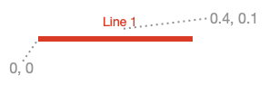

<!-- Generated by documentation.js. Update this documentation by updating the source code. -->

### Table of Contents

-   [Introduction][1]
-   [Diagram][2]
-   [Diagram][3]
    -   [htmlId][7]
    -   [addElements][8]
-   [OBJ_Diagram][11]
-   [Diagram Elements][13]
-   [DiagramElement][14]
    -   [pulse][17]
    -   [setPosition][19]
    -   [setRotation][21]
    -   [setScale][23]
    -   [setTransform][25]
    -   [setColor][27]
    -   [dim][29]
    -   [setDimColor][30]
    -   [undim][32]
    -   [getPath][33]
    -   [getBoundaries][34]
    -   [getBoundingRect][36]
    -   [getScale][38]
    -   [getRotation][39]
    -   [getVertexSpaceDiagramPosition][41]
    -   [getPosition][43]
    -   [show][45]
    -   [makeTouchable][46]
    -   [setMovable][48]
    -   [hide][50]
    -   [toggleShow][51]
    -   [isMoving][52]
    -   [isAnimating][53]
-   [DiagramElementPrimitive][54]
    -   [setAngleToDraw][56]
-   [DiagramElementCollection][58]
    -   [toFront][60]
    -   [toBack][62]
    -   [add][64]
    -   [getElement][66]
    -   [getElements][68]
-   [Geometric Definitions][70]
-   [Point][71]
    -   [x][74]
    -   [y][75]
    -   [\_dup][76]
    -   [scale][77]
    -   [sub][80]
    -   [add][83]
    -   [distance][86]
    -   [round][89]
    -   [clip][92]
    -   [transformBy][95]
    -   [rotate][98]
    -   [isEqualTo][101]
    -   [isNotEqualTo][104]
    -   [zero][107]
    -   [Unity][108]
-   [Rect][109]
    -   [left][112]
    -   [width][113]
    -   [height][114]
    -   [bottom][115]
    -   [top][116]
    -   [right][117]
    -   [\_dup][118]
    -   [isPointInside][119]
    -   [round][122]
-   [Line][124]
    -   [setP1][127]
    -   [setP2][129]
    -   [getPoint][131]
    -   [getYFromX][133]
    -   [getXFromY][135]
    -   [getYIntercept][137]
    -   [getXIntercept][138]
    -   [getGradient][139]
    -   [angle][140]
    -   [round][141]
    -   [length][143]
    -   [midPoint][144]
    -   [pointAtPercent][145]
    -   [pointAtLength][147]
    -   [hasPointAlong][149]
    -   [distanceToPoint][151]
    -   [hasPointOn][153]
    -   [isEqualTo][155]
    -   [isWithinDelta][157]
    -   [hasLineWithin][159]
    -   [isAlongLine][161]
    -   [isWithinLine][163]
    -   [offset][165]
    -   [isParallelWith][167]
    -   [intersectsWith][169]
-   [Transform][171]
    -   [standard][173]
    -   [translate][174]
    -   [rotate][176]
    -   [scale][178]
    -   [remove][180]
    -   [calcMatrix][182]
    -   [t][183]
    -   [clipRotation][185]
    -   [updateTranslation][187]
    -   [s][189]
    -   [toDelta][191]
    -   [updateScale][193]
    -   [r][195]
    -   [updateRotation][197]
    -   [m][199]
    -   [matrix][200]
    -   [isSimilarTo][201]
    -   [isEqualTo][203]
    -   [isWithinDelta][205]
    -   [sub][207]
    -   [add][209]
    -   [mul][211]
    -   [transform][213]
    -   [transformBy][215]
    -   [round][217]
    -   [clip][219]
    -   [isZero][221]
    -   [\_dup][223]
    -   [identity][224]
-   [TypeParsablePoint][225]
-   [TypeParsableRect][227]
-   [TypeParsableLine][229]
-   [TypeParsableTransform][231]
-   [getPoint][233]
-   [getScale][235]
-   [getRect][237]
-   [getLine][239]
-   [getTransform][241]
-   [Shapes][243]
-   [OBJ_Texture][244]
-   [OBJ_Polyline][246]
-   [OBJ_Polygon][249]
-   [Text][252]
-   [OBJ_Font][253]
-   [OBJ_TextDefinition][256]
-   [OBJ_Text][258]
-   [OBJ_TextLineDefinition][261]
-   [OBJ_TextLine][263]
-   [OBJ_TextLinesDefinition][266]
-   [OBJ_TextModifierDefinition][268]
-   [OBJ_TextModifiersDefinition][270]
-   [OBJ_TextLines][272]
-   [Animation][275]
-   [AnimationManager][276]
    -   [new][280]
    -   [builder][283]
    -   [rotation][285]
    -   [scale][288]
    -   [trigger][290]
    -   [delay][292]
    -   [translation][294]
    -   [position][296]
    -   [color][298]
    -   [opacity][300]
    -   [transform][302]
    -   [dissolveIn][304]
    -   [dissolveOut][306]
    -   [dim][308]
    -   [undim][310]
    -   [scenario][312]
    -   [scenarios][314]
    -   [cancel][316]
    -   [start][318]
    -   [getRemainingTime][320]
-   [AnimationBuilder][322]
    -   [custom][324]
    -   [rotation][326]
    -   [position][328]
    -   [translation][330]
    -   [scale][332]
    -   [transform][334]
    -   [scenario][336]
    -   [scenarios][338]
    -   [color][340]
    -   [opacity][342]
    -   [dissolveOut][344]
    -   [dissolveIn][346]
    -   [dim][348]
    -   [undim][350]
    -   [delay][352]
    -   [trigger][354]
    -   [inParallel][356]
    -   [inSerial][358]
-   [AnimationStep][360]
    -   [getRemainingTime][363]
    -   [start][365]
-   [SerialAnimationStep][367]
-   [ParallelAnimationStep][369]
-   [DelayAnimationStep][371]
-   [TriggerAnimationStep][373]
-   [CustomAnimationStep][375]
-   [ElementAnimationStep][377]
-   [PositionAnimationStep][379]
-   [RotationAnimationStep][381]
-   [ScaleAnimationStep][383]
-   [TransformAnimationStep][385]
-   [ScenarioAnimationStep][387]
-   [ColorAnimationStep][389]
-   [DimAnimationStep][391]
-   [UndimAnimationStep][393]
-   [OpacityAnimationStep][395]
-   [DissolveInAnimationStep][397]
-   [DissolveOutAnimationStep][399]
-   [OBJ_AnimationBuilder][401]
-   [OBJ_AnimationStep][403]
-   [OBJ_AnimationStart][405]
-   [OBJ_SerialAnimationStep][407]
-   [OBJ_ParallelAnimationStep][409]
-   [OBJ_TriggerAnimationStep][411]
-   [OBJ_CustomAnimationStep][413]
-   [OBJ_ElementAnimationStep][415]
-   [OBJ_PositionAnimationStep][417]
-   [OBJ_RotationAnimationStep][419]
-   [OBJ_ScaleAnimationStep][421]
-   [OBJ_TransformAnimationStep][423]
-   [OBJ_ScenarioAnimationStep][425]
-   [OBJ_ScenarioVelocity][427]
-   [OBJ_ScenariosAnimationStep][429]
-   [OBJ_ColorAnimationStep][431]
-   [OBJ_OpacityAnimationStep][433]
-   [Equation Elements Types][435]
-   [TypeEquationElements][436]
-   [Equation Layout OBJECTS][437]
-   [EQN_Container][438]
-   [EQN_Fraction][441]
-   [EQN_Scale][444]
-   [EQN_Bracket][447]
-   [EQN_Root][450]
-   [EQN_Strike][453]
-   [EQN_Box][456]
-   [EQN_Bar][459]
-   [EQN_Integral][462]
-   [EQN_SumOf][465]
-   [EQN_ProdOf][468]
-   [EQN_Subcript][471]
-   [EQN_Superscript][474]
-   [EQN_SuperscriptSubscript][477]
-   [EQN_Comment][480]
-   [EQN_StrikeComment][483]
-   [EQN_Pad][486]
-   [EQN_Matrix][489]
-   [EQN_Annotate][492]
-   [EQN_Annotation][495]
-   [EQN_EncompassGlyph][498]
-   [EQN_LeftRightGlyph][501]
-   [EQN_TopBottomGlyph][504]
-   [EQN_Glyphs][507]
-   [Equation Symbol OBJECTS][509]
-   [EQN_VinculumSymbol][510]
-   [EQN_BoxSymbol][513]
-   [EQN_ArrowSymbol][516]
-   [EQN_SumSymbol][519]
-   [EQN_ProdSymbol][522]
-   [EQN_IntegralSymbol][525]
-   [EQN_StrikeSymbol][528]
-   [EQN_BracketSymbol][531]
-   [EQN_AngleBracketSymbol][534]
-   [EQN_BraceSymbol][537]
-   [EQN_BarSymbol][540]
-   [EQN_SquareBracketSymbol][543]
-   [EQN_RadicalSymbol][546]
-   [Equation Form Types][549]
-   [TypeEquationPhrase][550]
-   [TypeFormAlignment][552]
-   [TypeFormAnimationProperties][554]
-   [TypeFormTranslationProperties][557]
-   [TypeEquationFormObject][559]
-   [TypeEquationForm][562]
-   [TypeEquationForms][563]
-   [TypeFormRestart][564]
-   [Equation Option Types][566]
-   [EQN_Equation][567]
-   [TypeEquationGoToFormOptions][569]
-   [Equations][571]
-   [Equation][572]
    -   [eqn][575]
    -   [setFormSeries][577]
    -   [getFormSeries][579]
    -   [addElements][580]
    -   [addForms][582]
    -   [getCurrentForm][584]
    -   [setCurrentForm][585]
    -   [showForm][587]
    -   [getForm][589]
    -   [goToForm][591]
    -   [prevForm][593]
    -   [nextForm][595]
    -   [replayCurrentForm][597]
-   [tools][599]
    -   [g2][600]
        -   [TypeF1DefRect][601]
    -   [range][603]
-   [tools][605]
-   [CurvedPathOptionsType][607]
-   [Intersect][609]
-   [Rotation][611]
    -   [matrix][613]
    -   [sub][614]
    -   [round][616]
    -   [add][618]
    -   [mul][620]
    -   [\_dup][622]
-   [Translation][623]
    -   [matrix][625]
    -   [sub][626]
    -   [add][628]
    -   [mul][630]
    -   [round][632]
    -   [\_dup][634]
-   [Scale][635]
    -   [matrix][637]
    -   [sub][638]
    -   [round][640]
    -   [add][642]
    -   [mul][644]
    -   [\_dup][646]
-   [round][647]
-   [OBJ_CurvedCorner][649]
-   [OBJ_Rectangle][651]
-   [OBJ_LineStyle][654]
-   [DiagramPrimitives][656]
    -   [polygon][657]
-   [TypeWhen][659]
-   [OBJ_Scenario][660]
-   [PulseOptions][662]
-   [DiagramElementMoveFreely][664]
-   [DiagramElementMove][666]
-   [Scenarios][668]
-   [ElementMovementState][670]
-   [ElementPulseState][672]
-   [ElementState][674]
-   [DrawingObject][676]
-   [TypeEquationTextElement][678]
-   [container][680]
-   [frac][683]
-   [AnimationProgression][686]
-   [AnimationStartTime][688]

## Introduction

This will introduce some key terms and concepts that are found frequently throughout the documentation.

#### Diagrams, Primitives and Collections

**FigureOne** allows you to create a _figure_, or _diagram_ that can be both interactive and animated.

A diagram has one or more _diagram elements_. A diagram element is a simple shape, some text, or it may be a collection of other elements. These elements combine to create a complex drawing, graph or equation.

In the language of **FigureOne**, there are two types of [DiagramElements][689]:

-   [DiagramElementPrimitive][54] - an element that will draw something to the screen, such as a line, shape or text
-   [DiagramElementCollection][58] - collections of primitives or other collections

Each [DiagramElement][14] has a [Transform][171] that may contain one or more translations, rotations and scaling factors. When the element is rendered to the screen, the transform will be applied. In the case of a [DiagramElementPrimitive][54], the shape or text will be transformed. In the case of a [DiagramElementCollection][58], all the diagram elements it contains will have the transform applied to them.

This means there is a heierachy of [DiagramElement][14] objects, where the parent transform is applied to (cascaded with) the child transform. Therefore collections can be thought of as modular building blocks of a more complex figure.

Changing an element's transform moves the element through space. Changing the element's transform over time animates the element.

#### An Example

Let's say we want to create a rotating labeled line. As the line is rotated, the label follows the line.

<p style="text-align: center"></p>

To create this diagram, we might use a diagram element hierarchy like:

<p style="text-align: center"></p>

The drawn elements, the line and text, are primitives. They are created in the simple no rotation case. If the line is 0.8 long, and it starts at (0, 0), then the text might be at (0.4, 0.1)

<p style="text-align: center"></p>

The diagram itself has limits that define the coordinate window that can be shown, in this case its bottom left is the origin, and it is 3 wide and 2 high. We want the collection to be rotated, with the center of rotation at the center of the diagram. Therefore we apply a rotation and translation transform to the collection.

<p style="text-align: center"></p>

There are several different ways to create the same diagram, but this way is used as it highlights how a collection can be used to transform a group of primitive elements.

#### Coordinate spaces

FigureOne renders shapes in WebGL, text in Context2D and can even manipulate html elements as diagram elements. As WebGL is used most in FigureOne, it will be used as an example to introduce coorindate spaces and why they matter.

WebGL is rendered in a html [canvas][690] element.

The [canvas][690] element is defined in screen pixels. The WebGL view re-maps the canvas pixels to -1 to +1 coordinates in both the vertical and horizontal directions, independent on the aspect ratio of the canvas.

When the canvas aspect ratio is not a square, or it is more convenient to create a diagram in a coordinate space not mapped between -1 to +1, then it is useful to have a separate _diagram space_. In the example above, the diagram space re-maps the _GL space_ to 0 to 3 in the horizontal and 0 to 2 in the vertical.

These are three examples of different coordinate spaces - _pixel space_, _GL space_ and _diagram space_.

If you want to move or modify an element, you need to think about what you want to modify it _relative_ to. Do you want to move it relative to other elements in the diagram? In other words, do you want to move it in _diagram space_? Or do you want to move it relative to other elements within the parent, or local collection - _local space_. Alternately, you might want to modify the vertices of the shape, in _vertex space_.

In simple diagrams, where no collections are used, or collections don't transform their child elements you don't really need to think about what space you are working in. Diagram space will be the same as local space and vertex space. You won't care about the higher level GL or pixel spaces.

But if you have transformed collections, or if you are tying an element to a location on the screen you will need to convert points between the different spaces. In addition, it is useful to know about these different spaces as sometimes they are referred to in the documentation.

One way to think about what space you are modifying is:

-   Elements that are direct children of the diagram: element transforms are in diagram space
-   Elements that are direct children of a collection: element transforms are in local space (the space of the parent colleciton)
-   Vertex definitions in element primitives: vertex space

For example, a square might be defined in vertex space as a square with length 1, centered around the origin.

The transform of the diagram element primitive that controls the square will move the square in _local space_ - the space relative to all other elements that are the children of the same parent collection.

If the parent collection's parent is the diagram itself, then its transform will move the colleciton in diagram space.

Converting between spaces is relatively straight forward. All diagram elements have methods to find their position or bounds in _diagram_, _local_ or _vertex_ space. The diagram has transforms that allow conversion between _diagram_, _GL_ and _pixel_ spaces.

Where this is useful is if two primitives have different parents, and you want to move one to be in the same position as the other. To do this you would convert the target element position to _diagram space_, and then to the _local space_ of the element to move.

#### Drawing

When it is time to draw the scene, the diagram will pass an initial transform to the first element in the hierarchy. In the example above, the "Labeled Line" collection. This transform will include any translations and scaling needed to convert from _diagram_ space to _GL_ space for actual rendering.

The "Labeled Line" collection will then cascade this transform with it's own rotation and translation transform, and pass this to its children, the "Label" and "Line" primitives.

The "Label" primitive has it's own transform that translates it to the middle of the horizontal line in _local_ space. The transform will be combined with the one from its parent, creating a final transform to draw the label with.

The primitive's shape or text definition never needs to change. At draw time, it is simply transformed by it's own transform and all the ancestors directly above it in the hierarchy. This is the same method used by WebGL as it reduces the amount of memory that needs to be loaded into the graphics memory each draw frame. All the vertices of a shape are loaded into the graphics memory just once, and each frame just a transform is passed informs the graphics processor how to orient the vertices.

If you have a dynamic shape whose vertices do change every frame (like a morphing animation), you can choose to load the vertices every frame. However, depending on the performance of the browser's host machine, and the number of vertices being adjusted, you might see a performance impact compared to a shape with a similar amount of vertices that do not change.

#### Code

Finally, let's see the code for the example above. Two files, `index.html` and `index.js` should be in the same folder.

```html
<!-- index.html -->
<!doctype html>
<html>
<body>
    <div id="figureOneContainer" style="width: 1200px; height: 800px; background-color: white;">
    </div>
    <script type="text/javascript" src='https://cdn.jsdelivr.net/npm/figureone@0.2.3/figureone.min.js'></script>
    <script type="text/javascript" src='./index.js'></script>
</body>
</html>
```

```javascript
// index.js
const diagram = new Fig.Diagram({ limits: [0, 0, 6, 4 ]});
diagram.addElement(
  {
    name: 'labeledLine',
    method: 'collection',
    addElements: [
      {
        name: 'line',
        method: 'line',
        options: {
          p1: [0, 0],
          p2: [2, 0],
          width: 0.01,
          color: [0, 0, 1, 1],
        },
      },
      {
        name: 'label',
        method: 'text',
        options: {
          text: 'Line 1',
          position: [1, 0.1],
          font: { color: [0, 0, 1, 1] },
          xAlign: 'center',
        },
      },
    ],
    options: {
      position: [3, 2],
    },
    mods: {
      isTouchable: true,
      isMovable: true,
      touchInBoundingRect: true,
      move: {
        type: 'rotation',
      },
    },
  },
);
diagram.elements.isTouchable = true;
diagram.initialize();
```

#### Using FigureOne

The example above shows how a figure can be defined with simple javascript objects, able to be encoded simply in JSON. This means complex figures or modules can be shared and reused easily.

For many uses, it is fine to fully define a diagram and all its elements before a user interacts with it.

Diagrams can also be defined more dynamically, such as in the example below which has exactly the same function as the example above.

```javascript
// index.js
const diagram = new Fig.Diagram({ limits: [0, 0, 6, 4 ]});
diagram.initialize();

const label = diagram.create.text({
  text: 'Line 1',
  position: [1, 0.1],
  font: { color: [0, 0, 1, 1] },
  xAlign: 'center',
});
const line = diagram.create.line({
  p1: [0, 0],
  p2: [2, 0],
  width: 0.01,
  color: [0, 0, 1, 1],
});
const labeledLine = diagram.create.collection({});
diagram.elements.add('labeledLine', labeledLine);
labeledLine.add('line', line);
labeledLine.add('label', label);
labeledLine.setPosition(3, 2);
labeledLine.move.type = 'rotation';
labeledLine.touchInBoundingRect = true;
labeledLine.setMovable();
```


## Diagram


## Diagram

Class to create a diagram.

By default, a diagram will attach a WebGL canvas and Context2D
canvas to the html `div` element with id `"figureOneContainer"`.

To attach to a different `div`, use the `htmlId` property in the class
constructor.

The diagram manages all drawing elements, rendering the drawing elements
on browser animation frames and listens for guestures from the user.

The diagram also has a recorder, allowing to record and playback states,
and gestures.

If a diagram is paused, then all drawing element animations will
also be paused.

It also has a number of convenience functions for create drawing elements
already attached to the drawing canvases, and useful transforms for
converting between the different spaces (e.g. pixel, GL, diagram).

### Parameters

-   `options` **[OBJ_Diagram][691]** 

### Properties

-   `create` **[DiagramPrimitives][692]** create elements with this

### Examples

```javascript
// Simple html and javascript example to create a diagram, and add a
// hexagon.
//
// For additional examples, see https://github.com/airladon/FigureOne
//
// Two files `index.html` and `index.js` in the same directory

// index.html
<!doctype html>
<html>
<body>
    <div id="figureOneContainer" style="width: 800px; height: 800px; background-color: white;">
    </div>
    <script type="text/javascript" src='https://cdn.jsdelivr.net/npm/figureone@0.2.3/figureone.min.js'></script>
    <script type="text/javascript" src='./index.js'></script>
</body>
</html>

// index.js
const diagram = new Fig.Diagram({ limits: [-1, -1, 2, 2 ]});
diagram.addElement(
  {
    name: 'p',
    method: 'polygon',
    options: {
      radius: 0.5,
      fill: true,
      sides: 6,
    },
  },
);
diagram.initialize();
```

```javascript
// Alternately, an element can be added programatically
// index.js
const diagram = new Fig.Diagram({ limits: [-1, -1, 2, 2 ]});
const p = diagram.shapes.polygon({})
diagram.addElement(
  {
    name: 'p',
    method: 'polygon',
    options: {
      radius: 0.5,
      fill: true,
      sides: 6,
    },
  },
);
```

### htmlId

id of DIV that diagram is tied to

Type: [string][693]

### addElements

Add elements to diagram

#### Parameters

-   `elementsToAdd` **[Array][694]&lt;TypeAddElementObject>** array of element definitions
-   `collection` **[DiagramElementCollection][695]** the
    collection to add elements to (optional, default `this.elements`)
-   `addElementsKey` **[string][693]** key to add elements (optional, default `'addElements'`)

#### Examples

```javascript
diagram.addElements([
  { name: 'shape1', method: 'polygon', options: { position: [0, 0] } },
  { name: 'shape2', method: 'polygon', options: { position: [1, 1] } },
]);
```

## OBJ_Diagram

Diagram options object

### Properties

-   `htmlId` **[string][693]?** HTML `div` tag `id` to tie diagram to (`"figureOneContainer"`)
-   `limits` **[TypeParsableRect][696]?** limits (bottom left
     corner at (-1, -1), width 2, height 2)

## Diagram Elements


## DiagramElement

Diagram Element base class

The set of properties and methods shared by all diagram elements

A diagram element has several color related properties. Color is
defined as an RGBA array with values between 0 and 1. The alpha
channel defines the transparency or opacity of the color where
1 is fully opaque and 0 is fully transparent.

The `color` property stores the element's current color, while the
`defaultColor` property stores the element's color when not dimmed or
dissolving. Color should only be set using the `setColor` method.

An element can be "dimmed" or "undimmed". For instance,
a red element might turn grey when dimmed. The property
`dimColor` stores the desired color to dim to and should be set with
`setDimColor()`

An element can be dissolved in or out with animation. Dissolving
an element out transitions its opacity from its current value to 0.
The `opacity` property is used when dissolving. The opacity is multiplied by
the alpha channel of `color` to net a final opacity. Opacity should not be
set directly as it will be overwritten by dissolve animations.

### Parameters

-   `transform` **[Transform][697]**  (optional, default `new Transform()`)
-   `diagramLimitsOrDiagram` **([Diagram][698] \| [Rect][699])**  (optional, default `new Rect(-1,-1,2,2)`)
-   `parent` **([DiagramElement][700] | null)**  (optional, default `null`)

### Properties

-   `name` **[string][693]** reference name of element
-   `isShown` **[boolean][701]** if `false` then element will not be processed on
    next draw
-   `transform` **[Transform][697]** transform to apply element
-   `lastDrawTransform` **[Transform][697]** transform last used for drawing -
    includes cascade or all parent transforms
-   `parent` **([DiagramElement][700] | null)** parent diagram element - `null` if
    at top level of diagram
-   `diagram` **[Diagram][698]** diagram element is attached to
-   `isTouchable` **[boolean][701]** must be `true` to move or execute `onClick`
-   `isMovable` **[boolean][701]** must be `true` to move
-   `color` **\[[number][702], [number][702], [number][702], [number][702]]** element's current
    color defined as red, green, blue, alpha with range 0 to 1
-   `dimColor` **\[[number][702], [number][702], [number][702], [number][702]]** color to use when
    dimming element
-   `opacity` **[number][702]** number between 0 and 1 that is multiplied with
    `color` alpha channel to get final opacity
-   `move` **[DiagramElementMove][703]** movement parameters
-   `scenarios` **[Scenarios][704]** scenario presets
-   `animations` **[AnimationManager][705]** element animation manager
-   `subscriptions` **SubscriptionManager** subscription manager for
    element

### pulse

Pulse element

Either pass in a callback, or an options object defining the pulse and
callback.

#### Parameters

-   `optionsOrDone` **(null | [PulseOptions][706] | function (): void)**  (optional, default `null`)

### setPosition

Conveniently set the first `translation` of the element's `transform`.

#### Parameters

-   `pointOrX` **([TypeParsablePoint][707] \| [number][702])** x coordinate or full point
    definition
-   `y` **[number][702]** y coordinate if `pointOrX` is just the x coordinate (`0`) (optional, default `0`)

### setRotation

Conveniently set the first `rotation` of the element's `transform`.

#### Parameters

-   `rotation` **[number][702]** 

### setScale

Conveniently set the first `scale` of the element's `transform`.

#### Parameters

-   `scaleOrX` **([TypeParsablePoint][707] \| [number][702])** horizontal scale - either
    define as full x-y point, or as a number. If scaleOrX is a `number` and
    `y` is null, then both `x` and `y` will be equally scaled
-   `y` **([number][702] | null)** y coordinate if `scaleOrX` is a `number` (`null`) (optional, default `null`)

### setTransform

Set transform of element. Setting through this method will ensure
`setTransfrom` subscription will publish, and transform will be
appropriately clipped.

#### Parameters

-   `transform` **[Transform][697]** 

Returns **void** 

### setColor

Set element color.

#### Parameters

-   `color` **\[[number][702], [number][702], [number][702], [number][702]]** RGBA color from 0 to 1
-   `setDefault` **[boolean][701]?** also set the default color to this color (optional, default `true`)

### dim

Set element color to `dimColor`

### setDimColor

Set `dimColor` property

#### Parameters

-   `color` **[Array][694]&lt;[number][702]>** 

### undim

Set element color to `defaultColor`

### getPath

Return diagram path of element

Returns **[string][693]** path of element relative to diagram

### getBoundaries

Get boundaries of element.

A closed boundary is an array of points.

An element may have one or more closed boundaries, and so boundaries
is an array of an array of points.

#### Parameters

-   `space` **(`"local"` \| `"diagram"` \| `"vertex"` \| `"gl"`)** boundaries relative
    to which space (optional, default `'local'`)

Returns **[Array][694]&lt;[Array][694]&lt;[Point][708]>>** An array of closed boundaries

### getBoundingRect

Get bounding rect of element.

An element may have one or more closed boundaries. The bounding rect
is the rectangle that encapsulates all boundaries.

#### Parameters

-   `space` **(`"local"` \| `"diagram"` \| `"vertex"` \| `"gl"`)** bounding rect relative
    to a space (optional, default `'local'`)

Returns **[Rect][699]** bounding rect of element

### getScale

Return the first scale in the element's transform. Will return
`[1, 1]` if element's transform doesn't have a scale.

Returns **[Point][708]** scale

### getRotation

Return the first rotation in the element's transform. Will return
`0` if the element's transform doesn't have a rotation.

#### Parameters

-   `normalize` **(`"0to360"` \| `"-180to180"` \| `""`)** how to normalize the
    returned angle where `''` returns the raw angle (optional, default `''`)

Returns **[Point][708]** scale

### getVertexSpaceDiagramPosition

Return the diagram space position of a point in this element's
vertex space.

#### Parameters

-   `vertexSpacePoint` **[Point][708]** 

Returns **[Point][708]** diagram space equivalent point

### getPosition

Get position of element

By default the first translation of the element's transform is returned.
This is effectively the element's location in 'local' coordinates.

The position of the element relative to its horizontal and vertical bounds
can also be returned. Use `xAlign` to find the x coordinate of the left,
center, right or percentage width from left of the element. Use `yAlign`
to find the bottom, middle, top or percentage height from bottom of the
element.

#### Parameters

-   `space` **(`"local"` \| `"diagram"` \| `"gl"` \| `"vertex"`)** the space to return
    the position in (optional, default `'local'`)
-   `xAlign` **(`"center"` \| `"left"` \| `"right"` \| `"location"` \| [number][702])** horizontal alignment of position. Use a `number` to define the horizontal
    position in percentage width from the left. (optional, default `'location'`)
-   `yAlign` **(`"middle"` \| `"top"` \| `"bottom"` \| `"location"` \| [number][702])** vertical alignment of position. Use a `number` to define the vertical
    position in percentage height from the bottom. (optional, default `'location'`)

### show

Show element

### makeTouchable

Configure all parents to, and make this element touchable

#### Parameters

-   `makeThisElementTouchable` **[boolean][701]**  (optional, default `true`)

### setMovable

Configure all parents to make this element touchable, and
make this element touchable and movable

#### Parameters

-   `movable` **[boolean][701]** `true` to make movable, `false` to not (optional, default `true`)

### hide

Hide element

Returns **void** 

### toggleShow

Toggle hide/show of element

### isMoving

Returns **[boolean][701]** `true` if element is moving

### isAnimating

Returns **[boolean][701]** `true` if element is animating

## DiagramElementPrimitive

**Extends DiagramElement**

Primitive diagram element

A primitive diagram element is one that handles an object (`drawingObject`)
that draws to the screen. This object may be a [VertexObject][709], a
[TextObject][710] or a [{HTMLObject][711]}.

### Parameters

-   `drawingObject` **[DrawingObject][712]** an object that handles drawing
    to the screen or manages a HTML element
-   `transform` **[Transform][697]** initial transform to set (optional, default `new Transform()`)
-   `color` **\[[number][702], [number][702], [number][702], [number][702]]** color to set (optional, default `[0.5,0.5,0.5,1]`)
-   `diagramLimits` **[Rect][699]** limits of diagram (optional, default `new Rect(-1,-1,2,2)`)
-   `parent` **([DiagramElement][700] | null)** parent element (optional, default `null`)

### setAngleToDraw

Set angle to draw.

Some primitive elements can be partially drawn to some angle.

An angle of -1 represents the maximum angle allowed by the primitive.

#### Parameters

-   `angle` **[number][702]** Angle to draw (optional, default `-1`)

## DiagramElementCollection

**Extends DiagramElement**

Collection diagram element

A collection manages a number of children [DiagramElements][689], be they
primitives or collections.

A collection's transform will be passed onto all the children elements.

### Parameters

-   `transform` **[Transform][697]** initial transform to set (optional, default `new Transform()`)
-   `diagramLimits` **[Rect][699]** limits of diagram (optional, default `new Rect(-1,1,2,2)`)
-   `parent` **([DiagramElement][700] | null)** parent element (optional, default `null`)

### toFront

Move child elements to end of draw order - effectively moving to the back
of the drawn collection. Later elements in the array will be further back.

#### Parameters

-   `elements` **[Array][694]&lt;([string][693] \| [DiagramElement][700])>** 

### toBack

Move child elements to end of draw order - effectively moving them to
the front of the drawn collection. Later elements in the `elements` array
will be drawn further forawrd.

#### Parameters

-   `elements` **[Array][694]&lt;([string][693] \| [DiagramElement][700])>** 

### add

Add a diagram element to the collection.

#### Parameters

-   `name` **[string][693]** reference name of element
-   `element` **[DiagramElement][700]** element to add
-   `index` **[number][702]** index to add in the `drawOrder` where -1 appends the
    element to the end of the draw order, (optional, default `-1`)

### getElement

Get element from an element path with '.' separators.

For instance, if a collection has a child collection 'a', which
has a child primitive 'b', then the path would be: 'a.b'.

#### Parameters

-   `elementPath` **(null | [string][693] \| [DiagramElement][700])**  (optional, default `null`)

Returns **([DiagramElement][700] | null)** element at path. If `elementPath`
is `null`, then this element is returned. If `elementPath` is invalid
then `null` is returned.

### getElements

Returns an array of result from
[getElement][713] calls on an
array of paths.

#### Parameters

-   `children` **[Array][694]&lt;([string][693] \| [DiagramElement][700])>** 

Returns **[Array][694]&lt;[DiagramElement][700]>** Array of
[getElement][713] results

## Geometric Definitions


## Point

Object representing a point.

Contains methods that makes it conventient to add, subtract and
transform points.

### Parameters

-   `x` **[number][702]** x coordinate of point
-   `y` **[number][702]** y coordinate of point

### Examples

```javascript
// get Point from Fig
const { Point } = Fig;

// define a point at (0, 2)
const p = new Point(0, 2);

// find the distance to another point (0, 1) which will be 1
const d = p.distance([0, 1]);

// add to another point (3, 1) which will result in (3, 3)
const q = p.add(3, 1);
```

### x

x value of point

Type: [number][702]

### y

y value of point

Type: [number][702]

### \_dup

Return a duplicate of the [Point][71] object

Returns **[Point][708]** 

### scale

Scale x and y values of point by scalar

#### Parameters

-   `scalar` **[number][702]** 

#### Examples

```javascript
p = new Point(1, 1);
s = p.scale(3);
// s = Point{x: 3, y: 3};
```

Returns **[Point][708]** 

### sub

Subtract (x, y) values or a [Point][71] and return the difference as a new [Point][71]

#### Parameters

-   `pointOrX` **([Point][708] \| [number][702])** 
-   `y` **[number][702]**  (optional, default `0`)

#### Examples

```javascript
p = new Point(3, 3);
d = p.sub(1, 1)
// d = Point{x: 2, y: 2}

p = new Point(3, 3);
q = new Point(1, 1);
d = p.sub(q)
// d = Point{x: 2, y: 2}
```

Returns **[Point][708]** 

### add

Add (x, y) values or a [Point][71] and return the sum as a new [Point][71]

#### Parameters

-   `pointOrX` **([Point][708] \| [number][702])** 
-   `y` **[number][702]**  (optional, default `0`)

#### Examples

```javascript
p = new Point(3, 3);
d = p.add(1, 1)
// d = Point{x: 4, y: 4}

p = new Point(3, 3);
q = new Point(1, 1);
d = p.add(q)
// d = Point{x: 4, y: 4}
```

Returns **[Point][708]** 

### distance

Return the distance between the point and the origin

#### Parameters

-   `toPointIn` **([TypeParsablePoint][707] | null)**  (optional, default `null`)

#### Examples

```javascript
p = new Point(1, 1);
d = p.distance();
// d = 1.4142135623730951
```

Returns **[number][702]** 

### round

Return a new point with (x, y) values rounded to some precision

#### Parameters

-   `precision` **[number][702]**  (optional, default `8`)

#### Examples

```javascript
p = new Point(1.234, 1.234);
q = p.round(2);
// q = Point{x: 1.23, y: 1.23}
```

Returns **[Point][708]** 

### clip

Return a new point that is clipped to min and max values from the origin.

Use a point as a parameter to define different (x, y) min/max values,
a number to define the same (x, y) min/max values, or null to have no
min/max values.

#### Parameters

-   `min` **([Point][708] \| [number][702] | null)** 
-   `max` **([Point][708] \| [number][702] | null)** 

#### Examples

```javascript
p = new Point(2, 2);
q = p.clip(1, 1);
// q = Point{x: 1, y: 1}

p = new Point(2, 2);
q = p.clip(1, null);
// q = Point{x: 1, y: 2}

p = new Point(-2, -2);
minClip = new Point(-1, -1.5);
q = p.clip(minClip, null);
// q = Point{x: -1, y: -1.5}
```

Returns **[Point][708]** 

### transformBy

Transform the point with a 3x3 matrix (2 dimensional transform)

#### Parameters

-   `matrix` **[Array][694]&lt;[number][702]>** 

#### Examples

```javascript
// Transform a point with a (2, 2) translation then 90º rotation
p = new Point(1, 1);
m = new Transform().translate(2, 2).rotate(Math.PI / 2).matrix();
// m = [0, -1, -2, 1, 0, 2, 0, 0, 1]
q = p.transformBy(m)
// q = Point{x: -3, y: 3}
```

Returns **[Point][708]** 

### rotate

Rotate a point some angle around a center point

#### Parameters

-   `angle` **[number][702]** in radians
-   `center` **[Point][708]**  (optional, default `new Point(0,0)`)

#### Examples

```javascript
// Rotate a point around the origin
p = new Point(1, 0);
q = p.rotate(Math.PI)
// q = Point{x: -1, y: 0}

// Rotate a point around (1, 1)
p = new Point(2, 1);
q = p.rotate(Math.PI, new Point(1, 1))
// q = Point{x: 0, y: 1}
```

Returns **[Point][708]** 

### isEqualTo

Compare two points for equality to some precision

#### Parameters

-   `p` **[Point][708]** 
-   `precision` **[number][702]**  (optional, default `8`)

#### Examples

```javascript
p = new Point(1.123, 1.123);
q = new Point(1.124, 1.124);
p.isEqualTo(q)
// false

p.isEqualTo(q, 2)
// true
```

### isNotEqualTo

Compare two points for unequality to some precision

#### Parameters

-   `p` **[Point][708]** 
-   `precision` **[number][702]?** 

#### Examples

```javascript
p = new Point(1.123, 1.123);
q = new Point(1.124, 1.124);
p.isNotEqualTo(q)
// true

p.isNotEqualTo(q, 2)
// false
```

### zero

Return a point at (0, 0)

Returns **[Point][708]** 

### Unity

Return a point at (1, 1)

Returns **[Point][708]** 

## Rect

An object representing a rectangle.

### Parameters

-   `left` **[number][702]** left location
-   `bottom` **[number][702]** bottom location
-   `width` **[number][702]** rectangle width
-   `height` **[number][702]** rectangle height

### Examples

```javascript
// get Rect from Fig
const { Rect } = Fig;

// define a rect centered at origin with width 4 and height 2
const r = new Rect(-2, -1, 4, 2);
```

### left

Left side x coordinate

### width

Rectange width

### height

Rectangle height

### bottom

Bottom side y coordinate

### top

Top side y coordinate

### right

Right side x coordinate

### \_dup

Return a duplicate rectangle object

### isPointInside

Returns `true` if `point` is within on on the border of the rectangle

#### Parameters

-   `point` **[TypeParsablePoint][707]** point to test
-   `precision` **[number][702]** precision to test (optional, default `8`)

#### Examples

```javascript
const r = new Rect(-2, -1, 4, 2);

// check if point is within the rectangle (will return `true`)
const result = r.isPointInside([0, 1]);
```

### round

Returns a rectangle with coordinates rounded to `precision`

#### Parameters

-   `precision` **[number][702]** precision to test (optional, default `8`)

## Line

Object representing a line.

A line is defined by two points, or a point and the distance and
angle to another point.

A finite line exists only between these two points.

An infinite line can extend beyond either or both of the points to infinity.

A line can also be defined as an infinite line by saying it extends beyond one

### Parameters

-   `p1` **[TypeParsablePoint][707]** 
-   `p2OrMag` **([TypeParsablePoint][707] \| [number][702] | null)** 
-   `angle` **[number][702]**  (optional, default `0`)
-   `ends` **(`0` \| `1` \| `2`)** number of ends the line has. `2` ends is a finite
    line. `1` end is an infinite line that terminates at the first point, and
    goes through the second point to infinity. `0` ends is an infinite line
    that goes through both first and second points to infinity. (optional, default `2`)

### Examples

```javascript
// get Line from Fig
const { Line } = Fig;

// define a finite line from [0, 0] to [1, 0] with a point, magnitude and
// angle
const l1 = new Line([0, 0], 1, 0)

// define a finite line from [0, 0] to [1, 0] with two points
const l2 = new Line([0, 0], [1, 0])

// define an infinite line from [0, 0], through [1, 0] and to infinity
const l3 = new Line([0, 0], [1, 0], 1)

// define an infinite line trough [0, 0] and [1, 0]
const l4 = new Line([0, 0], [1, 0], 0)
```

### setP1

Change p1 of the line

#### Parameters

-   `p1` **[TypeParsablePoint][707]** 

### setP2

Change p2 of the line

#### Parameters

-   `p2` **([Point][708] | \[[number][702], [number][702]])** 

### getPoint

Get p1 or p2

#### Parameters

-   `index` **(`1` \| `2`)**  (optional, default `1`)

Returns **[Point][708]** 

### getYFromX

Get the y coordinate of a point on the line with a given x coordinate

#### Parameters

-   `x` **[number][702]** 

Returns **([number][702] | null)** where `null` is returned if the line is vertical

### getXFromY

Get the x coordinate of a point on the line with a given y coordinate

#### Parameters

-   `y` **[number][702]** 

Returns **([number][702] | null)** where `null` is returned if the line is horiztonal

### getYIntercept

Get the y intercept (at x = 0) of line

Returns **([number][702] | null)** where `null` is returned if the line is vertical

### getXIntercept

Get the x intercept (at y = 0) of line

Returns **([number][702] | null)** where `null` is returned if the line is horizontal

### getGradient

Get the gradient of the line

Returns **[number][702]** 

### angle

Get the angle of the line from p1 to p2

Returns **[number][702]** 

### round

Return a duplicate line with values rounded to `precision`

#### Parameters

-   `precision` **[number][702]**  (optional, default `8`)

Returns **[Line][714]** 

### length

Return the distance between p1 and p2. Note, for infinite lines
this will still return the distance between p1 and p2 that defines
the line.

Returns **[number][702]** 

### midPoint

Return the midpoint between p1 and p2.

Returns **[Point][708]** 

### pointAtPercent

Return the point along some percent of the distance between p1 and p2.

#### Parameters

-   `percent` **[number][702]** 

Returns **[Point][708]** 

### pointAtLength

Return the point along the line at some length from p1

#### Parameters

-   `length` **[number][702]** 

Returns **[Point][708]** 

### hasPointAlong

`true` if `point` is along the line extended to infinity on both ends

#### Parameters

-   `point` **[TypeParsablePoint][707]** 
-   `precision` **[number][702]**  (optional, default `8`)

Returns **[boolean][701]** 

### distanceToPoint

Perpendicular distance from `point` to line

#### Parameters

-   `point` **[TypeParsablePoint][707]** 
-   `precision` **[number][702]**  (optional, default `8`)

Returns **[number][702]** 

### hasPointOn

`true` if `point` is on the line.

If the line has 2 or 1 finite ends, point must be on or between the
defined ends.

#### Parameters

-   `point` **[TypeParsablePoint][707]** 
-   `precision` **[number][702]**  (optional, default `8`)

Returns **[boolean][701]** 

### isEqualTo

`true` if two lines are equal to within some rounding `precision`.

#### Parameters

-   `line2` **[Line][714]** 
-   `precision` **[number][702]**  (optional, default `8`)

Returns **[boolean][701]** 

### isWithinDelta

`true` if two lines are within a delta of each other.

This is distinct from a rounding precision as it is an absolute
delta.

#### Parameters

-   `line2` **[Line][714]** 
-   `delta` **[number][702]**  (optional, default `0.00000001`)

Returns **[boolean][701]** 

### hasLineWithin

`true` if this line is within `line2`

#### Parameters

-   `line2` **[Line][714]** 
-   `precision` **[number][702]**  (optional, default `8`)

Returns **[boolean][701]** 

### isAlongLine

`true` if this line is along the infinite length of `line2`

#### Parameters

-   `line2` **[Line][714]** 
-   `precision` **[number][702]**  (optional, default `8`)

Returns **[boolean][701]** 

### isWithinLine

`true` if this line is contained within `line2`

#### Parameters

-   `line2` **[Line][714]** 
-   `precision` **[number][702]**  (optional, default `8`)

Returns **[boolean][701]** 

### offset

Create a line that is offset by some space from this line.

`'left'`, `'right'`, `'top'` and `'bottom'` are relative to cartesian
coordinates.

`'positive'` to the right of a vertical line defined from bottom to top and
above a horizontal line defined from right to left. Another way to think of
it is if lines are used to create a polygon in the positive rotation
direction (CCW), the the `'positive'` side will be on the outside of the
polygon.

`'negative'` is then the inside of the same polygon.

#### Parameters

-   `direction` **(`"left"` \| `"right"` \| `"top"` \| `"bottom"` \| `"positive"` \| `"negative"`)** 
-   `space` **[number][702]** 

Returns **[Line][714]** 

### isParallelWith

`true` if this line is parralel with `line2`

#### Parameters

-   `line2` **[Line][714]** 
-   `precision` **[number][702]**  (optional, default `8`)

Returns **[boolean][701]** 

### intersectsWith

The intersection between this line and `line2`.

The returned result is an [Intersect][609] object with keys `intersect`,
`alongLine` and `withinLine`. The `intersect` is found by extending both
lines to infinity and recording where they cross. If the two lines never
cross, and are not collinear, then the result will be `undefined`.
`alongLine` and `withinLine` can then be used as metadata to defermine if
the intersection is within finite lines or not.

The properties of the two lines, such as whether they have zero, finite,
or infinite length, and are parallel or collinear will define the result.

If the lines are not parallel and/or collinear then the returned intercept
will be the point where the two lines, extended to infinity, cross. The
`withinLine` returned property can then be used to determine if the
intercept point is within this line.

If one of the lines has zero length, then `intersect` will only be
defined if p1 of the zero length line lies along the other line.

If both of the lines have zero length, then `intersect` will only be
defined if p1 of both lines is the same.

If the lines are parallel and not collinear, then `intercept` will be
undefined.

If lines are collinear then the `intercept` point will be defined by how
many finite ends the lines have and wheter the lines are overlapping or
not

Lines are equal:

-   0 ends: take the yIntercept (or xIntercept if vertical)
-   1 ends: take the p1 point
-   2 ends: take the midPoint

One line within the other: take mid point between mid points

-   2 ends around 2 ends: take the midPoint of the two midPoints
-   0 ends around 2 ends: take the midPoint of the 2 ends
-   0 ends around 1 ends: take the p1 of the 1 ends
-   1 end around 1 end: take the midPoint between the p1s
-   1 end around 2 ends: take the midPoint of the two ends

Lines are not overlapping:

-   Both 2 ends - take midPoint between 2 closest ends
-   Both 1 ends - take midPoint between 2 p1s
-   One 1 end and 2 end - take midPoint between p1 and closest point

Lines are partially overlapping:

-   Both 2 ends - take midPoint between 2 overlapping ends
-   Both 1 ends - take midPoint between both p1s
-   One 1 end and 2 end - take midPoint between overlapping end and p1

#### Parameters

-   `line2` **[Line][714]** 
-   `precision` **[number][702]**  (optional, default `8`)

Returns **[Intersect][715]** 

## Transform

Object that represents a chain of [Rotation][285], [Translation][294] and
[Scale][77] transforms

### Parameters

-   `chainOrName` **([Array][694]&lt;([Translation][716] \| [Rotation][717] \| [Scale][718])> | [string][693])** chain
    of transforms to initialize this Transform with, or name of transform if
    not initializing with transforms. (optional, default `[]`)
-   `name` **[string][693]** transform name if `chainOrName` defines initializing
    transforms (optional, default `''`)

### standard

Return a standard unity transform chain that includes scale, rotation and
translation blocks

Returns **[Transform][697]** 

### translate

Return a duplicate transform with an added [Translation][294] transform

#### Parameters

-   `xOrTranslation` **([number][702] \| [Point][708])** 
-   `y` **[number][702]**  (optional, default `0`)
-   `name` **[string][693]**  (optional, default `this.name`)

Returns **[Transform][697]** 

### rotate

Return a duplicate transform with an added [Rotation][285] transform

#### Parameters

-   `r` **[number][702]** 
-   `name` **[string][693]**  (optional, default `this.name`)

Returns **[Transform][697]** 

### scale

Return a duplicate transform with an added [Scale][77] transform

#### Parameters

-   `xOrScale` **([number][702] \| [Point][708])** 
-   `y` **[number][702]**  (optional, default `0`)
-   `name` **[string][693]**  (optional, default `this.name`)

Returns **[Transform][697]** 

### remove

Remove some transforms from this transform chain

#### Parameters

-   `transformNames` **([string][693] \| [Array][694]&lt;[string][693]>)** 

Returns **[Transform][697]** 

### calcMatrix

Transform matrix of the transform chain

Returns **[Array][694]&lt;[number][702]>** 

### t

Retrieve the nth [Translation][294] transform value from this transform
chain where n = `translationIndex`. If `translationIndex` is invalid
(like if it is larger than the number of `Translation` transforms available)
then `null` will be returned.

#### Parameters

-   `translationIndex` **[number][702]**  (optional, default `0`)

Returns **([Point][708] | null)** 

### clipRotation

Clip all [Rotation][285] transforms within this transform chain to
angles between 0º-360º, -180º-180º, or not at all (`null`)

#### Parameters

-   `clipTo` **(`"0to360"` \| `"-180to180"` | null)** 

### updateTranslation

Return a duplicate transform chain with an updated the nth
[Translation][294] transform where n = `index`

#### Parameters

-   `x` **([number][702] \| [Point][708])** 
-   `yOrIndex` **[number][702]**  (optional, default `0`)
-   `index` **[number][702]**  (optional, default `0`)

Returns **[Transform][697]** 

### s

Retrieve the nth [Scale][77] transform value from this transform
chain where n = `scaleIndex`. If `scaleIndex` is invalid
(like if it is larger than the number of `Scale` transforms available)
then `null` will be returned.

#### Parameters

-   `scaleIndex` **[number][702]**  (optional, default `0`)

Returns **([Point][708] | null)** 

### toDelta

Return an interpolated transform between this transform and `delta` at
some `percent` between the two.

Interpolation can either be `'linear'` or '`curved'`.

#### Parameters

-   `delta` **[Transform][697]** 
-   `percent` **[number][702]** 
-   `translationStyle` **(`"linear"` \| `"curved"`)** 
-   `translationOptions` **pathOptionsType** 

Returns **[Transform][697]** 

### updateScale

Return a duplicate transform chain with an updated the nth
[Scale][77] transform where n = `index`

#### Parameters

-   `x` **([number][702] \| [Point][708])** 
-   `yOrIndex` **[number][702]?**  (optional, default `null`)
-   `index` **[number][702]**  (optional, default `0`)

Returns **[Transform][697]** 

### r

Retrieve the nth [Rotation][285] transform value from this transform
chain where n = `rotationIndex`. If `scaleIndex` is invalid
(like if it is larger than the number of `Rotation` transforms available)
then `null` will be returned.

#### Parameters

-   `rotationIndex` **[number][702]**  (optional, default `0`)

Returns **([Point][708] | null)** 

### updateRotation

Return a duplicate transform chain with an updated the nth
[Rotation][285] transform where n = `index`

#### Parameters

-   `r` **[number][702]** 
-   `index` **[number][702]**  (optional, default `0`)

Returns **[Transform][697]** 

### m

Return the matrix that respresents the cascaded transform chain

Returns **[Array][694]&lt;[number][702]>** 

### matrix

Return the matrix that respresents the cascaded transform chain

Returns **[Array][694]&lt;[number][702]>** 

### isSimilarTo

`true` if `transformToCompare` has the same order of [Rotation][285],
[Scale][77] and [Translation][294] transform elements in the transform
chain.

#### Parameters

-   `transformToCompare` **[Transform][697]** 

Returns **[boolean][701]** 

### isEqualTo

`true` if `transformToCompare` is equal to this transform within some
`precision`.

#### Parameters

-   `transformToCompare` **[Transform][697]** 
-   `precision` **[number][702]**  (optional, default `8`)

Returns **[boolean][701]** 

### isWithinDelta

`true` if `transformToCompare` is wihtin some `delta` of this transform.
`isEqualTo` rounds the values to some precision to compare values. In
comparison this will directly compare the delta between values. This may
be more useful than rounding when values are close to rounding thresholds.

#### Parameters

-   `transformToCompare` **[Transform][697]** 
-   `delta` **[number][702]**  (optional, default `0.00000001`)

Returns **[boolean][701]** 

### sub

-   **See: <a href="#transformissimilarto">Transform.isSimilarTo</a>
    **

Subtract each chain element in `transformToSubtract` from each chain
element in this transform chain. Both transform
chains must be similar and have the same order of [Rotation][285],
[Scale][77] and [Translation][294] transform elements

#### Parameters

-   `transformToSubtract` **[Transform][697]**  (optional, default `new Transform()`)

Returns **[Transform][697]** 

### add

-   **See: <a href="#transformissimilarto">Transform.isSimilarTo</a>
    **

Add each chain element in `transformToSubtract` to each chain
element in this transform chain. Both transform
chains must be similar and have the same order of [Rotation][285],
[Scale][77] and [Translation][294] transform elements

#### Parameters

-   `transformToAdd` **[Transform][697]**  (optional, default `new Transform()`)

Returns **[Transform][697]** 

### mul

-   **See: <a href="#transformissimilarto">Transform.isSimilarTo</a>
    **

Multiply each chain element in `transformToSubtract` with each chain
element in this transform chain. Both transform
chains must be similar and have the same order of [Rotation][285],
[Scale][77] and [Translation][294] transform elements

#### Parameters

-   `transformToMul` **[Transform][697]**  (optional, default `new Transform()`)

Returns **[Transform][697]** 

### transform

Return a transform chain that is `transform` transfomed by this transform
chain.

#### Parameters

-   `transform` **[Transform][697]** 

Returns **[Transform][697]** 

### transformBy

Return a transform chain that is this transform transformed by `transform`

#### Parameters

-   `transform` **[Transform][697]** 

Returns **[Transform][697]** 

### round

Return a duplicate transform with all values rounded

#### Parameters

-   `precision` **[number][702]**  (optional, default `8`)

Returns **[Transform][697]** 

### clip

-   **See: <a href="#transformissimilarto">Transform.isSimilarTo</a>
    **

Return a duplicate transform that is clipped to `minTransform` and
`maxTransform`. Both `minTransform` and `maxTransform` must be similar
to this transform meaning they must all share the same order of
[Rotation][285], [Scale][77] and [Translation][294] transform elements.

Use `limitLine` to clip the first [Translation][294] transform in the
chain to within a [Line][124].

#### Parameters

-   `minTransform` **[Transform][697]** 
-   `maxTransform` **[Transform][697]** 
-   `limitLine` **(null | [Line][714])** 

### isZero

`true` if all transforms within the transform chain are below the
`zeroThreshold`

#### Parameters

-   `zeroThreshold` **[number][702]**  (optional, default `0`)

Returns **[boolean][701]** 

### \_dup

Return a duplicate transform.

Returns **[Transform][697]** 

### identity

Return a duplicate transform chain where all transforms are
identity transforms.

## TypeParsablePoint

A [Point][71] can be defined in several ways

-   As a Point: new Point()
-   As an x, y tuple: [number, number]
-   As an x, y string: '[number, number]'
-   As a definition object: { f1Type: 'p', state: [number, number] }
    }


### Examples

```javascript
// p1, p2, p3 and p4 are all the same
p1 = new Point(2, 3);
p2 = [2, 3];
p3 = '[2, 3]';
p4 = { f1Type: 'p', state: [2, 3] };
```

## TypeParsableRect

A [Rectangle][Rect][109] can be defined as either as an

-   Array (left, bottom, width, height)
-   a [Rect][109] class
-   a string representing the json definition of the
    array form, or a [TypeF1DefRect][601].


### Examples

```javascript
// All rectangles are the same, with a lower left corner of `(-2, -1)`,
// a width of `4`, and a height of `2`
const r1 = getRect([-2, -1, 4, 2]);
const r2 = getRect(new Fig.Rect(-2, -1, 4, 2));
const r3 = getRect('[-2, -1, 4, 2]');
const r4 = getRect({
  f1Type: 'rect',
  state: [-2, -1, 4, 2],
});
```

## TypeParsableLine

A [Line][124] is defined with either two points, or a point, magbintude and angle.
The end definitions define if the line is finite or infinite. And end
definition of `2` means both ends are finite and the line stops at its
definition. `1` means the first end is finite, and the line extends through
the second point to infinity. `0` means the line extends through both
points to infinite on either side.

A line can be defined in several ways.

As a Line: `new Line()`

-   As two points: `[{@link TypeParsablePoint}, {@link TypeParsablePoint}]`
-   As two points and end definitions:
    `[{@link TypeParsablePoint}, {@link TypeParsablePoint}, 2 | 1 | 0]`
-   As a point, mag angle: `[{@link TypeParsablePoint}, number, number]`
-   As a point, mag angle and end definitions: '[number, number, 2, 1, 0]'
-   As a definition object where state is
    \[[p1.x, p1.y], [p2.x, p2.y], endDefinition]:
    { f1Type: 'l', state: \[[number, number], [number, number], 2 | 1 | 0 }


### Examples

```javascript
// l1, l2, l3, l4, l5 and l6 are all the same if parsed by `getLine`
l1 = new Line([0, 0], [2, 2]);
l2 = new Line([0, 0], 2 * Math.sqrt(2), Math.PI / 4);
l3 = new Line([0, 0], [2, 2], 2);
l4 = [[0, 0], [2, 2]];
l5 = [[0, 0], 2 * Math.sqrt(2), Math.PI / 4];
l6 = [[0, 0], [2, 2], 2];
```

## TypeParsableTransform

A [Transform][171] can be defined in several ways
As a Transform: new Transform()
As an array of ['s', number, number], ['r', number] and/or ['t', number, number] arrays
As a string representing the JSON of the array form
}


### Examples

```javascript
// t1, t2, and p3 are all the same
t1 = new Transform().scale(1, 1).rotate(0).translate(2, 2);
t2 = [['s', 1, 1], ['r', 0], ['t', 2, 2]];
t3 = '[['s', 1, 1], ['r', 0], ['t', 2, 2]]';
```

## getPoint

Parse a [TypeParsablePoint][225] and return a [Point][71].

### Parameters

-   `p` **[TypeParsablePoint][707]** 

Returns **[Point][708]** 

## getScale

Parse a scale definition and return a [Point][71] representing the scale
in x and y.
Scale can either be defined as a [TypeParsablePoint][225] or a `number` if
the x and y scale is equal.

### Parameters

-   `s` **([TypeParsablePoint][707] \| [number][702])** 

Returns **[Point][708]** x and y scale

## getRect

Convert a parsable rectangle definition to a [Rect][109].

### Parameters

-   `r` **[TypeParsableRect][696]** parsable rectangle definition

Returns **[Rect][699]** rectangle object

## getLine

Convert a parsable line definition to a [Line][124].

### Parameters

-   `p` **[TypeParsableLine][720]** 
-   `r` **[TypeParsableLine][720]** parsable rectangle definition

Returns **[Line][714]** rectangle object

## getTransform

Convert a parsable transform definition to a [Transform][171].

### Parameters

-   `t` **[TypeParsableTransform][721]** parsable transform definition

Returns **[Transform][697]** rectangle object

## Shapes


## OBJ_Texture

Texture definition object

A texture file is an image file like a jpg, or png.

Textures can be used instead of colors to fill a shape in WebGL.

Textures are effectively overlaid on a shape. Therefore, to overlay the
texture with the correct offset, magnification and aspect ratio the texture
must be mapped to the space the shape's vertices are defined in
(vertex space).

This is done by defining a window, or rectangle, for the texture file
(`mapFrom`) and a similar window in vertex space (`mapTo`).
The texture is then offset and scaled such that its window aligns with the
vertex space window.

The texture file has coordinates of (0, 0) in the bottom left corner and
(1, 1) in the top right corner.

Therefore, to make a 1000 x 500 image fill a 2 x 1 rectangle in vertex space
centered at (0, 0) you would define:

    mapFrom: new Rect(0, 0, 1, 1)
    mapTo: new Rect(-1, -0.5, 2, 1)

If instead you wanted to zoom the image in the same rectange by a factor of 2
you could either:

    mapFrom: new Rect(0.25, 0.25, 0.5, 0.5)
    mapTo: new Rect(-1, -0.5, 2, 1)

or

    mapFrom: new Rect(0, 0, 1, 1)
    mapTo: new Rect(-2, -1, 4, 2)

Two ways of doing this are provided as sometimes it is more convenient to
think about the window on the image, and other times the window in vertex
space.

If the shape has fill outside the texture boundaries then either the
texture can be repeated, or a pixel from the border (edge) of the image is
used (called clamping to edge).
WebGL only allows images that are square with a side length that is a
power of 2 (such as 16, 32, 64, 128 etc) to be repeated. All other images
can only be clamped to their edge.

To repeat all other image resolutions, a texture can be mapped to a rectangle
and then the rectangle repeated throughout the diagram.

### Properties

-   `src` **[string][693]** The url or location of the image
-   `mapTo` **[Rect][699]?** vertex space window (`new Rect(-1, -1, 2, 2)`)
-   `mapFrom` **[Rect][699]?** image space window (`new Rect(0, 0, 1, 1)`)
-   `repeat` **[boolean][701]?** `true` will tile the image. Only works with
    images that are square whose number of side pixels is a power of 2 (`false`)
-   `onLoad` **function (): void?** 

## OBJ_Polyline

Polyline shape options object

![][722]

A polyline is a series of lines that are connected end to end. It is defined
by a series of points which are the ends and corners of the polyline.

The series of points is a zero width ideal polyline, and so to see it we must
give it some width. This width can either be grown on one side of the
ideal polyline or grown on both sides of it equally.

Here we define a line's side as either the _positive_ side, or _negative_
side. If a line is defined from p1 to p2, then the _positive_ side is the
side where the line moves if it is rotated around p1 in the positive (counter
clockwise) direction. Thus the order of the points that define the line
defines which side is positive and negative. A polyline is made up of many
lines end to end, and thus itself will have a positive and negative side
dependent on the order of points.

Each point, or line connection, creates a corner that will have an _inside_
angle (&lt;180º) and an _outside_ angle (>180º or reflex angle).

Growing width on an outside corner can be challenging. As the corner becomes
sharper, the outside width joins at a point further and further from the
ideal corner. Eventually trucating the corner makes more visual sense
and therefore, a minimum angle (`minAutoCornerAngle`) is used to
specify when the corner should be drawn, and when it should be truncated.

### Properties

-   `points` **[Array][694]&lt;[TypeParsablePoint][707]>** 
-   `width` **[number][702]?** (`0.01`)
-   `close` **[boolean][701]?** close the polyline on itself (`false`)
-   `widthIs` **(`"mid"` \| `"outside"` \| `"inside"` \| `"positive"` \| `"negative"`)?** defines how the width is grown from the polyline's points.
    Only `"mid"` is fully compatible with all options in
    `cornerStyle` and `dash`. (`"mid"`)
-   `cornerStyle` **(`"auto"` \| `"none"` \| `"radius"` \| `"fill"`)?** `"auto"`:
    sharp corners sharp when angle is less than `minAutoCornerAngle`, `"none"`: no
    corners, `"radius"`: curved corners, `"fill"`: fills the gapes between the line
    ends, (`"auto"`)
-   `cornerSize` **[number][702]?** only used when `cornerStyle` = `radius` (`0.01`)
-   `cornerSides` **[number][702]?** number of sides in curve - only used when
     `cornerStyle` = `radius` (`10`)
-   `cornersOnly` **[boolean][701]?** draw only the corners with size `cornerSize` (`false`)
-   `cornerLength` **[number][702]?** use only with `cornersOnly` = `true` -
    length of corner to draw (`0.1`)
-   `minAutoCornerAngle` **[number][702]?** see `cornerStyle` = `auto` (`π/7`)
-   `dash` **[Array][694]&lt;[number][702]>?** leave empty for solid line - use array of
    numbers for dash line where first number is length of line, second number is
    length of gap and then the pattern repeats - can use more than one dash length
    and gap  - e.g. [0.1, 0.01, 0.02, 0.01] produces a lines with a long dash,
    short gap, short dash, short gap and then repeats.
-   `linePrimitives` **[boolean][701]?** Use WebGL line primitives instead of
    triangle primitives to draw the line (`false`)
-   `lineNum` **[boolean][701]?** Number of line primitives to use when
    `linePrimitivs`: `true` (`2`)
-   `color` **[Array][694]&lt;[number][702]>?** (`[1, 0, 0, 1]`)
-   `texture` **[OBJ_Texture][723]?** Override color with a texture
-   `pulse` **[number][702]?** set the default pulse scale
-   `position` **[Point][708]?** convenience to override Transform translation
-   `transform` **[Transform][697]?** (`Transform('polyline').standard()`)
-   `border` **(`"line"` \| `"positive"` \| `"negative"` \| [Array][694]&lt;[Array][694]&lt;[TypeParsablePoint][707]>>)?** touch border of the line can be the points on the `positive`, `negative`
    or boths sides (`line`) of the line, or completely custom (`line`)
-   `hole` **(`"none"` \| `"positive"` \| `"negative"` \| [Array][694]&lt;[Array][694]&lt;[TypeParsablePoint][707]>>)?** hole border of the line can be the points on the `positive` or `negative`
    side of the line or completely custom (`none`)
-   `forceCornerLength` **[boolean][701]?** 

### Examples

```javascript
// Line
diagram.addElement(
  {
    name: 'p',
    method: 'shapes.polyline',
    options: {
      points: [[-0.5, -0.5], [-0.1, 0.5], [0.3, -0.2], [0.5, 0.5]],
      width: 0.05,
  },
);
```

```javascript
// Square with rounded corners and dot-dash line
diagram.addElement(
  {
    name: 'p',
    method: 'shapes.polyline',
    options: {
      points: [[-0.5, -0.5], [0.5, -0.5], [0.5, 0.5], [-0.5, 0.5]],
      width: 0.05,
      dash: [0.17, 0.05, 0.05, 0.05],
      close: true,
      cornerStyle: 'radius',
      cornerSize: 0.1,
    },
  },
);
```

```javascript
// Corners only of a triangle
diagram.addElement(
 {
   name: 'p',
   method: 'shapes.polyline',
   options: {
     points: [[-0.5, -0.5], [0.5, -0.5], [0, 0.5]],
     width: 0.05,
     close: true,
     cornersOnly: true,
     cornerLength: 0.2,
   },
 },
);
```

## OBJ_Polygon

Polygon or partial polygon shape options object

![][724]

### Properties

-   `sides` **[number][702]?** (`4`)
-   `radius` **[number][702]?** (`1`)
-   `width` **[number][702]?** line width - line will be drawn on inside of radius (`0.01`)
-   `rotation` **[number][702]?** shape rotation during vertex definition
    (different to a rotation step in a trasform) (`0`)
-   `offset` **[TypeParsablePoint][707]?** shape center offset from origin
    during vertex definition (different to a translation step in a transform)
    (`[0, 0]`)
-   `sidesToDraw` **[number][702]?** number of sides to draw (all sides)
-   `angleToDraw` **[number][702]?** same as `sidesToDraw` but using angle for
    the definition (`2π`)
-   `direction` **(`-1` \| `1`)?** direction to draw polygon where 1 is
    counter clockwise and -1 is clockwise (`1`)
    center. This is different to position or transform as these translate the
    vertices on each draw. (`[0, 0]`)
-   `line` **[OBJ_LineStyle][725]?** line style options
-   `fill` **[boolean][701]?** (`false`)
-   `color` **[Array][694]&lt;[number][702]>?** (`[1, 0, 0, 1`])
-   `texture` **[OBJ_Texture][723]?** Override color with a texture
-   `pulse` **[number][702]?** set the default pulse scale
-   `position` **[Point][708]?** convenience to override Transform translation
-   `transform` **[Transform][697]?** (`Transform('polygon').standard()`)

### Examples

```javascript
// Simple filled polygon
diagram.addElement(
  {
    name: 'p',
    method: 'polygon',
    options: {
      radius: 0.5,
      fill: true,
      sides: 6,
    },
  },
);
```

```javascript
// Quarter circle
diagram.addElement(
  {
    name: 'p',
    method: 'polygon',
    options: {
      radius: 0.4,
      sides: 100,
      width: 0.08,
      angleToDraw: Math.PI / 2,
      color: [1, 1, 0, 1],
    },
  },
);
```

## Text


## OBJ_Font

Font definition object.

Text is drawn in a [Context2D canvas][726] and so `family`, `style` and `weight` are any valid [options][727].

`size` is the vertex space size of the font.

### Properties

-   `family` **[string][693]?** The font family (`Times New Roman`)
-   `style` **(\`normal\` | \`italic\`)?** (`normal`)
-   `size` **[number][702]?** size of font in vertex space (`0.2`)
-   `weight` **(`"normal"` \| `"bold"` \| `"lighter"` \| `"bolder"` \| `"100"` \| `"200"` \| `"300"` \| `"400"` \| `"500"` \| `"600"` \| `"700"` \| `"800"` \| `"900"`)?** font weight (`200`)
-   `color` **\[[number][702], [number][702], [number][702], [number][702]]?** Font color
    [red, green, blue, alpha] between 0 and 1 - (`[1, 0, 0, 1]`)
-   `opacity` **[number][702]?** opacity multiplier (final opacity will be
    `opacity` \* `color` alpha) [`1`]

### Examples

```javascript
// Full font definition
const font = new DiagramFont({
  family: 'Helvetica',
  style: 'italic',
  weight: 'bold',
  color: [1, 1, 0, 1],
  opacity: 1,
});
```

```javascript
// Define style only, remaining properties are defaults
const font = new DiagramFont({
  style: 'italic',
});
```

## OBJ_TextDefinition

Text Definition object

Used within [OBJ_Text][258] to define a single string

### Properties

-   `text` **[string][693]** string to show
-   `font` **[OBJ_Font][728]?** 
-   `location` **[TypeParsablePoint][707]?** location to draw text (`[0, 0]`)
-   `xAlign` **(`"left"` \| `"right"` \| `"center"`)?** how to align text
    horizontally with `location` (`"left"`)
-   `yAlign` **(`"bottom"` \| `"baseline"` \| `"middle"` \| `"top"`)?** how to align
    text vertically with `location` (`"left"`)
-   `onClick` **function (): void?** 

## OBJ_Text

One or more text strings.

![][729]

![][730]

Use this to make a DiagramElementPrimitive that renders simple text.

If you need multiple strings, in different locations but all with the same
transform, then use this to assign multiple strings to the same primitive.
Different strings can have different fonts, colors, alignments, and
locations.

### Properties

-   `text` **([string][693] \| [OBJ_TextDefinition][731] \| [Array][694]&lt;([string][693] \| [OBJ_TextDefinition][731])>)** text to draw,
    either as a single string or multiple strings in an array(`4`)
-   `font` **[OBJ_Font][728]?** 
-   `xAlign` **(`"left"` \| `"right"` \| `"center"`)?** default horizontal text
    alignment for `text` relative to `location` (`"left"`)
-   `yAlign` **(`"bottom"` \| `"baseline"` \| `"middle"` \| `"top"`)?** default
    vertical text alignment for `text` relative to `location` (`"baseline"`)
-   `color` **[Array][694]&lt;[number][702]>?** (`[1, 0, 0, 1`])
-   `position` **[TypeParsablePoint][707]?** if defined, overrides translation
    in transform
-   `transform` **[TypeParsableTransform][721]?** (`Transform('text').standard()`)

### Examples

```javascript
// Single string
diagram.addElement(
  {
    name: 't',
    method: 'text',
    options: {
      text: 'hello',
      xAlign: 'center',
      yAlign: 'middle',
    },
  },
);
```

```javascript
// Multi string
diagram.addElement(
  {
    name: 't',
    method: 'text',
    options: {
      text: [
        {
          text: 'hello',
          font: { style: 'italic', color: [0, 0.5, 1, 1], size: 0.1 },
          xAlign: 'left',
          yAlign: 'bottom',
          location: [-0.35, 0],
        },
        {
          text: 'world',
          location: [0, -0.1],
        },
      ],
      xAlign: 'center',
      yAlign: 'middle',
      font: { size: 0.3 },
      color: [1, 0, 0, 1],
    },
  },
);
```

## OBJ_TextLineDefinition

Line Text Definition object

Used to define a string within a text line primitive [OBJ_TextLine][263].

### Properties

-   `text` **[string][693]?** string to show
-   `font` **[OBJ_Font][728]?** 
-   `offset` **[TypeParsablePoint][707]?** offset to draw text (`[0, 0]`)
-   `inLine` **[boolean][701]?** `false` means next text will follow previous
    and not this (`true`)
-   `onClick` **function (): void?** 

## OBJ_TextLine

Text Line

![][732]

Array of strings that are arranged into a line. Each string is arranged so
that it is to the right of the previous string.

Strings can be arranged out of the line flow by using the `inLine` property
in [OBJ_TextLineDefinition][261].

### Properties

-   `line` **[Array][694]&lt;([string][693] \| [OBJ_TextLineDefinition][733])>?** array of strings,
    to layout into a line
-   `font` **[OBJ_Font][728]?** Default font for strings in line
-   `color` **[Array][694]&lt;[number][702]>?** Default color for strings in line
    (`[1, 0, 0, 1`])
-   `yAlign` **(`"bottom"` \| `"baseline"` \| `"middle"` \| `"top"`)?** vertical
    alignment of line with `position` (`baseline`)
-   `position` **[TypeParsablePoint][707]?** if defined, overrides translation
    in transform
-   `transform` **[TypeParsableTransform][721]?** (`Transform('text').standard()`)
-   `xAlign` **(`"left"` \| `"right"` \| `"center"`)** 

### Examples

```javascript
// "Hello to the world1" with highlighted "to the" and superscript "1"
diagram.addElement(
  {
    name: 'line',
    method: 'text.line',
    options: {
      line: [
        'Hello ',
        {
          text: 'to the',
          font: {
            style: 'italic',
            color: [0, 0.5, 1, 1],
          },
        },
        ' world',
        {
          text: '1',
          offset: [0, 0.05],
          font: { size: 0.05, color: [0, 0.6, 0, 1] },
        },
      ],
      xAlign: 'center',
      yAlign: 'bottom',
      font: {
        style: 'normal',
        size: 0.1,
      },
      color: [1, 0, 0, 1],
    },
  },
);
```

## OBJ_TextLinesDefinition

Lines Text Definition object.

Used to define a string within a text lines primitive [OBJ_TextLines][272].

### Properties

-   `line` **[string][693]?** string representing a line of text
-   `font` **[OBJ_Font][728]?** line specific default font
-   `justification` **(`"left"` \| `"right"` \| `"center"`)?** line specific justification
-   `lineSpace` **[number][702]?** line specific separation from baseline of
    this line to baseline of next line

## OBJ_TextModifierDefinition

Modifier Text Definition object.

Used to define the modifiers of a string within a text lines primitive
[OBJ_TextModifiersDefinition][270].

### Properties

-   `text` **[string][693]?** text to replace modifier id with - if `undefined`
    then modifier id is used
-   `font` **[OBJ_Font][728]?** font changes for modified text
-   `inLine` **[boolean][701]?** `false` if modified text should not contribute
    to line layout (`true`)
-   `offset` **[TypeParsablePoint][707]?** 
-   `onClick` **function (): {}?** 

## OBJ_TextModifiersDefinition

Modifier object.

Used to define the modifiers of a string within a text lines primitive
[OBJ_TextLines][272].

### Properties

-   `modifierId` **[OBJ_TextModifiersDefinition][734]?** modifierId can be any
    key

## OBJ_TextLines

Text Lines

![][729]

![][735]

Layout multiple lines of text, justified to the `left`,
`center` or `right`.

Each line is defined by a string in `lines`.

A word or phrase within the line can have custom formatting by defining a
unique ID surrounded in “|” characters. The unique id is then used as a key
in the modifiers object to define the formatting and replacement text. By
default, the unique id will be used as the replacement text.

Each line can have custom formatting or justification by defining a
[OBJ_TextLinesDefinition][266] object instead or a string in the lines
array.

To escape the modifier special character "|", use a forward slash. e.g.

`"This line has a uses the special char: /|"`

### Properties

-   `lines` **[Array][694]&lt;([string][693] \| [OBJ_TextLinesDefinition][736])>?** array of line
    strings
-   `modifiers` **[OBJ_TextModifiersDefinition][734]?** modifier definitions
-   `font` **[OBJ_Font][728]?** Default font to use in lines
-   `color` **[Array][694]&lt;[number][702]>?** Default color to use in lines
    (`[1, 0, 0, 1`])
-   `lineSpace` **[number][702]?** Space between baselines of lines
    (`font.size * 1.2`)
-   `yAlign` **(`"bottom"` \| `"baseline"` \| `"middle"` \| `"top"`)?** vertical
    alignment of lines with `position` (`baseline`)
-   `position` **[TypeParsablePoint][707]?** if defined, overrides translation
    in transform
-   `transform` **[TypeParsableTransform][721]?** (`Transform('text').standard()`)
-   `justification` **(`"left"` \| `"center"` \| `"right"`)?** 
-   `xAlign` **(`"left"` \| `"right"` \| `"center"`)** 

### Examples

```javascript
// "Two justified lines"
diagram.addElement(
  {
    name: 't',
    method: 'text.lines',
    options: {
      line: [
        'First line',
        'This is the second line',
        },
      ],
      font: {
        style: 'normal',
        size: 0.1,
      },
      justification: 'center'
      color: [1, 0, 0, 1],
    },
  },
);
```

```javascript
// "Example showing many features of textLines"
diagram.addElement(
  {
    name: 'lines',
    method: 'textLines',
    options: {
       lines: [
         'Lines justified to the left',
         'A |line| with a |modified_phrase|',
         {
           line: 'A |line| with custom defaults',
           font: {
             style: 'italic',
             color: [0, 0.5, 1, 1],
           },
         },
       ],
       modifiers: {
         modified_phrase: {
           text: 'modified phrase',
           font: {
             style: 'italic',
             color: [0, 0.5, 1, 1],
           },
         },
         line: {
           font: {
             family: 'Times New Roman',
             color: [0, 0.6, 0, 1],
             style: 'italic',
           },
         },
       },
       font: {
         family: 'Helvetica Neue',
         weight: '200',
         style: 'normal',
         size: 0.1,
       },
       justification: 'left',
       lineSpace: -0.2,
       position: [-0.5, 0.1],
     },
  },
);
```

## Animation

Animations change diagram elements over time.

Each diagram element has its own [AnimationManager][276] (`animations` property) that can coordinate animations for any element.

An animation is a number of [AnimationStep][360]s in either series or parallel. The animation manager provides a way to create these steps, as well as build them into a complete animation.

### <a id="animation-boilerplate"></a> Animation Boilerplate

To test examples within the 'Animation' section of the API reference create an `index.html` file and `index.js` file.

All examples are snippets which can be appended to the end of the `index.js` file.

```html
<!-- index.html -->
<!doctype html>
<html>
<body>
    <div id="figureOneContainer" style="width: 800px; height: 800px; background-color: white;">
    </div>
    <script type="text/javascript" src='https://cdn.jsdelivr.net/npm/figureone@0.2.3/figureone.min.js'></script>
    <script type="text/javascript" src='./index.js'></script>
</body>
</html>
```

```javascript
// index.js
const diagram = new Fig.Diagram({ limits: [-1, -1, 2, 2]});
diagram.addElements([
  {
    name: 'p',
    method: 'polygon',
    options: {
      sides: 4,
      fill: true,
    },
  },
  {
    name: 'q',
    method: 'polygon',
    options: {
      sides: 5,
      fill: true,
    },
  },
]);
const p = diagram.getElement('p');
const q = diagram.getElement('q');
diagram.initialize();
```

### Animation Examples

Let's create a simple animation. Start by defining a diagram and retrieving the element to animate by creating the boilerplate files [above][737].

A [PositionAnimationStep][379] can be created to translate the shape, and a [RotationAnimationStep][381] to rotate it

```javascript
const translate = p.animations.position({ target: [0.5, 0], duration: 2 });
const rotate = p.animations.rotation({ target: Math.PI, duration: 2 });
```

The animation can then be created and started

```javascript
p.animations.new()
  .then(translate)
  .then(rotate)
  .start();
```

The above animation has two steps in series, but they can also be done in parallel

```javascript
p.animations.new()
  .inParallel([translate, rotate])
  .start();
```

A more convenient way to chain animation steps in series is to create them inline

```javascript
p.animations.new()
  .position({ target: [0.5, 0], duration: 2 })
  .rotation({ target: Math.PI, duration: 2 })
  .start();
```

An animation manager is tied to one element, can be used to animate other elements too

```javascript
diagram.addElements([
  {
    name: 'p', method: 'polygon', options: { fill: true, radius: 0.2 }
  },
  {
    name: 'q', method: 'polygon', options: { fill: true, radius: 0.2, sides: 3 },
  },
]);
diagram.initialize();

const p = diagram.getElement('p');
const q = diagram.getElement('q');

p.animations.new()
  .translation({ target: [0.5, 0], duration: 2 })
  .rotation({ element: q, target: 2, duration: 2})
  .start();
```

Multiple animations can be added to a single element, but if they modify the same property of the element, then the latter one will overwrite the earlier on each animation frame

```javascript
p.animations.new()
  .translation({ target: [0.5, 0], duration: 2 })
  .start();

p.animations.new()
  .rotation({ target: 2, duration: 2 })
  .start();
```

Callbacks can be defined when animations finish

```javascript
p.animations.new()
  .translation({ target: [0.5, 0], duration: 2 })
  .whenFinished(() => { console.log('done') })
  .start();
```


## AnimationManager

-   **See: [DiagramElement][14]
    **

Animation Manager

This class manages animations and creates animation steps for use in
animations.

Animation managers are the `animations` property of a [DiagramElement][14].

The `animations` property is an array that contains a number of parallel
animation steps.

### Parameters

-   `elementOrOptionsIn` **([DiagramElement][700] | TypeAnimationManagerInputOptions)**  (optional, default `{}`)
-   `optionsIn` **...[Array][694]&lt;TypeAnimationManagerInputOptions>** 

### Properties

-   `state` **(`"animating"` \| `"idle"` \| `"waitingToStart"`)** 
-   `animations` **[Array][694]&lt;[AnimationStep][738]>** 
-   `subscriptions` **SubscriptionManager** 

### Examples

```javascript
// animate a position animation step, then rotation animation step
p.animations.new()
  .then(p.animations.position({ target: [0.5, 0], duration: 2 }))
  .then(p.animations.rotation({ target: Math.PI, duration: 2 }))
  .start();
```

```javascript
// simple animations can create animation steps more elegantly
p.animations.new()
  .position({ target: [0.5, 0], duration: 2 })
  .rotation({ target: Math.PI, duration: 2 })
  .start();
```

```javascript
// parallel animations must use explicit animation steps
p.animations.new()
  .inParallel([
     p.animations.position({ target: [-0.5, 0.5], duration: 2 }),
     p.animations.scale({ target: 0.5, duration: 2 })
   ])
  .start();
```

### new

New animation builder attached to this animation manager

#### Parameters

-   `name` **[string][693]?** 

#### Examples

```javascript
p.animations.new()
  .position({ target: [0.5, 0], duration: 2 })
  .rotation({ target: Math.PI, duration: 2 })
  .start();
```

Returns **any** AnimationBuilder

### builder

Animation builder object

#### Parameters

-   `options` **[OBJ_AnimationBuilder][739]** 

Returns **[AnimationBuilder][740]** 

### rotation

Create a Rotation animation step that uses this element by default

#### Parameters

-   `options` **[OBJ_RotationAnimationStep][741]** 

#### Examples

```javascript
const rot = p.animations.rotation({ target: Math.PI, duration: 2 });
p.animations.new()
  .then(rot)
  .start();
```

Returns **[RotationAnimationStep][742]** 

### scale

Create a Scale animation step tied to this element

#### Parameters

-   `options` **[OBJ_ScaleAnimationStep][743]** 

Returns **[ScaleAnimationStep][744]** 

### trigger

Create a Trigger animation step

#### Parameters

-   `options` **[OBJ_TriggerAnimationStep][745]** 

Returns **[TriggerAnimationStep][746]** 

### delay

Create a Delay animation step
Use the `duration` value in `options` to define delay duration

#### Parameters

-   `delayOrOptions` **([number][702] \| [OBJ_AnimationStep][747])**  (optional, default `{}`)

Returns **[DelayAnimationStep][748]** 

### translation

Create a Translation or Position animation step tied to this element

#### Parameters

-   `options` **[OBJ_PositionAnimationStep][749]** 

Returns **[PositionAnimationStep][750]** 

### position

Create a Translation or Position animation step tied to this element

#### Parameters

-   `options` **[OBJ_PositionAnimationStep][749]** 

Returns **[PositionAnimationStep][750]** 

### color

Create a Color animation step tied to this element

#### Parameters

-   `options` **[OBJ_ColorAnimationStep][751]** 

Returns **[ColorAnimationStep][752]** 

### opacity

Create a Opacity animation step tied to this element

#### Parameters

-   `options` **[OBJ_OpacityAnimationStep][753]** 

Returns **[OpacityAnimationStep][754]** 

### transform

Create a Transform animation step tied to this element

#### Parameters

-   `options` **[OBJ_TransformAnimationStep][755]** 

Returns **[TransformAnimationStep][756]** 

### dissolveIn

Create a Dissolve in animation step
Use the `duration` value in `options` to define dissolving duration

#### Parameters

-   `durationOrOptions` **([number][702] \| [OBJ_ElementAnimationStep][757])**  (optional, default `{}`)
-   `timeOrOptions` **([number][702] \| [OBJ_ElementAnimationStep][757])** 

Returns **[DissolveInAnimationStep][758]** 

### dissolveOut

Create a Dissolve out animation step
Use the `duration` value in `options` to define dissolving duration

#### Parameters

-   `durationOrOptions` **([number][702] \| [OBJ_ElementAnimationStep][757])**  (optional, default `{}`)

Returns **[DissolveOutAnimationStep][759]** 

### dim

Create a Dim color animation step
Use the `duration` value in `options` to define dimming duration

#### Parameters

-   `durationOrOptions` **([number][702] \| [OBJ_ElementAnimationStep][757])**  (optional, default `{}`)

Returns **[DimAnimationStep][760]** 

### undim

Create a Undim color animation step
Use the `duration` value in `options` to define undimming duration

#### Parameters

-   `durationOrOptions` **([number][702] \| [OBJ_ElementAnimationStep][757])**  (optional, default `{}`)

Returns **[UndimAnimationStep][761]** 

### scenario

Create a Scenario animation step tied to this element

#### Parameters

-   `options` **[OBJ_ScenarioAnimationStep][762]** 

Returns **[ScenarioAnimationStep][763]** 

### scenarios

Create a Parallel animation step that animates
all child elements with the target scenario name

#### Parameters

-   `options` **[OBJ_ScenariosAnimationStep][764]** 

Returns **[ParallelAnimationStep][765]** 

### cancel

Cancel one or all animations managed by this manager (in the `animations`
array).

#### Parameters

-   `name` **(null | [string][693])** name of animation or `null` to cancel all
    (`null`)
-   `force` **(null | `"complete"` \| `"freeze"`)** force the animation to complete
    or freeze - `null` will perform the default operation (`null`) (optional, default `null`)

### start

Start one or all animations managed by this manager (in the `animations`
array).

#### Parameters

-   `options` **[OBJ_AnimationStart][766]?** 

### getRemainingTime

Get remaining duration of all animations

#### Parameters

-   `now` **[number][702]** define this if you want remaining duration from a
    custom time (optional, default `new GlobalAnimation().now()/1000`)

## AnimationBuilder

**Extends SerialAnimationStep**

-   **See: <a href="#animationmanagernew">AnimationManager.new</a>
    **

Animation Builder

Use to build a series of animation steps. Each step will return the same
builder object.

### Parameters

-   `elementOrOptions` **([DiagramElement][700] \| [OBJ_AnimationBuilder][739])**  (optional, default `{}`)
-   `options` **...[Array][694]&lt;[OBJ_AnimationBuilder][739]>** 

### custom

Add a custom animation step that uses this element by default

#### Parameters

-   `optionsIn` **...[Array][694]&lt;[OBJ_CustomAnimationStep][767]>** 
-   `options` **[OBJ_CustomAnimationStep][767]** 

Returns **[AnimationBuilder][740]** 

### rotation

Add a rotation animation step that uses this element by default

#### Parameters

-   `options` **[OBJ_RotationAnimationStep][741]** 

Returns **[AnimationBuilder][740]** 

### position

Add a position animation step that uses this element by default

#### Parameters

-   `options` **[OBJ_PositionAnimationStep][749]** 

Returns **[AnimationBuilder][740]** 

### translation

Add a translation animation step that uses this element by default

#### Parameters

-   `options` **[OBJ_PositionAnimationStep][749]** 

Returns **[AnimationBuilder][740]** 

### scale

Add a scale animation step that uses this element by default

#### Parameters

-   `options` **[OBJ_ScaleAnimationStep][743]** 

Returns **[AnimationBuilder][740]** 

### transform

Add a transform animation step that uses this element by default

#### Parameters

-   `options` **OBJ_ScaleAnimaOBJ_TransformAnimationStepionStep** 

Returns **[AnimationBuilder][740]** 

### scenario

Add a scenario animation step that uses this element by default

#### Parameters

-   `options` **[OBJ_ScenarioAnimationStep][762]** 

Returns **[AnimationBuilder][740]** 

### scenarios

Add a scenarios animation step that uses this element by default

#### Parameters

-   `options` **[OBJ_ScenariosAnimationStep][764]** 

Returns **[AnimationBuilder][740]** 

### color

Add a color animation step that uses this element by default

#### Parameters

-   `options` **[OBJ_ColorAnimationStep][751]** 

Returns **[AnimationBuilder][740]** 

### opacity

Add an opacity animation step that uses this element by default

#### Parameters

-   `options` **[OBJ_OpacityAnimationStep][753]** 

Returns **[AnimationBuilder][740]** 

### dissolveOut

Add an dissolve out animation step that uses this element by default

#### Parameters

-   `durationOrOptions` **[OBJ_ElementAnimationStep][757]**  (optional, default `{}`)
-   `args` **...[Array][694]&lt;[OBJ_ElementAnimationStep][757]>** 

Returns **[AnimationBuilder][740]** 

### dissolveIn

Add an dissolve in animation step that uses this element by default

#### Parameters

-   `durationOrOptions` **[OBJ_ElementAnimationStep][757]**  (optional, default `{}`)
-   `args` **...[Array][694]&lt;[OBJ_ElementAnimationStep][757]>** 

Returns **[AnimationBuilder][740]** 

### dim

Add an dim animation step that uses this element by default

#### Parameters

-   `durationOrOptions` **[OBJ_ElementAnimationStep][757]**  (optional, default `{}`)
-   `args` **...[Array][694]&lt;[OBJ_ElementAnimationStep][757]>** 

Returns **[AnimationBuilder][740]** 

### undim

Add an undim animation step that uses this element by default

#### Parameters

-   `durationOrOptions` **[OBJ_ElementAnimationStep][757]**  (optional, default `{}`)
-   `args` **...[Array][694]&lt;[OBJ_ElementAnimationStep][757]>** 

Returns **[AnimationBuilder][740]** 

### delay

Add a delay animation step

#### Parameters

-   `delayOrOptions` **([number][702] \| [OBJ_AnimationStep][747])**  (optional, default `{}`)
-   `args` **...[Array][694]&lt;[OBJ_AnimationStep][747]>** 
-   `durationOrOptions` **[OBJ_AnimationStep][747]** 

Returns **[AnimationBuilder][740]** 

### trigger

Add a trigger animation step

#### Parameters

-   `triggerOrOptions` **[OBJ_TriggerAnimationStep][745]**  (optional, default `{}`)
-   `args` **...[Array][694]&lt;[OBJ_TriggerAnimationStep][745]>** 

Returns **[AnimationBuilder][740]** 

### inParallel

Add a parallel animation step

#### Parameters

-   `stepsOrOptions` **([Array][694]&lt;([AnimationStep][738] | null)> | [OBJ_ParallelAnimationStep][768])**  (optional, default `{}`)
-   `options` **...[Array][694]&lt;[OBJ_ParallelAnimationStep][768]>** 

Returns **[AnimationBuilder][740]** 

### inSerial

Add a serial animation step

#### Parameters

-   `stepsOrOptions` **([Array][694]&lt;([AnimationStep][738] | null)> | [OBJ_SerialAnimationStep][769])**  (optional, default `{}`)
-   `options` **...[Array][694]&lt;[OBJ_SerialAnimationStep][769]>** 

Returns **[AnimationBuilder][740]** 

## AnimationStep

Animation step base class. All animation steps extend this class.

### Parameters

-   `optionsIn` **[OBJ_AnimationStep][747]**  (optional, default `{}`)

### Properties

-   `duration` **[number][702]** in seconds
-   `startDelay` **[number][702]** delay before animation starts in seconds
-   `name` **[string][693]** animation name identifier
-   `completeOnCancel` **(null | [boolean][701])?** `true` to skip to end of
    animation on cancel
-   `removeOnFinish` **[boolean][701]?** `true` to remove the animation from the
    animation manager when it is finished (`true`)
-   `precision` **[number][702]?** precision to do calculations to (`8`)
-   `state` **(`"animating"` \| `"waitingToStart"` \| `"idle"` \| `"finished"`)** 

### getRemainingTime

Get remaining duration of the animation.

#### Parameters

-   `now` **[number][702]** define this if you want remaining duration from a
    custom time (optional, default `new GlobalAnimation().now()/1000`)

### start

Start animation

#### Parameters

-   `startTime` **[AnimationStartTime][770]**  (optional, default `null`)

## SerialAnimationStep

**Extends AnimationStep**

Serial Animation Step

### Parameters

-   `stepsOrOptionsIn` **([Array][694]&lt;[AnimationStep][738]> | [OBJ_SerialAnimationStep][769])**  (optional, default `{}`)
-   `optionsIn` **...[Array][694]&lt;[OBJ_SerialAnimationStep][769]>** 

## ParallelAnimationStep

**Extends AnimationStep**

Parallel Animation Step

### Parameters

-   `stepsOrOptionsIn` **([Array][694]&lt;([AnimationStep][738] | null)> | [OBJ_ParallelAnimationStep][768])**  (optional, default `{}`)
-   `optionsIn` **...[Array][694]&lt;[OBJ_ParallelAnimationStep][768]>** 

## DelayAnimationStep

**Extends AnimationStep**

Delay animation step

### Parameters

-   `numOrOptions` **([number][702] \| [OBJ_AnimationStep][747])**  (optional, default `{}`)
-   `args` **...[Array][694]&lt;[OBJ_AnimationStep][747]>** 

## TriggerAnimationStep

**Extends AnimationStep**

Trigger Animation Step

### Parameters

-   `triggerOrOptionsIn` **([Function][771] \| [OBJ_TriggerAnimationStep][745])**  (optional, default `{}`)
-   `optionsIn` **...[Array][694]&lt;[OBJ_TriggerAnimationStep][745]>** 

## CustomAnimationStep

**Extends AnimationStep**

Custom function animation step

### Parameters

-   `optionsIn` **...[Array][694]&lt;[OBJ_CustomAnimationStep][767]>** 

## ElementAnimationStep

**Extends AnimationStep**

Animation Step tied to an element

Default values for the animation step will then come from this element.

### Parameters

-   `optionsIn` **[OBJ_ElementAnimationStep][757]**  (optional, default `{}`)

## PositionAnimationStep

**Extends ElementAnimationStep**

Position or Translation Animation Step

### Parameters

-   `optionsIn` **...[Array][694]&lt;[OBJ_PositionAnimationStep][749]>** 

## RotationAnimationStep

**Extends ElementAnimationStep**

Rotation Animation Step

### Parameters

-   `optionsIn` **...[Array][694]&lt;[OBJ_RotationAnimationStep][741]>** 

## ScaleAnimationStep

**Extends ElementAnimationStep**

Scale Animation Step

### Parameters

-   `optionsIn` **...[Array][694]&lt;[OBJ_ScaleAnimationStep][743]>** 

## TransformAnimationStep

**Extends ElementAnimationStep**

Transform Animation Step

### Parameters

-   `optionsIn` **...[Array][694]&lt;[OBJ_TransformAnimationStep][755]>** 

## ScenarioAnimationStep

**Extends ElementAnimationStep**

Scenario Animation Step

### Parameters

-   `optionsIn` **...[Array][694]&lt;[OBJ_ScenarioAnimationStep][762]>** 

## ColorAnimationStep

**Extends ElementAnimationStep**

Color Animation Step

### Parameters

-   `options` **...[Array][694]&lt;[OBJ_ColorAnimationStep][751]>** 

## DimAnimationStep

**Extends ColorAnimationStep**

Dim color animation step

### Parameters

-   `timeOrOptionsIn` **([number][702] \| [OBJ_ElementAnimationStep][757])**  (optional, default `{}`)
-   `args` **...[Array][694]&lt;[OBJ_ElementAnimationStep][757]>** 

## UndimAnimationStep

**Extends ColorAnimationStep**

Undim color animation step

### Parameters

-   `timeOrOptionsIn` **([number][702] \| [OBJ_ElementAnimationStep][757])**  (optional, default `{}`)
-   `args` **...[Array][694]&lt;[OBJ_ElementAnimationStep][757]>** 

## OpacityAnimationStep

**Extends ElementAnimationStep**

Opacity Animation Step

### Parameters

-   `optionsIn` **...[Array][694]&lt;[OBJ_OpacityAnimationStep][753]>** 

## DissolveInAnimationStep

**Extends OpacityAnimationStep**

Dissolve in animation step

### Parameters

-   `timeOrOptionsIn` **([number][702] \| [OBJ_ElementAnimationStep][757])**  (optional, default `{}`)
-   `args` **...[Array][694]&lt;[OBJ_ElementAnimationStep][757]>** 

## DissolveOutAnimationStep

**Extends OpacityAnimationStep**

Dissolve out animation step

### Parameters

-   `timeOrOptionsIn` **([number][702] \| [OBJ_ElementAnimationStep][757])**  (optional, default `{}`)
-   `args` **...[Array][694]&lt;[OBJ_ElementAnimationStep][757]>** 

## OBJ_AnimationBuilder

**Extends OBJ_SerialAnimationStep**

Animation builder options object

Type: any

### Properties

-   `element` **[DiagramElement][700]?** 

## OBJ_AnimationStep

Animation Step options object

### Properties

-   `duration` **[number][702]?** in seconds (`0`)
-   `delay` **[number][702]?** delay before animation starts in seconds (`0`)
-   `name` **[string][693]?** animation name identifier (a random string)
-   `removeOnFinish` **[boolean][701]?** `true` to remove the animation from the
    animation manager when it is finished (`true`)
-   `completeOnCancel` **(null | [boolean][701])?** `true` to skip to end of
    animation on cancel (`null`)
-   `precision` **[number][702]?** precision to do calculations to (`8`)
-   `onFinish` **function ([boolean][701]): void??** 

## OBJ_AnimationStart

Start animation options object.

### Properties

-   `name` **(null | [string][693])?** name of animation to start - f null, then
    all animations associated with this animation manager will start (`null`)
-   `startTime` **[AnimationStartTime][770]** when to
    start the animation

## OBJ_SerialAnimationStep

Serial animation step options object

Type: any

### Properties

-   `steps` **[Array][694]&lt;[AnimationStep][738]>** animation steps to perform in serial

## OBJ_ParallelAnimationStep

Parallel animation step options object

Type: any

### Properties

-   `steps` **[Array][694]&lt;[AnimationStep][738]>** animation steps to perform in parallel

## OBJ_TriggerAnimationStep

**Extends OBJ_AnimationStep**

Trigger Step animation options object

A trigger step is a zero duration animation step that triggers a custom
function

Type: any

### Properties

-   `payload` **(null | [Object][772])?** payload to pass to callback (`null`)
-   `element` **[DiagramElement][700]** [DiagramElement][14] to associate with
    callback - if the `callback` is a string then this element's
    [FunctionMap][773] will be searched for the corresponding function

## OBJ_CustomAnimationStep

**Extends OBJ_AnimationStep**

Custom function animation step options object

Type: any

### Properties

-   `startPercent` **[number][702]?** percent to start animation at (`0`)
-   `progression` **(`"linear"` \| `"easeinout"` \| `"easein"` \| `"easeout"` \| [AnimationProgression][774])?** how the animation progresses - defaults to `linear` for color, opacity and
    custom animations and `easeinout` for others

## OBJ_ElementAnimationStep

**Extends OBJ_AnimationStep**

Base element animation step options object

Type: any

### Properties

-   `element` **[DiagramElement][700]?** 
-   `progression` **(`"linear"` \| `"easeinout"` \| `"easein"` \| `"easeout"` \| [AnimationProgression][774])?** how the animation progresses - defaults to `linear` for color, opacity and
    custom animations and `easeinout` for others

## OBJ_PositionAnimationStep

**Extends OBJ_ElementAnimationStep**

Position animation step options object

By default, the position will start with the element's current position.

Use either `delta` or `target` to define it's end point

Type: any

### Properties

-   `start` **[TypeParsablePoint][707]?** 
-   `target` **[TypeParsablePoint][707]?** 
-   `delta` **[TypeParsablePoint][707]?** 
-   `velocity` **(null | [TypeParsablePoint][707])?** velocity of
    position overrides `duration` - `null` to use `duration` (`null`)
-   `translationStyle` **(`"linear"` \| `"curved"`)?** (`'linear'`)
-   `translationOptions` **[CurvedPathOptionsType][775]?** 
-   `maxDuration` **[number][702]?** 

## OBJ_RotationAnimationStep

**Extends OBJ_ElementAnimationStep**

Rotation animation step options object

By default, the rotation will start with the element's current rotation.

Use either `delta` or `target` to define it's end point

`clipTo` will clip the element's rotation during animation

Type: any

### Properties

-   `start` **[number][702]?** 
-   `target` **[number][702]?** 
-   `delta` **[number][702]?** 
-   `velocity` **(null | [number][702])?** velocity of rotation overrides
    `duration` - `null` to use `duration` (`null`)
-   `direction` **(`0` \| `1` \| `-1` \| `2`)?** where `0` is quickest direction, `1`
    is positive of CCW direction, `-1` is negative of CW direction and `2` is
    whichever direction doesn't pass through angle 0.
-   `clipTo` **(`"0to360"` \| `"-180to180"` | null)?** 
-   `maxDuration` **[number][702]?** 

## OBJ_ScaleAnimationStep

**Extends OBJ_ElementAnimationStep**

Scale animation step options object

By default, the scale will start with the element's current scale.

Use either `delta` or `target` to define it's end point

`clipTo` will clip the element's rotation during animation

Type: any

### Properties

-   `start` **([TypeParsablePoint][707] \| [number][702])?** 
-   `target` **([TypeParsablePoint][707] \| [number][702])?** 
-   `delta` **([TypeParsablePoint][707] \| [number][702])?** 
-   `velocity` **(null | [TypeParsablePoint][707] \| [number][702])?** velocity of scale
    overrides `duration` - `null` to use `duration` (`null`)
-   `maxDuration` **[number][702]?** 

## OBJ_TransformAnimationStep

**Extends OBJ_ElementAnimationStep**

Transform animation step options object

By default, the transform will start with the element's current transform.

Use either `delta` or `target` to define it's end point

Type: any

### Properties

-   `start` **[TypeParsableTransform][721]?** 
-   `target` **[TypeParsableTransform][721]?** 
-   `delta` **[TypeParsableTransform][721]?** 
-   `velocity` **(null | [TypeParsableTransform][721])?** velocity of
    transform overrides `duration` - `null` to use `duration` (`null`)
-   `translationStyle` **(`"linear"` \| `"curved"`)?** 
-   `translationOptions` **[CurvedPathOptionsType][775]?** 
-   `rotDirection` **(`0` \| `1` \| `-1` \| `2`)?** where `0` is quickest direction,
    `1` is positive of CCW direction, `-1` is negative of CW direction and `2` is
    whichever direction doesn't pass through angle 0.
-   `clipRotationTo` **(`"0to360"` \| `"-180to180"` | null)?** 
-   `maxDuration` **[number][702]?** 

## OBJ_ScenarioAnimationStep

**Extends OBJ_ElementAnimationStep**

Scenario animation step options object

By default, the scenario will start with the element's current scenario.

Type: any

### Properties

-   `start` **([string][693] \| [OBJ_Scenario][776])?** 
-   `target` **([string][693] \| [OBJ_Scenario][776])?** 
-   `velocity` **(null | [string][693] \| [OBJ_ScenarioVelocity][777])?** velocity
    will override duration with a calculated duration based on
    the `start`, `target` and `velocity`. If `null` is used
    then `duration` will not be overriden (`null`)
-   `maxDuration` **[number][702]?** 
-   `zeroDurationThreshold` **[number][702]?** 
-   `allDurationsSame` **[boolean][701]?** 
-   `translationStyle` **(`"linear"` \| `"curved"`)?** (`'linear'`)
-   `translationOptions` **[CurvedPathOptionsType][775]?** 
-   `rotDirection` **(`0` \| `1` \| `-1` \| `2`)?** where `0` is quickest direction,
    `1` is positive of CCW direction, `-1` is negative of CW direction and `2` is
    whichever direction doesn't pass through angle 0.
-   `clipRotationTo` **(`"0to360"` \| `"-180to180"` | null)?** 
-   `progression` **(`"linear"` \| `"easeinout"` \| `"easein"` \| `"easeout"` \| [AnimationProgression][774])?** how the animation progresses - defaults to `linear` for color, opacity and
    custom animations and `easeinout` for others

## OBJ_ScenarioVelocity

Transform, color and visbility scenario definition

`translation` will overwirte `position`, and `translation,`position`,
rotation` and `scale` overwrite the first equivalent transforms in
`transform`

### Properties

-   `position` **[TypeParsablePoint][707]?** 
-   `translation` **[TypeParsablePoint][707]?** 
-   `scale` **([TypeParsablePoint][707] \| [number][702])?** 
-   `rotation` **[number][702]?** 
-   `transform` **[TypeParsableTransform][721]?** 
-   `color` **[Array][694]&lt;[number][702]>?** 
-   `opacity` **[number][702]?** 

## OBJ_ScenariosAnimationStep

**Extends OBJ_AnimationStep**

Scenarios animation step options object

Type: any

### Properties

-   `target` **[string][693]** name of scenario

## OBJ_ColorAnimationStep

**Extends OBJ_ElementAnimationStep**

Color animation step options object

By default, the color will start with the element's current color.

Use either `delta` or `target` to define it's end color

Type: any

### Properties

-   `start` **[Array][694]&lt;[number][702]>?** 
-   `target` **([Array][694]&lt;[number][702]> | `"dim"` \| `"undim"`)?** use `dim` to animate to
    element's `dimColor`, and `undim` to animate to element's `defaultColor`
-   `delta` **[Array][694]&lt;[number][702]>?** 

## OBJ_OpacityAnimationStep

**Extends OBJ_ElementAnimationStep**

Opacity animation step options object
[DiagramElement][14].

By default, the opacity will start with the element's current opacity unless
dissolving. If dissolving, the opacity will start at `0` if dissolving in, or
`1` if dissolving out unless `dissolveFromCurrent` is `true` in which case
the opacity will start from the current opacity.

Type: any

### Properties

-   `start` **[number][702]?** 
-   `target` **[number][702]?** 
-   `delta` **[number][702]?** 
-   `dissolve` **(null | `"in"` \| `"out"`)** (`null`)
-   `dissolveFromCurrent` **[boolean][701]** (`false`)

## Equation Elements Types


## TypeEquationElements

Object with multiple equation elements.

## Equation Layout OBJECTS


## EQN_Container

Equation container

A container is useful to fix spacing around content as it changes between
equation forms.


### Properties

-   `content` **[TypeEquationPhrase][778]** 
-   `width` **[number][702]?** (`null`)
-   `descent` **[number][702]?** (`null`)
-   `ascent` **[number][702]?** (`null`)
-   `xAlign` **(`"left"` \| `"center"` \| `"right"` \| [number][702])?** (`'center'`)
-   `yAlign` **(`"bottom"` \| `"middle"` \| `"top"` \| `"baseline"` \| [number][702])?** (`'baseline'`)
-   `fit` **(`"width"` \| `"height"` \| `"contain"`)?** fit width,
    ascent and descent to either match width, height or fully contain the content (`null`)
-   `scale` **[number][702]?** (`1`)
-   `fullContentBounds` **[boolean][701]?** (`false`)

### Examples

```javascript
// Full object definition
 {
   container: {
     content: 'a',
     width: null,
     descent: null,
     ascent: null,
     xAlign: 'left',
     yAlign: 'baseline',
     fit: null,
     scale: 1,
     fullContentBounds: false
   },
 }
```

```javascript
// Example array definition
 { container: ['a', 1, 0.2, 0.5] }
```

## EQN_Fraction

Equation fraction


### Properties

-   `numerator` **[TypeEquationPhrase][778]** 
-   `symbol` **[string][693]** Vinculum symbol
-   `denominator` **[TypeEquationPhrase][778]** 
-   `scale` **[number][702]?** (`1`)
-   `numeratorSpace` **[number][702]?** (`0.05`)
-   `denominatorSpace` **[number][702]?** (`0.05`)
-   `overhang` **[number][702]?** Vinculum extends beyond the content
    horizontally by the this amount (`0.05`)
-   `offsetY` **[number][702]?** Offset fraction in y (`0.07`)
-   `fullContentBounds` **[boolean][701]?** Use full bounds with content (`false`)

### Examples

```javascript
// For examples, a vinculum symbol is defined as an equation element
eqn.addElements({
  v: { symbol: 'vinculum' }
});
```

```javascript
// Full object definition example
 {
   frac: {
     numerator: 'a',
     symbol: 'v',
     denominator: 'b',
     scale: 0.8,
     numeratorSpace: 0.01,
     denominatorSpace: 0.02,
     overhang: 0.03,
     offsetY: 0.04,
     fullContentBounds: false,
   },
 }
```

```javascript
// Array definition example
{ frac: ['a', 'v', 'b'] }
```

## EQN_Scale

Equation scale

Scale an equation phrase


### Properties

-   `content` **[TypeEquationPhrase][778]** 
-   `scale` **[number][702]?** (`1`)
-   `fullContentBounds` **[boolean][701]?** Use full bounds with content (`false`)

### Examples

```javascript
// Full object definition
 {
   scale: {
     content: ['a', 'b'],
     scale: 0.5,
     fullContentBounds: false,
   },
 }
```

```javascript
// Example array definition
 { scale: [['a', 'b'], 0.5] }
```

## EQN_Bracket

Equation bracket

Surround an equation phrase with brackets


### Properties

-   `left` **[string][693]?** left bracket symbol
-   `content` **[TypeEquationPhrase][778]?** 
-   `right` **[string][693]?** right bracket symbol
-   `inSize` **[boolean][701]?** `false` excludes bracket symbols from
    size of resulting phrase (`true`)
-   `insideSpace` **[number][702]?** space between brackets and content (`0.03`)
-   `outsideSpace` **[number][702]?** space between brackets and neighboring
    phrases(`0.03`)
-   `topSpace` **[number][702]?** how far the brackets extend above the content
    (`0.05`)
-   `bottomSpace` **[number][702]?** how far the brackets extend below the
    content (`0.05`)
-   `minContentHeight` **[number][702]?** if content height is less than this,
    then this number will be used when sizing the brackets (unless it is `null`)
    (`null`)
-   `minContentDescent` **[number][702]?** if content descent is less than this,
    then this number will be used when sizing the brackets (unless it is `null`)
    (`null`)
-   `height` **[number][702]?** force height of brackets (`null`)
-   `descent` **[number][702]?** force descent of brackets (`null`)
-   `fullContentBounds` **[boolean][701]?** use full bounds of content,
    overriding any `inSize=false` properties in the content (`false`)
-   `useFullBounds` **[boolean][701]?** make the bounds of this phrase equal to
    the full bounds of the content even if `fullContentBounds=false` and the
    brackets only surround a portion of the content (`false`)

### Examples

```javascript
// For examples, two bracket symbols are defined as equation elements
eqn.addElements({
  lb: { symbol: 'bracket', side: 'left' }
  rb: { symbol: 'bracket', side: 'right' }
});
```

```javascript
// Full object definition
 {
   brac: {
     left: 'lb',
     content: 'a',
     right: 'rb',
     inSize: true,
     insideSpace: 0.1,
     outsideSpace: 0.1,
     topSpace: 0.1,
     bottomSpace: 0.1,
     minContentHeight: 0.1,
     minContentDescent: 0.1,
     height: 0.1,
     descent: 0.1,
     fullContentBounds: false,
     useFullBounds: false,
   },
 }
```

```javascript
// Example array definition
 { brac: ['lb', 'a', 'rb'] }
```

## EQN_Root

Equation root

Surround an equation phrase with a radical symbol and add a custom root if
needed


### Properties

-   `symbol` **[string][693]** radical symbol
-   `content` **[TypeEquationPhrase][778]** 
-   `inSize` **[boolean][701]?** `false` excludes radical symbol and root (if
    defined) from size of resulting phrase (`true`)
-   `space` **[number][702]?** (`0.02`) default space between content and
    radical symbol in left, right, top and bottom directions.
-   `topSpace` **[number][702]?** space between content top and radical symbol
    horiztonal line (`space`)
-   `rightSpace` **[number][702]?** radical symbol overhang of content on right
    (`space`)
-   `bottomSpace` **[number][702]?** radical symbol descent below content
    (`space`)
-   `leftSpace` **[number][702]?** space between radical symbol up stroke and
    content (`space`)
-   `root` **[TypeEquationPhrase][778]?** custom root
-   `rootOffset` **[number][702]?** custom root offset (`[0, 0.06]`)
-   `rootScale` **[number][702]?** custom root scale (`0.6`)
-   `fullContentBounds` **[boolean][701]?** use full bounds of content,
    overriding any `inSize=false` properties in the content (`false`)
-   `useFullBounds` **[boolean][701]?** make the bounds of this phrase equal to
    the full bounds of the content even if `fullContentBounds=false` and the
    brackets only surround a portion of the content (`false`)

### Examples

```javascript
// For examples, a radical symbol is defined as an equation element
eqn.addElements({
  radical: { symbol: 'radical' }
});
```

```javascript
// Full object definition
{
  root: {
    content: 'a',
    symbol: 'radical',
    inSize: true,
    space: 0.1,
    topSpace: 0.1,
    rightSpace: 0.1,
    bottomSpace: 0.1,
    leftSpace: 0.1,
    root: 'b',
    rootOffset: [0, 0],
    rootScale: 1,
    fullContentBounds: false,
    useFullBounds: false,
  },
}
```

```javascript
// Example array definition
 { root: ['radical', 'a'] }
```

## EQN_Strike

Equation strike-through

Overlay a strike symbol on an equation phrase


### Properties

-   `content` **[TypeEquationPhrase][778]** 
-   `symbol` **[string][693]** 
-   `inSize` **[boolean][701]?** `false` excludes strike symbol from size of
    resulting phrase (`false`)
-   `space` **[number][702]?** amount the strike symbol overhangs the content on
    the left, right, bottom and top sides (`0.02`)
-   `topSpace` **[number][702]?** use when top overhang between content and
     strike should be different thant `space` property (`space`)
-   `rightSpace` **[number][702]?** use when right overhang between content and
     strike should be different thant `space` property (`space`)
-   `bottomSpace` **[number][702]?** use when bottom overhang between content and
     strike should be different thant `space` property (`space`)
-   `leftSpace` **[number][702]?** use when left overhang between content and
     strike should be different thant `space` property (`space`)
-   `fullContentBounds` **[boolean][701]?** use full bounds of content,
    overriding any `inSize=false` properties in the content (`false`)
-   `useFullBounds` **[boolean][701]?** make the bounds of this phrase equal to
    the full bounds of the content even if `fullContentBounds=false` and the
    brackets only surround a portion of the content (`false`)

### Examples

```javascript
// For examples, a strike symbol is defined as an equation element
eqn.addElements({
  x: { symbol: 'strike', style: 'cross' }
});
```

```javascript
// Full object definition
{
  strike: {
    content: 'a',
    symbol: 'x',
    inSize: true,
    space: 0,
    topSpace: 0.1,
    rightSpace: 0.2,
    bottomSpace: 0.3,
    leftSpace: 0.4,
    fullContentBounds: false,
    useFullBounds: false,
  },
}
```

```javascript
// Example array definition
 { strike: ['a', 'x'] }
```

## EQN_Box

Equation box

Place a box symbol around an equation phrase


### Properties

-   `content` **[TypeEquationPhrase][778]** 
-   `symbol` **[string][693]** 
-   `inSize` **[boolean][701]?** `false` excludes box symbol from size of
    resulting phrase (`false`)
-   `space` **[number][702]?** space between box symbol and content on
    the left, right, bottom and top sides (`0`)
-   `topSpace` **[number][702]?** use when top space between content and
     box should be different thant `space` property (`space`)
-   `rightSpace` **[number][702]?** use when right space between content and
     box should be different thant `space` property (`space`)
-   `bottomSpace` **[number][702]?** use when bottom space between content and
     box should be different thant `space` property (`space`)
-   `leftSpace` **[number][702]?** use when left space between content and
     box should be different thant `space` property (`space`)
-   `fullContentBounds` **[boolean][701]?** use full bounds of content,
    overriding any `inSize=false` properties in the content (`false`)
-   `useFullBounds` **[boolean][701]?** make the bounds of this phrase equal to
    the full bounds of the content even if `fullContentBounds=false` and the
    brackets only surround a portion of the content (`false`)

### Examples

```javascript
// For examples, a box symbol is defined as an equation element
eqn.addElements({
  x: { symbol: 'box' }
});
```

```javascript
// Full object definition
{
  box: {
    content: 'a',
    symbol: 'box',
    inSize: true,
    space: 0,
    topSpace: 0.1,
    rightSpace: 0.2,
    bottomSpace: 0.3,
    leftSpace: 0.4,
    fullContentBounds: false,
    useFullBounds: false,
  },
}
```

```javascript
// Example array definition
 { box: ['a', 'box'] }
```

## EQN_Bar

Equation bar

Place a bar (or bracket) symbol to the side of an equation phrase


### Properties

-   `content` **[TypeEquationPhrase][778]** 
-   `symbol` **[string][693]** 
-   `inSize` **[boolean][701]?** `false` excludes box symbol from size of
    resulting phrase (`true`)
-   `space` **[number][702]?** space between content and the symbol (`0.03`)
-   `overhang` **[number][702]?** amount symbol extends beyond content (`0`)
-   `length` **[number][702]?** total length of symbol (overrides `overhang`)
-   `left` **[number][702]?** amount symbol extends beyond content to the left
    (overrides `overhang` and `length`, and only for side `'top'` or `'bottom'`)
-   `left` **[number][702]?** amount symbol extends beyond content to the right
    (overrides `overhang` and `length`, and only for side `'top'` or `'bottom'`)
-   `top` **[number][702]?** amount symbol extends beyond content to the top
    (overrides `overhang` and `length`, and only for side `'left'` or `'right'`)
-   `top` **[number][702]?** amount symbol extends beyond content to the bottom
    (overrides `overhang` and `length`, and only for side `'left'` or `'right'`)
-   `side` **(`"left"` \| `"right"` \| `"top"` \| `"bottom"`)?** (`top`)
-   `minContentHeight` **[number][702]?** custom min content height for auto
    symbol sizing when side is `'top'` or `'bottom'`
-   `minContentDescent` **[number][702]?** custom min content descent for auto
    symbol sizing when side is `'top'` or `'bottom'`
-   `minContentAscent` **[number][702]?** custom min content ascent for auto
    symbol sizing when side is `'top'` or `'bottom'`
-   `descent` **[number][702]?** force descent of symbol when side is `'top'` or
    `'bottom'` - height is forced with `length` property
-   `fullContentBounds` **[boolean][701]?** use full bounds of content,
    overriding any `inSize=false` properties in the content (`false`)
-   `useFullBounds` **[boolean][701]?** make the bounds of this phrase equal to
    the full bounds of the content even if `fullContentBounds=false` and the
    brackets only surround a portion of the content (`false`)

### Examples

```javascript
// For examples, a box symbol is defined as an equation element
eqn.addElements({
  hBar: { symbol: 'bar', side: 'top' }
  vBar: { symbol: 'bar', side: 'left' }
});
```

```javascript
// Full object definition for horizontal bar
{
  bar: {
    content: 'a',
    symbol: 'hBar',
    side: 'top',
    inSize: true,
    space: 0.1,
    overhang: null,
    length: null,
    left: null,
    right: null,
    fullContentBounds: false,
    useFullBounds: false,
  },
}
```

```javascript
// Full object definition for vertical bar
{
  bar: {
    content: 'a',
    symbol: 'vBar',
    side: 'left',
    inSize: true,
    space: 0.1,
    overhang: null,
    length: null,
    top: null,
    bottom: null,
    minContentHeight: null,
    minContentDescent: null,
    minContentAscent: null,
    descent: null,
    fullContentBounds: false,
    useFullBounds: false,
  },
}
```

```javascript
// Example array definition
 { bar: ['a', 'hBar', 'top'] }
```

## EQN_Integral

Equation integral

Place an integral (with optional limits) before an equation phrase


### Properties

-   `symbol` **[string][693]** 
-   `content` **[TypeEquationPhrase][778]** 
-   `from` **[TypeEquationPhrase][778]?** bottom limit
-   `to` **[TypeEquationPhrase][778]?** top limit
-   `inSize` **[boolean][701]?** `false` excludes box symbol from size of
    resulting phrase (`true`)
-   `space` **[number][702]?** horizontal space between symbol and content (`0.05`)
-   `topSpace` **[number][702]?** space between content top and symbol top (`0.1`)
-   `bottomSpace` **[number][702]?** space between content bottom and symbol bottom (`0.1`)
-   `height` **[number][702]?** force height of symbol
-   `yOffset` **[number][702]?** y offset of symbol (`0`)
-   `scale` **[number][702]?** content scale (`1`)
-   `fromScale` **[number][702]?** scale of _from_ (bottom) limit (`0.5`)
-   `toScale` **[number][702]?** scale of _to_ (top) limit (`0.5`)
-   `fromOffset` **[TypeParsablePoint][707]?** from limit offest ( `side`:
    `[0, 0]`, `topBottom`: `[0, -0.04]`, `topBottomCenter`: `[0, -0.04]`)
-   `toOffset` **[TypeParsablePoint][707]?** to limit offest (`side`: `[0, 0]`
    `topBottom`: `[0, 0.04]`, `topBottomCenter`: `[0, 0.04]`)
-   `limitsPosition` **(`"side"` \| `"topBottom"` \| `"topBottomCenter"`)?** limits
    relative to symbol. `side` is to the right of the symbol ends, `topBottom`
    is above and below the symbol ends and `topBottomCenter` is above and below
    the integral mid point (`'side'`)
-   `limitsAroundContent` **[boolean][701]?** `false` means content left is
    aligned with furthest right of limits
-   `fromXPosition` **(`"left"` \| `"center"` \| `"right"` \| [number][702])?** x position
    of limit relative to the symbol (`side`: `0.5`, `topBottom`: `0.1`,
    `topBottomCenter`: `'center'`)
-   `fromYPositio` **(`"bottom"` \| `"top"` \| `"middle"` \| `"baseline"` \| [number][702])?** y position of the limit relavite to the symbol (`'bottom'`)
-   `fromXAlign` **(`"left"` \| `"center"` \| `"right"` \| [number][702])?** limit x
    alignment (`side`: `'left'`, `topBottom`: `center`,
    `topBottomCenter`: `'center'`)
-   `fromYAlign` **(`"bottom"` \| `"top"` \| `"middle"` \| `"baseline"` \| [number][702])?** limit y alignment (`side`: `'middle'`, `topBottom`: `'top'`,
    `topBottomCenter`: `'top'`)
-   `toXPosition` **(`"left"` \| `"center"` \| `"right"` \| [number][702])?** x position
    of limit relative to the symbol (`side`: `'right'`, `topBottom`: `0.9`,
    `topBottomCenter`: `'center'`)
-   `toYPosition` **(`"bottom"` \| `"top"` \| `"middle"` \| `"baseline"` \| [number][702])?** y position of the limit relavite to the symbol (`side`: `'top'`,
    `topBottom`: `top`, `topBottomCenter`: `'top'`)
-   `toXAlign` **(`"left"` \| `"center"` \| `"right"` \| [number][702])?** limit x
    alignment (`side`: `'left'`, `topBottom`: `center`,
    `topBottomCenter`: `'center'`)
-   `toYAlign` **(`"bottom"` \| `"top"` \| `"middle"` \| `"baseline"` \| [number][702])?** limit y alignment (`side`: `'middle'`, `topBottom`: `bottom`,
    `topBottomCenter`: `'bottom'`)
-   `fullContentBounds` **[boolean][701]?** use full bounds of content,
    overriding any `inSize=false` properties in the content (`false`)
-   `useFullBounds` **[boolean][701]?** make the bounds of this phrase equal to
    the full bounds of the content even if `fullContentBounds=false` and the
    brackets only surround a portion of the content (`false`)

### Examples

```javascript
// For examples, a box symbol is defined as an equation element
eqn.addElements({
  integral: { symbol: 'int' }
});
```

```javascript
// Full object definition for horizontal bar
{
  int: {
    symbol: 'integral',
    content: 'a',
    from: 'b',
    to: 'c',
    inSize: true,
    space: 0,
    topSpace: 0.1,
    bottomSpace: 0.1,
    height: null,
    yOffset: 0,
    scale: 1,
    fromScale: 1,
    toScale: 1,
    fromOffset: [0.1, 0.1],
    toOffset: [-0.1, -0.1],
    limitsPosition: 'topBottom',
    limitsAroundContent: true,
    fromXPosition: 'center',
    fromYPosition: 'bottom',
    fromXAlign: 'center',
    fromYAlign: 'top',
    toXPosition: 'center',
    toYPosition: 'top',
    toXAlign: 'center',
    toYAlign: 'bottom',
    fullContentBounds: false,
    useFullBounds: false,
  },
}
```

```javascript
// Example array definition
 { int: ['integral', 'a', 'b', 'c'] }
```

## EQN_SumOf

Equation sum of

Place an equation phrase in a sum of operation


### Properties

-   `symbol` **[string][693]** 
-   `content` **[TypeEquationPhrase][778]** 
-   `from` **[TypeEquationPhrase][778]?** 
-   `to` **[TypeEquationPhrase][778]?** 
-   `inSize` **[boolean][701]?** `false` excludes sum of operator from size of
    resulting phrase (`true`)
-   `space` **[number][702]?** horiztonaly space between symbol and content (`0.05`)
-   `topSpace` **[number][702]?** space symbol extends above content top (`0.07`)
-   `bottomSpace` **[number][702]?** space symbol extends below content bottom (`0.07`)
-   `height` **[number][702]?** force height of symbol overwriting `topSpace`
-   `yOffset` **[number][702]?** offset of symbol in y (`0`)
-   `scale` **[number][702]?** content scale (`1`)
-   `fromScale` **[number][702]?** scale of _from_ phrase (`0.5`)
-   `toScale` **[number][702]?** scale of _to_ phrase (`0.5`)
-   `fromSpace` **[number][702]?** space between symbol and `from` phrase
    (`0.04`)
-   `toSpace` **[number][702]?** space between symbol and `to` phrase (`0.04`)
-   `fromOffset` **[TypeParsablePoint][707]?** offset of `from` phrase (`[0, 0]`)
-   `toOffset` **[TypeParsablePoint][707]?** offset of `to` phrase (`[0, 0]`)
-   `fullContentBounds` **[boolean][701]?** use full bounds of content,
    overriding any `inSize=false` properties in the content (`false`)
-   `useFullBounds` **[boolean][701]?** make the bounds of this phrase equal to
    the full bounds of the content even if `fullContentBounds=false` and the
    brackets only surround a portion of the content (`false`)

### Examples

```javascript
// For examples, a sum of symbol (sigma) is defined as an equation element
eqn.addElements({
  s: { symbol: 'sum' }
});
```

```javascript
// Full object definition
{
  sumOf: {
    symbol: 's',
    content: 'a',
    from: 'b',
    to: 'c',
    inSize: true,
    space: 0,
    topSpace: 0.1,
    bottomSpace: 0.1,
    height: null,
    yOffset: 0,
    scale: 1,
    fromScale: 1,
    toScale: 1,
    fromSpace: 0.1,
    toSpace: 0.1,
    fromOffset: [0.1, 0.1],
    toOffset: [-0.1, -0.1],
  },
}
```

```javascript
// Example array definition
 { sumOf: ['s', 'a', 'b', 'c'] }
```

## EQN_ProdOf

Equation product of

Place an equation phrase in a product of operation


### Properties

-   `symbol` **[string][693]** 
-   `content` **[TypeEquationPhrase][778]** 
-   `from` **[TypeEquationPhrase][778]?** 
-   `to` **[TypeEquationPhrase][778]?** 
-   `inSize` **[boolean][701]?** `false` excludes product of operator from size of
    resulting phrase (`true`)
-   `space` **[number][702]?** horiztonaly space between symbol and content (`0.05`)
-   `topSpace` **[number][702]?** space symbol extends above content top (`0.07`)
-   `bottomSpace` **[number][702]?** space symbol extends below content bottom (`0.07`)
-   `height` **[number][702]?** force height of symbol overwriting `topSpace`
-   `yOffset` **[number][702]?** offset of symbol in y (`0`)
-   `scale` **[number][702]?** content scale (`1`)
-   `fromScale` **[number][702]?** scale of _from_ phrase (`0.5`)
-   `toScale` **[number][702]?** scale of _to_ phrase (`0.5`)
-   `fromSpace` **[number][702]?** space between symbol and `from` phrase
    (`0.04`)
-   `toSpace` **[number][702]?** space between symbol and `to` phrase (`0.04`)
-   `fromOffset` **[TypeParsablePoint][707]?** offset of `from` phrase (`[0, 0]`)
-   `toOffset` **[TypeParsablePoint][707]?** offset of `to` phrase (`[0, 0]`)
-   `fullContentBounds` **[boolean][701]?** use full bounds of content,
    overriding any `inSize=false` properties in the content (`false`)
-   `useFullBounds` **[boolean][701]?** make the bounds of this phrase equal to
    the full bounds of the content even if `fullContentBounds=false` and the
    brackets only surround a portion of the content (`false`)

### Examples

```javascript
// For examples, a sum of symbol (pi) is defined as an equation element
eqn.addElements({
  s: { symbol: 'prod' }
});
```

```javascript
// Full object definition
{
  prodOf: {
    symbol: 's',
    content: 'a',
    from: 'b',
    to: 'c',
    inSize: true,
    space: 0,
    topSpace: 0.1,
    bottomSpace: 0.1,
    height: null,
    yOffset: 0,
    scale: 1,
    fromScale: 1,
    toScale: 1,
    fromSpace: 0.1,
    toSpace: 0.1,
    fromOffset: [0.1, 0.1],
    toOffset: [-0.1, -0.1],
  },
}
```

```javascript
// Example array definition
 { prodOf: ['s', 'a', 'b', 'c'] }
```

## EQN_Subcript

Equation subscript


### Properties

-   `content` **[TypeEquationPhrase][778]** 
-   `subscript` **[TypeEquationPhrase][778]** 
-   `scale` **[number][702]?** scale of subscript (`0.5`)
-   `offset` **[TypeParsablePoint][707]?** offset of subscript (`[0, 0]`)
-   `inSize` **[boolean][701]?** `true` excludes subscript from size of
    resulting phrase (`true`)

### Examples

```javascript
// Full object definition
{
  sub: {
    content: 'a',
    subscript: 'b',
    scale: 0.5,
    offset: [0, 0],
    inSize: true,
  },
}
```

```javascript
// Example array definition
 { sub: ['a', 'b'] }
```

## EQN_Superscript

Equation superscript


### Properties

-   `content` **[TypeEquationPhrase][778]** 
-   `superscript` **[TypeEquationPhrase][778]** 
-   `scale` **[number][702]?** scale of superscript (`0.5`)
-   `offset` **[TypeParsablePoint][707]?** offset of superscript (`[0, 0]`)
-   `inSize` **[boolean][701]?** `true` excludes superscript from size of
    resulting phrase (`true`)

### Examples

```javascript
// Full object definition
{
  sup: {
    content: 'a',
    superscript: 'b',
    scale: 0.5,
    offset: [0, 0],
    inSize: true,
  },
}
```

```javascript
// Example array definition
 { sup: ['a', 'b'] }
```

## EQN_SuperscriptSubscript

Equation superscript and subscript


### Properties

-   `content` **[TypeEquationPhrase][778]** 
-   `superscript` **[TypeEquationPhrase][778]** 
-   `subscript` **[TypeEquationPhrase][778]** 
-   `scale` **[number][702]?** scale of superscript (`0.5`)
-   `superscriptOffset` **[TypeParsablePoint][707]?** offset of superscript (`[0, 0]`)
-   `subscriptOffset` **[TypeParsablePoint][707]?** offset of subscript (`[0, 0]`)
-   `inSize` **[boolean][701]?** `true` excludes superscript from size of
    resulting phrase (`true`)

### Examples

```javascript
// Full object definition
{
  supSub: {
    content: 'a',
    superscript: 'b',
    subscript: 'c',
    scale: 0.5,
    superscriptOffset: [0, 0],
    subscriptOffset: [0, 0],
    inSize: true,
  },
}
```

```javascript
// Example array definition
 { supSub: ['a', 'b', 'c'] }
```

## EQN_Comment

Equation comment options used with `topComment` and `bottomComment`
functions.

A symbol between the content and comment is optional.


### Properties

-   `content` **[TypeEquationPhrase][778]** 
-   `comment` **[TypeEquationPhrase][778]** 
-   `symbol` **[string][693]?** optional symbol between content and comment
-   `contentSpace` **[number][702]?** space from content to symbol (`0.03`)
-   `commentSpace` **[number][702]?** space from symbol to comment (`0.03`)
-   `scale` **[number][702]?** comment scale (`0.6`)
-   `inSize` **[boolean][701]?** `false` excludes the symbol and comment from
    thre resulting size of the equation phrase (`true`)
-   `fullContentBounds` **[boolean][701]?** use full bounds of content,
    overriding any `inSize=false` properties in the content (`false`)
-   `useFullBounds` **[boolean][701]?** make the bounds of this phrase equal to
    the full bounds of the content even if `fullContentBounds=false` and the
    brackets only surround a portion of the content (`false`)

### Examples

```javascript
// For following examples, a bottom brace is defined as an equation element
eqn.addElements({
  brace: { symbol: 'brace', side: 'bottom' }
});
```

```javascript
// BottomComment full object definition
{
  bottomComment: {
    content: 'a',
    comment: 'b',
    symbol: 'bar',
    contentSpace: 0.1,
    commentSpace: 0.2,
    scale: 2,
    inSize: true,
    fullContentBounds: false,
    useFullBounds: false,
  },
}
```

```javascript
// Top comment example without symbol
 { topComment: ['a', 'b'] }
```

```javascript
// Bottom comment example with symbol
 { bottomComment: ['a', 'b', 'brace'] }
```

## EQN_StrikeComment

Equation strike with comment options used with `topStrike` and `bottomStrike`
functions.


### Properties

-   `content` **[TypeEquationPhrase][778]** 
-   `symbol` **[string][693]** strike symbol
-   `comment` **[TypeEquationPhrase][778]** 
-   `inSize` **[boolean][701]?** `false` excludes the symbol and comment from
    thre resulting size of the equation phrase (`true`)
-   `space` **[number][702]?** top, right, bottom and left extension of symbol
    beyond content (`0.03`)
-   `scale` **[number][702]?** comment scale (`0.6`)
-   `commentSpace` **[number][702]?** space from symbol to comment (`0.03`)

### Examples

```javascript
// For following examples, a strike symbol is defined as an equation element
eqn.addElements({
  x: { symbol: 'strike', style: 'cross' }
});
```

```javascript
// BottomStrike full object definition
{
  bottomStrike: {
    content: 'a',
    symbol: 'x',
    comment: 'b',
    inSize: true,
    commentSpace: 0,
    scale: 1,
    space: 0,
  },
},
```

```javascript
// Top strike array example
 { topStrike: ['a', 'x', 'b'] }
```

```javascript
// Bottom strike array examples
 { bottomStrike: ['a', 'x', 'b'] }
```

## EQN_Pad

Equation padding options


### Properties

-   `content` **[TypeEquationPhrase][778]** 
-   `top` **[number][702]?** (`0`)
-   `right` **[number][702]?** (`0`)
-   `bottom` **[number][702]?** (`0`)
-   `left` **[number][702]?** (`0`)

### Examples

```javascript
// Full object definition
{
  pad: {
    content: 'a',,
    top: 0.1,
    right: 0.2,
    bottom: 0.3,
    left: 0.4,
  },
},
```

```javascript
// Array example
 { pad: ['a', 0.1, 0.2, 0.3, 0.4] }
```

## EQN_Matrix

Equation matrix


### Properties

-   `order` **\[[number][702], [number][702]]?** (`[1, length-of-content]`)
-   `left` **[string][693]?** left bracket symbol
-   `content` **[Array][694]&lt;[TypeEquationPhrase][778]>?** Array of equation phrases
    where each element is a matrix element
-   `right` **[string][693]?** right bracket symbol
-   `scale` **[number][702]?** scale of matrix elements (`0.7`)
-   `fit` **(`"max"` \| `"min"` \| [TypeParsablePoint][707])?** cell size -
    `min` each cell is a rectangle with width equal to largest width in its
    column, and height equal to largest height in its row - `max`
    all cells are a square with dimension equal to the largest dimension of the
    largest cell - `point` all cells are a rectangle with width as point.x and
    height as point.y - note - `max` and `point` only work with
    `yAlign`=`'middle'` (`'min'`)
-   `space` **[TypeParsablePoint][707]?** space between each cell
    (`[0.05, 0.05]`)
-   `yAlign` **(`"baseline"` \| `"middle"`)?** align cells in a row with the
    text baseline, or middle of the cell (`baseline`)
-   `brac` **[EQN_Bracket][779]?** bracket options not including
    the symbols (`{}`)
-   `fullContentBounds` **[boolean][701]?** use full bounds of content,
    overriding any `inSize=false` properties in the content (`false`)

### Examples

```javascript
// The following examples use left and right square brackets as symbols:
eqn.addElements({
  lb: { symbol: 'squareBracket', side: 'left' },
  rb: { symbol: 'squareBracket', side: 'right' },
});
```

```javascript
// Full object definition
{
  matrix: {
    order: [2, 2],
    left: 'lb',
    content: ['a', 'b', 'c', 'd'],
    right: 'rb',
    scale: 1,
    fit: 'min',
    space: [0.1, 0.1],
    yAlign: 'baseline',
    brac: {
      inSize: true,
      insideSpace: 0.1,
      outsideSpace: 0.1,
      topSpace: 0.1,
      bottomSpace: 0.1,
      minContentHeight: null,
      minContentDescent: null,
      height: null,
      descent: null,
    },
  },
},
```

```javascript
// Array example
 { matrix: [[2, 2], 'lb', ['a', 'b', 'c', 'd'], 'rb'] }
```

## EQN_Annotate

Equation annotation

An annotation is an equation phrase ('annotation') which is laid out relative
to another equation phrase ('content'). For example:

<pre>
                 AAAA
                 AAAA
         CCCCCCCC
         CCCCCCCC
         CCCCCCCC
         CCCCCCCC
</pre>

The options for defining how to annotate one equation phrase with another is
[EQN_Annotation][495]

Content can also be annotated with a glyph (that itself may also be
annotated). The glyph can either encompass the content, or can be to the
top, bottom, left or right of the content

<pre>
                        Top Glyph
                 GGGGGGGGGGGGGGGGGGGGGGG
                 GGGGGGGGGGGGGGGGGGGGGGG     Encompassing Glyph
                                           /
                                         /
       GGG       GGGGGGGGGGGGGGGGGGGGGGG        GGG
       GGG       GGG                 GGG        GGG
       GGG       GGG     CCCCCCC     GGG        GGG
Left   GGG       GGG     CCCCCCC     GGG        GGG   Right
Glyph  GGG       GGG     CCCCCCC     GGG        GGG   Glyph
       GGG       GGG                 GGG        GGG
       GGG       GGGGGGGGGGGGGGGGGGGGGGG        GGG


                 GGGGGGGGGGGGGGGGGGGGGGG
                 GGGGGGGGGGGGGGGGGGGGGGG
                      Bottom Glyph
</pre>

### Properties

-   `content` **[TypeEquationPhrase][778]** 
-   `annotation` **[EQN_Annotation][780]?** use for just one annotation
-   `annotations` **[Array][694]&lt;[EQN_Annotation][780]>?** use for multiple annotations
-   `inSize` **[boolean][701]?** `true` means resulting size includes
    annotations (`true`)
-   `space` **[number][702]?** extend resulting equation phrase size by space on
    top, right, bottom and left sides (`0`)
-   `topSpace` **[number][702]?** extend resulting equation phrase size by space
    on top
-   `bottomSpace` **[number][702]?** extend resulting equation phrase size by
    space on bottom
-   `leftSpace` **[number][702]?** extend resulting equation phrase size by space
    on left
-   `rightSpace` **[number][702]?** extend resulting equation phrase size by
    space on right
-   `contentScale` **[number][702]?** scale content (`1`)
-   `glyphs` **[EQN_Glyphs][781]?** glyphs to annotate content with
-   `fullContentBounds` **[boolean][701]?** use full bounds of content,
    overriding any `inSize=false` properties in the content (`false`)
-   `useFullBounds` **[boolean][701]?** make the bounds of this phrase equal to
    the full bounds of the content even if `fullContentBounds=false` and the
    brackets only surround a portion of the content (`false`)

### Examples

```javascript
// Simple annotation
 annotate: {
   content: 'a',
   annotation: {
     content: 'b',
     yPosition: 'top',
     yAlign: 'bottom',
     xPosition: 'right',
     xAlign: 'left',
   },
 },
```

```javascript
// Multiple Annotations
 annotate: {
   content: 'a',
   annotations: [
     {
       content: 'b',
       xPosition: 'right',
       yPosition: 'top',
       xAlign: 'left',
       yAlign: 'bottom',
     },
     {
       content: 'c',
       xPosition: 'right',
       yPosition: 'bottom',
       xAlign: 'left',
       yAlign: 'top',
     },
   ],
 },
```

```javascript
// left glyph with annotation
eqn.addElements([
  { bar: { symbol: 'bar', side: 'right' },
])
eqn.addForms({
  form1: {
    annotate: {
      content: 'a',
      glyphs: {
        left:{
          symbol: 'bar',
          overhang: 0.1,
          annotation: {
            content: 'bbb',
            xPosition: 'right',
            yPosition: 'bottom',
            xAlign: 'left',
            yAlign: 'middle',
            scale: 0.5,
          },
        },
      },
    },
  },
});
```

## EQN_Annotation

An annotation's layout is defined by its _position_ and _alignement_.
For instance, an annotation at the top right of the content:

<pre>
                 AAAA
                 AAAA
         CCCCCCCC
         CCCCCCCC
         CCCCCCCC
         CCCCCCCC
</pre>

has a _position_ relative to the content:

-   `xPosition`: `'right'`
-   `yPosition`: `'top'`

and an _alignment_ relative to the annotation:

-   `xAlign`: `'left'`
-   `yAlign`: `'bottom'`

In comparison, if `yAlign` were equal to `'top'`, then it would result in:

<pre>
         CCCCCCCCAAAA
         CCCCCCCCAAAA
         CCCCCCCC
         CCCCCCCC
</pre>

### Properties

-   `content` **[TypeEquationPhrase][778]** 
-   `xPosition` **(`"left"` \| `"center"` \| `"right"` \| [number][702])?** where number is
     the percentage width of the content (`'center'`)
-   `yPosition` **(`"bottom"` \| `"baseline"` \| `"middle"` \| `"top"` \| [number][702])?** where number is the percentage height of the content (`'top'`)
-   `xAlign` **(`"left"` \| `"center"` \| `"right"` \| [number][702])?** where number is
    the percentage width of the annotation (`'center'`)
-   `yAlign` **(`"bottom"` \| `"baseline"` \| `"middle"` \| `"top"` \| [number][702])?** where
    number is the percentage width of the annotation (`'bottom'`)
-   `offset` **[Point][708]?** annotation offset (`[0, 0]`)
-   `scale` **[number][702]?** annotation scale (`1`)
-   `inSize` **[boolean][701]?** (`true`)
-   `fullContentBounds` **[boolean][701]?** (`false`)
-   `reference` **[string][693]?** calling getBounds on a glyph can return a
    suggested position, alignment and offset of an annotation with some name. If
    this name is defined here, then `xPosition`, `yPosition`, `xAlign`, `yAlign`
    and `offset` will be overwritten with the glyph's suggestion.

### Examples

```javascript
annotate: {
   content: 'a',
   annotation: {
     content: 'b',
     xPosition: 'right',
     yPosition: 'top',
     xAlign: 'left',
     yAlign: 'bottom',
     offset: [0, 0],
     scale: 0.5,
     inSize: true,
     fullContentBounds: false,
     // reference: 'root'       // only used when annotating special glyphs
   },
 },
```

## EQN_EncompassGlyph

A glyph can encompass (surround or overlay) an equation phrase (_content_). The glyph
can also be annotated.

<pre>

      gggggggggggggg
      gggCCCCCCCCggg
      gggCCCCCCCCggg
      gggCCCCCCCCggg
      gggCCCCCCCCggg
      gggggggggggggg

</pre>

### Properties

-   `symbol` **[string][693]** 
-   `annotation` **[EQN_Annotation][780]?** use for one annotation only instead
    of property `annotations`
-   `annotations` **[Array][694]&lt;[EQN_Annotation][780]>?** use for one or more
    annotations
-   `space` **[number][702]?** default space the glyph should extend beyond the
    top, right, left and bottom sides of the content (`0`)
-   `topSpace` **[number][702]?** space the glyph extends beyond the content top
-   `rightSpace` **[number][702]?** space the glyph extends beyond the content
    right
-   `bottomSpace` **[number][702]?** space the glyph extends beyond the content
    bottom
-   `leftSpace` **[number][702]?** space the glyph extends beyond the content
    left

### Examples

```javascript
// surrounding content with a box glyph
annotate: {
  content: 'a',
  glyphs: {
    encompass: {
      symbol: 'box',
      space: 0.1,     // e.g. only, this will be overwritten by next props
      topSpace: 0.1,
      rightSpace: 0.1,
      bottomSpace: 0.1,
      leftSpace: 0.1,
    },
  },
},
```

## EQN_LeftRightGlyph

A glyph can be to the left or right of an equation phrase (_content_).
The glyph can also be annotated.

<pre>

      ggg   CCCCCCCC   ggg
      ggg   CCCCCCCC   ggg
      ggg   CCCCCCCC   ggg
      ggg   CCCCCCCC   ggg

</pre>

### Properties

-   `symbol` **[string][693]** 
-   `annotation` **[EQN_Annotation][780]?** use for one annotation only instead
    of property `annotations`
-   `annotations` **[Array][694]&lt;[EQN_Annotation][780]>?** use for one or more
    annotations
-   `space` **[number][702]?** horizontal space between glyph and content (`0`)
-   `overhang` **[number][702]?** amount glyph extends above content top and
    below content bottom (`0`)
-   `topSpace` **[number][702]?** amount glyph extends above content top
-   `bottomSpace` **[number][702]?** amount glyph extends below content bottom
-   `minContentHeight` **[number][702]?** force min content height for auto
    glyph scaling
-   `minContentDescent` **[number][702]?** force min content descent for auto
    glyph scaling
-   `minContentAscent` **[number][702]?** force min content ascent for auto
    scaling
-   `descent` **[number][702]?** force descent of glyph
-   `height` **[number][702]?** force height of glyph
-   `yOffset` **[number][702]?** offset glyph in y (`0`)
-   `annotationsOverContent` **[boolean][701]?** `true` means only glyph is
    separated from content by `space` and not annotations (false\`)

### Examples

```javascript
// Define glyph symbol
eqn.addElements({
  lb: { symbol: 'squareBracket', side: 'left' },
});
 // surrounding content with a box glyph
annotate: {
  content: 'a',
  glyphs: {
    left: {
      symbol: 'lb',
      space: 0.1,
      overhang: 0.2,
      topSpace: 0.1,
      bottomSpace: 0.1,
      minContentHeight: 0.3,
      minContentDescent: 0.1,
      descent: 0.1,
      height: 0.3,
      yOffset: 0,
      annotationsOverContent: true,
  },
},
```

## EQN_TopBottomGlyph

A glyph can be to the top or bottom of an equation phrase (_content_).
The glyph can also be annotated.

<pre>

         gggggggg
         gggggggg

         CCCCCCCC
         CCCCCCCC
         CCCCCCCC
         CCCCCCCC

         gggggggg
         gggggggg

</pre>

### Properties

-   `symbol` **[string][693]** 
-   `annotation` **[EQN_Annotation][780]?** use for one annotation only instead
    of property `annotations`
-   `annotations` **[Array][694]&lt;[EQN_Annotation][780]>?** use for one or more
    annotations
-   `space` **[number][702]?** vertical space between glyph and content (`0`)
-   `overhang` **[number][702]?** amount glyph extends above content top and
    below content bottom (`0`)
-   `width` **[number][702]?** force width of glyph
-   `leftSpace` **[number][702]?** amount glyph extends beyond content left
-   `rightSpace` **[number][702]?** amount glyph extends beyond content right
-   `xOffset` **[number][702]?** offset glyph in x (`0`)
-   `annotationsOverContent` **[boolean][701]?** `true` means only glyph is
    separated from content by `space` and not annotations (false\`)

### Examples

```javascript
// Define glyph symbol
eqn.addElements({
  lb: { symbol: 'squareBracket', side: 'left' },
});
 // surrounding content with a box glyph
annotate: {
  content: 'a',
  glyphs: {
    left: {
      symbol: 'lb',
      space: 0.1,
      overhang: 0.2,
      width: 0.3,
      leftSpace: 0.1,
      rightSpace: 0.1,
      xOffset: 0,
      annotationsOverContent: true,
  },
},
```

## EQN_Glyphs

Object defining all the glyphs annotating some content.

Multiple glyphs are ok, but only one per position.

### Properties

-   `encompass` **[EQN_EncompassGlyph][782]?** 
-   `top` **[EQN_TopBottomGlyph][783]?** 
-   `right` **[EQN_LeftRightGlyph][784]?** 
-   `bottom` **[EQN_TopBottomGlyph][783]?** 
-   `left` **[EQN_LeftRightGlyph][784]?** 

## Equation Symbol OBJECTS


## EQN_VinculumSymbol

Vinculum equation symbol

<pre>
                         width
      |<---------------------------------------->|
      |                                          |
      |                                          | ____
      00000000000000000000000000000000000000000000   A
      00000000000000000000000000000000000000000000   |  lineWidth
      00000000000000000000000000000000000000000000 __V_

</pre>

### Properties

-   `symbol` **`"vinculum"`** 
-   `color` **[Array][694]&lt;[number][702]>?** (equation color)
-   `lineWidth` **[number][702]?** (`0.01`)
-   `draw` **(`"static"` \| `"dynamic"`)?** `'dynamic'` updates vertices on
    resize, `'static'` only changes scale transform (`dynamic`)
-   `staticWidth` **([number][702] \| `"first"`)?** used when `draw`=`static`.
    `number` sets width of static symbol - `'first'` calculates and sets width
    based on first use (`'first'`)
-   `staticHeight` **([number][702] \| `"first"`)?** 

### Examples

```javascript
eqn.addElements({
  v: {
    symbol: 'vinculum',
    color: [1, 0, 0, 1],
    lineWidth: 0.01,
  },
})
```

## EQN_BoxSymbol

Box equation symbol

<pre>
                                         width
                |<--------------------------------------------------->|
                |                                                     |
                |                                                     |

        ------- 0000000000000000000000000000000000000000000000000000000
        A       0000000000000000000000000000000000000000000000000000000
        |       0000                                               0000
        |       0000                                               0000
        |       0000                                               0000
 height |       0000                                               0000
        |       0000                                               0000
        |       0000                                               0000
        |       0000                                               0000
        |       0000                                               0000
        |       0000000000000000000000000000000000000000000000000000000
        V______ 0000000000000000000000000000000000000000000000000000000

</pre>

### Properties

-   `symbol` **`"box"`** 
-   `color` **[Array][694]&lt;[number][702]>?** (equation color)
-   `lineWidth` **[number][702]?** (`0.01`)
-   `fill` **[boolean][701]?** (`false`)
-   `width` **[number][702]?** force width instead of auto calculation
-   `height` **[number][702]?** force height instead of auto calculationg
-   `draw` **(`"static"` \| `"dynamic"`)?** `'dynamic'` updates vertices on
    resize, `'static'` only changes scale transform (`dynamic`)
-   `staticWidth` **([number][702] \| `"first"`)?** used when `draw`=`static`.
    `number` sets width of static symbol - `'first'` calculates and sets width
    based on first use
-   `staticHeight` **([number][702] \| `"first"`)?** used when `draw`=`static`.
    `number` sets height of static symbol - `'first'` calculates and sets height
    based on first use

### Examples

```javascript
eqn.addElements({
  b: {
    symbol: 'box',
    color: [1, 0, 0, 1],
    lineWidth: 0.01,
    fill: false,
  },
})
```

## EQN_ArrowSymbol

Arrow equation symbol

<pre>
                            arrowWidth
                        |<--------------->|
                        |                 |
                        |                 |
                 -------|------- 0        |
                 A      |      00000      |
   arrowHeight   |      |     0000000     |
                 |      |   00000000000   |
                 V      | 000000000000000 |
                 ------ 0000000000000000000
                              0000000
                              0000000
                              0000000
                              0000000
                              0000000
                              0000000
                              0000000
                              0000000
                              0000000
                              0000000
                              0000000
                              0000000
                              0000000
                              0000000
                              0000000
                              0000000
                              |     |
                              |     |
                              |<--->|
                             lineWidth
</pre>

### Properties

-   `symbol` **`"arrow"`** 
-   `color` **[Array][694]&lt;[number][702]>?** (equation color)
-   `direction` **(`"up"` \| `"down"` \| `"left"` \| `"right"`)?** (`'right'`)
-   `lineWidth` **[number][702]?** (`0.01`)
-   `arrowWidth` **[number][702]?** (`0.01`)
-   `arrowHeight` **[number][702]?** (`0.04`)
-   `lineWidth` **[number][702]?** (`0.01`)
-   `draw` **(`"static"` \| `"dynamic"`)?** `'dynamic'` updates vertices on
    resize, `'static'` only changes scale transform (`dynamic`)
-   `staticHeight` **([number][702] \| `"first"`)?** used when `draw`=`static`.
    `number` sets height of static symbol - `'first'` calculates and sets height
    based on first use (`'first'`)

### Examples

```javascript
eqn.addElements({
  a: {
    symbol: 'arrow',
    color: [1, 0, 0, 1],
    direction: 'right'
    lineWidth: 0.01,
    arrowHeight: 0.02,
    arrowWidth: 0.02,
  },
})
```

## EQN_SumSymbol

Sum equation symbol

<pre>
         ---------- 00000000000000000000000000000000000
         A            0000000                     000000
         |              0000000                      000
         |                0000000                      00
         |                  0000000
         |                    0000000
         |                      0000000
         |                        0000000
         |                          0000000
         |                            0000000
         |                              0000000
         |                                000000
         |                                  000
         |                                0000
  height |                              0000
         |                            0000   \
         |                          0000      \
         |                        0000         lineWidth
         |                      0000
         |                    0000
         |                  0000
         |                0000                          00
         |              0000                          000|
         |            0000                         000000|
         V          000000000000000000000000000000000000 |
         --------  000000000000000000000000000000000000  |
                  |                                      |
                  |                                      |
                  |                 width                |
                  |<------------------------------------>|
</pre>

### Properties

-   `symbol` **`"sum"`** 
-   `color` **[Array][694]&lt;[number][702]>?** (equation color)
-   `lineWidth` **[number][702]?** (`height * 0.88 / (25 * height + 15)`)
-   `sides` **[number][702]?** number of sides that make up serif curve (`5`)
-   `draw` **(`"static"` \| `"dynamic"`)?** `'static'` updates vertices on
    resize, `'static'` only changes scale transform (`dynamic`)
-   `staticHeight` **([number][702] \| `"first"`)?** used when `draw`=`static`.
    `number` sets height of static symbol - `'first'` calculates and sets height
    based on first use (`'first'`)

### Examples

```javascript
eqn.addElements({
  s: {
    symbol: 'sum',
    color: [1, 0, 0, 1],
    lineWidth: 0.01
    sides: 5,
  },
})
```

## EQN_ProdSymbol

Product equation symbol used in [EQN_ProdOf][468]

<pre>
                                         width
               |<--------------------------------------------------------->|
               |                                                           |
               |                                                           |
               |                                                           |
               |                          lineWidth                        |
               |                            /                              |
               |                           /                               |
         ---- 00000000000000000000000000000000000000000000000000000000000000
         A         000000000000000000000000000000000000000000000000000000
         |           00000000000000000000000000000000000000000000000000
         |            00000000000                         00000000000
         |            00000000000                         00000000000
         |            00000000000                         00000000000
         |            00000000000                         00000000000
         |            00000000000                         00000000000
         |            00000000000                         00000000000
         |            00000000000                         00000000000
         |            00000000000                         00000000000
         |            00000000000                         00000000000
 height  |            00000000000                         00000000000
         |            00000000000                         00000000000
         |            00000000000                         00000000000
         |            00000000000                         00000000000
         |            00000000000                         00000000000
         |            00000000000                         00000000000
         |            00000000000                         00000000000
         |            00000000000                         00000000000
         |            00000000000                         00000000000
         |            00000000000                         00000000000
         |            00000000000                         00000000000
         |            00000000000                         00000000000
         |           0000000000000                       00000000000000
         V         00000000000000000                   000000000000000000
         ----- 0000000000000000000000000           00000000000000000000000000
</pre>

### Properties

-   `symbol` **`"prod"`** 
-   `color` **[Array][694]&lt;[number][702]>?** (equation color)
-   `lineWidth` **[number][702]?** (related to height)
-   `sides` **[number][702]?** number of sides that make up serif curve (`5`)
-   `draw` **(`"static"` \| `"dynamic"`)?** `'static'` updates vertices on
    resize, `'static'` only changes scale transform (`dynamic`)
-   `staticHeight` **([number][702] \| `"first"`)?** used when `draw`=`static`.
    `number` sets height of static symbol - `'first'` calculates and sets height
    based on first use (`'first'`)

### Examples

```javascript
eqn.addElements({
  p: {
    symbol: 'prod',
    color: [1, 0, 0, 1],
    lineWidth: 0.01
    sides: 5,
  },
})
```

## EQN_IntegralSymbol

Integral equation symbol used in [EQN_Integral][462]

<pre>
//     --------------------------------------------------   0000000
//     A                                              000000011111111
//     |                                         0000000   111111111111
//     |                                       0000000    11111111111111
//     |                                      0000000     11111111111111
//     |                                     0000000       111111111111
//     |                                   000000000         11111111
//     |                                  000000000
//     |                                 0000000000
//     |                                 000000000
//     |                                0000000000
//     |                                0000000000
//     |                               00000000000
//     |                              00000000000
//     |                              000000000000
//     |                             000000000000      lineWidth
//     | height              ------->000000000000<----------
//     |                             000000000000
//     |                             000000000000
//     |                            000000000000
//     |                             00000000000
//     |                            00000000000
//     |                            0000000000
//     |                            0000000000
//     |     Serif                  000000000
//     |       \                   000000000
//     |        \                 0000000000
//     |      11111111           000000000
//     |    111111111111       00000000
//     |   11111111111111     0000000
//     |   11111111111111   0000000
//     |    111111111111   0000000
//     V      111111110000000
//     -------  0000000
</pre>

### Properties

-   `symbol` **`"int"`** 
-   `color` **[Array][694]&lt;[number][702]>?** (equation color)
-   `lineWidth` **[number][702]?** (related to height)
-   `sides` **[number][702]?** number of sides that make up s curve (`30`)
-   `num` **[number][702]?** number of integral symbols (`1`)
-   `type` **(`"line"` \| `"generic"`)?** `line` draws a circle through the
     symbols denoting a line integral (`generic`)
-   `tipWidth` **[number][702]?** width of s curve tip (related to lineWidth)
-   `serif` **[boolean][701]?** `false` to remove serifs (`true`)
-   `serifSides` **[number][702]?** number of sides in serif circles (`10`)
-   `lineIntegralSides` **[number][702]?** number of sides in line integral circle (`20`)
-   `draw` **(`"static"` \| `"dynamic"`)?** `'static'` updates vertices on
    resize, `'static'` only changes scale transform (`dynamic`)
-   `staticHeight` **([number][702] \| `"first"`)?** used when `draw`=`static`.
    `number` sets height of static symbol - `'first'` calculates and sets height
    based on first use (`'first'`)

### Examples

```javascript
eqn.addElements({
int: {
  symbol: 'int',
  color: [0.95, 0, 0, 1],
  lineWidth: 0.01,
  sides: 20,
  num: 2,
  type: 'generic',
  tipWidth: null,
  serif: true,
  serifSides: 10,
  lineIntegralSides: 20,
  draw: 'static',
  staticHeight: 'first',
},
```

## EQN_StrikeSymbol

Strike equation symbol used in [EQN_Strike][453].

Four styles of strike symbol are available:

<pre>


         000         000
           000     000
             000 000
               000                       0000000000000000
             000 000
           000     000
         000         000
              cross                         horizontal


                     000                 000
                   000                     000
                 000                         000
               000                             000
             000                                 000
           000                                     000
         000                                         000
            forward                        backward

</pre>

### Properties

-   `symbol` **`"strike"`** 
-   `color` **[Array][694]&lt;[number][702]>?** (equation default)
-   `style` **(`"cross"` \| `"forward"` \| `"back"` \| `"horizontal"`)?** (`'cross'`)
-   `lineWidth` **[number][702]?** (`0.015`)
-   `width` **[number][702]?** force width of strike (normally defined by
    content size)
-   `height` **[number][702]?** force height of strike (normally defined by
    content size)
-   `draw` **(`"static"` \| `"dynamic"`)?** `'static'` updates vertices on
    resize, `'static'` only changes scale transform (`dynamic`)
-   `staticHeight` **([number][702] \| `"first"`)?** used when `draw`=`static`.
    `number` sets height of static symbol - `'first'` calculates and sets height
    based on first use (`'first'`)
-   `staticWidth` **([number][702] \| `"first"`)?** used when `draw`=`static`.
    `number` sets width of static symbol - `'first'` calculates and sets width
    based on first use (`'first'`)

### Examples

```javascript
// Typical
eqn.addElements({
  s: { symbol: 'strike', style: 'forward' },
});
```

```javascript
// All options
 eqn.addElements({
   s: {
     symbol: 'strike',
     style: 'cross',
     lineWidth: 0.01,
     width: 0.5,
     height: 0.5,
     draw: 'static',
     staticHeight: 'first',
     staticWidth: 'first',
   },
 });
```

## EQN_BracketSymbol

Bracket equation symbol

<pre>
                   tipWidth
                     ----->| |<---
                           | |
                           | |
                           000
                         0000
                       00000
                     000000
                    000000
                    000000
       lineWidth   000000
            ------>000000<---
                   000000
                   |000000
                   |000000
                   | 000000
                   |   00000
                   |     0000
                   |       000
                   |         |
                   |         |
                   |<------->|
                      width
</pre>

### Properties

-   `symbol` **`"bracket"`** 
-   `color` **[Array][694]&lt;[number][702]>?** (equation default)
-   `side` **(`"left"` \| `"right"` \| `"top"` \| `"bottom"`)?** how to orient the
    bracket ('left')
-   `sides` **[number][702]?** number of sides in bracket curve (`10`)
-   `lineWidth` **[number][702]?** (depends on height)
-   `tipWidth` **[number][702]?** (depends on lineWidth)
-   `width` **[number][702]?** force width bracket (normally depends on height)
-   `draw` **(`"static"` \| `"dynamic"`)?** `'static'` updates vertices on
    resize, `'static'` only changes scale transform (`dynamic`)
-   `staticHeight` **([number][702] \| `"first"`)?** used when `draw`=`static`.
    `number` sets height of static symbol - `'first'` calculates and sets height
    based on first use (`'first'`)

### Examples

```javascript
// Typical
eqn.addElements({
  lb: { symbol: 'bracket', side: 'left' },
});
```

```javascript
// All options
 eqn.addElements({
   rb: {
     symbol: 'bracket',
     side: 'right',
     sides: 20,
     lineWidth: 0.01,
     tipWidth: 0.05,
     width: 0.5,
     draw: 'static',
     staticHeight: 'first',
   },
 });
```

## EQN_AngleBracketSymbol

Angle bracket equation symbol

<pre>
                     width
                  |<------->|
                  |         |
          --------|----- 0000
          A       |     0000
          |       |    0000
          |       |   0000
          |       |  0000
          |         0000
   height |        0000
          |        0000
          |         0000
          |          0000
          |           0000
          |            0000
          |             0000
          V_____________ 0000

</pre>

### Properties

-   `symbol` **`"angleBracket"`** 
-   `color` **[Array][694]&lt;[number][702]>?** (equation default)
-   `side` **(`"left"` \| `"right"` \| `"top"` \| `"bottom"`)?** how to orient the
    angle bracket ('left')
-   `lineWidth` **[number][702]?** (depends on height)
-   `width` **[number][702]?** force width bracket (normally depends on height)
-   `draw` **(`"static"` \| `"dynamic"`)?** `'static'` updates vertices on
    resize, `'static'` only changes scale transform (`dynamic`)
-   `staticHeight` **([number][702] \| `"first"`)?** used when `draw`=`static`.
    `number` sets height of static symbol - `'first'` calculates and sets height
    based on first use (`'first'`)

### Examples

```javascript
// Typical
eqn.addElements({
  lb: { symbol: 'angleBracket', side: 'left' },
});
```

```javascript
// All options
 eqn.addElements({
   rb: {
     symbol: 'angleBracket',
     side: 'right',
     lineWidth: 0.01,
     width: 0.5,
     draw: 'static',
     staticHeight: 'first',
   },
 });
```

## EQN_BraceSymbol

Brace equation symbol

<pre>
               width
            |<------>|
            |        |
            |        |
            |      000
            |    000
            |   000
            |  0000
            |  0000
            |  0000
            |  0000
            |  000
            | 000
            000
              000
               000
               0000
               0000
               0000
               0000
          - - -0000 - - - -
         |      000        |
         |       000       |
         |         000     |
          - - - - - - - - -
                       \
                        \
                         \
     - - - - - - - - - - - - - - - - - - - - - - - - -
    |       00000000000000                            |
    |        00000000000000                           |
    |          000000000000                 tipWidth  |
    |            000000000000               |         |
    |              000000000000             |         |
    |                 0000000000000  _______V_        |
    |                     00000000000                 |
    |                         0000000_________        |
    |                                       A         |
     - - - - - - - - - - - - - - - - - - - - - - - - -

</pre>

### Properties

-   `symbol` **`"brace"`** 
-   `color` **[Array][694]&lt;[number][702]>?** (equation default)
-   `side` **(`"left"` \| `"right"` \| `"top"` \| `"bottom"`)?** how to orient the
    brace ('left')
-   `lineWidth` **[number][702]?** (depends on height)
-   `tipWidth` **[number][702]?** (depends on lineWidth)
-   `width` **[number][702]?** force width bracket (normally depends on height)
-   `sides` **[number][702]?** number of sides in curved sections (`10`)
-   `draw` **(`"static"` \| `"dynamic"`)?** `'static'` updates vertices on
    resize, `'static'` only changes scale transform (`dynamic`)
-   `staticHeight` **([number][702] \| `"first"`)?** used when `draw`=`static`.
    `number` sets height of static symbol - `'first'` calculates and sets height
    based on first use (`'first'`)

### Examples

```javascript
// Typical
eqn.addElements({
  lb: { symbol: 'brace', side: 'left' },
});
```

```javascript
// All options
 eqn.addElements({
   rb: {
     symbol: 'brace',
     side: 'right',
     lineWidth: 0.01,
     tipWidth: 0.01,
     width: 0.5,
     draw: 'static',
     staticHeight: 0.5,
   },
 });
```

## EQN_BarSymbol

Bar equation symbol

<pre>

       >| |<---- lineWidth
        | |
        | |
        000
        000
        000
        000
        000
        000
        000
        000
        000
        000
        000

</pre>

### Properties

-   `symbol` **`"bar"`** 
-   `color` **[Array][694]&lt;[number][702]>?** (equation default)
-   `side` **(`"left"` \| `"right"` \| `"top"` \| `"bottom"`)?** how to orient the
    bar ('left')
-   `lineWidth` **[number][702]?** (`0.01`)
-   `draw` **(`"static"` \| `"dynamic"`)?** `'static'` updates vertices on
    resize, `'static'` only changes scale transform (`dynamic`)
-   `staticHeight` **([number][702] \| `"first"`)?** used when `draw`=`static`.
    `number` sets height of static symbol - `'first'` calculates and sets height
    based on first use (`'first'`)

### Examples

```javascript
// Typical
eqn.addElements({
  lb: { symbol: 'bar', side: 'left' },
});
```

```javascript
// All options
 eqn.addElements({
   rb: {
     symbol: 'bar',
     side: 'right',
     lineWidth: 0.01,
     draw: 'static',
     staticHeight: 0.5,
   },
 });
```

## EQN_SquareBracketSymbol

Square bracket equation symbol

<pre>

                           width
                 |<--------------------->|
                 |                       |
           ___                              ____
          A      0000000000000000000000000     A
          |      0000000000000000000000000     | tipWidth
          |      0000000000000000000000000  ___V
          |      00000000
          |      00000000
          |      00000000
          |      00000000
 height   |      00000000
          |      00000000
          |      00000000
          |      00000000
          |      00000000
          |      00000000
          |      0000000000000000000000000
          |      0000000000000000000000000
          V___   0000000000000000000000000

                 |      |
                 |      |
                 |<---->|
                line width

</pre>

### Properties

-   `symbol` **`"squareBracket"`** 
-   `color` **[Array][694]&lt;[number][702]>?** (equation default)
-   `side` **(`"left"` \| `"right"` \| `"top"` \| `"bottom"`)?** how to orient the
    square bracket ('left')
-   `lineWidth` **[number][702]?** (`0.01`)
-   `tipWidth` **[number][702]?** (`0.01`)
-   `width` **[number][702]?** (depends on lineWidth)
-   `radius` **[number][702]?** optional curved corner radius (`0`)
-   `sides` **[number][702]?** number of sides in curve (`5`)
-   `draw` **(`"static"` \| `"dynamic"`)?** `'static'` updates vertices on
    resize, `'static'` only changes scale transform (`dynamic`)
-   `staticHeight` **([number][702] \| `"first"`)?** used when `draw`=`static`.
    `number` sets height of static symbol - `'first'` calculates and sets height
    based on first use (`'first'`)

### Examples

```javascript
// Typical
eqn.addElements({
  lb: { symbol: 'squareBracket', side: 'left' },
});
```

```javascript
// All options
 eqn.addElements({
   rb: {
     symbol: 'squareBracket',
     side: 'right',
     lineWidth: 0.01,
     tipWidth: 0.01,
     width: 0.03
     radius: 0.05,
     sides: 10,
     draw: 'static',
     staticHeight: 0.5,
   },
 });
```

## EQN_RadicalSymbol

Radical equation symbol used in [EQN_Root][450].

The radical symbol allows customization on how to draw the radical. Mostly
it will not be needed, but for edge case equation layouts it may be useful.

<pre>

  height
  |
  |
  |_____________________________ XXXXXXXXXXXXXXXXXXXXXXXXXXXXXX
  A                             X|
  |   startHeight              X |   CCCCCCCCCCCCCCCCCCCCCCC
  |   |                       X  |   CCCCCCCCCCCCCCCCCCCCCCC
  |   |    tickHeight        X   |   CCCCCCCCCCCCCCCCCCCCCCC
  |   |    |                X    |   CCCCCCCCCCCCCCCCCCCCCCC
  |   |____V____           X     |   CCCCCCCCCCCCCCCCCCCCCCC
  |   A    |    X         X      |   CCCCCCCCCCCCCCCCCCCCCCC
  |   |    |__X |X       X       |   CCCCCCCCCCCCCCCCCCCCCCC
  |   |    A |  | X     X        |   CCCCCCCCCCCCCCCCCCCCCCC
  |   |      |  |  X   X         |   CCCCCCCCCCCCCCCCCCCCCCC
  |   |      |  |   X X          |   CCCCCCCCCCCCCCCCCCCCCCC
  V___V______|__|____X           |
             |  |    |           |
             |  |    |           |
  tickWidth >|--|<   |           |
             |  |    |           |
             |  |<-->|downWidth  |
             |                   |
             |<----------------->|
                    startWidth
</pre>

### Properties

-   `symbol` **`"radical"`** 
-   `color` **[Array][694]&lt;[number][702]>?** 
-   `lineWidth` **[number][702]?** (`0.01`)
-   `width` **[number][702]?** force width of content area (normally defined by content size)
-   `height` **[number][702]?** force height of content area (normally defined by content size)
-   `startWidth` **[number][702]?** (`0.5`)
-   `startHeight` **[number][702]?** (`0.5`)
-   `maxStartWidth` **[number][702]??** (`0.15`)
-   `maxStartHeight` **[number][702]??** (`0.15`)
-   `tickHeight` **[number][702]?** 
-   `tickWidth` **[number][702]?** 
-   `downWidth` **[number][702]?** 
-   `proportionalToHeight` **[boolean][701]?** `true` makes `startHeight`,
    `startWidth`, `tickHeight`, `tickWidth`, and `downWidth` a percentage of
    height instead of absolute (`true`)
-   `lineWidth2` **[number][702]?** lineWidth of down stroke (`2 x lineWidth`)
-   `draw` **(`"static"` \| `"dynamic"`)?** `'static'` updates vertices on
    resize, `'static'` only changes scale transform (`dynamic`)
-   `staticHeight` **([number][702] \| `"first"`)?** used when `draw`=`static`.
    `number` sets height of static symbol - `'first'` calculates and sets height
    based on first use (`'first'`)
-   `staticWidth` **([number][702] \| `"first"`)?** used when `draw`=`static`.
    `number` sets width of static symbol - `'first'` calculates and sets width
    based on first use (`'first'`)

### Examples

```javascript
// Typical
eqn.addElements({
  rad: {
    symbol: 'radical',
    color: [1, 0, 0, 1],
  },
});
```

```javascript
// All options
 eqn.addElements({
   rad: {
     symbol: 'radical',
     color: [1, 0, 0, 1],
     lineWidth: 0.01,
     lineWidth2: 0.02,
     width: 1.2,
     height: 0.8,
     startWidth: 0.04,
     startHeight: 0.04,
     tickHeight: 0.01,
     tickWidth: 0.01,
     downWidth: 0.01,
     maxStartWidth: 0.03,
     maxStartHeight: 0.03,
     proportionalToHeight: false,
     draw: 'dynamic',
   },
 });
```

## Equation Form Types


## TypeEquationPhrase

An equation phrase is used to define an equation form. An equation phrase
can either be the entirety of the form definition, or a series of nested
phrases.

-   An object or array definition (e.g. [EQN_Fraction][441])
-   A string that represents an equation element
-   An array of [TypeEquationPhrase][550]


### Examples

```javascript
:
forms: {
  form1: 'a'
  form2: ['a', 'equals', 'b']
  form3: [{
    frac: {
      numerator: 'a',
      symbol: 'v',
      denominator: '1'
    },
  }, 'equals', 'b'],
  form4: [{ frac: ['a', 'v', '1'], 'equals', 'b'}],
},
```

## TypeFormAlignment

Defines how to align a form

### Properties

-   `fixTo` **([DiagramElementPrimitive][803] \| [DiagramElementCollection][695] \| [Point][708])** 
-   `xAlign` **TypeHAlign** 
-   `yAlign` **TypeVAlign** 

## TypeFormAnimationProperties

Duration and translation options for form animation

### Properties

-   `duration` **[number][702]?** in seconds
-   `translation` **[Object][772]&lt;[TypeFormTranslationProperties][805]>?** 

### Examples

```javascript
// for an equation with two of its elements named 'a' and 'b'
{
  duration: 1,
  translation: {
    a: {
      direction: 'up',
      style: 'curved',
      mag: 0.5,
    },
    b: {
      direction: 'down',
      style: 'curved',
      mag: 0.2,
    },
  },
}
// Note, not all elements need to be defined - only those that need a custom
duration or shouldn't have a linear path
```

## TypeFormTranslationProperties

Form translation properties

### Properties

-   `style` **(`"curved"` \| `"linear"`)** element should move in a straight
    line, or through a curve. Default: `"linear"`
-   `direction` **(`"up"` \| `"down"`)?** curve only - element should move
    through an up or down curve
-   `mag` **[number][702]?** the magnitude of the curve

## TypeEquationFormObject

In mathematics, an equation form is a specific arrangement of an equation's
terms and operators. Different forms will have different arrangements, that
that can be achieved by performing a series of operations to both sides of
the equation.

For instance, the equation:

a + b = c

can be rearranged to a different form:

a = c - b

From the diagram's perspective, a form is a specific layout of equation
elements.

This object defines a how the elements are laid out, what properties the
elements have, and some animation properties for when animating to this form.

In the [Equation][572] object, forms are defined with form names, and
subForm names. Most of the time, the subForm name can be ignored.
However, it is useful when dealing with units. Sometimes you will have a
series of forms you want to animate through, that will be slightly different
depending on the units (for example degrees vs radians). Defining one subForm
as degrees, and a second as radians allows switching between subForms without
complicating the overall equation navigation logic.

See the examples below for how to define subForms.

[Equation#addForms][806].

### Properties

-   `content` **[TypeEquationPhrase][778]** the equation phrase of the form
    defines how the elements are laid out
-   `scale` **[number][702]?** a scaling factor for this form
-   `alignment` **[TypeFormAlignment][807]?** how the Equation's position is aligned with
    this form
-   `subForm` **[string][693]?** subForm name - default: `"base"`
-   `description` **[string][693]?** a description associated with this form -
    used in equation navigator elements (@EquationNavigator)
-   `modifiers` **[object][772]?** string modifiers for the description
-   `fromPrev` **[TypeFormAnimationProperties][808]?** form animation
    properties if animating forward from the previous form in a formSeries
-   `fromNext` **[TypeFormAnimationProperties][808]?** form animation
    properties if animating backward from the next form in a formSeries
-   `duration` **[TypeFormAnimationProperties][808]?** animation move duration
     (fromNext and fromPrev are prioritized over this)
-   `translation` **[TypeFormTranslationProperties][805]?** animation move
    style (fromNext and fromPrev are prioritized over this)
-   `elementMods` **[object][772]?** properties to set in the equation element
    (@DiagramElementPrimitive) when this form is shown
-   `animation` **{duration: [number][702]??, translation: [TypeFormTranslationProperties][805]?}?** 

### Examples

```javascript
// Simple form definition of two different forms of the same equation and one
// of the elements is colored blue in one form and red in the other
forms: {
  form1: {
    content: ['a', 'plus', 'b', 'equals', 'c'],
    elementMods: {
      'a': { color: [0, 0, 1, 1] },
    }
  },
  form2: {
    content: ['a', 'equals', 'c', 'minus', 'b'],
    elementMods: {
      'a': { color: [1, 0, 0, 1] },
    }
  },
}
```

```javascript
// Example using subForms all defined at once
forms: {
  form1: {
    deg: ['a', 'deg'],
    rad: ['a', 'rad'],
  },
}
```

```javascript
// Example using subForms all defined separately
const eqn = new Equation();
eqn.addForms({
  deg: {
    content: ['a', 'deg'],
    subForm:'deg',
  }
});
eqn.addForms({
  rad: {
    content: ['a', 'rad'],
    subForm:'rad',
  }
});
```

```javascript
// Example showing all form options
forms: {
  form1: {
    content: ['a', 'b', 'c'],
    subForm: 'deg',
    scale: 1.2,
    alignment: {
      fixTo: 'b',
      xAlign: 'center',
      yAlign: 'bottom',
    },
    description: '|Form| 1 |description|',
    modifiers: {
      Form: html.highlight([1, 0, 0, 0]),
    },
    elementMods: {
      a: {
        color: color1,
        isTouchable: true,
      },
    },
    duration: 1,
    translation: {
      a: {
        style: 'curved',
        direction: 'up',
        mag: 0.95,
      },
      b: ['curved', 'down', 0.45],
    },
    fromPrev: {
      duration: null,
      translation: {
        a: ['curved', 'down', 0.2],
        b: ['curved', 'down', 0.2],
      },
    },
    fromNext: {
      duration: 2,
      translation: {
        a: ['curved', 'down', 0.2],
        b: ['curved', 'down', 0.2],
      },
    },
  },
}
```

## TypeEquationForm

A single form definition can either be:

-   an equation phrase [TypeEquationPhrase][550]
-   or an equation form object [TypeEquationFormObject][559]
-   or an object of subforms:

     {
        subform1: ([TypeEquationPhrase][550] \| [TypeEquationFormObject][559]),
        subform2: ...
     },


## TypeEquationForms

An object of equation forms where each key is the form name and each value
is a form defintion [TypeEquationForm][562]


## TypeFormRestart

When an equation form series is restarted, or cycled back to the first form
in the series, then two special animations can be defined with this object:

-   `moveFrom`: the equation will move from a location (usually another equation of the same form)
-   `pulse`: An element will be pulsed when the animation is finished.

The default values in the pulse object are are:

-   `duration`: 1s
-   `scale`: 1.1

### Properties

-   `formRestart` **{moveFrom: ([Point][708]? | [DiagramElementCollection][695])?, pulse: {duration: [number][702]?, scale: [number][702]?, element: [DiagramElement][700]??}?}?** 

## Equation Option Types


## EQN_Equation

Options objects to construct an [Equation][572] class. All properties are optional.

### Properties

-   `color` **[Array][694]&lt;[number][702]>?** default: [0.5, 0.5, 0.5, 1]
-   `scale` **[number][702]?** default: 0.7
-   `elements` **[TypeEquationElements][811]?** default: {}
-   `defaultFormAlignment` **[TypeFormAlignment][807]?** default:
    { fixTo: new [Point][71](0, 0), xAlign: 'left', yAlign: 'baseline}
-   `forms` **[TypeEquationForms][812]?** default: {}
-   `formSeries` **([Array][694]&lt;[string][693]> | [Object][772]&lt;[Array][694]&lt;[string][693]>>)?** an object
    with each key being a form series name, and each value an array for form
    names. If defined as an array, then a form series object is created where
    the form series name is 'base'. Default: {}
-   `defaultFormSeries` **[string][693]?** If more than one form series is
    defined, then a default must be chosen to be the first current one. Default:
    first form defined
-   `formRestart` **[TypeFormRestart][813]?** default: null
-   `font` **DiagramFont?** default [DiagramFont][814]('Times
    New Roman', 'normal', 0.2, '200', 'left', 'alphabetic', color)
-   `position` **[Point][708]?** default: new [Point][71](0, 0)
-   `formDefaults` **{alignment: [TypeFormAlignment][807]?, elementMods: {}, animation: [TypeFormAnimationProperties][808]}** 
-   `transform` **[Transform][697]?** 

## TypeEquationGoToFormOptions

Options object for [Equation#goToForm][815].

Often, `goToForm` is called to animate from a shown form to a desired form.
Therefore there will be some equation elements that:

-   Are currently shown, but need to be hidden as they are not in the desired form
-   Are currently shown, are in the desired form, and need to be moved to the
    correct layout position for the desired form
-   Are currently hidden and need to be shown in the desired form

The order that elements are shown, hidden and moved is defined by the
`animate` property:

-   `'move'`: Dissolve out elements to hide, move existing elements to new,
    dissolve in elements that need to be shown
-   `'dissolveInThenMove'`: Dissolve out the elements to hide, dissolve in the
    elements that need to be shown in the correct locations of the form, then
    move existing elements to their correct locations
-   `'dissolve'`: Dissolve out the entire current form, and then dissolve in the entire new form
-   `'moveFrom'`: Shows the desired form at the position defined in the
    formRestart property of [EQN_Equation][567], then moves it to the
    current location
-   `'pulse'`: Same as `'dissolve'`, but once finished will pulse the element
    defined in the pulse object in the formRestart property of [EQN_Equation][567]

If a form is already animating, then the `ifAnimating` property will define
the behavior of the animation:

-   `cancelGoTo: true`, `skipToTarget: true`: Current animation will skip to
    the end, and current goTo call will be cancelled
-   `cancelGoTo: true`, `skipToTarget: false`: Current animation will stop in
    its current state, and current goTo call will be cancelled
-   `cancelGoTo: false`, `skipToTarget: true`: Current animation will skip to
    the end, and current goTo call will then be executed
-   `cancelGoTo: false`, `skipToTarget: false`: Current animation will stop in
    its current state, and current goTo call will be executed

### Properties

-   `name` **[string][693]?** form name to goto
-   `index` **[number][702]?** form index to goto (can be used instead of name)
-   `animate` **(`"move"` \| `"dissolve"` \| `"moveFrom"` \| `"pulse"` \| `"dissolveInThenMove"`)?** default: `"dissolve"`
-   `delay` **[number][702]?** delay before goto start. Default: `0`
-   `dissolveOutTime` **[number][702]?** Default: 0.4 of duration, or 0.4s if
    no duration
-   `duration` **[number][702]?** animation duration. Default: `null`
-   `blankTime` **[number][702]?** time between dissolve out and dissolve in
    when animating with `dissolve` or `pulse`. Default: 0.2 of duration, or 0.2s
    if no duration
-   `dissolveInTime` **[number][702]?** Default: 0.4 of duration, or 0.4s if
    no duration
-   `prioritizeFormDuration` **[boolean][701]?** use duration from the form
    definition [TypeEquationFormObject][559]. Default: `true`
-   `fromWhere` **(`"fromPrev"` \| `"fromNext"`)?** prioritze _fromPrev_ or
    _fromNext_ duration from the form definition. [TypeEquationFormObject][559]
    Default: `null`
-   `ifAnimating` **{cancelGoTo: [boolean][701]?, skipToTarget: [boolean][701]?}?** 
-   `callback` **([string][693] | function (): void)??** 

## Equations


## Equation

**Extends DiagramElementCollection**

An Equation is a collection of elements that can be arranged into different
forms.

### Parameters

-   `shapes` **[Object][772]** 
-   `options` **[EQN_Equation][816]**  (optional, default `{}`)

### Examples

```javascript
// Create with options object
eqn = new Equation({
   elements: {
     a: 'a',
     b: 'b',
     c: 'c',
     equals: ' = ',
     plus: ' + ',
   },
   forms: {
     base: ['a', 'equals', 'b', 'plus', 'c'],
   },
);
```

```javascript
// Create with methods
eqn = new Equation();
eqn.addElements({
   a: 'a',
   b: 'b',
   c: 'c',
   equals: ' = ',
   plus: ' + ',
 });
 eqn.addForms({
   base: ['a', 'equals', 'b', 'plus', 'c'],
 });
```

### eqn

Equation parameters and functions

Type: {forms: {}, functions: EquationFunctions, symbols: EquationSymbols, currentForm: [string][693], font: DiagramFont, scale: [number][702], formSeries: {}, currentFormSeries: [Array][694]&lt;[string][693]>, currentFormSeriesName: [string][693], formDefaults: any, isAnimating: [boolean][701], descriptionElement: ([DiagramElementPrimitive][803] | null), descriptionPosition: [Point][708], formRestart: {moveFrom: ([Point][708] \| [DiagramElementCollection][695])?, pulse: {duration: [number][702], scale: [number][702], element: [DiagramElement][700]}?}?}

#### Properties

-   `functions` **EquationFunctions** equation functions

### setFormSeries

Set the current form series to 'name'

#### Parameters

-   `name` **[string][693]** 

### getFormSeries

Get the current form series name

Returns **[string][693]** 

### addElements

Add elements to equation.

#### Parameters

-   `elems` **[TypeEquationElements][811]** 

### addForms

Add forms to equation.

#### Parameters

-   `forms` **[TypeEquationForms][812]** 

### getCurrentForm

Get the current equation form

Returns **EquationForm?** 

### setCurrentForm

Set current equation form - Note, this does not show the form.

#### Parameters

-   `formOrName` **(EquationForm | [string][693])** 

### showForm

Show equation form

#### Parameters

-   `formOrName` **(EquationForm | [string][693])** 
-   `animationStop` **[boolean][701]**  (optional, default `true`)

### getForm

Get an equation form object from a form name

#### Parameters

-   `formOrName` **([string][693] | EquationForm)** 

Returns **(null | EquationForm)** 

### goToForm

Start an animation to an equation form

#### Parameters

-   `optionsIn` **[TypeEquationGoToFormOptions][817]**  (optional, default `{}`)

### prevForm

Animate to previous form in the current form series

#### Parameters

-   `duration` **([number][702] | null)**  (optional, default `null`)
-   `delay` **[number][702]**  (optional, default `0`)

### nextForm

Animate to next form in the current form series

#### Parameters

-   `duration` **([number][702] | null)**  (optional, default `null`)
-   `delay` **[number][702]**  (optional, default `0`)

### replayCurrentForm

Start from previous form and animate to current form

#### Parameters

-   `duration` **[number][702]** 

## tools

These are generic tools


### g2

2D geometry tools


#### TypeF1DefRect

JSON definition of a rect.

##### Properties

-   `f1Type` **`"rect"`** rect identifier
-   `state` **\[[number][702], [number][702], [number][702], [number][702]]** left, bottom, width
    and height definition

### range

Creates an array with a range of number

#### Parameters

-   `start` **[number][702]** Range start
-   `stop` **[number][702]** Range stop
-   `step` **[number][702]** Range step (optional, default `1`)

Returns **[Array][694]&lt;[number][702]>** Range of numbers in an array

## tools

Tools object that is so great

### Properties

-   `math` **[object][772]** Math tools
-   `g2` **[object][772]** 2D geometry tools
-   `color` **[object][772]** Color tools
-   `css` **[object][772]** CSS tools

## CurvedPathOptionsType

Curved translation path options

### Properties

-   `magnitude` **[number][702]** 
-   `offset` **[number][702]** 
-   `controlPoint` **([TypeParsablePoint][707] | null)** 
-   `direction` **(`""` \| `"up"` \| `"left"` \| `"down"` \| `"right"`)** 
-   `rot` **[number][702]** 

## Intersect

Line intersection result object with keys:

### Properties

-   `intersect` **([undefined][818] \| [Point][708])** 
-   `alongLine` **[boolean][701]** `true` if `intersect` is along line calling
    `intersectsWith`
-   `withinLine` **[boolean][701]** `true` if `intersect` is within line calling
    `intersectsWith`

## Rotation

Rotation transform element

### Parameters

-   `rotationAngle` **([number][702] \| [string][693])** 
-   `name` **[string][693]** name to give to rotation to identify it in a more
    complex [Transform][171] (optional, default `''`)

### matrix

Return a rotation matrix representing the rotation

Returns **[Array][694]&lt;[number][702]>** 

### sub

Subtract `rotToSub` from this rotation

#### Parameters

-   `rotToSub` **[Rotation][717]**  (optional, default `new Rotation(0,this.name)`)

Returns **[Rotation][717]** 

### round

Round this rotation to some `precision`

#### Parameters

-   `precision` **[number][702]**  (optional, default `8`)

Returns **[Rotation][717]** 

### add

Add `rotToAdd` to this rotation

#### Parameters

-   `rotToAdd` **[Rotation][717]**  (optional, default `new Rotation(0,this.name)`)

Returns **[Rotation][717]** 

### mul

Multiply `rotToMul` to this rotation

#### Parameters

-   `rotToMul` **[Rotation][717]**  (optional, default `new Rotation(1,this.name)`)

Returns **[Rotation][717]** 

### \_dup

Return a duplicate rotation

Returns **[Rotation][717]** 

## Translation

**Extends Point**

Translation transform element

### Parameters

-   `txOrTranslation` **([Point][708] \| [number][702])** translation or x value of
    translation
-   `ty` **[number][702]** y value of translation (only used if `txOrTranslation`
    is a `number`) (optional, default `0`)
-   `name` **[string][693]** name to identify translation when included in a more
    complex [Transform][171] (optional, default `''`)

### matrix

Returns a translation matrix

Returns **[Array][694]&lt;[number][702]>** 

### sub

Subtract `translationToSub` from this translation

#### Parameters

-   `translationToSub` **([Translation][716] \| [Point][708] \| [number][702])**  (optional, default `new Translation(0,0)`)
-   `y` **[number][702]**  (optional, default `0`)

Returns **[Translation][716]** 

### add

Add `translationToAdd` to this translation

#### Parameters

-   `translationToAdd` **([Translation][716] \| [Point][708] \| [number][702])**  (optional, default `new Translation(0,0)`)
-   `y` **[number][702]**  (optional, default `0`)

Returns **[Translation][716]** 

### mul

Multiply `translationToMul` to this translation

#### Parameters

-   `translationToMul` **[Translation][716]**  (optional, default `new Translation(1,1)`)

Returns **[Translation][716]** 

### round

Round this translation to some `precision`

#### Parameters

-   `precision` **[number][702]**  (optional, default `8`)

Returns **[Translation][716]** 

### \_dup

Return a duplicate translation

## Scale

**Extends Point**

Scale transform element

### Parameters

-   `sxOrScale` **([Point][708] \| [number][702])** scale or x value of
    scale
-   `sy` **[number][702]?** 
-   `nameIn` **[string][693]**  (optional, default `''`)
-   `ty` **[number][702]** y value of scale (only used if `sxOrScale`
    is a `number`)
-   `name` **[string][693]** name to identify scale when included in a more
    complex [Transform][171]

### matrix

Returns a scale matrix

Returns **[Array][694]&lt;[number][702]>** 

### sub

Subtract `scaleToSub` from this scale

#### Parameters

-   `scaleToSub` **([Scale][718] \| [Point][708] \| [number][702])**  (optional, default `new Scale(0,0)`)
-   `y` **[number][702]**  (optional, default `0`)

Returns **[Scale][718]** 

### round

Round this scale to some `precision`

#### Parameters

-   `precision` **[number][702]**  (optional, default `8`)

Returns **[Scale][718]** 

### add

Add `scaleToAdd` to this scale

#### Parameters

-   `scaleToAdd` **([Scale][718] \| [Point][708] \| [number][702])**  (optional, default `new Scale(0,0)`)
-   `y` **[number][702]**  (optional, default `0`)

Returns **[Scale][718]** 

### mul

Multiply `scaleToMul` to this scale

#### Parameters

-   `scaleToMul` **([Scale][718] \| [Point][708] \| [number][702])**  (optional, default `new Scale(1,1)`)

Returns **[Scale][718]** 

### \_dup

Return a duplicate of this scale

Returns **[Scale][718]** 

## round

Rounds a number or numbers in an array

### Parameters

-   `arrayOrValue` **([number][702] \| [Array][694]&lt;[number][702]>)** Value or array of values to be rounded
-   `precision` **[number][702]** Number of decimal places to round to (optional, default `5`)

Returns **([number][702] \| [Array][694]&lt;[number][702]>)** Rounded value or array of values

## OBJ_CurvedCorner

Curved Corner Definition

### Properties

-   `radius` **[number][702]?** 
-   `sides` **[number][702]?** 

## OBJ_Rectangle

Rectangle shape options object

![][819]

### Properties

-   `yAlign` **(`"bottom"` \| `"middle"` \| `"top"` \| [number][702])?** (`'middle'`)
-   `xAlign` **(`"left"` \| `"center"` \| `"right"` \| [number][702])?** (`'center'`)
-   `width` **[number][702]?** (`1`)
-   `height` **[number][702]?** (`1`)
-   `fill` **[boolean][701]?** (`false`)
-   `corner` **[OBJ_CurvedCorner][820]?** define for rounded corners
-   `color` **[Array][694]&lt;[number][702]>?** (`[1, 0, 0, 1]`)
-   `position` **[Point][708]?** convenience to override Transform translation
-   `transform` **[Transform][697]?** (`Transform('rectangle').standard()`)
-   `pulse` **[number][702]?** set the default pulse scale

### Examples

```javascript
// Filled rectangle
diagram.addElement(
 {
   name: 'r',
   method: 'rectangle',
   options: {
     width: 0.4,
     height: 0.2,
     fill: true,
   },
 },
);
```

```javascript
// Rectangle with rounded corners
```

## OBJ_LineStyle

Line style object

These properties are a subset of [OBJ_Polyline][246] which has more details
on how a line is defined.

### Properties

-   `widthIs` **(`"mid"` \| `"outside"` \| `"inside"` \| `"positive"` \| `"negative"`)?** defines how the width is grown from the polyline's points.
    Only `"mid"` is fully compatible with all options in
    `cornerStyle` and `dash`. (`"mid"`)
-   `cornerStyle` **(`"auto"` \| `"none"` \| `"radius"` \| `"fill"`)?** `"auto"`:
    sharp corners sharp when angle is less than `minAutoCornerAngle`, `"none"`: no
    corners, `"radius"`: curved corners, `"fill"`: fills the gapes between the line
    ends, (`"auto"`)
-   `cornerSize` **[number][702]?** only used when `cornerStyle` = `radius` (`0.01`)
-   `cornerSides` **[number][702]?** number of sides in curve - only used when
     `cornerStyle` = `radius` (`10`)
-   `cornersOnly` **[boolean][701]?** draw only the corners with size `cornerSize` (`false`)
-   `cornerLength` **[number][702]?** use only with `cornersOnly` = `true` -
    length of corner to draw (`0.1`)
-   `minAutoCornerAngle` **[number][702]?** see `cornerStyle` = `auto` (`π/7`)
-   `dash` **[Array][694]&lt;[number][702]>?** leave empty for solid line - use array of
    numbers for dash line where first number is length of line, second number is
    length of gap and then the pattern repeats - can use more than one dash length
    and gap  - e.g. [0.1, 0.01, 0.02, 0.01] produces a lines with a long dash,
    short gap, short dash, short gap and then repeats.
-   `linePrimitives` **[boolean][701]?** Use WebGL line primitives instead of
    triangle primitives to draw the line (`false`)
-   `lineNum` **[boolean][701]?** Number of line primitives to use when
    `linePrimitivs`: `true` (`2`)
-   `forceCornerLength` **[boolean][701]?** 

## DiagramPrimitives

Built in dagiagram primitives.

Including simple shapes, grid and text.

### polygon

Polygon or partial polygon shape options object

![][724]

#### Parameters

-   `options` **...[Array][694]&lt;[OBJ_Polygon][821]>** 

## TypeWhen

`'nextFrame'` \| `'prevFrame'` \| `'syncNow'` \| `'now'`

`'syncNow'` is a synchronized 'now' time. The
first time 'syncNow' is used, the current time will be stored and used
for all subsequent calls to 'syncNow'. 'syncNow' is reset every
time a new animation frame is drawn, or 100ms after a first syncNow call
has been made after a reset.

'now' is the instantaneous time

`'nextFrame'` will be the time of the next animation frame

`'prevFrame'` is the time of the last animation frame


## OBJ_Scenario

Transform, color and visbility scenario definition

`translation` will overwirte `position`, and `translation,`position`,
rotation` and `scale` overwrite the first equivalent transforms in
`transform`

### Properties

-   `position` **[TypeParsablePoint][707]** 
-   `translation` **[TypeParsablePoint][707]** 
-   `scale` **([TypeParsablePoint][707] \| [number][702])** 
-   `rotation` **[number][702]** 
-   `transform` **[TypeParsableTransform][721]** 
-   `color` **[Array][694]&lt;[number][702]>** 
-   `isShown` **[boolean][701]** 

## PulseOptions

Pulse options

An element can have its scale pulsed of some `duration` with some
`frequency`.

If the scale is pulsed from the center of an object, the object will simply
grow larger then smaller. If however, the scale is pulse from the side of the
object, then the object will grow larger while moving away from the pulse
center. Therefore the center of the scale pulse is defined with `centerOn`,
`xAlign` and `yAlign`.

How the pulse transitions from a scale of 1 to the pulse scale (s) is defined
by the `progression`. A triangle progression will linearly progress from 1
to s and back to 1 over time. Alternately `sinusoid` slows the progression
at the minimums and maximums of the pulse.

### Properties

-   `xAlign` **(`"left"` \| `"center"` \| `"right"` \| `"origin"` \| [number][702])?** horiontal alignment with pulse center
-   `yAlign` **(`"bottom"` \| `"middle"` \| `"top"` \| `"origin"` \| [number][702])?** vertical
    alignment with pulse center
-   `centerOn` **(null | [DiagramElement][700] \| [TypeParsablePoint][707])?** center
    of pulse
-   `space` **(`"diagram"` \| `"gl"` \| `"local"` \| `"vertex"`)?** space the
    `centerOn` property operates when `centerOn` is a `TypeParsablePoint`
-   `frequency` **[number][702]?** pulse frequency in Hz
-   `duration` **[number][702]?** pulse duration in seconds
-   `scale` **[number][702]?** pulse scale
-   `progression` **(`"sinusoid"` \| `"triangle"`)?** function that defines
    how the scale should progress over time (`sinusoid`)
-   `x` **(`"left"` \| `"center"` \| `"right"` \| `"origin"` \| [number][702])?** 
-   `y` **(`"bottom"` \| `"middle"` \| `"top"` \| `"origin"` \| [number][702])?** 
-   `time` **[number][702]?** 
-   `done` **function (any): void??** 

## DiagramElementMoveFreely

Diagram element move freely parameters

If a diagram element is released from moving with some velocity
then these parameters will define how it continues to move freely

### Properties

-   `zeroVelocityThreshold` **TypeTransformValue** used to overcome
    limitations of floating point numbers not reaching 0
-   `deceleration` **TypeTransformValue** amount to decelerate in local
    space units per second squared
-   `bounceLoss` **TypeTransformValue** 0.5 results in 50% velocity loss
    if bouncing of boundary
-   `callback` **([string][693] | function ([boolean][701]): void)?** 

## DiagramElementMove

Diagram element move parameters

### Properties

-   `bounds` **TransformBounds** rectangle to limit movement within
-   `maxVelocity` **TypeTransformValue** maximum velocity allowed (5)
-   `freely` **[DiagramElementMoveFreely][822]** free movement parameters
-   `canBeMovedAfterLosingTouch` **[boolean][701]** touch or mouse dragging will
    continue to move element even after the touch/cursor position is outside
    the element boundary
-   `element` **([DiagramElement][700] | null)** 
-   `transformClip` **([string][693] | function ([Transform][697]): [Transform][697]?)** 
-   `type` **(`"rotation"` \| `"translation"` \| `"scaleX"` \| `"scaleY"` \| `"scale"`)** 

## Scenarios

All scenarios set to element.

Scenarios are preset transforms, color and visibility settings that can be
easily animated to.

This is an object where the keys are scenario names and values are
[OBJ_Scenario][660] objects defining the scenario.

### Properties

-   `scenarioName` **[OBJ_Scenario][776]** where scenarioName can be any
    string that names the scenario

## ElementMovementState

Element movement state

### Properties

-   `previousTime` **[number][702]?** 
-   `previousTransform` **[Transform][697]** 
-   `velocity` **[Transform][697]** 

## ElementPulseState

Element pulse state

### Properties

-   `startTime` **[number][702]?** 

## ElementState

Element state

### Properties

-   `isBeingMoved` **[boolean][701]** 
-   `isMovingFreely` **[boolean][701]** 
-   `movement` **[ElementMovementState][823]** 
-   `isPulsing` **[boolean][701]** 
-   `pulse` **[ElementPulseState][824]** 
-   `preparingToStop` **[boolean][701]** 

## DrawingObject

-   **See: [DiagramElementPrimitive][54]
    **

Drawing Object

Manages drawing an element to a WebGL or Context 2D canvas. Can also
be used to manage a HTML element on the screen.

### Properties

-   `border` **[Array][694]&lt;[Array][694]&lt;[Point][708]>>** each array of points defines a
    closed boundary or border of the element. An element may have multiple
    closed borders. A border defines where a shape can be touched, or how it
    bounces of diagram boundaries
-   `holeBorder` **[Array][694]&lt;[Array][694]&lt;[Point][708]>>** areas where a shape cannot be
    touched

## TypeEquationTextElement

Definition of a text or symbol equation element. Symbol properties take
receive priority over text properties, so if 'symbol' is defined, then 'text'
will be ignored.


### Properties

-   `text` **[string][693]?** Text element only
-   `font` **DiagramFont?** Text element only
-   `style` **(`"italic"` \| `"normal"`)?** Text element only
-   `symbol` **[string][693]?** Symbol element only
-   `side` **(`"top"` \| `"left"` \| `"bottom"` \| `"right"`)?** Symbol element only
-   `mods` **[object][772]?** Properties to set on instantiated element
-   `color` **[Array][694]&lt;[number][702]>?** Color to set the element

## container

Equation container function

### Parameters

-   `optionsOrArray` **[EQN_Container][797]** 

### Examples

```javascript
e = new Equation();
e.addElements({
  v: { symbol: 'vinculum' },
});
frac = e.eqn.functions.frac;
eqn.addForms({
  base: ['a', 'equals', frac(['b', 'v', 'c'])],
});
```

## frac

Equation fraction function

### Parameters

-   `optionsOrArray` **[EQN_Fraction][785]** 

### Examples

```javascript
e = new Equation();
e.addElements({
  v: { symbol: 'vinculum' },
});
frac = e.eqn.functions.frac;
eqn.addForms({
  base: ['a', 'equals', frac(['b', 'v', 'c'])],
});
```

## AnimationProgression

Animation progression function.
Function is passed the percent complete of the animation duration and
returns the percent complete of the delta between the target and start
values of the animation.

A linear function would return the same percent as is passed. However,
the returned percent would change if some smoothing was desired at the
start or end of the animation.

Type: function ([number][702]): [number][702]

### Parameters

-   `percent` **[number][702]** percentage of duration

Returns **[number][702]** percent of animation complete

## AnimationStartTime

Animation start time options.

[TypeWhen][659] | number | null

When multiple animations need to be started, it is often
desirable to synchronise their start times.

`'nextFrame'` will start the animation on the
next animation frame. Starting several animations with `nextFrame`
will ensure they are all synchronized to that frame time.

Similarly `'prevFrame'` starts the animation on the last animation
frame.

`'syncNow'` will start an animation at a synchronized 'now' time. The
first time 'syncNow' is used, the current time will be stored and used
for all subsequent calls to 'syncNow'. 'syncNow' is reset every
time a new animation frame is drawn.

Alternately, `'now'` can be used which will use the current time as
the animation start time. As javascript is single threaded, using `'now`
on multiple animations will result in them all having slightly different
start times.

A custom time can be used if a `number` is defined.

`null` will result in `'nextFrame'` being used

Type: ([TypeWhen][825] \| [number][702] | null)

[1]: #introduction

[2]: #diagram

[3]: #diagram-1

[4]: #parameters

[5]: #properties

[6]: #examples

[7]: #htmlid

[8]: #addelements

[9]: #parameters-1

[10]: #examples-1

[11]: #obj_diagram

[12]: #properties-1

[13]: #diagram-elements

[14]: #diagramelement

[15]: #parameters-2

[16]: #properties-2

[17]: #pulse

[18]: #parameters-3

[19]: #setposition

[20]: #parameters-4

[21]: #setrotation

[22]: #parameters-5

[23]: #setscale

[24]: #parameters-6

[25]: #settransform

[26]: #parameters-7

[27]: #setcolor

[28]: #parameters-8

[29]: #dim

[30]: #setdimcolor

[31]: #parameters-9

[32]: #undim

[33]: #getpath

[34]: #getboundaries

[35]: #parameters-10

[36]: #getboundingrect

[37]: #parameters-11

[38]: #getscale

[39]: #getrotation

[40]: #parameters-12

[41]: #getvertexspacediagramposition

[42]: #parameters-13

[43]: #getposition

[44]: #parameters-14

[45]: #show

[46]: #maketouchable

[47]: #parameters-15

[48]: #setmovable

[49]: #parameters-16

[50]: #hide

[51]: #toggleshow

[52]: #ismoving

[53]: #isanimating

[54]: #diagramelementprimitive

[55]: #parameters-17

[56]: #setangletodraw

[57]: #parameters-18

[58]: #diagramelementcollection

[59]: #parameters-19

[60]: #tofront

[61]: #parameters-20

[62]: #toback

[63]: #parameters-21

[64]: #add

[65]: #parameters-22

[66]: #getelement

[67]: #parameters-23

[68]: #getelements

[69]: #parameters-24

[70]: #geometric-definitions

[71]: #point

[72]: #parameters-25

[73]: #examples-2

[74]: #x

[75]: #y

[76]: #_dup

[77]: #scale

[78]: #parameters-26

[79]: #examples-3

[80]: #sub

[81]: #parameters-27

[82]: #examples-4

[83]: #add-1

[84]: #parameters-28

[85]: #examples-5

[86]: #distance

[87]: #parameters-29

[88]: #examples-6

[89]: #round

[90]: #parameters-30

[91]: #examples-7

[92]: #clip

[93]: #parameters-31

[94]: #examples-8

[95]: #transformby

[96]: #parameters-32

[97]: #examples-9

[98]: #rotate

[99]: #parameters-33

[100]: #examples-10

[101]: #isequalto

[102]: #parameters-34

[103]: #examples-11

[104]: #isnotequalto

[105]: #parameters-35

[106]: #examples-12

[107]: #zero

[108]: #unity

[109]: #rect

[110]: #parameters-36

[111]: #examples-13

[112]: #left

[113]: #width

[114]: #height

[115]: #bottom

[116]: #top

[117]: #right

[118]: #_dup-1

[119]: #ispointinside

[120]: #parameters-37

[121]: #examples-14

[122]: #round-1

[123]: #parameters-38

[124]: #line

[125]: #parameters-39

[126]: #examples-15

[127]: #setp1

[128]: #parameters-40

[129]: #setp2

[130]: #parameters-41

[131]: #getpoint

[132]: #parameters-42

[133]: #getyfromx

[134]: #parameters-43

[135]: #getxfromy

[136]: #parameters-44

[137]: #getyintercept

[138]: #getxintercept

[139]: #getgradient

[140]: #angle

[141]: #round-2

[142]: #parameters-45

[143]: #length

[144]: #midpoint

[145]: #pointatpercent

[146]: #parameters-46

[147]: #pointatlength

[148]: #parameters-47

[149]: #haspointalong

[150]: #parameters-48

[151]: #distancetopoint

[152]: #parameters-49

[153]: #haspointon

[154]: #parameters-50

[155]: #isequalto-1

[156]: #parameters-51

[157]: #iswithindelta

[158]: #parameters-52

[159]: #haslinewithin

[160]: #parameters-53

[161]: #isalongline

[162]: #parameters-54

[163]: #iswithinline

[164]: #parameters-55

[165]: #offset

[166]: #parameters-56

[167]: #isparallelwith

[168]: #parameters-57

[169]: #intersectswith

[170]: #parameters-58

[171]: #transform

[172]: #parameters-59

[173]: #standard

[174]: #translate

[175]: #parameters-60

[176]: #rotate-1

[177]: #parameters-61

[178]: #scale-1

[179]: #parameters-62

[180]: #remove

[181]: #parameters-63

[182]: #calcmatrix

[183]: #t

[184]: #parameters-64

[185]: #cliprotation

[186]: #parameters-65

[187]: #updatetranslation

[188]: #parameters-66

[189]: #s

[190]: #parameters-67

[191]: #todelta

[192]: #parameters-68

[193]: #updatescale

[194]: #parameters-69

[195]: #r

[196]: #parameters-70

[197]: #updaterotation

[198]: #parameters-71

[199]: #m

[200]: #matrix

[201]: #issimilarto

[202]: #parameters-72

[203]: #isequalto-2

[204]: #parameters-73

[205]: #iswithindelta-1

[206]: #parameters-74

[207]: #sub-1

[208]: #parameters-75

[209]: #add-2

[210]: #parameters-76

[211]: #mul

[212]: #parameters-77

[213]: #transform-1

[214]: #parameters-78

[215]: #transformby-1

[216]: #parameters-79

[217]: #round-3

[218]: #parameters-80

[219]: #clip-1

[220]: #parameters-81

[221]: #iszero

[222]: #parameters-82

[223]: #_dup-2

[224]: #identity

[225]: #typeparsablepoint

[226]: #examples-16

[227]: #typeparsablerect

[228]: #examples-17

[229]: #typeparsableline

[230]: #examples-18

[231]: #typeparsabletransform

[232]: #examples-19

[233]: #getpoint-1

[234]: #parameters-83

[235]: #getscale-1

[236]: #parameters-84

[237]: #getrect

[238]: #parameters-85

[239]: #getline

[240]: #parameters-86

[241]: #gettransform

[242]: #parameters-87

[243]: #shapes

[244]: #obj_texture

[245]: #properties-3

[246]: #obj_polyline

[247]: #properties-4

[248]: #examples-20

[249]: #obj_polygon

[250]: #properties-5

[251]: #examples-21

[252]: #text

[253]: #obj_font

[254]: #properties-6

[255]: #examples-22

[256]: #obj_textdefinition

[257]: #properties-7

[258]: #obj_text

[259]: #properties-8

[260]: #examples-23

[261]: #obj_textlinedefinition

[262]: #properties-9

[263]: #obj_textline

[264]: #properties-10

[265]: #examples-24

[266]: #obj_textlinesdefinition

[267]: #properties-11

[268]: #obj_textmodifierdefinition

[269]: #properties-12

[270]: #obj_textmodifiersdefinition

[271]: #properties-13

[272]: #obj_textlines

[273]: #properties-14

[274]: #examples-25

[275]: #animation

[276]: #animationmanager

[277]: #parameters-88

[278]: #properties-15

[279]: #examples-26

[280]: #new

[281]: #parameters-89

[282]: #examples-27

[283]: #builder

[284]: #parameters-90

[285]: #rotation

[286]: #parameters-91

[287]: #examples-28

[288]: #scale-2

[289]: #parameters-92

[290]: #trigger

[291]: #parameters-93

[292]: #delay

[293]: #parameters-94

[294]: #translation

[295]: #parameters-95

[296]: #position

[297]: #parameters-96

[298]: #color

[299]: #parameters-97

[300]: #opacity

[301]: #parameters-98

[302]: #transform-2

[303]: #parameters-99

[304]: #dissolvein

[305]: #parameters-100

[306]: #dissolveout

[307]: #parameters-101

[308]: #dim-1

[309]: #parameters-102

[310]: #undim-1

[311]: #parameters-103

[312]: #scenario

[313]: #parameters-104

[314]: #scenarios

[315]: #parameters-105

[316]: #cancel

[317]: #parameters-106

[318]: #start

[319]: #parameters-107

[320]: #getremainingtime

[321]: #parameters-108

[322]: #animationbuilder

[323]: #parameters-109

[324]: #custom

[325]: #parameters-110

[326]: #rotation-1

[327]: #parameters-111

[328]: #position-1

[329]: #parameters-112

[330]: #translation-1

[331]: #parameters-113

[332]: #scale-3

[333]: #parameters-114

[334]: #transform-3

[335]: #parameters-115

[336]: #scenario-1

[337]: #parameters-116

[338]: #scenarios-1

[339]: #parameters-117

[340]: #color-1

[341]: #parameters-118

[342]: #opacity-1

[343]: #parameters-119

[344]: #dissolveout-1

[345]: #parameters-120

[346]: #dissolvein-1

[347]: #parameters-121

[348]: #dim-2

[349]: #parameters-122

[350]: #undim-2

[351]: #parameters-123

[352]: #delay-1

[353]: #parameters-124

[354]: #trigger-1

[355]: #parameters-125

[356]: #inparallel

[357]: #parameters-126

[358]: #inserial

[359]: #parameters-127

[360]: #animationstep

[361]: #parameters-128

[362]: #properties-16

[363]: #getremainingtime-1

[364]: #parameters-129

[365]: #start-1

[366]: #parameters-130

[367]: #serialanimationstep

[368]: #parameters-131

[369]: #parallelanimationstep

[370]: #parameters-132

[371]: #delayanimationstep

[372]: #parameters-133

[373]: #triggeranimationstep

[374]: #parameters-134

[375]: #customanimationstep

[376]: #parameters-135

[377]: #elementanimationstep

[378]: #parameters-136

[379]: #positionanimationstep

[380]: #parameters-137

[381]: #rotationanimationstep

[382]: #parameters-138

[383]: #scaleanimationstep

[384]: #parameters-139

[385]: #transformanimationstep

[386]: #parameters-140

[387]: #scenarioanimationstep

[388]: #parameters-141

[389]: #coloranimationstep

[390]: #parameters-142

[391]: #dimanimationstep

[392]: #parameters-143

[393]: #undimanimationstep

[394]: #parameters-144

[395]: #opacityanimationstep

[396]: #parameters-145

[397]: #dissolveinanimationstep

[398]: #parameters-146

[399]: #dissolveoutanimationstep

[400]: #parameters-147

[401]: #obj_animationbuilder

[402]: #properties-17

[403]: #obj_animationstep

[404]: #properties-18

[405]: #obj_animationstart

[406]: #properties-19

[407]: #obj_serialanimationstep

[408]: #properties-20

[409]: #obj_parallelanimationstep

[410]: #properties-21

[411]: #obj_triggeranimationstep

[412]: #properties-22

[413]: #obj_customanimationstep

[414]: #properties-23

[415]: #obj_elementanimationstep

[416]: #properties-24

[417]: #obj_positionanimationstep

[418]: #properties-25

[419]: #obj_rotationanimationstep

[420]: #properties-26

[421]: #obj_scaleanimationstep

[422]: #properties-27

[423]: #obj_transformanimationstep

[424]: #properties-28

[425]: #obj_scenarioanimationstep

[426]: #properties-29

[427]: #obj_scenariovelocity

[428]: #properties-30

[429]: #obj_scenariosanimationstep

[430]: #properties-31

[431]: #obj_coloranimationstep

[432]: #properties-32

[433]: #obj_opacityanimationstep

[434]: #properties-33

[435]: #equation-elements-types

[436]: #typeequationelements

[437]: #equation-layout-objects

[438]: #eqn_container

[439]: #properties-34

[440]: #examples-29

[441]: #eqn_fraction

[442]: #properties-35

[443]: #examples-30

[444]: #eqn_scale

[445]: #properties-36

[446]: #examples-31

[447]: #eqn_bracket

[448]: #properties-37

[449]: #examples-32

[450]: #eqn_root

[451]: #properties-38

[452]: #examples-33

[453]: #eqn_strike

[454]: #properties-39

[455]: #examples-34

[456]: #eqn_box

[457]: #properties-40

[458]: #examples-35

[459]: #eqn_bar

[460]: #properties-41

[461]: #examples-36

[462]: #eqn_integral

[463]: #properties-42

[464]: #examples-37

[465]: #eqn_sumof

[466]: #properties-43

[467]: #examples-38

[468]: #eqn_prodof

[469]: #properties-44

[470]: #examples-39

[471]: #eqn_subcript

[472]: #properties-45

[473]: #examples-40

[474]: #eqn_superscript

[475]: #properties-46

[476]: #examples-41

[477]: #eqn_superscriptsubscript

[478]: #properties-47

[479]: #examples-42

[480]: #eqn_comment

[481]: #properties-48

[482]: #examples-43

[483]: #eqn_strikecomment

[484]: #properties-49

[485]: #examples-44

[486]: #eqn_pad

[487]: #properties-50

[488]: #examples-45

[489]: #eqn_matrix

[490]: #properties-51

[491]: #examples-46

[492]: #eqn_annotate

[493]: #properties-52

[494]: #examples-47

[495]: #eqn_annotation

[496]: #properties-53

[497]: #examples-48

[498]: #eqn_encompassglyph

[499]: #properties-54

[500]: #examples-49

[501]: #eqn_leftrightglyph

[502]: #properties-55

[503]: #examples-50

[504]: #eqn_topbottomglyph

[505]: #properties-56

[506]: #examples-51

[507]: #eqn_glyphs

[508]: #properties-57

[509]: #equation-symbol-objects

[510]: #eqn_vinculumsymbol

[511]: #properties-58

[512]: #examples-52

[513]: #eqn_boxsymbol

[514]: #properties-59

[515]: #examples-53

[516]: #eqn_arrowsymbol

[517]: #properties-60

[518]: #examples-54

[519]: #eqn_sumsymbol

[520]: #properties-61

[521]: #examples-55

[522]: #eqn_prodsymbol

[523]: #properties-62

[524]: #examples-56

[525]: #eqn_integralsymbol

[526]: #properties-63

[527]: #examples-57

[528]: #eqn_strikesymbol

[529]: #properties-64

[530]: #examples-58

[531]: #eqn_bracketsymbol

[532]: #properties-65

[533]: #examples-59

[534]: #eqn_anglebracketsymbol

[535]: #properties-66

[536]: #examples-60

[537]: #eqn_bracesymbol

[538]: #properties-67

[539]: #examples-61

[540]: #eqn_barsymbol

[541]: #properties-68

[542]: #examples-62

[543]: #eqn_squarebracketsymbol

[544]: #properties-69

[545]: #examples-63

[546]: #eqn_radicalsymbol

[547]: #properties-70

[548]: #examples-64

[549]: #equation-form-types

[550]: #typeequationphrase

[551]: #examples-65

[552]: #typeformalignment

[553]: #properties-71

[554]: #typeformanimationproperties

[555]: #properties-72

[556]: #examples-66

[557]: #typeformtranslationproperties

[558]: #properties-73

[559]: #typeequationformobject

[560]: #properties-74

[561]: #examples-67

[562]: #typeequationform

[563]: #typeequationforms

[564]: #typeformrestart

[565]: #properties-75

[566]: #equation-option-types

[567]: #eqn_equation

[568]: #properties-76

[569]: #typeequationgotoformoptions

[570]: #properties-77

[571]: #equations

[572]: #equation

[573]: #parameters-148

[574]: #examples-68

[575]: #eqn

[576]: #properties-78

[577]: #setformseries

[578]: #parameters-149

[579]: #getformseries

[580]: #addelements-1

[581]: #parameters-150

[582]: #addforms

[583]: #parameters-151

[584]: #getcurrentform

[585]: #setcurrentform

[586]: #parameters-152

[587]: #showform

[588]: #parameters-153

[589]: #getform

[590]: #parameters-154

[591]: #gotoform

[592]: #parameters-155

[593]: #prevform

[594]: #parameters-156

[595]: #nextform

[596]: #parameters-157

[597]: #replaycurrentform

[598]: #parameters-158

[599]: #tools

[600]: #g2

[601]: #typef1defrect

[602]: #properties-79

[603]: #range

[604]: #parameters-159

[605]: #tools-1

[606]: #properties-80

[607]: #curvedpathoptionstype

[608]: #properties-81

[609]: #intersect

[610]: #properties-82

[611]: #rotation-2

[612]: #parameters-160

[613]: #matrix-1

[614]: #sub-2

[615]: #parameters-161

[616]: #round-4

[617]: #parameters-162

[618]: #add-3

[619]: #parameters-163

[620]: #mul-1

[621]: #parameters-164

[622]: #_dup-3

[623]: #translation-2

[624]: #parameters-165

[625]: #matrix-2

[626]: #sub-3

[627]: #parameters-166

[628]: #add-4

[629]: #parameters-167

[630]: #mul-2

[631]: #parameters-168

[632]: #round-5

[633]: #parameters-169

[634]: #_dup-4

[635]: #scale-4

[636]: #parameters-170

[637]: #matrix-3

[638]: #sub-4

[639]: #parameters-171

[640]: #round-6

[641]: #parameters-172

[642]: #add-5

[643]: #parameters-173

[644]: #mul-3

[645]: #parameters-174

[646]: #_dup-5

[647]: #round-7

[648]: #parameters-175

[649]: #obj_curvedcorner

[650]: #properties-83

[651]: #obj_rectangle

[652]: #properties-84

[653]: #examples-69

[654]: #obj_linestyle

[655]: #properties-85

[656]: #diagramprimitives

[657]: #polygon

[658]: #parameters-176

[659]: #typewhen

[660]: #obj_scenario

[661]: #properties-86

[662]: #pulseoptions

[663]: #properties-87

[664]: #diagramelementmovefreely

[665]: #properties-88

[666]: #diagramelementmove

[667]: #properties-89

[668]: #scenarios-2

[669]: #properties-90

[670]: #elementmovementstate

[671]: #properties-91

[672]: #elementpulsestate

[673]: #properties-92

[674]: #elementstate

[675]: #properties-93

[676]: #drawingobject

[677]: #properties-94

[678]: #typeequationtextelement

[679]: #properties-95

[680]: #container

[681]: #parameters-177

[682]: #examples-70

[683]: #frac

[684]: #parameters-178

[685]: #examples-71

[686]: #animationprogression

[687]: #parameters-179

[688]: #animationstarttime

[689]: DiagramElements

[690]: https://developer.mozilla.org/en-US/docs/Web/API/Canvas_API

[691]: #obj_diagram

[692]: #diagramprimitives

[693]: https://developer.mozilla.org/docs/Web/JavaScript/Reference/Global_Objects/String

[694]: https://developer.mozilla.org/docs/Web/JavaScript/Reference/Global_Objects/Array

[695]: #diagramelementcollection

[696]: #typeparsablerect

[697]: #transform

[698]: #diagram

[699]: #rect

[700]: #diagramelement

[701]: https://developer.mozilla.org/docs/Web/JavaScript/Reference/Global_Objects/Boolean

[702]: https://developer.mozilla.org/docs/Web/JavaScript/Reference/Global_Objects/Number

[703]: #diagramelementmove

[704]: #scenarios

[705]: #animationmanager

[706]: #pulseoptions

[707]: #typeparsablepoint

[708]: #point

[709]: VertexObject

[710]: TextObject

[711]: {HTMLObject

[712]: #drawingobject

[713]: #diagramelementcollectiongetelement

[714]: #line

[715]: #intersect

[716]: #translation

[717]: #rotation

[718]: #scale

[719]: #typef1defrect

[720]: #typeparsableline

[721]: #typeparsabletransform

[722]: ./assets1/polyline.png

[723]: #obj_texture

[724]: ./assets1/polygon.png

[725]: #obj_linestyle

[726]: https://developer.mozilla.org/en-US/docs/Web/API/CanvasRenderingContext2D

[727]: https://developer.mozilla.org/en-US/docs/Web/API/CanvasRenderingContext2D/font

[728]: #obj_font

[729]: ./assets1/textLines_ex1.png

[730]: ./assets1/text_ex2.png

[731]: #obj_textdefinition

[732]: ./assets1/textLine.png

[733]: #obj_textlinedefinition

[734]: #obj_textmodifiersdefinition

[735]: ./assets1/textLines_ex2.png

[736]: #obj_textlinesdefinition

[737]: #animation-boilerplate

[738]: #animationstep

[739]: #obj_animationbuilder

[740]: #animationbuilder

[741]: #obj_rotationanimationstep

[742]: #rotationanimationstep

[743]: #obj_scaleanimationstep

[744]: #scaleanimationstep

[745]: #obj_triggeranimationstep

[746]: #triggeranimationstep

[747]: #obj_animationstep

[748]: #delayanimationstep

[749]: #obj_positionanimationstep

[750]: #positionanimationstep

[751]: #obj_coloranimationstep

[752]: #coloranimationstep

[753]: #obj_opacityanimationstep

[754]: #opacityanimationstep

[755]: #obj_transformanimationstep

[756]: #transformanimationstep

[757]: #obj_elementanimationstep

[758]: #dissolveinanimationstep

[759]: #dissolveoutanimationstep

[760]: #dimanimationstep

[761]: #undimanimationstep

[762]: #obj_scenarioanimationstep

[763]: #scenarioanimationstep

[764]: #obj_scenariosanimationstep

[765]: #parallelanimationstep

[766]: #obj_animationstart

[767]: #obj_customanimationstep

[768]: #obj_parallelanimationstep

[769]: #obj_serialanimationstep

[770]: #animationstarttime

[771]: https://developer.mozilla.org/docs/Web/JavaScript/Reference/Statements/function

[772]: https://developer.mozilla.org/docs/Web/JavaScript/Reference/Global_Objects/Object

[773]: FunctionMap

[774]: #animationprogression

[775]: #curvedpathoptionstype

[776]: #obj_scenario

[777]: #obj_scenariovelocity

[778]: #typeequationphrase

[779]: #eqn_bracket

[780]: #eqn_annotation

[781]: #eqn_glyphs

[782]: #eqn_encompassglyph

[783]: #eqn_topbottomglyph

[784]: #eqn_leftrightglyph

[785]: #eqn_fraction

[786]: #eqn_strike

[787]: #eqn_box

[788]: #eqn_root

[789]: #eqn_subcript

[790]: #eqn_superscript

[791]: #eqn_superscriptsubscript

[792]: #eqn_bar

[793]: #eqn_annotate

[794]: #eqn_comment

[795]: #eqn_pad

[796]: #eqn_scale

[797]: #eqn_container

[798]: #eqn_matrix

[799]: #eqn_integral

[800]: #eqn_sumof

[801]: #eqn_prodof

[802]: #eqn_strikecomment

[803]: #diagramelementprimitive

[804]: https://developer.mozilla.org/docs/Web/API/Element

[805]: #typeformtranslationproperties

[806]: #equationaddforms

[807]: #typeformalignment

[808]: #typeformanimationproperties

[809]: #typeequationformobject

[810]: #typeequationform

[811]: #typeequationelements

[812]: #typeequationforms

[813]: #typeformrestart

[814]: DiagramFont

[815]: #equationgotoform

[816]: #eqn_equation

[817]: #typeequationgotoformoptions

[818]: https://developer.mozilla.org/docs/Web/JavaScript/Reference/Global_Objects/undefined

[819]: ./assets1/rectangle.png

[820]: #obj_curvedcorner

[821]: #obj_polygon

[822]: #diagramelementmovefreely

[823]: #elementmovementstate

[824]: #elementpulsestate

[825]: #typewhen
