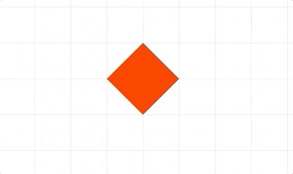
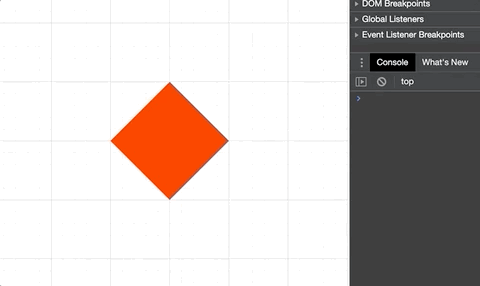

# Animation API Reference

## Contents

- [AnimationBuilder](#animationbuilder)
- [AnimationManager](#animationmanager)
- [CustomAnimationStep](#customanimationstep)
- [DelayAnimationStep](#delayanimationstep)
- [ColorAnimationStep](#coloranimationstep)
- [DimAnimationStep](#dimanimationstep)
- [UndimAnimationStep](#undimanimationstep)
- [OpacityAnimationStep](#opacityanimationstep)
- [DissolveInAnimationStep](#dissolveinanimationstep)
- [DissolveOutAnimationStep](#dissolveoutanimationstep)
- [PositionAnimationStep](#positionanimationstep)
- [PulseAnimationStep](#pulseanimationstep)
- [RotationAnimationStep](#rotationanimationstep)
- [ScaleAnimationStep](#scaleanimationstep)
- [ScenarioAnimationStep](#scenarioanimationstep)
- [TransformAnimationStep](#transformanimationstep)
- [SerialAnimationStep](#serialanimationstep)
- [TriggerAnimationStep](#triggeranimationstep)

---

## AnimationBuilder

*Extends {@link SerialAnimationStep}*

Animation Builder

Convenient way to build animation steps in serial. Each step returns the
same builder object, and so chaining in a fluent like API can be achieved.

#### Example 1

```js
p.animations.new()
  .delay(1)
  .position({ target: [1, 0], duration: 2 })
  .delay(1)
  .rotation({ target: Math.PI, duration: 2 })
  .start();
```

> <a href="#animationmanagernew">AnimationManager.new</a>


---

## AnimationManager

Animation Manager

This class manages animations and creates animation steps for use in
animations.

Each {@link FigureElement} has its own `AnimationManager` in the
`animations` property, though any
animation manager can animate any other element. Therefore all parallel
animations can go through the same manager, or be spread throughout
different element's animation managers. Spread animations out between
elements, or keeping them all in one `AnimationManager` can change how
readable code is, how convenient it is to cancel running animations, and
what order the animations are performed in (`AnimationManager`s tied
to elements drawn earlier will perform their animation steps before those
tied to elements drawn later). `AnimationManager`s will only be processed
on each animation frame if the element they are tied to is not hidden.

The `animations` property within `AnimationManager` is simply an array that
contains a number {@link AnimationStep}s that are executed in parallel.
Typically, these steps would themselves be {@link SerialAnimationStep}s or a
series of animations. This means the animation manager is running a number of
animation series in parallel.


The `AnimationManager`s on {@link FigureElement}s should be used instead
of instantiating this class separately, as those on `FigureElements` will
be automatically processed every animation frame.

### Properties

<ul class="tsd-parameter-list">
<li><span><span class="tsd-kind-parameter">state</span>: <span class="tsd-signature-type">'animating' | 'idle' | 'waitingToStart'</span></span></li>
<li><span><span class="tsd-kind-parameter">animations</span>: <span class="tsd-signature-type"><a href="https://developer.mozilla.org/docs/Web/JavaScript/Reference/Global_Objects/Array" class="tsd-signature-type">Array</a><AnimationStep></span></span></li>
<li><span><span class="tsd-kind-parameter">notifications</span>: <span class="tsd-signature-type"><a href="../classes/tools.NotificationManager.html" class="tsd-signature-type">NotificationManager</a></span></span></li>
</ul>

### Parameters

<ul class="tsd-parameter-list">
<li><span></span></li>
</ul>

#### At its heart the `AnimationManager` is just executing

```js
// an array of animation steps.

// Create animation steps
const position = new Fig.Animation.PositionAnimationStep({
  element: p,
  target: [1, 0],
  duration: 2,
});
const rotation = new Fig.Animation.RotationAnimationStep({
  element: p,
  target: Math.PI,
  duration: 2,
});

// Combine the animations into a SerialAnimationStep
const series = new Fig.Animation.SerialAnimationStep([
  position,
  rotation,
]);

// Add the animations to the animation manager and start
p.animations.animations.push(series);
p.animations.start();
```

#### Using the `new` method in `AnimationManager` creates a convenient

```js
// `AnimationBuilder` which extends a `SerialAnimationStep` by using
// a fluent API pattern
//
// Create animation steps
const position = new Fig.Animation.PositionAnimationStep({
  element: p,
  target: [1, 0],
  duration: 2,
});
const rotation = new Fig.Animation.RotationAnimationStep({
  element: p,
  target: Math.PI,
  duration: 2,
});

// Build and start the animation
p.animations.new()
  .then(position)
  .then(rotation)
  .start();
```

#### `AnimationStep`s can also be created from the `AnimationManager`

```js
// with the added convenience that the `FigureElement` that
// has the `AnimationManager` will be used as the default
// `element` property. This combined with the `AnimationBuilder`
// makes defining most animations clean and readable code

// Build and start the animation
p.animations.new()
  .position({ target: [1, 0], duration: 2 })
  .rotation({ target: Math.PI, duration: 2 })
  .start();
```

#### Parallel animations however still need to use explicit animation steps.

```js
// Creating the steps from the `AnimationManager` means the `element` doesn't
// need to be defined.
//
p.animations.new()
  .inParallel([
    p.animations.position({ target: [1, 0], duration: 2 }),
    p.animations.rotation({ target: Math.PI, duration: 2 })
  ])
  .start();
```

> {@link FigureElement}

> {@link AnimationBuilder}

---

## CustomAnimationStep

*Extends {@link AnimationStep}*

Custom animation step


Custom animation steps are useful for orchestrating complex animations, or
performing non-linear animations.

This step will execute a custom callback function on each animation frame.
Custom animations can either have finite `duration` or infinite
(`duration` = `null`). If finite, the callback function will be passed
percentage progress through the duration. If infinite, the callback function
will be passed the delta time from the start of the animation.

The animation can be stopped at any time by returning `true` from the
callback funciton/

For finite durations, the percentage progress can either be linear with
time, or non-linear.
 Built-in non-linear progressions are `'easeinout'`, `'easein`' and
`'easeout'` which will slow progress at the start and/or end of the
animation. A function to create a custom non-linear progressor can also be
used.

### Parameters

<ul class="tsd-parameter-list">
<li><span><span class="tsd-kind-parameter">options</span>: <span class="tsd-signature-type"><a href="../interfaces/Animation_AnimationStep_CustomStep.OBJ_CustomAnimationStep.html" class="tsd-signature-type">OBJ_CustomAnimationStep</a></span></span></li>
</ul>

#### Move an object through a sine wave of wavelength 1 from

```js
// x = -1 to x = 1
function sine(percentComplete) {
  const x = -1 + percentComplete * 2;
  const y = 0.5 * Math.sin(Math.PI * 2 * x);
  p.setPosition(x, y);
}

p.animations.new()
  .custom({ callback: sine, duration: 5 })
  .start();
```

#### Animate a object in a circle indefinitely at a frequency of 0.1Hz

```js
p.animations.new()
  .custom({
    callback: (t) => {
      const x = 0.5 * Math.cos(2 * Math.PI * 0.1 * t);
      const y = 0.5 * Math.sin(2 * Math.PI * 0.1 * t);
      p.setPosition(x, y);
    },
    duration: null,
  })
  .start();
```

> To test examples, append them to the
<a href="#animation-boilerplate">boilerplate</a>


---

## DelayAnimationStep

*Extends {@link AnimationStep}*

Delay animation step

While all animations steps accept a delay property,
having this step sometimes makes the animation seem
more readable.

### Parameters

<ul class="tsd-parameter-list">
<li><span><span class="tsd-kind-parameter">delayOrOptions</span>: <span class="tsd-signature-type"><a href="https://developer.mozilla.org/docs/Web/JavaScript/Reference/Global_Objects/Number" class="tsd-signature-type">number</a> | <a href="../interfaces/Animation_AnimationStep.OBJ_AnimationStep.html" class="tsd-signature-type">OBJ_AnimationStep</a></span></span></li>
</ul>

---

## ColorAnimationStep

*Extends {@link ElementAnimationStep}*

Color animation Step


By default, the color will start with the element's current color.

Use either `delta` or `target` to define the end color

In an interactive figure, it is often useful to highlight elements of the
figure by coloring them and greying out, or dimming the elements not of
interest. As such, a {@link FigureElement} has several color attributes:
- color - current color
- dimColor - color to dim to
- defaultColor - color to undim to

The `target` property can accept `'dim'` and `'undim'` as shortcuts to dim
or undim the element.

In addition, the {@link DimAnimationStep} and {@link UndimAnimationStep} can
be used to do the same, which is especially useful when trying to build
easy to read code in a complex animation.

### Parameters

<ul class="tsd-parameter-list">
<li><span><span class="tsd-kind-parameter">options</span>: <span class="tsd-signature-type"><a href="../interfaces/Animation_AnimationStep_ElementAnimationStep_ColorAnimationStep.OBJ_ColorAnimationStep.html" class="tsd-signature-type">OBJ_ColorAnimationStep</a></span></span></li>
</ul>

#### Using duration

```js
p.animations.new()
  .color({ target: [0, 0, 1, 1], duration: 1 })
  .color({ target: [0, 0.8, 0, 1], duration: 1 })
  .color({ target: [1, 0, 0, 1], duration: 1 })
  .start();
```

#### dim and undim an element using dim and undim animation steps

```js
p.animations.new()
  .dim(1)
  .delay(1)
  .undim(1)
  .start();
```

#### Different ways to create a stand-alone step

```js
const step1 = p.animations.color({
  target: [0, 0, 1, 1],
  duration: 2,
});
const step2 = new Fig.Animation.ColorAnimationStep({
  element: p,
  target: [0, 0.8, 0, 1],
  duration: 2,
});

p.animations.new()
  .then(step1)
  .then(step2)
  .start();
```

> To test examples, append them to the
<a href="#animation-boilerplate">boilerplate</a>


---

## DimAnimationStep

*Extends {@link ColorAnimationStep}*

Dim color animation step


Animates color of element to the `dimColor` property of {@link FigureElement}

### Parameters

<ul class="tsd-parameter-list">
<li><span><span class="tsd-kind-parameter">durationOrOptions</span>: <span class="tsd-signature-type"><a href="https://developer.mozilla.org/docs/Web/JavaScript/Reference/Global_Objects/Number" class="tsd-signature-type">number</a> | <a href="../interfaces/Animation_AnimationStep_ElementAnimationStep.OBJ_ElementAnimationStep.html" class="tsd-signature-type">OBJ_ElementAnimationStep</a></span></span></li>
</ul>

#### Simple dim

```js
p.animations.new()
  .dim(2)
  .start();
```

#### Dim using options object

```js
p.animations.new()
  .dim({ delay: 1, duration: 2 })
  .start();
```

#### Different ways to create a stand-alone step

```js
const step1 = p.animations.dim(2);
const step2 = new Fig.Animation.DimAnimationStep({
  element: p,
  duration: 2,
});

p.animations.new()
  .then(step1)
  .undim(1)
  .then(step2)
  .start();
```

> To test examples, append them to the
<a href="#animation-boilerplate">boilerplate</a>


---

## UndimAnimationStep

*Extends {@link ColorAnimationStep}*

Undim color animation step


Animates color of element to the `defaultColor` property of {@link FigureElement}

### Parameters

<ul class="tsd-parameter-list">
<li><span><span class="tsd-kind-parameter">durationOrOptions</span>: <span class="tsd-signature-type"><a href="https://developer.mozilla.org/docs/Web/JavaScript/Reference/Global_Objects/Number" class="tsd-signature-type">number</a> | <a href="../interfaces/Animation_AnimationStep_ElementAnimationStep.OBJ_ElementAnimationStep.html" class="tsd-signature-type">OBJ_ElementAnimationStep</a></span></span></li>
</ul>

#### Simple undim

```js
p.dim();
p.animations.new()
  .undim(2)
  .start();
```

#### Undim using options object

```js
p.dim();
p.animations.new()
  .undim({ delay: 1, duration: 2 })
  .start();
```

#### Different ways to create a stand-alone step

```js
const step1 = p.animations.undim(2);
const step2 = new Fig.Animation.UndimAnimationStep({
  element: p,
  duration: 2,
});

p.dim();
p.animations.new()
  .then(step1)
  .dim(1)
  .then(step2)
  .start();
```

> To test examples, append them to the
<a href="#animation-boilerplate">boilerplate</a>


---

## OpacityAnimationStep

*Extends {@link ElementAnimationStep}*

Opacity Animation Step


A {@link FigureElement} has `color` and `opacity` properties. The `color`
property has an alpha channel that defines opacity, but it should be used
as a base color definition, and not used to dissolve an element in and out.

Therefore, to animate an element's opacity or temporarily dissolve in or out
an element, use an opacity animation step.

The `opacity` is multiplied by the
`color` alpha channel to get the final opacity of the element.

By default, the opacity will start with the {@link FigureElement}'s current
opacity unless dissolving. If dissolving, the opacity will start at `0` if
dissolving in, or `1` if dissolving out unless `dissolveFromCurrent` is
`true` in which case the opacity will start from the current opacity.

The {@link DissolveInAnimationStep} and {@link DissolveOutAnimationStep}
extend the `OpacityAnimationStep` to make it even more convenient to
dissolve.

### Parameters

<ul class="tsd-parameter-list">
<li><span><span class="tsd-kind-parameter">options</span>: <span class="tsd-signature-type"><a href="../interfaces/Animation_AnimationStep_ElementAnimationStep_OpacityAnimationStep.OBJ_OpacityAnimationStep.html" class="tsd-signature-type">OBJ_OpacityAnimationStep</a></span></span></li>
</ul>

#### Using numerical values for opacity

```js
p.animations.new()
  .opacity({ target: 0.4, duration: 2 })
  .opacity({ target: 1, duration: 2 })
  .start();
```

#### Dissolve out then in

```js
p.animations.new()
  .opacity({ dissolve: 'out', duration: 2 })
  .opacity({ dissolve: 'in', duration: 2 })
  .start();
```

#### Using the dissolve animation step

```js
p.animations.new()
  .dissolveOut(2)
  .dissolveIn({ delay: 1, duration: 2 })
  .start();
```

#### Different ways to create a stand-alone step

```js
const step1 = p.animations.opacity({
  target: 0,
  duration: 2,
});
const step2 = new Fig.Animation.OpacityAnimationStep({
  element: p,
  target: 1,
  duration: 2,
});
const step3 = p.animations.dissolveOut({
  duration: 2,
});
const step4 = new Fig.Animation.DissolveInAnimationStep({
  element: p,
  duration: 2,
});

p.animations.new()
  .then(step1)
  .then(step2)
  .then(step3)
  .then(step4)
  .start();
```

> To test examples, append them to the
<a href="#animation-boilerplate">boilerplate</a>


---

## DissolveInAnimationStep

*Extends {@link OpacityAnimationStep}*

Dissolve in animation step


Animates opacity of element to dissolve in.

### Parameters

<ul class="tsd-parameter-list">
<li><span><span class="tsd-kind-parameter">durationOrOptions</span>: <span class="tsd-signature-type"><a href="https://developer.mozilla.org/docs/Web/JavaScript/Reference/Global_Objects/Number" class="tsd-signature-type">number</a> | <a href="../interfaces/Animation_AnimationStep_ElementAnimationStep.OBJ_ElementAnimationStep.html" class="tsd-signature-type">OBJ_ElementAnimationStep</a></span></span></li>
</ul>

#### Simple dissolve in

```js
p.setOpacity(0)
p.animations.new()
  .dissolveIn(2)
  .start();
```

#### Dissolve in using options object

```js
p.setOpacity(0);
p.animations.new()
  .dissolveIn({ delay: 1, duration: 2 })
  .start();
```

#### Different ways to create a stand-alone step

```js
const step1 = p.animations.dissolveIn(2);
const step2 = new Fig.Animation.DissolveInAnimationStep({
  element: p,
  duration: 2,
});

p.setOpacity(0);
p.animations.new()
  .then(step1)
  .dissolveOut(1)
  .then(step2)
  .start();
```

> To test examples, append them to the
<a href="#animation-boilerplate">boilerplate</a>


---

## DissolveOutAnimationStep

*Extends {@link OpacityAnimationStep}*

Dissolve out animation step


Animates opacity of element to dissolve out.

### Parameters

<ul class="tsd-parameter-list">
<li><span><span class="tsd-kind-parameter">durationOrOptions</span>: <span class="tsd-signature-type"><a href="https://developer.mozilla.org/docs/Web/JavaScript/Reference/Global_Objects/Number" class="tsd-signature-type">number</a> | <a href="../interfaces/Animation_AnimationStep_ElementAnimationStep.OBJ_ElementAnimationStep.html" class="tsd-signature-type">OBJ_ElementAnimationStep</a></span></span></li>
</ul>

#### Simple dissolve out

```js
p.animations.new()
  .dissolveOut(2)
  .start();
```

#### Dissolve out using options object

```js
p.animations.new()
  .dissolveOut({ delay: 1, duration: 2 })
  .start();
```

#### Different ways to create a stand-alone step

```js
const step1 = p.animations.dissolveOut(2);
const step2 = new Fig.Animation.DissolveOutAnimationStep({
  element: p,
  duration: 2,
});

p.animations.new()
  .then(step1)
  .dissolveIn(1)
  .then(step2)
  .start();
```

> To test examples, append them to the
<a href="#animation-boilerplate">boilerplate</a>


---

## PositionAnimationStep

*Extends {@link ElementAnimationStep}*

Position animation step


The position animation step animates the first {@link Translation} transform
in the {@link FigureElement}'s {@link Transform}.

By default, the position will start with the element's current position.

Use either `delta` or `target` to define it's end point.

The path of travel between `start` and `target` can either be a straight
line (`'linear'`) or a quadratic bezier curve (`'curve'`)

For custom paths, the {@link CustomAnimationStep} can be used.

### Parameters

<ul class="tsd-parameter-list">
<li><span><span class="tsd-kind-parameter">options</span>: <span class="tsd-signature-type"><a href="../interfaces/Animation_AnimationStep_ElementAnimationStep_PositionAnimationStep.OBJ_PositionAnimationStep.html" class="tsd-signature-type">OBJ_PositionAnimationStep</a></span></span></li>
</ul>

#### Using duration

```js
p.animations.new()
  .position({ target: [1, 0], duration: 2 })
  .start()
```

#### Using velocity

```js
p.animations.new()
  .position({ target: [1, 0], velocity: 0.5 })
  .start()
```

#### Linear and curved path

```js
p.animations.new()
  .delay(1)
  .position({ target: [1, 0], duration: 2 })
  .position({
    target: [0, 0],
    duration: 2,
    path: {
      style: 'curve',
      magnitude: 0.8,
      direction: 'up',
    },
  })
  .start();
```

#### Different ways to create a stand-alone step

```js
const step1 = p.animations.position({ target: [1, 0], duration: 2 });
const step2 = new Fig.Animation.PositionAnimationStep({
  element: p,
  target: [0, 0],
  duration: 2,
});

p.animations.new()
  .then(step1)
  .then(step2)
  .start();
```

> To test examples, append them to the
<a href="#animation-boilerplate">boilerplate</a>


---

## PulseAnimationStep

*Extends {@link ElementAnimationStep}*

Pulse animation step


The pulse animation step animates a pulse.

The options are the same as those in the * <a href="#figureelementpulse">pulse</a> method.

### Parameters

<ul class="tsd-parameter-list">
<li><span><span class="tsd-kind-parameter">options</span>: <span class="tsd-signature-type"><a href="../interfaces/Animation_AnimationStep_ElementAnimationStep_PulseAnimationStep.OBJ_PulseAnimationStep.html" class="tsd-signature-type">OBJ_PulseAnimationStep</a></span></span></li>
</ul>

#### Scale pulse, rotation pulse and translation pulse

```js
p.animations.new()
  .pulse({
    scale: 1.5,
    duration: 1,
  })
  .pulse({
    duration: 1,
    rotation: 0.15,
    frequency: 4,
  })
  .pulse({
    duration: 1,
    translation: 0.02,
    min: -0.02,
    frequency: 4,
  })
  .start();
```

#### Different ways to create a stand-alone step

```js
const step1 = p.animations.pulse({
  scale: 1.5,
  duration: 1,
});
const step2 = new Fig.Animation.PulseAnimationStep({
  element: p,
  rotation: 0.15,
  frequency: 4,
});
p.animations.new()
  .then(step1)
  .then(step2)
  .start();
```

> To test examples, append them to the
<a href="#animation-boilerplate">boilerplate</a>


---

## RotationAnimationStep

*Extends {@link ElementAnimationStep}*

Rotation animation step


The rotation animation step animates the first {@link Rotation} transform
in the {@link FigureElement}'s {@link Transform}.

By default, the rotation will start with the element's current rotation.

Use either `delta` or `target` to define it's end point

### Parameters

<ul class="tsd-parameter-list">
<li><span><span class="tsd-kind-parameter">options</span>: <span class="tsd-signature-type"><a href="../interfaces/Animation_AnimationStep_ElementAnimationStep_RotationAnimationStep.OBJ_RotationAnimationStep.html" class="tsd-signature-type">OBJ_RotationAnimationStep</a></span></span></li>
</ul>

#### Using duration

```js
p.animations.new()
  .rotation({ target: Math.PI, duration: 2 })
  .start();
```

#### Using velocity

```js
p.animations.new()
  .rotation({ target: Math.PI, velocity: Math.PI / 2 })
  .start();
```

#### Different ways to create a stand-alone step

```js
const step1 = p.animations.rotation({ target: Math.PI, duration: 2 });
const step2 = new Fig.Animation.RotationAnimationStep({
  element: p,
  target: 0,
  duration: 2,
});

p.animations.new()
  .then(step1)
  .then(step2)
  .start();
```

> To test examples, append them to the
<a href="#animation-boilerplate">boilerplate</a>


---

## ScaleAnimationStep

*Extends {@link ElementAnimationStep}*

Scale Animation Step


The scale animation step animates the first {@link Scale} transform
in the {@link FigureElement}'s {@link Transform}.

By default, the scale will start with the element's current scale.

Use either `delta` or `target` to define it's end point.

Scale can be defined as either a point or number. If number,
both x and y scale terms will be the same.

### Parameters

<ul class="tsd-parameter-list">
<li><span><span class="tsd-kind-parameter">options</span>: <span class="tsd-signature-type"><a href="../interfaces/Animation_AnimationStep_ElementAnimationStep_ScaleAnimationStep.OBJ_ScaleAnimationStep.html" class="tsd-signature-type">OBJ_ScaleAnimationStep</a></span></span></li>
</ul>

#### Using duration

```js
p.animations.new()
  .scale({ target: 2, duration: 2 })
  .start();
```

#### Using velocity

```js
p.animations.new()
  .scale({ target: 2, velocity: 0.5 })
  .start();
```

#### Different ways to create a stand-alone step

```js
const step1 = p.animations.scale({ target: 1.5, duration: 2 });
const step2 = new Fig.Animation.ScaleAnimationStep({
  element: p,
  target: 1,
  duration: 2,
});

p.animations.new()
  .then(step1)
  .then(step2)
  .start();
```

> To test examples, append them to the
<a href="#animation-boilerplate">boilerplate</a>


---

## ScenarioAnimationStep

*Extends {@link ElementAnimationStep}*

Scenario Animation Step


A scenario defines an element's transform and color and can be used to make
code more readable and reusable.

By default, the scenario will start with the element's current transform and
color.

### Parameters

<ul class="tsd-parameter-list">
<li><span><span class="tsd-kind-parameter">options</span>: <span class="tsd-signature-type"><a href="../interfaces/Animation_AnimationStep_ElementAnimationStep_ScenarioAnimationStep.OBJ_ScenarioAnimationStep.html" class="tsd-signature-type">OBJ_ScenarioAnimationStep</a></span></span></li>
</ul>

#### NOTE - use these scenario definitions for all examples below

```js
p.scenarios['center'] = { position: [0, 0], scale: [1, 1], color: [1, 0, 0, 1] };
p.scenarios['right'] = { position: [1, 0], scale: [2, 1], color: [0, 0, 1, 1] };
p.scenarios['bottom'] = { position: [0, -0.5], scale: [0.5, 1], color: [0, 0.5, 0, 1] };
```

#### Using duration

```js
p.animations.new()
  .scenario({ target: 'right', duration: 2 })
  .scenario({ target: 'bottom', duration: 2 })
  .scenario({ target: 'center', duration: 2 })
  .start();
```

#### Using velocity

```js
p.animations.new()
  .scenario({
    target: 'right',
    velocity: { position: 0.5, scale: 0.2 },
  })
  .scenario({ target: 'bottom', velocity: { position: 0.5 } })
  .scenario({ target: 'center', velocity: { color: 0.2 } })
  .start();
```

#### Different ways to create a stand-alone step

```js
const step1 = p.animations.scenario({
  target: 'right',
  duration: 2,
});
const step2 = new Fig.Animation.ScenarioAnimationStep({
  element: p,
  target: 'bottom',
  duration: 2,
});

p.animations.new()
  .then(step1)
  .then(step2)
  .start();
```

> To test examples, append them to the
<a href="#animation-boilerplate">boilerplate</a>


---

## TransformAnimationStep

*Extends {@link ElementAnimationStep}*

Transform Animation Step



By default, the transform will start with the element's current transform.

A {@link Transform} chains many transform links where each link might be
a {@link Rotation}, {@link Scale} or {@link Translation} transform.

`start`, `target` and `delta` should have the same order of transform links
as the `element`'s transform.

The {@link TransformAnimationStep} will animate each of these links with the
same duration. If `velocity` is used to calculate the duration, then the link
with the longest duration will define the duration of the animation.
`velocity` can either be a transform with the same order of transform links
as the `element` or it can be a constant value, which will be applied to
all transform links. `velocity` cannot be 0.

Use either `delta` or `target` to define it's end point of the animation.

### Parameters

<ul class="tsd-parameter-list">
<li><span><span class="tsd-kind-parameter">options</span>: <span class="tsd-signature-type"><a href="../interfaces/Animation_AnimationStep_ElementAnimationStep_TransformAnimationStep.OBJ_TransformAnimationStep.html" class="tsd-signature-type">OBJ_TransformAnimationStep</a></span></span></li>
</ul>

#### Using duration

```js
p.animations.new()
  .transform({
    target: new Fig.Transform().scale(2, 2).rotate(0.5).translate(1, 0),
    duration: 2,
  })
  .start();
```

#### Using velocity as a transform

```js
p.animations.new()
  .transform({
    target: new Fig.Transform().scale(2, 2).rotate(0.5).translate(1, 0),
    velocity: new Fig.Transform().scale(0.5, 0.5).rotate(0.25).translate(0.5, 0.5),
  })
  .start();
```

#### Using velocity as a number

```js
p.animations.new()
  .transform({
    target: new Fig.Transform().scale(2, 2).rotate(0.5).translate(1, 0),
    velocity: 0.5,
  })
  .start();
```

#### Using TypeParsableTransform as transform definition

```js
p.animations.new()
  .transform({
    target: [['s', 1.5, 1.5], ['r', 0.5], ['t', 1, 0]],
    duration: 2,
  })
  .start();
```

#### Different ways to create a stand-alone step

```js
const step1 = p.animations.transform({
  target: [['s', 1.5, 1.5], ['r', 1], ['t', 1, 0]],
  duration: 2,
});
const step2 = new Fig.Animation.TransformAnimationStep({
  element: p,
  target: [['s', 1, 1], ['r', 0], ['t', 0, 0]],
  duration: 2,
});

p.animations.new()
  .then(step1)
  .then(step2)
  .start();
```

> To test examples, append them to the
<a href="#animation-boilerplate">boilerplate</a>


---

## SerialAnimationStep

*Extends {@link AnimationStep}*

Execute an array of {@link AnimationStep}s in series.


Often the {@link AnimationBuilder} class which extends
`SerialAnimationStep` can be used to create serial animations
in a more clean way.

### Parameters

<ul class="tsd-parameter-list">
<li><span><span class="tsd-kind-parameter">steps</span>: <span class="tsd-signature-type"><a href="https://developer.mozilla.org/docs/Web/JavaScript/Reference/Global_Objects/Array" class="tsd-signature-type">Array</a><AnimationStep> | <a href="../interfaces/Animation_AnimationStep_SerialAnimationStep.OBJ_SerialAnimationStep.html" class="tsd-signature-type">OBJ_SerialAnimationStep</a></span></span><div class="tsd-comment tsd-typography"><p>animation steps to perform in serial</p></div></li>
</ul>

#### Using a SerialAnimation step can be cumbersome, but

```js
// can be useful if modularizing animations between files
const Rot = Fig.Animation.RotationAnimationStep;
const Delay = Fig.Animation.DelayAnimationStep;
const Pos = Fig.Animation.PositionAnimationStep;

const series = new Fig.Animation.SerialAnimationStep([
  new Rot({ element: p, target: Math.PI / 2, duration: 2 }),
  new Delay({ duration: 0.2 }),
  new Rot({ element: p, target: Math.PI, duration: 2 }),
  new Delay({ duration: 0.2 }),
  new Rot({ element: p, target: 0, direction: -1, duration: 1.3, progression: 'easein' }),
  new Pos({ element: p, target: [1, 0], duration: 2, progression: 'easeout' }),
]);

p.animations.animations.push(series);
p.animations.start()
```

#### Same animation but with `AnimationBuilder` (which is an extension of

```js
// `SerialAnimationStep`)
p.animations.new()
  .rotation({ target: Math.PI / 2, duration: 2 })
  .delay(0.2)
  .rotation({ target: Math.PI, duration: 2 })
  .delay(0.2)
  .rotation({ target: 0, duration: 1, direction: -1, progression: 'easein' })
  .position({ target: [1, 0], duration: 2, progression: 'easeout' })
  .start();
```

> To test examples, append them to the
<a href="#animation-boilerplate">boilerplate</a>


---

## TriggerAnimationStep

*Extends {@link AnimationStep}*

Trigger Animation Step



A trigger step executes a custom function

A `delay` will delay the triggering of the custom function
while `duration` will pad time at the end of the trigger before
the animation step finishes.

### Parameters

<ul class="tsd-parameter-list">
<li><span><span class="tsd-kind-parameter">options</span>: <span class="tsd-signature-type"><a href="../interfaces/Animation_AnimationStep_TriggerStep.OBJ_TriggerAnimationStep.html" class="tsd-signature-type">OBJ_TriggerAnimationStep</a> | function(): void</span></span></li>
</ul>

#### Simple trigger

```js
p.animations.new()
  .position({ target: [1, 0], duration: 2 })
  .trigger(() => { console.log('arrived at (1, 0)') })
  .position({ target: [0, 0], duration: 2 })
  .trigger(() => { console.log('arrived at (0, 0)') })
  .start();
```

#### Trigger with delay, duration and payload

```js
const printPosition = (pos) => {
  console.log(`arrived at ${pos}`);
};

p.animations.new()
  .position({ target: [1, 0], duration: 2 })
  .trigger({
    delay: 1,
    callback: printPosition,
    payload: '(1, 0)',
    duration: 1,
  })
  .position({ target: [0, 0], duration: 2 })
  .trigger({ callback: printPosition, payload: '(0, 0)' })
  .start();
```

#### Different ways to create a stand-alone step

```js
const step1 = p.animations.trigger({
  callback: () => { console.log('arrived at (1, 0)') },
});
const step2 = new Fig.Animation.TriggerAnimationStep({
  callback: () => { console.log('arrived at (0, 0)') },
});

p.animations.new()
  .position({ target: [1, 0], duration: 2 })
  .then(step1)
  .position({ target: [0, 0], duration: 2 })
  .then(step2)
  .start();
```

> To test examples, append them to the
<a href="#animation-boilerplate">boilerplate</a>


---

