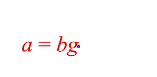

# Equations API Reference

## Contents

- [EQN_TextElement](#eqn_textelement)
- [TypeEquationElement](#typeequationelement)
- [EQN_EquationElements](#eqn_equationelements)
- [EQN_FormAlignment](#eqn_formalignment)
- [EQN_TranslationStyle](#eqn_translationstyle)
- [EQN_FromForm](#eqn_fromform)
- [EQN_FromForms](#eqn_fromforms)
- [EQN_FormObjectDefinition](#eqn_formobjectdefinition)
- [TypeEquationForm](#typeequationform)
- [EQN_Forms](#eqn_forms)
- [EQN_FormRestart](#eqn_formrestart)
- [EQN_FormDefaults](#eqn_formdefaults)
- [EQN_Equation](#eqn_equation)
- [Equation](#equation)
- [TypeEquationPhrase](#typeequationphrase)

---

## EQN_TextElement

Definition of a text or equation element.

The properties 'color', 'isTouchable', 'onClick' and `touchBorder`
modify the corresponding properties on the {@link FigureElementPrimitive}
itself, and so could equally be set in `mods`. They are provided in the
root object for convenience as they are commonly used.

### Properties

<ul class="tsd-parameter-list">
<li><span><span class="tsd-kind-parameter">text</span>: <span class="tsd-signature-type"><a href="https://developer.mozilla.org/docs/Web/JavaScript/Reference/Global_Objects/String" class="tsd-signature-type">string</a> | undefined</span></span><div class="tsd-comment tsd-typography"><p>- Text element only</p></div></li>
<li><span><span class="tsd-kind-parameter">font</span>: <span class="tsd-signature-type"><a href="../interfaces/types.OBJ_Font.html" class="tsd-signature-type">OBJ_Font</a> | undefined</span></span><div class="tsd-comment tsd-typography"><p>- Text element only</p></div></li>
<li><span><span class="tsd-kind-parameter">style</span>: <span class="tsd-signature-type">'italic' | 'normal' | undefined</span></span><div class="tsd-comment tsd-typography"><p>- Text element only</p></div></li>
<li><span><span class="tsd-kind-parameter">mods</span>: <span class="tsd-signature-type">object | undefined</span></span><div class="tsd-comment tsd-typography"><p>- Properties to set on instantiated element</p></div></li>
<li><span><span class="tsd-kind-parameter">color</span>: <span class="tsd-signature-type"><a href="../types/types.TypeColor.html" class="tsd-signature-type">TypeColor</a> | undefined</span></span><div class="tsd-comment tsd-typography"><p>- Color to set the element</p></div></li>
<li><span><span class="tsd-kind-parameter">isTouchable</span>: <span class="tsd-signature-type"><a href="https://developer.mozilla.org/docs/Web/JavaScript/Reference/Global_Objects/Boolean" class="tsd-signature-type">boolean</a> | undefined</span></span><div class="tsd-comment tsd-typography"><p>- make the element touchable</p></div></li>
<li><span><span class="tsd-kind-parameter">onClick</span>: <span class="tsd-signature-type">() => void | '<a href="https://developer.mozilla.org/docs/Web/JavaScript/Reference/Global_Objects/String" class="tsd-signature-type">string</a>' | null | undefined</span></span><div class="tsd-comment tsd-typography"><p>- called when touched</p></div></li>
<li><span><span class="tsd-kind-parameter">touchBorder</span>: <span class="tsd-signature-type"><a href="../types/g2.TypeBorder.html" class="tsd-signature-type">TypeBorder</a> | 'border' | <a href="https://developer.mozilla.org/docs/Web/JavaScript/Reference/Global_Objects/Number" class="tsd-signature-type">number</a> | 'rect' | 'draw' | 'buffer' | undefined</span></span><div class="tsd-comment tsd-typography"><p>set the element's touch border</p></div></li>
<li><span><span class="tsd-kind-parameter">mods</span>: <span class="tsd-signature-type"><a href="../interfaces/Equation_Equation.OBJ_ElementMods.html" class="tsd-signature-type">OBJ_ElementMods</a> | undefined</span></span></li>
</ul>

---

## TypeEquationElement

An equation element can be any of the below. If `string`, then a
{@link EQN_TextElement} will be used where the `text` property is the
`string`.

- `string`
- {@link FigureElementPrimitive}
- {@link FigureElementCollection}
- {@link EQN_TextElement}
- {@link EQN_VinculumSymbol}
- {@link EQN_BoxSymbol}
- {@link EQN_ArrowSymbol}
- {@link EQN_SumSymbol}
- {@link EQN_ProdSymbol}
- {@link EQN_IntegralSymbol}
- {@link EQN_StrikeSymbol}
- {@link EQN_BracketSymbol}
- {@link EQN_AngleBracketSymbol}
- {@link EQN_BraceSymbol}
- {@link EQN_BarSymbol}
- {@link EQN_SquareBracketSymbol}
- {@link EQN_LineSymbol}
- {@link EQN_RadicalSymbol}

---

## EQN_EquationElements

Object where keys are element names, and values are the element definitions

### Properties

<ul class="tsd-parameter-list">
<li><span><span class="tsd-kind-parameter">_elementName</span>: <span class="tsd-signature-type"><a href="../types/Equation_Equation.TypeEquationElement.html" class="tsd-signature-type">TypeEquationElement</a> | undefined</span></span></li>
</ul>

> {@link Equation}


---

## EQN_FormAlignment

Form alignment object definition.





Each equation form is positioned within the {@link Equation}
{@link FigureElementCollection} draw space (0, 0) point. This object
defines how the form is aligned with this (0, 0) point.

Using the `fixTo` property forms can either be aligned relative to the
bounds of the form itself, or to an element within the form, or to a
position other than the (0, 0) in in the equation's collection draw space.

If `fixTo` is an element in the equation:
   - the `fixTo` element is positioned at (0, 0), and all other elements
     repositioned relative to that.
   - The equation collection setPosition (or translation transform) can
     then be used to position the equation in the figure (or relative
     collection space)
   - if `xAlign` is:
       - `'center'`: the `fixTo` element is centered in x around (0, 0)
       - `'right'`: the `fixTo` element right most point is at x = 0
       - `'left'`: default - the `fixTo` element x position at 0
   - if `yAlign` is:
       - `'middle'`: the `fixTo` element is centered in y around (0, 0)
       - `'bottom'`: the `fixTo` element bottom most point is at y = 0
       - `'top'`: the `fixTo` element top most point is at y = 0
       - `'baseline'`: default - the `fixTo` element y position at 0

If `fixTo` is a Point, the equation is positioned at that point in the
equation's draw space.
 - xAlign:
   - `'left'`: The equation's left most element's left most point is at
             Point.x
   - `'right'`: The equation's right most element's right most point is at
             Point.x
   - `'center'`: The equation is centered horizontally around Point.x
 - `yAlign`:
   - `'baseline'`: The equation's baseline is at Point.y
   - `'top'`: The equation's top most element's top most point is at Point.y
   - `'bottom'`: The equation's top most element's top most point is at
               Point.y
   - `'middle'`: The equation is centered vertically around Point.y

### Properties

<ul class="tsd-parameter-list">
<li><span><span class="tsd-kind-parameter">fixTo</span>: <span class="tsd-signature-type"><a href="../classes/Element.FigureElement.html" class="tsd-signature-type">FigureElement</a> | <a href="../types/geometry_Point.TypeParsablePoint.html" class="tsd-signature-type">TypeParsablePoint</a> | <a href="https://developer.mozilla.org/docs/Web/JavaScript/Reference/Global_Objects/String" class="tsd-signature-type">string</a>  | undefined</span> <span class="tsd-signature-symbol">= [0, 0]</span></span></li>
<li><span><span class="tsd-kind-parameter">xAlign</span>: <span class="tsd-signature-type"><a href="../types/Equation_EquationForm.TypeHAlign.html" class="tsd-signature-type">TypeHAlign</a> | undefined</span> <span class="tsd-signature-symbol">= 'left'</span></span></li>
<li><span><span class="tsd-kind-parameter">yAlign</span>: <span class="tsd-signature-type"><a href="../types/Equation_EquationForm.TypeVAlign.html" class="tsd-signature-type">TypeVAlign</a> | undefined</span> <span class="tsd-signature-symbol">= 'baseline'</span></span></li>
</ul>

#### Note - the points are drawn in the figure's draw space, but as the

```js
// equation collection is at (0, 0) and it has not scaling applied, then
// the equation's draw space is the same as the figure's draw space.

// Draw (0, 0) point in equation collection
figure.add({
  make: 'polygon', options: { radius: 0.01, color: [0, 0, 1, 1], sides: 9 },
});
// Default alignment is left, baseline
figure.add([
  {
    make: 'equation',
    forms: { 0: ['a', '_ = ', 'bg'] },
  },
]);
```

#### Draw (0, 0) point in equation collection

```js
figure.add({
  make: 'polygon', options: { radius: 0.01, color: [0, 0, 1, 1], sides: 9 },
});
// Align with right, middle
figure.add([
  {
    make: 'equation',
    forms: { 0: ['a', '_ = ', 'bg'] },
    formDefaults: {
      alignment: {
        xAlign: 'right',
        yAlign: 'middle',
      },
    },
  },
]);
```

#### Draw (0, 0) point in equation collection

```js
figure.add({
  make: 'polygon', options: { radius: 0.01, color: [0, 0, 1, 1], sides: 9 },
});
// Align with center of equals sign
figure.add([
  {
    make: 'equation',
    forms: { 0: ['a', '_ = ', 'bg'] },
    formDefaults: {
      alignment: {
        fixTo: '_ = ',
        xAlign: 'center',
        yAlign: 'baseline',
      },
    },
  },
]);
```

#### Draw (0, 0) and (0.2, 0.1) points

```js
figure.add([
  {
    make: 'polygon',
    options: { radius: 0.01, color: [0, 0, 1, 1], sides: 9 }
  },
  {
    make: 'polygon',
    options: {
      radius: 0.01, color: [0, 0.8, 0, 1], sides: 9, position: [0.2, 0.1],
    },
  },
]);
// Align with point (0.2, 0.1) in the equation collection
figure.add([
  {
    make: 'equation',
    forms: { 0: ['a', '_ = ', 'bg'] },
    formDefaults: {
      alignment: {
        fixTo: [0.2, 0.1],
        xAlign: 'right',
        yAlign: 'baseline',
      },
    },
  },
]);
```

> To test examples, append them to the
<a href="#drawing-boilerplate">boilerplate</a>


---

## EQN_TranslationStyle

Form translation properties

### Properties

<ul class="tsd-parameter-list">
<li><span><span class="tsd-kind-parameter">style</span>: <span class="tsd-signature-type">'curved' | 'linear'</span></span><div class="tsd-comment tsd-typography"><p>- element should move in a straight
line, or through a curve. Default: <code>"linear"</code></p></div></li>
<li><span><span class="tsd-kind-parameter">direction</span>: <span class="tsd-signature-type">'up' | 'down' | undefined</span></span><div class="tsd-comment tsd-typography"><p>- curve only - element should move
through an up or down curve</p></div></li>
<li><span><span class="tsd-kind-parameter">mag</span>: <span class="tsd-signature-type"><a href="https://developer.mozilla.org/docs/Web/JavaScript/Reference/Global_Objects/Number" class="tsd-signature-type">number</a> | undefined</span></span><div class="tsd-comment tsd-typography"><p>- the magnitude of the curve</p></div></li>
</ul>

---

## EQN_FromForm

From form options object.

Any defined properties will override the corrsponding properties of the form
if it being animated to from a specific form.

### Properties

<ul class="tsd-parameter-list">
<li><span><span class="tsd-kind-parameter">duration</span>: <span class="tsd-signature-type">?<a href="https://developer.mozilla.org/docs/Web/JavaScript/Reference/Global_Objects/Number" class="tsd-signature-type">number</a> | undefined</span></span><div class="tsd-comment tsd-typography"><p>duration if animating to this form, use
<code>null</code> for velocity based duration</p></div></li>
<li><span><span class="tsd-kind-parameter">translation</span>: <span class="tsd-signature-type">EQN_TranslationStyle | undefined</span></span><div class="tsd-comment tsd-typography"><p>translation style
when animating to this form</p></div></li>
<li><span><span class="tsd-kind-parameter">onTransition</span>: <span class="tsd-signature-type"><a href="https://developer.mozilla.org/docs/Web/JavaScript/Reference/Global_Objects/String" class="tsd-signature-type">string</a> | (() => void) | undefined</span></span><div class="tsd-comment tsd-typography"><p>called at the start of
animating to this form, or when <code>showForm</code> is used.</p></div></li>
<li><span><span class="tsd-kind-parameter">onShow</span>: <span class="tsd-signature-type"><a href="https://developer.mozilla.org/docs/Web/JavaScript/Reference/Global_Objects/String" class="tsd-signature-type">string</a> | (() => void) | undefined</span></span><div class="tsd-comment tsd-typography"><p>called after animation is finished
or when <code>showForm</code> is used</p></div></li>
<li><span><span class="tsd-kind-parameter">elementMods</span>: <span class="tsd-signature-type"><a href="../interfaces/Equation_Equation.OBJ_ElementMods.html" class="tsd-signature-type">OBJ_ElementMods</a> | undefined</span></span><div class="tsd-comment tsd-typography"><p>properties to set in the equation element
(@FigureElementPrimitive) when this form is shown</p></div></li>
</ul>

---

## EQN_FromForms

Equation form FromForm definition.

When animating from a specific form, it can be useful to customize some of
the form properties specific to that transition.

To do so, use this options object where each key is the specific form from
which the equation is animating from, and the value is the specific
properties.

### Properties

<ul class="tsd-parameter-list">
<li><span><span class="tsd-kind-parameter">_formName</span>: <span class="tsd-signature-type"><a href="../interfaces/Equation_Equation.EQN_FromForm.html" class="tsd-signature-type">EQN_FromForm</a> | undefined</span></span></li>
</ul>

> {@link EQN_FromForm}, {@link EQN_FormObjectDefinition}

---

## EQN_FormObjectDefinition

In mathematics, an equation form is a specific arrangement of an equation's
terms and operators. Different forms will have different
arrangements, that can be achieved by performing a series of operations to
both sides of the equation.

For instance, the equation:

a + b = c

can be rearranged to a different form:

a = c - b

From a FigureOne figure's perspective, a form is a specific layout of
equation elements.

This object defines a how the elements are laid out, what properties the
elements have, and some animation properties for when animating to this form.

### Properties

<ul class="tsd-parameter-list">
<li><span><span class="tsd-kind-parameter">content</span>: <span class="tsd-signature-type"><a href="../types/Equation_EquationFunctions.TypeEquationPhrase.html" class="tsd-signature-type">TypeEquationPhrase</a></span></span><div class="tsd-comment tsd-typography"><p>The equation phrase of the form
defines how the elements are laid out</p></div></li>
<li><span><span class="tsd-kind-parameter">scale</span>: <span class="tsd-signature-type"><a href="https://developer.mozilla.org/docs/Web/JavaScript/Reference/Global_Objects/Number" class="tsd-signature-type">number</a> | undefined</span></span><div class="tsd-comment tsd-typography"><p>scaling factor for this form</p></div></li>
<li><span><span class="tsd-kind-parameter">alignment</span>: <span class="tsd-signature-type">EQN_FormAlignment | undefined</span></span><div class="tsd-comment tsd-typography"><p>how the equation's position
is aligned with this form</p></div></li>
<li><span><span class="tsd-kind-parameter">description</span>: <span class="tsd-signature-type"><a href="https://developer.mozilla.org/docs/Web/JavaScript/Reference/Global_Objects/String" class="tsd-signature-type">string</a> | undefined</span></span><div class="tsd-comment tsd-typography"><p>description of this form</p></div></li>
<li><span>{{}} [modifiers] description modifiers</span></li>
<li><span><span class="tsd-kind-parameter">duration</span>: <span class="tsd-signature-type">?<a href="https://developer.mozilla.org/docs/Web/JavaScript/Reference/Global_Objects/Number" class="tsd-signature-type">number</a> | undefined</span></span><div class="tsd-comment tsd-typography"><p>duration if animating to this form, use
<code>null</code> for velocity based duration</p></div></li>
<li><span><span class="tsd-kind-parameter">translation</span>: <span class="tsd-signature-type"><a href="../interfaces/Equation_Equation.EQN_TranslationStyles.html" class="tsd-signature-type">EQN_TranslationStyles</a> | undefined</span></span><div class="tsd-comment tsd-typography"><p>translation style
when animating to this form</p></div></li>
<li><span><span class="tsd-kind-parameter">onTransition</span>: <span class="tsd-signature-type"><a href="https://developer.mozilla.org/docs/Web/JavaScript/Reference/Global_Objects/String" class="tsd-signature-type">string</a> | (() => void) | undefined</span></span><div class="tsd-comment tsd-typography"><p>called at the start of
animating to this form, or when <code>showForm</code> is used.</p></div></li>
<li><span><span class="tsd-kind-parameter">onShow</span>: <span class="tsd-signature-type"><a href="https://developer.mozilla.org/docs/Web/JavaScript/Reference/Global_Objects/String" class="tsd-signature-type">string</a> | (() => void) | undefined</span></span><div class="tsd-comment tsd-typography"><p>called after animation is finished
or when <code>showForm</code> is used</p></div></li>
<li><span><span class="tsd-kind-parameter">elementMods</span>: <span class="tsd-signature-type"><a href="../interfaces/Equation_Equation.OBJ_ElementMods.html" class="tsd-signature-type">OBJ_ElementMods</a> | undefined</span></span><div class="tsd-comment tsd-typography"><p>properties to set in the equation element
(@FigureElementPrimitive) when this form is shown</p></div></li>
<li><span><span class="tsd-kind-parameter">fromForm</span>: <span class="tsd-signature-type"><a href="../interfaces/Equation_Equation.EQN_FromForms.html" class="tsd-signature-type">EQN_FromForms</a> | undefined</span></span><div class="tsd-comment tsd-typography"><p>override <code>duration</code>, <code>translation</code>
<code>onTransition</code> and/or <code>onShow</code> with this if coming from specific forms</p></div></li>
<li><span><span class="tsd-kind-parameter">ignoreColor</span>: <span class="tsd-signature-type"><a href="https://developer.mozilla.org/docs/Web/JavaScript/Reference/Global_Objects/Boolean" class="tsd-signature-type">boolean</a> | undefined</span> <span class="tsd-signature-symbol">= false</span></span><div class="tsd-comment tsd-typography"><p>when <code>false</code>, color will be set
automatically in the equation based on EQN_Color equation functions. In such
cases, colors that are set external to the equation will be overridden. Use
<code>true</code> to allow setting of colors externally only.</p></div></li>
</ul>

#### Simple form definition of two different forms of the same equation and one

```js
// of the elements is colored blue in one form and red in the other
figure.add({
  name: 'eqn',
  make: 'equation',
  elements: { equals: ' = ', plus: ' + ', minus: ' \u2212 ' },
  forms: {
    form1: {
      content: ['a', 'plus', 'b', 'equals', 'c'],
      elementMods: {
        a: { color: [0, 0, 1, 1] },
      },
    },
    form2: {
      content: ['a', 'equals', 'c', 'minus', 'b'],
      elementMods: {
        a: { color: [1, 0, 0, 1] },
      },
    },
  },
});
```

#### Example showing all form options

```js
figure.add({
  name: 'eqn',
  make: 'equation',
  forms: {
    form1: {
      content: ['a', 'b', 'c'],
      subForm: 'deg',
      scale: 1.2,
      alignment: {
        fixTo: 'b',
        xAlign: 'center',
        yAlign: 'bottom',
      },
      description: '|Form| 1 |description|',
      modifiers: {
        Form: { font: { color: [0, 0, 1, 0] } },
      },
      elementMods: {
        a: {
          color: [0, 0, 1, 1],
          isTouchable: true,
        },
      },
      duration: 1,
      translation: {
        a: {
          style: 'curved',
          direction: 'up',
          mag: 0.95,
        },
        b: ['curved', 'down', 0.45],
      },
      fromPrev: {
        duration: null,
        translation: {
          a: ['curved', 'down', 0.2],
          b: ['curved', 'down', 0.2],
        },
      },
      fromNext: {
        duration: 2,
        translation: {
          a: ['curved', 'down', 0.2],
          b: ['curved', 'down', 0.2],
        },
      },
    },
  },
});
```

> {@link Equation}


---

## TypeEquationForm

A form definition can either be:

* an equation form object {@link EQN_FormObjectDefinition}
* an equation phrase {@link TypeEquationPhrase}

@type {TypeEquationPhrase | EQN_FormObjectDefinition}

---

## EQN_Forms

An object of equation forms where each key is the form name and each value
is a form defintion {@link TypeEquationForm}

### Properties

<ul class="tsd-parameter-list">
<li><span><span class="tsd-kind-parameter">_formName</span>: <span class="tsd-signature-type">TypeEquationForm | undefined</span></span></li>
</ul>

---

## EQN_FormRestart

When an equation form series is restarted, or cycled back to the first form
in the series, then two special animations can be defined with this object:
* `moveFrom`: the equation will move from a location (usually another equation of the same form)
* `pulse`: An element will be pulsed when the animation is finished.

The default values in the pulse object are are:
* `duration`: 1s
* `scale`: 1.1

---

## EQN_FormDefaults

Default form values applied to all forms

> {@link EQN_FormObjectDefinition}

---

## EQN_Equation

Options objects to construct an {@link Equation} class.

All properties are optional.

### Properties

<ul class="tsd-parameter-list">
<li><span><span class="tsd-kind-parameter">color</span>: <span class="tsd-signature-type"><a href="../types/types.TypeColor.html" class="tsd-signature-type">TypeColor</a> | undefined</span></span><div class="tsd-comment tsd-typography"><p>default equation color</p></div></li>
<li><span><span class="tsd-kind-parameter">dimColor</span>: <span class="tsd-signature-type"><a href="../types/types.TypeColor.html" class="tsd-signature-type">TypeColor</a> | undefined</span></span><div class="tsd-comment tsd-typography"><p>default equation dim color</p></div></li>
<li><span><span class="tsd-kind-parameter">font</span>: <span class="tsd-signature-type"><a href="../interfaces/types.OBJ_Font.html" class="tsd-signature-type">OBJ_Font</a> | undefined</span></span><div class="tsd-comment tsd-typography"><p>default {@link FigureFont} for math elements in
the equation</p></div></li>
<li><span><span class="tsd-kind-parameter">textFont</span>: <span class="tsd-signature-type"><a href="../interfaces/types.OBJ_Font.html" class="tsd-signature-type">OBJ_Font</a> | undefined</span> <span class="tsd-signature-symbol">= defaults to font</span></span><div class="tsd-comment tsd-typography"><p>default {@link FigureFont} for text elements
in the equation</p></div></li>
<li><span><span class="tsd-kind-parameter">scale</span>: <span class="tsd-signature-type"><a href="https://developer.mozilla.org/docs/Web/JavaScript/Reference/Global_Objects/Number" class="tsd-signature-type">number</a> | undefined</span> <span class="tsd-signature-symbol">= 0.7</span></span><div class="tsd-comment tsd-typography"><p>equation scale</p></div></li>
<li><span><span class="tsd-kind-parameter">elements</span>: <span class="tsd-signature-type"><a href="../interfaces/Equation_Equation.EQN_EquationElements.html" class="tsd-signature-type">EQN_EquationElements</a> | undefined</span></span><div class="tsd-comment tsd-typography"><p>equation element definitions</p></div></li>
<li><span><span class="tsd-kind-parameter">forms</span>: <span class="tsd-signature-type"><a href="../interfaces/Equation_Equation.EQN_Forms.html" class="tsd-signature-type">EQN_Forms</a> | undefined</span></span><div class="tsd-comment tsd-typography"><p>form definitions</p></div></li>
<li><span><span class="tsd-kind-parameter">initialForm</span>: <span class="tsd-signature-type"><a href="https://developer.mozilla.org/docs/Web/JavaScript/Reference/Global_Objects/String" class="tsd-signature-type">string</a> | undefined</span></span><div class="tsd-comment tsd-typography"><p>form to show when first added to a figure</p></div></li>
<li><span><span class="tsd-kind-parameter">formDefaults</span>: <span class="tsd-signature-type"><a href="../interfaces/Equation_Equation.EQN_FormDefaults.html" class="tsd-signature-type">EQN_FormDefaults</a> | undefined</span></span><div class="tsd-comment tsd-typography"><p>default form options applied to
all forms</p></div></li>
<li><span><span class="tsd-kind-parameter">formSeries</span>: <span class="tsd-signature-type"><a href="https://developer.mozilla.org/docs/Web/JavaScript/Reference/Global_Objects/Array" class="tsd-signature-type">Array</a><<a href="https://developer.mozilla.org/docs/Web/JavaScript/Reference/Global_Objects/String" class="tsd-signature-type">string</a>> | <a href="https://developer.mozilla.org/docs/Web/JavaScript/Reference/Global_Objects/Object" class="tsd-signature-type">Object</a>.<<a href="https://developer.mozilla.org/docs/Web/JavaScript/Reference/Global_Objects/Array" class="tsd-signature-type">Array</a><<a href="https://developer.mozilla.org/docs/Web/JavaScript/Reference/Global_Objects/String" class="tsd-signature-type">string</a>>> | undefined</span></span><div class="tsd-comment tsd-typography"><p>an object
with each key being a form series name, and each value an array for form
names. If defined as an array, then a form series object is created where
the form series name is 'base'. Default: {}</p></div></li>
<li><span><span class="tsd-kind-parameter">defaultFormSeries</span>: <span class="tsd-signature-type"><a href="https://developer.mozilla.org/docs/Web/JavaScript/Reference/Global_Objects/String" class="tsd-signature-type">string</a> | undefined</span></span><div class="tsd-comment tsd-typography"><p>If more than one form series is
defined, then a default must be chosen to be the first current one. Default:
first form defined</p></div></li>
<li><span><span class="tsd-kind-parameter">formRestart</span>: <span class="tsd-signature-type">?EQN_FormRestart | undefined</span></span><div class="tsd-comment tsd-typography"><p>behavior when form transitions
from last in form series back to first</p></div></li>
<li><span><span class="tsd-kind-parameter">position</span>: <span class="tsd-signature-type"><a href="../types/geometry_Point.TypeParsablePoint.html" class="tsd-signature-type">TypeParsablePoint</a> | undefined</span></span><div class="tsd-comment tsd-typography"><p>position will override first
translation element of transform</p></div></li>
<li><span><span class="tsd-kind-parameter">transform</span>: <span class="tsd-signature-type"><a href="../classes/geometry_Transform.Transform.html" class="tsd-signature-type">Transform</a> | undefined</span></span></li>
</ul>

---

## Equation

*Extends {@link FigureElementCollection}*

An Equation is a collection of elements that can be arranged into different
forms.

`Equation` should be instantiated from an *object definition*, or from
the `figure.collections.equation` method.

Equation includes two additional animation steps in {@link Equation.animations}:
* {@link GoToFormAnimationStep}
* {@link NextFormAnimationStep}

#### Create with options definition

```js
figure.add({
  name: 'eqn',
  make: 'equation',
  elements: {
    a: 'a',
    b: { color: [0, 0, 1, 1] },
    c: 'c',
    equals: ' = ',
    plus: ' + ',
  },
  forms: {
    1: ['a', 'equals', 'b', 'plus', 'c'],
  },
});
```

#### Create with methods

```js
const eqn = figure.collections.equation();
eqn.addElements({
  a: 'a',
  b: { color: [0, 0, 1, 1] },
  c: 'c',
  equals: ' = ',
  plus: ' + ',
});
eqn.addForms({
  1: ['a', 'equals', 'b', 'plus', 'c'],
});
figure.add('eqn', eqn);
eqn.showForm('1');
```

> To test examples, append them to the
<a href="#drawing-boilerplate">boilerplate</a>

@param {EQN_Equation} options

---

## TypeEquationPhrase

An equation phrase is used to define an equation form and can be any of the
below:

 - `string` (which represents the unique identifier of an equation element)
 - `{ frac: `{@link EQN_Fraction} `}`
 - `{ strike: `{@link EQN_Strike} `}`
 - `{ box: `{@link EQN_Box} `}`
 - `{ tBox: `{@link EQN_TouchBox} `}`
 - `{ root: `{@link EQN_Root} `}`
 - `{ brac: `{@link EQN_Bracket} `}`
 - `{ sub: `{@link EQN_Subscript} `}`
 - `{ sup: `{@link EQN_Superscript} `}`
 - `{ supSub: `{@link EQN_SuperscriptSubscript} `}`
 - `{ topBar: `{@link EQN_Bar} `}`
 - `{ bottomBar: `{@link EQN_Bar} `}`
 - `{ annotate: `{@link EQN_Annotate} `}`
 - `{ topComment: `{@link EQN_Comment} `}`
 - `{ bottomComment: `{@link EQN_Comment} `}`
 - `{ pad: `{@link EQN_Pad} `}`
 - `{ bar: `{@link EQN_Bar} `}`
 - `{ scale: `{@link EQN_Scale} `}`
 - `{ container: `{@link EQN_Container} `}`
 - `{ offset: `{@link EQN_Offset} `}`
 - `{ matrix: `{@link EQN_Matrix} `}
 - `{ lines: `{@link EQN_Lines} `}`
 - `{ int: `{@link EQN_Integral} `}`
 - `{ sumOf: `{@link EQN_SumOf} `}`
 - `{ prodOf: `{@link EQN_ProdOf} `}`
 - `{ topStrike: `{@link EQN_StrikeComment} `}`
 - `{ bottomStrike: `{@link EQN_StrikeComment} `}`
 - `Array<TypeEquationPhrase>`

#### Example 1

```js
figure.add({
  name: 'eqn',
  make: 'equation',
  elements: { equals: ' = ' },
  forms: {
    form1: 'a',
    form2: ['a', 'equals', 'b'],
    form3: [{
      frac: {
        numerator: 'a',
        symbol: 'vinculum',
        denominator: 'c',
      },
    }, 'equals', 'b'],
    form4: { frac: ['a', 'vinculum', 'c'] },
  },
});

figure.getElement('eqn').animations.new()
  .goToForm({ target: 'form2', animate: 'move', delay: 1 })
  .goToForm({ target: 'form3', animate: 'move', delay: 1 })
  .goToForm({ target: 'form4', animate: 'move', delay: 1 })
  .start();
```

---

