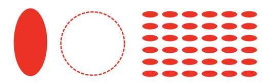
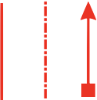

# 2D Shape Primitives API Reference

## Contents

- [OBJ_FigurePrimitive](#obj_figureprimitive)
- [OBJ_Generic](#obj_generic)
- [OBJ_Polyline](#obj_polyline)
- [OBJ_Polygon](#obj_polygon)
- [OBJ_Star](#obj_star)
- [OBJ_Rectangle](#obj_rectangle)
- [OBJ_Ellipse](#obj_ellipse)
- [OBJ_Arc](#obj_arc)
- [OBJ_Triangle](#obj_triangle)
- [OBJ_Line](#obj_line)
- [OBJ_Grid](#obj_grid)
- [OBJ_Arrow](#obj_arrow)

---

## OBJ_FigurePrimitive

Options object for any {@link FigureElementPrimitive}.

These properties are available when defining any FigureElementPrimitive.

### Properties

<ul class="tsd-parameter-list">
<li><span><span class="tsd-kind-parameter">name</span>: <span class="tsd-signature-type"><a href="https://developer.mozilla.org/docs/Web/JavaScript/Reference/Global_Objects/String" class="tsd-signature-type">string</a> | undefined</span></span><div class="tsd-comment tsd-typography"><p>name of figure element</p></div></li>
<li><span><span class="tsd-kind-parameter">position</span>: <span class="tsd-signature-type"><a href="../types/geometry_Point.TypeParsablePoint.html" class="tsd-signature-type">TypeParsablePoint</a> | undefined</span></span><div class="tsd-comment tsd-typography"><p>position overrides <code>transform</code> translation</p></div></li>
<li><span><span class="tsd-kind-parameter">transform</span>: <span class="tsd-signature-type"><a href="../types/geometry_Transform.TypeParsableTransform.html" class="tsd-signature-type">TypeParsableTransform</a> | undefined</span></span><div class="tsd-comment tsd-typography"><p>transform to apply to element</p></div></li>
<li><span><span class="tsd-kind-parameter">color</span>: <span class="tsd-signature-type"><a href="../types/types.TypeColor.html" class="tsd-signature-type">TypeColor</a> | undefined</span> <span class="tsd-signature-symbol">= is passed as the
'u_color' uniform to the fragment shader</span></span><div class="tsd-comment tsd-typography"><p>color to apply to element</p></div></li>
<li><span><span class="tsd-kind-parameter">touch</span>: <span class="tsd-signature-type"><a href="https://developer.mozilla.org/docs/Web/JavaScript/Reference/Global_Objects/Boolean" class="tsd-signature-type">boolean</a> | <a href="../interfaces/FigurePrimitives_FigurePrimitiveTypes.OBJ_Touch.html" class="tsd-signature-type">OBJ_Touch</a> | undefined</span> <span class="tsd-signature-symbol">= false</span></span><div class="tsd-comment tsd-typography"><p><code>true</code>, <code>number</code> or
<code>TypeParsablePoint</code> will set the element as touchable. If <code>number</code>, then
element touch volume is the scaled actual volume in x, y, and z. For
example, if <code>2</code>, then the touchable volume is twice the actual volume. If
<code>TypeParsablePoint</code> then the x, y, and z scales can be set independantly</p></div></li>
<li><span><span class="tsd-kind-parameter">move</span>: <span class="tsd-signature-type"><a href="https://developer.mozilla.org/docs/Web/JavaScript/Reference/Global_Objects/Boolean" class="tsd-signature-type">boolean</a> | <a href="../interfaces/Element.OBJ_ElementMove.html" class="tsd-signature-type">OBJ_ElementMove</a> | undefined</span></span><div class="tsd-comment tsd-typography"><p>setting this to anything but
<code>false</code> will set the element as movable. Use <code>OBJ_ElementMove</code> to customize
the movement options</p></div></li>
<li><span><span class="tsd-kind-parameter">dimColor</span>: <span class="tsd-signature-type"><a href="../types/types.TypeColor.html" class="tsd-signature-type">TypeColor</a> | undefined</span></span><div class="tsd-comment tsd-typography"><p>RGBA is used when vertex colors are from a
uniform, otherwise just the alpha channel is used.</p></div></li>
<li><span><span class="tsd-kind-parameter">defaultColor</span>: <span class="tsd-signature-type"><a href="../types/types.TypeColor.html" class="tsd-signature-type">TypeColor</a> | undefined</span></span></li>
<li><span><span class="tsd-kind-parameter">scenarios</span>: <span class="tsd-signature-type"><a href="../interfaces/Element.OBJ_Scenarios.html" class="tsd-signature-type">OBJ_Scenarios</a> | undefined</span></span><div class="tsd-comment tsd-typography"><p>Define
position/transform/rotation/scale/color scenarios tied to the element</p></div></li>
<li><span><span class="tsd-kind-parameter">scene</span>: <span class="tsd-signature-type">Scene | undefined</span></span><div class="tsd-comment tsd-typography"><p>Give the element a custom scene that is independant
of the figure scene. For example, use this to create a 3D object in a 2D
figure.</p></div></li>
</ul>

---

## OBJ_Generic


Options object for a {@link FigureElementPrimitive} of a generic shape

`points` will define either triangles or lines which combine
to make the shape.

`drawType` defines what sort of triangles or lines the `points` make.
The most useful, common and generic `drawType` is `'TRIANGLES'`
which can be used to create any shape.

The shape's points can be duplicated using the `copy` property
to conveniently create multiple copies (like grids) of shapes.

The shape is colored with either `color` or `texture`.

When shapes move, or are touched, borders are needed to bound their
movement, and figure out if a touch happened within the shape. Shapes
that do not move, or are not interactive, do not need borders.

A shape can have several kinds of borders. "Draw borders" (`drawBorder` and
`drawBorderBuffer`) are sets of points that define reference
borders for a shape. The shapes higher level borders `border` and
`touchBorder` may then use these draw borders to define how a shape will
interact with a figure's bounds, or where a shape can be touched.

`drawBorder` and `drawBorderBuffer` are each point arrays
that define the outer limits of the shape. For non-contigous shapes
(like islands of shapes), an array of point arrays can be used.
Both borders can be anything, but typically a `drawBorder` would define the
border of the visible shape, and a `drawBorderBuffer` would define some
extra space, or buffer, around the visible shape (particulaly useful for
defining the `touchBorder` later).

`border` is used for checking if the shape is within some bounds. When
shapes are moved, if their bounds are limited, this border will define when
the shape is at a limit. The `border` property can be:
- `draw`: use `drawBorder` points
- `buffer`: use `drawBorderBuffer` points
- `rect`: use a rectangle bounding `drawBorder`
- `number`: use a rectangle that is `number` larger than the rectangle
   bounding `drawBorder`
- `Array<TypeParsablePoint>`: a custom contiguous border
- `Array<Array<TypeParsablePoint>>`: a custom border of several contiguous
   portions

`touchBorder` is used for checking if a shape is touched. The `touchBorder`
property can be:
- `draw`: use `drawBorder` points
- `buffer`: use `drawBorderBuffer` points
- `border`: use same as `border`
- `rect`: use a rectangle bounding `border`
- `number`: use a rectangle that is `number` larger than the rectangle
   bounding `border`
- `Array<TypeParsablePoint>`: a custom contiguous border
- `Array<Array<TypeParsablePoint>>`: a custom border of several contiguous
   portions

### Properties

<ul class="tsd-parameter-list">
<li><span><span class="tsd-kind-parameter">points</span>: <span class="tsd-signature-type"><a href="https://developer.mozilla.org/docs/Web/JavaScript/Reference/Global_Objects/Array" class="tsd-signature-type">Array</a><<a href="../types/geometry_Point.TypeParsablePoint.html" class="tsd-signature-type">TypeParsablePoint</a>></span></span></li>
<li><span><span class="tsd-kind-parameter">drawType</span>: <span class="tsd-signature-type"><a href="../types/FigurePrimitives_FigurePrimitiveTypes.TypeGLPrimitive.html" class="tsd-signature-type">TypeGLPrimitive</a> | undefined</span> <span class="tsd-signature-symbol">= 'TRIANGLES'</span></span></li>
<li><span><span class="tsd-kind-parameter">copy</span>: <span class="tsd-signature-type"><a href="https://developer.mozilla.org/docs/Web/JavaScript/Reference/Global_Objects/Array" class="tsd-signature-type">Array</a><<a href="../interfaces/geometries_copy_copy.CPY_Step.html" class="tsd-signature-type">CPY_Step</a> | <a href="https://developer.mozilla.org/docs/Web/JavaScript/Reference/Global_Objects/String" class="tsd-signature-type">string</a>> | <a href="../interfaces/geometries_copy_copy.CPY_Step.html" class="tsd-signature-type">CPY_Step</a> | undefined</span> <span class="tsd-signature-symbol">= []</span></span><div class="tsd-comment tsd-typography"><p>use <code>drawType</code> as
<code>'TRIANGLES'</code> when using copy</p></div></li>
<li><span><span class="tsd-kind-parameter">texture</span>: <span class="tsd-signature-type"><a href="../interfaces/FigurePrimitives_FigurePrimitiveTypes.OBJ_Texture.html" class="tsd-signature-type">OBJ_Texture</a> | undefined</span></span><div class="tsd-comment tsd-typography"><p>override <code>color</code> with a texture if defined</p></div></li>
<li><span><span class="tsd-kind-parameter">drawBorder</span>: <span class="tsd-signature-type"><a href="../types/g2.TypeParsableBorder.html" class="tsd-signature-type">TypeParsableBorder</a> | undefined</span></span></li>
<li><span><span class="tsd-kind-parameter">drawBorderBuffer</span>: <span class="tsd-signature-type"><a href="../types/g2.TypeParsableBorder.html" class="tsd-signature-type">TypeParsableBorder</a> | undefined</span></span></li>
<li><span><span class="tsd-kind-parameter">border</span>: <span class="tsd-signature-type"><a href="../types/g2.TypeParsableBuffer.html" class="tsd-signature-type">TypeParsableBuffer</a> | <a href="../types/g2.TypeParsableBorder.html" class="tsd-signature-type">TypeParsableBorder</a> | 'buffer' | 'draw' | 'rect' | undefined</span> <span class="tsd-signature-symbol">= 'draw'</span></span><div class="tsd-comment tsd-typography"><p>defines border of primitive. Use <code>draw</code> to use the <code>drawBorder</code> of the
element. Use 'buffer' to use the <code>drawBorderBuffer</code> property of the element.
Use <code>'rect'</code> for the bounding rectangle of <code>drawBorder</code>. Use
<code>TypeParsableBuffer</code> for the bounding rectangle of <code>drawBorder</code>. Use
<code>TypeParsableBorder</code> for a custom border.</p></div></li>
<li><span><span class="tsd-kind-parameter">touchBorder</span>: <span class="tsd-signature-type"><a href="../types/g2.TypeParsableBorder.html" class="tsd-signature-type">TypeParsableBorder</a> | 'rect' | 'border' | 'buffer' | 'draw' | undefined</span> <span class="tsd-signature-symbol">= 'border'</span></span><div class="tsd-comment tsd-typography"><p>defines touch border of the primitive. Use <code>border</code> to use the same border
as <code>border</code>. Use <code>draw</code> to use the <code>drawBorder</code> of the element.
Use 'buffer' to use the <code>drawBorderBuffer</code> property of the element.
Use <code>'rect'</code> for the bounding rectangle of <code>drawBorderBuffer</code>. Use
<code>TypeParsableBuffer</code> for the bounding rectangle of <code>drawBorderBuffer</code>. Use
<code>TypeParsableBorder</code> for a custom border.</p></div></li>
<li><span><span class="tsd-kind-parameter">pulse</span>: <span class="tsd-signature-type"><a href="../interfaces/FigurePrimitives_FigurePrimitiveTypes.OBJ_PulseScale.html" class="tsd-signature-type">OBJ_PulseScale</a> | <a href="https://developer.mozilla.org/docs/Web/JavaScript/Reference/Global_Objects/Number" class="tsd-signature-type">number</a> | undefined</span> <span class="tsd-signature-symbol">= number</span></span><div class="tsd-comment tsd-typography"><p>set default scale pulse options
(<code>OBJ_PulseScale</code>) or pulse scale directly</p></div></li>
</ul>

#### Square and triangle

```js
figure.add({
  name: 'squareAndTri',
  make: 'generic',
  points: [
    [-1, 0.5], [-1, -0.5], [0, 0.5],
    [0, 0.5], [-1, -0.5], [0, -0.5],
    [0, -0.5], [1, 0.5], [1, -0.5],
  ],
});
```

#### rhombus with larger touch borders

```js
figure.add({
  name: 'rhombus',
  make: 'generic',
  points: [
    [-0.5, -0.5], [0, 0.5], [1, 0.5],
    [-0.5, -0.5], [1, 0.5], [0.5, -0.5],
  ],
  border: [[
    [-1, -1], [-0.5, 1], [1.5, 1], [1, -1],
  ]],
  mods: {
    isMovable: true,
    move: {
      bounds: 'figure',
    },
  },
});
```

#### Grid of triangles

```js
figure.add({
  name: 'gridOfTris',
  make: 'generic',
  points: [
    [-1, -1], [-0.7, -1], [-1, -0.7],
  ],
  copy: [
    { along: 'x', num: 5, step: 0.4 },
    { along: 'y', num: 5, step: 0.4 },
  ],
});
```

> To test examples, append them to the
<a href="#drawing-boilerplate">boilerplate</a>


---

## OBJ_Polyline

*Extends {@link OBJ_Generic}*

Polyline shape options object that extends {@link OBJ_Generic} (without
`drawType`) and {@link OBJ_FigurePrimitive}


A polyline is a series of lines that are connected end to end. It is defined
by a series of points which are the ends and corners of the polyline.

The series of points is a zero width ideal polyline, and so to see it we must
give it some `width`. This width can either be grown on one side of the
ideal polyline or grown on both sides of it equally using `widthIs`.

A polyline can have a "positive" or "negative" side, and an "inside" or "outside".

If a line is defined from p1 to p2, then the *positive* side is the
side where the line moves if it is rotated around p1 in the positive (counter
clockwise) direction. Thus the order of the points that define the line
defines which side is positive and negative. A polyline is made up of many
lines end to end, and thus itself will have a positive and negative side
dependent on the order of points.

Similarly we can define a line's side as either *inside* or *outside*. Each
corner in the polyline will have an angle on the negative side of the line
and a explementary angle on the positive side of the line. The *inside* side
of the line is the same as the *negative* side if the sum of all the negative
side angles is smaller than the sum of all *positive* side angles.

Both positive/negative and inside/outside are provided to define a line's
side as different situations make different side definitions more intuitive.
For instance, a closed, simple polygon has an obvious "inside" and "outside",
but how the points are ordered would define if the "inside" is "positive" or
"negative". In comparison, it would be more intuitive to use "positive" or
"negative" for a polyline that has an overall trend in a single direction.

Therefore, the polyline width can be grown on either the `'positive'`,
`'negative'`, `'inside'`, or `'outside'` side of the line or around the
middle of the line with `'mid'`. In addition, a `number` between 0 and 1 can
be used where `0` is the same as `'positive'`, `1` the same as `'negative'`
and `0.5` the same as `'mid'`.

Each point, or line connection, creates a corner that will have an *inside*
angle (<180º) and an *outside* angle (>180º or reflex angle).

Growing width on an outside corner can be challenging. As the corner becomes
sharper, the outside width joins at a point further and further from the
ideal corner. Eventually trucating the corner makes more visual sense
and therefore, a minimum angle (`minAutoCornerAngle`) is used to
specify when the corner should be drawn, and when it should be truncated.

By default, the border of the polyline is the line itself (`border` =
`'line'`). The border can also just be the points on the positive side of
the line, or the negative side of the line. This is useful for capturing
the hole shape of a closed polyline within a border. The border can also
be the encompassing rectangle of the polyline (`border` = `'rect'`) or
defined as a custom set of points.

The touch border can either be the same as the border (`'border'`), the
encompassing rect (`'rect'`), a custom set of points, or the same as the
line but with some buffer that effectively increases the width on both sides
of the line.

### Properties

<ul class="tsd-parameter-list">
<li><span><span class="tsd-kind-parameter">points</span>: <span class="tsd-signature-type"><a href="https://developer.mozilla.org/docs/Web/JavaScript/Reference/Global_Objects/Array" class="tsd-signature-type">Array</a><<a href="../types/geometry_Point.TypeParsablePoint.html" class="tsd-signature-type">TypeParsablePoint</a>></span></span></li>
<li><span><span class="tsd-kind-parameter">width</span>: <span class="tsd-signature-type"><a href="https://developer.mozilla.org/docs/Web/JavaScript/Reference/Global_Objects/Number" class="tsd-signature-type">number</a> | undefined</span> <span class="tsd-signature-symbol">= 0.01</span></span></li>
<li><span><span class="tsd-kind-parameter">close</span>: <span class="tsd-signature-type"><a href="https://developer.mozilla.org/docs/Web/JavaScript/Reference/Global_Objects/Boolean" class="tsd-signature-type">boolean</a> | undefined</span> <span class="tsd-signature-symbol">= false</span></span><div class="tsd-comment tsd-typography"><p>close the polyline on itself</p></div></li>
<li><span><span class="tsd-kind-parameter">simple</span>: <span class="tsd-signature-type"><a href="https://developer.mozilla.org/docs/Web/JavaScript/Reference/Global_Objects/Boolean" class="tsd-signature-type">boolean</a> | undefined</span> <span class="tsd-signature-symbol">= false</span></span><div class="tsd-comment tsd-typography"><p>simple and minimum computation polyline. Good
for large numbers of points that need to be updated every animation frame.
<code>widthIs</code>, <code>dash</code>, <code>arrow</code> and all corner and line primitive properties are
not available when a polyline is simple.</p></div></li>
<li><span><span class="tsd-kind-parameter">widthIs</span>: <span class="tsd-signature-type">'mid' | 'outside' | 'inside' | 'positive' | 'negative' | <a href="https://developer.mozilla.org/docs/Web/JavaScript/Reference/Global_Objects/Number" class="tsd-signature-type">number</a> | undefined</span> <span class="tsd-signature-symbol">= "mid"</span></span><div class="tsd-comment tsd-typography"><p>defines how the width is grown from the polyline's points.
Only <code>"mid"</code> is fully compatible with all options in
<code>cornerStyle</code> and <code>dash</code>.</p></div></li>
<li><span><span class="tsd-kind-parameter">drawBorder</span>: <span class="tsd-signature-type">'line' | 'positive' | 'negative' | <a href="../types/g2.TypeParsableBorder.html" class="tsd-signature-type">TypeParsableBorder</a> | undefined</span> <span class="tsd-signature-symbol">= 'line'</span></span><div class="tsd-comment tsd-typography"><p>override OBJ_Generic <code>drawBorder</code> with <code>'line'</code> to make the drawBorder just
the line itself, <code>'positive'</code> to make the drawBorder the positive side
of the line, and <code>'negative'</code> to make the drawBorder the negative side
of the line. Use array definition for custom drawBorder</p></div></li>
<li><span><span class="tsd-kind-parameter">drawBorderBuffer</span>: <span class="tsd-signature-type"><a href="https://developer.mozilla.org/docs/Web/JavaScript/Reference/Global_Objects/Number" class="tsd-signature-type">number</a> | <a href="../types/g2.TypeParsableBorder.html" class="tsd-signature-type">TypeParsableBorder</a> | undefined</span> <span class="tsd-signature-symbol">= 0</span></span><div class="tsd-comment tsd-typography"><p>override OBJ_Generic <code>drawBorderBuffer</code> with <code>number</code> to make the
drawBorderBuffer the same as the line with additional <code>number</code> thickness
on either side</p></div></li>
<li><span><span class="tsd-kind-parameter">cornerStyle</span>: <span class="tsd-signature-type">'auto' | 'none' | 'radius' | 'fill' | undefined</span> <span class="tsd-signature-symbol">= "auto"</span></span><div class="tsd-comment tsd-typography"><p>- <code>"auto"</code>:
sharp corners sharp when angle is less than <code>minAutoCornerAngle</code>, <code>"none"</code>: no
corners, <code>"radius"</code>: curved corners, <code>"fill"</code>: fills the gapes between the line
ends</p></div></li>
<li><span><span class="tsd-kind-parameter">cornerSize</span>: <span class="tsd-signature-type"><a href="https://developer.mozilla.org/docs/Web/JavaScript/Reference/Global_Objects/Number" class="tsd-signature-type">number</a> | undefined</span> <span class="tsd-signature-symbol">= 0.01</span></span><div class="tsd-comment tsd-typography"><p>only used when <code>cornerStyle</code> = <code>radius</code></p></div></li>
<li><span><span class="tsd-kind-parameter">cornerSides</span>: <span class="tsd-signature-type"><a href="https://developer.mozilla.org/docs/Web/JavaScript/Reference/Global_Objects/Number" class="tsd-signature-type">number</a> | undefined</span> <span class="tsd-signature-symbol">= 10</span></span><div class="tsd-comment tsd-typography"><p>number of sides in curve - only used when
 <code>cornerStyle</code> = <code>radius</code></p></div></li>
<li><span><span class="tsd-kind-parameter">cornersOnly</span>: <span class="tsd-signature-type"><a href="https://developer.mozilla.org/docs/Web/JavaScript/Reference/Global_Objects/Boolean" class="tsd-signature-type">boolean</a> | undefined</span> <span class="tsd-signature-symbol">= false</span></span><div class="tsd-comment tsd-typography"><p>draw only the corners with size <code>cornerSize</code></p></div></li>
<li><span><span class="tsd-kind-parameter">cornerLength</span>: <span class="tsd-signature-type"><a href="https://developer.mozilla.org/docs/Web/JavaScript/Reference/Global_Objects/Number" class="tsd-signature-type">number</a> | undefined</span> <span class="tsd-signature-symbol">= 0.1</span></span><div class="tsd-comment tsd-typography"><p>use only with <code>cornersOnly</code> = <code>true</code> -
length of corner to draw</p></div></li>
<li><span><span class="tsd-kind-parameter">minAutoCornerAngle</span>: <span class="tsd-signature-type"><a href="https://developer.mozilla.org/docs/Web/JavaScript/Reference/Global_Objects/Number" class="tsd-signature-type">number</a> | undefined</span> <span class="tsd-signature-symbol">= π/7</span></span><div class="tsd-comment tsd-typography"><p>see <code>cornerStyle</code> = <code>auto</code></p></div></li>
<li><span><span class="tsd-kind-parameter">dash</span>: <span class="tsd-signature-type"><a href="../types/types.TypeDash.html" class="tsd-signature-type">TypeDash</a> | undefined</span></span><div class="tsd-comment tsd-typography"><p>leave empty for solid line - use array of
numbers for dash line where first number is length of line, second number is
length of gap and then the pattern repeats - can use more than one dash length
and gap  - e.g. [0.1, 0.01, 0.02, 0.01] produces a lines with a long dash,
short gap, short dash, short gap and then repeats.</p></div></li>
<li><span><span class="tsd-kind-parameter">arrow</span>: <span class="tsd-signature-type"><a href="../interfaces/geometries_arrow.OBJ_LineArrows.html" class="tsd-signature-type">OBJ_LineArrows</a> | <a href="../types/geometries_arrow.TypeArrowHead.html" class="tsd-signature-type">TypeArrowHead</a> | undefined</span></span><div class="tsd-comment tsd-typography"><p>either an object defining custom
arrows or a string representing the name of an arrow head style can be used.
If a string is used, then the line will have an arrow at both ends.
Arrows are only available for <code>close: false</code>,
<code>widthIs: 'mid'</code> and <code>linePrimitives: false</code></p></div></li>
<li><span><span class="tsd-kind-parameter">linePrimitives</span>: <span class="tsd-signature-type"><a href="https://developer.mozilla.org/docs/Web/JavaScript/Reference/Global_Objects/Boolean" class="tsd-signature-type">boolean</a> | undefined</span> <span class="tsd-signature-symbol">= false</span></span><div class="tsd-comment tsd-typography"><p>Use WebGL line primitives instead of
triangle primitives to draw the line</p></div></li>
<li><span><span class="tsd-kind-parameter">lineNum</span>: <span class="tsd-signature-type"><a href="https://developer.mozilla.org/docs/Web/JavaScript/Reference/Global_Objects/Number" class="tsd-signature-type">number</a> | undefined</span> <span class="tsd-signature-symbol">= 2</span></span><div class="tsd-comment tsd-typography"><p>Number of line primitives to use when
<code>linePrimitivs</code>: <code>true</code></p></div></li>
</ul>

#### Line

```js
figure.add(
  {
    name: 'p',
    make: 'polyline',
    points: [[-0.5, -0.5], [-0.1, 0.5], [0.3, -0.2], [0.5, 0.5]],
    width: 0.05,
  },
);
```

#### Square with rounded corners and dot-dash line

```js
figure.add(
  {
    name: 'p',
    make: 'polyline',
    points: [[-0.5, -0.5], [0.5, -0.5], [0.5, 0.5], [-0.5, 0.5]],
    width: 0.05,
    dash: [0.17, 0.05, 0.05, 0.05],
    close: true,
    cornerStyle: 'radius',
    cornerSize: 0.1,
  },
);
```

#### Corners only of a triangle

```js
figure.add(
 {
   name: 'p',
   make: 'polyline',
   points: [[-0.5, -0.5], [0.5, -0.5], [0, 0.5]],
   width: 0.05,
   close: true,
   cornersOnly: true,
   cornerLength: 0.2,
 },
);
```

#### Zig zag with arrows

```js
figure.add({
  name: 'arrowedLine',
  make: 'polyline',
  points: [[0, 0], [1, 0], [0, 0.7], [1, 0.7]],
  width: 0.05,
  cornerStyle: 'fill',
  arrow: {
    scale: 0.7,
    start: {
      head: 'triangle',
      reverse: true,
    },
    end: 'barb',
  },
});
```

> To test examples, append them to the
<a href="#drawing-boilerplate">boilerplate</a>


---

## OBJ_Polygon

*Extends {@link OBJ_Generic}*

Polygon or partial polygon shape options object that extends
{@link OBJ_Generic} (without `drawType`)


### Properties

<ul class="tsd-parameter-list">
<li><span><span class="tsd-kind-parameter">sides</span>: <span class="tsd-signature-type"><a href="https://developer.mozilla.org/docs/Web/JavaScript/Reference/Global_Objects/Number" class="tsd-signature-type">number</a> | undefined</span> <span class="tsd-signature-symbol">= 4</span></span></li>
<li><span><span class="tsd-kind-parameter">radius</span>: <span class="tsd-signature-type"><a href="https://developer.mozilla.org/docs/Web/JavaScript/Reference/Global_Objects/Number" class="tsd-signature-type">number</a> | undefined</span> <span class="tsd-signature-symbol">= 1</span></span></li>
<li><span><span class="tsd-kind-parameter">rotation</span>: <span class="tsd-signature-type"><a href="https://developer.mozilla.org/docs/Web/JavaScript/Reference/Global_Objects/Number" class="tsd-signature-type">number</a> | undefined</span> <span class="tsd-signature-symbol">= 0</span></span><div class="tsd-comment tsd-typography"><p>shape rotation during vertex definition
(different to a rotation step in a trasform)</p></div></li>
<li><span><span class="tsd-kind-parameter">offset</span>: <span class="tsd-signature-type"><a href="../types/geometry_Point.TypeParsablePoint.html" class="tsd-signature-type">TypeParsablePoint</a> | undefined</span> <span class="tsd-signature-symbol">= [0, 0]</span></span><div class="tsd-comment tsd-typography"><p>shape center offset from origin
during vertex definition (different to a translation step in a transform)</p></div></li>
<li><span><span class="tsd-kind-parameter">sidesToDraw</span>: <span class="tsd-signature-type"><a href="https://developer.mozilla.org/docs/Web/JavaScript/Reference/Global_Objects/Number" class="tsd-signature-type">number</a> | undefined</span> <span class="tsd-signature-symbol">= all sides</span></span><div class="tsd-comment tsd-typography"><p>number of sides to draw</p></div></li>
<li><span><span class="tsd-kind-parameter">angleToDraw</span>: <span class="tsd-signature-type"><a href="https://developer.mozilla.org/docs/Web/JavaScript/Reference/Global_Objects/Number" class="tsd-signature-type">number</a> | undefined</span> <span class="tsd-signature-symbol">= 2π</span></span><div class="tsd-comment tsd-typography"><p>same as <code>sidesToDraw</code> but using angle for
the definition</p></div></li>
<li><span><span class="tsd-kind-parameter">direction</span>: <span class="tsd-signature-type">-1 | 1 | undefined</span> <span class="tsd-signature-symbol">= [0, 0]</span></span><div class="tsd-comment tsd-typography"><p>direction to draw polygon where 1 is
counter clockwise and -1 is clockwise (<code>1</code>)
center. This is different to position or transform as these translate the
vertices on each draw.</p></div></li>
<li><span><span class="tsd-kind-parameter">line</span>: <span class="tsd-signature-type"><a href="../interfaces/FigurePrimitives_FigurePrimitiveTypes.OBJ_LineStyleSimple.html" class="tsd-signature-type">OBJ_LineStyleSimple</a> | undefined</span></span><div class="tsd-comment tsd-typography"><p>line style options</p></div></li>
<li><span><span class="tsd-kind-parameter">drawBorderBuffer</span>: <span class="tsd-signature-type"><a href="https://developer.mozilla.org/docs/Web/JavaScript/Reference/Global_Objects/Number" class="tsd-signature-type">number</a> | <a href="../types/g2.TypeParsableBorder.html" class="tsd-signature-type">TypeParsableBorder</a> | undefined</span> <span class="tsd-signature-symbol">= 0</span></span><div class="tsd-comment tsd-typography"><p>override the OBJ_Generic <code>drawBorderBuffer</code> with <code>number</code> to make the
drawBorderBuffer a polygon that is wider by <code>number</code></p></div></li>
</ul>

#### Simple filled hexagon

```js
figure.add({
  name: 'hexagon',
  make: 'polygon',
  sides: 6,
  radius: 0.5,
});
```

#### Circle from dashed line

```js
const circ = figure.primitives.polygon({
  sides: 100,
  radius: 0.5,
  line: {
    width: 0.03,
    dash: [0.1, 0.03 ],
  },
});
figure.elements.add('circle', circ);
```

#### Half octagon rotated

```js
figure.add({
  name: 'halfOctagon',
  make: 'polygon',
  sides: 8,
  radius: 0.5,
  angleToDraw: Math.PI,
  line: {
    width: 0.03,
  },
  direction: -1,
  rotation: Math.PI / 2,
});
```

> To test examples, append them to the
<a href="#drawing-boilerplate">boilerplate</a>


---

## OBJ_Star

*Extends {@link OBJ_Generic}*

Star options object that extends {@link OBJ_Generic} (without
`drawType`) and {@link OBJ_FigurePrimitive}


### Properties

<ul class="tsd-parameter-list">
<li><span><span class="tsd-kind-parameter">sides</span>: <span class="tsd-signature-type"><a href="https://developer.mozilla.org/docs/Web/JavaScript/Reference/Global_Objects/Number" class="tsd-signature-type">number</a> | undefined</span> <span class="tsd-signature-symbol">= 4</span></span></li>
<li><span><span class="tsd-kind-parameter">radius</span>: <span class="tsd-signature-type"><a href="https://developer.mozilla.org/docs/Web/JavaScript/Reference/Global_Objects/Number" class="tsd-signature-type">number</a> | undefined</span> <span class="tsd-signature-symbol">= 1</span></span></li>
<li><span><span class="tsd-kind-parameter">innerRadius</span>: <span class="tsd-signature-type"><a href="https://developer.mozilla.org/docs/Web/JavaScript/Reference/Global_Objects/Number" class="tsd-signature-type">number</a> | undefined</span> <span class="tsd-signature-symbol">= radius / 2</span></span></li>
<li><span><span class="tsd-kind-parameter">rotation</span>: <span class="tsd-signature-type"><a href="https://developer.mozilla.org/docs/Web/JavaScript/Reference/Global_Objects/Number" class="tsd-signature-type">number</a> | undefined</span> <span class="tsd-signature-symbol">= 0</span></span><div class="tsd-comment tsd-typography"><p>shape rotation during vertex definition
(different to a rotation step in a trasform)</p></div></li>
<li><span><span class="tsd-kind-parameter">offset</span>: <span class="tsd-signature-type"><a href="../types/geometry_Point.TypeParsablePoint.html" class="tsd-signature-type">TypeParsablePoint</a> | undefined</span> <span class="tsd-signature-symbol">= [0, 0]</span></span><div class="tsd-comment tsd-typography"><p>shape center offset from origin
during vertex definition (different to a translation step in a transform)</p></div></li>
<li><span><span class="tsd-kind-parameter">line</span>: <span class="tsd-signature-type"><a href="../interfaces/FigurePrimitives_FigurePrimitiveTypes.OBJ_LineStyleSimple.html" class="tsd-signature-type">OBJ_LineStyleSimple</a> | undefined</span></span><div class="tsd-comment tsd-typography"><p>line style options</p></div></li>
<li><span><span class="tsd-kind-parameter">drawBorderBuffer</span>: <span class="tsd-signature-type"><a href="https://developer.mozilla.org/docs/Web/JavaScript/Reference/Global_Objects/Number" class="tsd-signature-type">number</a> | <a href="../types/g2.TypeParsableBorder.html" class="tsd-signature-type">TypeParsableBorder</a> | undefined</span> <span class="tsd-signature-symbol">= 0</span></span><div class="tsd-comment tsd-typography"><p>override the OBJ_Generic <code>drawBorderBuffer</code> with <code>number</code> to make the
drawBorderBuffer a polygon that is <code>number</code> thicker than the radius</p></div></li>
</ul>

#### Simple 5 pointed star

```js
figure.add({
  name: 's',
  make: 'star',
  radius: 0.5,
  sides: 5,
});
```

#### 7 pointed dashed line star

```js
figure.add({
  name: 's',
  make: 'star',
  radius: 0.5,
  innerRadius: 0.3,
  sides: 7,
  line: {
    width: 0.02,
    dash: [0.05, 0.01],
  },
});
```

#### Star surrounded by stars

```js
figure.add({
  name: 's',
  make: 'star',
  radius: 0.1,
  sides: 5,
  rotation: -Math.PI / 2,
  // line: { width: 0.01 },
  copy: [
    {
      to: [0.6, 0],
      original: false,
    },
    {
      along: 'rotation',
      num: 16,
      step: Math.PI * 2 / 16,
      start: 1,
    },
    {
      to: new Fig.Transform().scale(3, 3).rotate(Math.PI / 2),
      start: 0,
      end: 1,
    },
  ],
});
```

> To test examples, append them to the
<a href="#drawing-boilerplate">boilerplate</a>


---

## OBJ_Rectangle

*Extends {@link OBJ_Generic}*

Rectangle shape options object that extends {@link OBJ_Generic} (without
`drawType) and {@link OBJ_FigurePrimitive}


### Properties

<ul class="tsd-parameter-list">
<li><span><span class="tsd-kind-parameter">width</span>: <span class="tsd-signature-type"><a href="https://developer.mozilla.org/docs/Web/JavaScript/Reference/Global_Objects/Number" class="tsd-signature-type">number</a> | undefined</span> <span class="tsd-signature-symbol">= 1</span></span></li>
<li><span><span class="tsd-kind-parameter">height</span>: <span class="tsd-signature-type"><a href="https://developer.mozilla.org/docs/Web/JavaScript/Reference/Global_Objects/Number" class="tsd-signature-type">number</a> | undefined</span> <span class="tsd-signature-symbol">= 1</span></span></li>
<li><span><span class="tsd-kind-parameter">yAlign</span>: <span class="tsd-signature-type">'bottom' | 'middle' | 'top' | <a href="https://developer.mozilla.org/docs/Web/JavaScript/Reference/Global_Objects/Number" class="tsd-signature-type">number</a> | undefined</span> <span class="tsd-signature-symbol">= 'middle'</span></span></li>
<li><span><span class="tsd-kind-parameter">xAlign</span>: <span class="tsd-signature-type">'left' | 'center' | 'right' | <a href="https://developer.mozilla.org/docs/Web/JavaScript/Reference/Global_Objects/Number" class="tsd-signature-type">number</a> | undefined</span> <span class="tsd-signature-symbol">= 'center'</span></span></li>
<li><span><span class="tsd-kind-parameter">corner</span>: <span class="tsd-signature-type"><a href="../interfaces/types.OBJ_CurvedCorner.html" class="tsd-signature-type">OBJ_CurvedCorner</a> | undefined</span></span><div class="tsd-comment tsd-typography"><p>define for rounded corners</p></div></li>
<li><span><span class="tsd-kind-parameter">line</span>: <span class="tsd-signature-type"><a href="../interfaces/FigurePrimitives_FigurePrimitiveTypes.OBJ_LineStyleSimple.html" class="tsd-signature-type">OBJ_LineStyleSimple</a> | undefined</span></span><div class="tsd-comment tsd-typography"><p>line style options</p></div></li>
<li><span><span class="tsd-kind-parameter">drawBorderBuffer</span>: <span class="tsd-signature-type"><a href="https://developer.mozilla.org/docs/Web/JavaScript/Reference/Global_Objects/Number" class="tsd-signature-type">number</a> | <a href="../types/g2.TypeParsableBorder.html" class="tsd-signature-type">TypeParsableBorder</a> | undefined</span> <span class="tsd-signature-symbol">= 0</span></span><div class="tsd-comment tsd-typography"><p>override the OBJ_Generic <code>drawBorderBuffer</code> with <code>number</code> to make the
drawBorderBuffer a rectangle that is <code>number</code> wider and higher on each side</p></div></li>
<li><span><span class="tsd-kind-parameter">offset</span>: <span class="tsd-signature-type"><a href="../types/geometry_Point.TypeParsablePoint.html" class="tsd-signature-type">TypeParsablePoint</a> | undefined</span></span></li>
</ul>

#### Filled rectangle

```js
figure.add({
  name: 'r',
  make: 'rectangle',
  width: 1,
  height: 0.5,
});
```

#### Corners with radius and dashed line

```js
figure.add({
  name: 'r',
  make: 'rectangle',
  width: 0.5,
  height: 0.5,
  line: {
    width: 0.02,
    dash: [0.05, 0.03]
  },
  corner: {
    radius: 0.1,
    sides: 10,
  },
});
```

#### Rectangle copies rotated

```js
figure.add({
  name: 'r',
  make: 'rectangle',
  width: 0.5,
  height: 0.5,
  line: {
    width: 0.01,
  },
  copy: {
    along: 'rotation',
    num: 3,
    step: Math.PI / 2 / 3
  },
});
```

> To test examples, append them to the
<a href="#drawing-boilerplate">boilerplate</a>


---

## OBJ_Ellipse

*Extends {@link OBJ_Generic}*

Ellipse shape options object that extends {@link OBJ_Generic} (without
`drawType`) and {@link OBJ_FigurePrimitive}



### Properties

<ul class="tsd-parameter-list">
<li><span><span class="tsd-kind-parameter">width</span>: <span class="tsd-signature-type"><a href="https://developer.mozilla.org/docs/Web/JavaScript/Reference/Global_Objects/Number" class="tsd-signature-type">number</a> | undefined</span> <span class="tsd-signature-symbol">= 1</span></span></li>
<li><span><span class="tsd-kind-parameter">height</span>: <span class="tsd-signature-type"><a href="https://developer.mozilla.org/docs/Web/JavaScript/Reference/Global_Objects/Number" class="tsd-signature-type">number</a> | undefined</span> <span class="tsd-signature-symbol">= 1</span></span></li>
<li><span><span class="tsd-kind-parameter">yAlign</span>: <span class="tsd-signature-type">'bottom' | 'middle' | 'top' | <a href="https://developer.mozilla.org/docs/Web/JavaScript/Reference/Global_Objects/Number" class="tsd-signature-type">number</a> | undefined</span> <span class="tsd-signature-symbol">= 'middle'</span></span></li>
<li><span><span class="tsd-kind-parameter">xAlign</span>: <span class="tsd-signature-type">'left' | 'center' | 'right' | <a href="https://developer.mozilla.org/docs/Web/JavaScript/Reference/Global_Objects/Number" class="tsd-signature-type">number</a> | undefined</span> <span class="tsd-signature-symbol">= 'center'</span></span></li>
<li><span><span class="tsd-kind-parameter">sides</span>: <span class="tsd-signature-type"><a href="https://developer.mozilla.org/docs/Web/JavaScript/Reference/Global_Objects/Number" class="tsd-signature-type">number</a> | undefined</span> <span class="tsd-signature-symbol">= 20</span></span><div class="tsd-comment tsd-typography"><p>number of sides to draw ellipse with</p></div></li>
<li><span><span class="tsd-kind-parameter">line</span>: <span class="tsd-signature-type"><a href="../interfaces/FigurePrimitives_FigurePrimitiveTypes.OBJ_LineStyleSimple.html" class="tsd-signature-type">OBJ_LineStyleSimple</a> | undefined</span></span><div class="tsd-comment tsd-typography"><p>line style options</p></div></li>
<li><span><span class="tsd-kind-parameter">drawBorderBuffer</span>: <span class="tsd-signature-type"><a href="https://developer.mozilla.org/docs/Web/JavaScript/Reference/Global_Objects/Number" class="tsd-signature-type">number</a> | <a href="../types/g2.TypeParsableBorder.html" class="tsd-signature-type">TypeParsableBorder</a> | undefined</span> <span class="tsd-signature-symbol">= 0</span></span><div class="tsd-comment tsd-typography"><p>override the OBJ_Generic <code>drawBorderBuffer</code> with <code>number</code> to make the
drawBorderBuffer a ellipse that is <code>number</code> thicker around its border</p></div></li>
</ul>

#### Filled ellipse

```js
figure.add({
  name: 'e',
  make: 'ellipse',
  height: 1,
  width: 0.5,
  sides: 100,
});
```

#### Dashed line circle

```js
figure.add({
  name: 'e',
  make: 'ellipse',
  height: 1,
  width: 1,
  sides: 100,
  line: {
    width: 0.02,
    dash: [0.05, 0.02],
  },
});
```

#### Ellipse grid

```js
figure.add({
  name: 'e',
  make: 'ellipse',
  height: 0.08,
  width: 0.2,
  sides: 20,
  copy: [
    { along: 'x', step: 0.25, num: 5 },
    { along: 'y', step: 0.15, num: 5 },
  ]
});
```

> To test examples, append them to the
<a href="#drawing-boilerplate">boilerplate</a>


---

## OBJ_Arc

*Extends {@link OBJ_Generic}*

Arc shape options object that extends {@link OBJ_Generic} (without
`drawType`) and {@link OBJ_FigurePrimitive}


### Properties

<ul class="tsd-parameter-list">
<li><span><span class="tsd-kind-parameter">radius</span>: <span class="tsd-signature-type"><a href="https://developer.mozilla.org/docs/Web/JavaScript/Reference/Global_Objects/Number" class="tsd-signature-type">number</a> | undefined</span></span></li>
<li><span><span class="tsd-kind-parameter">sides</span>: <span class="tsd-signature-type"><a href="https://developer.mozilla.org/docs/Web/JavaScript/Reference/Global_Objects/Number" class="tsd-signature-type">number</a> | undefined</span> <span class="tsd-signature-symbol">= 20</span></span></li>
<li><span><span class="tsd-kind-parameter">startAngle</span>: <span class="tsd-signature-type"><a href="https://developer.mozilla.org/docs/Web/JavaScript/Reference/Global_Objects/Number" class="tsd-signature-type">number</a> | undefined</span> <span class="tsd-signature-symbol">= 0</span></span></li>
<li><span><span class="tsd-kind-parameter">angle</span>: <span class="tsd-signature-type"><a href="https://developer.mozilla.org/docs/Web/JavaScript/Reference/Global_Objects/Number" class="tsd-signature-type">number</a> | undefined</span> <span class="tsd-signature-symbol">= 1</span></span></li>
<li><span><span class="tsd-kind-parameter">line</span>: <span class="tsd-signature-type"><a href="../interfaces/FigurePrimitives_FigurePrimitiveTypes.OBJ_LineStyleSimple.html" class="tsd-signature-type">OBJ_LineStyleSimple</a> | undefined</span></span><div class="tsd-comment tsd-typography"><p>line style options</p></div></li>
<li><span><span class="tsd-kind-parameter">drawBorderBuffer</span>: <span class="tsd-signature-type"><a href="https://developer.mozilla.org/docs/Web/JavaScript/Reference/Global_Objects/Number" class="tsd-signature-type">number</a> | <a href="../types/g2.TypeParsableBorder.html" class="tsd-signature-type">TypeParsableBorder</a> | undefined</span> <span class="tsd-signature-symbol">= 0</span></span><div class="tsd-comment tsd-typography"><p>override the OBJ_Generic <code>drawBorderBuffer</code> with <code>number</code> to make the
drawBorderBuffer a ellipse that is <code>number</code> thicker around its border</p></div></li>
</ul>

#### Simple fill

```js
figure.add({
  make: 'arc',
  angle: Math.PI * 2 / 3,
  radius: 1,
});
```

#### Fill to center

```js
figure.add({
  make: 'arc',
  angle: Math.PI * 2 / 3,
  startAngle: Math.PI / 3,
  radius: 1,
  fillCenter: true,
});
```

#### Arc line

```js
figure.add({
  make: 'arc',
  angle: Math.PI / 3,
  radius: 1,
  line: { width: 0.05, widthIs: 'inside' },
});
```

#### Arc dashed line

```js
figure.add({
  make: 'arc',
  angle: Math.PI * 3 / 2,
  radius: 1,
  sides: 100,
  line: { width: 0.05, dash: [0.3, 0.1, 0.1, 0.1] },
});
```

> To test examples, append them to the
<a href="#drawing-boilerplate">boilerplate</a>


---

## OBJ_Triangle

*Extends {@link OBJ_Generic}*

Triangle shape options object that extends {@link OBJ_Generic} (without
`drawType`) and {@link OBJ_FigurePrimitive}


The most generic way to define a triangle is with three points (`points`
property). When using `points`, all the other properties that can also
define a triangle are ignored: `width`, `height`, `top`,
`SSS`, `ASA`, `AAS`, `SAS`, `direction`, `rotation`, `xAlign` and `yAlign`.

The other ways to define a triangle are (in order of highest override
preference to lowest if more than one is defined in the object):
- `ASA` or Angle-Side-Angle
- `SAS` or Side-Angle-Side
- `AAS` or Angle-Angle-Side
- `SSS` or Side-Side-Side
- `width`, `height` and `top` location

All these methods also use `direction` to define the triangles, and
`rotation`, `xAlign` and `yAlign` to position the triangles. Each corner
and side of the triangle is indexed, and can be used for positioning.


A triangle starts with an angle (a1) at (0, 0) and base side extending along
the x axis to a second angle a2. The base side is side 1 (s1).

Angles a1 and a2 extend the triangle above s1 if `direction` is `1`, and
below s1 when `direction` is `-1`.

s2, a3, and s3 are then the consecutive sides and angles.

Triangles can be defined with a combination of side length and angle using
`ASA`, `SAS`, `AAS` and `SSS`, where the first side or angle is s1 or a1
respectively, and the subsequent sides and angles progress consecutively.
For instance, `ASA` defines the angle a1, then side length s1, then angle
a2. `SSS` defines the side lenghts s1, s2 then s3. All these combinations of
three properties are sufficient to define a unique triangle completely.

When defining the triangle with `width`, `height` and `top`, the base side
s1 is the width, and the top point is either aligned with the `left`,
`center` or `right` of the base at some `height` above s1.

When defined, a triangle's a1 corner will be at (0, 0), and s1 will be along
the x axis. Next, a `rotation` can be applied to the triangle. A `rotation`
can either be a `number` rotating it relative to its definition, or relative
to one of its sides: s1, s2 or s3.

Finally, the triangle can be positioned (in draw space) using `xAlign` and
`yAlign`. An `xAlign` of `'left'` will position the triangle so that it's
left most point will be at (0, 0). Similarly, a `yAlign` of `'top'` will
position the triangle so its top most point is at (0, 0). Triangles
can also be aligned by angles (corners) and side mid points. For instance, an
`xAlign` of `'a2'`, will position the a2 corner at x = 0. Similarly a
`yAlign` of `'s3'` will position the triangle vertically such that the mid
point of s3 is at y = 0. `'centroid'` is relative to the geometric center of
the triangle.

Once a triangle is defined and positioned in draw space, it can then be
copied (`copy`) if more than one triangle is desired.

The triangle(s) can then be positioned (`position`) or transformed
(`transform`) in the FigureElementPrimitive local space.

Triangles can either be a solid fill, texture fill or outline. When `line`
is not defined, the triangle will be filled.

### Properties

<ul class="tsd-parameter-list">
<li><span><span class="tsd-kind-parameter">points</span>: <span class="tsd-signature-type"><a href="https://developer.mozilla.org/docs/Web/JavaScript/Reference/Global_Objects/Array" class="tsd-signature-type">Array</a><<a href="../classes/geometry_Point.Point.html" class="tsd-signature-type">Point</a>> | undefined</span></span><div class="tsd-comment tsd-typography"><p>defining points will take precedence over
all other ways to define a triangle.</p></div></li>
<li><span><span class="tsd-kind-parameter">width</span>: <span class="tsd-signature-type"><a href="https://developer.mozilla.org/docs/Web/JavaScript/Reference/Global_Objects/Number" class="tsd-signature-type">number</a> | undefined</span></span></li>
<li><span><span class="tsd-kind-parameter">height</span>: <span class="tsd-signature-type"><a href="https://developer.mozilla.org/docs/Web/JavaScript/Reference/Global_Objects/Number" class="tsd-signature-type">number</a> | undefined</span></span></li>
<li><span><span class="tsd-kind-parameter">top</span>: <span class="tsd-signature-type">'left' | 'right' | 'center' | undefined</span> <span class="tsd-signature-symbol">= center</span></span></li>
<li><span><span class="tsd-kind-parameter">SSS</span>: <span class="tsd-signature-type">[<a href="https://developer.mozilla.org/docs/Web/JavaScript/Reference/Global_Objects/Number" class="tsd-signature-type">number</a>, <a href="https://developer.mozilla.org/docs/Web/JavaScript/Reference/Global_Objects/Number" class="tsd-signature-type">number</a>, <a href="https://developer.mozilla.org/docs/Web/JavaScript/Reference/Global_Objects/Number" class="tsd-signature-type">number</a>] | undefined</span></span></li>
<li><span><span class="tsd-kind-parameter">ASA</span>: <span class="tsd-signature-type">[<a href="https://developer.mozilla.org/docs/Web/JavaScript/Reference/Global_Objects/Number" class="tsd-signature-type">number</a>, <a href="https://developer.mozilla.org/docs/Web/JavaScript/Reference/Global_Objects/Number" class="tsd-signature-type">number</a>, <a href="https://developer.mozilla.org/docs/Web/JavaScript/Reference/Global_Objects/Number" class="tsd-signature-type">number</a>] | undefined</span></span></li>
<li><span><span class="tsd-kind-parameter">AAS</span>: <span class="tsd-signature-type">[<a href="https://developer.mozilla.org/docs/Web/JavaScript/Reference/Global_Objects/Number" class="tsd-signature-type">number</a>, <a href="https://developer.mozilla.org/docs/Web/JavaScript/Reference/Global_Objects/Number" class="tsd-signature-type">number</a>, <a href="https://developer.mozilla.org/docs/Web/JavaScript/Reference/Global_Objects/Number" class="tsd-signature-type">number</a>] | undefined</span></span></li>
<li><span><span class="tsd-kind-parameter">SAS</span>: <span class="tsd-signature-type">[<a href="https://developer.mozilla.org/docs/Web/JavaScript/Reference/Global_Objects/Number" class="tsd-signature-type">number</a>, <a href="https://developer.mozilla.org/docs/Web/JavaScript/Reference/Global_Objects/Number" class="tsd-signature-type">number</a>, <a href="https://developer.mozilla.org/docs/Web/JavaScript/Reference/Global_Objects/Number" class="tsd-signature-type">number</a>] | undefined</span></span></li>
<li><span><span class="tsd-kind-parameter">direction</span>: <span class="tsd-signature-type">1 | -1 | undefined</span></span></li>
<li><span><span class="tsd-kind-parameter">rotation</span>: <span class="tsd-signature-type"><a href="https://developer.mozilla.org/docs/Web/JavaScript/Reference/Global_Objects/Number" class="tsd-signature-type">number</a> | 's1' | 's2' | 's3' | <a href="../interfaces/FigurePrimitives_FigurePrimitiveTypes2D.OBJ_TriangleSideRotationAlignment.html" class="tsd-signature-type">OBJ_TriangleSideRotationAlignment</a> | undefined</span></span></li>
<li><span><span class="tsd-kind-parameter">xAlign</span>: <span class="tsd-signature-type">'left' | 'center' | 'right' | <a href="https://developer.mozilla.org/docs/Web/JavaScript/Reference/Global_Objects/Number" class="tsd-signature-type">number</a> | 'a1' | 'a2' | 'a3' | 's1' | 's2' | 's3' | 'centroid' | 'points' | undefined</span> <span class="tsd-signature-symbol">= 'centroid'</span></span></li>
<li><span><span class="tsd-kind-parameter">yAlign</span>: <span class="tsd-signature-type">'bottom' | 'middle' | 'top' | <a href="https://developer.mozilla.org/docs/Web/JavaScript/Reference/Global_Objects/Number" class="tsd-signature-type">number</a> | 'a1' | 'a2' | 'a3' | 's1'| 's2' | 's3' | 'centroid' | 'points' | undefined</span> <span class="tsd-signature-symbol">= 'centroid'</span></span></li>
<li><span><span class="tsd-kind-parameter">line</span>: <span class="tsd-signature-type"><a href="../interfaces/FigurePrimitives_FigurePrimitiveTypes.OBJ_LineStyleSimple.html" class="tsd-signature-type">OBJ_LineStyleSimple</a> | undefined</span></span><div class="tsd-comment tsd-typography"><p>line style options - do not use any corner
options</p></div></li>
</ul>

#### Right angle triangle

```js
figure.add({
  name: 't',
  make: 'triangle',
  width: 0.5,
  height: 1,
  top: 'right',
});
```

#### 30-60-90 triangle with dashed line

```js
const t = figure.primitives.triangle({
  ASA: [Math.PI / 2, 1, Math.PI / 6],
  line: {
    width: 0.02,
    dash: [0.12, 0.04],
  },
});
figure.elements.add('t', t);
```

#### Star from 4 equilateral triangles

```js
figure.add({
  name: 'star',
  make: 'triangle',
  SSS: [1, 1, 1],
  xAlign: 'centroid',
  yAlign: 'centroid',
  copy: {
    along: 'rotation',
    num: 3,
    step: Math.PI / 6,
  },
});
```

> To test examples, append them to the
<a href="#drawing-boilerplate">boilerplate</a>


---

## OBJ_Line

*Extends {@link OBJ_Generic}*

Line definition options object that extends {@link OBJ_Generic} (without
`drawType`) and {@link OBJ_FigurePrimitive}



A line can either be defined as two points `p1` and `p2`, or
a single point `p1`, a `length` and an `angle`.

The line has some `width` that will be filled on both sides
of the line points evenly (`'mid'`), or on one side only.
The line's `'positive'` side is the side to which it rotates toward
when rotating in the positive angle direction around `p1`.
Similarly the line's `'negative'` side is the opposite.

The line can be solid or dashed using the `dash` property.

The line can have arrows at one or both ends using the `arrow` property.

### Properties

<ul class="tsd-parameter-list">
<li><span><span class="tsd-kind-parameter">p1</span>: <span class="tsd-signature-type"><a href="../types/geometry_Point.TypeParsablePoint.html" class="tsd-signature-type">TypeParsablePoint</a> | undefined</span></span><div class="tsd-comment tsd-typography"><p>start point of line</p></div></li>
<li><span><span class="tsd-kind-parameter">p2</span>: <span class="tsd-signature-type"><a href="../types/geometry_Point.TypeParsablePoint.html" class="tsd-signature-type">TypeParsablePoint</a> | undefined</span></span><div class="tsd-comment tsd-typography"><p>end point of line</p></div></li>
<li><span><span class="tsd-kind-parameter">length</span>: <span class="tsd-signature-type"><a href="https://developer.mozilla.org/docs/Web/JavaScript/Reference/Global_Objects/Number" class="tsd-signature-type">number</a> | undefined</span></span><div class="tsd-comment tsd-typography"><p>length of line from <code>p1</code></p></div></li>
<li><span><span class="tsd-kind-parameter">angle</span>: <span class="tsd-signature-type"><a href="https://developer.mozilla.org/docs/Web/JavaScript/Reference/Global_Objects/Number" class="tsd-signature-type">number</a> | undefined</span></span><div class="tsd-comment tsd-typography"><p>angle of line from <code>p1</code></p></div></li>
<li><span><span class="tsd-kind-parameter">width</span>: <span class="tsd-signature-type"><a href="https://developer.mozilla.org/docs/Web/JavaScript/Reference/Global_Objects/Number" class="tsd-signature-type">number</a> | undefined</span> <span class="tsd-signature-symbol">= 0.01</span></span></li>
<li><span><span class="tsd-kind-parameter">widthIs</span>: <span class="tsd-signature-type">'mid' | 'positive' | 'negative' | <a href="https://developer.mozilla.org/docs/Web/JavaScript/Reference/Global_Objects/Number" class="tsd-signature-type">number</a> | undefined</span> <span class="tsd-signature-symbol">= "mid"</span></span><div class="tsd-comment tsd-typography"><p>defines how the width is grown from the polyline's points.
Only <code>"mid"</code> is fully compatible with all options in
<code>arrow</code>.</p></div></li>
<li><span><span class="tsd-kind-parameter">dash</span>: <span class="tsd-signature-type"><a href="../types/types.TypeDash.html" class="tsd-signature-type">TypeDash</a> | undefined</span></span><div class="tsd-comment tsd-typography"><p>leave empty for solid line - use array of
numbers for dash line where first number is length of line, second number is
length of gap and then the pattern repeats - can use more than one dash length
and gap  - e.g. [0.1, 0.01, 0.02, 0.01] produces a lines with a long dash,
short gap, short dash, short gap and then repeats.</p></div></li>
<li><span><span class="tsd-kind-parameter">arrow</span>: <span class="tsd-signature-type"><a href="../interfaces/geometries_arrow.OBJ_LineArrows.html" class="tsd-signature-type">OBJ_LineArrows</a> | <a href="../types/geometries_arrow.TypeArrowHead.html" class="tsd-signature-type">TypeArrowHead</a> | undefined</span></span><div class="tsd-comment tsd-typography"><p>either an object defining custom
arrows or a string representing the name of an arrow head style can be used.
If a string is used, then the line will have an arrow at both ends.
Arrows are only available for <code>widthIs: 'mid'</code> and <code>linePrimitives: false</code></p></div></li>
<li><span><span class="tsd-kind-parameter">linePrimitives</span>: <span class="tsd-signature-type"><a href="https://developer.mozilla.org/docs/Web/JavaScript/Reference/Global_Objects/Boolean" class="tsd-signature-type">boolean</a> | undefined</span> <span class="tsd-signature-symbol">= false</span></span><div class="tsd-comment tsd-typography"><p>Use WebGL line primitives instead of
triangle primitives to draw the line</p></div></li>
<li><span><span class="tsd-kind-parameter">lineNum</span>: <span class="tsd-signature-type"><a href="https://developer.mozilla.org/docs/Web/JavaScript/Reference/Global_Objects/Number" class="tsd-signature-type">number</a> | undefined</span> <span class="tsd-signature-symbol">= 2</span></span><div class="tsd-comment tsd-typography"><p>Number of line primitives to use when
<code>linePrimitivs</code>: <code>true</code></p></div></li>
<li><span><span class="tsd-kind-parameter">drawBorderBuffer</span>: <span class="tsd-signature-type"><a href="https://developer.mozilla.org/docs/Web/JavaScript/Reference/Global_Objects/Number" class="tsd-signature-type">number</a> | <a href="../types/g2.TypeParsableBorder.html" class="tsd-signature-type">TypeParsableBorder</a> | undefined</span> <span class="tsd-signature-symbol">= 0</span></span><div class="tsd-comment tsd-typography"><p>override OBJ_Generic <code>drawBorderBuffer</code> with <code>number</code> to make the
drawBorderBuffer the same as the line with additional <code>number</code> thickness
on each side and the ends</p></div></li>
</ul>

#### Simple line defined by two points

```js
figure.add({
  name: 'l',
  make: 'line',
  p1: [0, 0],
  p2: [0, 1],
  width: 0.02,
});
```

#### Dashed line defined by a point, a length and an angle

```js
figure.add({
  name: 'l',
  make: 'line',
  p1: [0, 0],
  length: 1,
  angle: Math.PI / 2,
  width: 0.03,
  dash: [0.1, 0.02, 0.03, 0.02],
});
```

#### Line with two different arrows on ends

```js
figure.add({
  name: 'l',
  make: 'line',
  p1: [0, 0],
  p2: [0, 1],
  width: 0.03,
  arrow: {
    start: 'rectangle',
    end: 'barb',
  },
});
```

> To test examples, append them to the
<a href="#drawing-boilerplate">boilerplate</a>


---

## OBJ_Grid

*Extends {@link OBJ_Generic}*

Grid shape options object that extends {@link OBJ_Generic} (without
`drawType`) and {@link OBJ_FigurePrimitive}


A grid is a rectangle divided into a series of vertical and horizontal lines.

The rectangle is defined by `bounds`.

`xNum` and `yNum` can be used to defined a number of equally spaced lines
in the rectangle (including the edges).

Alternatively `xStep` and `yStep` can be used to define the spacing between
lines from the bottom left corner.

The line width and style is defined with `line`.

### Properties

<ul class="tsd-parameter-list">
<li><span><span class="tsd-kind-parameter">bounds</span>: <span class="tsd-signature-type"><a href="../types/geometry_Rect.TypeParsableRect.html" class="tsd-signature-type">TypeParsableRect</a> | undefined</span></span><div class="tsd-comment tsd-typography"><p>rectangle definition</p></div></li>
<li><span><span class="tsd-kind-parameter">step</span>: <span class="tsd-signature-type"><a href="https://developer.mozilla.org/docs/Web/JavaScript/Reference/Global_Objects/Number" class="tsd-signature-type">number</a> | undefined</span></span><div class="tsd-comment tsd-typography"><p>distance between grid lines</p></div></li>
<li><span><span class="tsd-kind-parameter">xStep</span>: <span class="tsd-signature-type"><a href="https://developer.mozilla.org/docs/Web/JavaScript/Reference/Global_Objects/Number" class="tsd-signature-type">number</a> | undefined</span></span><div class="tsd-comment tsd-typography"><p>distance between vertical lines in grid from
left - use this instead of <code>xNum</code>. This will override <code>step</code>.</p></div></li>
<li><span><span class="tsd-kind-parameter">yStep</span>: <span class="tsd-signature-type"><a href="https://developer.mozilla.org/docs/Web/JavaScript/Reference/Global_Objects/Number" class="tsd-signature-type">number</a> | undefined</span></span><div class="tsd-comment tsd-typography"><p>distance between horizontal lines in grid from
bottom - use this instead of <code>yNum</code>. This will override <code>step</code>.</p></div></li>
<li><span><span class="tsd-kind-parameter">num</span>: <span class="tsd-signature-type"><a href="https://developer.mozilla.org/docs/Web/JavaScript/Reference/Global_Objects/Number" class="tsd-signature-type">number</a> | undefined</span></span><div class="tsd-comment tsd-typography"><p>number of grid lines. This will override <code>step</code>.</p></div></li>
<li><span><span class="tsd-kind-parameter">xNum</span>: <span class="tsd-signature-type"><a href="https://developer.mozilla.org/docs/Web/JavaScript/Reference/Global_Objects/Number" class="tsd-signature-type">number</a> | undefined</span></span><div class="tsd-comment tsd-typography"><p>number of vertical lines in grid including top and
bottom lines - overrides <code>num</code> and <code>xStep</code>.</p></div></li>
<li><span><span class="tsd-kind-parameter">yNum</span>: <span class="tsd-signature-type"><a href="https://developer.mozilla.org/docs/Web/JavaScript/Reference/Global_Objects/Number" class="tsd-signature-type">number</a> | undefined</span></span><div class="tsd-comment tsd-typography"><p>number of horizontal lines in grid including left
and right lines - overrides <code>num</code> and <code>yStep</code>.</p></div></li>
<li><span><span class="tsd-kind-parameter">line</span>: <span class="tsd-signature-type"><a href="../interfaces/FigurePrimitives_FigurePrimitiveTypes2D.OBJ_LineStyle.html" class="tsd-signature-type">OBJ_LineStyle</a> | undefined</span></span><div class="tsd-comment tsd-typography"><p>line style options - do not use any corner
options</p></div></li>
<li><span><span class="tsd-kind-parameter">drawBorderBuffer</span>: <span class="tsd-signature-type"><a href="https://developer.mozilla.org/docs/Web/JavaScript/Reference/Global_Objects/Number" class="tsd-signature-type">number</a> | <a href="../types/g2.TypeParsableBorder.html" class="tsd-signature-type">TypeParsableBorder</a> | undefined</span> <span class="tsd-signature-symbol">= 0</span></span><div class="tsd-comment tsd-typography"><p>override OBJ_Generic <code>drawBorderBuffer</code> with <code>number</code> to make the
drawBorderBuffer the same as the grid outline with additional <code>number</code>
buffer each side</p></div></li>
</ul>

#### Grid defined by xStep and yStep

```js
figure.add({
  name: 'g',
  make: 'grid',
  bounds: [-0.5, -0.5, 1, 1],
  xStep: 0.25,
  yStep: 0.25,
  line: {
    width: 0.03,
  },
});
```

#### Grid defined by xNum and yNum with dashed lines

```js
const grid = figure.primitives.grid({
  bounds: [-0.5, -0.5, 1, 1],
  xNum: 4,
  yNum: 4,
  line: {
    width: 0.03,
    dash: [0.1, 0.02],
  },
});
figure.elements.add('g', grid);
```

#### Grid of grids

```js
figure.add({
  name: 'g',
  make: 'grid',
  bounds: [-0.7, -0.7, 0.6, 0.6],
  xNum: 4,
  yNum: 4,
  line: {
    width: 0.03,
  },
  copy: [
    { along: 'x', num: 1, step: 0.8},
    { along: 'y', num: 1, step: 0.8},
  ],
});
```

> To test examples, append them to the
<a href="#drawing-boilerplate">boilerplate</a>


---

## OBJ_Arrow

*Extends {@link OBJ_Generic}*

Arrow options object that extends {@link OBJ_Generic} (without
`drawType`) and {@link OBJ_FigurePrimitive}


An arrow has a head, tail, length and width. The `head` defines the head
style of the arrow. The `length`, `width` (or `radius` for polygon and circle
head styles) define the size of the arrow and `tail` defines wether it has a
tail and how long it is.

All properties have default values that can be scaled with the `scale`
property. So a `scale` of 2 will double the size of the default arrow.

An arrow can be aligned and oriented with `align` and `angle`. `align`
positions the tip, start, tail or middle part of the arrow at (0, 0) in
draw space. This part of the arrow will therefore be at the `position`
or translation of the `transform`. `angle` then gives the arrow some drawn
rotation.

Alignment definitions are:
- `tip`: arrow tip
- `start`: opposite side of `tip`
- `mid`: mid points between `start` and `tip` - useful for polygon, circle
  and bar arrows without tails when the head should be on a point, not next
  to it
- `tail`: the end of the tail when a tail exists, or where a tail would start
  if it doesn't exist.

Setting the `tail` property to `false` will draw only the arrow head,
`true` will draw a tail of length 0, and a tail with a custom length
can be defined with a `number`. A tail length of 0 will only extend a tail
to the boundaries of the head. A positive tail, will extend it beyond the
boundaries.

For arrow heads that use `length` and `width` properties, the `length` is the
dimension along the line. It includes both the head and the tail, so an arrow
with length 1 and tailLength 0.4 will have a head length of 0.6.

For `polygon` and `circle` arrows, only `radius` and `tail` are used to
determine the dimension of the arrow (`length` and `width` are ignored).

### Properties

<ul class="tsd-parameter-list">
<li><span><span class="tsd-kind-parameter">head</span>: <span class="tsd-signature-type"><a href="../types/geometries_arrow.TypeArrowHead.html" class="tsd-signature-type">TypeArrowHead</a> | undefined</span> <span class="tsd-signature-symbol">= 'triangle'</span></span><div class="tsd-comment tsd-typography"><p>head style</p></div></li>
<li><span><span class="tsd-kind-parameter">scale</span>: <span class="tsd-signature-type"><a href="https://developer.mozilla.org/docs/Web/JavaScript/Reference/Global_Objects/Number" class="tsd-signature-type">number</a> | undefined</span></span><div class="tsd-comment tsd-typography"><p>scale the default dimensions of the arrow</p></div></li>
<li><span><span class="tsd-kind-parameter">length</span>: <span class="tsd-signature-type"><a href="https://developer.mozilla.org/docs/Web/JavaScript/Reference/Global_Objects/Number" class="tsd-signature-type">number</a> | undefined</span></span><div class="tsd-comment tsd-typography"><p>dimension of the arrow head along the line</p></div></li>
<li><span><span class="tsd-kind-parameter">width</span>: <span class="tsd-signature-type"><a href="https://developer.mozilla.org/docs/Web/JavaScript/Reference/Global_Objects/Number" class="tsd-signature-type">number</a> | undefined</span></span><div class="tsd-comment tsd-typography"><p>dimension of the arrow head along the line width</p></div></li>
<li><span><span class="tsd-kind-parameter">rotation</span>: <span class="tsd-signature-type"><a href="https://developer.mozilla.org/docs/Web/JavaScript/Reference/Global_Objects/Number" class="tsd-signature-type">number</a> | undefined</span></span><div class="tsd-comment tsd-typography"><p>rotation of the polygon when <code>head = 'polygon'</code></p></div></li>
<li><span><span class="tsd-kind-parameter">sides</span>: <span class="tsd-signature-type"><a href="https://developer.mozilla.org/docs/Web/JavaScript/Reference/Global_Objects/Number" class="tsd-signature-type">number</a> | undefined</span></span><div class="tsd-comment tsd-typography"><p>number of sides in polygon or circle arrow head</p></div></li>
<li><span><span class="tsd-kind-parameter">radius</span>: <span class="tsd-signature-type"><a href="https://developer.mozilla.org/docs/Web/JavaScript/Reference/Global_Objects/Number" class="tsd-signature-type">number</a> | undefined</span></span><div class="tsd-comment tsd-typography"><p>radius of polygon or circle arrow head</p></div></li>
<li><span><span class="tsd-kind-parameter">barb</span>: <span class="tsd-signature-type"><a href="https://developer.mozilla.org/docs/Web/JavaScript/Reference/Global_Objects/Number" class="tsd-signature-type">number</a> | undefined</span></span><div class="tsd-comment tsd-typography"><p>barb length (along the length of the line) of the
barb arrow head</p></div></li>
<li><span><span class="tsd-kind-parameter">tailWidth</span>: <span class="tsd-signature-type"><a href="https://developer.mozilla.org/docs/Web/JavaScript/Reference/Global_Objects/Number" class="tsd-signature-type">number</a> | undefined</span></span><div class="tsd-comment tsd-typography"><p>width of the line that joins the arrow - if
defined this will create minimum dimensions for the arrow</p></div></li>
<li><span><span class="tsd-kind-parameter">tail</span>: <span class="tsd-signature-type"><a href="https://developer.mozilla.org/docs/Web/JavaScript/Reference/Global_Objects/Boolean" class="tsd-signature-type">boolean</a> | <a href="https://developer.mozilla.org/docs/Web/JavaScript/Reference/Global_Objects/Number" class="tsd-signature-type">number</a> | undefined</span></span><div class="tsd-comment tsd-typography"><p><code>true</code> includes a tail in the arrow of
with <code>tailWidth</code>. A <code>number</code> gives the tail a length where 0 will not
extend the tail beyond the boundaries of the head</p></div></li>
<li><span><span class="tsd-kind-parameter">align</span>: <span class="tsd-signature-type">'tip' | 'start' | 'mid' | 'tail' | undefined</span> <span class="tsd-signature-symbol">= 'tip'</span></span><div class="tsd-comment tsd-typography"><p>define which part of
the arrow is aligned at (0, 0) in draw space</p></div></li>
<li><span><span class="tsd-kind-parameter">angle</span>: <span class="tsd-signature-type"><a href="https://developer.mozilla.org/docs/Web/JavaScript/Reference/Global_Objects/Number" class="tsd-signature-type">number</a> | undefined</span> <span class="tsd-signature-symbol">= 0</span></span><div class="tsd-comment tsd-typography"><p>angle the arrow is drawn at</p></div></li>
</ul>

#### Triangle arrow with tail

```js
figure.add({
  name: 'a',
  make: 'arrow',
  head: 'triangle',
  tail: 0.15,
  length: 0.5,
});
```

#### Barb arrow with 0 tail

```js
figure.add({
  name: 'a',
  make: 'arrow',
  head: 'barb',
  angle: Math.PI / 2,
  tail: 0,
});
```

#### Create a vector map with arrows by copying an original arrow by a

```js
// transforms defining the position, rotation and scale of the arrows

// Create transforms to apply to each arrow
const r = Fig.range(0, Math.PI / 2, Math.PI / 18);
const x = [0, 1, 2, 0, 1, 2, 0, 1, 2];
const y = [0, 0, 0, 1, 1, 1, 2, 2, 2];
const s = [0.5, 0.8, 0.4, 0.6, 0.8, 0.6, 0.5, 0.8, 0.6];
const transforms = [];
for (let i = 0; i < 9; i += 1) {
  transforms.push(new Fig.Transform().scale(s[i], s[i]).rotate(r[i]).translate(x[i], y[i]));
}

// Create arrow and copy to transforms
figure.add({
  name: 'a',
  make: 'arrow',
  head: 'barb',
  align: 'mid',
  length: 0.7,
  copy: {
    to: transforms,
    original: false,
  },
});
```

---

