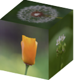
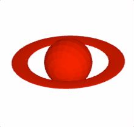
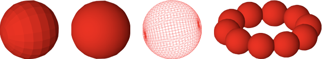
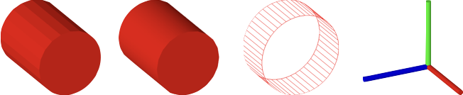
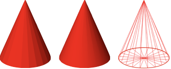
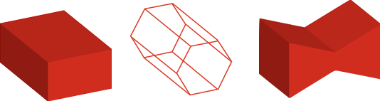
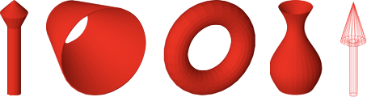

# 3D Shape Primitives API Reference

## Contents

- [OBJ_Generic3All](#obj_generic3all)
- [OBJ_Generic3](#obj_generic3)
- [OBJ_Sphere](#obj_sphere)
- [OBJ_Cube](#obj_cube)
- [OBJ_Cylinder](#obj_cylinder)
- [OBJ_Line3](#obj_line3)
- [OBJ_Cone](#obj_cone)
- [OBJ_Prism](#obj_prism)
- [OBJ_Revolve](#obj_revolve)
- [OBJ_Surface](#obj_surface)

---

## OBJ_Generic3All


### Properties

<ul class="tsd-parameter-list">
<li><span><span class="tsd-kind-parameter">light</span>: <span class="tsd-signature-type">'directional' | 'point' | null | undefined</span> <span class="tsd-signature-symbol">= 'directional'</span></span><div class="tsd-comment tsd-typography"><p>the scene light that will
be cast on the shape. Use <code>null</code> for no lighting - all surfaces will have
the defined color.</p></div></li>
<li><span><span class="tsd-kind-parameter">copy</span>: <span class="tsd-signature-type"><a href="https://developer.mozilla.org/docs/Web/JavaScript/Reference/Global_Objects/Array" class="tsd-signature-type">Array</a><<a href="../interfaces/geometries_copy_copy.CPY_Step.html" class="tsd-signature-type">CPY_Step</a> | <a href="https://developer.mozilla.org/docs/Web/JavaScript/Reference/Global_Objects/String" class="tsd-signature-type">string</a>> | <a href="../interfaces/geometries_copy_copy.CPY_Step.html" class="tsd-signature-type">CPY_Step</a> | undefined</span></span><div class="tsd-comment tsd-typography"><p>Create copies the
shapes vertices to replicate the shape in space. Copies of normals, colors
(if defined) and texture coordinates (if defined) will also be made.</p></div></li>
<li><span><span class="tsd-kind-parameter">usage</span>: <span class="tsd-signature-type"><a href="../types/DrawingObjects_GLObject_GLObject.TypeGLBufferUsage.html" class="tsd-signature-type">TypeGLBufferUsage</a> | undefined</span> <span class="tsd-signature-symbol">= 'STATIC'</span></span><div class="tsd-comment tsd-typography"><p>use <code>'DYNAMIC'</code> if the shape's vertices
will be updated very frequently</p></div></li>
</ul>

---

## OBJ_Generic3

Options object for a {@link FigureElementPrimitive} of a generic 3D shape.
Extends {@link OBJ_Generic3All} and {@link OBJ_FigurePrimitive}





{@link OBJ_GenericGL} can be used for shape creation with custom shaders.

But for many custom shapes, only points and normals of the shape need to be
defined, without needing to customize the shaders.

{@link OBJ_Generic3} Provides the ability to create many custom shapes that
don't need shader customization.

### Properties

<ul class="tsd-parameter-list">
<li><span><span class="tsd-kind-parameter">glPrimitive</span>: <span class="tsd-signature-type">'TRIANGLES' | 'POINTS' | 'FAN' | 'STRIP' | 'LINES' | undefined</span> <span class="tsd-signature-symbol">= 'TRIANGLES'</span></span></li>
<li><span><span class="tsd-kind-parameter">points</span>: <span class="tsd-signature-type"><a href="https://developer.mozilla.org/docs/Web/JavaScript/Reference/Global_Objects/Array" class="tsd-signature-type">Array</a><<a href="../types/geometry_Point.TypeParsablePoint.html" class="tsd-signature-type">TypeParsablePoint</a>> | undefined</span></span><div class="tsd-comment tsd-typography"><p>positions of vertices of shape</p></div></li>
<li><span><span class="tsd-kind-parameter">normals</span>: <span class="tsd-signature-type"><a href="https://developer.mozilla.org/docs/Web/JavaScript/Reference/Global_Objects/Array" class="tsd-signature-type">Array</a><<a href="../types/geometry_Point.TypeParsablePoint.html" class="tsd-signature-type">TypeParsablePoint</a>> | undefined</span></span><div class="tsd-comment tsd-typography"><p>normals for each vertex</p></div></li>
<li><span><span class="tsd-kind-parameter">colors</span>: <span class="tsd-signature-type"><a href="https://developer.mozilla.org/docs/Web/JavaScript/Reference/Global_Objects/Array" class="tsd-signature-type">Array</a><<a href="../types/types.TypeColor.html" class="tsd-signature-type">TypeColor</a>> | undefined</span></span><div class="tsd-comment tsd-typography"><p>define a color for each vertex if the
shape will be more than just a single color. Otherwise use <code>color</code> if a
single color.</p></div></li>
<li><span><span class="tsd-kind-parameter">texture</span>: <span class="tsd-signature-type"><a href="../interfaces/FigurePrimitives_FigurePrimitiveTypes.OBJ_Texture.html" class="tsd-signature-type">OBJ_Texture</a> | undefined</span></span><div class="tsd-comment tsd-typography"><p>use to overlay a texture onto the shape's
surfaces</p></div></li>
</ul>

#### Cubes with texture on each face

```js
figure.scene.setProjection({ style: 'orthographic' });
figure.scene.setCamera({ position: [1, 1, 2] });
figure.scene.setLight({ directional: [0.7, 0.5, 1] });

const [points, normals] = Fig.cube({ side: 0.8 });

figure.add({
  make: 'generic3',
  points,
  normals,
  texture: {
    src: './flowers.jpeg',
    coords: [
      0, 0, 0.333, 0, 0.333, 0.5,
      0, 0, 0.333, 0.5, 0, 0.5,
      0.333, 0, 0.666, 0, 0.666, 0.5,
      0.333, 0, 0.666, 0.5, 0.333, 0.5,
      0.666, 0, 1, 0, 1, 0.5,
      0.666, 0, 1, 0.5, 0.666, 0.5,
      0, 0.5, 0.333, 1, 0, 1,
      0, 0.5, 0.333, 0.5, 0.333, 1,
      0.333, 0.5, 0.666, 1, 0.333, 1,
      0.333, 0.5, 0.666, 0.5, 0.666, 1,
      0.666, 0.5, 1, 1, 0.666, 1,
      0.666, 0.5, 1, 0.5, 1, 1,
    ],
    loadColor: [0, 0, 0, 0],
  },
});
```

#### Create a a ring around a sphere.

```js
figure.scene.setProjection({ style: 'orthographic' });
figure.scene.setCamera({ position: [1, 1, 2] });
figure.scene.setLight({ directional: [0.7, 0.5, 1] });
const { sphere, polygon, revolve } = Fig;
const [spherePoints, sphereNormals] = sphere({ radius: 0.15 });
// The ring is a flattened doughnut
const [ringPoints, ringNormals] = revolve({
  profile: polygon({
    close: true,
    sides: 20,
    radius: 0.05,
    center: [0, 0.3],
    direction: -1,
    transform: ['s', 0.1, 1, 1],
  }),
  normals: 'curve',
  sides: 50,
  transform: ['d', 0, 1, 0],
});
const a = figure.add({
  make: 'generic3',
  points: [...spherePoints, ...ringPoints],
  normals: [...sphereNormals, ...ringNormals],
  color: [1, 0, 0, 1],
  transform: [['r', 0.15, 1, 0, 0], ['r', 0.3, 0, 1, 0]],
});
// Animate the shape to slowly rotate around the x and y axes
a.animations.new()
  .custom({
    callback: (t) => {
      a.transform.updateRotation(t * 0.15);
      a.transform.updateRotation(t * 0.3, null, 1);
    },
    duration: null,
  })
  .start();
```

> To test examples, append them to the
<a href="#shapes3d-boilerplate">boilerplate</a>


---

## OBJ_Sphere

Sphere shape options object that extends {@link OBJ_Generic3All}
and {@link OBJ_FigurePrimitive}



By default, a sphere with its center at the origin will be created.

### Properties

<ul class="tsd-parameter-list">
<li><span><span class="tsd-kind-parameter">sides</span>: <span class="tsd-signature-type"><a href="https://developer.mozilla.org/docs/Web/JavaScript/Reference/Global_Objects/Number" class="tsd-signature-type">number</a> | undefined</span> <span class="tsd-signature-symbol">= 10</span></span><div class="tsd-comment tsd-typography"><p>number of sides around sphere's half great circle</p></div></li>
<li><span><span class="tsd-kind-parameter">radius</span>: <span class="tsd-signature-type"><a href="https://developer.mozilla.org/docs/Web/JavaScript/Reference/Global_Objects/Number" class="tsd-signature-type">number</a> | undefined</span> <span class="tsd-signature-symbol">= 1</span></span><div class="tsd-comment tsd-typography"><p>radius of sphere</p></div></li>
<li><span><span class="tsd-kind-parameter">normals</span>: <span class="tsd-signature-type">'curve' | 'flat' | undefined</span> <span class="tsd-signature-symbol">= flat</span></span><div class="tsd-comment tsd-typography"><p><code>flat</code> normals will make light
shading across a face cone constant. <code>curve</code> will gradiate the shading. Use
<code>curve</code> to make a surface look more round with fewer number of sides.</p></div></li>
<li><span><span class="tsd-kind-parameter">center</span>: <span class="tsd-signature-type"><a href="../types/geometry_Point.TypeParsablePoint.html" class="tsd-signature-type">TypeParsablePoint</a> | undefined</span> <span class="tsd-signature-symbol">= [0, 0]</span></span><div class="tsd-comment tsd-typography"><p>center position of sphere</p></div></li>
<li><span><span class="tsd-kind-parameter">lines</span>: <span class="tsd-signature-type"><a href="https://developer.mozilla.org/docs/Web/JavaScript/Reference/Global_Objects/Boolean" class="tsd-signature-type">boolean</a> | undefined</span></span><div class="tsd-comment tsd-typography"><p>if <code>true</code> then points representing
the edes of the faces will be returned. If <code>false</code>, then points
representing two triangles per face and an
associated normal for each point will be returned.</p></div></li>
</ul>

#### Example 1

```js
figure.add({
  make: 'sphere',
  radius: 0.5,
  color: [1, 0, 0, 1],
});
```

#### Sphere with 'curve' normals

```js
figure.add({
  make: 'sphere',
  radius: 0.5,
  normals: 'curve',
  color: [1, 0, 0, 1],
});
```

#### Wire mesh sphere

```js
figure.add({
  make: 'sphere',
  radius: 0.5,
  sides: 30,
  lines: true,
  normals: 'curve',
  color: [1, 0, 0, 1],
});
```

#### Ring of spheres, rotated to by in xz plane

```js
figure.add({
  make: 'sphere',
  radius: 0.1,
  color: [1, 0, 0, 1],
  center: [0.3, 0, 0],
  normals: 'curve',
  copy: [
    { along: 'rotation', num: 10, step: Math.PI * 2 / 10 },
  ],
  transform: ['r', Math.PI / 2, 1, 0, 0],
});
```

> To test examples, append them to the
<a href="#shapes3d-boilerplate">boilerplate</a>


---

## OBJ_Cube

Cube shape options object that extends {@link OBJ_Generic3All}
and {@link OBJ_FigurePrimitive}


By default, a cube will be constructed around the origin, with the xyz axes
being normal to the cube faces.

### Properties

<ul class="tsd-parameter-list">
<li><span><span class="tsd-kind-parameter">side</span>: <span class="tsd-signature-type"><a href="https://developer.mozilla.org/docs/Web/JavaScript/Reference/Global_Objects/Number" class="tsd-signature-type">number</a> | undefined</span> <span class="tsd-signature-symbol">= 1</span></span><div class="tsd-comment tsd-typography"><p>side length</p></div></li>
<li><span><span class="tsd-kind-parameter">center</span>: <span class="tsd-signature-type"><a href="../types/geometry_Point.TypeParsablePoint.html" class="tsd-signature-type">TypeParsablePoint</a> | undefined</span></span><div class="tsd-comment tsd-typography"><p>center point (<code>[0, 0]</code>)
points of cube</p></div></li>
<li><span><span class="tsd-kind-parameter">lines</span>: <span class="tsd-signature-type"><a href="https://developer.mozilla.org/docs/Web/JavaScript/Reference/Global_Objects/Boolean" class="tsd-signature-type">boolean</a> | undefined</span> <span class="tsd-signature-symbol">= false</span></span><div class="tsd-comment tsd-typography"><p>if <code>true</code> then points representing
the 12 edges of the cube will be returned. If <code>false</code>, then points
representing two triangles per face (12 triangles, 36 points) and an
associated normal for each point will be returned.</p></div></li>
</ul>

#### Example 1

```js
figure.add({
  make: 'cube',
  side: 0.5,
  color: [1, 0, 0, 1],
});
```

#### 3x3 grid of cubes

```js
figure.add({
  make: 'cube',
  side: 0.2,
  color: [1, 0, 0, 1],
  copy: [
    { along: 'x', num: 2, step: 0.22 },
    { along: 'y', num: 2, step: 0.22 },
    { along: 'z', num: 2, step: 0.22 },
  ],
});
```

#### Wire mesh cube

```js
figure.add({
  make: 'cube',
  side: 0.5,
  lines: true,
  color: [1, 0, 0, 1],
});
```

> To test examples, append them to the
<a href="#shapes3d-boilerplate">boilerplate</a>


---

## OBJ_Cylinder

Cylinder shape options object that extends {@link OBJ_Generic3All}
and {@link OBJ_FigurePrimitive}



By default, a cylinder along the x axis will be created.

### Properties

<ul class="tsd-parameter-list">
<li><span><span class="tsd-kind-parameter">sides</span>: <span class="tsd-signature-type"><a href="https://developer.mozilla.org/docs/Web/JavaScript/Reference/Global_Objects/Number" class="tsd-signature-type">number</a> | undefined</span> <span class="tsd-signature-symbol">= 10</span></span><div class="tsd-comment tsd-typography"><p>number of cylinder sides</p></div></li>
<li><span><span class="tsd-kind-parameter">radius</span>: <span class="tsd-signature-type"><a href="https://developer.mozilla.org/docs/Web/JavaScript/Reference/Global_Objects/Number" class="tsd-signature-type">number</a> | undefined</span> <span class="tsd-signature-symbol">= 1</span></span><div class="tsd-comment tsd-typography"><p>radius of cylinder</p></div></li>
<li><span><span class="tsd-kind-parameter">normals</span>: <span class="tsd-signature-type">'curve' | 'flat' | undefined</span> <span class="tsd-signature-symbol">= flat</span></span><div class="tsd-comment tsd-typography"><p><code>flat</code> normals will make
shading (from light source) across a face cone constant.
<code>curve</code> will gradiate the shading. Use <code>curve</code> to make a surface look more
round with fewer number of sides.</p></div></li>
<li><span><span class="tsd-kind-parameter">line</span>: <span class="tsd-signature-type"><a href="../types/geometry_Line.TypeParsableLine.html" class="tsd-signature-type">TypeParsableLine</a> | undefined</span></span><div class="tsd-comment tsd-typography"><p>line that can position and
orient the cylinder. First point of line is cylinder base center, and second
point is the top center.</p></div></li>
<li><span><span class="tsd-kind-parameter">length</span>: <span class="tsd-signature-type"><a href="https://developer.mozilla.org/docs/Web/JavaScript/Reference/Global_Objects/Number" class="tsd-signature-type">number</a> | undefined</span> <span class="tsd-signature-symbol">= 1</span></span><div class="tsd-comment tsd-typography"><p>length of the cylinder if <code>line</code> isn't
defined</p></div></li>
<li><span><span class="tsd-kind-parameter">ends</span>: <span class="tsd-signature-type"><a href="https://developer.mozilla.org/docs/Web/JavaScript/Reference/Global_Objects/Boolean" class="tsd-signature-type">boolean</a> | 1 | 2 | undefined</span> <span class="tsd-signature-symbol">= true</span></span><div class="tsd-comment tsd-typography"><p><code>true</code> fills both ends of the cylinder.
<code>false</code> does not fill ends. <code>1</code> fills only the first end. <code>2</code> fills only the
the second end.</p></div></li>
<li><span><span class="tsd-kind-parameter">rotation</span>: <span class="tsd-signature-type"><a href="https://developer.mozilla.org/docs/Web/JavaScript/Reference/Global_Objects/Number" class="tsd-signature-type">number</a> | undefined</span></span><div class="tsd-comment tsd-typography"><p>rotation of base - this is only noticable for
small numbers of sides (<code>0</code>)
points of cube</p></div></li>
<li><span><span class="tsd-kind-parameter">lines</span>: <span class="tsd-signature-type"><a href="https://developer.mozilla.org/docs/Web/JavaScript/Reference/Global_Objects/Boolean" class="tsd-signature-type">boolean</a> | undefined</span></span><div class="tsd-comment tsd-typography"><p>if <code>true</code> then points representing
the edes of the faces will be returned. If <code>false</code>, then points
representing two triangles per face and an
associated normal for each point will be returned.</p></div></li>
</ul>

#### Example 1

```js
figure.add({
  make: 'cylinder',
  radius: 0.2,
  length: 0.5,
  sides: 20,
  color: [1, 0, 0, 1],
});
```

#### Use curve normals to give rounder looks for same number of sides

```js
figure.add({
  make: 'cylinder',
  radius: 0.2,
  length: 0.5,
  sides: 20,
  normals: 'curve',
  color: [1, 0, 0, 1],
});
```

#### Wire mesh cylinder

```js
figure.add({
  make: 'cylinder',
  radius: 0.2,
  length: 0.2,
  lines: true,
  sides: 50,
  ends: false,
  color: [1, 0, 0, 1],
});
```

#### Three cylinders as x, y, z axes

```js
figure.add([
  {
    make: 'cylinder',
    radius: 0.02,
    line: [[0, 0, 0], [0.5, 0, 0]],
    color: [1, 0, 0, 1],
  },
  {
    make: 'cylinder',
    radius: 0.02,
    line: [[0, 0, 0], [0, 0.5, 0]],
    color: [0, 1, 0, 1],
  },
  {
    make: 'cylinder',
    radius: 0.02,
    line: [[0, 0, 0], [0, 0, 0.5]],
    color: [0, 0, 1, 1],
  },
]);
```

> To test examples, append them to the
<a href="#shapes3d-boilerplate">boilerplate</a>


---

## OBJ_Line3

3D Line options object that extends {@link OBJ_Generic3All}
and {@link OBJ_FigurePrimitive}


A 3D line is a cylinder with optional arrows on the end. Unlike a 2D line,
the arrow profiles can only be simple triangles.

### Properties

<ul class="tsd-parameter-list">
<li><span><span class="tsd-kind-parameter">p1</span>: <span class="tsd-signature-type"><a href="../types/geometry_Point.TypeParsablePoint.html" class="tsd-signature-type">TypeParsablePoint</a> | undefined</span> <span class="tsd-signature-symbol">= [0, 0, 0]</span></span></li>
<li><span><span class="tsd-kind-parameter">p2</span>: <span class="tsd-signature-type"><a href="../types/geometry_Point.TypeParsablePoint.html" class="tsd-signature-type">TypeParsablePoint</a> | undefined</span> <span class="tsd-signature-symbol">= default: p1 + [1, 0, 0]</span></span></li>
<li><span><span class="tsd-kind-parameter">width</span>: <span class="tsd-signature-type"><a href="https://developer.mozilla.org/docs/Web/JavaScript/Reference/Global_Objects/Number" class="tsd-signature-type">number</a> | undefined</span></span><div class="tsd-comment tsd-typography"><p>width of line</p></div></li>
<li><span><span class="tsd-kind-parameter">arrow</span>: <span class="tsd-signature-type"><a href="../interfaces/d3_line3.OBJ_Line3Arrow.html" class="tsd-signature-type">OBJ_Line3Arrow</a> | <a href="https://developer.mozilla.org/docs/Web/JavaScript/Reference/Global_Objects/Boolean" class="tsd-signature-type">boolean</a> | undefined</span></span><div class="tsd-comment tsd-typography"><p>define to use arrows at one or both ends
of the line</p></div></li>
<li><span><span class="tsd-kind-parameter">sides</span>: <span class="tsd-signature-type"><a href="https://developer.mozilla.org/docs/Web/JavaScript/Reference/Global_Objects/Number" class="tsd-signature-type">number</a> | undefined</span> <span class="tsd-signature-symbol">= 10</span></span><div class="tsd-comment tsd-typography"><p>number of sides</p></div></li>
<li><span><span class="tsd-kind-parameter">normals</span>: <span class="tsd-signature-type">'curve' | 'flat' | undefined</span> <span class="tsd-signature-symbol">= curve</span></span><div class="tsd-comment tsd-typography"><p><code>flat</code> normals will make light
shading across a line face constant. <code>curve</code> will gradiate the shading. Use
<code>curve</code> to make a surface look more round with fewer number of sides.</p></div></li>
<li><span><span class="tsd-kind-parameter">rotation</span>: <span class="tsd-signature-type"><a href="https://developer.mozilla.org/docs/Web/JavaScript/Reference/Global_Objects/Number" class="tsd-signature-type">number</a> | undefined</span> <span class="tsd-signature-symbol">= 0</span></span><div class="tsd-comment tsd-typography"><p>rotation of line around its axis - this is
only noticable for small numbers of sides</p></div></li>
<li><span><span class="tsd-kind-parameter">lines</span>: <span class="tsd-signature-type"><a href="https://developer.mozilla.org/docs/Web/JavaScript/Reference/Global_Objects/Boolean" class="tsd-signature-type">boolean</a> | undefined</span></span><div class="tsd-comment tsd-typography"><p>if <code>true</code> then points representing
the edes of the faces will be returned. If <code>false</code>, then points
representing two triangles per face and an
associated normal for each point will be returned.</p></div></li>
</ul>

#### Simple line

```js
figure.add({
  make: 'line3',
  p1: [0, 0, 0],
  p2: [0, 1, 0],
  color: [1, 0, 0, 1],
});
```

#### Thick line with arrows on both ends

```js
figure.add({
  make: 'line3',
  p1: [0, 0, 0],
  p2: [0, 1, 0],
  arrow: { ends: 'all', width: 0.1, length: 0.1 },
  sides: 30,
  width: 0.05,
  color: [1, 0, 0, 1],
});
```

#### Wire mesh line with arrow

```js
figure.add({
  make: 'line3',
  p1: [0, 0, 0],
  p2: [0, 1, 0],
  arrow: { ends: 'end' },
  color: [1, 0, 0, 1],
  lines: true,
});
```

#### Ball of arrows

```js
figure.add(
  {
    make: 'line3',
    p1: [0, 0, 0],
    p2: [0, 0.4, 0],
    color: [1, 0, 0, 1],
    width: 0.01,
    arrow: { end: 'end', width: 0.02 },
    copy: [
      { along: 'rotation', num: 20, step: Math.PI * 2 / 20 },
      { along: 'rotation', axis: [0, 1, 0], num: 20, step: Math.PI * 2 / 20 },
    ],
  },
);
```

> To test examples, append them to the
<a href="#shapes3d-boilerplate">boilerplate</a>


---

## OBJ_Cone

Cone shape options object that extends {@link OBJ_Generic3All}
and {@link OBJ_FigurePrimitive}



By default, a cone with its base at the origin and its tip along the x axis
will be created.

### Properties

<ul class="tsd-parameter-list">
<li><span><span class="tsd-kind-parameter">sides</span>: <span class="tsd-signature-type"><a href="https://developer.mozilla.org/docs/Web/JavaScript/Reference/Global_Objects/Number" class="tsd-signature-type">number</a> | undefined</span> <span class="tsd-signature-symbol">= 10</span></span><div class="tsd-comment tsd-typography"><p>number of sides</p></div></li>
<li><span><span class="tsd-kind-parameter">radius</span>: <span class="tsd-signature-type"><a href="https://developer.mozilla.org/docs/Web/JavaScript/Reference/Global_Objects/Number" class="tsd-signature-type">number</a> | undefined</span></span><div class="tsd-comment tsd-typography"><p>radius of cube base</p></div></li>
<li><span><span class="tsd-kind-parameter">normals</span>: <span class="tsd-signature-type">'curve' | 'flat' | undefined</span> <span class="tsd-signature-symbol">= flat</span></span><div class="tsd-comment tsd-typography"><p><code>flat</code> normals will make light
shading across a face cone constant. <code>curve</code> will gradiate the shading. Use
<code>curve</code> to make a surface look more round with fewer number of sides.</p></div></li>
<li><span><span class="tsd-kind-parameter">line</span>: <span class="tsd-signature-type"><a href="../types/geometry_Line.TypeParsableLine.html" class="tsd-signature-type">TypeParsableLine</a> | undefined</span></span><div class="tsd-comment tsd-typography"><p>line that can position and
orient the cone. First point of line is cone base center, and second point
is cone tip.</p></div></li>
<li><span><span class="tsd-kind-parameter">length</span>: <span class="tsd-signature-type"><a href="https://developer.mozilla.org/docs/Web/JavaScript/Reference/Global_Objects/Number" class="tsd-signature-type">number</a> | undefined</span> <span class="tsd-signature-symbol">= 1</span></span><div class="tsd-comment tsd-typography"><p>length of the cone along the x axis if
<code>line</code> isn't defined</p></div></li>
<li><span><span class="tsd-kind-parameter">rotation</span>: <span class="tsd-signature-type"><a href="https://developer.mozilla.org/docs/Web/JavaScript/Reference/Global_Objects/Number" class="tsd-signature-type">number</a> | undefined</span></span><div class="tsd-comment tsd-typography"><p>rotation of base - this is only noticable for
small numbers of sides (<code>0</code>)
points of cube</p></div></li>
<li><span><span class="tsd-kind-parameter">lines</span>: <span class="tsd-signature-type"><a href="https://developer.mozilla.org/docs/Web/JavaScript/Reference/Global_Objects/Boolean" class="tsd-signature-type">boolean</a> | undefined</span></span><div class="tsd-comment tsd-typography"><p>if <code>true</code> then points representing
the edes of the faces will be returned. If <code>false</code>, then points
representing two triangles per face and an
associated normal for each point will be returned.</p></div></li>
</ul>

#### Example 1

```js
figure.add({
  make: 'cone',
  radius: 0.2,
  sides: 20,
  color: [1, 0, 0, 1],
  line: [[0, 0, 0], [0, 0.5, 0]],
});
```

#### Cone with curve normals

```js
figure.add({
  make: 'cone',
  radius: 0.2,
  normals: 'curve',
  sides: 20,
  color: [1, 0, 0, 1],
  line: [[0, 0, 0], [0, 0.5, 0]],
});
```

#### Wire mesh cone

```js
figure.add({
  make: 'cone',
  radius: 0.2,
  normals: 'curve',
  sides: 20,
  color: [1, 0, 0, 1],
  line: [[0, 0, 0], [0, 0.5, 0]],
  lines: true,
});
```

> To test examples, append them to the
<a href="#shapes3d-boilerplate">boilerplate</a>


---

## OBJ_Prism

Prism shape options object that extends {@link OBJ_Generic3All}
and {@link OBJ_FigurePrimitive}



A prism base is defined in the XY plane, and it's length extends
into +z. Use `transform` to orient it in any other way.

Triangles will be created for the ends if the base is convex. If the base
is not convex, use `baseTriangles` to define the triangles.

### Properties

<ul class="tsd-parameter-list">
<li><span><span class="tsd-kind-parameter">base</span>: <span class="tsd-signature-type"><a href="https://developer.mozilla.org/docs/Web/JavaScript/Reference/Global_Objects/Number" class="tsd-signature-type">number</a> | undefined</span></span><div class="tsd-comment tsd-typography"><p>base border points defined in the XY plane - the
points should be defined in the counter-clock-wise direction.</p></div></li>
<li><span><span class="tsd-kind-parameter">baseTriangles</span>: <span class="tsd-signature-type"><a href="https://developer.mozilla.org/docs/Web/JavaScript/Reference/Global_Objects/Array" class="tsd-signature-type">Array</a><<a href="../types/geometry_Point.TypeParsablePoint.html" class="tsd-signature-type">TypeParsablePoint</a>></span></span><div class="tsd-comment tsd-typography"><p>triangles in the XY plane
that create the base fill. If the base is convex, then the triangles can be
auto-generated and this property left undefined.</p></div></li>
<li><span><span class="tsd-kind-parameter">length</span>: <span class="tsd-signature-type"><a href="https://developer.mozilla.org/docs/Web/JavaScript/Reference/Global_Objects/Number" class="tsd-signature-type">number</a> | undefined</span></span><div class="tsd-comment tsd-typography"><p>length of the prism</p></div></li>
<li><span><span class="tsd-kind-parameter">lines</span>: <span class="tsd-signature-type"><a href="https://developer.mozilla.org/docs/Web/JavaScript/Reference/Global_Objects/Boolean" class="tsd-signature-type">boolean</a> | undefined</span> <span class="tsd-signature-symbol">= false</span></span><div class="tsd-comment tsd-typography"><p>if <code>true</code> then points representing
the edges of the prism will be returned. If <code>false</code>, then points
representing triangle faces and associated normals will be returned.</p></div></li>
</ul>

#### Create a rectangular prism

```js
figure.add(
  {
    make: 'prism',
    base: [[0, 0], [0.5, 0], [0.5, 0.2], [0, 0.2]],
    color: [1, 0, 0, 1],
  },
);
```

#### Create a hexagonal prism along the x axis with lines

```js
figure.add(
  {
    make: 'prism',
    base: Fig.polygon({ radius: 0.1, sides: 6 }),
    color: [1, 0, 0, 1],
    transform: ['r', Math.PI / 2, 0, 1, 0],
    lines: true,
  },
);
```

#### Create a bow tie prism defining the base triangles

```js
figure.add(
  {
    make: 'prism',
    base: [[0, 0], [0.25, 0.1], [0.5, 0], [0.5, 0.3], [0.25, 0.2], [0, 0.3]],
    baseTriangles: [
      [0, 0], [0.25, 0.1], [0.25, 0.2],
      [0, 0], [0.25, 0.2], [0, 0.3],
      [0.25, 0.1], [0.5, 0], [0.5, 0.3],
      [0.25, 0.1], [0.5, 0.3], [0.25, 0.2],
    ],
    color: [1, 0, 0, 1],
    transform: ['r', Math.PI / 2, 0, 1, 0],
  },
);
```

> To test examples, append them to the
<a href="#shapes3d-boilerplate">boilerplate</a>


---

## OBJ_Revolve

Revolve shape options object that extends {@link OBJ_Generic3All}
and {@link OBJ_FigurePrimitive}.



Revolve (or radially sweep) a profile in the XY plane around the x axis to
form a 3D surface. The profile y values must be greater than or equal to 0.

Profiles can be open (start and end point are different) or closed (start
and end point are equal).

For predictable lighting results, profiles should be created with the
following rules:

- An open profile's start points should have an x value less than its end
  point
- Closed profiles where all points have y > 0 should be defined in the
  clockwise direction when looking at the XY plane from the +z axis.

If an open profile's start and ends points are at y = 0, then the final shape
will look solid.

If an open profile's start and/or ends points have y > 0, then the final
shape will look like a surface open at the ends with y > 0. As a surface can
have only one color, then looking inside the shape the surface lighting will
be opposite to that expected. To create open ended solids with lighting that
is as expected, create the outside and inside surface with a closed profile.


### Properties

<ul class="tsd-parameter-list">
<li><span><span class="tsd-kind-parameter">profile</span>: <span class="tsd-signature-type"><a href="https://developer.mozilla.org/docs/Web/JavaScript/Reference/Global_Objects/Array" class="tsd-signature-type">Array</a><<a href="../types/geometry_Point.TypeParsablePoint.html" class="tsd-signature-type">TypeParsablePoint</a>></span></span><div class="tsd-comment tsd-typography"><p>XY plane profile to be radially
swept around the x axis</p></div></li>
<li><span><span class="tsd-kind-parameter">sides</span>: <span class="tsd-signature-type"><a href="https://developer.mozilla.org/docs/Web/JavaScript/Reference/Global_Objects/Number" class="tsd-signature-type">number</a> | undefined</span></span><div class="tsd-comment tsd-typography"><p>number of sides in the radial sweep</p></div></li>
<li><span><span class="tsd-kind-parameter">normals</span>: <span class="tsd-signature-type">'flat' | 'curveRows' | 'curveRadial' | 'curve' | undefined</span></span><div class="tsd-comment tsd-typography"><p><code>flat</code> normals will make shading (from a light source) across a face of the
object a constant color. <code>curveProfile</code> will gradiate the shading along the
profile. <code>curveRadial</code> will gradiate the shading around the radial sweep.
<code>curve</code> will gradiate the shading both around the radial sweep and along the
profile. Use <code>curve</code>, <code>curveProfile</code>, or <code>curveRadial</code> to make a surface
look more round with fewer number of sides.</p></div></li>
<li><span><span class="tsd-kind-parameter">rotation</span>: <span class="tsd-signature-type"><a href="https://developer.mozilla.org/docs/Web/JavaScript/Reference/Global_Objects/Number" class="tsd-signature-type">number</a> | undefined</span></span><div class="tsd-comment tsd-typography"><p>by default the profile will start in the XY
plane and sweep around the x axis following the right hand rule. Use
<code>rotation</code> to start the sweep at some angle where 0º is in the XY for +y and
90º is in the XZ plane for +z. initial angle of the revolve rotation</p></div></li>
<li><span><span class="tsd-kind-parameter">axis</span>: <span class="tsd-signature-type"><a href="../types/geometry_Point.TypeParsablePoint.html" class="tsd-signature-type">TypeParsablePoint</a> | undefined</span></span><div class="tsd-comment tsd-typography"><p>orient the draw space vertices of the
shape so its axis is along this vector</p></div></li>
<li><span><span class="tsd-kind-parameter">lines</span>: <span class="tsd-signature-type"><a href="https://developer.mozilla.org/docs/Web/JavaScript/Reference/Global_Objects/Boolean" class="tsd-signature-type">boolean</a> | undefined</span></span><div class="tsd-comment tsd-typography"><p>if <code>true</code> then points representing
the edes of the faces will be returned. If <code>false</code>, then points
representing two triangles per face and an
associated normal for each point will be returned.</p></div></li>
</ul>

#### Example 1

```js
figure.add({
  make: 'revolve',
  profile: [[0, 0], [0, 0.05], [0.5, 0.05], [0.6, 0.1], [0.7, 0]],
  axis: [0, 1, 0],
  color: [1, 0, 0, 1],
  sides: 20,
});
```

#### If creating a shell, then also create the inside surface as this will make

```js
// lighting more correct (note there is not shaddows).
// Ensure to close the shell by adding the first point to the end of the
// profile
figure.add({
  make: 'revolve',
  profile: [[0, 0.15], [0.5, 0.3], [0.5, 0.29], [0, 0.14], [0, 0.15]],
  color: [1, 0, 0, 1],
  sides: 30,
  normals: 'curveRadial',
});
```

#### Curvy vase like shape

```js
const x = Fig.range(0, 0.5, 0.01);
const profile = x.map(_x => [_x, 0.1 + 0.05 * Math.sin(_x * 2 * Math.PI * 2)]);
figure.add({
  make: 'revolve',
  profile: [...profile, [0.4, 0], [0, 0], [0, 0.1]],
  axis: [0, 1, 0],
  color: [1, 0, 0, 1],
  sides: 30,
});
```

#### Make a torus by revolving a polygon around the axis. As the polygon is above

```js
// the x axis, a hole will be created
// Try using `normals: 'curve'`, `normals: 'curveProfile'`, and
// `normals: 'curveRadial'` to see different curve options.
const { polygon } = Fig;
figure.add({
  make: 'revolve',
  profile: polygon({
    radius: 0.1, center: [0, 0.3], sides: 20, direction: -1, close: true,
  }),
  color: [1, 0, 0, 1],
  sides: 30,
});
```

#### Wire mesh arrow

```js
figure.add({
  make: 'revolve',
  profile: [[0, 0.03], [0.4, 0.03], [0.4, 0.09], [0.7, 0]],
  axis: [0, 1, 0],
  color: [1, 0, 0, 1],
  sides: 20,
  lines: true,
});
```

#### Open profile y = 0 at ends

```js
figure.add({
  make: 'revolve',
  profile: [[0, 0], [0, 0.3], [0.5, 0.2], [1, 0.3], [1, 0]],
  color: [1, 0, 0, 1],
  sides: 30,
});
```

#### Open profile y > 0 at ends

```js
figure.add({
  make: 'revolve',
  profile: [[0, 0.3], [0.5, 0.2], [1, 0.3]],
  color: [1, 0, 0, 1],
  sides: 30,
});
```

#### Closed Profile

```js
figure.add({
  make: 'revolve',
  profile: [[0, 0.3], [0.5, 0.2], [1, 0.3], [1, 0.29], [0.5, 0.19], [0, 0.29], [0, 0.3]],
  color: [1, 0, 0, 1],
  sides: 30,
});
```

> To test examples, append them to the
<a href="#shapes3d-boilerplate">boilerplate</a>


---

## OBJ_Surface

Surface shape options object that extends {@link OBJ_Generic3All}
and {@link OBJ_FigurePrimitive}.


A surface is defined with a 2D matrix of points. Triangles that fill the
surface are created between neighboring points in the matrix.

If a surface is defined with 9 points (an array or arrays in JavaScript):


Then triangles will be created between `adb`, `deb`, `bec`, `efc`, `dge`,
`ghe`, `ehf`, and `hif`.

The normal for triangle 'adb' is in the direction of the cross product
of vector 'ad' with vector 'ab' (use the right hand rule where the fingers
of the right hand curl from vector 'ad' to 'ab', and the thumb will then be
the direction of the normal). Similarly, the normal of `hif` will be the
direction of the cross product of `hi` with `hf`.

Use the property `invertNormals` to make all the normals go in the reverse
direction.

A surface can be open or closed at the end rows or columns of the matrix.
For example, a surface has closed columns if the first and last column
of the matrix have identical points. A surface is has open rows if the first
and last row of the matrix have different points.

If using curved normals (`'curve'`, `'curveRows'` or `'curveColumns'`) with
closed surfaces, use `closeRows` or `closeColumns` to ensure normal
curvature is maintained at the end rows
and columns.

### Properties

<ul class="tsd-parameter-list">
<li><span><span class="tsd-kind-parameter">points</span>: <span class="tsd-signature-type"><a href="https://developer.mozilla.org/docs/Web/JavaScript/Reference/Global_Objects/Array" class="tsd-signature-type">Array</a><<a href="https://developer.mozilla.org/docs/Web/JavaScript/Reference/Global_Objects/Array" class="tsd-signature-type">Array</a><<a href="../types/geometry_Point.TypeParsablePoint.html" class="tsd-signature-type">TypeParsablePoint</a>>> | undefined</span></span><div class="tsd-comment tsd-typography"><p>A grid of points that
define a 3D surface</p></div></li>
<li><span><span class="tsd-kind-parameter">normals</span>: <span class="tsd-signature-type">'curveColumns' | 'curveRows' | 'curve' | 'flat' | undefined</span></span><div class="tsd-comment tsd-typography"><p><code>flat</code> normals will make shading (from a light source) across a face of the
object a constant color. <code>curveRows</code> will gradiate the shading along the
rows of the grid. <code>curveColumns</code> will gradiate the shading along the columns
of the grid. <code>curve</code> will gradiate the shading along both rows and columns.
Use <code>curve</code>, <code>curveRows</code>, or <code>curveColumns</code> to make a surface
look more round with fewer number of sides.</p></div></li>
<li><span><span class="tsd-kind-parameter">closeRows</span>: <span class="tsd-signature-type"><a href="https://developer.mozilla.org/docs/Web/JavaScript/Reference/Global_Objects/Boolean" class="tsd-signature-type">boolean</a> | undefined</span> <span class="tsd-signature-symbol">= false</span></span><div class="tsd-comment tsd-typography"><p>Set to <code>true</code> if first row and last row are
the same, and normals is <code>'curveRows'</code> or <code>'curve'</code> to get correct normal
calculations</p></div></li>
<li><span><span class="tsd-kind-parameter">closeColumns</span>: <span class="tsd-signature-type"><a href="https://developer.mozilla.org/docs/Web/JavaScript/Reference/Global_Objects/Boolean" class="tsd-signature-type">boolean</a> | undefined</span></span><div class="tsd-comment tsd-typography"><p>Set to <code>true</code> if first row and last
column are the same, and normals is <code>'curveColumns'</code> or <code>'curve'</code> to get
correct normal calculations (<code>false</code>)
shape</p></div></li>
<li><span><span class="tsd-kind-parameter">lines</span>: <span class="tsd-signature-type"><a href="https://developer.mozilla.org/docs/Web/JavaScript/Reference/Global_Objects/Boolean" class="tsd-signature-type">boolean</a> | undefined</span></span><div class="tsd-comment tsd-typography"><p>if <code>true</code> then points representing
the edes of the faces will be returned. If <code>false</code>, then points
representing two triangles per face and an
associated normal for each point will be returned.</p></div></li>
<li><span><span class="tsd-kind-parameter">invertNormals</span>: <span class="tsd-signature-type"><a href="https://developer.mozilla.org/docs/Web/JavaScript/Reference/Global_Objects/Boolean" class="tsd-signature-type">boolean</a> | undefined</span></span><div class="tsd-comment tsd-typography"><p>if <code>true</code> then all normals will be
inverted</p></div></li>
</ul>

#### Example 1

```js
const points = Fig.surfaceGrid({
  x: [-0.8, 0.7, 0.03],
  y: [-0.8, 0.7, 0.03],
  z: x => 0.2 * Math.cos(x * 2 * Math.PI),
});
figure.scene.setCamera({ up: [0, 0, 1] });
figure.add({
  make: 'surface',
  points,
  color: [1, 0, 0, 1],
});
```

#### Surface wire mesh

```js
const points = Fig.surfaceGrid({
  x: [-0.8, 0.8, 0.03],
  y: [-0.8, 0.8, 0.03],
  z: (x, y) => y * 0.2 * Math.cos(x * 2 * Math.PI),
});
figure.scene.setCamera({ position: [-1, -1, 0.7], up: [0, 0, 1] });
figure.add({
  make: 'surface',
  points,
  lines: true,
  color: [1, 0, 0, 1],
});
```

#### Surface with wire mesh and fill

```js
const points = Fig.surfaceGrid({
  x: [-0.8, 0.8, 0.03],
  y: [-0.8, 0.8, 0.03],
  z: (x, y) => {
    const r = Math.sqrt(x * x + y * y) * Math.PI * 2 * 2;
    return Math.sin(r) / r;
  },
});
// Orient the camera so z is up
figure.scene.setCamera({ up: [0, 0, 1] });
figure.add({
  make: 'surface',
  points,
  color: [1, 0, 0, 1],
});
figure.add({
  make: 'surface',
  points,
  lines: true,
  color: [0, 0, 0, 1],
});
```

#### Simple Closed surface around the x axis

```js
figure.add({
  make: 'surface',
  normals: 'curveColumns',
  closeRows: true,
  points: [
    [[0, 0, 0.5], [1, 0, 0.5]],
    [[0, -0.5, 0], [1, -0.5, 0]],
    [[0, 0, -0.5], [1, 0, -0.5]],
    [[0, 0.5, 0], [1, 0.5, 0]],
    [[0, 0, 0.5], [1, 0, 0.5]],
  ],
  color: [1, 0, 0, 1],
});
```

#### Simple Closed surface around the x axis with curved normals

```js
figure.add({
  make: 'surface',
  normals: 'curveColumns',
  closeRows: true,
  points: [
    [[0, 0, 0.5], [1, 0, 0.5]],
    [[0, -0.5, 0], [1, -0.5, 0]],
    [[0, 0, -0.5], [1, 0, -0.5]],
    [[0, 0.5, 0], [1, 0.5, 0]],
    [[0, 0, 0.5], [1, 0, 0.5]],
  ],
  color: [1, 0, 0, 1],
});
```

#### Create a matrix of points by taking a profile in XY and rotating

```js
// it around the x axis
const { Point, Transform } = Fig;
const points = [];

// Rotation step
const dr = Math.PI * 2 / 50;
for (let r = 0; r < Math.PI * 2 + dr / 2; r += dr) {
  // Rotation matrix of rotation step around x axis
  const m = new Transform().rotate(r, 1, 0, 0).matrix();

  // A row of points is a profile rotated by some amount r
  points.push([]);
  // Make a profile for x values from 0 to 1
  for (let x = 0; x < 1; x += 0.05) {
    // The y coordinate of the profile changes with both x value, and
    // rotation value
    const y = 0.1 * Math.sin(6 * x) + 0.25 + 0.1 * Math.cos(3 * r);
    const p = new Point(x, y).transformBy(m);
    points[points.length - 1].push(p);
  }
}
figure.add({
  make: 'surface',
  points,
  color: [1, 0, 0, 1],
});
```

> To test examples, append them to the
<a href="#shapes3d-boilerplate">boilerplate</a>


---

