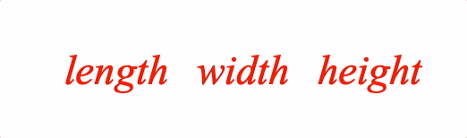
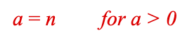
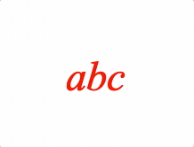
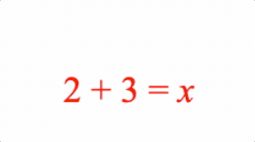
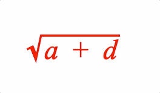
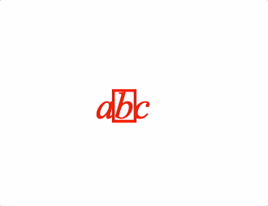
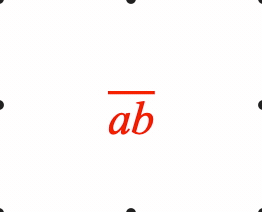
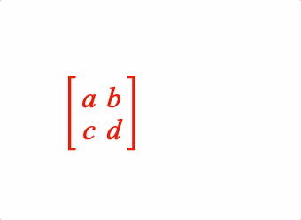
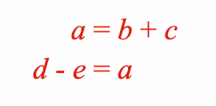

# Equation Layout API Reference

## Contents

- [EQN_Container](#eqn_container)
- [EQN_Offset](#eqn_offset)
- [EQN_Fraction](#eqn_fraction)
- [EQN_Scale](#eqn_scale)
- [EQN_Color](#eqn_color)
- [EQN_Bracket](#eqn_bracket)
- [EQN_Root](#eqn_root)
- [EQN_Strike](#eqn_strike)
- [EQN_Box](#eqn_box)
- [EQN_TouchBox](#eqn_touchbox)
- [EQN_Bar](#eqn_bar)
- [EQN_Integral](#eqn_integral)
- [EQN_SumOf](#eqn_sumof)
- [EQN_ProdOf](#eqn_prodof)
- [EQN_Subscript](#eqn_subscript)
- [EQN_Superscript](#eqn_superscript)
- [EQN_SuperscriptSubscript](#eqn_superscriptsubscript)
- [EQN_Comment](#eqn_comment)
- [EQN_StrikeComment](#eqn_strikecomment)
- [EQN_Pad](#eqn_pad)
- [EQN_Matrix](#eqn_matrix)
- [EQN_Lines](#eqn_lines)
- [EQN_Annotate](#eqn_annotate)

---

## EQN_Container

Equation container options



A container is useful to fix spacing around content as it changes between
equation forms.

Options can be an object, or an array in the property order below

### Properties

<div class="fo-prop"><span class="fo-prop-name">content</span> <span class="fo-prop-type">(<a href="../types/Equation_EquationFunctions.TypeEquationPhrase.html">TypeEquationPhrase</a>)</span></div>
<div class="fo-prop"><span class="fo-prop-name">width</span> <span class="fo-prop-type">(<a href="https://developer.mozilla.org/docs/Web/JavaScript/Reference/Global_Objects/Number">number</a>?)</span><span class="fo-prop-desc"> (<code>null</code>)</span></div>
<div class="fo-prop"><span class="fo-prop-name">inSize</span> <span class="fo-prop-type">(<a href="https://developer.mozilla.org/docs/Web/JavaScript/Reference/Global_Objects/Boolean">boolean</a>?)</span><span class="fo-prop-desc"> (<code>true</code>)</span></div>
<div class="fo-prop"><span class="fo-prop-name">descent</span> <span class="fo-prop-type">(<a href="https://developer.mozilla.org/docs/Web/JavaScript/Reference/Global_Objects/Number">number</a>?)</span><span class="fo-prop-desc"> (<code>null</code>)</span></div>
<div class="fo-prop"><span class="fo-prop-name">ascent</span> <span class="fo-prop-type">(<a href="https://developer.mozilla.org/docs/Web/JavaScript/Reference/Global_Objects/Number">number</a>?)</span><span class="fo-prop-desc"> (<code>null</code>)</span></div>
<div class="fo-prop"><span class="fo-prop-name">xAlign</span> <span class="fo-prop-type">('left' | 'center' | 'right' | <a href="https://developer.mozilla.org/docs/Web/JavaScript/Reference/Global_Objects/Number">number</a>?)</span><span class="fo-prop-desc"> (<code>'center'</code>)</span></div>
<div class="fo-prop"><span class="fo-prop-name">yAlign</span> <span class="fo-prop-type">('bottom' | 'middle' | 'top' | 'baseline' | <a href="https://developer.mozilla.org/docs/Web/JavaScript/Reference/Global_Objects/Number">number</a>?)</span><span class="fo-prop-desc"> (<code>'baseline'</code>)</span></div>
<div class="fo-prop"><span class="fo-prop-name">fit</span> <span class="fo-prop-type">('width' | 'height' | 'contain'?)</span><span class="fo-prop-desc">: - fit width,
ascent and descent to either match width, height or fully contain the content (<code>null</code>)</span></div>
<div class="fo-prop"><span class="fo-prop-name">scale</span> <span class="fo-prop-type">(<a href="https://developer.mozilla.org/docs/Web/JavaScript/Reference/Global_Objects/Number">number</a>?)</span><span class="fo-prop-desc">: - (<code>1</code>)</span></div>
<div class="fo-prop"><span class="fo-prop-name">fullContentBounds</span> <span class="fo-prop-type">(<a href="https://developer.mozilla.org/docs/Web/JavaScript/Reference/Global_Objects/Boolean">boolean</a>?)</span><span class="fo-prop-desc">: - (<code>false</code>)</span></div>
<div class="fo-prop"><span class="fo-prop-name">showContent</span> <span class="fo-prop-type">(<a href="https://developer.mozilla.org/docs/Web/JavaScript/Reference/Global_Objects/Boolean">boolean</a>?)</span><span class="fo-prop-desc">: - if <code>false</code>, a container will be created
around the content, but the content will not be shown (<code>true</code>)</span></div>

#### Example showing the difference between with and without container

```js
figure.add({
  name: 'eqn',
  make: 'equation',
  forms: {
    // Container object definition
    1: [
      'length',
      {
        container: {
          content: 'width',
          width: 0.5,
        },
      },
      'height',
    ],
    // Container array definition
    2: ['length', { container: ['w', 0.5] }, 'height'],
    // No container
    3: ['length', ' ', 'w', ' ', 'height']
  },
  formSeries: ['1', '2', '3'],
});
const eqn = figure.elements._eqn;
eqn.onClick = () => eqn.nextForm();
eqn.setTouchable();
eqn.showForm('1');
```

#### Create equation object then add to figure

```js
const eqn = figure.collections.equation({
  forms: {
    1: [
      'length',
      { container: { content: 'width', width: 0.5 } },
      'height',
    ],
    2: ['length', { container: ['w', 0.5] }, 'height'],
    3: ['length', ' ', 'w', ' ', 'height']
  },
  formSeries: ['1', '2', '3'],
});
figure.add('eqn', eqn);
eqn.onClick = () => eqn.nextForm();
eqn.setTouchable();
eqn.showForm('1');
```

> To test examples, append them to the
<a href="#drawing-boilerplate">boilerplate</a>


---

## EQN_Offset

Equation offset options



Offset a phrase from the position it would normally be.
An offest phrase will not contribute to layout of subsequent equation
elements and phrases.

Options can be an object, or an array in the property order below

### Properties

<div class="fo-prop"><span class="fo-prop-name">content</span> <span class="fo-prop-type">(<a href="../types/Equation_EquationFunctions.TypeEquationPhrase.html">TypeEquationPhrase</a>)</span></div>
<div class="fo-prop"><span class="fo-prop-name">offset</span> <span class="fo-prop-type">(<a href="../types/geometry_Point.TypeParsablePoint.html">TypeParsablePoint</a>?)</span><span class="fo-prop-desc"> (<code>[0, 0]</code>)</span></div>
<div class="fo-prop"><span class="fo-prop-name">fullContentBounds</span> <span class="fo-prop-type">(<a href="https://developer.mozilla.org/docs/Web/JavaScript/Reference/Global_Objects/Boolean">boolean</a>?)</span><span class="fo-prop-desc">: - (<code>false</code>)</span></div>

#### Example 1

```js
figure.add([
  {
    name: 'rect1',
    make: 'equation',
    forms: {
      0: [
        'a', '_ = ', 'n',
        { offset: ['for a > 0', [0.3, 0]] },
      ],
    },
  },
]);
```

> To test examples, append them to the
<a href="#drawing-boilerplate">boilerplate</a>


---

## EQN_Fraction

Equation fraction options


A fraction has a numerator and denominator separated by a vinculum
symbol {@link EQN_VinculumSymbol}.

Options can be an object, or an array in the property order below

### Properties

<div class="fo-prop"><span class="fo-prop-name">numerator</span> <span class="fo-prop-type">(<a href="../types/Equation_EquationFunctions.TypeEquationPhrase.html">TypeEquationPhrase</a>)</span></div>
<div class="fo-prop"><span class="fo-prop-name">symbol</span> <span class="fo-prop-type">(<a href="https://developer.mozilla.org/docs/Web/JavaScript/Reference/Global_Objects/String">string</a>)</span><span class="fo-prop-desc">: - Vinculum symbol</span></div>
<div class="fo-prop"><span class="fo-prop-name">denominator</span> <span class="fo-prop-type">(<a href="../types/Equation_EquationFunctions.TypeEquationPhrase.html">TypeEquationPhrase</a>)</span></div>
<div class="fo-prop"><span class="fo-prop-name">scale</span> <span class="fo-prop-type">(<a href="https://developer.mozilla.org/docs/Web/JavaScript/Reference/Global_Objects/Number">number</a>?)</span><span class="fo-prop-desc"> (<code>1</code>)</span></div>
<div class="fo-prop"><span class="fo-prop-name">numeratorSpace</span> <span class="fo-prop-type">(<a href="https://developer.mozilla.org/docs/Web/JavaScript/Reference/Global_Objects/Number">number</a>?)</span><span class="fo-prop-desc"> (<code>0.05</code>)</span></div>
<div class="fo-prop"><span class="fo-prop-name">denominatorSpace</span> <span class="fo-prop-type">(<a href="https://developer.mozilla.org/docs/Web/JavaScript/Reference/Global_Objects/Number">number</a>?)</span><span class="fo-prop-desc"> (<code>0.05</code>)</span></div>
<div class="fo-prop"><span class="fo-prop-name">overhang</span> <span class="fo-prop-type">(<a href="https://developer.mozilla.org/docs/Web/JavaScript/Reference/Global_Objects/Number">number</a>?)</span><span class="fo-prop-desc">: Vinculum extends beyond the content
horizontally by the this amount (<code>0.05</code>)</span></div>
<div class="fo-prop"><span class="fo-prop-name">offsetY</span> <span class="fo-prop-type">(<a href="https://developer.mozilla.org/docs/Web/JavaScript/Reference/Global_Objects/Number">number</a>?)</span><span class="fo-prop-desc">: Offset fraction in y (<code>0.07</code>)</span></div>
<div class="fo-prop"><span class="fo-prop-name">fullContentBounds</span> <span class="fo-prop-type">(<a href="https://developer.mozilla.org/docs/Web/JavaScript/Reference/Global_Objects/Boolean">boolean</a>?)</span><span class="fo-prop-desc">: Use full bounds with content (<code>false</code>)</span></div>

#### Simple

```js
figure.add({
  name: 'eqn',
  make: 'equation',
  forms: {
    1: { frac: ['a', 'vinculum', 'b'] },
  },
});
figure.elements._eqn.showForm('1');
```

#### Example showing object and array fraction definitions, and nesting

```js
figure.add({
  name: 'eqn',
  make: 'equation',
  elements: {
    v1: { symbol: 'vinculum' },
    v2: { symbol: 'vinculum' },
    plus: '  +  ',
  },
  forms: {
    // Fraction object form
    1: {
      frac: {
        numerator: 'a',
        denominator: 'b',
        symbol: 'v1',
      },
    },
    // Fraction array form
    2: { frac: ['a', 'v1', 'd'] },
    // Nested
    3: {
      frac: {
        numerator: [{ frac: ['a', 'v1', 'd', 0.7] }, 'plus', '_1'],
        symbol: 'v2',
        denominator: 'b',
      }
    },
  },
  formSeries: ['1', '2', '3'],
});
const eqn = figure.elements._eqn;
eqn.onClick = () => eqn.nextForm();
eqn.setTouchable();
eqn.showForm('1');
```

#### Create equation object then add to figure

```js
const eqn = figure.collections.equation({
  elements: {
      v1: { symbol: 'vinculum' },
      v2: { symbol: 'vinculum' },
      plus: '  +  ',
    },
    forms: {
      1: {
        frac: {
          numerator: 'a',
          denominator: 'b',
          symbol: 'v1',
        },
      },
      2: { frac: ['a', 'v1', 'd'] },
      3: {
        frac: {
          numerator: [{ frac: ['a', 'v1', 'd', 0.7] }, 'plus', '_1'],
          symbol: 'v2',
          denominator: 'b',
        }
      },
    },
    formSeries: ['1', '2', '3'],
});
figure.add('eqn', eqn);
eqn.onClick = () => eqn.nextForm();
eqn.setTouchable();
eqn.showForm('1');
```

> To test examples, append them to the
<a href="#drawing-boilerplate">boilerplate</a>


---

## EQN_Scale

Equation scale



Scale an equation phrase

Options can be an object, or an array in the property order below

### Properties

<div class="fo-prop"><span class="fo-prop-name">content</span> <span class="fo-prop-type">(<a href="../types/Equation_EquationFunctions.TypeEquationPhrase.html">TypeEquationPhrase</a>)</span></div>
<div class="fo-prop"><span class="fo-prop-name">scale</span> <span class="fo-prop-type">(<a href="https://developer.mozilla.org/docs/Web/JavaScript/Reference/Global_Objects/Number">number</a>?)</span><span class="fo-prop-desc">: - (<code>1</code>)</span></div>
<div class="fo-prop"><span class="fo-prop-name">fullContentBounds</span> <span class="fo-prop-type">(<a href="https://developer.mozilla.org/docs/Web/JavaScript/Reference/Global_Objects/Boolean">boolean</a>?)</span><span class="fo-prop-desc">: Use full bounds with content (<code>false</code>)</span></div>

#### Simple

```js
figure.add({
  name: 'eqn',
  make: 'equation',
  forms: {
    2: ['a', { scale: ['b', 2] }, 'c'],
  },
});
figure.elements._eqn.showForm('1');

// Some different bracket examples
figure.add({
  name: 'eqn',
  make: 'equation',
  forms: {
    // Default
    1: ['a', 'b', 'c'],
    // Array definition magnify
    2: ['a', { scale: ['b', 2] }, 'c'],
    // Object definition shrink
    3: [
      'a',
      {
        scale: {
          content: ['b', 1],
          scale: 0.5,
        },
      },
      'c',
    ],
    // Back to start
    4: ['a', { scale: ['b', 1] }, 'c'],
  },
  formSeries: ['1', '2', '3']
});
const eqn = figure.elements._eqn;
eqn.onClick = () => eqn.nextForm();
eqn.setTouchable();
eqn.showForm('1');
```

> To test examples, append them to the
<a href="#drawing-boilerplate">boilerplate</a>


---

## EQN_Color

Equation color



Color an equation phrase.

Options can be an object, or an array in the property order below

### Properties

<div class="fo-prop"><span class="fo-prop-name">content</span> <span class="fo-prop-type">(<a href="../types/Equation_EquationFunctions.TypeEquationPhrase.html">TypeEquationPhrase</a>)</span></div>
<div class="fo-prop"><span class="fo-prop-name">color</span> <span class="fo-prop-type">(<a href="../types/types.TypeColor.html">TypeColor</a>)</span></div>
<div class="fo-prop"><span class="fo-prop-name">fullContentBounds</span> <span class="fo-prop-type">(<a href="https://developer.mozilla.org/docs/Web/JavaScript/Reference/Global_Objects/Boolean">boolean</a>?)</span><span class="fo-prop-desc">: Use full bounds with content (<code>false</code>)</span></div>

#### Simple Array Definition

```js
figure.add({
  make: 'equation',
  forms: {
    0: ['a', { color: ['b', [0, 0, 1, 1]] }, 'c'],
  },
});
```

#### Simple Object Definition

```js
figure.add({
  make: 'equation',
  forms: {
    0: [
      'a',
      {
        color: {
          content: 'b',
          color: [0, 0, 1, 1],
        },
      },
      'c',
    ],
  },
});
```

#### Example 3

```js
figure.add({
  make: 'equation',
  elements: {
    equals: ' = ',
    plus: ' + ',
    brace: { symbol: 'brace', side: 'top' },
  },
  forms: {
    0: ['2', 'plus', '3', 'equals', 'x'],
    1: [
      {
        color: {
          content: { topComment: [['2', 'plus', '3'], '5', 'brace'] },
          color: [0, 0, 1, 1],
        },
      },
      'equals', 'x',
    ],
    2: ['5', 'equals', 'x'],
  },
  touch: { onClick: e => e.nextForm() },
});
```

> To test examples, append them to the
<a href="#drawing-boilerplate">boilerplate</a>


---

## EQN_Bracket

Equation bracket


Surround an equation phrase with brackets.

Symbols that can be used with bracket are:
- {@link EQN_BarSymbol}
- {@link EQN_ArrowSymbol}
- {@link EQN_BraceSymbol}
- {@link EQN_BracketSymbol}
- {@link EQN_SquareBracketSymbol}
- {@link EQN_AngleBracketSymbol}

Options can be an object, or an array in the property order below

### Properties

<div class="fo-prop"><span class="fo-prop-name">left</span> <span class="fo-prop-type">(<a href="https://developer.mozilla.org/docs/Web/JavaScript/Reference/Global_Objects/String">string</a>?)</span><span class="fo-prop-desc">: left bracket symbol</span></div>
<div class="fo-prop"><span class="fo-prop-name">content</span> <span class="fo-prop-type">(<a href="../types/Equation_EquationFunctions.TypeEquationPhrase.html">TypeEquationPhrase</a>?)</span></div>
<div class="fo-prop"><span class="fo-prop-name">right</span> <span class="fo-prop-type">(<a href="https://developer.mozilla.org/docs/Web/JavaScript/Reference/Global_Objects/String">string</a>?)</span><span class="fo-prop-desc">: right bracket symbol</span></div>
<div class="fo-prop"><span class="fo-prop-name">inSize</span> <span class="fo-prop-type">(<a href="https://developer.mozilla.org/docs/Web/JavaScript/Reference/Global_Objects/Boolean">boolean</a>?)</span><span class="fo-prop-desc">: <code>false</code> excludes bracket symbols from
size of resulting phrase (<code>true</code>)</span></div>
<div class="fo-prop"><span class="fo-prop-name">insideSpace</span> <span class="fo-prop-type">(<a href="https://developer.mozilla.org/docs/Web/JavaScript/Reference/Global_Objects/Number">number</a>?)</span><span class="fo-prop-desc">: space between brackets and content (<code>0.03</code>)</span></div>
<div class="fo-prop"><span class="fo-prop-name">outsideSpace</span> <span class="fo-prop-type">(<a href="https://developer.mozilla.org/docs/Web/JavaScript/Reference/Global_Objects/Number">number</a>?)</span><span class="fo-prop-desc">: space between brackets and neighboring
phrases (<code>0.03</code>)</span></div>
<div class="fo-prop"><span class="fo-prop-name">topSpace</span> <span class="fo-prop-type">(<a href="https://developer.mozilla.org/docs/Web/JavaScript/Reference/Global_Objects/Number">number</a>?)</span><span class="fo-prop-desc">: how far the brackets extend above the content (<code>0.05</code>)</span></div>
<div class="fo-prop"><span class="fo-prop-name">bottomSpace</span> <span class="fo-prop-type">(<a href="https://developer.mozilla.org/docs/Web/JavaScript/Reference/Global_Objects/Number">number</a>?)</span><span class="fo-prop-desc">: how far the brackets extend below the
content (<code>0.05</code>)</span></div>
<div class="fo-prop"><span class="fo-prop-name">minContentHeight</span> <span class="fo-prop-type">(<a href="https://developer.mozilla.org/docs/Web/JavaScript/Reference/Global_Objects/Number">number</a>?)</span><span class="fo-prop-desc">: if content height is less than this,
then this number will be used when sizing the brackets (unless it is <code>null</code>) (<code>null</code>)</span></div>
<div class="fo-prop"><span class="fo-prop-name">minContentDescent</span> <span class="fo-prop-type">(<a href="https://developer.mozilla.org/docs/Web/JavaScript/Reference/Global_Objects/Number">number</a>?)</span><span class="fo-prop-desc">: if content descent is less than this,
then this number will be used when sizing the brackets (unless it is <code>null</code>) (<code>null</code>)</span></div>
<div class="fo-prop"><span class="fo-prop-name">height</span> <span class="fo-prop-type">(<a href="https://developer.mozilla.org/docs/Web/JavaScript/Reference/Global_Objects/Number">number</a>?)</span><span class="fo-prop-desc">: force height of brackets (<code>null</code>)</span></div>
<div class="fo-prop"><span class="fo-prop-name">descent</span> <span class="fo-prop-type">(<a href="https://developer.mozilla.org/docs/Web/JavaScript/Reference/Global_Objects/Number">number</a>?)</span><span class="fo-prop-desc">: force descent of brackets (<code>null</code>)</span></div>
<div class="fo-prop"><span class="fo-prop-name">fullContentBounds</span> <span class="fo-prop-type">(<a href="https://developer.mozilla.org/docs/Web/JavaScript/Reference/Global_Objects/Boolean">boolean</a>?)</span><span class="fo-prop-desc">: use full bounds of content,
overriding any <code>inSize=false</code> properties in the content (<code>false</code>)</span></div>
<div class="fo-prop"><span class="fo-prop-name">useFullBounds</span> <span class="fo-prop-type">(<a href="https://developer.mozilla.org/docs/Web/JavaScript/Reference/Global_Objects/Boolean">boolean</a>?)</span><span class="fo-prop-desc">: make the bounds of this phrase equal to
the full bounds of the content even if <code>fullContentBounds=false</code> and the
brackets only surround a portion of the content (<code>false</code>)</span></div>

#### Simple

```js
figure.add({
  make: 'equation',
  elements: {
    lb: { symbol: 'bracket', side: 'left' },
    rb: { symbol: 'bracket', side: 'right' },
  },
  forms: {
    1: ['a', { brac: ['lb', ['b', '_ + ', 'c'], 'rb'] }],
  },
});
```

#### Some different bracket examples

```js
figure.add({
  name: 'eqn',
  make: 'equation',
  elements: {
    lb: { symbol: 'bracket', side: 'left' },
    rb: { symbol: 'bracket', side: 'right' },
    lsb: { symbol: 'squareBracket', side: 'left' },
    rsb: { symbol: 'squareBracket', side: 'right' },
    leftBrace: { }
  },
  forms: {
    // Array definition
    1: ['a', { brac: ['lb', ['b', '_ + ', 'c'], 'rb'] }],
    // Object definition
    2: ['a', {
      brac: {
        left: 'lb',
        content: { frac: ['b', 'vinculum', 'c'] },
        right: 'rb',
      },
    }],
    // Square brackets
    3: ['a', { brac: ['lsb', ['b', '_ + ', 'c'], 'rsb'] }],
  },
  formSeries: ['1', '2', '3']
});
const eqn = figure.elements._eqn;
eqn.onClick = () => eqn.nextForm();
eqn.setTouchable();
```

> To test examples, append them to the
<a href="#drawing-boilerplate">boilerplate</a>


---

## EQN_Root

Equation root



Surround an equation phrase with a radical symbol {@link EQN_RadicalSymbol}
and add a custom root if needed

Options can be an object, or an array in the property order below.

### Properties

<div class="fo-prop"><span class="fo-prop-name">symbol</span> <span class="fo-prop-type">(<a href="https://developer.mozilla.org/docs/Web/JavaScript/Reference/Global_Objects/String">string</a>)</span><span class="fo-prop-desc">: radical symbol</span></div>
<div class="fo-prop"><span class="fo-prop-name">content</span> <span class="fo-prop-type">(<a href="../types/Equation_EquationFunctions.TypeEquationPhrase.html">TypeEquationPhrase</a>)</span></div>
<div class="fo-prop"><span class="fo-prop-name">inSize</span> <span class="fo-prop-type">(<a href="https://developer.mozilla.org/docs/Web/JavaScript/Reference/Global_Objects/Boolean">boolean</a>?)</span><span class="fo-prop-desc">: <code>false</code> excludes radical symbol and root (if
defined) from size of resulting phrase (<code>true</code>)</span></div>
<div class="fo-prop"><span class="fo-prop-name">space</span> <span class="fo-prop-type">(<a href="https://developer.mozilla.org/docs/Web/JavaScript/Reference/Global_Objects/Number">number</a>?)</span><span class="fo-prop-desc">: (<code>0.02</code>) default space between content and
radical symbol in left, right, top and bottom directions.</span></div>
<div class="fo-prop"><span class="fo-prop-name">topSpace</span> <span class="fo-prop-type">(<a href="https://developer.mozilla.org/docs/Web/JavaScript/Reference/Global_Objects/Number">number</a>?)</span><span class="fo-prop-desc">: space between content top and radical symbol
horiztonal line (<code>space</code>)</span></div>
<div class="fo-prop"><span class="fo-prop-name">rightSpace</span> <span class="fo-prop-type">(<a href="https://developer.mozilla.org/docs/Web/JavaScript/Reference/Global_Objects/Number">number</a>?)</span><span class="fo-prop-desc">: radical symbol overhang of content on right (<code>space</code>)</span></div>
<div class="fo-prop"><span class="fo-prop-name">bottomSpace</span> <span class="fo-prop-type">(<a href="https://developer.mozilla.org/docs/Web/JavaScript/Reference/Global_Objects/Number">number</a>?)</span><span class="fo-prop-desc">: radical symbol descent below content (<code>space</code>)</span></div>
<div class="fo-prop"><span class="fo-prop-name">leftSpace</span> <span class="fo-prop-type">(<a href="https://developer.mozilla.org/docs/Web/JavaScript/Reference/Global_Objects/Number">number</a>?)</span><span class="fo-prop-desc">: space between radical symbol up stroke and
content (<code>space</code>)</span></div>
<div class="fo-prop"><span class="fo-prop-name">root</span> <span class="fo-prop-type">(<a href="../types/Equation_EquationFunctions.TypeEquationPhrase.html">TypeEquationPhrase</a>?)</span><span class="fo-prop-desc">: custom root</span></div>
<div class="fo-prop"><span class="fo-prop-name">rootOffset</span> <span class="fo-prop-type">(<a href="https://developer.mozilla.org/docs/Web/JavaScript/Reference/Global_Objects/Number">number</a>?)</span><span class="fo-prop-desc">: custom root offset (<code>[0, 0.06]</code>)</span></div>
<div class="fo-prop"><span class="fo-prop-name">rootScale</span> <span class="fo-prop-type">(<a href="https://developer.mozilla.org/docs/Web/JavaScript/Reference/Global_Objects/Number">number</a>?)</span><span class="fo-prop-desc">: custom root scale (<code>0.6</code>)</span></div>
<div class="fo-prop"><span class="fo-prop-name">fullContentBounds</span> <span class="fo-prop-type">(<a href="https://developer.mozilla.org/docs/Web/JavaScript/Reference/Global_Objects/Boolean">boolean</a>?)</span><span class="fo-prop-desc">: use full bounds of content,
overriding any <code>inSize=false</code> properties in the content (<code>false</code>)</span></div>
<div class="fo-prop"><span class="fo-prop-name">useFullBounds</span> <span class="fo-prop-type">(<a href="https://developer.mozilla.org/docs/Web/JavaScript/Reference/Global_Objects/Boolean">boolean</a>?)</span><span class="fo-prop-desc">: make the bounds of this phrase equal to
the full bounds of the content even if <code>fullContentBounds=false</code> and the
brackets only surround a portion of the content (<code>false</code>)</span></div>

#### Simple

```js
figure.add({
  name: 'eqn',
  make: 'equation',
  forms: {
    1: { root: ['radical', 'a'] },
  },
});
figure.elements._eqn.showForm('1');
```

#### Example showing object and array root definitions, and custom roots

```js
figure.add({
  name: 'eqn',
  make: 'equation',
  elements: {
    r: { symbol: 'radical' },
    plus: '  +  ',
  },
  formDefaults: { alignment: { fixTo: 'd' } },
  forms: {
    // Root object form
    1: {
      root: {
        symbol: 'r',
        content: ['a', 'plus', 'd'],
      },
    },
    // Root array form
    2: { root: ['r', 'd'] },
    // Cube root
    3: { root: { content: 'd', symbol: 'r', root: '_3' } },
  },
  formSeries: ['1', '2', '3'],
});
const eqn = figure.elements._eqn;
eqn.onClick = () => eqn.nextForm();
eqn.setTouchable();
eqn.showForm('1');
```

#### Create equation object then add to figure

```js
const eqn = figure.collections.equation({
  elements: {
    r: { symbol: 'radical' },
    plus: '  +  ',
  },
  formDefaults: {
    alignment: { fixTo: 'd' },
  },
  forms: {
    1: {
      root: {
        symbol: 'r',
        content: ['a', 'plus', 'd'],
      },
    },
    2: { root: ['r', 'd'] },
    3: { root: { content: 'd', symbol: 'r', root: '_3' } },
  },
  formSeries: ['1', '2', '3'],
});
figure.add('eqn', eqn);
eqn.onClick = () => eqn.nextForm();
eqn.setTouchable();
eqn.showForm('1');
```

> To test examples, append them to the
<a href="#drawing-boilerplate">boilerplate</a>


---

## EQN_Strike

Equation strike-through


Overlay a strike symbol on an equation phrase.

Use with {@link EQN_Strike} symbol.

Options can be an object, or an array in the property order below

### Properties

<div class="fo-prop"><span class="fo-prop-name">content</span> <span class="fo-prop-type">(<a href="../types/Equation_EquationFunctions.TypeEquationPhrase.html">TypeEquationPhrase</a>)</span></div>
<div class="fo-prop"><span class="fo-prop-name">symbol</span> <span class="fo-prop-type">(<a href="https://developer.mozilla.org/docs/Web/JavaScript/Reference/Global_Objects/String">string</a>)</span></div>
<div class="fo-prop"><span class="fo-prop-name">inSize</span> <span class="fo-prop-type">(<a href="https://developer.mozilla.org/docs/Web/JavaScript/Reference/Global_Objects/Boolean">boolean</a>?)</span><span class="fo-prop-desc">: <code>false</code> excludes strike symbol from size of
resulting phrase (<code>false</code>)</span></div>
<div class="fo-prop"><span class="fo-prop-name">space</span> <span class="fo-prop-type">(<a href="https://developer.mozilla.org/docs/Web/JavaScript/Reference/Global_Objects/Number">number</a>?)</span><span class="fo-prop-desc">: amount the strike symbol overhangs the content on
the left, right, bottom and top sides (<code>0.02</code>)</span></div>
<div class="fo-prop"><span class="fo-prop-name">topSpace</span> <span class="fo-prop-type">(<a href="https://developer.mozilla.org/docs/Web/JavaScript/Reference/Global_Objects/Number">number</a>?)</span><span class="fo-prop-desc">: use when top overhang between content and
 strike should be different thant <code>space</code> property (<code>space</code>)</span></div>
<div class="fo-prop"><span class="fo-prop-name">rightSpace</span> <span class="fo-prop-type">(<a href="https://developer.mozilla.org/docs/Web/JavaScript/Reference/Global_Objects/Number">number</a>?)</span><span class="fo-prop-desc">: use when right overhang between content and
 strike should be different thant <code>space</code> property (<code>space</code>)</span></div>
<div class="fo-prop"><span class="fo-prop-name">bottomSpace</span> <span class="fo-prop-type">(<a href="https://developer.mozilla.org/docs/Web/JavaScript/Reference/Global_Objects/Number">number</a>?)</span><span class="fo-prop-desc">: use when bottom overhang between content and
 strike should be different thant <code>space</code> property (<code>space</code>)</span></div>
<div class="fo-prop"><span class="fo-prop-name">leftSpace</span> <span class="fo-prop-type">(<a href="https://developer.mozilla.org/docs/Web/JavaScript/Reference/Global_Objects/Number">number</a>?)</span><span class="fo-prop-desc">: use when left overhang between content and
 strike should be different thant <code>space</code> property (<code>space</code>)</span></div>
<div class="fo-prop"><span class="fo-prop-name">fullContentBounds</span> <span class="fo-prop-type">(<a href="https://developer.mozilla.org/docs/Web/JavaScript/Reference/Global_Objects/Boolean">boolean</a>?)</span><span class="fo-prop-desc">: use full bounds of content,
overriding any <code>inSize=false</code> properties in the content (<code>false</code>)</span></div>
<div class="fo-prop"><span class="fo-prop-name">useFullBounds</span> <span class="fo-prop-type">(<a href="https://developer.mozilla.org/docs/Web/JavaScript/Reference/Global_Objects/Boolean">boolean</a>?)</span><span class="fo-prop-desc">: make the bounds of this phrase equal to
the full bounds of the content even if <code>fullContentBounds=false</code> and the
brackets only surround a portion of the content (<code>false</code>)</span></div>

#### Simple

```js
figure.add({
  name: 'eqn',
  make: 'equation',
  elements: {
    x: { symbol: 'strike', color: [0.6, 0.6, 0.6, 1] },
  },
  forms: {
    1: [{ strike: ['a', 'x']}, ' ', 'b'],
  },
});
figure.elements._eqn.showForm('1');
```

#### Some different strike examples

```js
figure.add({
  name: 'eqn',
  make: 'equation',
  elements: {
    s1: { symbol: 'strike', color: [0.6, 0.6, 0.6, 1] },
    s2: { symbol: 'strike', style: 'forward', color: [0.6, 0.6, 0.6, 1] },
  },
  forms: {
    // Array definition
    1: [{ strike: ['a', 's1']}, ' ', 'b'],
    // Object definition
    2: {
      strike: {
        content: ['a', '_ + ', 'b'],
        symbol: 's1',
      },
    },
    // Additional options to make strike overhang more
    3: {
      strike: {
        content: ['a', 'b'],
        symbol: 's1',
        topSpace: 0.2,
        rightSpace: 0.2,
        leftSpace: 0.2,
        bottomSpace: 0.2,
      },
    },
    // Forward strike
    4: { strike: [['a', '_ +', 'b'], 's2'] },
  },
  formSeries: ['1', '2', '3', '4']
});
const eqn = figure.elements._eqn;
eqn.onClick = () => eqn.nextForm();
eqn.setTouchable();
eqn.showForm('1');
```

> To test examples, append them to the
<a href="#drawing-boilerplate">boilerplate</a>


---

## EQN_Box

Equation box



Place a {@link EQN_BoxSymbol} around an equation phrase


Options can be an object, or an array in the property order below

### Properties

<div class="fo-prop"><span class="fo-prop-name">content</span> <span class="fo-prop-type">(<a href="../types/Equation_EquationFunctions.TypeEquationPhrase.html">TypeEquationPhrase</a>)</span></div>
<div class="fo-prop"><span class="fo-prop-name">symbol</span> <span class="fo-prop-type">(<a href="https://developer.mozilla.org/docs/Web/JavaScript/Reference/Global_Objects/String">string</a>)</span></div>
<div class="fo-prop"><span class="fo-prop-name">inSize</span> <span class="fo-prop-type">(<a href="https://developer.mozilla.org/docs/Web/JavaScript/Reference/Global_Objects/Boolean">boolean</a>?)</span><span class="fo-prop-desc">: <code>false</code> excludes box symbol from size of
resulting phrase (<code>false</code>)</span></div>
<div class="fo-prop"><span class="fo-prop-name">space</span> <span class="fo-prop-type">(<a href="https://developer.mozilla.org/docs/Web/JavaScript/Reference/Global_Objects/Number">number</a>?)</span><span class="fo-prop-desc">: space between box symbol and content on
the left, right, bottom and top sides (<code>0</code>)</span></div>
<div class="fo-prop"><span class="fo-prop-name">topSpace</span> <span class="fo-prop-type">(<a href="https://developer.mozilla.org/docs/Web/JavaScript/Reference/Global_Objects/Number">number</a>?)</span><span class="fo-prop-desc">: use when top space between content and
 box should be different thant <code>space</code> property (<code>space</code>)</span></div>
<div class="fo-prop"><span class="fo-prop-name">rightSpace</span> <span class="fo-prop-type">(<a href="https://developer.mozilla.org/docs/Web/JavaScript/Reference/Global_Objects/Number">number</a>?)</span><span class="fo-prop-desc">: use when right space between content and
 box should be different thant <code>space</code> property (<code>space</code>)</span></div>
<div class="fo-prop"><span class="fo-prop-name">bottomSpace</span> <span class="fo-prop-type">(<a href="https://developer.mozilla.org/docs/Web/JavaScript/Reference/Global_Objects/Number">number</a>?)</span><span class="fo-prop-desc">: use when bottom space between content and
 box should be different thant <code>space</code> property (<code>space</code>)</span></div>
<div class="fo-prop"><span class="fo-prop-name">leftSpace</span> <span class="fo-prop-type">(<a href="https://developer.mozilla.org/docs/Web/JavaScript/Reference/Global_Objects/Number">number</a>?)</span><span class="fo-prop-desc">: use when left space between content and
 box should be different thant <code>space</code> property (<code>space</code>)</span></div>
<div class="fo-prop"><span class="fo-prop-name">fullContentBounds</span> <span class="fo-prop-type">(<a href="https://developer.mozilla.org/docs/Web/JavaScript/Reference/Global_Objects/Boolean">boolean</a>?)</span><span class="fo-prop-desc">: use full bounds of content,
overriding any <code>inSize=false</code> properties in the content (<code>false</code>)</span></div>
<div class="fo-prop"><span class="fo-prop-name">useFullBounds</span> <span class="fo-prop-type">(<a href="https://developer.mozilla.org/docs/Web/JavaScript/Reference/Global_Objects/Boolean">boolean</a>?)</span><span class="fo-prop-desc">: make the bounds of this phrase equal to
the full bounds of the content even if <code>fullContentBounds=false</code> and the
brackets only surround a portion of the content (<code>false</code>)</span></div>

#### Simple

```js
figure.add({
  name: 'eqn',
  make: 'equation',
  forms: {
    1: { box: ['a', 'box', true, 0.1] },
  },
});
figure.elements._eqn.showForm('1');
```

#### Some different box examples

```js
figure.add({
  name: 'eqn',
  make: 'equation',
  elements: {
    box: { symbol: 'box' },
  },
  forms: {
    // Array equation
    1: ['a', { box: ['b', 'box'] }, 'c'],
    // Object definition
    2: {
      box: {
        content: ['a', 'b', 'c'],
        symbol: 'box',
      },
    },
    // Additional options for layout
    3: {
      box: {
        content: ['a', 'b', 'c'],
        symbol: 'box',
        space: 0.2,
      },
    },
    // Box is included in the layout spacing
    4: [
      'a',
      {
        box: {
          content: 'b',
          symbol: 'box',
          space: 0.2,
          inSize: true,
        },
      },
      'c'
    ],
  },
  formSeries: ['1', '2', '3', '4']
});
const eqn = figure.elements._eqn;
eqn.onClick = () => eqn.nextForm();
eqn.setTouchable();
eqn.showForm('1');
```

> To test examples, append them to the
<a href="#drawing-boilerplate">boilerplate</a>


---

## EQN_TouchBox

Equation touch box

Place a box symbol around an equation phrase

Options can be an object, or an array in the property order below

### Properties

<div class="fo-prop"><span class="fo-prop-name">content</span> <span class="fo-prop-type">(<a href="../types/Equation_EquationFunctions.TypeEquationPhrase.html">TypeEquationPhrase</a>)</span></div>
<div class="fo-prop"><span class="fo-prop-name">symbol</span> <span class="fo-prop-type">(<a href="https://developer.mozilla.org/docs/Web/JavaScript/Reference/Global_Objects/String">string</a>)</span></div>
<div class="fo-prop"><span class="fo-prop-name">space</span> <span class="fo-prop-type">(<a href="https://developer.mozilla.org/docs/Web/JavaScript/Reference/Global_Objects/Number">number</a>?)</span><span class="fo-prop-desc">: space between box symbol and content on
the left, right, bottom and top sides (<code>0</code>)</span></div>
<div class="fo-prop"><span class="fo-prop-name">topSpace</span> <span class="fo-prop-type">(<a href="https://developer.mozilla.org/docs/Web/JavaScript/Reference/Global_Objects/Number">number</a>?)</span><span class="fo-prop-desc">: use when top space between content and
 box should be different thant <code>space</code> property (<code>space</code>)</span></div>
<div class="fo-prop"><span class="fo-prop-name">rightSpace</span> <span class="fo-prop-type">(<a href="https://developer.mozilla.org/docs/Web/JavaScript/Reference/Global_Objects/Number">number</a>?)</span><span class="fo-prop-desc">: use when right space between content and
 box should be different thant <code>space</code> property (<code>space</code>)</span></div>
<div class="fo-prop"><span class="fo-prop-name">bottomSpace</span> <span class="fo-prop-type">(<a href="https://developer.mozilla.org/docs/Web/JavaScript/Reference/Global_Objects/Number">number</a>?)</span><span class="fo-prop-desc">: use when bottom space between content and
 box should be different thant <code>space</code> property (<code>space</code>)</span></div>
<div class="fo-prop"><span class="fo-prop-name">leftSpace</span> <span class="fo-prop-type">(<a href="https://developer.mozilla.org/docs/Web/JavaScript/Reference/Global_Objects/Number">number</a>?)</span><span class="fo-prop-desc">: use when left space between content and
 box should be different thant <code>space</code> property (<code>space</code>)</span></div>

> To test examples, append them to the
<a href="#drawing-boilerplate">boilerplate</a>


---

## EQN_Bar

Equation bar



Place a bar (or bracket) symbol to the side of an equation phrase.

Symbols that can be used with bar are:
- {@link EQN_BarSymbol}
- {@link EQN_ArrowSymbol}
- {@link EQN_BraceSymbol}
- {@link EQN_BracketSymbol}
- {@link EQN_SquareBracketSymbol}
- {@link EQN_AngleBracketSymbol}

Options can be an object, or an array in the property order below

### Properties

<div class="fo-prop"><span class="fo-prop-name">content</span> <span class="fo-prop-type">(<a href="../types/Equation_EquationFunctions.TypeEquationPhrase.html">TypeEquationPhrase</a>)</span></div>
<div class="fo-prop"><span class="fo-prop-name">symbol</span> <span class="fo-prop-type">(<a href="https://developer.mozilla.org/docs/Web/JavaScript/Reference/Global_Objects/String">string</a>)</span></div>
<div class="fo-prop"><span class="fo-prop-name">inSize</span> <span class="fo-prop-type">(<a href="https://developer.mozilla.org/docs/Web/JavaScript/Reference/Global_Objects/Boolean">boolean</a>?)</span><span class="fo-prop-desc">: <code>false</code> excludes box symbol from size of
resulting phrase (<code>true</code>)</span></div>
<div class="fo-prop"><span class="fo-prop-name">space</span> <span class="fo-prop-type">(<a href="https://developer.mozilla.org/docs/Web/JavaScript/Reference/Global_Objects/Number">number</a>?)</span><span class="fo-prop-desc">: space between content and the symbol (<code>0.03</code>)</span></div>
<div class="fo-prop"><span class="fo-prop-name">overhang</span> <span class="fo-prop-type">(<a href="https://developer.mozilla.org/docs/Web/JavaScript/Reference/Global_Objects/Number">number</a>?)</span><span class="fo-prop-desc">: amount symbol extends beyond content (<code>0</code>)</span></div>
<div class="fo-prop"><span class="fo-prop-name">length</span> <span class="fo-prop-type">(<a href="https://developer.mozilla.org/docs/Web/JavaScript/Reference/Global_Objects/Number">number</a>?)</span><span class="fo-prop-desc">: total length of symbol (<code>overrides overhang</code>)</span></div>
<div class="fo-prop"><span class="fo-prop-name">left</span> <span class="fo-prop-type">(<a href="https://developer.mozilla.org/docs/Web/JavaScript/Reference/Global_Objects/Number">number</a>?)</span><span class="fo-prop-desc">: amount symbol extends beyond content to the left (<code>overrides overhang and length, and only for side 'top' or 'bottom'</code>)</span></div>
<div class="fo-prop"><span class="fo-prop-name">right</span> <span class="fo-prop-type">(<a href="https://developer.mozilla.org/docs/Web/JavaScript/Reference/Global_Objects/Number">number</a>?)</span><span class="fo-prop-desc">: amount symbol extends beyond content to the right (<code>overrides overhang and length, and only for side 'top' or 'bottom'</code>)</span></div>
<div class="fo-prop"><span class="fo-prop-name">top</span> <span class="fo-prop-type">(<a href="https://developer.mozilla.org/docs/Web/JavaScript/Reference/Global_Objects/Number">number</a>?)</span><span class="fo-prop-desc">: amount symbol extends beyond content to the top (<code>overrides overhang and length, and only for side 'left' or 'right'</code>)</span></div>
<div class="fo-prop"><span class="fo-prop-name">bottom</span> <span class="fo-prop-type">(<a href="https://developer.mozilla.org/docs/Web/JavaScript/Reference/Global_Objects/Number">number</a>?)</span><span class="fo-prop-desc">: amount symbol extends beyond content to the
bottom (<code>overrides overhang and length, and only for side 'left' or
'right'</code>)</span></div>
<div class="fo-prop"><span class="fo-prop-name">side</span> <span class="fo-prop-type">('left' | 'right' | 'top' | 'bottom'?)</span><span class="fo-prop-desc"> (<code>top</code>)</span></div>
<div class="fo-prop"><span class="fo-prop-name">minContentHeight</span> <span class="fo-prop-type">(<a href="https://developer.mozilla.org/docs/Web/JavaScript/Reference/Global_Objects/Number">number</a>?)</span><span class="fo-prop-desc">: custom min content height for auto
symbol sizing when side is <code>'top'</code> or <code>'bottom'</code></span></div>
<div class="fo-prop"><span class="fo-prop-name">minContentDescent</span> <span class="fo-prop-type">(<a href="https://developer.mozilla.org/docs/Web/JavaScript/Reference/Global_Objects/Number">number</a>?)</span><span class="fo-prop-desc">: custom min content descent for auto
symbol sizing when side is <code>'top'</code> or <code>'bottom'</code></span></div>
<div class="fo-prop"><span class="fo-prop-name">minContentAscent</span> <span class="fo-prop-type">(<a href="https://developer.mozilla.org/docs/Web/JavaScript/Reference/Global_Objects/Number">number</a>?)</span><span class="fo-prop-desc">: custom min content ascent for auto
symbol sizing when side is <code>'top'</code> or <code>'bottom'</code></span></div>
<div class="fo-prop"><span class="fo-prop-name">descent</span> <span class="fo-prop-type">(<a href="https://developer.mozilla.org/docs/Web/JavaScript/Reference/Global_Objects/Number">number</a>?)</span><span class="fo-prop-desc">: force descent of symbol when side is <code>'top'</code> or
<code>'bottom'</code> - height is forced with <code>length</code> property</span></div>
<div class="fo-prop"><span class="fo-prop-name">fullContentBounds</span> <span class="fo-prop-type">(<a href="https://developer.mozilla.org/docs/Web/JavaScript/Reference/Global_Objects/Boolean">boolean</a>?)</span><span class="fo-prop-desc">: use full bounds of content,
overriding any <code>inSize=false</code> properties in the content (<code>false</code>)</span></div>
<div class="fo-prop"><span class="fo-prop-name">useFullBounds</span> <span class="fo-prop-type">(<a href="https://developer.mozilla.org/docs/Web/JavaScript/Reference/Global_Objects/Boolean">boolean</a>?)</span><span class="fo-prop-desc">: make the bounds of this phrase equal to
the full bounds of the content even if <code>fullContentBounds=false</code> and the
brackets only surround a portion of the content (<code>false</code>)</span></div>

#### Simple

```js
figure.add({
  name: 'eqn',
  make: 'equation',
  elements: {
    bar: { symbol: 'bar', side: 'top' },
  },
  forms: {
    1: { bar: ['a', 'bar', 'top'] },
  },
});
figure.elements._eqn.showForm('1');
```

#### Some different bar examples

```js
figure.add({
  name: 'eqn',
  make: 'equation',
  elements: {
    hBar: { symbol: 'bar', side: 'top' },
    vBar: { symbol: 'bar', side: 'right' },
    hArrow: { symbol: 'arrow', direction: 'right' },
  },
  forms: {
    // Array equation
    1: { bar: [['a', 'b'], 'hBar', 'top'] },
    // Object definition
    2: {
      bar: {
        content: ['a', 'b'],
        symbol: 'hBar',
        side: 'bottom',
      },
    },
    // Additional options for layout
    3: {
      bar: {
        content: ['a', 'b'],
        symbol: 'vBar',
        side: 'right',
        overhang: 0.1,
      },
    },
    // Vector arrow
    4: {
      bar: {
        content: ['a', 'b'],
        symbol: 'hArrow',
        side: 'top',
      },
    },
  },
  formSeries: ['1', '2', '3', '4']
});
const eqn = figure.elements._eqn;
eqn.onClick = () => eqn.nextForm();
eqn.setTouchable();
eqn.showForm('1');
```

> To test examples, append them to the
<a href="#drawing-boilerplate">boilerplate</a>


---

## EQN_Integral

Equation integral


Place an integral (with optional limits) before an equation phrase

Use with a {@link EQN_IntegralSymbol} symbol.

Options can be an object, or an array in the property order below.

### Properties

<div class="fo-prop"><span class="fo-prop-name">symbol</span> <span class="fo-prop-type">(<a href="https://developer.mozilla.org/docs/Web/JavaScript/Reference/Global_Objects/String">string</a>)</span></div>
<div class="fo-prop"><span class="fo-prop-name">content</span> <span class="fo-prop-type">(<a href="../types/Equation_EquationFunctions.TypeEquationPhrase.html">TypeEquationPhrase</a>)</span></div>
<div class="fo-prop"><span class="fo-prop-name">from</span> <span class="fo-prop-type">(<a href="../types/Equation_EquationFunctions.TypeEquationPhrase.html">TypeEquationPhrase</a>?)</span><span class="fo-prop-desc">: bottom limit</span></div>
<div class="fo-prop"><span class="fo-prop-name">to</span> <span class="fo-prop-type">(<a href="../types/Equation_EquationFunctions.TypeEquationPhrase.html">TypeEquationPhrase</a>?)</span><span class="fo-prop-desc">: top limit</span></div>
<div class="fo-prop"><span class="fo-prop-name">inSize</span> <span class="fo-prop-type">(<a href="https://developer.mozilla.org/docs/Web/JavaScript/Reference/Global_Objects/Boolean">boolean</a>?)</span><span class="fo-prop-desc">: <code>false</code> excludes box symbol from size of
resulting phrase (<code>true</code>)</span></div>
<div class="fo-prop"><span class="fo-prop-name">space</span> <span class="fo-prop-type">(<a href="https://developer.mozilla.org/docs/Web/JavaScript/Reference/Global_Objects/Number">number</a>?)</span><span class="fo-prop-desc">: horizontal space between symbol and content (<code>0.05</code>)</span></div>
<div class="fo-prop"><span class="fo-prop-name">topSpace</span> <span class="fo-prop-type">(<a href="https://developer.mozilla.org/docs/Web/JavaScript/Reference/Global_Objects/Number">number</a>?)</span><span class="fo-prop-desc">: space between content top and symbol top (<code>0.1</code>)</span></div>
<div class="fo-prop"><span class="fo-prop-name">bottomSpace</span> <span class="fo-prop-type">(<a href="https://developer.mozilla.org/docs/Web/JavaScript/Reference/Global_Objects/Number">number</a>?)</span><span class="fo-prop-desc">: space between content bottom and symbol bottom (<code>0.1</code>)</span></div>
<div class="fo-prop"><span class="fo-prop-name">height</span> <span class="fo-prop-type">(<a href="https://developer.mozilla.org/docs/Web/JavaScript/Reference/Global_Objects/Number">number</a>?)</span><span class="fo-prop-desc">: force height of symbol</span></div>
<div class="fo-prop"><span class="fo-prop-name">yOffset</span> <span class="fo-prop-type">(<a href="https://developer.mozilla.org/docs/Web/JavaScript/Reference/Global_Objects/Number">number</a>?)</span><span class="fo-prop-desc">: y offset of symbol (<code>0</code>)</span></div>
<div class="fo-prop"><span class="fo-prop-name">scale</span> <span class="fo-prop-type">(<a href="https://developer.mozilla.org/docs/Web/JavaScript/Reference/Global_Objects/Number">number</a>?)</span><span class="fo-prop-desc">: content scale (<code>1</code>)</span></div>
<div class="fo-prop"><span class="fo-prop-name">fromScale</span> <span class="fo-prop-type">(<a href="https://developer.mozilla.org/docs/Web/JavaScript/Reference/Global_Objects/Number">number</a>?)</span><span class="fo-prop-desc">: scale of *from* (bottom) limit (<code>0.5</code>)</span></div>
<div class="fo-prop"><span class="fo-prop-name">toScale</span> <span class="fo-prop-type">(<a href="https://developer.mozilla.org/docs/Web/JavaScript/Reference/Global_Objects/Number">number</a>?)</span><span class="fo-prop-desc">: scale of *to* (top) limit (<code>0.5</code>)</span></div>
<div class="fo-prop"><span class="fo-prop-name">fromOffset</span> <span class="fo-prop-type">(<a href="../types/geometry_Point.TypeParsablePoint.html">TypeParsablePoint</a>?)</span><span class="fo-prop-desc">: from limit offest (<code> side:
[0, 0], topBottom: [0, -0.04], topBottomCenter: [0, -0.04]</code>)</span></div>
<div class="fo-prop"><span class="fo-prop-name">toOffset</span> <span class="fo-prop-type">(<a href="../types/geometry_Point.TypeParsablePoint.html">TypeParsablePoint</a>?)</span><span class="fo-prop-desc">: to limit offest (<code>side: [0, 0]
topBottom: [0, 0.04], topBottomCenter: [0, 0.04]</code>)</span></div>
<div class="fo-prop"><span class="fo-prop-name">limitsPosition</span> <span class="fo-prop-type">('side' | 'topBottom' | 'topBottomCenter'?)</span><span class="fo-prop-desc">: limits
relative to symbol. <code>side</code> is to the right of the symbol ends, <code>topBottom</code>
is above and below the symbol ends and <code>topBottomCenter</code> is above and below
the integral mid point (<code>'side'</code>)</span></div>
<div class="fo-prop"><span class="fo-prop-name">limitsAroundContent</span> <span class="fo-prop-type">(<a href="https://developer.mozilla.org/docs/Web/JavaScript/Reference/Global_Objects/Boolean">boolean</a>?)</span><span class="fo-prop-desc">: <code>false</code> means content left is
aligned with furthest right of limits</span></div>
<div class="fo-prop"><span class="fo-prop-name">fromXPosition</span> <span class="fo-prop-type">('left' | 'center' | 'right' | <a href="https://developer.mozilla.org/docs/Web/JavaScript/Reference/Global_Objects/Number">number</a>?)</span><span class="fo-prop-desc">: x position
of limit relative to the symbol (<code>side: 0.5, topBottom: 0.1,
topBottomCenter: 'center'</code>)</span></div>
<div class="fo-prop"><span class="fo-prop-name">fromYPositio</span> <span class="fo-prop-type">('bottom' | 'top' | 'middle' | 'baseline' | <a href="https://developer.mozilla.org/docs/Web/JavaScript/Reference/Global_Objects/Number">number</a>?)</span><span class="fo-prop-desc">: y position of the limit relavite to the symbol (<code>'bottom'</code>)</span></div>
<div class="fo-prop"><span class="fo-prop-name">fromXAlign</span> <span class="fo-prop-type">('left' | 'center' | 'right' | <a href="https://developer.mozilla.org/docs/Web/JavaScript/Reference/Global_Objects/Number">number</a>?)</span><span class="fo-prop-desc">: limit x
alignment (<code>side: 'left', topBottom: center,
topBottomCenter: 'center'</code>)</span></div>
<div class="fo-prop"><span class="fo-prop-name">fromYAlign</span> <span class="fo-prop-type">('bottom' | 'top' | 'middle' | 'baseline' | <a href="https://developer.mozilla.org/docs/Web/JavaScript/Reference/Global_Objects/Number">number</a>?)</span><span class="fo-prop-desc">: limit y alignment (<code>side: 'middle', topBottom: 'top',
topBottomCenter: 'top'</code>)</span></div>
<div class="fo-prop"><span class="fo-prop-name">toXPosition</span> <span class="fo-prop-type">('left' | 'center' | 'right' | <a href="https://developer.mozilla.org/docs/Web/JavaScript/Reference/Global_Objects/Number">number</a>?)</span><span class="fo-prop-desc">: x position
of limit relative to the symbol (<code>side: 'right', topBottom: 0.9,
topBottomCenter: 'center'</code>)</span></div>
<div class="fo-prop"><span class="fo-prop-name">toYPosition</span> <span class="fo-prop-type">('bottom' | 'top' | 'middle' | 'baseline' | <a href="https://developer.mozilla.org/docs/Web/JavaScript/Reference/Global_Objects/Number">number</a>?)</span><span class="fo-prop-desc">: y position of the limit relavite to the symbol (<code>side: 'top',
topBottom: top, topBottomCenter: 'top'</code>)</span></div>
<div class="fo-prop"><span class="fo-prop-name">toXAlign</span> <span class="fo-prop-type">('left' | 'center' | 'right' | <a href="https://developer.mozilla.org/docs/Web/JavaScript/Reference/Global_Objects/Number">number</a>?)</span><span class="fo-prop-desc">: limit x
alignment (<code>side: 'left', topBottom: center,
topBottomCenter: 'center'</code>)</span></div>
<div class="fo-prop"><span class="fo-prop-name">toYAlign</span> <span class="fo-prop-type">('bottom' | 'top' | 'middle' | 'baseline' | <a href="https://developer.mozilla.org/docs/Web/JavaScript/Reference/Global_Objects/Number">number</a>?)</span><span class="fo-prop-desc">: limit y alignment (<code>side: 'middle', topBottom: bottom,
topBottomCenter: 'bottom'</code>)</span></div>
<div class="fo-prop"><span class="fo-prop-name">fullContentBounds</span> <span class="fo-prop-type">(<a href="https://developer.mozilla.org/docs/Web/JavaScript/Reference/Global_Objects/Boolean">boolean</a>?)</span><span class="fo-prop-desc">: use full bounds of content,
overriding any <code>inSize=false</code> properties in the content (<code>false</code>)</span></div>
<div class="fo-prop"><span class="fo-prop-name">useFullBounds</span> <span class="fo-prop-type">(<a href="https://developer.mozilla.org/docs/Web/JavaScript/Reference/Global_Objects/Boolean">boolean</a>?)</span><span class="fo-prop-desc">: make the bounds of this phrase equal to
the full bounds of the content even if <code>fullContentBounds=false</code> and the
brackets only surround a portion of the content (<code>false</code>)</span></div>

#### Simple

```js
figure.add({
  name: 'eqn',
  make: 'equation',
  forms: {
    1: { int: ['int', 'x dx', 'a', 'b'] },
  },
});
figure.elements._eqn.showForm('1');
```

#### Example showing different integral options

```js
figure.add({
  name: 'eqn',
  make: 'equation',
  elements: {
    i: { symbol: 'int' },
    // ic: { symbol: 'int', num: 1, type: 'line' },
  },
  formDefaults: { alignment: { fixTo: 'x' } },
  forms: {
    // Root object form
    1: {
      int: {
        symbol: 'i',
        content: ['x', ' ', 'dx'],
        from: 'a',
        to: 'b',
      },
    },
    // Root array form
    2: { int: ['i', ['x', '  ', '+', ' ', '_1', ' ', 'dx'], 'a', 'b'] },
    // Indefinite tripple integral
    3: { int: ['i', ['x', '  ', '+', ' ', '_1', ' ', 'dx']] },
    // Custom spacing
    4: {
      int: {
        symbol: 'i',
        content: ['x', '  ', '+', ' ', '_1', ' ', 'dx'],
        to: 'b',
        from: { frac: ['a', 'vinculum', 'd + 2'] },
        topSpace: 0.2,
        bottomSpace: 0.2,
        limitsAroundContent: false,
      },
    },
  },
  formSeries: ['1', '2', '3', '4'],
});
const eqn = figure.elements._eqn;
eqn.onClick = () => eqn.nextForm();
eqn.setTouchable();
eqn.showForm('1');
```

> To test examples, append them to the
<a href="#drawing-boilerplate">boilerplate</a>


---

## EQN_SumOf

Equation sum of


Place an equation phrase in a sum of operation with the symbol
{@link EQN_SumSymbol}.

Options can be an object, or an array in the property order below

### Properties

<div class="fo-prop"><span class="fo-prop-name">symbol</span> <span class="fo-prop-type">(<a href="https://developer.mozilla.org/docs/Web/JavaScript/Reference/Global_Objects/String">string</a>)</span></div>
<div class="fo-prop"><span class="fo-prop-name">content</span> <span class="fo-prop-type">(<a href="../types/Equation_EquationFunctions.TypeEquationPhrase.html">TypeEquationPhrase</a>)</span></div>
<div class="fo-prop"><span class="fo-prop-name">from</span> <span class="fo-prop-type">(<a href="../types/Equation_EquationFunctions.TypeEquationPhrase.html">TypeEquationPhrase</a>?)</span></div>
<div class="fo-prop"><span class="fo-prop-name">to</span> <span class="fo-prop-type">(<a href="../types/Equation_EquationFunctions.TypeEquationPhrase.html">TypeEquationPhrase</a>?)</span></div>
<div class="fo-prop"><span class="fo-prop-name">inSize</span> <span class="fo-prop-type">(<a href="https://developer.mozilla.org/docs/Web/JavaScript/Reference/Global_Objects/Boolean">boolean</a>?)</span><span class="fo-prop-desc">: <code>false</code> excludes sum of operator from size of
resulting phrase (<code>true</code>)</span></div>
<div class="fo-prop"><span class="fo-prop-name">space</span> <span class="fo-prop-type">(<a href="https://developer.mozilla.org/docs/Web/JavaScript/Reference/Global_Objects/Number">number</a>?)</span><span class="fo-prop-desc">: horiztonaly space between symbol and content (<code>0.1</code>)</span></div>
<div class="fo-prop"><span class="fo-prop-name">topSpace</span> <span class="fo-prop-type">(<a href="https://developer.mozilla.org/docs/Web/JavaScript/Reference/Global_Objects/Number">number</a>?)</span><span class="fo-prop-desc">: space symbol extends above content top (<code>0.07</code>)</span></div>
<div class="fo-prop"><span class="fo-prop-name">bottomSpace</span> <span class="fo-prop-type">(<a href="https://developer.mozilla.org/docs/Web/JavaScript/Reference/Global_Objects/Number">number</a>?)</span><span class="fo-prop-desc">: space symbol extends below content bottom (<code>0.07</code>)</span></div>
<div class="fo-prop"><span class="fo-prop-name">height</span> <span class="fo-prop-type">(<a href="https://developer.mozilla.org/docs/Web/JavaScript/Reference/Global_Objects/Number">number</a>?)</span><span class="fo-prop-desc">: force height of symbol overwriting <code>topSpace</code></span></div>
<div class="fo-prop"><span class="fo-prop-name">yOffset</span> <span class="fo-prop-type">(<a href="https://developer.mozilla.org/docs/Web/JavaScript/Reference/Global_Objects/Number">number</a>?)</span><span class="fo-prop-desc">: offset of symbol in y (<code>0</code>)</span></div>
<div class="fo-prop"><span class="fo-prop-name">scale</span> <span class="fo-prop-type">(<a href="https://developer.mozilla.org/docs/Web/JavaScript/Reference/Global_Objects/Number">number</a>?)</span><span class="fo-prop-desc">: content scale (<code>1</code>)</span></div>
<div class="fo-prop"><span class="fo-prop-name">fromScale</span> <span class="fo-prop-type">(<a href="https://developer.mozilla.org/docs/Web/JavaScript/Reference/Global_Objects/Number">number</a>?)</span><span class="fo-prop-desc">: scale of *from* phrase (<code>0.5</code>)</span></div>
<div class="fo-prop"><span class="fo-prop-name">toScale</span> <span class="fo-prop-type">(<a href="https://developer.mozilla.org/docs/Web/JavaScript/Reference/Global_Objects/Number">number</a>?)</span><span class="fo-prop-desc">: scale of *to* phrase (<code>0.5</code>)</span></div>
<div class="fo-prop"><span class="fo-prop-name">fromSpace</span> <span class="fo-prop-type">(<a href="https://developer.mozilla.org/docs/Web/JavaScript/Reference/Global_Objects/Number">number</a>?)</span><span class="fo-prop-desc">: space between symbol and <code>from</code> phrase (<code>0.04</code>)</span></div>
<div class="fo-prop"><span class="fo-prop-name">toSpace</span> <span class="fo-prop-type">(<a href="https://developer.mozilla.org/docs/Web/JavaScript/Reference/Global_Objects/Number">number</a>?)</span><span class="fo-prop-desc">: space between symbol and <code>to</code> phrase (<code>0.04</code>)</span></div>
<div class="fo-prop"><span class="fo-prop-name">fromOffset</span> <span class="fo-prop-type">(<a href="../types/geometry_Point.TypeParsablePoint.html">TypeParsablePoint</a>?)</span><span class="fo-prop-desc">: offset of <code>from</code> phrase (<code>[0, 0]</code>)</span></div>
<div class="fo-prop"><span class="fo-prop-name">toOffset</span> <span class="fo-prop-type">(<a href="../types/geometry_Point.TypeParsablePoint.html">TypeParsablePoint</a>?)</span><span class="fo-prop-desc">: offset of <code>to</code> phrase (<code>[0, 0]</code>)</span></div>
<div class="fo-prop"><span class="fo-prop-name">fullContentBounds</span> <span class="fo-prop-type">(<a href="https://developer.mozilla.org/docs/Web/JavaScript/Reference/Global_Objects/Boolean">boolean</a>?)</span><span class="fo-prop-desc">: use full bounds of content,
overriding any <code>inSize=false</code> properties in the content (<code>false</code>)</span></div>
<div class="fo-prop"><span class="fo-prop-name">useFullBounds</span> <span class="fo-prop-type">(<a href="https://developer.mozilla.org/docs/Web/JavaScript/Reference/Global_Objects/Boolean">boolean</a>?)</span><span class="fo-prop-desc">: make the bounds of this phrase equal to
the full bounds of the content even if <code>fullContentBounds=false</code> and the
brackets only surround a portion of the content (<code>false</code>)</span></div>

#### Simple

```js
figure.add({
  name: 'eqn',
  make: 'equation',
  forms: {
    1: { sumOf: ['sum', 'x', 'b', 'a'] },
  },
});
figure.elements._eqn.showForm('1');
```

#### Example showing different options

```js
figure.add({
  name: 'eqn',
  make: 'equation',
  elements: {
    s: { symbol: 'sum', draw: 'dynamic' },
    inf: '\u221e',
  },
  forms: {
    // Object form
    1: {
      sumOf: {
        symbol: 's',
        content: [{ sup: ['x', 'n'] }],
        from: ['n_1', ' ', '=', ' ', '_0'],
        to: '_10',
      },
    },
    // Array form
    2: { sumOf: ['s', [{ sup: ['x', 'm'] }], 'm_1', null]},
    // Styling with options
    3: {
      sumOf: {
        symbol: 's',
        content: { frac: [['x', ' ', '+', ' ', 'm'], 'vinculum', 'a'] },
        from: ['m_1', ' ', '=', ' ', '_0'],
        to: 'inf',
        fromScale: 0.8,
        toScale: 0.8,
      },
    },
  },
  formSeries: ['1', '2', '3'],
});
const eqn = figure.elements._eqn;
eqn.onClick = () => eqn.nextForm();
eqn.setTouchable();
eqn.showForm('1');
```

> To test examples, append them to the
<a href="#drawing-boilerplate">boilerplate</a>


---

## EQN_ProdOf

Place an equation phrase in a product of operation with the symbol
{@link EQN_ProdSymbol}.


Place an equation phrase in a product of operation

Options can be an object, or an array in the property order below

### Properties

<div class="fo-prop"><span class="fo-prop-name">symbol</span> <span class="fo-prop-type">(<a href="https://developer.mozilla.org/docs/Web/JavaScript/Reference/Global_Objects/String">string</a>)</span></div>
<div class="fo-prop"><span class="fo-prop-name">content</span> <span class="fo-prop-type">(<a href="../types/Equation_EquationFunctions.TypeEquationPhrase.html">TypeEquationPhrase</a>)</span></div>
<div class="fo-prop"><span class="fo-prop-name">from</span> <span class="fo-prop-type">(<a href="../types/Equation_EquationFunctions.TypeEquationPhrase.html">TypeEquationPhrase</a>?)</span></div>
<div class="fo-prop"><span class="fo-prop-name">to</span> <span class="fo-prop-type">(<a href="../types/Equation_EquationFunctions.TypeEquationPhrase.html">TypeEquationPhrase</a>?)</span></div>
<div class="fo-prop"><span class="fo-prop-name">inSize</span> <span class="fo-prop-type">(<a href="https://developer.mozilla.org/docs/Web/JavaScript/Reference/Global_Objects/Boolean">boolean</a>?)</span><span class="fo-prop-desc">: <code>false</code> excludes product of operator from size of
resulting phrase (<code>true</code>)</span></div>
<div class="fo-prop"><span class="fo-prop-name">space</span> <span class="fo-prop-type">(<a href="https://developer.mozilla.org/docs/Web/JavaScript/Reference/Global_Objects/Number">number</a>?)</span><span class="fo-prop-desc">: horiztonaly space between symbol and content (<code>0.1</code>)</span></div>
<div class="fo-prop"><span class="fo-prop-name">topSpace</span> <span class="fo-prop-type">(<a href="https://developer.mozilla.org/docs/Web/JavaScript/Reference/Global_Objects/Number">number</a>?)</span><span class="fo-prop-desc">: space symbol extends above content top (<code>0.07</code>)</span></div>
<div class="fo-prop"><span class="fo-prop-name">bottomSpace</span> <span class="fo-prop-type">(<a href="https://developer.mozilla.org/docs/Web/JavaScript/Reference/Global_Objects/Number">number</a>?)</span><span class="fo-prop-desc">: space symbol extends below content bottom (<code>0.07</code>)</span></div>
<div class="fo-prop"><span class="fo-prop-name">height</span> <span class="fo-prop-type">(<a href="https://developer.mozilla.org/docs/Web/JavaScript/Reference/Global_Objects/Number">number</a>?)</span><span class="fo-prop-desc">: force height of symbol overwriting <code>topSpace</code></span></div>
<div class="fo-prop"><span class="fo-prop-name">yOffset</span> <span class="fo-prop-type">(<a href="https://developer.mozilla.org/docs/Web/JavaScript/Reference/Global_Objects/Number">number</a>?)</span><span class="fo-prop-desc">: offset of symbol in y (<code>0</code>)</span></div>
<div class="fo-prop"><span class="fo-prop-name">scale</span> <span class="fo-prop-type">(<a href="https://developer.mozilla.org/docs/Web/JavaScript/Reference/Global_Objects/Number">number</a>?)</span><span class="fo-prop-desc">: content scale (<code>1</code>)</span></div>
<div class="fo-prop"><span class="fo-prop-name">fromScale</span> <span class="fo-prop-type">(<a href="https://developer.mozilla.org/docs/Web/JavaScript/Reference/Global_Objects/Number">number</a>?)</span><span class="fo-prop-desc">: scale of *from* phrase (<code>0.5</code>)</span></div>
<div class="fo-prop"><span class="fo-prop-name">toScale</span> <span class="fo-prop-type">(<a href="https://developer.mozilla.org/docs/Web/JavaScript/Reference/Global_Objects/Number">number</a>?)</span><span class="fo-prop-desc">: scale of *to* phrase (<code>0.5</code>)</span></div>
<div class="fo-prop"><span class="fo-prop-name">fromSpace</span> <span class="fo-prop-type">(<a href="https://developer.mozilla.org/docs/Web/JavaScript/Reference/Global_Objects/Number">number</a>?)</span><span class="fo-prop-desc">: space between symbol and <code>from</code> phrase (<code>0.04</code>)</span></div>
<div class="fo-prop"><span class="fo-prop-name">toSpace</span> <span class="fo-prop-type">(<a href="https://developer.mozilla.org/docs/Web/JavaScript/Reference/Global_Objects/Number">number</a>?)</span><span class="fo-prop-desc">: space between symbol and <code>to</code> phrase (<code>0.04</code>)</span></div>
<div class="fo-prop"><span class="fo-prop-name">fromOffset</span> <span class="fo-prop-type">(<a href="../types/geometry_Point.TypeParsablePoint.html">TypeParsablePoint</a>?)</span><span class="fo-prop-desc">: offset of <code>from</code> phrase (<code>[0, 0]</code>)</span></div>
<div class="fo-prop"><span class="fo-prop-name">toOffset</span> <span class="fo-prop-type">(<a href="../types/geometry_Point.TypeParsablePoint.html">TypeParsablePoint</a>?)</span><span class="fo-prop-desc">: offset of <code>to</code> phrase (<code>[0, 0]</code>)</span></div>
<div class="fo-prop"><span class="fo-prop-name">fullContentBounds</span> <span class="fo-prop-type">(<a href="https://developer.mozilla.org/docs/Web/JavaScript/Reference/Global_Objects/Boolean">boolean</a>?)</span><span class="fo-prop-desc">: use full bounds of content,
overriding any <code>inSize=false</code> properties in the content (<code>false</code>)</span></div>
<div class="fo-prop"><span class="fo-prop-name">useFullBounds</span> <span class="fo-prop-type">(<a href="https://developer.mozilla.org/docs/Web/JavaScript/Reference/Global_Objects/Boolean">boolean</a>?)</span><span class="fo-prop-desc">: make the bounds of this phrase equal to
the full bounds of the content even if <code>fullContentBounds=false</code> and the
brackets only surround a portion of the content (<code>false</code>)</span></div>

#### Simple

```js
figure.add({
  name: 'eqn',
  make: 'equation',
  forms: {
    1: { prodOf: ['prod', 'x', 'b', 'a'] },
  },
});
figure.elements._eqn.showForm('1');
```

#### Example showing different options

```js
figure.add({
  name: 'eqn',
  make: 'equation',
  elements: {
    p: { symbol: 'prod', draw: 'dynamic' },
    inf: '\u221e',
  },
  forms: {
    // Object form
    1: {
      prodOf: {
        symbol: 'p',
        content: [{ sup: ['x', 'n'] }],
        from: ['n_1', ' ', '=', ' ', '_0'],
        to: '_10',
      },
    },
    // Array form
    2: { prodOf: ['p', [{ sup: ['x', 'm'] }], 'm_1', null]},
    // Styling with options
    3: {
      prodOf: {
        symbol: 'p',
        content: { frac: [['x', ' ', '+', ' ', 'm'], 'vinculum', 'a'] },
        from: ['m_1', ' ', '=', ' ', '_0'],
        to: 'inf',
        fromScale: 0.8,
        toScale: 0.8,
      },
    },
  },
  formSeries: ['1', '2', '3'],
});
const eqn = figure.elements._eqn;
eqn.onClick = () => eqn.nextForm();
eqn.setTouchable();
eqn.showForm('1');
```

> To test examples, append them to the
<a href="#drawing-boilerplate">boilerplate</a>


---

## EQN_Subscript

Equation subscript


Options can be an object, or an array in the property order below

### Properties

<div class="fo-prop"><span class="fo-prop-name">content</span> <span class="fo-prop-type">(<a href="../types/Equation_EquationFunctions.TypeEquationPhrase.html">TypeEquationPhrase</a>)</span></div>
<div class="fo-prop"><span class="fo-prop-name">subscript</span> <span class="fo-prop-type">(<a href="../types/Equation_EquationFunctions.TypeEquationPhrase.html">TypeEquationPhrase</a>)</span></div>
<div class="fo-prop"><span class="fo-prop-name">scale</span> <span class="fo-prop-type">(<a href="https://developer.mozilla.org/docs/Web/JavaScript/Reference/Global_Objects/Number">number</a>?)</span><span class="fo-prop-desc">: scale of subscript (<code>0.5</code>)</span></div>
<div class="fo-prop"><span class="fo-prop-name">offset</span> <span class="fo-prop-type">(<a href="../types/geometry_Point.TypeParsablePoint.html">TypeParsablePoint</a>?)</span><span class="fo-prop-desc">: offset of subscript (<code>[0, 0]</code>)</span></div>
<div class="fo-prop"><span class="fo-prop-name">inSize</span> <span class="fo-prop-type">(<a href="https://developer.mozilla.org/docs/Web/JavaScript/Reference/Global_Objects/Boolean">boolean</a>?)</span><span class="fo-prop-desc">: <code>true</code> excludes subscript from size of
resulting phrase (<code>true</code>)</span></div>

#### Simple

```js
figure.add({
  name: 'eqn',
  make: 'equation',
  forms: {
    1: { sub: ['x', '_2'] },
  },
});
figure.elements._eqn.showForm('1');
```

#### Example showing different subscript options

```js
figure.add({
  name: 'eqn',
  make: 'equation',
  forms: {
    // Object form
    1: {
      sub: {
        content: 'x',
        subscript: 'b',
      },
    },
    // Array form
    2: [{ sub: ['x', 'b'] }, ' ', { sub: ['y', 'd'] }],
    3: { sub: ['x', ['b', '  ', '+', '  ', 'd']] },
    // Subscript offset to adjust layout to keep animation smooth
    4: {
      sub: {
        content: 'x',
        subscript: { frac: [['b', '  ', '+', '  ', 'd'], 'vinculum', '_2'] },
        offset: [-0.025, -0.02],
      },
    },
  },
  formSeries: ['1', '2', '3', '4'],
});
const eqn = figure.elements._eqn;
eqn.onClick = () => eqn.nextForm();
eqn.setTouchable();
eqn.showForm('1');
```

> To test examples, append them to the
<a href="#drawing-boilerplate">boilerplate</a>


---

## EQN_Superscript

Equation superscript


Options can be an object, or an array in the property order below

### Properties

<div class="fo-prop"><span class="fo-prop-name">content</span> <span class="fo-prop-type">(<a href="../types/Equation_EquationFunctions.TypeEquationPhrase.html">TypeEquationPhrase</a>)</span></div>
<div class="fo-prop"><span class="fo-prop-name">superscript</span> <span class="fo-prop-type">(<a href="../types/Equation_EquationFunctions.TypeEquationPhrase.html">TypeEquationPhrase</a>)</span></div>
<div class="fo-prop"><span class="fo-prop-name">scale</span> <span class="fo-prop-type">(<a href="https://developer.mozilla.org/docs/Web/JavaScript/Reference/Global_Objects/Number">number</a>?)</span><span class="fo-prop-desc">: scale of superscript (<code>0.5</code>)</span></div>
<div class="fo-prop"><span class="fo-prop-name">offset</span> <span class="fo-prop-type">(<a href="../types/geometry_Point.TypeParsablePoint.html">TypeParsablePoint</a>?)</span><span class="fo-prop-desc">: offset of superscript (<code>[0, 0]</code>)</span></div>
<div class="fo-prop"><span class="fo-prop-name">inSize</span> <span class="fo-prop-type">(<a href="https://developer.mozilla.org/docs/Web/JavaScript/Reference/Global_Objects/Boolean">boolean</a>?)</span><span class="fo-prop-desc">: <code>true</code> excludes superscript from size of
resulting phrase (<code>true</code>)</span></div>

#### Simple

```js
figure.add({
  name: 'eqn',
  make: 'equation',
  forms: {
    1: { sup: ['e', 'x'] },
  },
});
figure.elements._eqn.showForm('1');
```

#### Examples of superscript animations

```js
figure.add({
  name: 'eqn',
  make: 'equation',
  forms: {
    // Object form
    1: {
      sup: {
        content: 'e',
        superscript: 'x',
      },
    },
    // Array form
    2: [{ sup: ['e', 'x'] }, '  ', { sup: ['e_1', 'y'] }],
    3: { sup: ['e', ['x', '  ', '+', '  ', 'y']] },
  },
  formSeries: ['1', '2', '3'],
});
const eqn = figure.elements._eqn;
eqn.onClick = () => eqn.nextForm();
eqn.setTouchable();
eqn.showForm('1');
```

> To test examples, append them to the
<a href="#drawing-boilerplate">boilerplate</a>


---

## EQN_SuperscriptSubscript

Equation superscript and subscript


Options can be an object, or an array in the property order below

### Properties

<div class="fo-prop"><span class="fo-prop-name">content</span> <span class="fo-prop-type">(<a href="../types/Equation_EquationFunctions.TypeEquationPhrase.html">TypeEquationPhrase</a>)</span></div>
<div class="fo-prop"><span class="fo-prop-name">superscript</span> <span class="fo-prop-type">(<a href="../types/Equation_EquationFunctions.TypeEquationPhrase.html">TypeEquationPhrase</a>)</span></div>
<div class="fo-prop"><span class="fo-prop-name">subscript</span> <span class="fo-prop-type">(<a href="../types/Equation_EquationFunctions.TypeEquationPhrase.html">TypeEquationPhrase</a>)</span></div>
<div class="fo-prop"><span class="fo-prop-name">scale</span> <span class="fo-prop-type">(<a href="https://developer.mozilla.org/docs/Web/JavaScript/Reference/Global_Objects/Number">number</a>?)</span><span class="fo-prop-desc">: scale of superscript (<code>0.5</code>)</span></div>
<div class="fo-prop"><span class="fo-prop-name">superscriptOffset</span> <span class="fo-prop-type">(<a href="../types/geometry_Point.TypeParsablePoint.html">TypeParsablePoint</a>?)</span><span class="fo-prop-desc">: offset of superscript (<code>[0, 0]</code>)</span></div>
<div class="fo-prop"><span class="fo-prop-name">subscriptOffset</span> <span class="fo-prop-type">(<a href="../types/geometry_Point.TypeParsablePoint.html">TypeParsablePoint</a>?)</span><span class="fo-prop-desc">: offset of subscript (<code>[0, 0]</code>)</span></div>
<div class="fo-prop"><span class="fo-prop-name">inSize</span> <span class="fo-prop-type">(<a href="https://developer.mozilla.org/docs/Web/JavaScript/Reference/Global_Objects/Boolean">boolean</a>?)</span><span class="fo-prop-desc">: <code>true</code> excludes superscript from size of
resulting phrase (<code>true</code>)</span></div>

#### Simple

```js
figure.add({
  make: 'equation',
  forms: {
    1: { supSub: ['x', 'b', 'a'] },
  },
});
```

#### Example showing different super-sub script options

```js
figure.add({
  name: 'eqn',
  make: 'equation',
  forms: {
    // Object form
    1: {
      supSub: {
        content: 'x',
        superscript: 'b',
        subscript: 'a',
      },
    },
    // Array form
    2: [{ supSub: ['x', 'b', 'a'] }, '  ', { supSub: ['x_1', 'c', 'a_1'] }],
    3: { supSub: ['x', ['b', '  ', '+', '  ', 'c'], 'a'] },
  },
  formSeries: ['1', '2', '3'],
});
const eqn = figure.elements._eqn;
eqn.onClick = () => eqn.nextForm();
eqn.setTouchable();
```

> To test examples, append them to the
<a href="#drawing-boilerplate">boilerplate</a>


---

## EQN_Comment

Equation comment options used with `topComment` and `bottomComment`
functions.


A symbol between the content and comment is optional.

Options can be an object, or an array in the property order below

### Properties

<div class="fo-prop"><span class="fo-prop-name">content</span> <span class="fo-prop-type">(<a href="../types/Equation_EquationFunctions.TypeEquationPhrase.html">TypeEquationPhrase</a>)</span></div>
<div class="fo-prop"><span class="fo-prop-name">comment</span> <span class="fo-prop-type">(<a href="../types/Equation_EquationFunctions.TypeEquationPhrase.html">TypeEquationPhrase</a>)</span></div>
<div class="fo-prop"><span class="fo-prop-name">symbol</span> <span class="fo-prop-type">(<a href="https://developer.mozilla.org/docs/Web/JavaScript/Reference/Global_Objects/String">string</a>?)</span><span class="fo-prop-desc">: optional symbol between content and comment</span></div>
<div class="fo-prop"><span class="fo-prop-name">contentSpace</span> <span class="fo-prop-type">(<a href="https://developer.mozilla.org/docs/Web/JavaScript/Reference/Global_Objects/Number">number</a>?)</span><span class="fo-prop-desc">: space from content to symbol (<code>0.03</code>)</span></div>
<div class="fo-prop"><span class="fo-prop-name">commentSpace</span> <span class="fo-prop-type">(<a href="https://developer.mozilla.org/docs/Web/JavaScript/Reference/Global_Objects/Number">number</a>?)</span><span class="fo-prop-desc">: space from symbol to comment (<code>0.03</code>)</span></div>
<div class="fo-prop"><span class="fo-prop-name">contentLineSpace</span> <span class="fo-prop-type">(<a href="https://developer.mozilla.org/docs/Web/JavaScript/Reference/Global_Objects/Number">number</a>?)</span><span class="fo-prop-desc">: space between a line symbol and
content (<code>0.03</code>)</span></div>
<div class="fo-prop"><span class="fo-prop-name">commentLineSpace</span> <span class="fo-prop-type">(<a href="https://developer.mozilla.org/docs/Web/JavaScript/Reference/Global_Objects/Number">number</a>?)</span><span class="fo-prop-desc">: space between a line symbol and
comment (<code>0.03</code>)</span></div>
<div class="fo-prop"><span class="fo-prop-name">scale</span> <span class="fo-prop-type">(<a href="https://developer.mozilla.org/docs/Web/JavaScript/Reference/Global_Objects/Number">number</a>?)</span><span class="fo-prop-desc">: comment scale (<code>0.6</code>)</span></div>
<div class="fo-prop"><span class="fo-prop-name">inSize</span> <span class="fo-prop-type">(<a href="https://developer.mozilla.org/docs/Web/JavaScript/Reference/Global_Objects/Boolean">boolean</a>?)</span><span class="fo-prop-desc">: <code>false</code> excludes the symbol and comment from
thre resulting size of the equation phrase (<code>true</code>)</span></div>
<div class="fo-prop"><span class="fo-prop-name">fullContentBounds</span> <span class="fo-prop-type">(<a href="https://developer.mozilla.org/docs/Web/JavaScript/Reference/Global_Objects/Boolean">boolean</a>?)</span><span class="fo-prop-desc">: use full bounds of content,
overriding any <code>inSize=false</code> properties in the content (<code>false</code>)</span></div>
<div class="fo-prop"><span class="fo-prop-name">useFullBounds</span> <span class="fo-prop-type">(<a href="https://developer.mozilla.org/docs/Web/JavaScript/Reference/Global_Objects/Boolean">boolean</a>?)</span><span class="fo-prop-desc">: make the bounds of this phrase equal to
the full bounds of the content even if <code>fullContentBounds=false</code> and the
brackets only surround a portion of the content (<code>false</code>)</span></div>

#### Simple

```js
figure.add({
  name: 'eqn',
  make: 'equation',
  forms: {
    1: { topComment: ['radius', 'r = 1'] },
  },
});
figure.elements._eqn.showForm('1');
```

#### Some different comment examples

```js
figure.add({
  name: 'eqn',
  make: 'equation',
  elements: {
    bBkt: { symbol: 'bracket', side: 'bottom' },
    tBrc: { symbol: 'brace', side: 'top' },
    bSqr: { symbol: 'squareBracket', side: 'bottom' },
  },
  forms: {
    // Array equation
    1: { topComment: ['a \u00d7 b \u00d7 c', 'b = 1, c = 1', 'tBrc'] },
    // Object definition
    2: {
      bottomComment: {
        content: 'a \u00d7 b \u00d7 c',
        symbol: 'bBkt',
        comment: 'b = 1, c = 1',
      },
    },
    // Additional options for layout
    3: {
      bottomComment: {
        content: 'a \u00d7 b \u00d7 c',
        symbol: 'bSqr',
        comment: 'b = 1, c = 1',
        contentSpace: 0.1,
        commentSpace: 0.1,
        scale: 0.7,
      },
    },
    // Just comment
    4: {
      bottomComment: {
        content: 'a \u00d7 b \u00d7 c',
        comment: 'for a > 3',
      },
    },
  },
  formSeries: ['1', '2', '3', '4']
});
const eqn = figure.elements._eqn;
eqn.onClick = () => eqn.nextForm();
eqn.setTouchable();
eqn.showForm('1');
```

> To test examples, append them to the
<a href="#drawing-boilerplate">boilerplate</a>


---

## EQN_StrikeComment

Equation strike with comment options used with `topStrike` and `bottomStrike`
functions.


Use with {@link EQN_Strike} symbol.

Options can be an object, or an array in the property order below

### Properties

<div class="fo-prop"><span class="fo-prop-name">content</span> <span class="fo-prop-type">(<a href="../types/Equation_EquationFunctions.TypeEquationPhrase.html">TypeEquationPhrase</a>)</span></div>
<div class="fo-prop"><span class="fo-prop-name">symbol</span> <span class="fo-prop-type">(<a href="https://developer.mozilla.org/docs/Web/JavaScript/Reference/Global_Objects/String">string</a>)</span><span class="fo-prop-desc">: strike symbol</span></div>
<div class="fo-prop"><span class="fo-prop-name">comment</span> <span class="fo-prop-type">(<a href="../types/Equation_EquationFunctions.TypeEquationPhrase.html">TypeEquationPhrase</a>)</span></div>
<div class="fo-prop"><span class="fo-prop-name">inSize</span> <span class="fo-prop-type">(<a href="https://developer.mozilla.org/docs/Web/JavaScript/Reference/Global_Objects/Boolean">boolean</a>?)</span><span class="fo-prop-desc">: <code>false</code> excludes the symbol and comment from
thre resulting size of the equation phrase (<code>true</code>)</span></div>
<div class="fo-prop"><span class="fo-prop-name">space</span> <span class="fo-prop-type">(<a href="https://developer.mozilla.org/docs/Web/JavaScript/Reference/Global_Objects/Number">number</a>?)</span><span class="fo-prop-desc">: top, right, bottom and left extension of symbol
beyond content (<code>0.03</code>)</span></div>
<div class="fo-prop"><span class="fo-prop-name">scale</span> <span class="fo-prop-type">(<a href="https://developer.mozilla.org/docs/Web/JavaScript/Reference/Global_Objects/Number">number</a>?)</span><span class="fo-prop-desc">: comment scale (<code>0.6</code>)</span></div>
<div class="fo-prop"><span class="fo-prop-name">commentSpace</span> <span class="fo-prop-type">(<a href="https://developer.mozilla.org/docs/Web/JavaScript/Reference/Global_Objects/Number">number</a>?)</span><span class="fo-prop-desc">: space from symbol to comment (<code>0.03</code>)</span></div>

#### Simple

```js
figure.add({
  name: 'eqn',
  make: 'equation',
  elements: {
    x: { symbol: 'strike', color: [0.6, 0.6, 0.6, 1] },
  },
  forms: {
    1: { topStrike: ['radius', 'x', 'radius = 1'] },
  },
});
figure.elements._eqn.showForm('1');
```

#### Some different strike examples

```js
figure.add({
  name: 'eqn',
  make: 'equation',
  elements: {
    s1: { symbol: 'strike', style: 'forward', color: [0.6, 0.6, 0.6, 1] },
  },
  forms: {
    // Array equation
    1: { topStrike: ['radius', 's1', 'radius = 1'] },
    // Object definition
    2: {
      bottomStrike: {
        content: 'radius',
        symbol: 's1',
        comment: 'radius = 1',
      },
    },
    // Additional options for layout
    3: {
      bottomStrike: {
        content: 'radius',
        comment: 'radius = 1',
        symbol: 's1',
        scale: 0.8,
        space: 0.1,
        commentSpace: 0.01,
      },
    },
  },
  formSeries: ['1', '2', '3']
});
const eqn = figure.elements._eqn;
eqn.onClick = () => eqn.nextForm();
eqn.setTouchable();
eqn.showForm('1');
```

> To test examples, append them to the
<a href="#drawing-boilerplate">boilerplate</a>


---

## EQN_Pad

Equation padding options.


Pads the size of the equation phrase with space.

Options can be an object, or an array in the property order below

### Properties

<div class="fo-prop"><span class="fo-prop-name">content</span> <span class="fo-prop-type">(<a href="../types/Equation_EquationFunctions.TypeEquationPhrase.html">TypeEquationPhrase</a>)</span></div>
<div class="fo-prop"><span class="fo-prop-name">top</span> <span class="fo-prop-type">(<a href="https://developer.mozilla.org/docs/Web/JavaScript/Reference/Global_Objects/Number">number</a>?)</span><span class="fo-prop-desc"> (<code>0</code>)</span></div>
<div class="fo-prop"><span class="fo-prop-name">right</span> <span class="fo-prop-type">(<a href="https://developer.mozilla.org/docs/Web/JavaScript/Reference/Global_Objects/Number">number</a>?)</span><span class="fo-prop-desc"> (<code>0</code>)</span></div>
<div class="fo-prop"><span class="fo-prop-name">bottom</span> <span class="fo-prop-type">(<a href="https://developer.mozilla.org/docs/Web/JavaScript/Reference/Global_Objects/Number">number</a>?)</span><span class="fo-prop-desc"> (<code>0</code>)</span></div>
<div class="fo-prop"><span class="fo-prop-name">left</span> <span class="fo-prop-type">(<a href="https://developer.mozilla.org/docs/Web/JavaScript/Reference/Global_Objects/Number">number</a>?)</span><span class="fo-prop-desc"> (<code>0</code>)</span></div>

#### Simple

```js
figure.add({
  name: 'eqn',
  make: 'equation',
  forms: {
    1: ['a', { pad: ['b', 0.1, 0.1, 0.1, 0.1] }, 'c'],
  },
});
figure.elements._eqn.showForm('1');
```

#### Some different padding examples

```js
figure.add({
  name: 'eqn',
  make: 'equation',
  forms: {
    // No padding
    1: ['a', 'b', 'c'],
    // Array form
    2: ['a', { pad: ['b', 0.1, 0.1, 0.1, 0.1] }, 'c'],
    // Object form
    3: [
      'a',
      {
        pad: {
          content: 'b',
          left: 0.3,
          right: 0.1,
        },
      },
      'c',
    ],
  },
  formSeries: ['1', '2', '3'],
});
const eqn = figure.elements._eqn;
eqn.onClick = () => eqn.nextForm();
eqn.setTouchable();
eqn.showForm('1');
```

> To test examples, append them to the
<a href="#drawing-boilerplate">boilerplate</a>


---

## EQN_Matrix

Equation matrix



Options can be an object, or an array in the property order below

### Properties

<div class="fo-prop"><span class="fo-prop-name">order</span> <span class="fo-prop-type">([<a href="https://developer.mozilla.org/docs/Web/JavaScript/Reference/Global_Objects/Number">number</a>, <a href="https://developer.mozilla.org/docs/Web/JavaScript/Reference/Global_Objects/Number">number</a>]?)</span><span class="fo-prop-desc"> (<code>[1, length-of-content]</code>)</span></div>
<div class="fo-prop"><span class="fo-prop-name">left</span> <span class="fo-prop-type">(<a href="https://developer.mozilla.org/docs/Web/JavaScript/Reference/Global_Objects/String">string</a>?)</span><span class="fo-prop-desc">: left bracket symbol</span></div>
<div class="fo-prop"><span class="fo-prop-name">content</span> <span class="fo-prop-type">(<a href="https://developer.mozilla.org/docs/Web/JavaScript/Reference/Global_Objects/Array">Array</a><<a href="../types/Equation_EquationFunctions.TypeEquationPhrase.html">TypeEquationPhrase</a>>?)</span><span class="fo-prop-desc">: Array of equation phrases
where each element is a matrix element</span></div>
<div class="fo-prop"><span class="fo-prop-name">right</span> <span class="fo-prop-type">(<a href="https://developer.mozilla.org/docs/Web/JavaScript/Reference/Global_Objects/String">string</a>?)</span><span class="fo-prop-desc">: right bracket symbol</span></div>
<div class="fo-prop"><span class="fo-prop-name">scale</span> <span class="fo-prop-type">(<a href="https://developer.mozilla.org/docs/Web/JavaScript/Reference/Global_Objects/Number">number</a>?)</span><span class="fo-prop-desc">: scale of matrix elements (<code>0.7</code>)</span></div>
<div class="fo-prop"><span class="fo-prop-name">fit</span> <span class="fo-prop-type">('max' | 'min' | <a href="../types/geometry_Point.TypeParsablePoint.html">TypeParsablePoint</a>?)</span><span class="fo-prop-desc">: cell size -
<code>min</code> each cell is a rectangle with width equal to largest width in its
column, and height equal to largest height in its row - <code>max</code>
all cells are a square with dimension equal to the largest dimension of the
largest cell - <code>point</code> all cells are a rectangle with width as point.x and
height as point.y - note - <code>max</code> and <code>point</code> only work with
<code>yAlign</code>=<code>'middle'</code> (<code>'min'</code>)</span></div>
<div class="fo-prop"><span class="fo-prop-name">space</span> <span class="fo-prop-type">(<a href="../types/geometry_Point.TypeParsablePoint.html">TypeParsablePoint</a>?)</span><span class="fo-prop-desc">: space between each cell (<code>[0.05, 0.05]</code>)</span></div>
<div class="fo-prop"><span class="fo-prop-name">yAlign</span> <span class="fo-prop-type">('baseline' | 'middle'?)</span><span class="fo-prop-desc">: align cells in a row with the
text baseline, or middle of the cell (<code>baseline</code>)</span></div>
<div class="fo-prop"><span class="fo-prop-name">brac</span> <span class="fo-prop-type">(<a href="../interfaces/Equation_EquationFunctions.EQN_Bracket.html">EQN_Bracket</a>?)</span><span class="fo-prop-desc">: bracket options not including
the symbols (<code>{}</code>)</span></div>
<div class="fo-prop"><span class="fo-prop-name">fullContentBounds</span> <span class="fo-prop-type">(<a href="https://developer.mozilla.org/docs/Web/JavaScript/Reference/Global_Objects/Boolean">boolean</a>?)</span><span class="fo-prop-desc">: use full bounds of content,
overriding any <code>inSize=false</code> properties in the content (<code>false</code>)</span></div>

#### Simple

```js
figure.add({
  name: 'eqn',
  make: 'equation',
  elements: {
    lb: { symbol: 'squareBracket', side: 'left' },
    rb: { symbol: 'squareBracket', side: 'right' },
  },
  forms: {
    1: { matrix: [[2, 2], 'lb', ['a', 'b', 'c', 'd'], 'rb'] },
  },
});
figure.elements._eqn.showForm('1');
```

#### Some different equation examples

```js
figure.add({
  name: 'eqn',
  make: 'equation',
  elements: {
    lb: { symbol: 'squareBracket', side: 'left' },
    rb: { symbol: 'squareBracket', side: 'right' },
    v: { symbol: 'vinculum' },
  },
  phrases: {
    f: { frac: ['a', 'v', 'b'] },
  },
  forms: {
    // Array equation 2x2 matrix
    1: { matrix: [[2, 2], 'lb', ['a', 'b', 'c', 'd'], 'rb'] },
    // Object definition vector
    2: {
      matrix: {
        content: ['a', 'b', 'c', 'd'],
        left: 'lb',
        right: 'rb',
        order: [1, 4],
      },
    },
    // Additional options for layout
    3: {
      matrix: {
        content: ['f', 'wxyz', 'c', 'd'],
        symbol: 'bSqr',
        left: 'lb',
        right: 'rb',
        order: [2, 2],
      },
    },
    // Fixed size matrix cells
    4: {
      matrix: {
        content: ['f', 'wxyz', 'c', 'd'],
        symbol: 'bSqr',
        left: 'lb',
        right: 'rb',
        order: [2, 2],
        fit: [0.2, 0.2],
        yAlign: 'middle',
      },
    },
  },
  formSeries: ['1', '2', '3', '4']
});
const eqn = figure.elements._eqn;
eqn.onClick = () => eqn.nextForm();
eqn.setTouchable();
eqn.showForm('1');
```

> To test examples, append them to the
<a href="#drawing-boilerplate">boilerplate</a>


---

## EQN_Lines

Equation lines.



Options can be an object, or an array in the property order below

The equation lines function can split an equation into multiple lines.
This might be because one line is too long, or it might be convenient to
display different forms of the same equation simultaneously on different
lines and then animate between them.

Lines can be justified to the left, center or right, or lines can be aligned
with a specific element from each line (for instance an equals sign). To
justify to a specific element, use `justify: 'element'` and then define the
element name in the `justify` property of each line.

Lines can be aligned in y with either the top most part of the top line, the
bottom most part of the bottom line, the middle of the lines or any of the
line's baselines.

Spacing between lines is defined as either the space between the lowest
point (descent) of one line to the highest point (ascent) of the next,
or as the space between line baselines.

### Properties

<div class="fo-prop"><span class="fo-prop-name">content</span> <span class="fo-prop-type">(<a href="https://developer.mozilla.org/docs/Web/JavaScript/Reference/Global_Objects/Array">Array</a><<a href="../interfaces/Equation_EquationFunctions.EQN_Line.html">EQN_Line</a> | <a href="../types/Equation_EquationFunctions.TypeEquationPhrase.html">TypeEquationPhrase</a>>)</span><span class="fo-prop-desc">: Array of equation
phrases or equation line objects</span></div>
<div class="fo-prop"><span class="fo-prop-name">justify</span> <span class="fo-prop-type">('left' | 'center' | 'right' | 'element'?)</span><span class="fo-prop-desc">: how to align
the lines in x. Use 'element' to align the lines with a specific element
from each line (that is defined with the <code>justify</code> property in each line) (<code>'left'</code>)</span></div>
<div class="fo-prop"><span class="fo-prop-name">baselineSpace</span> <span class="fo-prop-type">(<a href="https://developer.mozilla.org/docs/Web/JavaScript/Reference/Global_Objects/Number">number</a> | null?)</span><span class="fo-prop-desc">: default space between baselines
of lines. If not <code>null</code> then will override <code>space</code> (<code>null</code>).</span></div>
<div class="fo-prop"><span class="fo-prop-name">space</span> <span class="fo-prop-type">(<a href="https://developer.mozilla.org/docs/Web/JavaScript/Reference/Global_Objects/Number">number</a>?)</span><span class="fo-prop-desc">: default space between descent of one line and
ascent of the next line (<code>0</code>).</span></div>
<div class="fo-prop"><span class="fo-prop-name">yAlign</span> <span class="fo-prop-type">('bottom' | 'middle' | 'top' | <a href="https://developer.mozilla.org/docs/Web/JavaScript/Reference/Global_Objects/Number">number</a>?)</span><span class="fo-prop-desc">: How to align the
lines in y. <code>number</code> can be any line index, and it will align the baseline
of that line. So, using <code>0</code> will align the first line's baseline. (<code>0</code>)</span></div>
<div class="fo-prop"><span class="fo-prop-name">fullContentBounds</span> <span class="fo-prop-type">(<a href="https://developer.mozilla.org/docs/Web/JavaScript/Reference/Global_Objects/Boolean">boolean</a>?)</span><span class="fo-prop-desc">: use full bounds of content,
overriding any <code>inSize=false</code> properties in the content (<code>false</code>)</span></div>

#### Two lines, array definition

```js
figure.add({
  name: 'eqn',
  make: 'equation',
  forms: {
    0: {
      lines: [
        [
          ['a', '_ = ', 'b', '_ + _1', 'c', '_ - _1', 'd'],
          ['_ + _2', 'e', '_ - _2', 'f'],
        ],
        'right',
        0.2,
      ],
    },
  },
});
```

#### Two lines animating to 1

```js
figure.add({
  name: 'eqn',
  make: 'equation',
  elements: {
    equals1: ' = ',
    equals2: ' = ',
  },
  forms: {
    0: {
      lines: {
        content: [
          {
            content: ['a_1', 'equals1', 'b', '_ + ', 'c'],
            justify: 'equals1',
          },
          {
            content: ['d', '_ - ', 'e', 'equals2', 'a_2'],
            justify: 'equals2',
          },
        ],
        space: 0.08,
        justify: 'element',
      },
    },
    1: ['d', '_ - ', 'e', 'equals1', 'b', '_ + ', 'c'],
  },
});

figure.getElement('eqn').showForm(0);
figure.getElement('eqn').animations.new()
  .goToForm({
    delay: 1, target: '1', duration: 1, animate: 'move',
  })
  .start();
```

> To test examples, append them to the
<a href="#drawing-boilerplate">boilerplate</a>


---

## EQN_Annotate

Equation annotation


An annotation is an equation phrase ('annotation') which is laid out relative
to another equation phrase ('content'). For example:
<pre>
                 AAAA
                 AAAA
         CCCCCCCC
         CCCCCCCC
         CCCCCCCC
         CCCCCCCC
</pre>

The options for defining how to annotate one equation phrase with another is
{@link EQN_Annotation}

Content can also be annotated with a glyph (that itself may also be
annotated). The glyph can either encompass the content, or can be to the
top, bottom, left or right of the content

<pre>
                        Top Glyph
                 GGGGGGGGGGGGGGGGGGGGGGG
                 GGGGGGGGGGGGGGGGGGGGGGG     Encompassing Glyph
                                           /
                                         /
       GGG       GGGGGGGGGGGGGGGGGGGGGGG        GGG
       GGG       GGG                 GGG        GGG
       GGG       GGG     CCCCCCC     GGG        GGG
Left   GGG       GGG     CCCCCCC     GGG        GGG   Right
Glyph  GGG       GGG     CCCCCCC     GGG        GGG   Glyph
       GGG       GGG                 GGG        GGG
       GGG       GGGGGGGGGGGGGGGGGGGGGGG        GGG


                 GGGGGGGGGGGGGGGGGGGGGGG
                 GGGGGGGGGGGGGGGGGGGGGGG
                      Bottom Glyph
</pre>

This function is used internally by almost all equation functions
(except for fraction) for their layout. As such, it is very generic and
powerful. It should also almost never neeed to be used as most layouts
can be achieved with a different functions that will have more succinct
code that is more readable.

This is provided so all layout corner cases not covered by the functions
above are possible - including with custom glyphs.

Options can *only* be an object.

### Properties

<div class="fo-prop"><span class="fo-prop-name">content</span> <span class="fo-prop-type">(<a href="../types/Equation_EquationFunctions.TypeEquationPhrase.html">TypeEquationPhrase</a>)</span></div>
<div class="fo-prop"><span class="fo-prop-name">annotation</span> <span class="fo-prop-type">(<a href="../interfaces/Equation_EquationFunctions.EQN_Annotation.html">EQN_Annotation</a>?)</span><span class="fo-prop-desc">: use for just one annotation</span></div>
<div class="fo-prop"><span class="fo-prop-name">annotations</span> <span class="fo-prop-type">(<a href="https://developer.mozilla.org/docs/Web/JavaScript/Reference/Global_Objects/Array">Array</a><<a href="../interfaces/Equation_EquationFunctions.EQN_Annotation.html">EQN_Annotation</a>>?)</span><span class="fo-prop-desc">: use for multiple annotations</span></div>
<div class="fo-prop"><span class="fo-prop-name">inSize</span> <span class="fo-prop-type">(<a href="https://developer.mozilla.org/docs/Web/JavaScript/Reference/Global_Objects/Boolean">boolean</a>?)</span><span class="fo-prop-desc">: <code>true</code> means resulting size includes
annotations (<code>true</code>)</span></div>
<div class="fo-prop"><span class="fo-prop-name">space</span> <span class="fo-prop-type">(<a href="https://developer.mozilla.org/docs/Web/JavaScript/Reference/Global_Objects/Number">number</a>?)</span><span class="fo-prop-desc">: extend resulting equation phrase size by space on
top, right, bottom and left sides (<code>0</code>)</span></div>
<div class="fo-prop"><span class="fo-prop-name">topSpace</span> <span class="fo-prop-type">(<a href="https://developer.mozilla.org/docs/Web/JavaScript/Reference/Global_Objects/Number">number</a>?)</span><span class="fo-prop-desc">: extend resulting equation phrase size by space
on top</span></div>
<div class="fo-prop"><span class="fo-prop-name">bottomSpace</span> <span class="fo-prop-type">(<a href="https://developer.mozilla.org/docs/Web/JavaScript/Reference/Global_Objects/Number">number</a>?)</span><span class="fo-prop-desc">: extend resulting equation phrase size by
space on bottom</span></div>
<div class="fo-prop"><span class="fo-prop-name">leftSpace</span> <span class="fo-prop-type">(<a href="https://developer.mozilla.org/docs/Web/JavaScript/Reference/Global_Objects/Number">number</a>?)</span><span class="fo-prop-desc">: extend resulting equation phrase size by space
on left</span></div>
<div class="fo-prop"><span class="fo-prop-name">rightSpace</span> <span class="fo-prop-type">(<a href="https://developer.mozilla.org/docs/Web/JavaScript/Reference/Global_Objects/Number">number</a>?)</span><span class="fo-prop-desc">: extend resulting equation phrase size by
space on right</span></div>
<div class="fo-prop"><span class="fo-prop-name">contentScale</span> <span class="fo-prop-type">(<a href="https://developer.mozilla.org/docs/Web/JavaScript/Reference/Global_Objects/Number">number</a>?)</span><span class="fo-prop-desc">: scale content (<code>1</code>)</span></div>
<div class="fo-prop"><span class="fo-prop-name">glyphs</span> <span class="fo-prop-type">(<a href="../interfaces/Equation_EquationFunctions.EQN_Glyphs.html">EQN_Glyphs</a>?)</span><span class="fo-prop-desc">: glyphs to annotate content with</span></div>
<div class="fo-prop"><span class="fo-prop-name">fullContentBounds</span> <span class="fo-prop-type">(<a href="https://developer.mozilla.org/docs/Web/JavaScript/Reference/Global_Objects/Boolean">boolean</a>?)</span><span class="fo-prop-desc">: use full bounds of content,
overriding any <code>inSize=false</code> properties in the content (<code>false</code>)</span></div>
<div class="fo-prop"><span class="fo-prop-name">useFullBounds</span> <span class="fo-prop-type">(<a href="https://developer.mozilla.org/docs/Web/JavaScript/Reference/Global_Objects/Boolean">boolean</a>?)</span><span class="fo-prop-desc">: make the bounds of this phrase equal to
the full bounds of the content even if <code>fullContentBounds=false</code> and the
brackets only surround a portion of the content (<code>false</code>)</span></div>

#### Some different annotation examples

```js
figure.add({
  name: 'eqn',
  make: 'equation',
  elements: {
    bar: { symbol: 'bar', side: 'right' },
  },
  forms: {
    // Single annotation
    1: {
      annotate: {
        content: 'a',
        annotation: {
          content: 'bbb',
          yPosition: 'top',
          yAlign: 'bottom',
          xPosition: 'left',
          xAlign: 'right',
          scale: 0.5,
        },
      },
    },
    // Multiple annotations
    2: {
      annotate: {
        content: 'a',
        annotations: [
          {
            content: 'bbb',
            yPosition: 'top',
            yAlign: 'bottom',
            xPosition: 'left',
            xAlign: 'right',
            scale: 0.5,
          },
          {
            content: 'ccc',
            xPosition: 'right',
            yPosition: 'middle',
            xAlign: 'left',
            yAlign: 'middle',
            scale: 0.5,
            offset: [0.05, 0],
          },
        ],
      },
    },
    // With glyph
    3: {
      annotate: {
        content: 'a',
        glyphs: {
          left:{
            symbol: 'bar',
            overhang: 0.1,
            annotation: {
              content: 'bbb',
              xPosition: 'right',
              yPosition: 'bottom',
              xAlign: 'left',
              yAlign: 'middle',
              scale: 0.5,
            },
          },
        },
      },
    },
  },
  formSeries: ['1', '2', '3'],
});
const eqn = figure.elements._eqn;
eqn.onClick = () => eqn.nextForm();
eqn.setTouchable();
eqn.showForm('1');
```

> To test examples, append them to the
<a href="#drawing-boilerplate">boilerplate</a>


---

