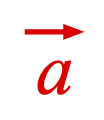
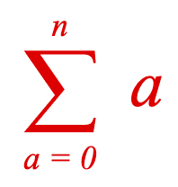
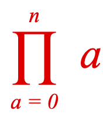
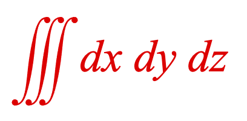
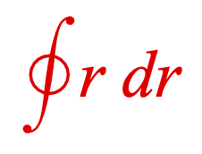
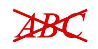
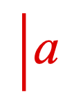

# Equation Symbols API Reference

## Contents

- [EQN_Symbol](#eqn_symbol)
- [EQN_VinculumSymbol](#eqn_vinculumsymbol)
- [EQN_BoxSymbol](#eqn_boxsymbol)
- [EQN_ArrowSymbol](#eqn_arrowsymbol)
- [EQN_SumSymbol](#eqn_sumsymbol)
- [EQN_ProdSymbol](#eqn_prodsymbol)
- [EQN_IntegralSymbol](#eqn_integralsymbol)
- [EQN_RadicalSymbol](#eqn_radicalsymbol)
- [EQN_DivisionSymbol](#eqn_divisionsymbol)
- [EQN_StrikeSymbol](#eqn_strikesymbol)
- [EQN_BracketSymbol](#eqn_bracketsymbol)
- [EQN_AngleBracketSymbol](#eqn_anglebracketsymbol)
- [EQN_BraceSymbol](#eqn_bracesymbol)
- [EQN_BarSymbol](#eqn_barsymbol)
- [EQN_SquareBracketSymbol](#eqn_squarebracketsymbol)
- [EQN_LineSymbol](#eqn_linesymbol)

---

## EQN_Symbol

Base object options for all equation symbols

`isTouchable`, `touchBorder`, `color` and `onClick` change the corresponding
properties on the {@link FigureElementPrimitive}, and could therefore also
be set in `mods`. However, as these are commonly used, they are included in
the root object for convenience.

---

## EQN_VinculumSymbol

*Extends {@link EQN_Symbol}*

Vinculum symbol used in fractions ({@link EQN_Fraction} equation function).


<pre>
                         width
      |<---------------------------------------->|
      |                                          |
      |                                          | ____
      00000000000000000000000000000000000000000000   A
      00000000000000000000000000000000000000000000   |  lineWidth
      00000000000000000000000000000000000000000000 __V_

</pre>

### Properties

<ul class="tsd-parameter-list">
<li><span><span class="tsd-kind-parameter">symbol</span>: <span class="tsd-signature-type">'vinculum'</span></span></li>
<li><span><span class="tsd-kind-parameter">lineWidth</span>: <span class="tsd-signature-type"><a href="https://developer.mozilla.org/docs/Web/JavaScript/Reference/Global_Objects/Number" class="tsd-signature-type">number</a> | undefined</span> <span class="tsd-signature-symbol">= 0.01</span></span></li>
<li><span><span class="tsd-kind-parameter">draw</span>: <span class="tsd-signature-type">'static' | 'dynamic' | undefined</span> <span class="tsd-signature-symbol">= 'dynamic'</span></span><div class="tsd-comment tsd-typography"><p><code>'dynamic'</code> updates vertices on
resize, <code>'static'</code> only changes scale transform</p></div></li>
<li><span><span class="tsd-kind-parameter">staticWidth</span>: <span class="tsd-signature-type"><a href="https://developer.mozilla.org/docs/Web/JavaScript/Reference/Global_Objects/Number" class="tsd-signature-type">number</a> | 'first' | undefined</span> <span class="tsd-signature-symbol">= 'first'</span></span><div class="tsd-comment tsd-typography"><p>used when <code>draw</code>=<code>static</code>.
<code>number</code> sets width of static symbol - <code>'first'</code> calculates and sets width
based on first use</p></div></li>
</ul>

#### Define as element

```js
figure.add({
  make: 'equation',
  elements: {
    v: { symbol: 'vinculum' },
  },
  forms: {
    form1: { frac: ['a', 'v', 'b'] },
  },
});
```

#### Define inline simple one use

```js
figure.add({
  make: 'equation',
  forms: {
    form1: { frac: ['a', 'vinculum', 'b'] },
  },
});
```

#### Define inline with reuse

```js
const eqn = figure.add({
  make: 'equation',
  forms: {
    form1: { frac: ['a', 'v1_vinculum', { frac: ['c', 'v2_vinculum', 'b'] }] },
    form2: { frac: [['a', 'ef'], 'v1', { frac: ['c', 'v2', 'd'] }] },
  },
});
eqn.animations.new()
  .goToForm({ delay: 1, target: 'form2', animate: 'move' })
  .start();
```

#### Define inline with customization

```js
figure.add({
  make: 'equation',
  forms: {
      form1: { frac: ['a', { vinculum: { lineWidth: 0.004 } }, 'b'] },
  },
});
```

---

## EQN_BoxSymbol

*Extends {@link EQN_Symbol}*

Box equation symbol used in {@link EQN_Box} and as a
{@link EQN_EncompassGlyph}.


<pre>
                                         width
                |<--------------------------------------------------->|
                |                                                     |
                |                                                     |

        ------- 0000000000000000000000000000000000000000000000000000000
        A       0000000000000000000000000000000000000000000000000000000
        |       0000                                               0000
        |       0000                                               0000
        |       0000                                               0000
 height |       0000                                               0000
        |       0000                                               0000
        |       0000                                               0000
        |       0000                                               0000
        |       0000                                               0000
        |       0000000000000000000000000000000000000000000000000000000
        V______ 0000000000000000000000000000000000000000000000000000000

</pre>

### Properties

<ul class="tsd-parameter-list">
<li><span><span class="tsd-kind-parameter">symbol</span>: <span class="tsd-signature-type">'box'</span></span></li>
<li><span><span class="tsd-kind-parameter">lineWidth</span>: <span class="tsd-signature-type"><a href="https://developer.mozilla.org/docs/Web/JavaScript/Reference/Global_Objects/Number" class="tsd-signature-type">number</a> | undefined</span> <span class="tsd-signature-symbol">= 0.01</span></span></li>
<li><span><span class="tsd-kind-parameter">fill</span>: <span class="tsd-signature-type"><a href="https://developer.mozilla.org/docs/Web/JavaScript/Reference/Global_Objects/Boolean" class="tsd-signature-type">boolean</a> | undefined</span> <span class="tsd-signature-symbol">= false</span></span></li>
<li><span><span class="tsd-kind-parameter">width</span>: <span class="tsd-signature-type"><a href="https://developer.mozilla.org/docs/Web/JavaScript/Reference/Global_Objects/Number" class="tsd-signature-type">number</a> | undefined</span></span><div class="tsd-comment tsd-typography"><p>force width instead of auto calculation</p></div></li>
<li><span><span class="tsd-kind-parameter">height</span>: <span class="tsd-signature-type"><a href="https://developer.mozilla.org/docs/Web/JavaScript/Reference/Global_Objects/Number" class="tsd-signature-type">number</a> | undefined</span></span><div class="tsd-comment tsd-typography"><p>force height instead of auto calculation</p></div></li>
<li><span><span class="tsd-kind-parameter">draw</span>: <span class="tsd-signature-type">'static' | 'dynamic' | undefined</span> <span class="tsd-signature-symbol">= dynamic</span></span><div class="tsd-comment tsd-typography"><p><code>'dynamic'</code> updates vertices on
resize, <code>'static'</code> only changes scale transform</p></div></li>
<li><span><span class="tsd-kind-parameter">staticWidth</span>: <span class="tsd-signature-type"><a href="https://developer.mozilla.org/docs/Web/JavaScript/Reference/Global_Objects/Number" class="tsd-signature-type">number</a> | 'first' | undefined</span></span><div class="tsd-comment tsd-typography"><p>used when <code>draw</code>=<code>static</code>.
<code>number</code> sets width of static symbol - <code>'first'</code> calculates and sets width
based on first use</p></div></li>
<li><span><span class="tsd-kind-parameter">staticHeight</span>: <span class="tsd-signature-type"><a href="https://developer.mozilla.org/docs/Web/JavaScript/Reference/Global_Objects/Number" class="tsd-signature-type">number</a> | 'first' | undefined</span></span><div class="tsd-comment tsd-typography"><p>used when <code>draw</code>=<code>static</code>.
<code>number</code> sets height of static symbol - <code>'first'</code> calculates and sets height
based on first use</p></div></li>
</ul>

#### Define in element

```js
figure.add({
  make: 'equation',
  elements: {
    b: { symbol: 'box', lineWidth: 0.008 },
  },
  forms: {
    form1: { box: ['a', 'b', true, 0.1] },
  },
});
```

#### Define inline simple one use

```js
figure.add({
  make: 'equation',
  forms: {
    form1: { box: ['a', 'box', true, 0.1] },
  },
});
```

#### Define inline with reuse

```js
const eqn = figure.add({
  make: 'equation',
  forms: {
    form1: { box: ['a', 'b_box', false, 0.1] },
    form2: { box: ['a', 'b', false, 0.2] },
  },
});
eqn.animations.new()
  .goToForm({ delay: 1, target: 'form2', animate: 'move' })
  .start();
```

#### Define inline with customization

```js
figure.add({
  make: 'equation',
  forms: {
    form1: { box: ['a', { box: { lineWidth: 0.004 } }, true, 0.1] },
  },
});
```

---

## EQN_ArrowSymbol

*Extends {@link EQN_Symbol}*

Arrow equation symbol.

The arrow direction defines where it can be used:
- `'left'`, `'right'`: {@link EQN_Bar} (top and bottom sides),
  {@link EQN_Comment}, and {@link EQN_LeftRightGlyph}
- `'up'`, `'down'`: {@link EQN_Bracket}, {@link EQN_Bar} (left and right
  sides), and {@link EQN_TopBottomGlyph}

Note, as the default direciton is `'right'`, using the inline definition of
arrow will only work with {@link EQN_Bar} (top and bottom sides),
{@link EQN_Comment}, and {@link EQN_LeftRightGlyph}.



<pre>
                            arrowWidth
                        |<--------------->|
                        |                 |
                        |                 |
                 -------|------- 0        |
                 A      |      00000      |
   arrowHeight   |      |     0000000     |
                 |      |   00000000000   |
                 V      | 000000000000000 |
                 ------ 0000000000000000000
                              0000000
                              0000000
                              0000000
                              0000000
                              0000000
                              0000000
                              0000000
                              0000000
                              0000000
                              0000000
                              0000000
                              0000000
                              0000000
                              0000000
                              0000000
                              0000000
                              |     |
                              |     |
                              |<--->|
                             lineWidth
</pre>

### Properties

<ul class="tsd-parameter-list">
<li><span><span class="tsd-kind-parameter">symbol</span>: <span class="tsd-signature-type">'arrow'</span></span></li>
<li><span><span class="tsd-kind-parameter">direction</span>: <span class="tsd-signature-type">'up' | 'down' | 'left' | 'right' | undefined</span> <span class="tsd-signature-symbol">= 'right'</span></span></li>
<li><span><span class="tsd-kind-parameter">lineWidth</span>: <span class="tsd-signature-type"><a href="https://developer.mozilla.org/docs/Web/JavaScript/Reference/Global_Objects/Number" class="tsd-signature-type">number</a> | undefined</span> <span class="tsd-signature-symbol">= 0.01</span></span></li>
<li><span><span class="tsd-kind-parameter">arrowWidth</span>: <span class="tsd-signature-type"><a href="https://developer.mozilla.org/docs/Web/JavaScript/Reference/Global_Objects/Number" class="tsd-signature-type">number</a> | undefined</span> <span class="tsd-signature-symbol">= 0.01</span></span></li>
<li><span><span class="tsd-kind-parameter">arrowHeight</span>: <span class="tsd-signature-type"><a href="https://developer.mozilla.org/docs/Web/JavaScript/Reference/Global_Objects/Number" class="tsd-signature-type">number</a> | undefined</span> <span class="tsd-signature-symbol">= 0.04</span></span></li>
<li><span><span class="tsd-kind-parameter">lineWidth</span>: <span class="tsd-signature-type"><a href="https://developer.mozilla.org/docs/Web/JavaScript/Reference/Global_Objects/Number" class="tsd-signature-type">number</a> | undefined</span> <span class="tsd-signature-symbol">= 0.01</span></span></li>
<li><span><span class="tsd-kind-parameter">draw</span>: <span class="tsd-signature-type">'static' | 'dynamic' | undefined</span> <span class="tsd-signature-symbol">= dynamic</span></span><div class="tsd-comment tsd-typography"><p><code>'dynamic'</code> updates vertices on
resize, <code>'static'</code> only changes scale transform</p></div></li>
<li><span><span class="tsd-kind-parameter">staticHeight</span>: <span class="tsd-signature-type"><a href="https://developer.mozilla.org/docs/Web/JavaScript/Reference/Global_Objects/Number" class="tsd-signature-type">number</a> | 'first' | undefined</span> <span class="tsd-signature-symbol">= 'first'</span></span><div class="tsd-comment tsd-typography"><p>used when <code>draw</code>=<code>static</code>.
<code>number</code> sets height of static symbol - <code>'first'</code> calculates and sets height
based on first use</p></div></li>
</ul>

#### Define in element

```js
figure.add({
  make: 'equation',
  elements: {
    rightArrow: { symbol: 'arrow', direction: 'right' },
  },
  forms: {
    form1: { bar: ['a', 'rightArrow', false, 0.05, 0.03] },
  },
});
```

#### Define inline simple one use

```js
figure.add({
  make: 'equation',
  forms: {
    form1: { bar: ['a', 'arrow', false, 0.05, 0.03] },
  },
});
```

#### Define inline with reuse

```js
const eqn = figure.add({
  make: 'equation',
  forms: {
    form1: { bar: ['a', 'ar_arrow', false, 0.05, 0] },
    form2: { bar: ['a', 'ar', false, 0.05, 0.1] },
  },
});
eqn.animations.new()
  .goToForm({ delay: 1, target: 'form2', animate: 'move' })
  .start();
```

#### Define inline with customization

```js
figure.add({
  make: 'equation',
  forms: {
    form1: {
      bar: {
        content: 'a',
        side: 'left',
        symbol: { arrow: { direction: 'up' } },
        overhang: 0.1,
      },
    },
  },
});
```

---

## EQN_SumSymbol

*Extends {@link EQN_Symbol}*

Sum equation symbol used with the {@link EQN_SumOf} equation function.



<pre>
         ---------- 00000000000000000000000000000000000
         A            0000000                     000000
         |              0000000                      000
         |                0000000                      00
         |                  0000000
         |                    0000000
         |                      0000000
         |                        0000000
         |                          0000000
         |                            0000000
         |                              0000000
         |                                000000
         |                                  000
         |                                0000
  height |                              0000
         |                            0000   \
         |                          0000      \
         |                        0000         lineWidth
         |                      0000
         |                    0000
         |                  0000
         |                0000                          00
         |              0000                          000|
         |            0000                         000000|
         V          000000000000000000000000000000000000 |
         --------  000000000000000000000000000000000000  |
                  |                                      |
                  |                                      |
                  |                 width                |
                  |<------------------------------------>|
</pre>

### Properties

<ul class="tsd-parameter-list">
<li><span><span class="tsd-kind-parameter">symbol</span>: <span class="tsd-signature-type">'sum'</span></span></li>
<li><span><span class="tsd-kind-parameter">lineWidth</span>: <span class="tsd-signature-type"><a href="https://developer.mozilla.org/docs/Web/JavaScript/Reference/Global_Objects/Number" class="tsd-signature-type">number</a> | undefined</span></span><div class="tsd-comment tsd-typography"><p>(<code>height * 0.88 / (25 * height + 15)</code>)</p></div></li>
<li><span><span class="tsd-kind-parameter">sides</span>: <span class="tsd-signature-type"><a href="https://developer.mozilla.org/docs/Web/JavaScript/Reference/Global_Objects/Number" class="tsd-signature-type">number</a> | undefined</span> <span class="tsd-signature-symbol">= 5</span></span><div class="tsd-comment tsd-typography"><p>number of sides that make up serif curve</p></div></li>
<li><span><span class="tsd-kind-parameter">draw</span>: <span class="tsd-signature-type">'static' | 'dynamic' | undefined</span> <span class="tsd-signature-symbol">= dynamic</span></span><div class="tsd-comment tsd-typography"><p><code>'static'</code> updates vertices on
resize, <code>'static'</code> only changes scale transform</p></div></li>
<li><span><span class="tsd-kind-parameter">staticHeight</span>: <span class="tsd-signature-type"><a href="https://developer.mozilla.org/docs/Web/JavaScript/Reference/Global_Objects/Number" class="tsd-signature-type">number</a> | 'first' | undefined</span> <span class="tsd-signature-symbol">= 'first'</span></span><div class="tsd-comment tsd-typography"><p>used when <code>draw</code>=<code>static</code>.
<code>number</code> sets height of static symbol - <code>'first'</code> calculates and sets height
based on first use</p></div></li>
</ul>

#### Define in element

```js
figure.add({
  make: 'equation',
  elements: {
    sigma: { symbol: 'sum' },
  },
  forms: {
    form1: { sumOf: ['sigma', 'a', 'a = 0', 'n'] },
  },
});
```

#### Define inline simple one use

```js
figure.add({
  make: 'equation',
  forms: {
    form1: { sumOf: ['sum', 'a', 'a = 0', 'n'] },
  },
});
```

#### Define inline with reuse

```js
const eqn = figure.add({
  make: 'equation',
  forms: {
    form1: { sumOf: ['s1_sum', 'a', 'a = 0', 'n'] },
    form2: { sumOf: ['s1', 'a', 'a = 0', 'm'] },
  },
});
eqn.animations.new()
  .goToForm({ delay: 1, target: 'form2', animate: 'move' })
  .start();
```

#### Define inline with customization

```js
figure.add({
  make: 'equation',
  forms: {
    form1: { sumOf: [{ sum: { lineWidth: 0.01 } }, 'a', 'a = 0', 'n'] },
  },
});
```

---

## EQN_ProdSymbol

*Extends {@link EQN_Symbol}*

Product equation symbol used with the {@link EQN_ProdOf} equation function.




<pre>
                                         width
               |<--------------------------------------------------------->|
               |                                                           |
               |                                                           |
               |                                                           |
               |                          lineWidth                        |
               |                            /                              |
               |                           /                               |
         ---- 00000000000000000000000000000000000000000000000000000000000000
         A         000000000000000000000000000000000000000000000000000000
         |           00000000000000000000000000000000000000000000000000
         |            00000000000                         00000000000
         |            00000000000                         00000000000
         |            00000000000                         00000000000
         |            00000000000                         00000000000
         |            00000000000                         00000000000
         |            00000000000                         00000000000
         |            00000000000                         00000000000
         |            00000000000                         00000000000
         |            00000000000                         00000000000
 height  |            00000000000                         00000000000
         |            00000000000                         00000000000
         |            00000000000                         00000000000
         |            00000000000                         00000000000
         |            00000000000                         00000000000
         |            00000000000                         00000000000
         |            00000000000                         00000000000
         |            00000000000                         00000000000
         |            00000000000                         00000000000
         |            00000000000                         00000000000
         |            00000000000                         00000000000
         |           0000000000000                       00000000000000
         V         00000000000000000                   000000000000000000
         ----- 0000000000000000000000000           00000000000000000000000000
</pre>

### Properties

<ul class="tsd-parameter-list">
<li><span><span class="tsd-kind-parameter">symbol</span>: <span class="tsd-signature-type">'prod'</span></span></li>
<li><span><span class="tsd-kind-parameter">lineWidth</span>: <span class="tsd-signature-type"><a href="https://developer.mozilla.org/docs/Web/JavaScript/Reference/Global_Objects/Number" class="tsd-signature-type">number</a> | undefined</span> <span class="tsd-signature-symbol">= related to height</span></span></li>
<li><span><span class="tsd-kind-parameter">sides</span>: <span class="tsd-signature-type"><a href="https://developer.mozilla.org/docs/Web/JavaScript/Reference/Global_Objects/Number" class="tsd-signature-type">number</a> | undefined</span> <span class="tsd-signature-symbol">= 5</span></span><div class="tsd-comment tsd-typography"><p>number of sides that make up serif curve</p></div></li>
<li><span><span class="tsd-kind-parameter">draw</span>: <span class="tsd-signature-type">'static' | 'dynamic' | undefined</span> <span class="tsd-signature-symbol">= dynamic</span></span><div class="tsd-comment tsd-typography"><p><code>'static'</code> updates vertices on
resize, <code>'static'</code> only changes scale transform</p></div></li>
<li><span><span class="tsd-kind-parameter">staticHeight</span>: <span class="tsd-signature-type"><a href="https://developer.mozilla.org/docs/Web/JavaScript/Reference/Global_Objects/Number" class="tsd-signature-type">number</a> | 'first' | undefined</span> <span class="tsd-signature-symbol">= 'first'</span></span><div class="tsd-comment tsd-typography"><p>used when <code>draw</code>=<code>static</code>.
<code>number</code> sets height of static symbol - <code>'first'</code> calculates and sets height
based on first use</p></div></li>
</ul>

#### Define in element

```js
figure.add({
  make: 'equation',
  elements: {
    sigma: { symbol: 'prod' },
  },
  forms: {
    form1: { prodOf: ['sigma', 'a', 'a = 0', 'n'] },
  },
});
```

#### Define inline simple one use

```js
figure.add({
  make: 'equation',
  forms: {
    form1: { prodOf: ['prod', 'a', 'a = 0', 'n'] },
  },
});
```

#### Define inline with reuse

```js
const eqn = figure.add({
  make: 'equation',
  forms: {
    form1: { prodOf: ['p1_prod', 'a', 'a = 0', 'n'] },
    form2: { prodOf: ['p1', 'a', 'a = 0', 'm'] },
  },
});
eqn.animations.new()
  .goToForm({ delay: 1, target: 'form2', animate: 'move' })
  .start();
```

#### Define inline with customization

```js
figure.add({
  make: 'equation',
  forms: {
    form1: { prodOf: [{ prod: { lineWidth: 0.01 } }, 'a', 'a = 0', 'n'] },
  },
});
```

---

## EQN_IntegralSymbol

*Extends {@link EQN_Symbol}*

Integral equation symbol used with the {@link EQN_Integral} equation
function.







<pre>
     --------------------------------------------------   0000000
    A                                              000000011111111
    |                                         0000000   111111111111
    |                                       0000000    11111111111111
    |                                      0000000     11111111111111
    |                                     0000000       111111111111
    |                                   000000000         11111111
    |                                  000000000
    |                                 0000000000
    |                                 000000000
    |                                0000000000
    |                                0000000000
    |                               00000000000
    |                              00000000000
    |                              000000000000
    |                             000000000000      lineWidth
    | height              ------->000000000000<----------
    |                             000000000000
    |                             000000000000
    |                            000000000000
    |                             00000000000
    |                            00000000000
    |                            0000000000
    |                            0000000000
    |     Serif                  000000000
    |       \                   000000000
    |        \                 0000000000
    |      11111111           000000000
    |    111111111111       00000000
    |   11111111111111     0000000
    |   11111111111111   0000000
    |    111111111111   0000000
    V      111111110000000
    -------  0000000
</pre>

### Properties

<ul class="tsd-parameter-list">
<li><span><span class="tsd-kind-parameter">symbol</span>: <span class="tsd-signature-type">'int'</span></span></li>
<li><span><span class="tsd-kind-parameter">lineWidth</span>: <span class="tsd-signature-type"><a href="https://developer.mozilla.org/docs/Web/JavaScript/Reference/Global_Objects/Number" class="tsd-signature-type">number</a> | undefined</span> <span class="tsd-signature-symbol">= related to height</span></span></li>
<li><span><span class="tsd-kind-parameter">sides</span>: <span class="tsd-signature-type"><a href="https://developer.mozilla.org/docs/Web/JavaScript/Reference/Global_Objects/Number" class="tsd-signature-type">number</a> | undefined</span> <span class="tsd-signature-symbol">= 30</span></span><div class="tsd-comment tsd-typography"><p>number of sides that make up s curve</p></div></li>
<li><span><span class="tsd-kind-parameter">num</span>: <span class="tsd-signature-type"><a href="https://developer.mozilla.org/docs/Web/JavaScript/Reference/Global_Objects/Number" class="tsd-signature-type">number</a> | undefined</span> <span class="tsd-signature-symbol">= 1</span></span><div class="tsd-comment tsd-typography"><p>number of integral symbols</p></div></li>
<li><span><span class="tsd-kind-parameter">type</span>: <span class="tsd-signature-type">'line' | 'generic' | undefined</span> <span class="tsd-signature-symbol">= generic</span></span><div class="tsd-comment tsd-typography"><p><code>line</code> draws a circle through the
 symbols denoting a line integral</p></div></li>
<li><span><span class="tsd-kind-parameter">tipWidth</span>: <span class="tsd-signature-type"><a href="https://developer.mozilla.org/docs/Web/JavaScript/Reference/Global_Objects/Number" class="tsd-signature-type">number</a> | undefined</span> <span class="tsd-signature-symbol">= related to lineWidth</span></span><div class="tsd-comment tsd-typography"><p>width of s curve tip</p></div></li>
<li><span><span class="tsd-kind-parameter">serif</span>: <span class="tsd-signature-type"><a href="https://developer.mozilla.org/docs/Web/JavaScript/Reference/Global_Objects/Boolean" class="tsd-signature-type">boolean</a> | undefined</span> <span class="tsd-signature-symbol">= true</span></span><div class="tsd-comment tsd-typography"><p><code>false</code> to remove serifs</p></div></li>
<li><span><span class="tsd-kind-parameter">serifSides</span>: <span class="tsd-signature-type"><a href="https://developer.mozilla.org/docs/Web/JavaScript/Reference/Global_Objects/Number" class="tsd-signature-type">number</a> | undefined</span> <span class="tsd-signature-symbol">= 10</span></span><div class="tsd-comment tsd-typography"><p>number of sides in serif circles</p></div></li>
<li><span><span class="tsd-kind-parameter">lineIntegralSides</span>: <span class="tsd-signature-type"><a href="https://developer.mozilla.org/docs/Web/JavaScript/Reference/Global_Objects/Number" class="tsd-signature-type">number</a> | undefined</span> <span class="tsd-signature-symbol">= 20</span></span><div class="tsd-comment tsd-typography"><p>number of sides in line integral circle</p></div></li>
<li><span><span class="tsd-kind-parameter">draw</span>: <span class="tsd-signature-type">'static' | 'dynamic' | undefined</span> <span class="tsd-signature-symbol">= dynamic</span></span><div class="tsd-comment tsd-typography"><p><code>'static'</code> updates vertices on
resize, <code>'static'</code> only changes scale transform</p></div></li>
<li><span><span class="tsd-kind-parameter">staticHeight</span>: <span class="tsd-signature-type"><a href="https://developer.mozilla.org/docs/Web/JavaScript/Reference/Global_Objects/Number" class="tsd-signature-type">number</a> | 'first' | undefined</span> <span class="tsd-signature-symbol">= 'first'</span></span><div class="tsd-comment tsd-typography"><p>used when <code>draw</code>=<code>static</code>.
<code>number</code> sets height of static symbol - <code>'first'</code> calculates and sets height
based on first use</p></div></li>
</ul>

#### Define in element

```js
figure.add({
  make: 'equation',
  elements: {
    int: { symbol: 'int' },
  },
  forms: {
    form1: { int: ['int', 'x dx', 'a', 'b'] },
  },
});
```

#### Triple Integral

```js
figure.add({
  make: 'equation',
  elements: {
    int: { symbol: 'int', num: 3 },
  },
  forms: {
    form1: { int: ['int', 'dx dy dz'] },
  },
});
```

#### Line Integral

```js
figure.add({
  make: 'equation',
  elements: {
    int: { symbol: 'int', type: 'line' },
  },
  forms: {
    form1: { int: ['int', 'r dr'] },
  },
});
```

#### Define inline simple one use

```js
figure.add({
  make: 'equation',
  forms: {
    form1: { int: ['int', 'x dx', 'a', 'b'] },
  },
});
```

#### Define inline with reuse

```js
const eqn = figure.add({
  make: 'equation',
  forms: {
    form1: { int: ['i1_int', 'x dx', 'a', 'b'] },
    form2: { int: ['i1', 'y dy', 'a', 'b'] },
  },
});
eqn.animations.new()
  .goToForm({ delay: 1, target: 'form2', animate: 'move' })
  .start();
```

#### Define inline with customization

```js
figure.add({
  make: 'equation',
  forms: {
    form1: { int: [{ int: { serif: false } }, 'x dx', 'a', 'b'] },
  },
});
```

---

## EQN_RadicalSymbol

*Extends {@link EQN_Symbol}*

Radical equation symbol used in {@link EQN_Root}.

The radical symbol allows customization on how to draw the radical. Mostly
it will not be needed, but for edge case equation layouts it may be useful.


<pre>

  height
  |
  |
  |_____________________________ XXXXXXXXXXXXXXXXXXXXXXXXXXXXXX
  A                             X|
  |   startHeight              X |   CCCCCCCCCCCCCCCCCCCCCCC
  |   |                       X  |   CCCCCCCCCCCCCCCCCCCCCCC
  |   |    tickHeight        X   |   CCCCCCCCCCCCCCCCCCCCCCC
  |   |    |                X    |   CCCCCCCCCCCCCCCCCCCCCCC
  |   |____V____           X     |   CCCCCCCCCCCCCCCCCCCCCCC
  |   A    |    X         X      |   CCCCCCCCCCCCCCCCCCCCCCC
  |   |    |__X |X       X       |   CCCCCCCCCCCCCCCCCCCCCCC
  |   |    A |  | X     X        |   CCCCCCCCCCCCCCCCCCCCCCC
  |   |      |  |  X   X         |   CCCCCCCCCCCCCCCCCCCCCCC
  |   |      |  |   X X          |   CCCCCCCCCCCCCCCCCCCCCCC
  V___V______|__|____X           |
             |  |    |           |
             |  |    |           |
  tickWidth >|--|<   |           |
             |  |    |           |
             |  |<-->|downWidth  |
             |                   |
             |<----------------->|
                    startWidth
</pre>

### Properties

<ul class="tsd-parameter-list">
<li><span><span class="tsd-kind-parameter">symbol</span>: <span class="tsd-signature-type">'radical'</span></span></li>
<li><span><span class="tsd-kind-parameter">lineWidth</span>: <span class="tsd-signature-type"><a href="https://developer.mozilla.org/docs/Web/JavaScript/Reference/Global_Objects/Number" class="tsd-signature-type">number</a> | undefined</span> <span class="tsd-signature-symbol">= 0.01</span></span></li>
<li><span><span class="tsd-kind-parameter">width</span>: <span class="tsd-signature-type"><a href="https://developer.mozilla.org/docs/Web/JavaScript/Reference/Global_Objects/Number" class="tsd-signature-type">number</a> | undefined</span> <span class="tsd-signature-symbol">= normally defined by content size</span></span><div class="tsd-comment tsd-typography"><p>force width of content area</p></div></li>
<li><span><span class="tsd-kind-parameter">height</span>: <span class="tsd-signature-type"><a href="https://developer.mozilla.org/docs/Web/JavaScript/Reference/Global_Objects/Number" class="tsd-signature-type">number</a> | undefined</span> <span class="tsd-signature-symbol">= normally defined by content size</span></span><div class="tsd-comment tsd-typography"><p>force height of content area</p></div></li>
<li><span><span class="tsd-kind-parameter">startWidth</span>: <span class="tsd-signature-type"><a href="https://developer.mozilla.org/docs/Web/JavaScript/Reference/Global_Objects/Number" class="tsd-signature-type">number</a> | undefined</span> <span class="tsd-signature-symbol">= 0.5</span></span></li>
<li><span><span class="tsd-kind-parameter">startHeight</span>: <span class="tsd-signature-type"><a href="https://developer.mozilla.org/docs/Web/JavaScript/Reference/Global_Objects/Number" class="tsd-signature-type">number</a> | undefined</span> <span class="tsd-signature-symbol">= 0.5</span></span></li>
<li><span><span class="tsd-kind-parameter">maxStartWidth</span>: <span class="tsd-signature-type">?<a href="https://developer.mozilla.org/docs/Web/JavaScript/Reference/Global_Objects/Number" class="tsd-signature-type">number</a> | undefined</span> <span class="tsd-signature-symbol">= 0.15</span></span></li>
<li><span><span class="tsd-kind-parameter">maxStartHeight</span>: <span class="tsd-signature-type">?<a href="https://developer.mozilla.org/docs/Web/JavaScript/Reference/Global_Objects/Number" class="tsd-signature-type">number</a> | undefined</span> <span class="tsd-signature-symbol">= 0.15</span></span></li>
<li><span><span class="tsd-kind-parameter">tickHeight</span>: <span class="tsd-signature-type"><a href="https://developer.mozilla.org/docs/Web/JavaScript/Reference/Global_Objects/Number" class="tsd-signature-type">number</a> | undefined</span></span></li>
<li><span><span class="tsd-kind-parameter">tickWidth</span>: <span class="tsd-signature-type"><a href="https://developer.mozilla.org/docs/Web/JavaScript/Reference/Global_Objects/Number" class="tsd-signature-type">number</a> | undefined</span></span></li>
<li><span><span class="tsd-kind-parameter">downWidth</span>: <span class="tsd-signature-type"><a href="https://developer.mozilla.org/docs/Web/JavaScript/Reference/Global_Objects/Number" class="tsd-signature-type">number</a> | undefined</span></span></li>
<li><span><span class="tsd-kind-parameter">proportionalToHeight</span>: <span class="tsd-signature-type"><a href="https://developer.mozilla.org/docs/Web/JavaScript/Reference/Global_Objects/Boolean" class="tsd-signature-type">boolean</a> | undefined</span> <span class="tsd-signature-symbol">= true</span></span><div class="tsd-comment tsd-typography"><p><code>true</code> makes <code>startHeight</code>,
<code>startWidth</code>, <code>tickHeight</code>, <code>tickWidth</code>, and <code>downWidth</code> a percentage of
height instead of absolute</p></div></li>
<li><span><span class="tsd-kind-parameter">lineWidth2</span>: <span class="tsd-signature-type"><a href="https://developer.mozilla.org/docs/Web/JavaScript/Reference/Global_Objects/Number" class="tsd-signature-type">number</a> | undefined</span> <span class="tsd-signature-symbol">= 2 x lineWidth</span></span><div class="tsd-comment tsd-typography"><p>lineWidth of down stroke</p></div></li>
<li><span><span class="tsd-kind-parameter">draw</span>: <span class="tsd-signature-type">'static' | 'dynamic' | undefined</span> <span class="tsd-signature-symbol">= dynamic</span></span><div class="tsd-comment tsd-typography"><p><code>'static'</code> updates vertices on
resize, <code>'static'</code> only changes scale transform</p></div></li>
<li><span><span class="tsd-kind-parameter">staticHeight</span>: <span class="tsd-signature-type"><a href="https://developer.mozilla.org/docs/Web/JavaScript/Reference/Global_Objects/Number" class="tsd-signature-type">number</a> | 'first' | undefined</span> <span class="tsd-signature-symbol">= 'first'</span></span><div class="tsd-comment tsd-typography"><p>used when <code>draw</code>=<code>static</code>.
<code>number</code> sets height of static symbol - <code>'first'</code> calculates and sets height
based on first use</p></div></li>
<li><span><span class="tsd-kind-parameter">staticWidth</span>: <span class="tsd-signature-type"><a href="https://developer.mozilla.org/docs/Web/JavaScript/Reference/Global_Objects/Number" class="tsd-signature-type">number</a> | 'first' | undefined</span> <span class="tsd-signature-symbol">= 'first'</span></span><div class="tsd-comment tsd-typography"><p>used when <code>draw</code>=<code>static</code>.
<code>number</code> sets width of static symbol - <code>'first'</code> calculates and sets width
based on first use</p></div></li>
</ul>

#### Define in element

```js
figure.add({
  make: 'equation',
  elements: {
    r: { symbol: 'radical' },
  },
  forms: {
    form1: { root: ['r', 'a', false, 0.05] },
  },
});
```

#### Define inline simple one use

```js
figure.add({
  make: 'equation',
  forms: {
    form1: { root: ['radical', 'a', false, 0.05] },
  },
});
```

#### Define inline with reuse

```js
const eqn = figure.add({
  make: 'equation',
  forms: {
    form1: { root: ['r1_radical', 'a', false, 0.05] },
    form2: { root: ['r1', ['a', 'b'], false, 0.05] },
  },
});
eqn.animations.new()
  .goToForm({ delay: 1, target: 'form2', animate: 'move' })
  .start();
```

#### Define inline with customization

```js
figure.add({
  make: 'equation',
  forms: {
    form1: { root: [{ radical: { lineWidth: 0.005 } }, 'a', false, 0.05] },
  },
});
```

---

## EQN_DivisionSymbol

*Extends {@link EQN_Symbol}*

Division equation symbol used in {@link EQN_Root}.

The division symbol allows customization on how to draw the long form and
short form division symbol. Mostly it will not be needed, but for edge case
equation layouts it may be useful.


<pre>

                           left space                right space
             bend width |<->|<---->|                     >|--|<
                        |   |      |                      |  |
                        |   |      |                      |  |
                ------- XXXXXXXXXXXXXXXXXXXXXXXXXXXXXXXXXXXXXX____V
                A        X  |      |                      |_______|
                |         X |       CCCCCCCCCCCCCCCCCCCCCCC       A
                |          X        CCCCCCCCCCCCCCCCCCCCCCC    top space
                |           X       CCCCCCCCCCCCCCCCCCCCCCC
         height |           X       CCCCCCCCCCCCCCCCCCCCCCC
                |           X       CCCCCCCCCCCCCCCCCCCCCCC
                |           X       CCCCCCCCCCCCCCCCCCCCCCC
                |          X        CCCCCCCCCCCCCCCCCCCCCCC
                |         X         CCCCCCCCCCCCCCCCCCCCCCC
                |        X          CCCCCCCCCCCCCCCCCCCCCCC   bottom space
                V       X           CCCCCCCCCCCCCCCCCCCCCCC_______V
                ------ X _________________________________________|
                       |                                          A
                       |                                          |
                       |                  width                   |
                       |<----------------------------------------->

</pre>

### Properties

<ul class="tsd-parameter-list">
<li><span><span class="tsd-kind-parameter">symbol</span>: <span class="tsd-signature-type">'division'</span></span></li>
<li><span><span class="tsd-kind-parameter">lineWidth</span>: <span class="tsd-signature-type"><a href="https://developer.mozilla.org/docs/Web/JavaScript/Reference/Global_Objects/Number" class="tsd-signature-type">number</a> | undefined</span> <span class="tsd-signature-symbol">= 0.01</span></span></li>
<li><span><span class="tsd-kind-parameter">width</span>: <span class="tsd-signature-type"><a href="https://developer.mozilla.org/docs/Web/JavaScript/Reference/Global_Objects/Number" class="tsd-signature-type">number</a> | undefined</span> <span class="tsd-signature-symbol">= normally defined by content size</span></span><div class="tsd-comment tsd-typography"><p>force width of content area</p></div></li>
<li><span><span class="tsd-kind-parameter">height</span>: <span class="tsd-signature-type"><a href="https://developer.mozilla.org/docs/Web/JavaScript/Reference/Global_Objects/Number" class="tsd-signature-type">number</a> | undefined</span> <span class="tsd-signature-symbol">= normally defined by content size</span></span><div class="tsd-comment tsd-typography"><p>force height of content area</p></div></li>
<li><span><span class="tsd-kind-parameter">bendWidth</span>: <span class="tsd-signature-type"><a href="https://developer.mozilla.org/docs/Web/JavaScript/Reference/Global_Objects/Number" class="tsd-signature-type">number</a> | undefined</span> <span class="tsd-signature-symbol">= 0</span></span></li>
<li><span><span class="tsd-kind-parameter">sides</span>: <span class="tsd-signature-type"><a href="https://developer.mozilla.org/docs/Web/JavaScript/Reference/Global_Objects/Number" class="tsd-signature-type">number</a> | undefined</span> <span class="tsd-signature-symbol">= 10</span></span></li>
<li><span><span class="tsd-kind-parameter">draw</span>: <span class="tsd-signature-type">'static' | 'dynamic' | undefined</span> <span class="tsd-signature-symbol">= dynamic</span></span><div class="tsd-comment tsd-typography"><p><code>'static'</code> updates vertices on
resize, <code>'static'</code> only changes scale transform</p></div></li>
<li><span><span class="tsd-kind-parameter">staticHeight</span>: <span class="tsd-signature-type"><a href="https://developer.mozilla.org/docs/Web/JavaScript/Reference/Global_Objects/Number" class="tsd-signature-type">number</a> | 'first' | undefined</span> <span class="tsd-signature-symbol">= 'first'</span></span><div class="tsd-comment tsd-typography"><p>used when <code>draw</code>=<code>static</code>.
<code>number</code> sets height of static symbol - <code>'first'</code> calculates and sets height
based on first use</p></div></li>
<li><span><span class="tsd-kind-parameter">staticWidth</span>: <span class="tsd-signature-type"><a href="https://developer.mozilla.org/docs/Web/JavaScript/Reference/Global_Objects/Number" class="tsd-signature-type">number</a> | 'first' | undefined</span> <span class="tsd-signature-symbol">= 'first'</span></span><div class="tsd-comment tsd-typography"><p>used when <code>draw</code>=<code>static</code>.
<code>number</code> sets width of static symbol - <code>'first'</code> calculates and sets width
based on first use</p></div></li>
</ul>

#### Define in element

```js
figure.add({
  make: 'equation',
  elements: {
    d: { symbol: 'division', bendWidth: 0.05 },
  },
  forms: {
    form1: { box: ['abc', 'd'] },
  },
});
```

#### Define inline simple one use

```js
figure.add({
  make: 'equation',
  forms: {
    form1: { box: ['abc', 'division'] },
  },
});
```

#### Define inline with reuse

```js
const eqn = figure.add({
  make: 'equation',
  forms: {
    form1: { box: ['abc', 'd1_division'] },
    form2: { box: ['abc', 'd1'] },
  },
});
eqn.animations.new()
  .goToForm({ delay: 1, target: 'form2', animate: 'move' })
  .start();
```

#### Define inline with customization

```js
figure.add({
  make: 'equation',
  forms: {
    form1: { box: ['abc', { division: { lineWidth: 0.005 } }] },
  },
});
```

---

## EQN_StrikeSymbol

*Extends {@link EQN_Symbol}*

Strike equation symbol used in {@link EQN_Strike}.

Integral equation symbol used with the {@link EQN_Strike} and
{@link EQN_StrikeComment} equation functions.




Four styles of strike symbol are available:
<pre>


         000         000
           000     000
             000 000
               000                       0000000000000000
             000 000
           000     000
         000         000
              cross                         horizontal


                     000                 000
                   000                     000
                 000                         000
               000                             000
             000                                 000
           000                                     000
         000                                         000
            forward                        back

</pre>

### Properties

<ul class="tsd-parameter-list">
<li><span><span class="tsd-kind-parameter">symbol</span>: <span class="tsd-signature-type">'strike'</span></span></li>
<li><span><span class="tsd-kind-parameter">style</span>: <span class="tsd-signature-type">'cross' | 'forward' | 'back' | 'horizontal' | undefined</span> <span class="tsd-signature-symbol">= 'cross'</span></span></li>
<li><span><span class="tsd-kind-parameter">lineWidth</span>: <span class="tsd-signature-type"><a href="https://developer.mozilla.org/docs/Web/JavaScript/Reference/Global_Objects/Number" class="tsd-signature-type">number</a> | undefined</span> <span class="tsd-signature-symbol">= 0.015</span></span></li>
<li><span><span class="tsd-kind-parameter">width</span>: <span class="tsd-signature-type"><a href="https://developer.mozilla.org/docs/Web/JavaScript/Reference/Global_Objects/Number" class="tsd-signature-type">number</a> | undefined</span> <span class="tsd-signature-symbol">= normally defined by
content size</span></span><div class="tsd-comment tsd-typography"><p>force width of strike</p></div></li>
<li><span><span class="tsd-kind-parameter">height</span>: <span class="tsd-signature-type"><a href="https://developer.mozilla.org/docs/Web/JavaScript/Reference/Global_Objects/Number" class="tsd-signature-type">number</a> | undefined</span> <span class="tsd-signature-symbol">= normally defined by
content size</span></span><div class="tsd-comment tsd-typography"><p>force height of strike</p></div></li>
<li><span><span class="tsd-kind-parameter">draw</span>: <span class="tsd-signature-type">'static' | 'dynamic' | undefined</span> <span class="tsd-signature-symbol">= dynamic</span></span><div class="tsd-comment tsd-typography"><p><code>'static'</code> updates vertices on
resize, <code>'static'</code> only changes scale transform</p></div></li>
<li><span><span class="tsd-kind-parameter">staticHeight</span>: <span class="tsd-signature-type"><a href="https://developer.mozilla.org/docs/Web/JavaScript/Reference/Global_Objects/Number" class="tsd-signature-type">number</a> | 'first' | undefined</span> <span class="tsd-signature-symbol">= 'first'</span></span><div class="tsd-comment tsd-typography"><p>used when <code>draw</code>=<code>static</code>.
<code>number</code> sets height of static symbol - <code>'first'</code> calculates and sets height
based on first use</p></div></li>
<li><span><span class="tsd-kind-parameter">staticWidth</span>: <span class="tsd-signature-type"><a href="https://developer.mozilla.org/docs/Web/JavaScript/Reference/Global_Objects/Number" class="tsd-signature-type">number</a> | 'first' | undefined</span> <span class="tsd-signature-symbol">= 'first'</span></span><div class="tsd-comment tsd-typography"><p>used when <code>draw</code>=<code>static</code>.
<code>number</code> sets width of static symbol - <code>'first'</code> calculates and sets width
based on first use</p></div></li>
</ul>

#### Define in element

```js
figure.add({
  make: 'equation',
  elements: {
    s: { symbol: 'strike', style: 'cross', lineWidth: 0.01 },
  },
  forms: {
    form1: { strike: ['ABC', 's'] },
  },
});
```

#### Forward Strike

```js
figure.add({
  make: 'equation',
  elements: {
    s: { symbol: 'strike', style: 'forward', lineWidth: 0.01 },
  },
  forms: {
    form1: { strike: ['ABC', 's'] },
  },
});
```

#### Back Strike

```js
figure.add({
  make: 'equation',
  elements: {
    s: { symbol: 'strike', style: 'back', lineWidth: 0.01 },
  },
  forms: {
    form1: { strike: ['ABC', 's'] },
  },
});
```

#### Horizontal Slash

```js
figure.add({
  make: 'equation',
  elements: {
    s: { symbol: 'strike', style: 'horizontal', lineWidth: 0.01 },
  },
  forms: {
    form1: { strike: ['ABC', 's'] },
  },
});
```

#### Define inline simple one use

```js
figure.add({
  make: 'equation',
  forms: {
    form1: { strike: ['ABC', 'strike'] },
  },
});
```

#### Define inline with reuse

```js
const eqn = figure.add({
  make: 'equation',
  forms: {
    form1: { strike: ['ABC', 's1_strike'] },
    form2: { strike: ['DEFGH', 's1'] },
  },
});
eqn.animations.new()
  .goToForm({ delay: 1, target: 'form2', animate: 'move' })
  .start();
```

#### Define inline with customization

```js
figure.add({
  make: 'equation',
  forms: {
    form1: { strike: ['ABC', { strike: { style: 'forward' } }] },
  },
});
```

---

## EQN_BracketSymbol

*Extends {@link EQN_Symbol}*

Bracket equation symbol used in {@link EQN_Bracket}, {@link EQN_Bar},
{@link EQN_Matrix}, and {@link EQN_Comment}.


<pre>
                   tipWidth
                     ----->| |<---
                           | |
                           | |
                           000
                         0000
                       00000
                     000000
                    000000
                    000000
       lineWidth   000000
            ------>000000<---
                   000000
                   |000000
                   |000000
                   | 000000
                   |   00000
                   |     0000
                   |       000
                   |         |
                   |         |
                   |<------->|
                      width
</pre>

### Properties

<ul class="tsd-parameter-list">
<li><span><span class="tsd-kind-parameter">symbol</span>: <span class="tsd-signature-type">'bracket'</span></span></li>
<li><span><span class="tsd-kind-parameter">side</span>: <span class="tsd-signature-type">'left' | 'right' | 'top' | 'bottom' | undefined</span> <span class="tsd-signature-symbol">= 'left'</span></span><div class="tsd-comment tsd-typography"><p>how to orient the
bracket</p></div></li>
<li><span><span class="tsd-kind-parameter">sides</span>: <span class="tsd-signature-type"><a href="https://developer.mozilla.org/docs/Web/JavaScript/Reference/Global_Objects/Number" class="tsd-signature-type">number</a> | undefined</span> <span class="tsd-signature-symbol">= 10</span></span><div class="tsd-comment tsd-typography"><p>number of sides in bracket curve</p></div></li>
<li><span><span class="tsd-kind-parameter">lineWidth</span>: <span class="tsd-signature-type"><a href="https://developer.mozilla.org/docs/Web/JavaScript/Reference/Global_Objects/Number" class="tsd-signature-type">number</a> | undefined</span> <span class="tsd-signature-symbol">= depends on height</span></span></li>
<li><span><span class="tsd-kind-parameter">tipWidth</span>: <span class="tsd-signature-type"><a href="https://developer.mozilla.org/docs/Web/JavaScript/Reference/Global_Objects/Number" class="tsd-signature-type">number</a> | undefined</span> <span class="tsd-signature-symbol">= depends on lineWidth</span></span></li>
<li><span><span class="tsd-kind-parameter">width</span>: <span class="tsd-signature-type"><a href="https://developer.mozilla.org/docs/Web/JavaScript/Reference/Global_Objects/Number" class="tsd-signature-type">number</a> | undefined</span> <span class="tsd-signature-symbol">= normally depends on height</span></span><div class="tsd-comment tsd-typography"><p>force width bracket</p></div></li>
<li><span><span class="tsd-kind-parameter">draw</span>: <span class="tsd-signature-type">'static' | 'dynamic' | undefined</span> <span class="tsd-signature-symbol">= dynamic</span></span><div class="tsd-comment tsd-typography"><p><code>'static'</code> updates vertices on
resize, <code>'static'</code> only changes scale transform</p></div></li>
<li><span><span class="tsd-kind-parameter">staticHeight</span>: <span class="tsd-signature-type"><a href="https://developer.mozilla.org/docs/Web/JavaScript/Reference/Global_Objects/Number" class="tsd-signature-type">number</a> | 'first' | undefined</span> <span class="tsd-signature-symbol">= 'first'</span></span><div class="tsd-comment tsd-typography"><p>used when <code>draw</code>=<code>static</code>.
<code>number</code> sets height of static symbol - <code>'first'</code> calculates and sets height
based on first use</p></div></li>
</ul>

#### Define in element

```js
figure.add({
  make: 'equation',
  elements: {
    lb: { symbol: 'bracket', side: 'left' },
    rb: { symbol: 'bracket', side: 'right' },
  },
  forms: {
    form1: { brac: ['lb', 'a', 'rb'] },
  },
});
```

#### Define inline

```js
figure.add({
  make: 'equation',
  forms: {
    form1: {
      brac: [
        { lb_bracket: { side: 'left' } },
        'a',
        { rb_bracket: { side: 'right' } },
      ],
    },
  },
});
```

---

## EQN_AngleBracketSymbol

*Extends {@link EQN_Symbol}*

Angle bracket equation symbol used in {@link EQN_Bracket}, {@link EQN_Bar},
{@link EQN_Matrix}, and {@link EQN_Comment}.


<pre>
                     width
                  |<------->|
                  |         |
          --------|----- 0000
          A       |     0000
          |       |    0000
          |       |   0000
          |       |  0000
          |         0000
   height |        0000
          |        0000
          |         0000
          |          0000
          |           0000
          |            0000
          |             0000
          V_____________ 0000

</pre>

### Properties

<ul class="tsd-parameter-list">
<li><span><span class="tsd-kind-parameter">symbol</span>: <span class="tsd-signature-type">'angleBracket'</span></span></li>
<li><span><span class="tsd-kind-parameter">side</span>: <span class="tsd-signature-type">'left' | 'right' | 'top' | 'bottom' | undefined</span> <span class="tsd-signature-symbol">= 'left'</span></span><div class="tsd-comment tsd-typography"><p>how to orient the
angle bracket</p></div></li>
<li><span><span class="tsd-kind-parameter">lineWidth</span>: <span class="tsd-signature-type"><a href="https://developer.mozilla.org/docs/Web/JavaScript/Reference/Global_Objects/Number" class="tsd-signature-type">number</a> | undefined</span> <span class="tsd-signature-symbol">= depends on height</span></span></li>
<li><span><span class="tsd-kind-parameter">width</span>: <span class="tsd-signature-type"><a href="https://developer.mozilla.org/docs/Web/JavaScript/Reference/Global_Objects/Number" class="tsd-signature-type">number</a> | undefined</span> <span class="tsd-signature-symbol">= normally depends on height</span></span><div class="tsd-comment tsd-typography"><p>force width bracket</p></div></li>
<li><span><span class="tsd-kind-parameter">draw</span>: <span class="tsd-signature-type">'static' | 'dynamic' | undefined</span> <span class="tsd-signature-symbol">= dynamic</span></span><div class="tsd-comment tsd-typography"><p><code>'static'</code> updates vertices on
resize, <code>'static'</code> only changes scale transform</p></div></li>
<li><span><span class="tsd-kind-parameter">staticHeight</span>: <span class="tsd-signature-type"><a href="https://developer.mozilla.org/docs/Web/JavaScript/Reference/Global_Objects/Number" class="tsd-signature-type">number</a> | 'first' | undefined</span> <span class="tsd-signature-symbol">= 'first'</span></span><div class="tsd-comment tsd-typography"><p>used when <code>draw</code>=<code>static</code>.
<code>number</code> sets height of static symbol - <code>'first'</code> calculates and sets height
based on first use</p></div></li>
</ul>

#### Define in element

```js
figure.add({
  make: 'equation',
  elements: {
    lb: { symbol: 'angleBracket', side: 'left' },
    rb: { symbol: 'angleBracket', side: 'right' },
  },
  forms: {
    form1: { brac: ['lb', 'a', 'rb'] },
  },
});
```

#### Define inline

```js
figure.add({
  make: 'equation',
  forms: {
    form1: {
      brac: [
        { lb_angleBracket: { side: 'left' } },
        'a',
        { rb_angleBracket: { side: 'right' } },
      ],
    },
  },
});
```

---

## EQN_BraceSymbol

*Extends {@link EQN_Symbol}*

Brace equation symbol used in {@link EQN_Bracket}, {@link EQN_Bar},
{@link EQN_Matrix}, and {@link EQN_Comment}.


<pre>
               width
            |<------>|
            |        |
            |        |
            |      000
            |    000
            |   000
            |  0000
            |  0000
            |  0000
            |  0000
            |  000
            | 000
            000
              000
               000
               0000
               0000
               0000
               0000
          - - -0000 - - - -
         |      000        |
         |       000       |
         |         000     |
          - - - - - - - - -
                       \
                        \
                         \
     - - - - - - - - - - - - - - - - - - - - - - - - -
    |       00000000000000                            |
    |        00000000000000                           |
    |          000000000000                 tipWidth  |
    |            000000000000               |         |
    |              000000000000             |         |
    |                 0000000000000  _______V_        |
    |                     00000000000                 |
    |                         0000000_________        |
    |                                       A         |
     - - - - - - - - - - - - - - - - - - - - - - - - -

</pre>

### Properties

<ul class="tsd-parameter-list">
<li><span><span class="tsd-kind-parameter">symbol</span>: <span class="tsd-signature-type">'brace'</span></span></li>
<li><span><span class="tsd-kind-parameter">side</span>: <span class="tsd-signature-type">'left' | 'right' | 'top' | 'bottom' | undefined</span> <span class="tsd-signature-symbol">= 'left'</span></span><div class="tsd-comment tsd-typography"><p>how to orient the
brace</p></div></li>
<li><span><span class="tsd-kind-parameter">lineWidth</span>: <span class="tsd-signature-type"><a href="https://developer.mozilla.org/docs/Web/JavaScript/Reference/Global_Objects/Number" class="tsd-signature-type">number</a> | undefined</span> <span class="tsd-signature-symbol">= depends on height</span></span></li>
<li><span><span class="tsd-kind-parameter">tipWidth</span>: <span class="tsd-signature-type"><a href="https://developer.mozilla.org/docs/Web/JavaScript/Reference/Global_Objects/Number" class="tsd-signature-type">number</a> | undefined</span> <span class="tsd-signature-symbol">= depends on lineWidth</span></span></li>
<li><span><span class="tsd-kind-parameter">width</span>: <span class="tsd-signature-type"><a href="https://developer.mozilla.org/docs/Web/JavaScript/Reference/Global_Objects/Number" class="tsd-signature-type">number</a> | undefined</span> <span class="tsd-signature-symbol">= normally depends on height</span></span><div class="tsd-comment tsd-typography"><p>force width bracket</p></div></li>
<li><span><span class="tsd-kind-parameter">sides</span>: <span class="tsd-signature-type"><a href="https://developer.mozilla.org/docs/Web/JavaScript/Reference/Global_Objects/Number" class="tsd-signature-type">number</a> | undefined</span> <span class="tsd-signature-symbol">= 10</span></span><div class="tsd-comment tsd-typography"><p>number of sides in curved sections</p></div></li>
<li><span><span class="tsd-kind-parameter">draw</span>: <span class="tsd-signature-type">'static' | 'dynamic' | undefined</span> <span class="tsd-signature-symbol">= dynamic</span></span><div class="tsd-comment tsd-typography"><p><code>'static'</code> updates vertices on
resize, <code>'static'</code> only changes scale transform</p></div></li>
<li><span><span class="tsd-kind-parameter">staticHeight</span>: <span class="tsd-signature-type"><a href="https://developer.mozilla.org/docs/Web/JavaScript/Reference/Global_Objects/Number" class="tsd-signature-type">number</a> | 'first' | undefined</span> <span class="tsd-signature-symbol">= 'first'</span></span><div class="tsd-comment tsd-typography"><p>used when <code>draw</code>=<code>static</code>.
<code>number</code> sets height of static symbol - <code>'first'</code> calculates and sets height
based on first use</p></div></li>
</ul>

#### Define in element

```js
figure.add({
  make: 'equation',
  elements: {
    lb: { symbol: 'brace', side: 'left' },
    rb: { symbol: 'brace', side: 'right' },
  },
  forms: {
    form1: { brac: ['lb', 'a', 'rb'] },
  },
});
```

#### Define inline

```js
figure.add({
  make: 'equation',
  forms: {
    form1: {
      brac: [
        { lb_brace: { side: 'left' } },
        'a',
        { rb_brace: { side: 'right' } },
      ],
    },
  },
});
```

---

## EQN_BarSymbol

*Extends {@link EQN_Symbol}*

Bar equation symbol.

The bar side defines where it can be used:
- `'top'`, `'bottom'`: {@link EQN_Bar} (top and bottom sides),
  {@link EQN_Comment}, and {@link EQN_LeftRightGlyph}
- `'left'`, `'right'`: {@link EQN_Bracket}, {@link EQN_Bar} (left and right
  sides), {@link EQN_Matrix} and {@link EQN_TopBottomGlyph}

Note, as the default direciton is `'right'`, using the inline definition of
arrow will only work with {@link EQN_Bar} (top and bottom sides),
{@link EQN_Comment}, and {@link EQN_LeftRightGlyph}.




<pre>

       >| |<---- lineWidth
        | |
        | |
        000
        000
        000
        000
        000
        000
        000
        000
        000
        000
        000

</pre>

### Properties

<ul class="tsd-parameter-list">
<li><span><span class="tsd-kind-parameter">symbol</span>: <span class="tsd-signature-type">'bar'</span></span></li>
<li><span><span class="tsd-kind-parameter">side</span>: <span class="tsd-signature-type">'left' | 'right' | 'top' | 'bottom' | undefined</span> <span class="tsd-signature-symbol">= 'left'</span></span><div class="tsd-comment tsd-typography"><p>how to orient the
bar</p></div></li>
<li><span><span class="tsd-kind-parameter">lineWidth</span>: <span class="tsd-signature-type"><a href="https://developer.mozilla.org/docs/Web/JavaScript/Reference/Global_Objects/Number" class="tsd-signature-type">number</a> | undefined</span> <span class="tsd-signature-symbol">= 0.01</span></span></li>
<li><span><span class="tsd-kind-parameter">draw</span>: <span class="tsd-signature-type">'static' | 'dynamic' | undefined</span> <span class="tsd-signature-symbol">= dynamic</span></span><div class="tsd-comment tsd-typography"><p><code>'static'</code> updates vertices on
resize, <code>'static'</code> only changes scale transform</p></div></li>
<li><span><span class="tsd-kind-parameter">staticHeight</span>: <span class="tsd-signature-type"><a href="https://developer.mozilla.org/docs/Web/JavaScript/Reference/Global_Objects/Number" class="tsd-signature-type">number</a> | 'first' | undefined</span> <span class="tsd-signature-symbol">= 'first'</span></span><div class="tsd-comment tsd-typography"><p>used when <code>draw</code>=<code>static</code>.
<code>number</code> sets height of static symbol - <code>'first'</code> calculates and sets height
based on first use</p></div></li>
</ul>

#### Define in element

```js
figure.add({
  make: 'equation',
  elements: {
    b: { symbol: 'bar', side: 'top' },
  },
  forms: {
    form1: { bar: ['a', 'b', false, 0.05, 0.03] },
  },
});
```

#### Define inline simple one use

```js
figure.add({
  make: 'equation',
  forms: {
    form1: {
      bar: {
        content: 'a',
        symbol: 'bar',
        side: 'left',
        overhang: 0.1,
      },
    },
  },
});
```

#### Define inline with reuse

```js
const eqn = figure.add({
  make: 'equation',
  forms: {
    form1: { bar: ['a', { bar: { side: 'top' } }, false, 0.05, 0.03] },
    form2: { bar: [['a', 'bc'], { bar: { side: 'top' } }, false, 0.05, 0.03] },
  },
});
eqn.animations.new()
  .goToForm({ delay: 1, target: 'form2', animate: 'move' })
  .start();
```

#### Define inline with customization

```js
figure.add({
  make: 'equation',
  forms: {
    form1: { bar: ['a', { bar: { side: 'top' } }, false, 0.05, 0.03] },
  },
});
```

---

## EQN_SquareBracketSymbol

*Extends {@link EQN_Symbol}*

Square bracket equation symbol used in {@link EQN_Bracket}, {@link EQN_Bar},
{@link EQN_Matrix}, and {@link EQN_Comment}.


<pre>

                           width
                 |<--------------------->|
                 |                       |
           ___                              ____
          A      0000000000000000000000000     A
          |      0000000000000000000000000     | tipWidth
          |      0000000000000000000000000  ___V
          |      00000000
          |      00000000
          |      00000000
          |      00000000
 height   |      00000000
          |      00000000
          |      00000000
          |      00000000
          |      00000000
          |      00000000
          |      0000000000000000000000000
          |      0000000000000000000000000
          V___   0000000000000000000000000

                 |      |
                 |      |
                 |<---->|
                line width

</pre>

### Properties

<ul class="tsd-parameter-list">
<li><span><span class="tsd-kind-parameter">symbol</span>: <span class="tsd-signature-type">'squareBracket'</span></span></li>
<li><span><span class="tsd-kind-parameter">side</span>: <span class="tsd-signature-type">'left' | 'right' | 'top' | 'bottom' | undefined</span> <span class="tsd-signature-symbol">= 'left'</span></span><div class="tsd-comment tsd-typography"><p>how to orient the
square bracket</p></div></li>
<li><span><span class="tsd-kind-parameter">lineWidth</span>: <span class="tsd-signature-type"><a href="https://developer.mozilla.org/docs/Web/JavaScript/Reference/Global_Objects/Number" class="tsd-signature-type">number</a> | undefined</span> <span class="tsd-signature-symbol">= 0.01</span></span></li>
<li><span><span class="tsd-kind-parameter">tipWidth</span>: <span class="tsd-signature-type"><a href="https://developer.mozilla.org/docs/Web/JavaScript/Reference/Global_Objects/Number" class="tsd-signature-type">number</a> | undefined</span> <span class="tsd-signature-symbol">= 0.01</span></span></li>
<li><span><span class="tsd-kind-parameter">width</span>: <span class="tsd-signature-type"><a href="https://developer.mozilla.org/docs/Web/JavaScript/Reference/Global_Objects/Number" class="tsd-signature-type">number</a> | undefined</span> <span class="tsd-signature-symbol">= depends on lineWidth</span></span></li>
<li><span><span class="tsd-kind-parameter">radius</span>: <span class="tsd-signature-type"><a href="https://developer.mozilla.org/docs/Web/JavaScript/Reference/Global_Objects/Number" class="tsd-signature-type">number</a> | undefined</span> <span class="tsd-signature-symbol">= 0</span></span><div class="tsd-comment tsd-typography"><p>optional curved corner radius</p></div></li>
<li><span><span class="tsd-kind-parameter">sides</span>: <span class="tsd-signature-type"><a href="https://developer.mozilla.org/docs/Web/JavaScript/Reference/Global_Objects/Number" class="tsd-signature-type">number</a> | undefined</span> <span class="tsd-signature-symbol">= 5</span></span><div class="tsd-comment tsd-typography"><p>number of sides in curve</p></div></li>
<li><span><span class="tsd-kind-parameter">draw</span>: <span class="tsd-signature-type">'static' | 'dynamic' | undefined</span> <span class="tsd-signature-symbol">= dynamic</span></span><div class="tsd-comment tsd-typography"><p><code>'static'</code> updates vertices on
resize, <code>'static'</code> only changes scale transform</p></div></li>
<li><span><span class="tsd-kind-parameter">staticHeight</span>: <span class="tsd-signature-type"><a href="https://developer.mozilla.org/docs/Web/JavaScript/Reference/Global_Objects/Number" class="tsd-signature-type">number</a> | 'first' | undefined</span> <span class="tsd-signature-symbol">= 'first'</span></span><div class="tsd-comment tsd-typography"><p>used when <code>draw</code>=<code>static</code>.
<code>number</code> sets height of static symbol - <code>'first'</code> calculates and sets height
based on first use</p></div></li>
</ul>

#### Define in element

```js
figure.add({
  make: 'equation',
  elements: {
    lb: { symbol: 'squareBracket', side: 'left' },
    rb: { symbol: 'squareBracket', side: 'right' },
  },
  forms: {
    form1: { brac: ['lb', 'a', 'rb'] },
  },
});
```

#### Define inline

```js
figure.add({
  make: 'equation',
  forms: {
    form1: {
      brac: [
        { lb_squareBracket: { side: 'left' } },
        'a',
        { rb_squareBracket: { side: 'right' } },
      ],
    },
  },
});
```

---

## EQN_LineSymbol

*Extends {@link EQN_Symbol}*

A line symbol to be used in {@link EQN_Annotate} and {@link EQN_Comment} as
an {@link EQN_LineGlyph} to draw a line between the content and an
annotation.

The line can be solid or dashed, and have arrows on either or both ends.


### Properties

<ul class="tsd-parameter-list">
<li><span><span class="tsd-kind-parameter">width</span>: <span class="tsd-signature-type"><a href="https://developer.mozilla.org/docs/Web/JavaScript/Reference/Global_Objects/Number" class="tsd-signature-type">number</a> | undefined</span></span><div class="tsd-comment tsd-typography"><p>line width</p></div></li>
<li><span><span class="tsd-kind-parameter">dash</span>: <span class="tsd-signature-type"><a href="../types/types.TypeDash.html" class="tsd-signature-type">TypeDash</a> | undefined</span></span><div class="tsd-comment tsd-typography"><p>dash style of line</p></div></li>
<li><span><span class="tsd-kind-parameter">arrow</span>: <span class="tsd-signature-type"><a href="../interfaces/geometries_arrow.OBJ_LineArrows.html" class="tsd-signature-type">OBJ_LineArrows</a> | undefined</span></span><div class="tsd-comment tsd-typography"><p>arrow styles of line where start is
toward the content</p></div></li>
</ul>

#### Define in element

```js
figure.add({
  make: 'equation',
  elements: {
    l: { symbol: 'line', arrow: 'barb', width: 0.005 },
  },
  forms: {
    form1: { topComment: ['a', 'b', 'l', 0.2, 0.2] },
  },
});
```

#### Dashed line

```js
figure.add({
  make: 'equation',
  elements: {
    l: { symbol: 'line', dash: [0.01, 0.01], width: 0.005 },
  },
  forms: {
    form1: { topComment: ['a', 'b', 'l', 0.2, 0.2] },
  },
});
```

#### Define inline simple one use

```js
figure.add({
  make: 'equation',
  forms: {
    form1: { topComment: ['a', 'b', 'line', 0.2, 0.2] },
  },
});
```

#### Define inline with reuse

```js
const eqn = figure.add({
  make: 'equation',
  forms: {
    form1: { topComment: ['a', 'b', 'l1_line', 0.2, 0.2] },
    form2: { topComment: ['c', 'd', 'l1', 0.2, 0.2] },
  },
});
eqn.animations.new()
  .goToForm({ delay: 1, target: 'form2', animate: 'move' })
  .start();
```

#### Define inline with customization

```js
figure.add({
  make: 'equation',
  forms: {
    form1: { topComment: ['a', 'b', { line: { arrow: 'barb' } }, 0.2, 0.2] },
  },
});
```

---

