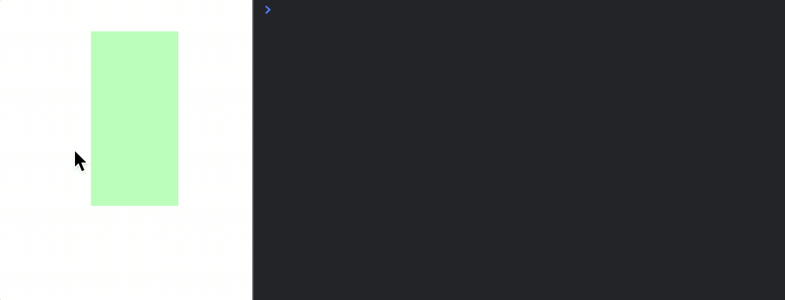

# Interactivity API Reference

## Contents

- [OBJ_ElementMoveFreely](#obj_elementmovefreely)
- [OBJ_ElementMove](#obj_elementmove)
- [OBJ_Gesture](#obj_gesture)
- [FigureElementPrimitiveGesture](#figureelementprimitivegesture)
- [OBJ_Touch](#obj_touch)
- [OBJ_CameraControl](#obj_cameracontrol)
- [OBJ_RangeBounds](#obj_rangebounds)
- [OBJ_RectBounds](#obj_rectbounds)
- [OBJ_LineBounds](#obj_linebounds)
- [TypeParsableBounds](#typeparsablebounds)

---

## OBJ_ElementMoveFreely

Figure element move freely parameters

If a figure element is released from moving with some velocity
then these parameters will define how it continues to move freely

### Properties

<ul class="tsd-parameter-list">
<li><span><span class="tsd-kind-parameter">zeroVelocityThreshold</span>: <span class="tsd-signature-type">TypeTransformValue</span></span><div class="tsd-comment tsd-typography"><p>used to overcome
limitations of floating point numbers not reaching 0</p></div></li>
<li><span><span class="tsd-kind-parameter">deceleration</span>: <span class="tsd-signature-type">TypeTransformValue</span></span><div class="tsd-comment tsd-typography"><p>amount to decelerate in local
space units per second squared</p></div></li>
<li><span><span class="tsd-kind-parameter">bounceLoss</span>: <span class="tsd-signature-type">TypeTransformValue</span></span><div class="tsd-comment tsd-typography"><p>0.5 results in 50% velocity loss
if bouncing of boundary</p></div></li>
<li><span><span class="tsd-kind-parameter">callback</span>: <span class="tsd-signature-type">?(<a href="https://developer.mozilla.org/docs/Web/JavaScript/Reference/Global_Objects/String" class="tsd-signature-type">string</a> | ((<a href="https://developer.mozilla.org/docs/Web/JavaScript/Reference/Global_Objects/Boolean" class="tsd-signature-type">boolean</a>) => void))</span></span><div class="tsd-comment tsd-typography"><p>called each frame of
free movement</p></div></li>
</ul>

---

## OBJ_ElementMove

Figure element move parameters

### Properties

<ul class="tsd-parameter-list">
<li><span><span class="tsd-kind-parameter">type</span>: <span class="tsd-signature-type">type: 'rotation' | 'translation' | 'position' | 'scale' | 'scaleX' | 'scaleY' | 'scaleZ'</span></span></li>
<li><span><span class="tsd-kind-parameter">bounds</span>: <span class="tsd-signature-type"><a href="../types/geometry_Bounds.TypeParsableBounds.html" class="tsd-signature-type">TypeParsableBounds</a></span></span><div class="tsd-comment tsd-typography"><p>rectangle to
limit movement within</p></div></li>
<li><span><span class="tsd-kind-parameter">plane</span>: <span class="tsd-signature-type"><a href="../classes/geometry_Plane.Plane.html" class="tsd-signature-type">Plane</a></span></span><div class="tsd-comment tsd-typography"><p>movement plane</p></div></li>
<li><span><span class="tsd-kind-parameter">maxVelocity</span>: <span class="tsd-signature-type">TypeTransformValue</span> <span class="tsd-signature-symbol">= 5</span></span><div class="tsd-comment tsd-typography"><p>maximum velocity allowed</p></div></li>
<li><span><span class="tsd-kind-parameter">freely</span>: <span class="tsd-signature-type">OBJ_ElementMoveFreely</span></span><div class="tsd-comment tsd-typography"><p>free movement parameters - use
false for disabling free movement after touch up</p></div></li>
<li><span><span class="tsd-kind-parameter">element</span>: <span class="tsd-signature-type"><a href="../classes/Element.FigureElement.html" class="tsd-signature-type">FigureElement</a> | null | <a href="https://developer.mozilla.org/docs/Web/JavaScript/Reference/Global_Objects/String" class="tsd-signature-type">string</a></span></span></li>
</ul>

---

## OBJ_Gesture

*Extends {@link OBJ_Generic}*


### Properties

<ul class="tsd-parameter-list">
<li><span><span class="tsd-kind-parameter">zoom</span>: <span class="tsd-signature-type"><a href="../interfaces/FigurePrimitives_FigureElementPrimitiveGesture.OBJ_ZoomOptions.html" class="tsd-signature-type">OBJ_ZoomOptions</a> | <a href="https://developer.mozilla.org/docs/Web/JavaScript/Reference/Global_Objects/Boolean" class="tsd-signature-type">boolean</a> | undefined</span> <span class="tsd-signature-symbol">= false</span></span><div class="tsd-comment tsd-typography"><p>zoom options - if not <code>false</code>
then zoom will be enabled</p></div></li>
<li><span><span class="tsd-kind-parameter">pan</span>: <span class="tsd-signature-type"><a href="../interfaces/FigurePrimitives_FigureElementPrimitiveGesture.OBJ_PanOptions.html" class="tsd-signature-type">OBJ_PanOptions</a> | <a href="https://developer.mozilla.org/docs/Web/JavaScript/Reference/Global_Objects/Boolean" class="tsd-signature-type">boolean</a> | undefined</span> <span class="tsd-signature-symbol">= false</span></span><div class="tsd-comment tsd-typography"><p>pan options - if not <code>false</code> then
pan will be enabled</p></div></li>
<li><span><span class="tsd-kind-parameter">onlyWhenTouched</span>: <span class="tsd-signature-type"><a href="https://developer.mozilla.org/docs/Web/JavaScript/Reference/Global_Objects/Boolean" class="tsd-signature-type">boolean</a> | undefined</span> <span class="tsd-signature-symbol">= true</span></span><div class="tsd-comment tsd-typography"><p>(mouse wheel zoom/pan and pinch zoom)
only notify when element gesture rectangle is being touched</p></div></li>
<li><span><span class="tsd-kind-parameter">back</span>: <span class="tsd-signature-type"><a href="https://developer.mozilla.org/docs/Web/JavaScript/Reference/Global_Objects/Boolean" class="tsd-signature-type">boolean</a> | undefined</span> <span class="tsd-signature-symbol">= true</span></span><div class="tsd-comment tsd-typography"><p>if <code>true</code> 3D shape interactivity will be
prioritized</p></div></li>
<li><span><span class="tsd-kind-parameter">width</span>: <span class="tsd-signature-type"><a href="https://developer.mozilla.org/docs/Web/JavaScript/Reference/Global_Objects/Number" class="tsd-signature-type">number</a> | undefined</span></span><div class="tsd-comment tsd-typography"><p>width of rectangle - defaults to full scene width</p></div></li>
<li><span><span class="tsd-kind-parameter">height</span>: <span class="tsd-signature-type"><a href="https://developer.mozilla.org/docs/Web/JavaScript/Reference/Global_Objects/Number" class="tsd-signature-type">number</a> | undefined</span></span><div class="tsd-comment tsd-typography"><p>height of rectangle - defaults to full scene
height</p></div></li>
<li><span><span class="tsd-kind-parameter">scene</span>: <span class="tsd-signature-type"><a href="../interfaces/geometry_scene.OBJ_Scene.html" class="tsd-signature-type">OBJ_Scene</a> | Scene | undefined</span></span><div class="tsd-comment tsd-typography"><p>define if gesture should be an
independeant scene (like if the gestures are being used to change the
default figure scene) - defaults to Figure scene</p></div></li>
<li><span><span class="tsd-kind-parameter">changeScene</span>: <span class="tsd-signature-type"><a href="../interfaces/geometry_scene.OBJ_Scene.html" class="tsd-signature-type">OBJ_Scene</a> | undefined</span></span><div class="tsd-comment tsd-typography"><p>if defined, this scene will be
automatically updated with any pan and zoom events</p></div></li>
<li><span><span class="tsd-kind-parameter">xAlign</span>: <span class="tsd-signature-type">'left' | 'center' | 'right' | <a href="https://developer.mozilla.org/docs/Web/JavaScript/Reference/Global_Objects/Number" class="tsd-signature-type">number</a> | undefined</span> <span class="tsd-signature-symbol">= 'center'</span></span><div class="tsd-comment tsd-typography"><p>x alignment of
rectangle</p></div></li>
<li><span><span class="tsd-kind-parameter">yAlign</span>: <span class="tsd-signature-type">'bottom' | 'middle' | 'top' | <a href="https://developer.mozilla.org/docs/Web/JavaScript/Reference/Global_Objects/Number" class="tsd-signature-type">number</a> | undefined</span> <span class="tsd-signature-symbol">= 'middle'</span></span><div class="tsd-comment tsd-typography"><p>y alignment of
rectangle</p></div></li>
</ul>

---

## FigureElementPrimitiveGesture

Gesture rectangle.




This primitive creates a rectangle within which pan and zoom gestures can be
captured (from mouse and touch events) and transformed into pan and zoom
values. The pan and zoom values can be used to change {@link Scene} objects
directly, or used for some custom purpose.

The pan and zoom values are relative to the gesture rectangle and the
{@link Scene} it is drawn with.

Performing a drag gesture over half the width of the rectangle, will create
a pan value that is half the width of the rectangle.

Performing a 2x zoom gesture at a point within the rectangle will create a
pan value that is the delta between the original rectangle center and the
center of the new zoomed rectangle, and a magnification value of 2.

Any combination of zoom and pan can be expressed as a pan value, that offsets
the original rectangle such that when it is then zoomed, the zoom position
will be at the same relative position of the original and zoomed rectangle.

Whenever a gesture changes the pan or zoom, then `'pan'` or `'zoom'`
notifications will be published by the primitive's {@link NotificationManger}
(`element.notifications`).

The handled gestures are:
- Mouse wheel change (often used for zooming and panning with a mouse)
- Drag (often used for panning with touch devices or a mouse)
- Pinching (often used for zooming and panning on touch devices)

### Pan

A pan is an offset in xy.

The gestures that can generate pan events are:
- Mouse click then drag
- Finger touch then drag (touch devices)
- Mouse wheel change

For the mouse click and drag, and finger touch and drag gestures, the pan
value tracks the change in position of the mouse/finger in the gesture
primitive rectangle. For example, if the rectangle has a width of 2, and the
mouse or touch moves across half the width of the rectangle, then the pan
offset will be 1.

For the mouse wheel change, a `wheelSensitivity` value is used to speed up or
slow down the pan.

When a pan event happens, a `'pan'` notification is published. The parameter
passed to any subscribers is the pan offset value, but if more information
is needed (like the pan delta from the last pan) then `getPan()` can be
called.

### Zoom

A zoom is a magnification at a point in the rectangle. The zoom point will
stay stationary, while the other points around it spread out (when zooming
in) or compress in (when zooming out). The zoom event thus includes a pan
offset to ensure the zoom point stays stationary, as well as a magnification
value.

The gestures that can generate zoom events are:
- Mouse wheel vertical change
- Finger touch pinch

A `wheelSensitivity` or `pinchSenstivity` value is used to speed up or slow down zooming.

When a zoom event happens, a `'zoom'` notification is published. The
parameters passed to any subscribers are the zoom magnification value and
pan offset, but if more information is needed (like the zoom position)
then `getZoom()` can be called.

Zoom and pan events can be used in many ways. One of the most common ways
will be to change a {@link Scene} that contains one or more
{@link FigureElement}s allowing a user to pan or zoom through the scene.

In such cases, the `zoomScene()` and `panScene()` methods can be used to do
this directly.

Alternately, a `changeScene` can be defined which will be automatically
panned and zoomed by this primitive.

In general the scene that is being used to draw the gesture primitive should
not be panned or zoomed by the gesture primitive, as this will produce
unexpected results (especially when panning). If the gesture primitive is
setup to change the same scene as it uses itself, then it will assign itself
a duplicate scene.

#### Gesture primitive pans and zooms a figure scene

```js
const figure = new Fig.Figure({ color: [1, 0, 0, 1] });

// Elements within the figure to zoom and pan
figure.add([
  { make: 'rectangle', width: 0.2, height: 0.2, position: [-0.3, 0] },
  { make: 'triangle', width: 0.2, height: 0.2, position: [0.02, -0.025] },
  { make: 'ellipse', width: 0.2, height: 0.2, position: [0.3, 0] },
])

// Gesture Primitive
figure.add({
  make: 'gesture',
  changeScene: figure.scene,
  pan: true,
  zoom: true,
});
```

#### Using zoom and pan notifications when the gestures are confied

```js
// to a green rectangle
const figure = new Fig.Figure({ color: [1, 0, 0, 1] });

const gesture = figure.add({
  make: 'gesture',
  color: [0, 1, 0, 0.3],
  width: 0.5,
  height: 1,
  pan: true,
  zoom: true,
});

gesture.notifications.add(
  'pan', offset => console.log('Pan: ', offset.x, offset.y),
);
gesture.notifications.add(
  'zoom', (mag, offset) => console.log('Zoom: ', mag, offset.x, offset.y),
);
```

---

## OBJ_Touch

Touch options for a FigureElement.

### Properties

<ul class="tsd-parameter-list">
<li><span><span class="tsd-kind-parameter">enable</span>: <span class="tsd-signature-type"><a href="https://developer.mozilla.org/docs/Web/JavaScript/Reference/Global_Objects/Boolean" class="tsd-signature-type">boolean</a> | undefined</span> <span class="tsd-signature-symbol">= true</span></span><div class="tsd-comment tsd-typography"><p><code>true</code> to enable touch</p></div></li>
<li><span><span class="tsd-kind-parameter">onClick</span>: <span class="tsd-signature-type"><a href="https://developer.mozilla.org/docs/Web/JavaScript/Reference/Global_Objects/String" class="tsd-signature-type">string</a> | ((<a href="../classes/geometry_Point.Point.html" class="tsd-signature-type">Point</a>, <a href="../classes/Element.FigureElement.html" class="tsd-signature-type">FigureElement</a>) => void) | undefined</span></span><div class="tsd-comment tsd-typography"><p>function to
execute when element is touched. If string, then a function from the
FunctionMap is used.</p></div></li>
<li><span><span class="tsd-kind-parameter">colorSeed</span>: <span class="tsd-signature-type"><a href="https://developer.mozilla.org/docs/Web/JavaScript/Reference/Global_Objects/String" class="tsd-signature-type">string</a> | undefined</span> <span class="tsd-signature-symbol">= 'default'</span></span><div class="tsd-comment tsd-typography"><p>use a unique string to reset color generation
of unique colors used for touch determination (debug only)</p></div></li>
</ul>

---

## OBJ_CameraControl

Camera control definition object that extends
and {@link OBJ_FigurePrimitive}

A camera control is a transparent rectangle that uses touch and drag
gestures to rotate the position of the camera in a 3D scene around a vertical
axis.

The vertical axis will always remain vertical. Left/right movements will
rotate the scene around the vertical axis (in the azimuth of the vertical
axis), while up/down movements will change the elevation relative to the
vertical axis.

The transparent rectangle will be positioned relative to the 2D HTML canvas
the figure is drawn in on the screen. The `left`, `bottom`, `width` and
`height` properties are numbers from 0 to 1 which represent percentage of
the screen width and height.

Thus for the rectangle to cover the entire screen, values of `left: 0`,
`bottom: 0`, `width: 1` and `height: 1` would be used (these are the default
values as well).

By default, the figure's {@link Scene} camera position is modified. If an
element's custom scene is to be controlled, use the `scene` property to link
to it.

How fast the camera is rotated in the aziumuth and elevation is controlled by
the `sensitivity`, `xSensitivity` and `ySensitivity` properties.
A higher sensitivity value will result in more rotation for the same user
movement. If only azimuthal or elevation rotation is desired set
`ySensitivity` or `xSensitivity` to 0 respectively.

### Properties

<ul class="tsd-parameter-list">
<li><span><span class="tsd-kind-parameter">left</span>: <span class="tsd-signature-type"><a href="https://developer.mozilla.org/docs/Web/JavaScript/Reference/Global_Objects/Number" class="tsd-signature-type">number</a> | undefined</span></span><div class="tsd-comment tsd-typography"><p>screen left position to place the control
rectangle. 0 is the left edge, while 1 is the right edge (<code>0</code>).</p></div></li>
<li><span><span class="tsd-kind-parameter">bottom</span>: <span class="tsd-signature-type"><a href="https://developer.mozilla.org/docs/Web/JavaScript/Reference/Global_Objects/Number" class="tsd-signature-type">number</a> | undefined</span></span><div class="tsd-comment tsd-typography"><p>screen bottom position to place the control
rectangle. 0 is the bottom edge, while 1 is the top edge (<code>0</code>).</p></div></li>
<li><span><span class="tsd-kind-parameter">width</span>: <span class="tsd-signature-type"><a href="https://developer.mozilla.org/docs/Web/JavaScript/Reference/Global_Objects/Number" class="tsd-signature-type">number</a> | undefined</span></span><div class="tsd-comment tsd-typography"><p>width of control rectangle. 1 is the full
width of the drawing canvas (<code>1</code>).</p></div></li>
<li><span><span class="tsd-kind-parameter">height</span>: <span class="tsd-signature-type"><a href="https://developer.mozilla.org/docs/Web/JavaScript/Reference/Global_Objects/Number" class="tsd-signature-type">number</a> | undefined</span></span><div class="tsd-comment tsd-typography"><p>height of control rectangle. 1 is the full
height of the drawing canvas (<code>1</code>).</p></div></li>
<li><span><span class="tsd-kind-parameter">axis</span>: <span class="tsd-signature-type"><a href="../types/geometry_Point.TypeParsablePoint.html" class="tsd-signature-type">TypeParsablePoint</a> | undefined</span> <span class="tsd-signature-symbol">= [0, 1, 0]</span></span><div class="tsd-comment tsd-typography"><p>Axis to keep vertical as camera is
rotated. The axis vector and scene.camera.up vector should be in the same
plane</p></div></li>
<li><span><span class="tsd-kind-parameter">controlScene</span>: <span class="tsd-signature-type">Scene | <a href="https://developer.mozilla.org/docs/Web/JavaScript/Reference/Global_Objects/String" class="tsd-signature-type">string</a> | undefined</span></span><div class="tsd-comment tsd-typography"><p>Use this to control a scene that is not
the default Figure scene.</p></div></li>
<li><span><span class="tsd-kind-parameter">sensitivity</span>: <span class="tsd-signature-type"><a href="https://developer.mozilla.org/docs/Web/JavaScript/Reference/Global_Objects/Number" class="tsd-signature-type">number</a> | undefined</span> <span class="tsd-signature-symbol">= 5</span></span><div class="tsd-comment tsd-typography"><p>sensitivity of camera position relative to
user movement where larger numbers result in more rotation for the same
movement</p></div></li>
<li><span><span class="tsd-kind-parameter">xSensitivity</span>: <span class="tsd-signature-type"><a href="https://developer.mozilla.org/docs/Web/JavaScript/Reference/Global_Objects/Number" class="tsd-signature-type">number</a> | undefined</span> <span class="tsd-signature-symbol">= 1</span></span><div class="tsd-comment tsd-typography"><p>sensitivity to a horizontal user movement.
Setting this to 0 will mean the scene doesn't not rotate aziumthally</p></div></li>
<li><span><span class="tsd-kind-parameter">ySensitivity</span>: <span class="tsd-signature-type"><a href="https://developer.mozilla.org/docs/Web/JavaScript/Reference/Global_Objects/Number" class="tsd-signature-type">number</a> | undefined</span> <span class="tsd-signature-symbol">= 1</span></span><div class="tsd-comment tsd-typography"><p>sensitivity to a vertical user movement.
Setting this to 0 will mean the elevation does not change</p></div></li>
<li><span><span class="tsd-kind-parameter">back</span>: <span class="tsd-signature-type"><a href="https://developer.mozilla.org/docs/Web/JavaScript/Reference/Global_Objects/Boolean" class="tsd-signature-type">boolean</a> | undefined</span> <span class="tsd-signature-symbol">= true</span></span><div class="tsd-comment tsd-typography"><p>if <code>true</code> then all 2D and 3D objects that can be
touched will be touched before the camera control, regardless of where it is
on the drawing stack. This should be used everytime 3D objects need priority
over the camera control</p></div></li>
</ul>

#### Add a camera control that will cover the whole screen

```js
figure.add([
  {
    make: 'cylinder',
    radius: 0.01,
    color: [1, 0, 0, 1],
    line: [[-1, 0, 0], [1, 0, 0]],
  },
  {
    make: 'cylinder',
    radius: 0.01,
    color: [0, 1, 0, 1],
    line: [[0, -1, 0], [0, 1, 0]],
  },
  {
    make: 'cylinder',
    radius: 0.01,
    color: [0, 0, 1, 1],
    line: [[0, 0, -1], [0, 0, 1]],
  },
  {
    make: 'grid',
    bounds: [-0.8, -0.8, 1.6, 1.6],
    xStep: 0.05,
    yStep: 0.05,
    line: { width: 0.002 },
    color: [0.7, 0.7, 0.7, 1],
    transform: ['r', Math.PI / 2, 1, 0, 0],
  },
]);

// Add camera control
figure.add({
  make: 'cameraControl',
});
```

#### Add a thin bar at the bottom of the figure that rotates the scene in the

```js
// azimuth only

figure.add([
  {
    make: 'cylinder',
    radius: 0.01,
    color: [1, 0, 0, 1],
    line: [[-1, 0, 0], [1, 0, 0]],
  },
  {
    make: 'cylinder',
    radius: 0.01,
    color: [0, 1, 0, 1],
    line: [[0, -1, 0], [0, 1, 0]],
  },
  {
    make: 'cylinder',
    radius: 0.01,
    color: [0, 0, 1, 1],
    line: [[0, 0, -1], [0, 0, 1]],
  },
  {
    make: 'grid',
    bounds: [-0.8, -0.8, 1.6, 1.6],
    xStep: 0.05,
    yStep: 0.05,
    line: { width: 0.002 },
    color: [0.7, 0.7, 0.7, 1],
    transform: ['r', Math.PI / 2, 1, 0, 0],
  },
]);

// Add a moveable cube
figure.add({
  make: 'cube',
  side: 0.3,
  color: [1, 0, 0, 1],
  center: [0.3, 0, 0],
  move: {
    plane: [[0, 0, 0], [0, 1, 0]],
  },
});

// Add camera control bar at the bottom of the screen that only allows
// rotation in the azimuth. As the camera control bar does not overlap the
// cube, then both the cube can moved, and the scene rotated with the bar.
figure.add({
  make: 'cameraControl',
  color: [0, 0, 0, 0.2],
  ySensitivity: 0,
  height: 0.1,
});
```

---

## OBJ_RangeBounds

Range bounds object definition.

A range bounds defines a minimum and maximum value.

### Properties

<ul class="tsd-parameter-list">
<li><span><span class="tsd-kind-parameter">min</span>: <span class="tsd-signature-type"><a href="https://developer.mozilla.org/docs/Web/JavaScript/Reference/Global_Objects/Number" class="tsd-signature-type">number</a> | null | undefined</span> <span class="tsd-signature-symbol">= null</span></span><div class="tsd-comment tsd-typography"><p>minimum value boundary, null for unbounded</p></div></li>
<li><span><span class="tsd-kind-parameter">max</span>: <span class="tsd-signature-type"><a href="https://developer.mozilla.org/docs/Web/JavaScript/Reference/Global_Objects/Number" class="tsd-signature-type">number</a> | null | undefined</span> <span class="tsd-signature-symbol">= null</span></span><div class="tsd-comment tsd-typography"><p>maximum value boundary, null for unbounded</p></div></li>
<li><span><span class="tsd-kind-parameter">precision</span>: <span class="tsd-signature-type"><a href="https://developer.mozilla.org/docs/Web/JavaScript/Reference/Global_Objects/Number" class="tsd-signature-type">number</a> | undefined</span> <span class="tsd-signature-symbol">= 8</span></span><div class="tsd-comment tsd-typography"><p>precision with which to calculate boundary
<code>intersect</code> and <code>contains</code></p></div></li>
</ul>

---

## OBJ_RectBounds

A RectBounds is a rectangle bounds around a point in a plane.

It is defined by:
- a position in plane around which rectangle is formed
- topDirection/rightDirection vectors that orient the rectangle
- left/right magnitudes that define the width of the rectangle
- bottom/top magnitudes that define the height of the rectangle

```
----------------------------------------------     A
|                                            |     |
|        Top Vector                          |     |
|             A                              |     | top
|             |                              |     |
|             |                              |     |
|    position *----->                        |   ---
|                   Right Vector             |     |
|                                            |     | bottom
|                                            |     |
----------------------------------------------     V
.             |
.             |
<-------------|----------------------------->
    left                right
```
A rectangle can be defined in one of several ways:
- position, plane normal, one direction vecvtor (top or right)
- position, top and right direction vectors

By default the rectangle will be in the XY plane (+z normal) with a
rightDirection vector along the +x axis.

### Properties

<ul class="tsd-parameter-list">
<li><span><span class="tsd-kind-parameter">position</span>: <span class="tsd-signature-type"><a href="../types/geometry_Point.TypeParsablePoint.html" class="tsd-signature-type">TypeParsablePoint</a> | undefined</span></span></li>
<li><span><span class="tsd-kind-parameter">normal</span>: <span class="tsd-signature-type"><a href="../types/geometry_Point.TypeParsablePoint.html" class="tsd-signature-type">TypeParsablePoint</a> | undefined</span></span></li>
<li><span><span class="tsd-kind-parameter">rightDirection</span>: <span class="tsd-signature-type"><a href="../types/geometry_Point.TypeParsablePoint.html" class="tsd-signature-type">TypeParsablePoint</a> | undefined</span></span></li>
<li><span><span class="tsd-kind-parameter">topDirection</span>: <span class="tsd-signature-type"><a href="../types/geometry_Point.TypeParsablePoint.html" class="tsd-signature-type">TypeParsablePoint</a> | undefined</span></span></li>
<li><span><span class="tsd-kind-parameter">left</span>: <span class="tsd-signature-type"><a href="https://developer.mozilla.org/docs/Web/JavaScript/Reference/Global_Objects/Number" class="tsd-signature-type">number</a> | undefined</span></span></li>
<li><span><span class="tsd-kind-parameter">right</span>: <span class="tsd-signature-type"><a href="https://developer.mozilla.org/docs/Web/JavaScript/Reference/Global_Objects/Number" class="tsd-signature-type">number</a> | undefined</span></span></li>
<li><span><span class="tsd-kind-parameter">top</span>: <span class="tsd-signature-type"><a href="https://developer.mozilla.org/docs/Web/JavaScript/Reference/Global_Objects/Number" class="tsd-signature-type">number</a> | undefined</span></span></li>
<li><span><span class="tsd-kind-parameter">bottom</span>: <span class="tsd-signature-type"><a href="https://developer.mozilla.org/docs/Web/JavaScript/Reference/Global_Objects/Number" class="tsd-signature-type">number</a> | undefined</span></span></li>
<li><span><span class="tsd-kind-parameter">precision</span>: <span class="tsd-signature-type"><a href="https://developer.mozilla.org/docs/Web/JavaScript/Reference/Global_Objects/Number" class="tsd-signature-type">number</a> | undefined</span> <span class="tsd-signature-symbol">= 8</span></span><div class="tsd-comment tsd-typography"><p>precision with which to calculate boundary
<code>intersect</code> and <code>contains</code></p></div></li>
</ul>

---

## OBJ_LineBounds

A line bounds defines a line boundary.

### Properties

<ul class="tsd-parameter-list">
<li><span><span class="tsd-kind-parameter">line</span>: <span class="tsd-signature-type"><a href="../types/geometry_Line.TypeParsableLine.html" class="tsd-signature-type">TypeParsableLine</a> | undefined</span></span></li>
<li><span><span class="tsd-kind-parameter">precision</span>: <span class="tsd-signature-type"><a href="https://developer.mozilla.org/docs/Web/JavaScript/Reference/Global_Objects/Number" class="tsd-signature-type">number</a> | undefined</span> <span class="tsd-signature-symbol">= 8</span></span><div class="tsd-comment tsd-typography"><p>precision with which to calculate boundary
<code>intersect</code> and <code>contains</code></p></div></li>
</ul>

---

## TypeParsableBounds

Parsable bounds definition.

`null | `{@link Bounds}
  | {@link RectBounds}` | `{@link LineBounds}` | `{@link RangeBounds}
 ` | `{@link OBJ_RectBounds}` | `{@link OBJ_LineBounds}` | `{@link OBJ_RangeBounds}
 ` | `{@link TypeF1DefRangeBounds}` | `{@link TypeF1DefRectBounds}` | `{@link TypeF1DefLineBounds}

---

