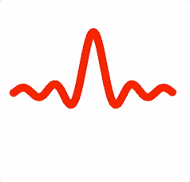
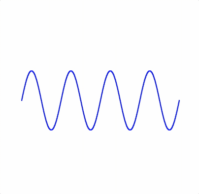
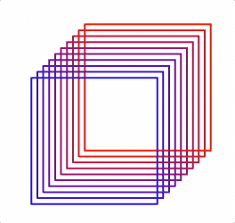
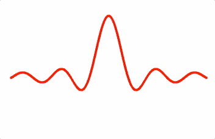
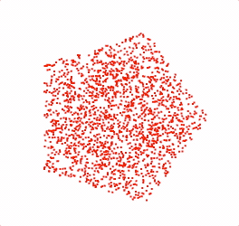

# Morphing API Reference

## Contents

- [FigureElementPrimitiveMorph](#figureelementprimitivemorph)
- [OBJ_Morph](#obj_morph)
- [OBJ_ImageToShapes](#obj_imagetoshapes)
- [imageToShapes](#imagetoshapes)
- [OBJ_PolylineToShapes](#obj_polylinetoshapes)
- [polylineToShapes](#polylinetoshapes)
- [OBJ_PointsToShapes](#obj_pointstoshapes)
- [pointsToShapes](#pointstoshapes)
- [OBJ_PolygonCloudShapes](#obj_polygoncloudshapes)
- [polygonCloudShapes](#polygoncloudshapes)
- [OBJ_CircleCloudShapes](#obj_circlecloudshapes)
- [circleCloudShapes](#circlecloudshapes)
- [OBJ_RectangleCloudShapes](#obj_rectanglecloudshapes)
- [rectangleCloudShapes](#rectanglecloudshapes)

---

## FigureElementPrimitiveMorph

{@link FigureElementPrimitive} that can efficiently translate large numbers
of points.





The morph primitive is optimized to animate hundreds of thousands of
points with minimal performance impact.

Multiple arrays of points can be defined, and the translation of
corresponding points in two arrays can be animated.

Being able to accomodate so many points means this primitive can be used to
efficiently morph shapes.

All points in all point arrays can be assigned an individual color if
desired. Use `color: TypeColor` to assign all points in all arrays the same
color, `color: Array<TypeColor>` to assign all points in each array a
specific color, `color: Array<Array<TypeColor>>` to assign each point in
each array a specific color, and
`color: Array<TypeColor | Array<TypeColor>` to assign some point arrays
with one color, and others with a specific color per point.

A point array is an array of numbers representing consecutive x, y points.
For example, [x1, y1, x2, y2, ...].

A color array is an array of numbers representing the color of each points.
For example, [r1, g1, b1, a1, r2, g2, b2, a2, ...].

If `color` is an array of colors and/or color arrays, then the its length
must be equal to the number of point Arrays. The colors in the array will
be matched up with the corresponding point arrays in `points`.

This element's specialty is creating a visual effect, and so does not
automatically calculate touch borders, and doesn't allow for color changes
(with the `setColor`, `dim`, and `undim` methods). If touch borders are
desired then either setup touch borders manually, or use a different
element as a touch pad.

This element comes with two specialized methods and an animation step:
 - `setPoints` - sets points to a specific point array
 - `setPointsBetween` - sets points to a position between two point arrays
 - `animations.morph` - morph between `start` and `target`

Note, while animation is efficient, loading or generating hundreds of
thousands of points when first instantiated can be slow on lower
end systems, and may need to be accounted for (like letting the user know
that loading is ongoing).

#### Example 1

```js
const { polylineToShapes, getPolygonCorners } = Fig.morph;
const { range } = Fig;

// Number of shapes that make up the lines
const n = 300;

// Generate a line of points along a sinc function
const sinc = (xIn, a, b) => {
  const x = xIn === 0 ? 0.00001 : xIn;
  return a * Math.sin(b * x) / (b * x);
};

// Generate line of shapes along a sinc function
const xValues = range(-0.8, 0.8, 0.01);
const [sincPoints] = polylineToShapes({
  points: xValues.map(x => [x, sinc(x, 0.6, 20)]),
  num: n,
  size: 0.04,
  shape: 15,
});

// Generate a line of shapes along a square
const [squarePoints] = polylineToShapes({
  points: [[0.5, 0.5], [-0.5, 0.5], [-0.5, -0.5], [0.5, -0.5]],
  num: n,
  size: 0.04,
  close: true,
  shape: 15,
});

// Generate a line of shapes along a circle
const [circlePoints] = polylineToShapes({
  points: getPolygonCorners({ radius: 0.5, sides: 50, rotation: Math.PI / 4 }),
  num: n,
  size: 0.04,
  close: true,
  shape: 15,
});

const morpher = figure.add({
  make: 'morph',
  names: ['sinc', 'square', 'circle'],
  points: [sincPoints, squarePoints, circlePoints],
  color: [1, 0, 0, 1],
});

// Animate morph
morpher.animations.new()
  .delay(1)
  .morph({ start: 'sinc', target: 'square', duration: 2 })
  .morph({ start: 'square', target: 'circle', duration: 2 })
  .morph({ start: 'circle', target: 'sinc', duration: 2 })
  .start();
```

#### Example 2

```js
const { imageToShapes, circleCloudShapes, polylineToShapes } = Fig.morph;
const { range } = Fig;

const image = new Image();
image.src = './logocolored.png';
image.onload = () => {
  const [logo, logoColors] = imageToShapes({
    image,
    width: 2,
    height: 2,
    dither: 0.003,
  });

  const n = logo.length / 2 / 6;
  const cloud = circleCloudShapes({
    radius: 3,
    num: n,
    size: 0.005,
  });

  const xValues = range(-0.8, 0.8, 0.001);
  const [sine] = polylineToShapes({
    points: xValues.map(x => [x, 0.3 * Math.sin(x * 2 * Math.PI / 0.4)]),
    num: n,
    size: 0.01,
  });

  const m = figure.add({
    make: 'morph',
    points: [cloud, logo, sine],
    names: ['cloud', 'logo', 'sine'],
    color: [logoColors, logoColors, [0, 0, 1, 1]],
  });

  m.setPoints('sine');
  m.animations.new()
    .delay(1)
    .morph({ start: 'sine', target: 'cloud', duration: 2 })
    .morph({ start: 'cloud', target: 'logo', duration: 2 })
    .start();
};
```

---

## OBJ_Morph

{@link morph} options object.

### Properties

<div class="fo-prop"><span class="fo-prop-name">name</span> <span class="fo-prop-type">(<a href="https://developer.mozilla.org/docs/Web/JavaScript/Reference/Global_Objects/String">string</a>)</span><span class="fo-prop-desc">: primitive name</span></div>
<div class="fo-prop"><span class="fo-prop-name">pointArrays</span> <span class="fo-prop-type">(<a href="https://developer.mozilla.org/docs/Web/JavaScript/Reference/Global_Objects/Array">Array</a><<a href="https://developer.mozilla.org/docs/Web/JavaScript/Reference/Global_Objects/Array">Array</a><<a href="https://developer.mozilla.org/docs/Web/JavaScript/Reference/Global_Objects/Number">number</a>>>)</span><span class="fo-prop-desc">: point arrays to morph between.
Each point array is an array of consecutive x, y values of points. For
example: [x1, y1, x2, y2, x3, y3, ...].</span></div>
<div class="fo-prop"><span class="fo-prop-name">color</span> <span class="fo-prop-type">(<a href="../types/types.TypeColor.html">TypeColor</a> | <a href="https://developer.mozilla.org/docs/Web/JavaScript/Reference/Global_Objects/Array">Array</a><<a href="../types/types.TypeColor.html">TypeColor</a> | <a href="https://developer.mozilla.org/docs/Web/JavaScript/Reference/Global_Objects/Array">Array</a><<a href="../types/types.TypeColor.html">TypeColor</a>>>)</span><span class="fo-prop-desc">: colors to
be assigned to the points</span></div>
<div class="fo-prop"><span class="fo-prop-name">names</span> <span class="fo-prop-type">(<a href="https://developer.mozilla.org/docs/Web/JavaScript/Reference/Global_Objects/Array">Array</a><String>)</span><span class="fo-prop-desc">: optional names for each point array. Names
can be used when using the morph animation step instead of point array
indeces.</span></div>
<div class="fo-prop"><span class="fo-prop-name">glPrimitive</span> <span class="fo-prop-type">('TRIANGLES' | 'POINTS' | 'FAN' | 'STRIP' | 'LINES'?)</span><span class="fo-prop-desc">: glPrimitive is the same for all point arrays (<code>'TRIANGLES'</code>)</span></div>

---

## OBJ_ImageToShapes


### Properties

<div class="fo-prop"><span class="fo-prop-name">image</span> <span class="fo-prop-type">(Image?)</span></div>
<div class="fo-prop"><span class="fo-prop-name">num</span> <span class="fo-prop-type">(<a href="https://developer.mozilla.org/docs/Web/JavaScript/Reference/Global_Objects/Number">number</a> | null?)</span><span class="fo-prop-desc">: maximum number of shapes to return -
<code>null</code> defaults to the number of pixels (or filtered pixels if a filter is
used) (<code>null</code>)</span></div>
<div class="fo-prop"><span class="fo-prop-name">excess</span> <span class="fo-prop-type">('repeatOpaqueOnly' | 'lastOpaque' | 'repeat'?)</span><span class="fo-prop-desc">: if
num is greater than the number of pixels, then either <code>'repeat'</code> the
shapes from all the pixels again, repeat the shapes from only the opaque
pixels <code>'repeatOpaqueOnly'</code> or put all execess shapes on the <code>'lastOpaque'</code>
pixel. Note, repeating pixels that are semitransparent will effectively put
multiple pixels on top of each other, reducing the transparency of the pixel
(<code>'repeatOpaqueOnly'</code>).</span></div>
<div class="fo-prop"><span class="fo-prop-name">filter</span> <span class="fo-prop-type">(function(<a href="../types/types.TypeColor.html">TypeColor</a>, [<a href="https://developer.mozilla.org/docs/Web/JavaScript/Reference/Global_Objects/Number">number</a>, <a href="https://developer.mozilla.org/docs/Web/JavaScript/Reference/Global_Objects/Number">number</a>]) => <a href="https://developer.mozilla.org/docs/Web/JavaScript/Reference/Global_Objects/Boolean">boolean</a>?)</span><span class="fo-prop-desc">: filter function with pixel color and pixel position input parameters. Return
<code>true</code> to keep pixel. Pixel position is (0, 0) in top left corner and
(pixelsWidth, pixelsHeight) in the bottom right (<code>() =&gt; true</code>)</span></div>
<div class="fo-prop"><span class="fo-prop-name">distribution</span> <span class="fo-prop-type">('raster' | 'random'?)</span><span class="fo-prop-desc">: Returned shapes are randomly
distributed throughout shape (<code>'random'</code>) or rasterized in order from top
left to bottom right of image (or filtered image) (<code>random</code>)</span></div>
<div class="fo-prop"><span class="fo-prop-name">width</span> <span class="fo-prop-type">(<a href="https://developer.mozilla.org/docs/Web/JavaScript/Reference/Global_Objects/Number">number</a> | null?)</span><span class="fo-prop-desc">: width to map image pixels to. Width is
between center of most left to most right pixels</span></div>
<div class="fo-prop"><span class="fo-prop-name">height</span> <span class="fo-prop-type">(<a href="https://developer.mozilla.org/docs/Web/JavaScript/Reference/Global_Objects/Number">number</a> | null?)</span><span class="fo-prop-desc">: height to map image pixels to. Height is
between center of most bottom to most top pixels</span></div>
<div class="fo-prop"><span class="fo-prop-name">size</span> <span class="fo-prop-type">(<a href="https://developer.mozilla.org/docs/Web/JavaScript/Reference/Global_Objects/Number">number</a>?)</span><span class="fo-prop-desc">: shape size to map pixel to. Final points will
have a width of <code>width + size</code> center of points are used to determine
<code>width</code> and <code>height</code>. Default shape is a square, and default size
(if left undefined) is the size needed to make adjacent square shapes
touch</span></div>
<div class="fo-prop"><span class="fo-prop-name">position</span> <span class="fo-prop-type">(<a href="../types/geometry_Point.TypeParsablePoint.html">TypeParsablePoint</a>?)</span><span class="fo-prop-desc">: position to place shapes at</span></div>
<div class="fo-prop"><span class="fo-prop-name">xAlign</span> <span class="fo-prop-type">(<a href="../types/Equation_EquationForm.TypeHAlign.html">TypeHAlign</a>?)</span><span class="fo-prop-desc">: align shapes horizontally around <code>position</code></span></div>
<div class="fo-prop"><span class="fo-prop-name">yAlign</span> <span class="fo-prop-type">(<a href="../types/Equation_EquationForm.TypeVAlign.html">TypeVAlign</a>?)</span><span class="fo-prop-desc">: align shapes vertically around <code>position</code></span></div>
<div class="fo-prop"><span class="fo-prop-name">align</span> <span class="fo-prop-type">('image' | 'filteredImage'?)</span><span class="fo-prop-desc">: <code>image</code> will align the shapes
as if there were no pixels filtered out. <code>filteredImage</code> will align to only
the shapes that exist.</span></div>
<div class="fo-prop"><span class="fo-prop-name">dither</span> <span class="fo-prop-type">(<a href="https://developer.mozilla.org/docs/Web/JavaScript/Reference/Global_Objects/Number">number</a>?)</span><span class="fo-prop-desc">: Add a random offset to each shape to create a
dither effect</span></div>
<div class="fo-prop"><span class="fo-prop-name">shape</span> <span class="fo-prop-type">(function(<a href="../classes/geometry_Point.Point.html">Point</a>, <a href="https://developer.mozilla.org/docs/Web/JavaScript/Reference/Global_Objects/Number">number</a>): <a href="https://developer.mozilla.org/docs/Web/JavaScript/Reference/Global_Objects/Array">Array</a><<a href="https://developer.mozilla.org/docs/Web/JavaScript/Reference/Global_Objects/Number">number</a>> | <a href="https://developer.mozilla.org/docs/Web/JavaScript/Reference/Global_Objects/Number">number</a>?)</span><span class="fo-prop-desc">: By default a square of two triangles is created (six vertices). Use a
<code>number</code> to create a regular polygon with <code>number</code> sides. Use a custom
function to make a custom shape. The function takes as input the [x, y]
position of the point to build the shape around, and <code>size</code>. It outputs an
array of interlaced x and y coordinates of triangle vertices - i.e.:
[x1, y1, x2, y2, x3, y3, ....]</span></div>
<div class="fo-prop"><span class="fo-prop-name">makeColors</span> <span class="fo-prop-type">(function(<a href="../types/types.TypeColor.html">TypeColor</a>, <a href="https://developer.mozilla.org/docs/Web/JavaScript/Reference/Global_Objects/Number">number</a>): <a href="https://developer.mozilla.org/docs/Web/JavaScript/Reference/Global_Objects/Array">Array</a><<a href="https://developer.mozilla.org/docs/Web/JavaScript/Reference/Global_Objects/Number">number</a>>?)</span><span class="fo-prop-desc">: use this function to customze color mapping. The function takes as input the
pixel's color, and the number of vertices that need to be colored. It
outputs an array of colors for each vertex - i.e.:
[r1, b1, g1, a1, r2, g2, b, a2, ...]</span></div>

---

## imageToShapes

`imageToShapes` maps the pixels of an image to shapes that will be
used to draw those pixels.


All pixels in an image can be made shapes, or a `filter` function can be used
to only use desired pixels.

The shapes can be rasterized in order (raster from top left to bottom
right) or be in a random order.

The image pixel centers are mapped to some `width` and `height` and aligned
to a position relative to either all pixels in the original image, or just
the filtered pixels. The shapes are centered on the pixel centers.

This method is useful for including images in morphing effects. It should
not be used to simply show an image (use a texture with some
FigureElementPrimitive for this).

@param {OBJ_ImageToShapes} options
@return {[Array<number>, Array<number>]} [vertices, colors]

#### Example 1

```js
const { imageToShapes, rectangleCloudShapes } = Fig.morph;

const image = new Image();
image.src = './logo.png';
image.onload = () => {
  const [logo, logoColors] = imageToShapes({
    image,
    width: 0.7,
    height: 0.7,
    filter: c => c[3] > 0,
  });

  const cloud = rectangleCloudShapes({
    width: 2,
    height: 2,
    num: logo.length / 2 / 6,
  });

  const m = figure.add({
    make: 'morph',
    points: [cloud, logo],
    color: [logoColors, logoColors],
  });

  m.animations.new()
    .delay(1)
    .morph({ start: 0, target: 1, duration: 2 })
    .start();
};
```

#### Example 2

```js
const { imageToShapes } = Fig.morph;

const micImage = new Image();
micImage.src = './mic.png';
const headphonesImage = new Image();
headphonesImage.src = './headphones.png';

let index = 0;
const loaded = () => {
  index += 1;
  if (index < 2) {
    return;
  }

  const [mic, micColors] = imageToShapes({
    image: micImage,
    width: 0.7,
    filter: c => c[3] > 0,
  });

  const [headphones, headphoneColors] = imageToShapes({
    image: headphonesImage,
    width: 0.7,
    filter: c => c[3] > 0,
    num: mic.length / 6 / 2,
  });

  const m = figure.add({
    make: 'morph',
    points: [mic, headphones],
    color: [micColors, headphoneColors],
  });

  m.animations.new()
    .delay(1)
    .morph({ start: 0, target: 1, duration: 2 })
    .start();
};

micImage.onload = loaded.bind(this);
headphonesImage.onload = loaded.bind(this);
```

---

## OBJ_PolylineToShapes

Options obect for {@link polylineToShapes} that evenly distributes shapes
along a line

### Properties

<div class="fo-prop"><span class="fo-prop-name">points</span> <span class="fo-prop-type">(<a href="https://developer.mozilla.org/docs/Web/JavaScript/Reference/Global_Objects/Array">Array</a><<a href="../types/geometry_Point.TypeParsablePoint.html">TypeParsablePoint</a>>)</span><span class="fo-prop-desc">: array of points representing a
polyline where each point is a corner in the line</span></div>
<div class="fo-prop"><span class="fo-prop-name">num</span> <span class="fo-prop-type">(<a href="https://developer.mozilla.org/docs/Web/JavaScript/Reference/Global_Objects/Number">number</a>)</span><span class="fo-prop-desc">: number of shapes to distribute along line</span></div>
<div class="fo-prop"><span class="fo-prop-name">close</span> <span class="fo-prop-type">(<a href="https://developer.mozilla.org/docs/Web/JavaScript/Reference/Global_Objects/Boolean">boolean</a>)</span><span class="fo-prop-desc">: <code>true</code> closes the polyline</span></div>
<div class="fo-prop"><span class="fo-prop-name">size</span> <span class="fo-prop-type">(<a href="https://developer.mozilla.org/docs/Web/JavaScript/Reference/Global_Objects/Number">number</a>)</span><span class="fo-prop-desc">: size of shape</span></div>
<div class="fo-prop"><span class="fo-prop-name">shape</span> <span class="fo-prop-type">(function(<a href="../classes/geometry_Point.Point.html">Point</a>, <a href="https://developer.mozilla.org/docs/Web/JavaScript/Reference/Global_Objects/Number">number</a>): <a href="https://developer.mozilla.org/docs/Web/JavaScript/Reference/Global_Objects/Array">Array</a><<a href="https://developer.mozilla.org/docs/Web/JavaScript/Reference/Global_Objects/Number">number</a>> | <a href="https://developer.mozilla.org/docs/Web/JavaScript/Reference/Global_Objects/Number">number</a>?)</span><span class="fo-prop-desc">: By default a square of two triangles is created (six vertices). Use a
<code>number</code> to create a regular polygon with <code>number</code> sides. Use a custom
function to make a custom shape. The function takes as input the [x, y]
position of the point to build the shape around, and <code>size</code>. It outputs an
array of interlaced x and y coordinates of triangle vertices - i.e.:
[x1, y1, x2, y2, x3, y3, ....]</span></div>
<div class="fo-prop"><span class="fo-prop-name">makeColors</span> <span class="fo-prop-type">(function(<a href="https://developer.mozilla.org/docs/Web/JavaScript/Reference/Global_Objects/Number">number</a>, <a href="../classes/geometry_Point.Point.html">Point</a>, <a href="https://developer.mozilla.org/docs/Web/JavaScript/Reference/Global_Objects/Number">number</a>, <a href="https://developer.mozilla.org/docs/Web/JavaScript/Reference/Global_Objects/Number">number</a>, <a href="https://developer.mozilla.org/docs/Web/JavaScript/Reference/Global_Objects/Number">number</a>): <a href="https://developer.mozilla.org/docs/Web/JavaScript/Reference/Global_Objects/Array">Array</a><<a href="https://developer.mozilla.org/docs/Web/JavaScript/Reference/Global_Objects/Number">number</a>>)</span><span class="fo-prop-desc">: function that creates colors for each vertex of the shape.
Function input parameters are the number of shape vertices to be colored,
the center point coordinate, the previous polyline point index, the
cumulative length from the start of the polyline, and the percentLength from
the start of the polyline. The function must return a single array
containing all vertex colors.</span></div>

---

## polylineToShapes

`polylineToShapes` distributes a number of shapes equally along a polyline.




The polyline is defined by an array of points, where each point is a corner
in the polyline

The start and ends of the polyline each have a centered shape

The polyline can be closed or open.

This method is useful for morphing between shapes.

@param {OBJ_PolylineToShapes} options
@return {[Array<number>, Array<number>]} [vertices, colors]

#### Example 1

```js
const { polylineToShapes, getPolygonCorners } = Fig.morph;

const [square] = polylineToShapes({
  points: [[0.5, 0], [0, 0.5], [-0.5, 0], [0, -0.5]],
  num: 50,
  size: 0.03,
  close: true,
});


const [circle] = polylineToShapes({
  points: getPolygonCorners({ radius: 0.5, sides: 30 }),
  num: 50,
  size: 0.03,
  close: true,
});

const m = figure.add({
  make: 'morph',
  points: [square, circle],
  color: [1, 0, 0, 1],
});

m.animations.new()
  .morph({ start:0, target: 1, duration: 2 })
  .start();
```

#### Example 2

```js
const { polylineToShapes, getPolygonCorners } = Fig.morph;

const [square] = polylineToShapes({
  points: [[-0.5, 0], [0.5, 0]],
  num: 500,
  size: 0.02,
  shape: 'hex',
});

const [circle] = polylineToShapes({
  points: getPolygonCorners({ radius: 0.5, sides: 6, rotation: Math.PI / 2 }),
  num: 500,
  size: 0.02,
  close: true,
  shape: 'hex',
});

const m = figure.add({
  make: 'morph',
  points: [square, circle],
  color: [1, 0, 0, 1],
});

m.animations.new()
  .morph({ start:0, target: 1, duration: 2 })
  .start();
```

#### Example 3

```js
const { polylineToShapes, getPolygonCorners } = Fig.morph;

const [square] = polylineToShapes({
  points: getPolygonCorners({ radius: 0.5, sides: 4, rotation: Math.PI / 4 }),
  num: 500,
  close: true,
});

const [circle] = polylineToShapes({
  points: getPolygonCorners({ radius: 0.25, sides: 100, rotation: Math.PI / 4 }),
  num: 500,
  close: true,
});

for (let i = 0; i < 10; i += 1) {
  const m = figure.add({
    make: 'morph',
    points: [square, circle],
    position: [0.2 - i / 30, 0.2 - i / 30],
    color: [1 - i / 10, 0, i / 10, 1],
  });

  m.animations.new()
    .delay(2 - i / 10)
    .morph({ start: 0, target: 1, duration: 2 })
    .delay(2)
    .morph({ start: 1, target: 0, duration: 2 })
    .start();
}
```

---

## OBJ_PointsToShapes

Options obect for {@link pointsToShapes} that creates a shape at each point

### Properties

<div class="fo-prop"><span class="fo-prop-name">points</span> <span class="fo-prop-type">(<a href="https://developer.mozilla.org/docs/Web/JavaScript/Reference/Global_Objects/Array">Array</a><<a href="../types/geometry_Point.TypeParsablePoint.html">TypeParsablePoint</a>>)</span><span class="fo-prop-desc">: array of points to create shapes
at</span></div>
<div class="fo-prop"><span class="fo-prop-name">size</span> <span class="fo-prop-type">(<a href="https://developer.mozilla.org/docs/Web/JavaScript/Reference/Global_Objects/Number">number</a>)</span><span class="fo-prop-desc">: size of shape</span></div>
<div class="fo-prop"><span class="fo-prop-name">shape</span> <span class="fo-prop-type">(function(<a href="../classes/geometry_Point.Point.html">Point</a>, <a href="https://developer.mozilla.org/docs/Web/JavaScript/Reference/Global_Objects/Number">number</a>): <a href="https://developer.mozilla.org/docs/Web/JavaScript/Reference/Global_Objects/Array">Array</a><<a href="https://developer.mozilla.org/docs/Web/JavaScript/Reference/Global_Objects/Number">number</a>> | <a href="https://developer.mozilla.org/docs/Web/JavaScript/Reference/Global_Objects/Number">number</a>?)</span><span class="fo-prop-desc">: By default a square of two triangles is created (six vertices). Use a
<code>number</code> to create a regular polygon with <code>number</code> sides. Use a custom
function to make a custom shape. The function takes as input the [x, y]
position of the point to build the shape around, and <code>size</code>. It outputs an
array of interlaced x and y coordinates of triangle vertices - i.e.:
[x1, y1, x2, y2, x3, y3, ....]</span></div>
<div class="fo-prop"><span class="fo-prop-name">makeColors</span> <span class="fo-prop-type">(function(<a href="https://developer.mozilla.org/docs/Web/JavaScript/Reference/Global_Objects/Number">number</a>, <a href="../classes/geometry_Point.Point.html">Point</a>): <a href="https://developer.mozilla.org/docs/Web/JavaScript/Reference/Global_Objects/Array">Array</a><<a href="https://developer.mozilla.org/docs/Web/JavaScript/Reference/Global_Objects/Number">number</a>>)</span><span class="fo-prop-desc">: function that creates colors for each vertex of the shape.
Function input parameters are the number of shape vertices to be colored,
and the position of the shape. The function must return a single array
containing all vertex colors.</span></div>

---

## pointsToShapes

`pointsToShapes` creates shapes at each point input.



This method is useful for morphing between shapes.

@param {OBJ_PointsToShapes} options
@return {[Array<number>, Array<number>]} [vertices, colors]

#### Example 1

```js
const { pointsToShapes } = Fig.morph;

const xValues = Fig.range(-0.8, 0.8, 0.001);
const sinc = (xIn, a, b, c) => {
  const x = (xIn + c) === 0 ? 0.00001 : xIn + c;
  return a * Math.sin(b * x) / (b * x);
};

const [trace1] = pointsToShapes({
  points: xValues.map(x => [x, sinc(x, 0.5, 20, 0)]),
  shape: 'hex',
});

const [trace2] = pointsToShapes({
  points: xValues.map(x => [x, 0.4 * Math.sin(x * 2 * Math.PI / 0.5)]),
  shape: 'hex',
});

const m = figure.add({
  make: 'morph',
  points: [trace1, trace2],
  color: [1, 0, 0, 1],
});

m.animations.new()
  .morph({ start: 0, target: 1, duration: 2 })
  .start();
```

---

## OBJ_PolygonCloudShapes

Options object to generate shapes at random positions within a polygon.

### Properties

<div class="fo-prop"><span class="fo-prop-name">num</span> <span class="fo-prop-type">(<a href="https://developer.mozilla.org/docs/Web/JavaScript/Reference/Global_Objects/Number">number</a>?)</span><span class="fo-prop-desc">: number of shapes to generate (<code>10</code>)</span></div>
<div class="fo-prop"><span class="fo-prop-name">size</span> <span class="fo-prop-type">(<a href="https://developer.mozilla.org/docs/Web/JavaScript/Reference/Global_Objects/Number">number</a>?)</span><span class="fo-prop-desc">: size of each shape (<code>0.01</code>)</span></div>
<div class="fo-prop"><span class="fo-prop-name">radius</span> <span class="fo-prop-type">(<a href="https://developer.mozilla.org/docs/Web/JavaScript/Reference/Global_Objects/Number">number</a>?)</span><span class="fo-prop-desc">: radius of polygon (<code>1</code>)</span></div>
<div class="fo-prop"><span class="fo-prop-name">sides</span> <span class="fo-prop-type">(<a href="https://developer.mozilla.org/docs/Web/JavaScript/Reference/Global_Objects/Number">number</a>?)</span><span class="fo-prop-desc">: number of polygon sides (<code>4</code>)</span></div>
<div class="fo-prop"><span class="fo-prop-name">position</span> <span class="fo-prop-type">(<a href="../types/geometry_Point.TypeParsablePoint.html">TypeParsablePoint</a>?)</span><span class="fo-prop-desc">: center position of polygon (<code>[0, 0]</code>)</span></div>
<div class="fo-prop"><span class="fo-prop-name">rotation</span> <span class="fo-prop-type">(<a href="https://developer.mozilla.org/docs/Web/JavaScript/Reference/Global_Objects/Number">number</a>?)</span><span class="fo-prop-desc">: polygon rotation (first vertex will be along
the positive x axis) (<code>0</code>)</span></div>
<div class="fo-prop"><span class="fo-prop-name">shape</span> <span class="fo-prop-type">(function(<a href="../classes/geometry_Point.Point.html">Point</a>, <a href="https://developer.mozilla.org/docs/Web/JavaScript/Reference/Global_Objects/Number">number</a>): <a href="https://developer.mozilla.org/docs/Web/JavaScript/Reference/Global_Objects/Array">Array</a><<a href="https://developer.mozilla.org/docs/Web/JavaScript/Reference/Global_Objects/Number">number</a>> | <a href="https://developer.mozilla.org/docs/Web/JavaScript/Reference/Global_Objects/Number">number</a>?)</span><span class="fo-prop-desc">: By default a square of two triangles is created (six vertices). Use a
<code>number</code> to create a regular polygon with <code>number</code> sides. Use a custom
function to make a custom shape. The function takes as input the [x, y]
position of the point to build the shape around, and <code>size</code>. It outputs an
array of interlaced x and y coordinates of triangle vertices - i.e.:
[x1, y1, x2, y2, x3, y3, ....]</span></div>

---

## polygonCloudShapes

Generate random points within a polygon.



@param {OBJ_PolygonCloudShapes} polygonCloudPoints
@return {Array<number>} array of interlaced x and y coordinates of vertices

#### Example 1

```js
const { polygonCloudShapes } = Fig.morph;

const cloud1 = polygonCloudShapes({
  num: 2000,
  radius: 0.5,
  sides: 5,
});

const cloud2 = polygonCloudShapes({
  num: 2000,
  radius: 0.5,
  sides: 100,
});

const m = figure.add({
  make: 'morph',
  points: [cloud1, cloud2],
  color: [1, 0, 0, 1],
});

m.animations.new()
  .morph({ start: 0, target: 1, duration: 2 })
  .start();
```

---

## OBJ_CircleCloudShapes

Options object to generate shapes at random positions within a circle.

### Properties

<div class="fo-prop"><span class="fo-prop-name">num</span> <span class="fo-prop-type">(<a href="https://developer.mozilla.org/docs/Web/JavaScript/Reference/Global_Objects/Number">number</a>?)</span><span class="fo-prop-desc">: number of shapes to generate (<code>10</code>)</span></div>
<div class="fo-prop"><span class="fo-prop-name">pointSize</span> <span class="fo-prop-type">(<a href="https://developer.mozilla.org/docs/Web/JavaScript/Reference/Global_Objects/Number">number</a>?)</span><span class="fo-prop-desc">: size of each shape (<code>0.01</code>)</span></div>
<div class="fo-prop"><span class="fo-prop-name">radius</span> <span class="fo-prop-type">(<a href="https://developer.mozilla.org/docs/Web/JavaScript/Reference/Global_Objects/Number">number</a>?)</span><span class="fo-prop-desc">: radius of circle (<code>1</code>)</span></div>
<div class="fo-prop"><span class="fo-prop-name">position</span> <span class="fo-prop-type">(<a href="../types/geometry_Point.TypeParsablePoint.html">TypeParsablePoint</a>?)</span><span class="fo-prop-desc">: center position of circle (<code>[0, 0]</code>)</span></div>
<div class="fo-prop"><span class="fo-prop-name">shape</span> <span class="fo-prop-type">(function(<a href="../classes/geometry_Point.Point.html">Point</a>, <a href="https://developer.mozilla.org/docs/Web/JavaScript/Reference/Global_Objects/Number">number</a>): <a href="https://developer.mozilla.org/docs/Web/JavaScript/Reference/Global_Objects/Array">Array</a><<a href="https://developer.mozilla.org/docs/Web/JavaScript/Reference/Global_Objects/Number">number</a>> | <a href="https://developer.mozilla.org/docs/Web/JavaScript/Reference/Global_Objects/Number">number</a>?)</span><span class="fo-prop-desc">: By default a square of two triangles is created (six vertices). Use a
<code>number</code> to create a regular polygon with <code>number</code> sides. Use a custom
function to make a custom shape. The function takes as input the [x, y]
position of the point to build the shape around, and <code>size</code>. It outputs an
array of interlaced x and y coordinates of triangle vertices - i.e.:
[x1, y1, x2, y2, x3, y3, ....]</span></div>

---

## circleCloudShapes

Generate random points within a circle.


@param {OBJ_CircleCloudShapes} options
@return {Array<number>} array of interlaced x and y coordinates of vertices

#### Example 1

```js
const { circleCloudShapes } = Fig.morph;

const cloud1 = circleCloudShapes({
  num: 2000,
  radius: 2,
});

const cloud2 = circleCloudShapes({
  num: 2000,
  radius: 0.5,
});

const m = figure.add({
  make: 'morph',
  points: [cloud1, cloud2],
  color: [1, 0, 0, 1],
});

m.animations.new()
  .morph({ start: 0, target: 1, duration: 2 })
  .start();
```

---

## OBJ_RectangleCloudShapes

Options object to generate shapes at random positions within a rectangle.

### Properties

<div class="fo-prop"><span class="fo-prop-name">maxPoints</span> <span class="fo-prop-type">(<a href="https://developer.mozilla.org/docs/Web/JavaScript/Reference/Global_Objects/Number">number</a>?)</span><span class="fo-prop-desc">: number of shapes to generate (<code>10</code>)</span></div>
<div class="fo-prop"><span class="fo-prop-name">pointSize</span> <span class="fo-prop-type">(<a href="https://developer.mozilla.org/docs/Web/JavaScript/Reference/Global_Objects/Number">number</a>?)</span><span class="fo-prop-desc">: size of each shape (<code>0.01</code>)</span></div>
<div class="fo-prop"><span class="fo-prop-name">width</span> <span class="fo-prop-type">(<a href="https://developer.mozilla.org/docs/Web/JavaScript/Reference/Global_Objects/Number">number</a>?)</span><span class="fo-prop-desc">: width of rectangle (<code>1</code>)</span></div>
<div class="fo-prop"><span class="fo-prop-name">height</span> <span class="fo-prop-type">(<a href="https://developer.mozilla.org/docs/Web/JavaScript/Reference/Global_Objects/Number">number</a>?)</span><span class="fo-prop-desc">: height of rectangle (<code>1</code>)</span></div>
<div class="fo-prop"><span class="fo-prop-name">position</span> <span class="fo-prop-type">(<a href="../types/geometry_Point.TypeParsablePoint.html">TypeParsablePoint</a>?)</span><span class="fo-prop-desc">: center position of rectangle (<code>[0, 0]</code>)</span></div>
<div class="fo-prop"><span class="fo-prop-name">shape</span> <span class="fo-prop-type">(function(<a href="../classes/geometry_Point.Point.html">Point</a>, <a href="https://developer.mozilla.org/docs/Web/JavaScript/Reference/Global_Objects/Number">number</a>): <a href="https://developer.mozilla.org/docs/Web/JavaScript/Reference/Global_Objects/Array">Array</a><<a href="https://developer.mozilla.org/docs/Web/JavaScript/Reference/Global_Objects/Number">number</a>> | <a href="https://developer.mozilla.org/docs/Web/JavaScript/Reference/Global_Objects/Number">number</a>?)</span><span class="fo-prop-desc">: By default a square of two triangles is created (six vertices). Use a
<code>number</code> to create a regular polygon with <code>number</code> sides. Use a custom
function to make a custom shape. The function takes as input the [x, y]
position of the point to build the shape around, and <code>size</code>. It outputs an
array of interlaced x and y coordinates of triangle vertices - i.e.:
[x1, y1, x2, y2, x3, y3, ....]</span></div>

---

## rectangleCloudShapes

Generate random points within a rectangle.


@param {OBJ_RectangleCloudShapes} options
@return {Array<number>} array of interlaced x and y coordinates of vertices

#### Example 1

```js
const { rectangleCloudShapes } = Fig.morph;

const cloud1 = rectangleCloudShapes({
  num: 1000,
  width: 0.5,
  height: 0.5,
  position: [-0.5, 0],
});

const cloud2 = rectangleCloudShapes({
  num: 1000,
  width: 0.7,
  height: 0.7,
});

const m = figure.add({
  make: 'morph',
  points: [cloud1, cloud2],
  color: [1, 0, 0, 1],
});

m.animations.new()
  .morph({ start: 0, target: 1, duration: 2 })
  .start();
```

---

