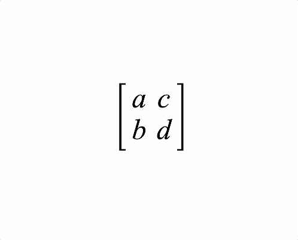

# Example - Equation Animation

Demonstrator of equation animation.

Open `index.html` in a browser to view example, or the example is hosted [here](https://airladon.github.io/FigureOne/examples/Equation%20Animation/index.html).

## Notes

This example shows how once equation forms are defined, they can be automatically animated between.

Equation elements will dissolve in and dissolve out as needed, their position will be animated and symbols will scale to accomodate a form.
