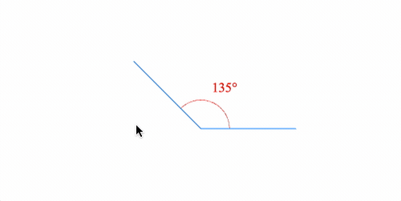

# Example - Interactive Angle

Change the angle size, rotation and position.

Open `index.html` in a browser to view example, or the example is hosted [here](https://airladon.github.io/FigureOne/examples/Interactive%20Angle/index.html).



## Code

```js
// `index.js`

const figure = new Fig.Figure({ limits: [-2, -2, 4, 4], color: [1, 0, 0, 1] });

// Movable angle
figure.add({
  name: 'a',
  method: 'collections.angle',
  options: {
    angle: Math.PI / 4 * 3,
    label: {
      location: 'outside',
      orientation: 'horizontal',  // Label should be horizontal
      offset: 0.1,    // Offset of label from curve
      update: true,   // Auto update angle to be horizontal as rotation changes
      sides: 200,     // Curve is a polygon with 200 sides, so looks circular
    },
    curve: {          // Curve of angle
      radius: 0.3,
    },
    corner: {         // Straight lines of angle
      width: 0.01,
      length: 1,
      color: [0, 0.5, 1, 1],
    },
  }
});

// Angle collection has a specific setMovable function that allows for
// customizing how each arm of the angle changes the angle
figure.elements._a.setMovable({
  startArm: 'rotation',
  endArm: 'angle',
  movePadRadius: 0.3,
});
```

## Explanation

The FigureOne API includes a dynamic angle collection, and so most of the logic for this example already exists. All that needs to be done is setup the options to customize the look and behavior.

The API reference documents the [angle collection](https://airladon.github.io/FigureOne/api/#collectionsangle), and its [options object](https://airladon.github.io/FigureOne/api/#col_angle).
