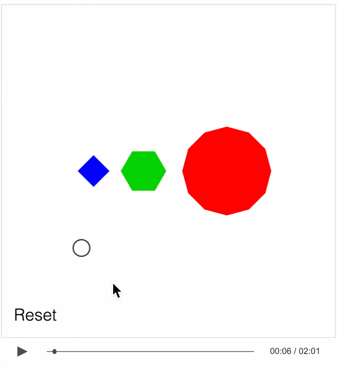
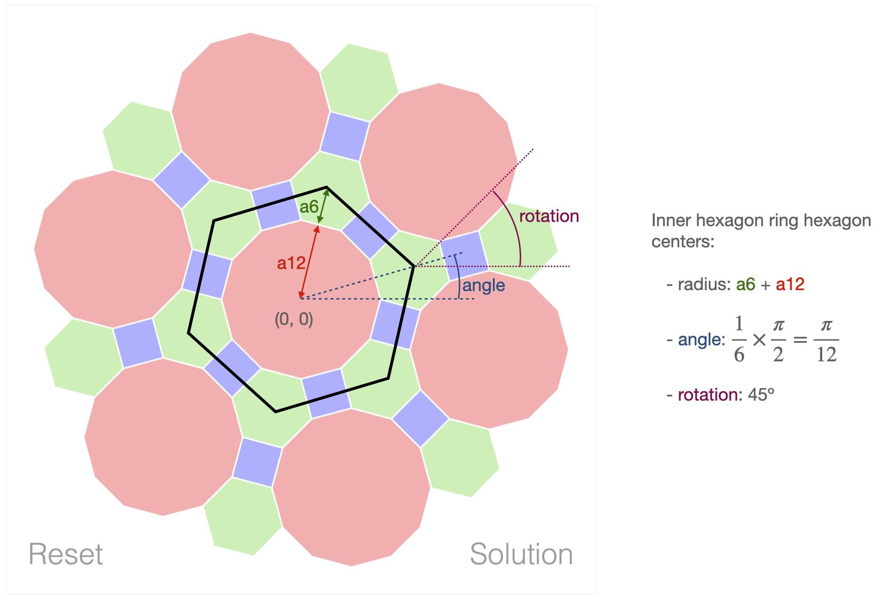

# Example - Tiling

An interactive video of a tiling exercise. Play the video. If you interact with the shapes at any time, the video will pause while you do so. When you are ready to continue, press the play button again. If you are stuck on the solution, scrub through to the end of the video and press the solution button.

### How to view

The example is hosted [here](https://airladon.github.io/FigureOne/examples/Interactive%20Video%20-%20Tiling/index.html), where you can watch, listen and interact with the video.

To view locally, the files will need to be served with a local web server (browser security settings will prevent loading local audio files directly).

You can create a local web server and host the example by first cloning the repository:

```bash
git clone https://github.com/airladon/FigureOne
```

Then, from the repository root, start the development container (you will need to install Docker if you don't have it already):
```bash
./start.sh
```

The container will start and present a command prompt. You can start a http-server by typing:
```bash
http-server
```

You can then open a browser and paste `http://localhost:8080/docs/examples/Interactive Video - Tiling/index.html` in the browser address bar.





### Explanation

This FigureOne interactive video is similar to [tutorial 15](../../tutorials/15%20-%20Recorder%20Introduction) in that it only has an interactive figure and some recorded touch events.

The main challenge in understanding the example may be the logic unrelated to FigureOne that sets up the solution scenario for the shapes.

The logic uses the fact that the shapes in the solution are arranged in hexagons around a central dodecagon. For example, the inner ring of hexagons forms a hexagon with a radius that is the sum of the apothems of the dodecagon and hexagon, with the first hexagon being at an angle of half a side length (π / 12) and a rotation of 45º:



Therefore the shapes are grouped by which hexagon arrangement they are in, and orded so the smaller shapes are on top:
 * Group 'a': center dodecagon
 * Group 'b': ring of dodecagons
 * Group 'c': inner ring of hexagons
 * Group 'd': outer ring of hexagons
 * Group 'e': inner ring of squares
 * Group 'f': outer ring of squares

Each group is created using the `polygons` method, which creates the individual shapes within the group.

```js
// Calculate the apothems of the shapes
// The apothem (a) is related to side length (s) and number of sides (n) by:
// s = 2*a*tan(180/n)
const sideLength = 0.14;
const a6 = sideLength / 2 / Math.tan(Math.PI / 6);   // apothem of hexagon
const a12 = sideLength / 2 / Math.tan(Math.PI / 12); // apothem of dodecagon
const a4 = sideLength / 2 / Math.tan(Math.PI / 4);   // apothem of square
const halfAng = Math.PI * 2 / 12 / 2;            // Half side angle of dodecagon

// Helper function that greates a group of shapes within a common hexagon layout
function polygons(
  prefix, sides, color, count, startPosition, startRadius, startAngle, startRotation,
) {
  // Calculate polygon radius from side length
  const radius = sideLength / 2 / Math.sin(Math.PI / sides);
  // Create the polygons
  const shapes = [];
  for (let i = 0; i < count; i += 1) {
    const sAng = (startAngle - 1) * halfAng * 2 + halfAng + i * Math.PI * 2 / 6;
    const solutionPosition = [
      startRadius * Math.cos(sAng), startRadius * Math.sin(sAng),
    ];
    const solutionRotation = startRotation + i * Math.PI * 2 / 6;
    shapes.push(makePolygon(`polygon${prefix}${sides}_${i}`, radius, color, sides, startPosition, solutionPosition, solutionRotation));
  }
  return shapes;
}

const red = [1, 0, 0, 0.8];
const blue = [0, 0, 1, 0.8];
const green = [0, 0.8, 0, 0.8];
const pi = Math.PI;

figure.add([
  ...polygons('a', 12, red, 1, [0.35, 0.7], 0, 0, 0),
  ...polygons('b', 12, red, 6, [0.35, 0.7], a12 * 2 + a4 * 2, 2, 0),
  ...polygons('c', 6, green, 6, [-0.15, 0.7], a12 + a6, 1, pi / 4),
  ...polygons('d', 6, green, 6, [-0.15, 0.7], a12 + a6 * 3 + a4 * 2, 1, -pi / 12.5),
  ...polygons('e', 4, blue, 6, [-0.45, 0.7], a12 + a4, 2, 0),
  ...polygons('f', 4, blue, 6, [-0.45, 0.7], a12 + a6 * 2 + a4, 1, -pi / 6),
  button('solutionButton', 'Solution', [0.75, -0.9]),
  button('resetButton', 'Reset', [-0.8, -0.9]),
]);
```


### Script
This video is interactive. Anytime during this video you can interact with the shapes on the screen by using a mouse on a desktop, or your finger on a mobile device or tablet. Touch and drag the middle of the shapes to move them, and touch and drag the edges of the shapes to rotate them. If you want to reset the shapes at any time, just press the reset button here. Now whenever you touch something, the video will automatically pause, so press play when you're ready to continue.

At the top here, we have three stacks of regular polygons with 4, 6 and 12 sides respectively.

The question is, can you arrange them so there is no white space, or overlap between the shapes?

So for example, if we use only squares, we can align them all and nicely fill in an area with no overlap and no gaps.

Similarly, we can do the same if we use just hexagons. Once again we have no overlap and no spaces.

However, when tiling dodecagons we are left with a little white space triangle.

To create a tiling with the dodecagons, you are going to need to use the other two shapes as well. Try moving them around, and rotating them where necessary to find the tiling.

If you are stuck, then press the solution button down here to see the solution.   
