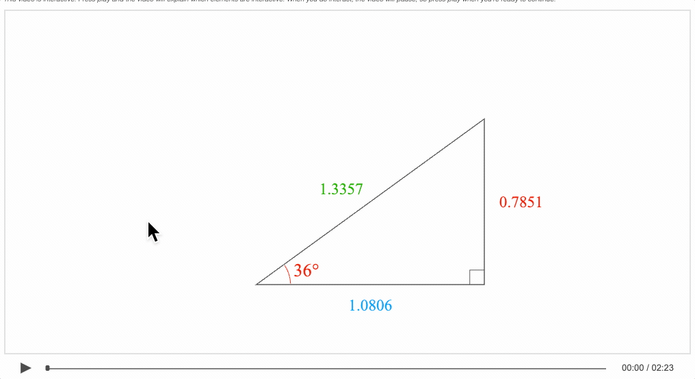

# Example - Trig 1 - Trig Functions

An interactive video introducing the trigonometric functions. Play the video. If you interact with the triangle at any time, the video will pause while you do so. When you are ready to continue, press the play button again.

### How to view

The example is hosted [here](https://airladon.github.io/FigureOne/examples/Interactive%20Video%20-%20Trig%201%20-%20Trig%20Functions/index.html).

If you want to view it locally however, it is important to know that loading local files into a html can be prevented by web browser security settings, this example needs to be loaded from a web server.

You can create a local web server and host the example by first cloning the repository:

```bash
git clone https://github.com/airladon/FigureOne
```

Then, from the repository root, start the development container (you will need to install Docker if you don't have it already):
```bash
./start.sh
```

The container will start and present a command prompt. You can start a http-server by typing:
```bash
http-server
```

You can then open a browser and go to `http://localhost:8080/docs/examples/Interactive%20Video%20-%20Trig%201%20-%20Trig%20Functions/index.html`.





### Explanation

This FigureOne interactive video is an extension of [tutorial 17](../../tutorials/15%20-%20Recording%20Slides) and [tutorial 18](../../tutorials/15%20-%20Recording%20Slides) as it uses [SlideNavigator](https://airladon.github.io/FigureOne/api/#slidenavigator) to manage major state transitions in the video.

The files in this examples are:
* `setup.js` setup figure, define colors line widths and text helper functions
* `cursor.js` recorded mouse movements generated by first recording them in the browser with the recorder and then using `figure.recorder.genAutoMouseEvents()` in the browser console to generate the code to paste into the javascript file
* `equations.js` all equation definitions and functions to pulse equation phrases
* `geometry.js` all geometry related figure elements and logic
* `slides.js` add slide navigator and slide definitions


### Script
* This triangle is interactive. You can drag the top corner or rotate the hypotenuse to make different triangles. When you interact with it, the video will pause, so press play when you're ready to continue.


* Now as we change the triangle, let's look at the all the possible side ratio values.

* Try making different triangles and see how the ratios change. Can you find a way to change the triangle that keeps the ratios constant?

* Well, if we are careful and change the size of the triangle without changing the angle theta, we can see the ratios stay constant.
* This seems to work for any angle, like small angles... and large angles.

* Why is this?


* Well, we might remember from geometry, that a triangle's angles sum to 180º, so when we define two angles, in this case the right angle and theta, we are really defining all three.

* Therefore all right angle triangles with the same angle theta will have the same set of angles and be similar triangles.

* Now, a property of similar triangles is that all similar triangles will have equal corresponding side ratios.

* So for example if we label two sides on the left triangle, and take their ratio, then the corresponding sides of the right triangle will have the same ratio. Similarly, if we label the third side, the ratio between the first and third sides will be the same for both triangles, and this holds for any side ratio.

* So this explains why all the ratios stay constant when the angle stays the same, even if the triangle size changes.

* In fact, we can see the ratios *only* change when we change the angle - and therefore we can say the ratios are dependent on, or a function of angle, which we've called theta.

* These functions are used frequently in trigonometry, and so they each have a special abreviated name - the sin, cos, tan, cot, sec and csc, and as a collection they are often called trigonometric functions.

* The next video in this series will show where these names come from.
