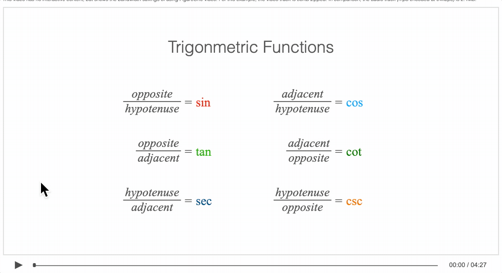

# Example - Trig 2 - Names

An FigureOne video showing where the trigonometric function names come from.

### How to view

The example is hosted [here](https://airladon.github.io/FigureOne/examples/Interactive%20Video%20-%20Trig%202%20-%20Names/index.html), where you can watch, listen and interact with the video.

If you want to view it locally however, it is important to know that loading local files into a html can be prevented by web browser security settings, this example needs to be loaded from a web server.

You can create a local web server and host the example by first cloning the repository:

```bash
git clone https://github.com/airladon/FigureOne
```

Then, from the repository root, start the development container (you will need to install Docker if you don't have it already):
```bash
./start.sh
```

The container will start and present a command prompt. You can start a http-server by typing:
```bash
http-server
```

You can then open a browser and paste `http://localhost:8080/docs/examples/Interactive Video - Trig 2 - Names/index.html` in the browser address bar





### Explanation

The video is not interactive, but it does highlight potential bandwidth savings. All data files (including the video track) can be compressed to 70KB for a 4:26 video. In comparison the audio track is 2.1MB. The video is resolution independant.

This FigureOne interactive video is an extension of [tutorial 17](../../tutorials/15%20-%20Recording%20Slides) and [tutorial 18](../../tutorials/15%20-%20Recording%20Slides) as it uses [SlideNavigator](https://airladon.github.io/FigureOne/api/#slidenavigator) to manage major state transitions in the video.

The files in this examples are:
* `setup.js` setup figure, define colors line widths and text helper functions
* `equations.js` all equation definitions and functions to pulse equation phrases
* `circle_tri.js` all geometry figure elements and logic related to the circle and right angle triangle comparison
* `lines_definitions.js` all geometry figure elements and logic related where the tangent, secant and chord line names come from
* `slides.js` add slide navigator and slide definitions


### Script
The names of the trigonometric functions come from the relationship between right angle triangles and circles.

To show this we start with the first quadrant of a circle, and note that the x and y coordinates of each point on the circle can be expressed with a right angle triangle.

When we use a *unit circle*, the hypotenuse of the right angle triangle is one, and the two trigonometric ratios with hypotenuse in the denominator will have denominators of 1 and simpify down to just the length of the triangle's sides. The names of these sides will then be the names of the trigonometric functions.

Now a line between any two points on a circle is called a *chord* line where the word *chord* comes from the Latin word meaning *bowstring*. The vertical line of the triangle, which represents the opposite over the hypotenuse ratio, is then a half chord, and in fact, originally in Sanskrit it was called just that, a half chord or half bowstring, but when it was later translated into Latin it lost this meaning. Our word for this ratio today, sine, comes from this Latin translation, though we often abreviate it without the e.

Therefore, the opposite over hypotenuse ratio is the sine function over 1, or just the sine function.

So if the sine of an angle is *opposite* the angle, and our horizontal side is opposite the complementary angle, then we can say the horiztonal side is the *sine of the complementary angle of theta*. Therefore, we call this side the complementary sine, the cosine or just cos for short. Relative to theta, the ratio of the adjacent side over the hypotenuse is then this cosine or cos function.

Ok, we've named our first two trigonometric functions by using a right angle triangle with side length one, and then naming the other two sides.

So we will do something similar for the remaining ratios.

Let's start by growing the triangle so that the side adjacent to theta becomes one. Now, a line that *touches* the circle at one point, and is perpendicular to the radius line at the same point, is called a *tangent* line, where the word tangent comes from the latin word meaning *to touch*.

Our opposite side is a tangent line, and we will call it the tan for short.

Next, a line that *cuts* through the circle is called a *secant* line, where the word secant comes from the latin word meaning *to cut*. In this case our hypotenuse is a secant line and so we call it the sec for short.

And so the ratio of opposite over adjacent is the tan function, and the ratio of hypotenuse over adjacent is the sec function.

Let's now find our last two ratio names by growing the triangle again so now the *opposite* side is one.

Now this triangle is similar to our tan sec triangle in that it has a side of length one, but now it is adjacent to the *complementary angle*. Therefore the side opposite the complimentary angle is the tangent of the complementary angle, and so we call this the complementary tangent, cotangent, cotan or just cot for short. 

Similarly, the hypotenuse over the adjacent is the secant of the complementary angle, which we call the complementary secant, cosecant, cosec or just csc.

Relative to theta then, the adjacent side over the opposite is the cot function, and the hypotenuse over the opposite is the cosec or csc function.

And so we can see where the trigonometric function names come from. The sin, tan and sec names come from lines associated with circles, while the cosine, cotan and cosec names describe the complementary relationship with the sine, tan and sec functions.
