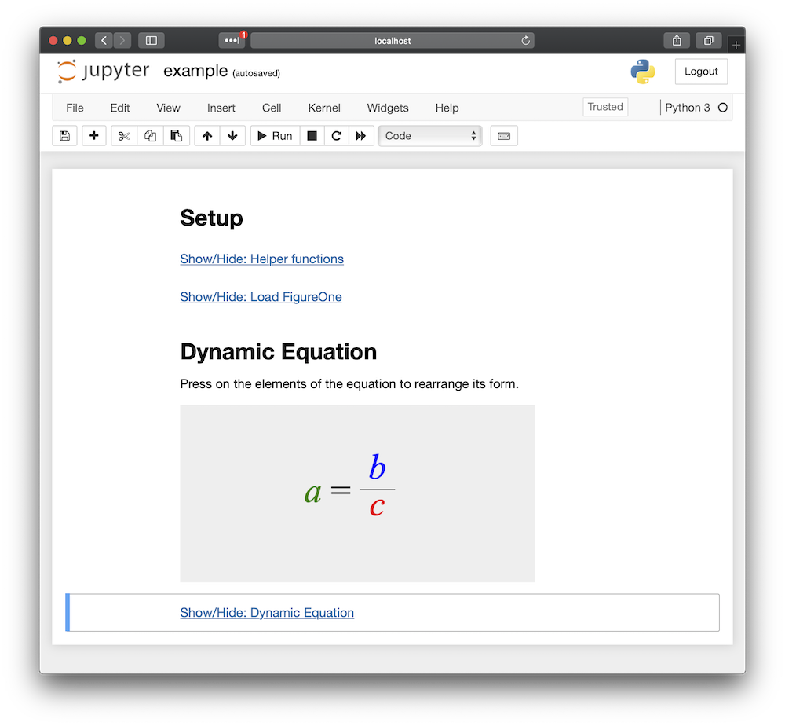

# Example 10 - Integration in Jupyter Notebooks

FigureOne can be loaded into a Jupyter Notebook to show a animated and interactive equation.

This example will create a simple notebook, and show how to load and use Figureone within it.

## Install Jupyter and Load Notebook

First create a virtual environment, initialize it, then install `jupyter`.
```
python3 -m venv env
source env/bin/activate
pip3 install jupyter
```

Start Jupyter server and load example notebook.
```
jupyter notebook example.ipynb
```

The browser should open the notebook automatically.



If it doesn't, try opening a new browser window and going to:
```
http://localhost:8888/notebooks/example.ipynb#
```

## Code And Explanation
### Cell 1
Use **Setup** as a title for all the setup code cells.
```md
# Setup
```

### Cell 2
The javascript code to generate a dynamic figure or equation may take away from the readability of the notebook. 

Therefore, a convenience function `addToggleLink` is first defined to allow javascript cells to be hidden in the notebook. It is also called at the end of the cell to hide this setup code and keep the notebook clean.

```js
%%javascript
function toggler(output_area, forceHide = false) {
  var cell_element = output_area.element.parents('.cell');
  var cell_idx = Jupyter.notebook.get_cell_elements().index(cell_element);
  var cell = Jupyter.notebook.get_cell(cell_idx);
  var input = cell.input[0];
  if (input.style.display === 'none' && forceHide === false) {
    cell.input[0].setAttribute("style", "");
  } else {
    cell.input[0].setAttribute("style", "display:none");            
  }
}

function addToggleLink(elem, output_area, label = '', hideOnRun = true) {
  // Create a <a></a> link element that will show/hide the cell
  var a = document.createElement('a');  
  var link = document.createTextNode(`Show/Hide: ${label}`); 
  a.appendChild(link);  
  a.href = '#';
  a.onclick = toggler.bind(this, output_area, false);
  elem[0].appendChild(a)
  if (hideOnRun) {
    toggler(output_area, true)
  }
}

// Attach `addToggleLink` to `window`
window.addToggleLink = addToggleLink;

// Call `addToggleLink` to hide this setup code and keep the notebook clean
window.addToggleLink(element, this, 'Helper functions');
```


### Cell 3
This cell will load `FigureOne`, and then hide this setup code as well.
```js
%%javascript
require.config({ 
  paths: { 
    Fig: 'https://cdn.jsdelivr.net/npm/figureone@0.5.1/figureone.min'
  },
  scriptType: 'text/javascript'
});
window.addToggleLink(element, this, 'Load FigureOne');
```

### Cell 4

Create a `div` element with id `dynamic_equation_1` that we will attach a FigureOne figure to.

```md
# Dynamic Equation

Press on the elements of the equation to rearrange its form.

<div id="dynamic_equation_1" style="width: 400px; height: 200px; background-color: #eee; margin-top: 1em">
    </div>
```


### Cell 5
Now we create a `Figure`, and define the equation to be shown.

```js
%%javascript
require(['Fig'], function(Fig) {  
    // Create a figure with limits that are proportional to the html div style size 
    const figure = new Fig.Figure({
      limits: new Fig.Rect(-2, -1, 4, 2),
      htmlId: 'dynamic_equation_1',
    });

    figure.add({
      name: 'eqn',
      method: 'equation',
      options: {
        position: [-0.4, -0.1],
        scale: 2,
        color: [0, 0, 0, 1],
        elements: {
          equals: ' = ',
          times: ' \u00D7 ',
          c: { color: [1, 0, 0, 1] },
          a: { color: [0, 0.5, 0, 1] },
          b: { color: [0, 0, 1, 1] },
        },
        formDefaults: {
          alignment: { fixTo: 'equals' }
          translation:
            a: { style: 'curved', direction: 'down', mag: 0.8 },
            b: { style: 'curved', direction: 'up', mag: 0.5 },
            c: { style: 'curved', direction: 'down', mag: 0.5 },
          },
        },

        // Define each equation form, and how the elements should move
        forms: {
          'a': {
            content: ['a', 'equals', { frac: ['b', 'vinculum', 'c'] }],
            translation: {
              a: { style: 'curved', direction: 'down', mag: 0.8 },
              b: { style: 'curved', direction: 'up', mag: 0.5 },
              c: { style: 'curved', direction: 'down', mag: 0.5 },
            },
          },
          'b': {
            content: ['b', 'equals', 'c', 'times', 'a'],
            translation: {
              a: { style: 'curved', direction: 'down', mag: 0.8 },
              b: { style: 'curved', direction: 'up', mag: 0.5 },
              c: { style: 'curved', direction: 'down', mag: 0.5 },
            },
          },
          'c': {
            content: ['c', 'equals', { frac: ['b', 'vinculum', 'a'] }],
            translation: {
              a: { style: 'curved', direction: 'down', mag: 0.8 },
              b: { style: 'curved', direction: 'up', mag: 0.5 },
              c: { style: 'curved', direction: 'down', mag: 0.5 },
            },
          },
        },
      },
    });

    const eqn = figure.getElement('eqn');
    const a = figure.getElement('eqn.a');
    const b = figure.getElement('eqn.b');
    const c = figure.getElement('eqn.c');
    function goto(form) {
      eqn.goToForm({
        name: form, delay: 0, duration: 1.5, animate: 'move',
      });
      figure.animateNextFrame();
    }
    a.onClick = goto.bind(this, 'a');
    b.onClick = goto.bind(this, 'b');
    c.onClick = goto.bind(this, 'c');
    a.setTouchable();
    b.setTouchable();
    c.setTouchable();
    eqn.showForm('a');
    figure.animateNextFrame();
});
// Hide the javascript code
window.addToggleLink(element, this, 'Dynamic Equation');
```
