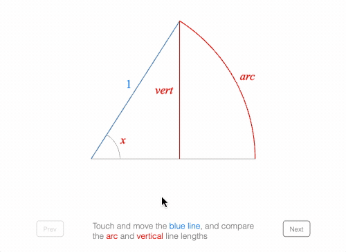

# Example - Sine Limit

Rotate the blue line and observe how the vertical line and arc lengths become more similar as the angle reduces. Then press the "Next" button to build up the equation that describes this.

Open `index.html` in a browser to view example.



## Explanation

The code is split into four main areas:

* Define shapes
* Define equation and its forms
* Define descriptions and setup button logic
* Tie dependent elements together and initialize


### Define shapes

A number of shapes need to be setup including:

* A radius line to move and change the angle with 
* The angle
* An arc
* A line representing the sine of the angle


Each of the shapes is customized for this particular example and so many properties are used in each definition.

```js
// `index.js`
const { Point, Figure } = Fig;
figure = new Figure({
  limits: [-2, -1.5, 4, 3],
  color: [0.5, 0.5, 0.5, 1],
  font: { size: 0.1 },
});

// //////////////////////////////////////////////////////////////////
// Setup the Shape
// //////////////////////////////////////////////////////////////////
// Values that will be reused frequently
const origin = new Point(-1, -0.4);
const radius = 2;

// Create the shape
figure.add([
  {
    name: 'radius',
    method: 'collections.line',
    options: {
      p1: origin,
      length: radius,
      angle: 1,
      touchBorder: 0.5,
      width: 0.01,
      color: [0, 0.5, 1, 1],
      label: {
        text: '1',
        offset: 0.05,
        update: true,
      },
      mods: {
        isMovable: true,
        move: {
          type: 'rotation',
          bounds: { rotation: { min: 0.07, max: 1.1 } },
        },
      },
    },
  },
  {
    name: 'angle',
    method: 'collections.angle',
    options: {
      corner: { length: 2 },
      curve: {
        radius: 0.35,
        width: 0.005,
        sides: 200,
        simple: true,
      },
      label: {
        text: 'x',
        offset: 0.05,
        autoHide: 0.2,
        touchBorder: 0.1,
        isTouchable: true,
        color: [1, 0, 0, 1 ],
      },
      position: origin,
    },
  },
  {
    name: 'arc',
    method: 'collections.angle',
    options: {
      curve: {
        radius: radius - 0.005,
        width: 0.01,
        sides: 800,
        simple: true,
      },
      label: {
        text: ['arc', 'x'],
        offset: 0.05,
        touchBorder: 0.1,
        isTouchable: true,
      },
      color: [1, 0, 0, 1],
      position: origin,
    },
  },
  {
    name: 'sine',
    method: 'collections.line',
    options: {
      p1: [0, 0],
      p2: [0, 1],
      label: {
        text: {
          elements: { sin: { font: { style: 'normal' } } },
          forms: { 0: 'vert', 1: ['sin', ' ', 'x'] },
          formSeries: ['0', '1'],
        },
        offset: 0.05,
        linePosition: 0.5,
        touchBorder: 0.1,
        isTouchable: true,
      },
      width: 0.01,
      color: [1, 0, 0, 1],
    },
  },
]);
```

### Define Equation and Slide Navigator

To build the equation up, 8 forms are used. To make the code more succinct and readable, a two stratergies are used:

* Define helper functions for bottom comments, fraction and a container
* Uses phrases to reduce the length of the forms


```js
// //////////////////////////////////////////////////////////////////
// Setup the Equation
// //////////////////////////////////////////////////////////////////
// Helper functions to make equation forms look cleaner
// Bottom Comment
const bot = (content, comment, space = 0.05) => ({
  bottomComment: {
    content,
    comment,
    commenSpace: space,
    inSize: false,
  },
});

// Fraction
const frac = (numerator, symbol, denominator, offsetY = 0.07) => ({
  frac: { numerator, denominator, symbol, offsetY },
});

// Fixed width container
const cont = (content, width) => ({
  container: { content, width },
});

// Add equation
figure.add([
  {
    name: 'eqn',
    method: 'collections.equation',
    options: {
      // Define the elements that require specific styling
      elements: {
        lim: { style: 'normal' },
        sin: { style: 'normal', color: [1, 0, 0, 1] },
        x_1: { color: [1, 0, 0, 1] },
        x_2: { color: [1, 0, 0, 1], isTouchable: true, touchBorder: 0.1 },
        _1: { isTouchable: true, touchBorder: 0.1 },
        equals: '   =  ',
        limBox: { symbol: 'tBox', touchBorder: 0.1, isTouchable: true },
        sinBox: { symbol: 'tBox', touchBorder: [0.1, 0.02, 0.1, 0.1], isTouchable: true },
        vert: { color: [1, 0, 0, 1] },
        arc: { color: [1, 0, 0, 1] },
        arc_1: { color: [1, 0, 0, 1] },
        arc_2: { color: [1, 0, 0, 1] },
        xTo: 'x \u2192 ',
        s: { symbol: 'strike', style: 'back' },
      },
      // Phrases help keep forms readable
      phrases: {
        csinx: { container: [['sin', ' ', 'x_1'], 0.25] },
        sinx: { tBox: ['csinx', 'sinBox'] },
        limit: { tBox: [[bot('lim', 'xTo0'), '    '], 'limBox']},
        cvert: { container: { content: 'vert', width: 0.25 } },
        xTo0: ['xTo', '_0'],
        asXTo0: ['as ', 'xTo0', ':   ']
      },
      formDefaults: { alignment: { fixTo: 'equals' } },
      forms: {
        0: [],
        1: ['asXTo0', 'cvert', 'equals', 'arc' ],
        2: [
          'asXTo0', frac('cvert', 'vinculum', 'arc_1'),
          'equals', frac('arc', 'v2_vinculum', 'arc_2'),
        ],
        3: [
          'asXTo0', frac('cvert', 'vinculum', 'arc_1'),
          'equals', {
            sub: {
              content: { strike: {
                  content: [frac('arc', 'v2', 'arc_2')],
                  symbol: 's',
                },
              },
              subscript: '_1',
              scale: 0.8,
              offset: [0.03, -0.06],
            },
          },
        ],
        4: ['asXTo0', frac('cvert', 'vinculum', 'arc_1'), 'equals', '_1'],
        5: ['limit', frac('cvert', 'vinculum', 'arc_1'), 'equals', '_1'],
        6: ['limit', frac('sinx', 'vinculum', 'arc_1'), 'equals', '_1'],
        7: ['limit', frac('sinx', 'vinculum', 'x_2'), 'equals', '_1'],
        8: ['limit', frac('sinx', 'vinculum', 'x_2'), 'equals', '_1'],
      },
      formSeries: ['0', '1', '2', '3', '4', '5', '6', '7', '8'],
      position: origin.add(1.3, -0.4),
    },
  },
  {
    name: 'nav',
    method: 'collections.slideNavigator',
    options: {
      equation: 'eqn',
      prevButton: { position: [-1.5, -1.25] },
      nextButton: { position: [1.5, -1.25] },
      text: { position: [0, origin.y - 0.85] },
    },
  },
]);
```

### Define descriptions and setup button logic

This example allows a user to step through a number of descriptions to build up the equation to its final form. Each step has a unique state: a description, equation form and shape state. We can use FigureOne's build in slide navigator to define and navigate through these states.

```js
// //////////////////////////////////////////////////////////////////
// Setup the slides
// //////////////////////////////////////////////////////////////////

// Figure elements that will be frequently used
const angle = figure.getElement('angle');
const arc = figure.getElement('arc');
const sine = figure.getElement('sine');
const rect = figure.getElement('rect');
const radiusLine = figure.getElement('radius');
const eqn = figure.getElement('eqn');

// Setup description modifiers that will be shared for all slides
const modifiersCommon = {
  'blue line': {
    font: { color: [0, 0.5, 1, 1] },
    onClick: () => radiusLine.pulseWidth(),
    touchBorder: [0.1, 0.03, 0.1, 0.1],
  },
  radius: {
    font: { color: [0, 0.5, 1, 1] },
    onClick: () => radiusLine.pulseWidth(),
    touchBorder: [0.1, 0.03, 0.1, 0.1],
  },
  arc: {
    font: { color: [1, 0, 0, 1] },
    onClick: () => figure.getElement('arc.label').pulse({ xAlign: 'left' }),
    touchBorder: 0.1,
  },
  angle: {
    font: { color: [1, 0, 0, 1] },
    onClick: () => figure.getElement('angle.label').pulse({ scale: 2 }),
    touchBorder: [0.1, 0.01, 0.1, 0.1],
  },
  angle1: {
    text: 'angle',
    font: { color: [1, 0, 0, 1] },
    onClick: () => figure.getElement('angle.label').pulse({ scale: 2 }),
    touchBorder: [0.1, 0.1, 0.1, 0.03],
  },
  vertical: {
    font: { color: [1, 0, 0, 1] },
    onClick: () => figure.getElement('sine.label').pulse({ xAlign: 'right' }),
    touchBorder: [0.1, 0.1, 0.1, 0.03],
  },
  limit: {
    font: { color: [0, 0.5, 1, 1] },
    onClick: () => eqn.pulse({ elements: ['as ', 'xTo', '_0', 'lim'], centerOn: '_0', xAlign: 'right' }),
    touchBorder: 0.1,
  },
  sin: {
    font: { color: [1, 0, 0, 1], family: 'Times New Roman', size: 0.12 },
    onClick: () => {
      eqn.pulse({ elements: ['sin', 'x_1'], centerOn: 'sin', xAlign: 'right', yAlign: 'bottom' });
      figure.getElement('sine.label').pulse();
    },
    touchBorder: 0.1,
  },
  x1: {
    text: 'x',
    font: { color: [1, 0, 0, 1], family: 'Times New Roman', style: 'italic', size: 0.12 },
    onClick: () => {
      eqn.pulse({ elements: ['sin', 'x_1'], centerOn: 'sin', xAlign: 'right', yAlign: 'bottom' });
      figure.getElement('sine.label').pulse({ xAlign: 0.9 });
    },
    touchBorder: 0.1,
  },
  x: {
    font: { color: [1, 0, 0, 1], family: 'Times New Roman', style: 'italic', size: 0.12 },
    onClick: () => {
      figure.getElement('eqn.x_2').pulse({ yAlign: 'top' });
      figure.getElement('angle.label').pulse();
    },
    touchBorder: 0.1,
  },
  sine: { font: { style: 'italic' } },
  equal: { font: { style: 'italic' } },
  'very small angles': { font: { style: 'italic' } },
};

// Setup slides
figure.getElement('nav').loadSlides([
  {
    text: [
      'Touch and move the |blue line|, and compare',
      'the |arc| and |vertical| line lengths',
    ],
    modifiersCommon,
    form: '0',
    steadyState: () => {
      figure.getElement('arc.label').showForm('0');
      figure.getElement('sine.label').showForm('0');
    },
  },
  { text: [
     'As the |angle| gets smaller, the |arc| and',
      '|vertical| line get closer in length',
  ] },
  { form: '1' },
  { text: 'Divide both sides by the arc length' },
  { form: '2' },
  { text: 'The right hand side simplifies to 1', form: '3' },
  { form: '4' },
  { text: 'Use mathematical notation for the |limit|' },
  { form: '5' },
  {
    text: 'The |vertical| line is the |sine| of |x|',
    steadyState: () => figure.getElement('sine.label').showForm('0'),
  },
  {
    form: '6',
    transition: (done) => {
      figure.getElement('sine.label').goToForm({ form: '1', animate: 'move', duration: 1 });
      eqn.goToForm({ form: '6', duration: 1, animate: 'move', callback: done });
    },
    steadyState: () => figure.getElement('sine.label').showForm('1'),
  },
  {
    text: ['The |radius| is 1, so the |arc| length equals', 'the |angle1|'],
    steadyState: () => {
      figure.getElement('arc.label').showForm('0');
    },
  },
  {
    form: '7',
    transition: (done) => {
      figure.getElement('arc.label').goToForm({ form: '1', animate: 'move', duration: 1 });
      eqn.goToForm({ form: '7', duration: 1, animate: 'move', callback: done });
    },
    steadyState: () => figure.getElement('arc.label').showForm('1'),
  },
  {
    text: [
      'Summary: for |very small angles| |x|, the angle',
      'and |sin| |x1| can often be considered |equal|',
    ],
    form: '8',
  },
]);
```

### Tie dependent elements together and initialize

Whenever the radius line moves, then a number of other shapes need to automatically update. This logic is first defined, and then the first slide is shown.

```js
// //////////////////////////////////////////////////////////////////
// Tie dependant elements together and set first positions
// //////////////////////////////////////////////////////////////////

// Whenever the radius line moves, the angle, arc and sine line must be updated
radiusLine.subscriptions.add('setTransform', () => {
  const a = radiusLine.getRotation();
  angle.setAngle({ angle: a });
  arc.setAngle({ angle: a });
  const end = new Point(
    radius * Math.cos(a), radius * Math.sin(a),
  );
  sine.setEndPoints(
    new Point(end.x - 0.005, 0).add(origin),
    new Point(end.x - 0.005, end.y).add(origin),
  );
});

// Setup initial radius line position and slide
radiusLine.setRotation(1);
```