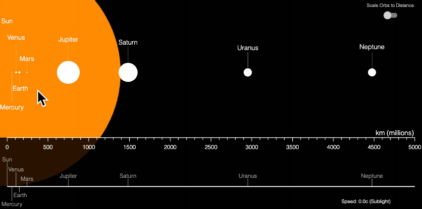

# Example - Solar System

Demonstrator on using a zoomable and pannable plot to explore the scale of the solar system.

Open `index.html` in a browser to view example, or the example is hosted [here](https://airladon.github.io/FigureOne/examples/Solar%20System/index.html).

## Notes

This example shows the planets of the solar system and their distance from the sun.

The figure can be zoomed and panned to get a feeling for the actual space between planets.
