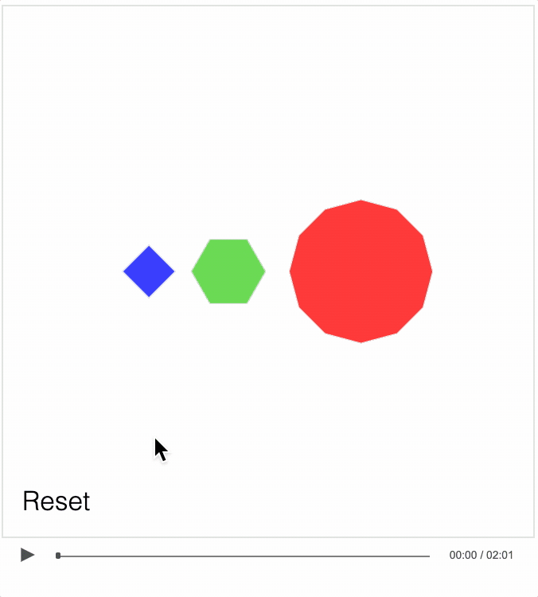

# Example - Tiling

An interactive video of a tiling exercise. Play the video. If you interact with the shapes at any time, the video will pause while you do so. When you are ready to continue, press the play button again. If you are stuck on the solution, scrub through to the end of the video and press the solution button.

### How to view

The example is hosted [here](https://airladon.github.io/FigureOne/examples/Tiling/index.html).

If you want to view it locally however, it is important to know that loading local files into a html can be prevented by web browser security settings, this example needs to be loaded from a web server.

You can create a local web server and host the tutorial by first cloning the repository:

```bash
git clone https://github.com/airladon/FigureOne
```

Then, from the repository root, start the development container (you will need to install Docker if you don't have it already):
```bash
./start.sh
```

The container will start and present a command prompt. You can start a http-server by typing:
```bash
http-server
```

You can then open a browser and go to `http://localhost:8080/docs/examples/Tiling/index.html`.





### Script
This video is interactive. Anytime during this video you can interact with the shapes on the screen by using a mouse on a desktop, or your finger on a mobile device or tablet. Touch and drag the middle of the shapes to move them, and touch and drag the edges of the shapes to rotate them. If you want to reset the shapes at any time, just press the reset button here. Now whenever you touch something, the video will automatically pause, so press play when you're ready to continue.

At the top here, we have three stacks of regular polygons with 4, 6 and 12 sides respectively.

The question is, can you arrange them so there is no white space, or overlap between the shapes?

So for example, if we use only squares, we can align them all and nicely fill in an area with no overlap and no gaps.

Similarly, we can do the same if we use just hexagons. Once again we have no overlap and no spaces.

However, when tiling dodecagons we are left with a little white space triangle.

To create a tiling with the dodecagons, you are going to need to use the other two shapes as well. Try moving them around, and rotating them where necessary to find the tiling.

If you are stuck, then press the solution button down here to see the solution.   
