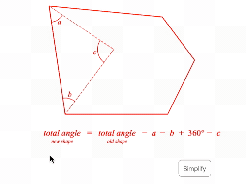

# Example - Total Angle of a Polygon

Interact with an equation to see where it's terms come from.

Open `index.html` in a browser to view example, or the example is hosted [here](https://airladon.github.io/FigureOne/examples/Total%20Angle%20of%20a%20Polygon/index.html).

## Notes

This example shows a scenario where an equation describes a diagram, but may be a little confusing when first seen. To help with this, each term in the equation can be touched, that will then highlight what it relates to in the diagram.

The code has three main parts:
  - Helpers - functions that will be reused several times
  - Layout - geometry and add shapes/equation to figure
  - Logic - sets the different behaviors when the equation terms are touched.

### Elements

In the logic section, figure elements are used frequently to either add behaviors to, or change in response to a behavior. In other examples, these elements are usually defined as variables. In this example, most elements are accessed through the `get` helper function.

The `get` method is does a `figure.getElement` call on an element name. Using `get` or defining the elements as variables is a style choice most of the time. `get` takes longer to return the element, but unless you are getting a lot of elements within an animation frame, it will likely be an insignificant time difference.

### Slide Navigator vs Equation Form

Some examples that have need more complicated state management or descriptions between equation forms use the [SlideNavigator](https://airladon.github.io/FigureOne/api/#slidenavigator). This example only needs to change the state of the diagram a few times as the equation forms are progressed through, and so this logic is included in the form definition itself.