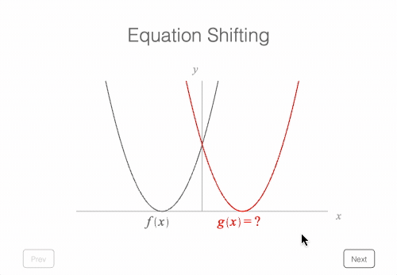

# Example - Travelling Wave 01 - Shifting Equations

This is part 1 of the Travelling Waves examples, showing how the equation of functions shifted along an x axis change.

Open `index.html` in a browser to view example, or the example is hosted [here](https://airladon.github.io/FigureOne/examples/Traveling%20Wave%2001%20-%20Shifting%20Equations/index.html).

## Notes
