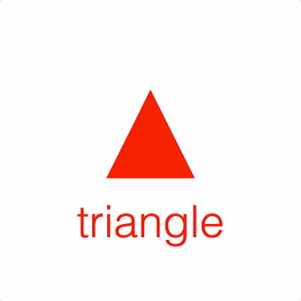

# Tutorial 2 - Collections

This example shows a triangle and text in a collection. The collection is rotated, so both the triangle and text are also rotated.

Open `index.html` in a browser to view example.



## Code
```js
// index.js

// Initialize the figure with a default color
const figure = new Fig.Figure({ color: [1, 0, 0, 1] });

const c = figure.add(
  {
    method: 'collection',
    // Add two elements to the collection
    elements: [
      {
        method: 'triangle',
        height: 0.4,
        width: 0.4,
      },
      {
        method: 'text',
        text: 'triangle',
        position: [0, -0.4],
        xAlign: 'center',
      },
    ],
  },
);

// When a collection rotates, then so does all its elements
c.animations.new()
  .rotation({ target: Math.PI * 1.999, direction: 1, duration: 5 })
  .start();
```

## Explanation

There are two types of figure elements (subclasses of [FigureElement](https://airladon.github.io/FigureOne/api/#figureelement)):

* [FigureElementPrimitive](https://airladon.github.io/FigureOne/api/#figureelementprimitive) - An object that draws something to the screen
* [FigureElementCollection](https://airladon.github.io/FigureOne/api/#figureelementcollection) - An object that manages a group of figure elements (either primitives or collections)

All figure elements have their own `transform` that *translates*, *rotates* and/or *scales* the element.

A figure element in a collection will be transformed by both its own transform, and its parent collection's transform.

That way, if figure elements should be moved or scaled together, they can be added to a collection and that collection can collectively move/scale them.

Thus, a figure element in a hierarchy of collections will be transformed by the chain of all its hierarchical parents.

## Alternative element creation

The above example uses an object hierarchy to define the figure elements. It is sometimes more useful to instantiate the elements separately. All figure elements can be created using methods within [figure.primitives](https://airladon.github.io/FigureOne/api/#figureprimitives) or [figure.collections](https://airladon.github.io/FigureOne/api/#figureprimitives).

The above example can be rewritten as:

```js
const tri = figure.primitives.triangle({
  height: 0.4,
  width: 0.4,
});

const text = figure.primitives.text({
  text: 'triangle',
  position: [0, -0.4],
  xAlign: 'center',
});

const c = figure.collections.collection({
  name: 'c',
});
c.add([tri, text]);

figure.add(c);

c.animations.new()
  .rotation({ target: Math.PI * 1.999, direction: 1, duration: 5 })
  .start();
```

## Element Access

Any elements added into a figure are returned from the `figure.add` method. If an array of elements are added, then an array of elements will be returned.

However, the children of the collection are not returned.

Any figure elements that need to be accessed after creation should be given a name (and all their hierarchical parents should also have a name). That way they can be retrieved using the `get`, `getElement` or `getElements` methods in figure or a collection.

For example, we could rewrite the above examples as:

```js
figure.add(
  {
    name: 'c',
    method: 'collection',
    elements: [
      {
        name: 'tri',
        method: 'triangle',
        height: 0.4,
        width: 0.4,
      },
      {
        name: 'text',
        method: 'text',
        text: 'triangle',
        position: [0, -0.4],
        xAlign: 'center',
      },
    ],
  },
);
```

The elements can then be accessed with the `get` method.

```js
const c = figure.get('c');
const tri = figure.get('c.tri');
const text = c.get('text');
```
