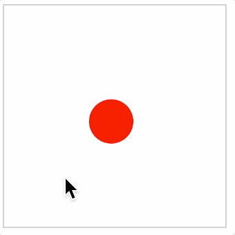

# Tutorial 3 - Interactive Shape

This example shows a circle that can be moved in the container.

If the shape is released while dragging, it will continue to travel in its last dragged direction, and bounce of the container boundaries if it reaches them.

Open `index.html` in a browser to view example.



## Code
`index.js`
```js
// Create figure
const figure = new Fig.Figure({ color: [1, 0, 0, 1] });

// Add circle to figure
figure.add(
  {
    name: 'circle',
    method: 'polygon',
    options: {
      sides: 100,
      radius: 0.2,
      touchBorder: 0.5,
    },
    mods: {
      isMovable: true,
      move: {
        bounds: 'figure',
        freely: { deceleration: 0.5 },
      },
    },
  },
);
```

## Explanation
Figure elements can be touched, moved, released (to move freely) and animated.

This example shows how an element can be setup to be moved and bounce off the figure walls so it stays within the figure's limits. By default, the object will move freely when released.

```js
    options: {
      sides: 100,
      radius: 0.2,
      touchBorder: 0.2,
    },
```

The `options` key in the circle definition defines parameters specific to the `polygon`. Of note, the `touchBorder` property defines the size of the buffer around the shape in which a touch event will touch the shape. If this is undefined, then the border of the shape is the touch border. More options for this can be seen at [OBJ_Generic.touchBorder](https://airladon.github.io/FigureOne/api/#obj_generic)

```js
    mods: {
      isMovable: true,
      move: {
        bounds: 'figure',
        freely: { deceleration: 0.5 },
      },
    },
```

The `mods` key in the circle definition can be used to set properties that belong to every [FigureElement](https://airladon.github.io/FigureOne/api/#figureelement). For instance, all figure elements have `isTouchable` and `isMovable` properties that are `false` by default. In this case, we are setting the `isMovable` property to `true`, which will also set the `isTouchable` property. To turn touchability or movability on or off at a later stage with the element, use the [setTouchable](https://airladon.github.io/FigureOne/api/#figureelementsettouchable) and [setMovable](https://airladon.github.io/FigureOne/api/#figureelementsetmovable) methods instead of directly changing the properties. This is because the methods will navigate up the element's parents, setting all parents to allow touch events to propagate through to the element.

Properties of [FigureElement](https://airladon.github.io/FigureOne/api/#figureelement) may also be *objects*. For example, all figure elements have a `move` object property that includes the properties `canBeMovedAfterLosingTouch` and `boundary`, as well as a number of others. Only the properties defined in `mods` will overwrite those in the figure element. Other properties that are not defined (including those within the `move` object) will retian their default values. Within this move object, we define the decelaration to be 0.5 figure units per second squared.
