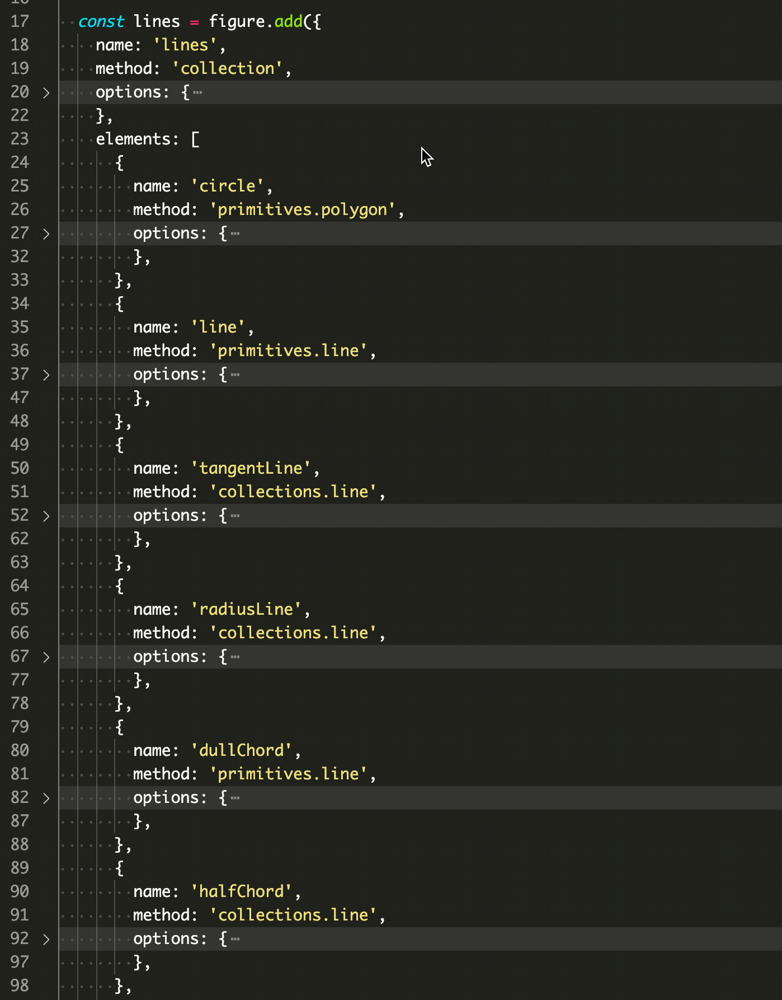

# Tutorial 3 - Interactive Shape

This example shows a circle that can be moved in the container.

If the circle is released while dragging, it will continue to travel in its last dragged direction, and bounce off the container boundaries if it reaches them.

Open `index.html` in a browser to view example.


## Code
`index.js`
```js
// Create figure
const figure = new Fig.Figure({ color: [1, 0, 0, 1] });

// Add circle to figure
figure.add(
  {
    make: 'polygon',
    sides: 100,
    radius: 0.2,
    move: {
      bounds: {
        left: -0.8, bottom: -0.8, right: 0.8, top: 0.8,
      },
      freely: { deceleration: 0.5 },
    },
  },
);
```

## Explanation

Figure elements can be touched, moved, released (to move freely) and animated.

This example shows how an element can be setup to be moved and bounce off the figure walls so it stays within the figure's limits. By default, the object will move freely when released.

Each figure element can be defined with a number of properties. Some of the properties are specific to the shape drawn by the figure element, while others are general and can be used with any [FigureElement](https://airladon.github.io/FigureOne/api/#figureelement).

In this case, the properties specific to the circle are:

```js
    make: 'polygon',
    sides: 100,
    radius: 0.2,
```

The properties that make the element moveable can be set on any figure element:

```js
    move: {
      bounds: {
        left: -0.8, bottom: -0.8, right: 0.8, top: 0.8,
      },
      freely: { deceleration: 0.5 },
    },
```

Elements can be setup to be touchable (`touch`) or movable (`move`). Setting the `move` property will automatically also make an element touchable.

The move property has several [options](https://airladon.github.io/FigureOne/api/#obj_elementmove). In this case, we are setting up a [rectangular boundary](https://airladon.github.io/FigureOne/api/#typerectboundsdefinition) and defining the deceleration of the circle when moving freely.

<!-- ## Options Object Alternate Definition

When an element object definitions contains many complex elements, it can be useful to use a code editor's code folding feature to make a file more readable.

All method specific parameters can also be defined in a dedicated `options` object property. So the above example would look like:

```js
// Create figure
const figure = new Fig.Figure({ color: [1, 0, 0, 1] });

// Add circle to figure
figure.add(
  {
    make: 'polygon',
    options: {
      sides: 100,
      radius: 0.2,
      touchBorder: 0.5,
    }
    mods: {
      isMovable: true,
      move: {
        bounds: 'figure',
        freely: { deceleration: 0.5 },
      },
    },
  },
);
```

An example of using code folding with `options` objects in each element object definition is:
 -->