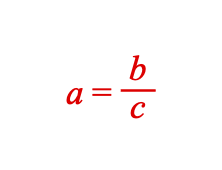

# Tutorial 5 - Simple Equation

A simple equation including a fraction.

Open `index.html` in a browser to view example.



## Code
`index.js`
```js
const figure = new Fig.Figure({ color: [1, 0, 0, 1] });

figure.add(
  {
    make: 'equation',
    // Equation elements are the individual terms in the equation
    elements: {
      a: 'a',
      b: 'b',
      c: 'c',
      v: { symbol: 'vinculum' },
      equals: ' = ',
    },
    // An equation form defines how the terms are arranged
    forms: {
      base: ['a', 'equals', { frac: ['b', 'v', 'c'] }],
    },
  },
);


```

## Explanation

Consider the equation:

```
a = b + c
```

We could also rearrange it to a different **form**:

```
a - b = c
```

These equations have a number of **terms** (a, b, c), an **operator** (+) and an equals sign (which we will call an **operator**).

Each of these **terms** and **operators** are figure elements - specifically [FigureElementPrimitive](https://airladon.github.io/FigureOne/api/#figureelementprimitive) objects that can behave as any other `FigureElement`. This means they can be touched, moved and animated.

An [Equation](https://airladon.github.io/FigureOne/api/#equation) object is a [FigureElementCollection](https://airladon.github.io/FigureOne/api/#figureelementcollection) that manages all the equation's elements and can arrange them into different equation **forms**.

In this example, the *equation elements* (**terms** and **operators**) are first defined in `options.elements`, then a *form* is defined in `options.forms.base` .

Some operators are either not in unicode, or are more convient to draw directly (as their scaling proportions change). These special operators are called *equation symbols* in FigureOne. In this example the *vinculum* of the fraction is a *equation symbol*.

Available *equation symbols* are in the [API Reference](https://airladon.github.io/FigureOne/api/#equation-symbols). They include symbols like radicals, integral symbols, brackets, arrows and more.

The fraction is a *equation layout function*. The available layout functions are also in the [API Reference](https://airladon.github.io/FigureOne/api/#equation-layout) and include functions like fraction, root, subscript, matrix, annotation and more.

## Why so verbose?

Many people that have used LaTeX to layout equations may find FigureOne's equation definitions to be verbose.

The extra complexity in FigureOne of defining an equation exists so each term and symbol in an equation can be uniquely identified and referenced.

When animating between equation forms, it is important for FigureOne to know which term in the two forms is the same term. That way the term can be automatically dissolved in or out if it only exists in one form, or animated between positions if exists in both.


The above definition of the equation is the most verbose (but also the most readable) way to define an equation. In subsequent tutorials, in some examples and in the API reference there is more information on how to further make equation definitions more succinct.

As an example, the above example can be recreated by only defining the form - all the equation elements are implicitly defined:

```js
figure.add({
  name: 'eqn',
  make: 'equation',
  options: {
    forms: {
      base: ['a', '_ = ', { frac: ['b', 'vinculum', 'c'] }],
    },
  },
});
```
