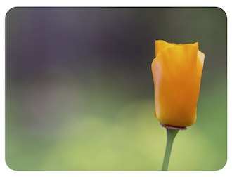

# Tutorial 8 - Textures

Shapes can either be filled with colors or textures where textures come from an image file.

As loading local images into a html can be prevented by web browser security settings, this example needs to be loaded from a web server.

You can create a local web server and host the by first cloning this repository:

```bash
git clone https://github.com/airladon/FigureOne
```

Then, from the repository root, start the development container (you will need to install docker if you don't already have it installed):
```bash
./start.sh
```

The container will start and present a command prompt. You can start a http-server by typing:
```bash
http-server
```

You can then open a browser and go to http://localhost:8080/docs/tutorials/08%20-%20Texture/.





## Code
`index.js`
```js
const figure = new Fig.Figure();

figure.add(
  {
    make: 'rectangle',
    width: 1.8,
    height: 1.333,
    corner: { radius: 0.1, sides: 10 },
    texture: {
      src: 'texture-rect.jpg',
      mapTo: [-1, -0.667, 2, 1.333],
    },
  },
);
```

## Explanation

Most shapes can use a [Texture Object](https://airladon.github.io/FigureOne/api/#obj_texture) to define a texture instead of a color.

Here we are using the `texture-rect.jpg` image. The image will be mapped directly to the shape, so if the shape's aspect ratio is different to that of the image you will need to either define a rectangle in the image to map to the shape (`mapFrom`), or define the coordinates in the space the shape is defined in that you want to map the image to (`mapTo`).

```js
    texture: {
      src: 'texture-rect.jpg',
      mapTo: new Fig.Rect(-1, -0.667, 2, 1.333),
    },
```

`texture-rect.jpg` has an aspect ratio of 1:0.667, and so here we are mapping the image to the shape's space with a rectangle that is a little larger than the shape.


