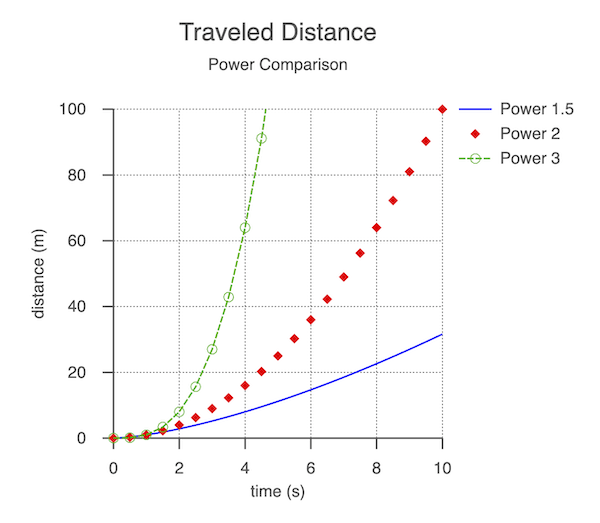

# Tutorial 10 - Customized Plot

A customized plot with titles and a legend.

Open `index.html` in a browser to view example.



## Code
`index.js`
```js
const figure = new Fig.Figure();

const pow = (power, stop = 10, step = 0.05) => {
  const xValues = Fig.tools.math.range(0, stop, step);
  return xValues.map(x => new Fig.Point(x, x ** power));
};

figure.add({
  method: 'collections.plot',
  // Plot size
  width: 1,
  height: 1,
  position: [-0.5, -0.5],
  // Plot Title
  title: {
    text: [
      'Traveled Distance',
      { text: 'Power Comparison', font: { size: 0.05 } },
    ],
    offset: [0, 0.1],
  },
  // Axes customizations
  xAxis: {
    title: 'time (s)',
  },
  yAxis: {
    start: 0,
    stop: 100,
    title: 'distance (m)',
  },
  // Traces with names for the legend
  trace: [
    { points: pow(1.5), name: 'Power 1.5' },   // Trace names are for legend
    {                                          // Trace with only markers
      points: pow(2, 10, 0.5),
      name: 'Power 2',
      markers: { sides: 4, radius: 0.02 },
    },
    {                                          // Trace with markers and
      points: pow(3, 10, 0.5),                 // dashed line
      name: 'Power 3',
      markers: { radius: 0.02, sides: 10, line: { width: 0.005 } },
      line: { dash: [0.04, 0.01] },
    },
  ],
  // Turn on the legend
  legend: { font: { size: 0.05 } },
});
```

## Explanation

Here we are doing some customization to the automatically generated plot including:
* Adding a plot title
* Adding axes titles
* Customizing the range of the y axis
* Customizing trace lines and markers
* Adding a legend

These are only some of the customizations possible. To see all customizations, see
* [Plot](https://airladon.github.io/FigureOne/api/#collectionsplot)
* [Axis](https://airladon.github.io/FigureOne/api/#collectionsaxis)
* [Trace](https://airladon.github.io/FigureOne/api/#collectionstrace)
* [Legend](https://airladon.github.io/FigureOne/api/#collectionslegend)
