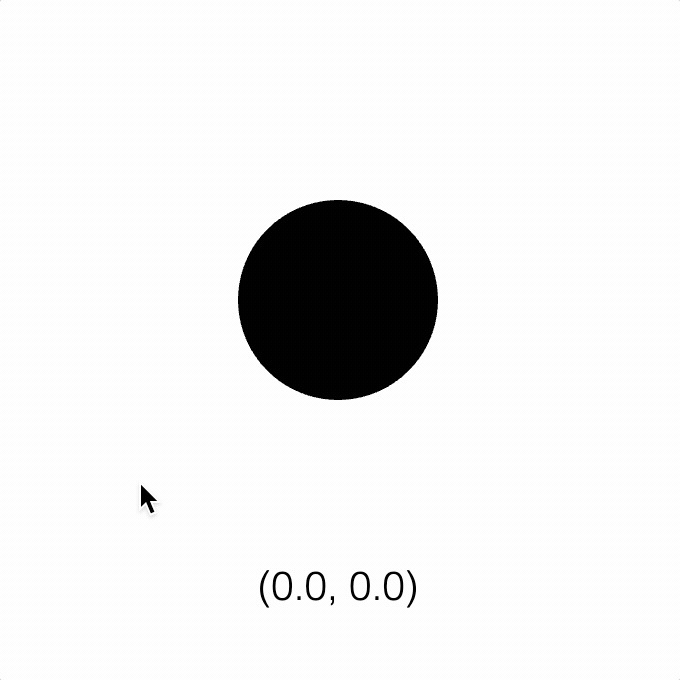

# Tutorial 11 - Notifications

Update coordinates of a moving ball using notifications.

Open `index.html` in a browser to view example.



## Code
`index.js`
```js
const figure = new Fig.Figure({ limits: [-2, -2, 4, 4] });

// Create a movable ball and text that shows the ball's coordinates
const [ball, text] = figure.add([
  {
    name: 'ball',
    make: 'primitives.polygon',
    radius: 0.5,
    sides: 100,
    position: [0, 0],
    mods: {
      isMovable: 'true',
    },
  },
  {
    name: 'text ',
    make: 'primitives.text',
    position: [0, -1.5],
    text: '(0.0, 0.0)',
    xAlign: 'center',
  },
]);

// Subscribe to ball's 'setTransform' event notification. When ball's
// transform changes, get its new position and update the text.
ball.notifications.add('setTransform', () => {
  // Get ball position and round to one decimal place
  const p = ball.getPosition().round(1);
  // Convert x and y to string with 1 decimal place
  const x = p.x.toFixed(1);
  const y = p.y.toFixed(1);
  text.custom.updateText({ text: `(${x}, ${y})` });
});
```

## Explanation

Use notifications to get alerted to events.

[FigureElement](https://airladon.github.io/FigureOne/api/#figureelement), [Figure](https://airladon.github.io/FigureOne/api/#figure), [Recorder](https://airladon.github.io/FigureOne/api/#recorder), and [SlideNavigator](https://airladon.github.io/FigureOne/api/#slidenavigator) all use notifications.

Subscribe a callback function to a notification of an event using the event name.

```js
ball.notifications.add('setTransform', () => {...});
```

In this case, we are subscribing to the `'setTransform'` event notification of the `ball` FigureElement. Whenever ball's transform changes, our function that updates the text element with the latest coordinates of the ball will be called.

See the api reference for more details on [NotificationManager](https://airladon.github.io/FigureOne/api/#notificationmanager).
