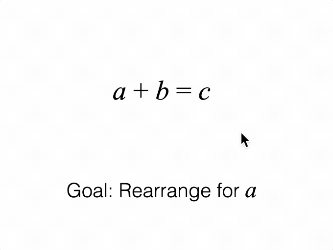

# Tutorial 12 - Slide Navigator Introduction

Navigate through several equation forms with descriptions.

>Note: This tutorial introduces the SlideNavigator by showing an idealized set of slide definitions which is intentionally verbose. The ~90 lines of code used for slide definitions will be reduced to 5 lines in the next tutorial which will demonstrate short-cut slide definitions.

Open `index.html` in a browser to view example.



## Code
`index.js`
```js
/* globals Fig */
const figure = new Fig.Figure();

// Figure consists of an equation and a description
const [eqn, description] = figure.add([
  {
    name: 'eqn',
    method: 'equation',
    options: {
      formDefaults: { alignment: { xAlign: 'center' } },
      forms: {
        0: ['a', '_ + ', 'b_1', '_ = ', 'c'],
        1: ['a', '_ + ', 'b_1', '_ - b_2', '_ = ', 'c', '_ - ', 'b_3'],
        2: ['a', '_ = ', 'c', '_ - ', 'b_3'],
      },
      formSeries: ['0', '1', '2'],
    },
    mods: {
      isTouchable: true,
      touchBorder: 0.1,
    },
  },
  {
    name: 'description',
    method: 'primitives.textLines',
    options: {
      modifiers: {
        a: { font: { family: 'Times New Roman', style: 'italic', size: 0.12 } },
        b: { font: { family: 'Times New Roman', style: 'italic', size: 0.12 } },
      },
      xAlign: 'center',
      font: { size: 0.1 },
      position: [0, -0.5],
    },
  },
]);

// Slides define a a figure state, and an animated transition between
// consecutive states. Each slide should define state compleletly and not
// depend on state from other slides. That way jumping between slides will not
// produce unexpected behavior.
const slides = [
  // Slide 0
  {
    show: [eqn, description],
    steadyState: () => {
      eqn.showForm('0');
      description.custom.updateText({ text: 'Goal: Rearrange for |a|' });
    },
  },

  // Slide 1
  {
    show: [eqn, description],
    enterState: () => {
      eqn.showForm('0');
      description.custom.updateText({ text: 'Goal: Rearrange for |a|' });
    },
    transition: (done) => {
      description.animations.new()
        .dissolveOut(0.5)
        .trigger({
          callback: () => description.custom.updateText({
            text: 'Subtract |b| from both sides',
          }),
        })
        .dissolveIn(0.5)
        .whenFinished(done)
        .start();
    },
    steadyState: () => {
      description.custom.updateText({ text: 'Subtract |b| from both sides' });
    },
  },

  // Slide 2
  {
    show: [eqn, description],
    enterState: () => {
      eqn.showForm('0');
      description.custom.updateText({ text: 'Subtract |b| from both sides' });
    },
    transition: (done) => {
      eqn.animations.new()
        .goToForm({ target: '1', animate: 'move' })
        .whenFinished(done)
        .start();
    },
    steadyState: () => {
      eqn.showForm('1');
    },
  },

  // Slide 3
  {
    show: [eqn, description],
    enterState: () => {
      eqn.showForm('1');
      description.custom.updateText({ text: 'Subtract |b| from both sides' });
    },
    transition: (done) => {
      description.animations.new()
        .dissolveOut(0.5)
        .trigger({
          callback: () => description.custom.updateText({
            text: '|b| cancels on left side',
          }),
        })
        .dissolveIn(0.5)
        .whenFinished(done)
        .start();
    },
    steadyState: () => {
      description.custom.updateText({ text: '|b| cancels on left side' });
    },
  },

  // Slide 4
  {
    show: [eqn, description],
    enterState: () => {
      eqn.showForm('1');
      description.custom.updateText({ text: '|b| cancels on left side' });
    },
    transition: (done) => {
      eqn.animations.new()
        .goToForm({ target: '2', animate: 'move' })
        .whenFinished(done)
        .start();
    },
    steadyState: () => {
      eqn.showForm('2');
    },
  },
];

// Create a slide navigator. If slides aren't provided it will auto generate
// slides from the equation form series.
const nav = new Fig.SlideNavigator({ collection: figure.elements, slides });
nav.goToSlide(0);

// Clicking on the equation progresses to the next slide, or next equation form
eqn.subscriptions.add('onClick', () => nav.nextSlide());
```

## Explanation

### Introduction
It is sometimes useful to break down a visualization into easier to consume parts.

For example, a complex figure or concept can be made easier if built up from a simple begining. Each step along the way might change the elements within the figure, or the form of an equation, and be accompanied by a corresponding description giving context, reasoning or next steps.

An analogy to this is a story or presentation, where each step along the way is a presentation slide.

The [SlideNavigator](https://airladon.github.io/FigureOne/api/#slidenavigator) class provides a convenient way to define slides and step through them.

### State

A FigureOne diagram may contain numerous <a href="#figureelement">FigureElement</a>s arranged in a hierarchy of collections that group elements.

Each <a href="#figureelement">FigureElement</a> has properties that define how it behaves and is displayed, such as its visibility, color, transform, current or pending animations, and its behavior when touched or moved. These properties change over time, such as with animations and interactive actions from the user. We use the term 'state' to describe a snapshot of these property values at some instant in time. As such, individual FigureElements can have a state, and the state of all elements together is called the Figure state.

[SlideNavigator](https://airladon.github.io/FigureOne/api/#slidenavigator) is essentially a Figure state manager. Each slide fully defines the state of a figure, and is independent of the current figure state. Therefore if you go to a specific slide, the Figure will always be set to the same state, no matter what it was beforehand.

### Slide Lifecycle

[SlideNavigator](https://airladon.github.io/FigureOne/api/#slidenavigator) slides progress through several states as they go from one slide to another.

A simplified lifecycle example for going from slide 3 to slide 4 is:

* `leaveState` (slide 3)
* All elements in figure hidden
* `show` (slide 4)
* `enterState` (slide 4)
* `transition` (slide 4)
* `steadyState` (slide 4)

`leaveState`, `show`, `enterState`, `transition` and `steadyState` can each be defined (if needed) in a slide definition as a function that sets up the figure state for that time in the life cycle. Note, that `transition` will only be executed when transitioning to the next (adjacent forward) slide.

For example, the first slide in the tutorial is:

```js
  {
    show: [eqn, description],
    steadyState: () => {
      eqn.showForm('0');
      description.custom.updateText({ text: 'Goal: Rearrange for |a|' });
    },
  },
```

This slide simply defines which elements to show on this slide. It doesn't have a `transition`, so either `enterState` or `steadyState` can be used to set the figure state. In this case `steadyState` is used to set the equation form, and description.


### Slides

Each slide is a complete state definition of the elements within a figure. If properties of an element never change on any of the slides, then they never need to be defined after their original definition. If however a property is different on different slides, then it needs to be defined for all slides.


```js
ball.subscriptions.add('setTransform', () => {...});
```

In this case, we are subscribing to the `'setTransform'` notification of the `ball` FigureElement. Whenever its transform changes, the notification will call our function that updates the text element with the latest coordinates of the ball.

See the api reference for more details on [SubscriptionManager](https://airladon.github.io/FigureOne/api/#subscriptionmanager).
