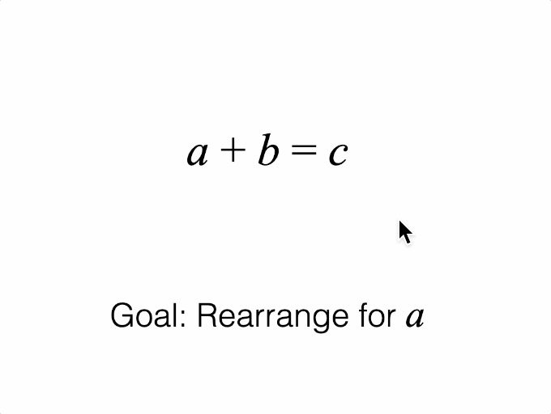

# Tutorial 12 - SlideNavigator Introduction

Navigate through several equation forms with descriptions.

>Note: This tutorial introduces the SlideNavigator by showing a verbose set of slide definitions to demonstrate what a slide is and how it is defined. The ~90 lines of code used for slide definitions will be reduced to 5 lines in the next tutorial which will demonstrate short-cut slide definitions.

Open `index.html` in a browser to view example.



## Code
`index.js`
```js
/* globals Fig */
const figure = new Fig.Figure();

// Figure consists of an equation and a description
const [eqn, description] = figure.add([
  {
    name: 'eqn',
    make: 'equation',
    formDefaults: { alignment: { xAlign: 'center' } },
    forms: {
      0: ['a', '_ + ', 'b_1', '_ = ', 'c'],
      1: ['a', '_ + ', 'b_1', '_ - b_2', '_ = ', 'c', '_ - ', 'b_3'],
      2: ['a', '_ = ', 'c', '_ - ', 'b_3'],
    },
    formSeries: ['0', '1', '2'],
    mods: {
      isTouchable: true,
      touchBorder: 0.1,
    },
  },
  {
    name: 'description',
    make: 'primitives.textLines',
    modifiers: {
      a: { font: { family: 'Times New Roman', style: 'italic', size: 0.12 } },
      b: { font: { family: 'Times New Roman', style: 'italic', size: 0.12 } },
    },
    xAlign: 'center',
    font: { size: 0.1 },
    position: [0, -0.5],
  },
]);

// Slides define a a figure state, and an animated transition between
// consecutive states. Each slide should define state compleletly and not
// depend on state from other slides. That way jumping between slides will not
// produce unexpected behavior.
const slides = [
  // Slide 0
  {
    show: [eqn, description],
    steadyState: () => {
      eqn.showForm('0');
      description.custom.updateText({ text: 'Goal: Rearrange for |a|' });
    },
  },

  // Slide 1
  {
    show: [eqn, description],
    enterState: () => {
      eqn.showForm('0');
      description.custom.updateText({ text: 'Goal: Rearrange for |a|' });
    },
    transition: (done) => {
      description.animations.new()
        .dissolveOut(0.5)
        .trigger({
          callback: () => description.custom.updateText({
            text: 'Subtract |b| from both sides',
          }),
        })
        .dissolveIn(0.5)
        .whenFinished(done)
        .start();
    },
    steadyState: () => {
      description.custom.updateText({ text: 'Subtract |b| from both sides' });
    },
  },

  // Slide 2
  {
    show: [eqn, description],
    enterState: () => {
      eqn.showForm('0');
      description.custom.updateText({ text: 'Subtract |b| from both sides' });
    },
    transition: (done) => {
      eqn.animations.new()
        .goToForm({ target: '1', animate: 'move' })
        .whenFinished(done)
        .start();
    },
    steadyState: () => {
      eqn.showForm('1');
    },
  },

  // Slide 3
  {
    show: [eqn, description],
    enterState: () => {
      eqn.showForm('1');
      description.custom.updateText({ text: 'Subtract |b| from both sides' });
    },
    transition: (done) => {
      description.animations.new()
        .dissolveOut(0.5)
        .trigger({
          callback: () => description.custom.updateText({
            text: '|b| cancels on left side',
          }),
        })
        .dissolveIn(0.5)
        .whenFinished(done)
        .start();
    },
    steadyState: () => {
      description.custom.updateText({ text: '|b| cancels on left side' });
    },
  },

  // Slide 4
  {
    show: [eqn, description],
    enterState: () => {
      eqn.showForm('1');
      description.custom.updateText({ text: '|b| cancels on left side' });
    },
    transition: (done) => {
      eqn.animations.new()
        .goToForm({ target: '2', animate: 'move' })
        .whenFinished(done)
        .start();
    },
    steadyState: () => {
      eqn.showForm('2');
    },
  },
];

// Create a slide navigator. If slides aren't provided it will auto generate
// slides from the equation form series.
const nav = new Fig.SlideNavigator({ collection: figure.elements, slides });
nav.goToSlide(0);

// Clicking on the equation progresses to the next slide, or next equation form
eqn.notifications.add('onClick', () => nav.nextSlide());
```

## Explanation

### Introduction
It is sometimes useful to break down a visualization into easier to consume parts.

For example, a complex figure or concept can be made easier if built up from a simple begining. Each step along the way might change the elements within the figure, or the form of an equation, and be accompanied by a corresponding description giving context, reasoning or next steps.

An analogy to this is a story or presentation, where each step along the way is a presentation slide.

The [SlideNavigator](https://airladon.github.io/FigureOne/api/#slidenavigator) class provides a convenient way to define slides and step through them.

### State

A FigureOne diagram may contain numerous <a href="#figureelement">FigureElement</a>s arranged in a hierarchy of collections that group elements.

Each <a href="#figureelement">FigureElement</a> has properties that define how it behaves and is displayed, such as its visibility, color, transform, current or pending animations, and its behavior when touched or moved. These properties change over time, such as with animations and interactive actions from the user. We use the term 'state' to describe a snapshot of these property values at some instant in time. As such, individual FigureElements can have a state, and the state of all elements together is called the Figure state.

[SlideNavigator](https://airladon.github.io/FigureOne/api/#slidenavigator) is essentially a Figure state manager. Each slide fully defines the state of a figure, and is independent of the current figure state. Therefore if you go to a specific slide, the Figure will always be set to the same state, no matter what it was beforehand.

### Slide Progression

[SlideNavigator](https://airladon.github.io/FigureOne/api/#slidenavigator) slides progress through several states as they go from one slide to another.

A simplified slide progress example for going from slide 3 to slide 4 is:

* `leaveState` (slide 3)
* All elements in figure hidden
* `show` (slide 4)
* `enterState` (slide 4)
* `transition` (slide 4)
* `steadyState` (slide 4)

`leaveState`, `show`, `enterState`, `transition` and `steadyState` can each be defined (if needed) in a slide definition as a function that sets up the figure state for that time in the life cycle. Note, that `transition` will only be executed when transitioning to the next (adjacent forward) slide.

For example, the first slide in the tutorial is:

```js
  {
    show: [eqn, description],
    steadyState: () => {
      eqn.showForm('0');
      description.custom.updateText({ text: 'Goal: Rearrange for |a|' });
    },
  },
```

This slide simply defines which elements to show on this slide. It doesn't have a `transition`, so either `enterState` or `steadyState` can be used to set the figure state. In this case `steadyState` is used to set the equation form, and description.

Once a slide has reached steady state, the SlideNavigator pauses and waits for the next slide command. This is the best time to allow user interaction with the figure.

### Slides from Tutorial above

Slide 0 is discussed above.

Slide 1 is then:

```js
// Slide 1
  {
    show: [eqn, description],
    enterState: () => {
      eqn.showForm('0');
      description.custom.updateText({ text: 'Goal: Rearrange for |a|' });
    },
    transition: (done) => {
      description.animations.new()
        .dissolveOut(0.5)
        .trigger({
          callback: () => description.custom.updateText({
            text: 'Subtract |b| from both sides',
          }),
        })
        .dissolveIn(0.5)
        .whenFinished(done)
        .start();
    },
    steadyState: () => {
      description.custom.updateText({ text: 'Subtract |b| from both sides' });
    },
  },
```

We start by showing the `eqn` and `description` elements
```js
    show: [eqn, description],
```

`enterState` is an oppotunity to setup the figure state for before the transition. In this case we are showing form '0' of the equation and making sure the description has text that is the same to the prior slide 0.

```js
    enterState: () => {
      eqn.showForm('0');
      description.custom.updateText({ text: 'Goal: Rearrange for |a|' });
    },
```

`transition` defines the animation leading into this slide. It is only called when progressing from the previous slide (slide 0) and will not be called if coming to this slide from any other slide. Therefore any state set in `transition` will need to be set in `steadyState` as well to handle the case where `transition` is not called.

The `done` method is passed to the transition function and must be called when the transition is finished to progress to `steadyState`.

In this transition, the description is dissolving out, being repopulated with updated text, and then dissolving back in.

```js
    transition: (done) => {
      description.animations.new()
        .dissolveOut(0.5)
        .trigger({
          callback: () => description.custom.updateText({
            text: 'Subtract |b| from both sides',
          }),
        })
        .dissolveIn(0.5)
        .whenFinished(done)
        .start();
    },
```

When the tranisition is finished, `steadyState` is used to define what the end point of the transition should be if navigating to the slide from a slide not immediately before it.


```
    steadyState: () => {
      description.custom.updateText({ text: 'Subtract |b| from both sides' });
    },
```

Slide 3 is essentially the same logic as slide 1, as it's purpose is also to update the description.

Slide 2 and 4 are similar to Slide 1 and 3, except they are updating the equation instead of the description.

### Loading the SlideNavigator

First the SlideNavigator is instantiated with a figure collection it is to operate on (in this case the root collection `figure.elements`), and the defined `slides`.

```js
const nav = new Fig.SlideNavigator({ collection: figure.elements, slides });
```

The figure collection will often be the root figure collection, but does not need to be. All automated logic in SlideNavigator will be operated on the figure collection.

For example, the step where the SlideNavigator hides all elements, will be performed on the figure collection. Any collections that are parents of the defined collection will not be impacted.

Also, whenever SlideNavigator looks for elements defined with strings, it will use the path of the defined collection as the base path.

For example, in each slide we used the `eqn` and `description` instantiated elements directly. We could similarly have said:

```js
    show: ['eqn', 'description'],
```

As these are the names of the elements in the collection tied to the SlideNavigator. In fact, there are several ways to define an element using [TypeElementPath](https://airladon.github.io/FigureOne/api/#typeelementpath). For this simple example, it doesn't really matter either way, but for more complex figures with many elements or many layers of elements, using string or object definitions for element paths can clean up code significantly.


Next, we initialize the SlideNavigator to show the first slide:
```js
nav.goToSlide(0);
```

Finally, we make it so the navigator progresses to the next slide every time the equation is touched.

```js
eqn.notifications.add('onClick', () => nav.nextSlide());
```

### It Gets Easier

This tutorial used complete slide definitions, which demonstrates the intent in defining slides generally.

These slide definitions are robust, but verbose, and a lot of the information in slide definitions is duplicated. Therefore SlideNavigator has a number of slide definitions options that can greatly reduce the verbosity without reducing the robustness. To understand them however, it is important to understand the intent in defining a slide.

The next tutorial will cover some of these options, but as an example the above slide definitions could be reduced to just 5 lines (instead of >90):

```js
const slides = [
  { form: '0', text: 'Goal: Rearrange for |a|' },
  { text: 'Subtract |b| from both sides' },
  { form: '1' },
  { text: '|b| cancels on left side' },
  { form: '2' },
];
```

When the equation and description elements are input into the SlideNavigator:

```js
const nav = new Fig.SlideNavigator({
  collection: figure.elements,
  slides,
  equation: eqn,
  text: description,
});
```