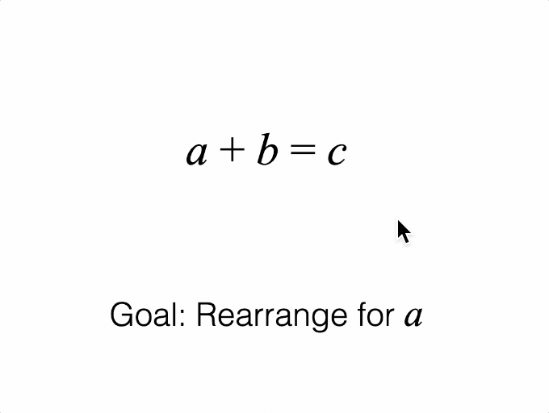

# Tutorial 13 - SlideNavigator Equation Shortcuts

Navigate through several equation forms with descriptions.

>Note: This tutorial outputs the same result as the last tutorial, but reduces the slide definition block of code from over 90 lines to just 5.

Open `index.html` in a browser to view example.



## Code
`index.js`
```js
const figure = new Fig.Figure();

// Figure consists of an equation and a description
const [eqn, description] = figure.add([
  {
    make: 'equation',
    formDefaults: { alignment: { xAlign: 'center' } },
    forms: {
      0: ['a', '_ + ', 'b_1', '_ = ', 'c'],
      1: ['a', '_ + ', 'b_1', '_ - b_2', '_ = ', 'c', '_ - ', 'b_3'],
      2: ['a', '_ = ', 'c', '_ - ', 'b_3'],
    },
    formSeries: ['0', '1', '2'],
    mods: {
      isTouchable: true,
      touchBorder: 0.1,
    },
  },
  {
    make: 'primitives.textLines',
    modifiers: {
      a: { font: { family: 'Times New Roman', style: 'italic', size: 0.12 } },
      b: { font: { family: 'Times New Roman', style: 'italic', size: 0.12 } },
    },
    xAlign: 'center',
    font: { size: 0.1 },
    position: [0, -0.5],
  },
]);

// The SlideNavigator will automatically animate equations and a text element.
// If `form` and `text` properties are the same for consecutive slides, they
// only need to be defined in the first slide.
const slides = [
  { form: '0', text: 'Goal: Rearrange for |a|' },
  { text: 'Subtract |b| from both sides' },
  { form: '1' },
  { text: '|b| cancels on left side' },
  { form: '2' },
];

// Create a slide navigator
const nav = new Fig.SlideNavigator({
  collection: figure.elements,
  slides,
  equation: eqn,
  text: description,
});
nav.goToSlide(0);

// Clicking on the equation progresses to the next slide, or next equation form
eqn.notifications.add('onClick', () => nav.nextSlide());


```

## Explanation

### Common Properties
It is good practice to ensure each slide defines the full state of a figure, and does not rely on the current state. This way users can jump between slides in any order.

However, while this approach will yield a good user experience, developing many slides, complex figures or numerous equation forms can make slide definition verbose. Even though each slide is different, many slides may share largely the same state, all of which needs to be explicitly defined for each slide.

[SlideNavigator](https://airladon.github.io/FigureOne/api/#slidenavigator) tries to improve this by providing some properties that can be defined once, and shared between slides. If a slide doesn't define a *common property*, then it will use the definition in the last slide that defined it. SlideNavigator will automatically copy shared or *common properties* to other slides. This way the slides are still fully defined and independant, but require a lot less code to define. 

The two *common properties* covered in this tutorial are `form` and `text`. The next tutorial will look at additional *common properties*.

### Equation Navigation

[SlideNavigator](https://airladon.github.io/FigureOne/api/#slidenavigator) provides an easy way to navigate between forms of an equation and an accompanying description of the steps between forms.

It will automatically dissolve text out and in when it changes, and animate equations between forms.

For this to work, an equation element and text element need to be tied to it:

```js
const nav = new Fig.SlideNavigator({
  collection: figure.elements,
  slides,
  equation: eqn,
  text: description,
});
```

The `form` and `text` properties of a slide then define the equation form, and text element's text.

For instance, the first slide is:

```js
const slides = [
  { form: '0', text: 'Goal: Rearrange for |a|' },
  ...
];
```

This sets the equation to form '0' on the first slide, and defines the text to use.

Note, we do not need to use the `show` property to show the `eqn` and `description` elements. When `form` and `text` are defined, then SlideNavigator will automatically show them.

The second slide is then:
```js
  { text: 'Subtract |b| from both sides' },
```

As the second slide has the same form as the first slide, and `form` is a *common property*, then `form` does not need to be defined. SlideNavigator will automatically copy the `form` property from the previous slide.

This slide updates the text of the `description` by using the `text` property. SlideNavigator will automatically create a dissolveOut then dissolveIn `transition` with the new text, and set the desired text at `steadyState`.

The third slide is:
```js
  { form: '1' },
```

On this slide, only the equation form is updated. `text` is a *common property* and so SlideNavigator uses the prior slides text. It also creates a `transition` animating the equation from form '0' to form '1', and set form '1' at steady state.

The remaining slides are similar to the prior 2.
