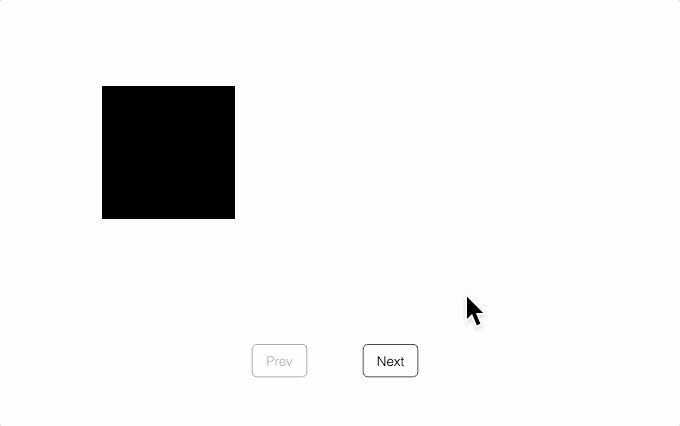

# Tutorial 14 - SlideNavigator Shortcuts

Use a SlideNavigator to progress through several arrangements of two squares.

Open `index.html` in a browser to view example.



## Code
`index.js`
```js
const figure = new Fig.Figure();

// Figure has two squares and a slide navigator. Slides will dissolve in,
// dissolve out, move and rotate squares
const [sq1, sq2] = figure.add([
  {
    name: 'sq1',
    method: 'primitives.rectangle',
    options: {
      width: 0.4, height: 0.4, position: [-0.5, 0.5],
    },
  },
  {
    name: 'sq2',
    method: 'primitives.rectangle',
    options: {
      width: 0.4, height: 0.4, position: [0.5, 0.5],
    },
  },
  {
    name: 'nav',
    method: 'collections.slideNavigator',
  },
]);

// Helper function to set position and rotation of sq1 and sq2
const setPositionAndRotation = (sq1Pos, sq1Rot, sq2Pos, sq2Rot) => {
  sq1.setPosition(sq1Pos);
  sq1.setRotation(sq1Rot);
  sq2.setPosition(sq2Pos);
  sq2.setRotation(sq2Rot);
};

// Add slides to the navigator
figure.getElement('nav').loadSlides([
  // Slide 0
  {
    showCommon: 'sq1',
    enterStateCommon: () => setPositionAndRotation([-0.5, 0.5], 0, [0.5, 0.5], 0),
  },

  // Slide 1
  {
    transition: { in: 'sq2' },
  },

  // Slide 2
  // When using animation objects, the targets of animations will be
  // automatically set at steady state, so user does not need to set them
  {
    showCommon: ['sq1', 'sq2'],
    transition: { position: 'sq2', target: [0.3, 0.5], duration: 1 },
  },

  // Slide 3
  // Use an array of animation object definitions to create a sequence of steps
  {
    enterState: () => setPositionAndRotation([-0.5, 0.5], 0, [0.3, 0.5], 0),
    transition: [
      { position: 'sq1', target: [-0.3, 0.5], duration: 1 },
      { rotation: 'sq1', target: Math.PI / 4, duration: 1 },
      { rotation: 'sq2', target: Math.PI / 4, duration: 1 },
    ],
  },

  // Slide 4
  // Use an array within an array to create parallel steps
  {
    enterState: () => setPositionAndRotation([-0.3, 0.5], Math.PI / 4, [0.3, 0.5], Math.PI / 4),
    transition: [
      [
        { rotation: 'sq1', target: 0, duration: 1 },
        { rotation: 'sq2', target: 0, duration: 1 },
      ],
      [
        { position: 'sq1', target: [-0.5, 0.5], duration: 1 },
        { position: 'sq2', target: [0.5, 0.5], duration: 1 },
      ],
      { out: ['sq1', 'sq2'] },
    ],
  },
]);
```

## Explanation

### SlideNavigator Collection

The first two [SlideNavigator](https://airladon.github.io/FigureOne/api/#slidenavigator) tutorials manually created a SlideNavigator object, and tied its progress to clicking a FigureElement.

Most of the time, a [CollectionsSlideNavigator](https://airladon.github.io/FigureOne/api/#collectionsslidenavigator) FigureElementCollection element that has buttons, description text, and a [SlideNavigator](https://airladon.github.io/FigureOne/api/#slidenavigator) built in will be sufficient, and easier to define.

This tutorial uses the CollectionsSlideNavigator and the default 'Prev' and 'Next' buttons.

```js
  {
    name: 'nav',
    method: 'collections.slideNavigator',
  },
```

### Common Properties

The last tutorial introduced the concept of *common properties* in a slide definition.

The two common properties used in this tutorial are `enterStateCommon` and `showCommon`. These properties perform the same role as `enterState` and `show`, but are common.

With some properties, such as these two, it is useful to have both common and singular versions as often only some of the figure state changes between slides. This way the state that remains common can be defined just once, while the subsequent slides focus only on the changes.

### Animation Definitions with Objects

In the first [SlideNavigator](https://airladon.github.io/FigureOne/api/#slidenavigator) tutorial, each `transition` property was defined with a function like:

```js
    transition: (done) => {
      description.animations.new()
        .dissolveOut(0.5)
        .trigger({
          callback: () => description.custom.updateText({
            text: 'Subtract |b| from both sides',
          }),
        })
        .dissolveIn(0.5)
        .whenFinished(done)
        .start();
    },
```

The `transition` property is a hook to provide an animation into the `steadyState` of the slide. At the end of the animation, it must execute the `done` function so the SlideNavigator can proceed to `steadyState`.

Small slide transitions like dissolving old elements out and new elements in can be simple, but verbose in the repetitiveness in needing to do it for each slide.

A lot of the verbosity can be removed by defining animations with simple [objects](https://airladon.github.io/FigureOne/api/#obj_animationdefinition). The animation object has a key that defines which animation to use, and an associated [value](https://airladon.github.io/FigureOne/api/typeelementpath) that defines which elements to animate. The remaining keys of the object define the properties of the animation. In addition SlideNavigator uses animation objects to automatically show elements that are dissolving *out* before the transition, and automatically set target's of all animations at `steadyState`.

For example, let's say you have a figure with two elements `elem1` and `elem2`, and you are transitioning from a slide that only shows `elem1` to a slide that only shows `elem2`. For a smooth transition you might want to dissolve out `elem1` and dissolve in `elem2`. With a tranisition function the slide would look like:

```js
   {
    show: ['elem1'],
    transition: (done) => {
      figure.elements.animations.new()
        .dissolveOut({ element: 'elem1', duration: 0.5 })
        .dissolveIn({ element: 'elem2', duration: 0.5 })
        .whenFinished(done)
        .start();
    },
    steadyState: () => {
      figure.elements.getElement('elem1').hide();
      figure.elements.getElement('elem2').show();
    },
  },
```

With an animation object the slide can be simplified to:

```js
  {
    transition: [
      { out: 'sq1', duration: 0.5 },
      { in: 'sq2', duration: 0.5 },
    ],
  },
```

Note, we don't need a `show` property as SlideNavigator will automatically show `sq1` before the transition as it is dissolving out. We also don't need to hide `sq1` and show `sq2` at `steadyState` as SlideNavigator will set all animation targets at `steadyState`. SlideNavigator creates an animation and starts it from the animation objects and so lines like `...animations.new()`, `.whenFinished(done)` and `.start()` aren't needed.

As such, using animation definition objects makes a slide definition more succinct and easy to read.

Animation definition objects will likely provide sufficient functionality for most transitions. For very complicated animations, or for animations that require state set before they begin (and the state can't be set in `enterState` for some reason), then using a transition function is a fine backup.

### Slide Independance

These slides change the position and rotation of the two squares `sq1` and `sq2`. To make the slides independant of each other, each slide must have an `enterState` that defines the position and rotation of the squares before the transition, and a `steadyState` that defines them after.

### Slide 0

```js
  {
    showCommon: 'sq1',
    enterStateCommon: () => setPositionAndRotation([-0.5, 0.5], 0, [0.5, 0.5], 0),
  },
```

The first two slides show `sq1`, so the *common property* `showCommon` can be used.

Similarly, the first two slides start with `sq1` and `sq2` with the same positions and rotations. The helper method `setPositionAndRotation` sets the positions and rotations of the two squares, so it can be used with `enterStateCommon` to define the positions and rotations for the first two slides.

As there is no transition for this slide, then `steadyState` is executed straight after `enterState`, with no changes in state between. Therefore, no `steadyState` is needed to set position and rotation.

### Slide 1

```js
  {
    transition: { in: 'sq2' },
  },
```

Slide 1 then dissolves in `sq2`.

No `show` property is needed as:

* the `showCommon` property from slide 0 is already defining `sq1` to be shown
* SlideNavigator will automatically show elements dissolving in for `transition` when an animation definition object is used.

No `enterState` is needed as the *common property* `enterStateCommon` can be used from the prior slide.

Now `steadyState` is needed as SlideNavigator will automatically show `sq2` from the animation definition object in `transition` and the positions and rotations of the squares do not change in the transition.

### Slide 2

```js
  {
    showCommon: ['sq1', 'sq2'],
    transition: { position: 'sq2', target: [0.3, 0.5], duration: 1 },
  }
```

In this slide, the `sq2` element moves to the left.

This slide starts with the squares in the same two positions as slides 0 and 1, and so `enterStateCommon` is once again sufficient from slide 0.

`steadyState` is not needed to set the final position of `sq2` as SlideNavigator will automatically set animation targets at `steadyState` when animation definition objects are used in `transition`.

`showCommon` is updated to include both squares now, and this will be used for the remainder of the slides.

### Slide 3

```js
  {
    enterState: () => setPositionAndRotation([-0.5, 0.5], 0, [0.3, 0.5], 0),
    transition: [
      { position: 'sq1', target: [-0.3, 0.5], duration: 1 },
      { rotation: 'sq1', target: Math.PI / 4, duration: 1 },
      { rotation: 'sq2', target: Math.PI / 4, duration: 1 },
    ],
  },
```

This slide sequentially moves `sq1` to the right, then rotates `sq1` a quarter turn, and then similarly rotates `sq2`.

`enterState` is required to update the new starting position of the elements. Note, in this slide `enterStateCommon` from slide 0 with the initial positions and rotations of the squares is still executed, but `enterState` will execute after `enterStateCommon`. As in this case both `enterStateCommon` and `enterState` operate on the same set of elements, `enterState` will effectively overwrite `enterStateCommon`. In more complex figures, `enterState` would be often be used to only update some of the state set by `enterStateCommon`.

Serial animations can be achieved by putting the animation definition objects in an array.

Once again `steadyState` is not required to set final state of the squares as SlideNavigator will set all animation targets at `steadyState`.

### Slide 4

```js
  {
    enterState: () => setPositionAndRotation([-0.3, 0.5], Math.PI / 4, [0.3, 0.5], Math.PI / 4),
    transition: [
      [
        { rotation: 'sq1', target: 0, duration: 1 },
        { rotation: 'sq2', target: 0, duration: 1 },
      ],
      [
        { position: 'sq1', target: [-0.5, 0.5], duration: 1 },
        { position: 'sq2', target: [0.5, 0.5], duration: 1 },
      ],
      { out: ['sq1', 'sq2'] },
    ],
  },
```

This slide is an example of how to create parallel animation steps with animation definition objects.

The outer array of `transition` defines serial animation steps, but any arrays of animation definition objects within this array will be parallel animation steps.

### Other Common Properties

The last two tutorials of [SlideNavigator](https://airladon.github.io/FigureOne/api/#slidenavigator) have shown four common properties available in slide definitions: `enterStateCommon`, `showCommon`, `form` and `text`.

A full list of common properties available in [SlideNavigator](https://airladon.github.io/FigureOne/api/#slidenavigator) is:

* `showCommon`
* `hideCommon`
* `scenarioCommon`
* `enterStateCommon`
* `steadyStateCommon`
* `form`
* `fromForm`
* `leaveStateCommon`

For details on each of these and the order in which they are executed in a slide progression see [OBJ_SlideNavigatorSlide](https://airladon.github.io/FigureOne/api/#obj_slidenavigatorslide).