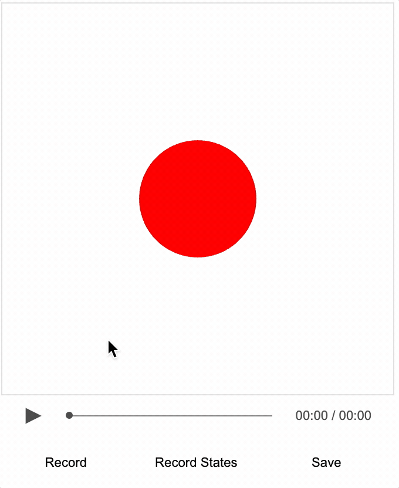

# Tutorial 15 - Recorder

Use the [Recorder](https://airladon.github.io/FigureOne/api/#recorder) class to create an interactive video from an interactive figure, recorded mouse movements and an audio track.

As loading local images into a html can be prevented by web browser security settings, this example needs to be loaded from a web server.

You can create a local web server and host the tutorial by first cloning the repository:

```bash
git clone https://github.com/airladon/FigureOne
```

Then, from the repository root, start the development container (you will need to install Docker if you don't have it already):
```bash
./start.sh
```

The container will start and present a command prompt. You can start a http-server by typing:
```bash
http-server
```

You can then open a browser and go to `http://localhost:8080/docs/tutorials/15%20-%20Recorder%20Introduction/index.html`.




### Recorder

With FigureOne, you can create a figure that can be both interactive and animated. 

The evolution of this is interactive video, enabled by the [Recorder](https://airladon.github.io/FigureOne/api/#recorder) class. For something to be video-like, it needs to have visual content, audio, and the ability to play, pause, stop and seek. The recorder class can:

* record and playback events, such as function calls, mouse movements, mouse clicks and slide navigation - these can either be recorded by a user, or programmed for specific times
* overlay an audio track on playback
* record entire figure state at regular intervals (like 1 second) as seek frames for the video
* allow user to pause video at any time and interact with the figure in its current state - on resuming playback, the figure will revert to its paused state

As such, the animation in FigureOne can be overlaid with audio to create a video like experience. Except in this case, content on the screen can be just as rich and interactive as that created normally with FigureOne.

### Files

The files in this tutorial are split into two categories:

* Playback and recording controls user interface and logic (in the `controls` folder)
* Interactive video content (in the root folder)

### Playback and Recording Controls

The playback and recording controls show how to interface a HTML usier interface to [Recorder](https://airladon.github.io/FigureOne/api/#recorder). These controls are content independant, and once you've got something you like, you can reuse them indefinitely.

All files related to these controls are in the `controls` folder in this tutorial.

* `pause.svg` and `play.svg` are icons for the play/pause button
* `player.js` creates playback controls including the play/pause button, seek bar and time annotation
* `recorder.js` creates recorder controls
* `controls.css` provides the styling for the player and recorder controls

The `README.md` file in the `controls` folder describes how the player and recorder controls work. As most people will likely reuse this player and recorder, the explanations are separated from introducing how to make interactive video content.

### Interactive Video

This tutorial covers a simple interactive video that describes and demonstrates an interactive figure.

After an interactive figure is made, mouse movements and clicks are recorded in sync with an audio track.

#### Figure

`figure.js` contains the code for making the interactive figure.

```js
const figure = new Fig.Figure();

figure.add({
  name: 'ball',
  method: 'primitives.polygon',
  options: {
    radius: 0.3,
    sides: 100,
    color: [1, 0, 0, 1],
  },
  mods: {
    isMovable: true,
    move: { bounds: 'figure' },
  },
});
```

The figure is very simple, just a single shape that can be moved and is limited to the boundary of the figure (meaning it will bounce off the walls). Such a simple figure doesn't need an interactive video to describe it, but it is a good demonstrator for the steps required in making an interactive video.


Once the figure is setup, we load the audio and interactive video data which includes the seek states, and mouse events. The next section will show how to record this data.

```js
// Load audio, states and events data
figure.recorder.loadAudio(new Audio('./audio.mp3'));
figure.recorder.fetchAndLoad('./ivid.json');
```

#### Recording

An interactive video usually includes:

* An interactive figure
* An audio track
* Recorded mouse events (like clicks and movements)
* Triggered events like animations or figure state changes

In this tutorial we will focus just on the first 3.

`Recorder` allows recording of mouse and touch events for touching and movement. To do recording both `player.js` and `recorder.js` need to be used and the recorder needs to be visible by making sure `controls.css` has the css class or class properties `comment_out_to_show_recorder` commented out.

```css
.comment_out_to_show_recorder {
  /* display: none; */
}
```

To make a recording of the mouse movements then:
* Press `record` button (or use the 'r' key on the keyboard)
* Show cursor by pressing the 'c' key on the keyboard
* Touch and drag the shape
* Hide the cursor by pressing the 'c' key again on the keyboard
* Press `pause` button to stop recording (or use the 'r' again key on the keyboard)
* Seek back to the begining
* Press the `play` button to review the recording


In longer recordings, you might want to re-record over sections. Just seek to the time you want to start re-recording, press `record` and when you're done press `pause`.

When you are happy with the recording, press the `save` button. A json file with the mouse events and seek states will be saved, which you can then rename to `ivid.json` and load in the future with the line from `figure.js`:

```js
figure.recorder.fetchAndLoad('./ivid.json');
```

#### Audio

Use your normal audio recording software to make an audio track. For example, if using a Mac then GarageBand is a fine default option.

You can record audio before, during or after the mouse recording - whatever you prefer with your process.

If you record a track before hand, then you can load it with have it availble during the mouse recording. When you press `record` the audio track will play and you can synchronize the mouse events with the audio. Load the audio recording in `figure.js` with:

```js
figure.recorder.loadAudio(new Audio('./audio.mp3'));
```

Alternately, you can record audio while you are recording the mouse movements. An easy way synchronize the audio in this scenario is:

* Have browser window open next to audio software window
* Start recording audio
* Make a sound just before you press the `record` button in the browser
* Record your mouse movements with your audio
* Press `pause` in the browser and then make a sound
* Stop the audio recording, and clip the audio to between the start and stop sounds

If on the other hand you prefer to record the curor first and then the audio, then load the cursor recording in `figure.js` with and play the recording while talking over it.

```js
figure.recorder.fetchAndLoad('./ivid.json');
```

### Deploy

Once you've finished your interactive video you can deploy it.

In the HTML, you can remove two of the files being loaded:

* `content/recorder.js`
* `[hash].worker.js`

Both are only needed during recording and are not required for playback.

### This video is interactive

The video created here is interactive. That means at any point in the video, the person watching it can move the ball themselves.

When they do, `Recorder` will automatically pause the video playback and save the current state of the figure. When the user presses play again, `Recorder` will reload the paused state and resume playback.
