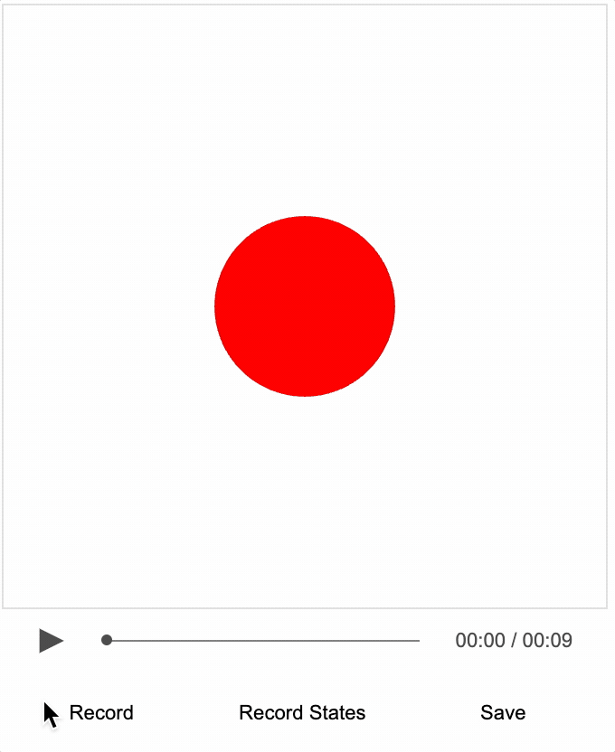
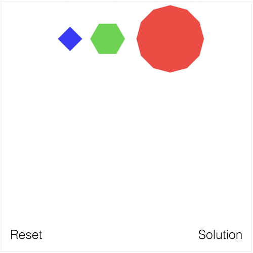
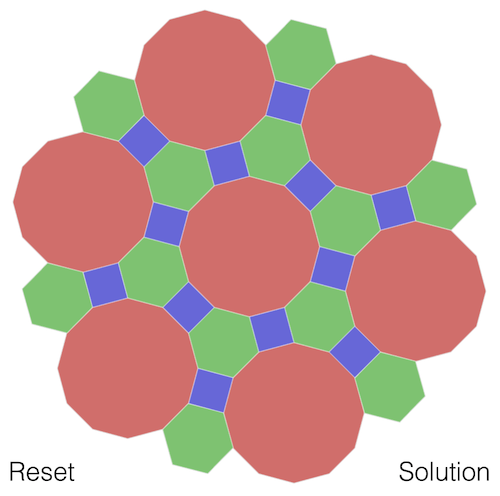

# Tutorial 15 - Recorder

Use the [Recorder](https://airladon.github.io/FigureOne/api/#recorder) class to create an interactive video.

Open `index.html` in a browser to view example.



### Recorder

With FigureOne, you can create a figure that can be both interactive and animated. 

Using [SlideNavigator](https://airladon.github.io/FigureOne/api/#slidenavigator) you can create a story with the figure by progressing the figure through numerous states. These states are like the slides of a presentation, where the user typically progresses through them at their convenience. Each slide can be animated and interactive, making for an immersive experience.

The evolution of this is interactive video, enabled by the [Recorder](https://airladon.github.io/FigureOne/api/#recorder) class. For something to be video-like, it needs to have visual content, audio, and the ability to play, pause, stop and seek. The recorder class can:

* record and playback events, such as function calls, mouse movements, mouse clicks and slide navigation - these can either be recorded by a user, or programmed for specific times
* overlay an audio track on playback
* record entire figure state at regular intervals (like 1 second) as seek frames for the video
* allow user to pause video at any time and interact with the figure in its current state - on resuming playback, the figure will revert to its paused state

As such, the animation in FigureOne can be overlaid with audio to create a video like experience. Except in this case, content on the screen can be just as rich and interactive as that created normally with FigureOne.

> ### State, Seeking and Pausing

> Video seeking and pausing is enabled by recording and setting figure state.

> A FigureOne diagram may contain numerous <a href="#figureelement">FigureElement</a>s arranged in a hierarchy of collections that group elements.

> Each <a href="#figureelement">FigureElement</a> has properties that define how it behaves and is displayed, such as its visibility, color, transform, current or pending animations, and its behavior when touched or moved. These properties change over time, such as with animations and interactive actions from the user. We use the term 'state' to describe a snapshot of these property values at some instant in time. As such, individual FigureElements can have a state, and the state of all elements together is called the Figure state.

> Part of creating a FigureOne interactive video, is to record figure state at regular intervals. These states are the seek frames. As a user is scrubbing through a video with the seek bar, the figure will be set into the state closest to the seek time. When play is pressed, the video will resume from this state.

> Video pausing can happen at any time. Therefore, on pause, the figure state is captured and saved. If the figure is interacted with, and its state changes, then when play is resumed the pause state will be reloaded and playback will resume.

### Files

The files in this tutorial are split into two categories:

* Playback and recording controls user interface and logic (in the `controls` folder)
* Interactive video content (in the root folder)

### Playback and Recording Controls

The playback and recording controls show how to interface a player GUI to [Recorder](https://airladon.github.io/FigureOne/api/#recorder). These controls are content independant, and once you've got something you like, you can reuse them indefinitely.

All files related to these controls are in the `controls` folder in this tutorial.

* `pause.svg` and `play.svg` are icons for the play/pause button
* `player.js` creates playback controls including the play/pause button, seek bar and time annotation
* `recorder.js` creates recorder controls
* `controls.css` provides the styling for the player and recorder controls

The `README.md` file in the `controls` folder describes how the player and recorder controls work. As most people will likely reuse this player and recorder, the explanations are separated from introducing how to make interactive video content.

### Interactive Video

This tutorial covers a simple interactive video that describes and demonstrates an interactive figure.

The user is presented with some polygons:



 that they need to tile into a surface:
 
 

 The polygons can be moved and rotated to create a tiling with no spaces or overlaps.

After an interactive figure is made, mouse movements and clicks are recorded in sync with an audio track, that demonstrate how to interact with the figure so the user can then find the solution to the problem.

#### Figure

`index.js` contains the code for making the interactive figure.

First two helper functions are made to create the elements within the figure.

The first helper function makes a simple text button. This figure will have two text buttons, a 'reset' and 'solution' button. With the exception of their names, text and positions, the properties of these buttons are the same, and so a helper function means we only need to define these properties once.

```js
// Helper function to make buttons
function button(name, text, position) {
  return {
    name,
    method: 'primitives.text',
    options: {
      text, position, xAlign: 'center', font: { size: 0.1 },
    },
    mods: { isTouchable: true, touchBorder: 0.1 },
  };
}
```

Note, these text elements are touchable, with a `touchBorder` of 0.1 units around the text.

The next helper function creates a polygon. Each polygon is a collection of three elements:
* A `fill` element that shows the shape, and when rotated will rotate the collection
* A `movePad` element that is the same shape as the polygon, but 70% of the radius. This element is invisible, but will move the collection when it is moved
* A `border` element that will draw a small white border around the shape so shapes can be easily distinguished from each other

```js
// Helper function to make polygons
function makePolygon(
  name, radius, color, sides, resetPosition, solutionPosition, solutionRotation,
) {
  return {
    name,
    method: 'collection',
    elements: [
      {
        name: 'fill',
        method: 'primitives.polygon',
        options: { radius, color, sides },
        mods: {
          isMovable: true,
          move: { element: name, type: 'rotation' },
        },
      },
      {
        name: 'movePad',
        method: 'primitives.polygon',
        options: { radius: radius * 0.7, sides },
        mods: {
          isMovable: true,
          opacity: 0,
          move: { element: name },
        },
      },
      {
        name: 'border',
        method: 'primitives.polygon',
        options: {
          radius, sides, line: { width: 0.003 }, color: [1, 1, 1, 0.5],
        },
      },
    ],
    mods: {
      scenarios: {
        reset: { position: resetPosition, rotation: 0 },
        solution: { position: solutionPosition, rotation: solutionRotation },
      },
    },
  };
}
```

The `fill` and `movePad` elements are both made moveable using `isMovable: true`. This would normally mean the element itself moves when it is dragged by the user. However, elements that are movable can set the movement to happen to another element instead of itself by setting the property `move.element`. This is useful for making children elements move parent elements. Therefore, if we rotate the `fill` element, then actually the polygon collection (with all its elements) rotates. If we move the `movePad` element, then the polygon collection moves.

Each polygon can be customized with the input parameters to `makePolygon`. `name`, `radius`, `color` and `sides` (number of sides) are self explanatory. `resetPosition`, `solultionPosition` and `solutionRotation` are used to create several preset scenarios of position and rotation for the collection. The `reset` scenario is the position and rotation of the collection when the figure is loaded or reset. The `solution` scenario is the position and rotation of the element in the final solution.

Scenarios (defined with [OBJ_Scenario](https://airladon.github.io/FigureOne/api/#obj_scenario)) provide convenient ways to define preset transforms with elements. In this case we will have 31 polygons on the screen, each with a `reset` position/rotation and `solution` position/rotation.

When we want to move all elements to their `solution` position, we can simply call one animation that goes through all the elements in a collection and animates them to the defined preset:

```js
  figure.elements.animations.new()
    .scenarios({ target: 'solution', duration: 2 })
    .start();
```

Next we will create a helper function to create a group of polygons that have a related `reset` and `solution` positions and rotations. To do so, we can recognize that the final positions of all the polygons can be broken down into several groups of 6 polygons creating hexagons.

For example, looking at just the blue squares, we can see they are arranged in two hexagons. Therefore, we can calculate the positions and rotations of each square in the group from the radius of the hexagon (`startRadius`), the start angle of the first vertex (`startAngle`) and the start rotation (`startRotation`) of the element at the first vertex.

.

The radius of the hexagons comes from the apothems of the polygons the hexagon surrounds (the apothem is the distance between the center of a regular polygon and the perpendicular point on its side). Using the square examples again, the radius of the inner hexagon of squares is then:

`dodecagon apothem + square apothem`

and the radius of the outer hexagon of squares is:

`dodecagon apothem + hexagon apothem * 2 + square apothem`

where in this case hexgaon refers to the green hexagon shape.


```js
// Calculate the apothems of the shapes
// The apothem (a) is related to side length (s) and number of sides (n) by:
// s = 2*a*tan(180/n)
const sideLength = 0.14;
const a6 = sideLength / 2 / Math.tan(Math.PI / 6);   // apothem of hexagon
const a12 = sideLength / 2 / Math.tan(Math.PI / 12); // apothem of dodecagon
const a4 = sideLength / 2 / Math.tan(Math.PI / 4);   // apothem of square
const halfAng = Math.PI * 2 / 12 / 2;

// Helper function that greates a group of shapes within a common hexagon layout
function polygons(
  prefix, sides, color, count, startPosition, startRadius, startAngle, startRotation,
) {
  // Calculate polygon radius from side length
  const radius = sideLength / 2 / Math.sin(Math.PI / sides);
  // Create the polygons
  const shapes = [];
  for (let i = 0; i < count; i += 1) {
    const sAng = (startAngle - 1) * halfAng * 2 + halfAng + i * Math.PI * 2 / 6;
    const solutionPosition = [
      startRadius * Math.cos(sAng), startRadius * Math.sin(sAng),
    ];
    const solutionRotation = startRotation + i * Math.PI * 2 / 6;
    shapes.push(makePolygon(`polygon${prefix}${sides}_${i}`, radius, color, sides, startPosition, solutionPosition, solutionRotation));
  }
  return shapes;
}
```

Now, we can add all the elements to the figure using the helper function for the polygons and buttons. Note the order of definition ensures the largest shapes are on the bottom, and the buttons are on the top.

```js
const red = [1, 0, 0, 0.8];
const blue = [0, 0, 1, 0.8];
const green = [0, 0.8, 0, 0.8];
const pi = Math.PI;

figure.add([
  ...polygons('a', 12, red, 1, [0.35, 0.7], 0, 0, 0),
  ...polygons('b', 12, red, 6, [0.35, 0.7], a12 * 2 + a4 * 2, 2, 0),
  ...polygons('c', 6, green, 6, [-0.15, 0.7], a12 + a6, 1, pi / 4),
  ...polygons('d', 6, green, 6, [-0.15, 0.7], a12 + a6 * 3 + a4 * 2, 1, -pi / 12.5),
  ...polygons('e', 4, blue, 6, [-0.45, 0.7], a12 + a4, 2, 0),
  ...polygons('f', 4, blue, 6, [-0.45, 0.7], a12 + a6 * 2 + a4, 1, -pi / 6),
  button('solutionButton', 'Solution', [0.75, -0.9]),
  button('resetButton', 'Reset', [-0.8, -0.9]),
]);
```

Next we add the cursor that shows mouse movement and clicks during the recording
```js
figure.addCursor();
```

Next we can add the animations for moving all elements to the `reset` and `solution` scenarios and tie them to the `resetButton` and `solutionButton`. Note, whenever a button is clicked, we stop all the ongoing animations first.

```js
const solution = figure.getElement('solutionButton');
const reset = figure.getElement('resetButton');

solution.subscriptions.add('onClick', () => {
  figure.elements.stop();
  figure.elements.animations.new()
    .scenarios({ target: 'solution', duration: 2 })
    .start();
});

reset.subscriptions.add('onClick', () => {
  figure.elements.stop();
  figure.elements.animations.new()
    .scenarios({ target: 'reset', duration: 2 })
    .start();
});
```

Now we set the position of the elements to their initial positions (`reset` scenario).

```js
// First positions
figure.setScenarios('reset');
```

Once the figure is setup, we can load the audio and interactive video data which includes the seek states, and mouse events.
```js
// Load audio, states and events data
figure.recorder.loadAudio(new Audio('./audio.mp3'));
figure.recorder.fetchAndLoad('./ivid_data.json');
```

In the next section, we will see how to record the interactive video data.

#### 

