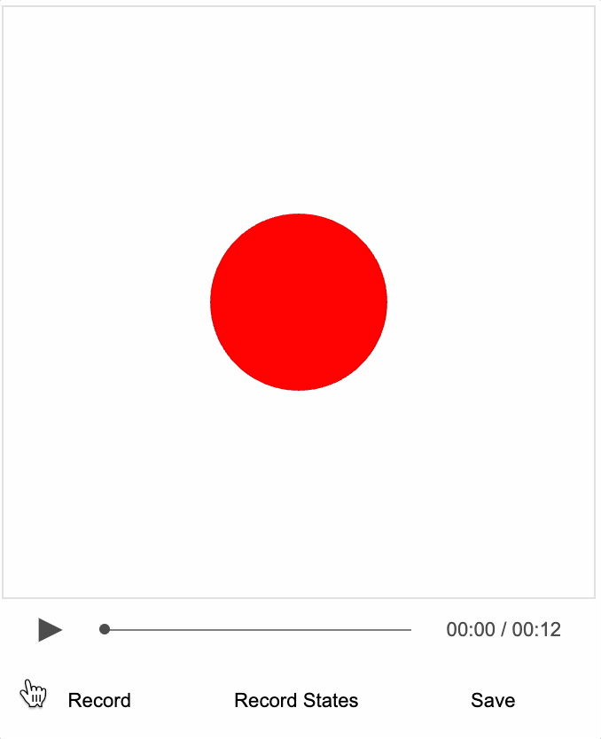

# Tutorial 16 - Recording Events

Create an interactive video similar to the last tutorial but also with recorded events.

As loading local images into a html can be prevented by web browser security settings, this example needs to be loaded from a web server.

You can create a local web server and host the tutorial by first cloning the repository:

```bash
git clone https://github.com/airladon/FigureOne
```

Then, from the repository root, start the development container (you will need to install Docker if you don't have it already):
```bash
./start.sh
```

The container will start and present a command prompt. You can start a http-server by typing:
```bash
http-server
```

You can then open a browser and go to `http://localhost:8080/docs/tutorials/15%20-%20Recorder%20Introduction/index.html`.




### Description

In the last tutorial the [Recorder](https://airladon.github.io/FigureOne/api/#recorder) class was used to create an interactive video by recording mouse events on an interactive figure and overlaying an audio track.

In an interactive video it is also useful to execute events like animations. Events can either be initiated manually during recording and recorded like mouse movements, or can be preplanned. This tutorial will look at events that are initiated manually.

### FunctionMap

FigureOne's video track is stored as text in json format. Therefore events, and any associated metadata like the time they should be executed, must be stringify-able. So how can you convert a function that initiates an animation to string?

FigureOne has a [FunctionMap](https://airladon.github.io/FigureOne/api/#functionmap) class which is a map of identifier strings to functions. When the figure is first loaded, functions are defined and stored in the map. When the functions need to be executed, the string is passed to the `FunctionMap` which then executes the associated function. When the function execution is recorded, just the string id and any associated parameters (that are also stringify-able) are recorded.

The figure and each `FigureElement` within it has an `fnMap` property which is a local `FunctionMap`. Each `FunctionMap` also have a link to a global map of functions at `fnMap.global`. `FunctionMap` will first try to execute a method from its local map. If it doesn't exist, then it will try the global map.

Functions can be added to `FunctionMaps` with the `add()` method and executed with the `exec()` method.

For example, to add a function `toConsole` to a `FunctionMap` and then execute it while passing in a parameter you can:

```js
figure.fnMap.add('toConsole', s => console.log(s));
figure.fnMap.exec('toConsole', 'hello');
```

### Code

`figure.js` is the same as the last tutorial, with two functions added for pulsing and animating the ball.

```js
const ball = figure.getElement('ball');

figure.fnMap.add('pulse', () => {
  ball.pulse({ scale: 1.4, duration: 1.5 });
});

figure.fnMap.add('center', () => {
  ball.stop();
  ball.animations.new()
    .position({ target: [0, 0], duration: 1 })
    .start();
});

figure.shortcuts = {
  1: 'pulse',
  2: 'center',
};
```

The two functions are being added to figure's `FunctionMap`, and the function map names are added to `Figure.shortcuts` and associated with short cut keys of `'1'` and `'2'`.

Part of `recorder.js` from the last tutorial sets up keyboard stortcut control:

```js
  // Shortcut keys
  document.addEventListener('keypress', (event) => {
    const keyCode = String.fromCharCode(event.keyCode);
    if (keyCode === 'c') {
      figure.toggleCursor();
    } else if (keyCode === ' ' && recorder.state === 'recording') {
      recorder.stopRecording();
    } else if (keyCode === 'r') {
      toggleRecord();
    } else if (figure.shortcuts[keyCode] != null) {
      if (figure.recorder.state === 'recording') {
        figure.recorder.recordEvent('exec', [figure.shortcuts[keyCode]]);
      }
      figure.fnMap.exec(figure.shortcuts[keyCode]);
    }
  }, false);
```

In particular, the last `else if` statement searches `figure.shortcuts` for a key press code, and if it exists will first record an `exec` event in `recorder` (to be saved and played back in video), and then executes the event so it can be viewed during recording.

### Reocord Video

To make a recording of of this video:
* Press `Record` button (or use the 'r' key on the keyboard)
* Press the `1` key to pulse the shape as it is being introduced over audio
* Show cursor by pressing the 'c' key on the keyboard
* Touch and drag the shape
* Hide the cursor by pressing the 'c' key again on the keyboard
* Press the `2` key to return the shape to the center of the screen
* Press `Pause` button to stop recording (or use the 'r' again key on the keyboard)
* Seek back to the begining
* Press the `play` button to review the recording


Once you are happy with the recording, press `Save` to save the json video track which includes the events and seek states.
### Manually Editing Events

If you want to tweak an event after it has been recorded, you can edit it directly in the browser's console.

For Chrome this is in the menu 'View -> Developer -> JavaScript Console'. On Safari it is 'Develop -> Show JavaScript Console' (if the Develop option isn't available in the menu bar, then it needs to be turned on. Go to 'Preferences -> Advanced' and check 'Show Developer menu in menu bar').

From the browser JavaScript console type your figure name (in this case it is `figure`) followed by the path to the recorder events

```js
figure.recorder.events
```

You can then review the events that have been recorded, and edit them as you need to.

Once finished, press the `Save` button to save the json video track file.

> Note, this is not really an ideal way to do things - but it may be useful sometimes. Better yet would be to programatically plan the events, then modifying them will be part of your source files. This will be covered in the next tutorial.
