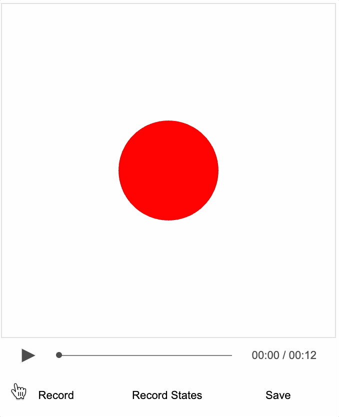

# Tutorial 17 - Recording Slides

Create an interactive video from recorded SlideNavigator progressions.

As loading local images into a html can be prevented by web browser security settings, this example needs to be loaded from a web server.

You can create a local web server and host the tutorial by first cloning the repository:

```bash
git clone https://github.com/airladon/FigureOne
```

Then, from the repository root, start the development container (you will need to install Docker if you don't have it already):
```bash
./start.sh
```

The container will start and present a command prompt. You can start a http-server by typing:
```bash
http-server
```

You can then open a browser and go to `http://localhost:8080/docs/tutorials/15%20-%20Recorder%20Introduction/index.html`.




### Description

In the last two tutorials, the [Recorder](https://airladon.github.io/FigureOne/api/#recorder) class was used to create an interactive video by recording mouse events and function calls initiating animations.

These tutorials had very simple figures, with just one element.

When you have much more complex figures with many elements that might be shown sometimes and not others, it is useful to use [SlideNavigator](https://airladon.github.io/FigureOne/api/#slidenavigator) to manage figure state.

In this tutorial, we will show how you can record SlideNavigator events.

### Code

The figure this time has two shapes, a ball and triangle, and a cursor.

```js
// Add movable ball and triangle to figure
figure.add([
  {
    name: 'ball',
    method: 'primitives.polygon',
    options: {
      radius: 0.3,
      sides: 100,
      color: [1, 0, 0, 1],
    },
    mods: {
      isMovable: true,
      move: { bounds: 'figure' },
    },
  },
  {
    name: 'triangle',
    method: 'primitives.triangle',
    options: {
      width: 0.5,
      height: 0.5,
      color: [0, 0, 1, 1],
    },
    mods: {
      isMovable: true,
      move: { bounds: 'figure' },
    },
  },
]);
```

We also add a cursor and a SlideNavigator (with no buttons)

```js
figure.addCursor();

const nav = figure.addSlideNavigator({
  nextButton: null, prevButton: null, text: null,
});
```

Next we define the slides. The first slide will show only the ball. The second slide will dissolve out the ball, and dissolve in the triangle.

```js
nav.loadSlides([
  {
    show: 'ball',
  },
  {
    transition: [
      { out: 'ball' },
      { in: 'triangle' },
    ],
  },
]);
```

Finally we will load the audio and video tracks (we will only load the video track if it is available - while recording it, you should comment out this line).

```js
figure.recorder.loadAudioTrack(new Audio('./audio-track.mp3'));
figure.recorder.loadVideoTrack('./video-track.json');
```

### Reocord Video

To make a recording of of this video:
* Press `Record` button (or use the 'r' key on the keyboard)
* Show cursor by pressing the 'c' key on the keyboard
* Touch and drag the shape
* Hide the cursor by pressing the 'c' key again on the keyboard
* Press the `n` key to progress to the next slide
* Show the cursor with 'c', touch and drag the shape around, and then hide the cursor with 'c'
* Press `Pause` button to stop recording (or use the 'r' again key on the keyboard)
* Seek back to the begining
* Press the `play` button to review the recording


Once you are happy with the recording, press `Save` to save the json video track which includes the events and seek states.

