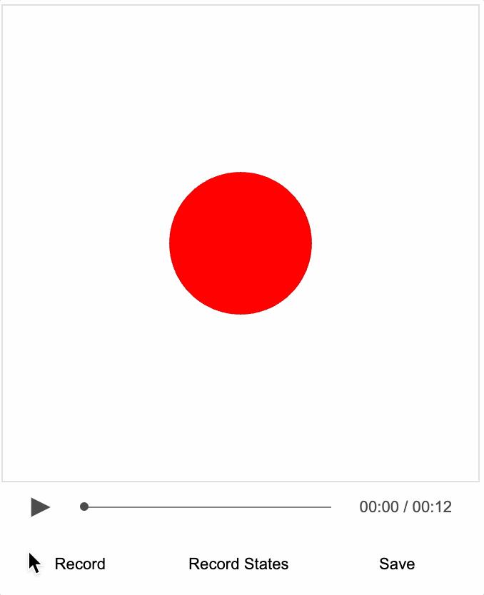

# Tutorial 18 - Recording Planned Events

Create an interactive video from with minimal manual recording

As loading local images into a html can be prevented by web browser security settings, this example needs to be loaded from a web server.

You can create a local web server and host the tutorial by first cloning the repository:

```bash
git clone https://github.com/airladon/FigureOne
```

Then, from the repository root, start the development container (you will need to install Docker if you don't have it already):
```bash
./start.sh
```

The container will start and present a command prompt. You can start a http-server by typing:
```bash
http-server
```

You can then open a browser and go to `http://localhost:8080/docs/tutorials/15%20-%20Recorder%20Introduction/index.html`.




### Description

In the last three tutorials, the [Recorder](https://airladon.github.io/FigureOne/api/#recorder) class was used to create an interactive video by recording mouse, function and slide events that were initiated manually during recording.

However, when doing a long video with lots of events it is more convenient to define in code the timing of events.

A [SlideNavigator](https://airladon.github.io/FigureOne/api/#slidenavigator) slide definition has several build in properties that allow for timed events:

* `time`: move to slide at defined time
* `delta`: time delta in seconds from last slide transition to transition to this slide
* `exec`: execute one or more functions at defined times
* `execDelta`: execute one or more functions at defined time deltas after the slide is displayed

`time` and `exec` can define times in either seconds, or in a `mm:ss.s` format.

When the slides are loaded, [SlideNavigator](https://airladon.github.io/FigureOne/api/#slidenavigator) will parse the slide definitions and create `_autoExec` and `_autoSlide` events based on the times. These events operate the same as `exec` and `slide` events, but will not be over-written during recording.

Note, the functions defined in `time`, `delta`, `exec` and `execDelta` must all be [FunctionMap](https://airladon.github.io/FigureOne/api/#functionmap) identifier strings of functions in the main figure's function map.


### Reocord Video

To make a recording of of this video:
* Press `Record` button (or use the 'r' key on the keyboard)
* Ball pulsing will happen automatically after 1.2s
* Show cursor by pressing the 'c' key on the keyboard
* Touch and drag the shape
* Hide the cursor by pressing the 'c' key again on the keyboard
* The slide will automatically transition at 6s
* Show the cursor with 'c', touch and drag the shape around, and then hide the cursor with 'c'
* Press `Pause` button to stop recording (or use the 'r' again key on the keyboard)
* Seek back to the begining
* Press the `play` button to review the recording


Once you are happy with the recording, press `Save` to save the json video track which includes the events and seek states.

### Recording Mouse

Recording mouse movements in a long video can be time consuming. Even though it is easy to record over incorrect movements (by seeking back to before they started, pressing record, and trying again), it may be required to re-load the figure numerous times as updates are made. Each time the figure is uploaded the recordings are lost, and so before each reload the current video-track needs to be saved over the current one, so it is available after reload.

Another way to do this is to use the code generation function in `Recorder` to output the mouse movements directly into the JavaScript console of the browser. These can then be copy and pasted into a JavaScript file that is loaded in the project during recording.

The method `genAutoMouseEvents()` will take any events in the `cursor`, `touch` or `cursorMove`, and output code that loads them into recorder as `_autoCursor`, `_autoTouch` and `_autoCursorMove` events. These events behave the same way, except they won't be over-written during recording.

In the tutorial above, if the `figure.recorder.genAutoMouseEvents()` is run, the following output will be generated:


```js
figure.recorder.loadEventData('_autoCursor', [
  [2.011, ['show', -0.36, -0.66]],
  [5.833, ['hide']],
  [7.2831, ['show', 0.48, -0.46]],
  [10.3235, ['hide']],
]);
figure.recorder.loadEventData('_autoTouch', [
  [3.0423, ['down', -0.02, -0.09]],
  [5.5746, ['up']],
  [8.1738, ['down', -0.03, 0.03]],
  [9.8417, ['up']],
]);
figure.recorder.loadEventData('_autoCursorMove', [2.24,-0.36,-0.66,3,1,1,3,1,1,1,0,1,2,2,2,3,1,3,3,1,3,2,1,1,2,1,1,3,1,1,2,2,2,4,3,5,2,2,2,3,1,3,2,2,2,2,1,1,3,3,3,2,2,2,2,1,1,2,1,2,2,1,1,2,1,1,2,1,2,2,1,1,2,0,2,2,1,1,2,0,1,2,1,2,2,0,1,3,0,2,2,1,2,2,0,2,2,0,1,2,0,1,18,-2,-1,2,-1,0,2,-2,-1,2,-2,0,2,-1,0,2,-2,-1,2,-1,0,2,-2,0,3,-2,-1,2,-2,0,2,-2,-1,2,-1,0,2,-1,-1,2,-2,0,3,-3,-2,2,-3,-1,2,-1,-1,3,-6,-3,2,-4,-2,2,-3,-2,3,-3,-1,3,-3,-3,2,-2,-1,2,-1,-1,3,-2,-2,3,-2,-3,2,-1,-3,2,-2,-3,3,0,-3,2,-1,-3,2,-1,-2,2,0,-2,2,-1,-2,3,0,-1,2,0,-2,2,0,-1,2,0,-1,2,0,-1,2,1,-1,2,1,-2,2,1,-1,3,1,-1,5,1,0,2,0,-1,3,1,0,2,2,0,2,2,-1,2,2,0,4,2,-1,1,2,0,2,2,0,2,3,0,2,3,-1,2,3,0,2,2,0,2,2,0,2,1,0,2,2,0,2,3,0,2,3,-1,1,1,0,3,3,0,1,1,0,2,3,0,2,3,0,3,3,0,1,1,0,2,4,0,2,5,0,2,4,0,2,5,0,2,2,0,2,2,0,1,1,0,2,1,0,3,1,1,1,1,0,2,1,0,2,2,0,2,1,0,3,2,0,1,1,1,2,2,0,2,2,0,3,1,0,2,1,1,2,2,0,2,1,1,2,1,0,2,0,1,2,2,0,2,1,1,2,1,1,3,1,1,1,1,0,2,1,1,3,1,1,2,1,1,2,1,1,3,2,2,1,1,1,2,1,1,2,1,1,2,1,2,2,1,1,2,1,0,4,0,1,194,-4,4,3,-1,2,2,-1,1,2,-2,1,2,-1,2,2,0,1,1,-1,1,2,-1,1,2,-2,2,2,-2,2,2,-1,1,2,-3,3,2,-3,2,2,-4,4,3,-4,4,2,-3,2,1,-2,2,2,-2,2,2,-2,2,1,-1,1,2,-1,1,2,-2,1,2,-1,1,3,-1,1,2,-1,1,1,-1,1,2,-1,1,3,-1,1,3,-2,1,2,-1,1,2,0,1,1,-1,1,2,-1,0,2,0,1,13,-1,0,2,-2,0,1,-2,1,2,-3,1,2,-7,2,1,-3,1,2,-6,2,2,-3,1,2,-1,0,2,-1,1,2,-2,0,2,-1,1,2,-2,1,2,-3,2,2,-3,1,2,-2,1,3,-1,1,2,-2,1,2,-1,2,2,-2,1,2,-2,2,2,-1,1,3,-2,1,1,-1,1,2,-1,2,3,-2,1,2,0,1,1,-1,1,3,0,1,4,0,1,2,0,1,3,0,1,1,0,1,2,0,1,2,0,1,2,1,1,3,1,2,2,0,1,1,1,1,2,1,1,2,0,1,1,2,1,2,0,1,2,1,1,2,2,2,3,1,1,3,2,1,2,1,0,2,3,1,3,2,1,2,2,0,2,3,0,2,3,1,2,3,0,2,1,0,2,2,0,2,5,0,2,5,0,2,4,0,2,1,0,2,2,0,2,5,-1,2,2,0,2,2,-1,2,2,0,2,1,0,2,3,-1,1,1,-1,3,4,0,1,1,0,2,3,0,2,2,-1,2,1,0,62,-1,0,3,0,-1], 'cursor', 2, 2);
```

This can be copy and pasted straight into a javascript file.

Note, the `_autoCursorMove` event data is encoded by default to make it more brief and therefore not easy to read. If you want the raw data (particularly useful if you want to modify the values), then set the `encodeMove` input parameter to `false`.
