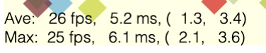

# Tutorial 19 - Performance Optimization

Optimizing performance for complex figures.

Download `index.html` and `index.js` into the same folder and open `index.html` in a browser to view example.


## Performance

When a figure is first created, FigureOne needs to:
  * Calculate the verticies of all shapes being created
  * Load the vertices into GPU memory (with WebGL)

To draw to the screen, FigureOne needs to:
  * Iterate through all the visible elements and update their state (position, color etc) - but only if they are animating or being moved (*setupDraw* step)
  * Interate through all visible elements and apply the most recent element color and transform (chained with any parent transforms) to the vertices already in memory (*draw* step)

FigureOne only draws to the screen when:
  * the figure is first loaded
  * when a figure element is being animated, is being moved or is changed in some way
  * when the browser window is resized

If a figure element is being changed, then at the end of each draw, FigureOne will determine whether its elements are still changing, and if they are request a notification from the browser for the next screen refresh. When that notification occurs, FigureOne will draw again and the cycle repeats.

Browsers will ideally refresh their screen between 30 and 60 times per second. To refresh 30 times a second means FigureOne needs to complete processing a draw a good amount less than 1/30s (<33ms) for smooth animations.

> Note: How much less than 33ms depends on a number of factors including, but not limited to, the client performance, browser, other tasks (like if mouse/touch movements are also being processed), the complexity of drawing (remember that after the FigureOne processing is done, the GPU then has to render to the screen - if there are many vertices and/or complex shaders then it will need more time).

As FigureOne only draws when the screen is being refreshed, then it will never draw at a faster frame rate than the screen. However, if the draw time is longer than the period between frames, then the frame rate will drop below the browser's desired rate.

As such, figures with many elements, moving in complex ways running on old, low-end clients may see slower frame rates.

This will then lead to several questions:
  1) What is an acceptable frame rate?
  2) What are the target client devices?
  3) How can a figure be optimized to increase performance, and what are the trade-offs?

The first two questions need to be answered by the developer. My targets are:

  1) 30 frams per second (fps) is target, but it really depends on the speed of the animation. Usually 20fps looks sufficiently good to me, and for slow animations even 10-15 fps can look fine
  2) As I mostly use FigureOne for educational content, I want older, low-end chrome books or low-mid end mobile devices to have acceptable performance

The third question is the reason for this tutorial.

## Test Devices

The devices used to test the examples (in order of lowest performance) in this tutorial are:

* 2016 Asus C202S Chromebook (using an Intel Celeron N3060) - this was considered a decent quality, but low end (low performance) chromebook in 2016. The frame rate numbers of this device generally align with the desktop version of Chrome's developer device simulation for a low-end mobile.
* 2014 Ipad Air 2
* 2019 Iphone 11

## Baseline Code

As a basline, we will draw 100 squares to a screen. The squares will continually move freely and bounce off the figure boundaries, with no deceleration.


Path: `./01 baseline/`
```js
const figure = new Fig.Figure({
  limits: [-3, -3, 6, 6],
  backgroundColor: [1, 1, 0.9, 1],
});
const { rand } = Fig.tools.math;

// Add n polygons, each of which has a random size, start position and
// velocity. They move freely and bounce off the figure boundaries without
// deceleration.
const n = 100;
for (let i = 0; i < n; i += 1) {
  const r = rand(0.1, 0.2);
  const e = figure.add({
    make: 'polygon',
    radius: r,
    color: [rand(0, 1), rand(0, 1), rand(0, 1), 0.7],
    rotation: Math.PI / 4,
    transform: [['t', rand(-2.9 + r, 2.9 - r), rand(-2.7 + r, 2.9 - r)]],
    mods: {
      move: {
        freely: { deceleration: 0, bounceLoss: 0 },
        bounds: 'figure',
      },
      state: {
        movement: { velocity: [['t', rand(-0.3, 0.3), rand(-0.3, 0.3)]] },cor
      },
    },
  });
  e.startMovingFreely();
}

// Add a frame rate annotation to the figure showing average and worst case
// frame rate in last 10 frames
figure.addFrameRate(10);
```

FigureOne can display animation metrics by using the `addFrameRate` method.



It will show the average and worst case values of the frame rate, the total time it takes to process a draw, and then the times for setupDraw and draw.

In this case, the statistics is for the last 10 frames.

### Performance

The average frame rates and FigureOne processing times per frame on the test devices are (for n=100 squares):
* 2016 Chromebook: 6 fps at ~73ms per frame
* 2014 iPad: 25 fps at ~13ms per frame
* 2019 iPhone: 52 fps at ~3ms per frame

Visually, the iPad and iPhone look good, but the Chromebook is not smooth.

Also, it is intersting to see an example of the per frame overhead on each device. The Chromebook, iPad and iPhone have FigureOne processing times of 73ms, 13ms and 3ms respectively. If this were the only limit to frame rate, then the frame rates would be 14, 77 (browser limited to 60) and 333 (browser limited to 60) fps respectively.

Using the iPad as a measure would seem to suggest that for this case, limiting processing times to <10ms will result in at least 30 fps.

For `n = 25`, the Chromebook can consistently achieve 20 fps (at 19ms) (path: `./02 n is 25/`).

### Can the Chromebook only support 25 elements?

This DOES NOT mean the Chromebook can only support 25 elements.

For instance, if we change n to 1, and then add another 150 static elements to the screen, the Chromebook can support 20 fps.


Path: `./03 n1 static150/`
```js
// baseline_03_n_1_static_150.js
const n = 1;
for (let i = 0; i < n; i += 1) {
  const r = rand(0.1, 0.2);
  const e = figure.add({
    make: 'polygon',
    radius: r,
    color: [rand(0, 1), rand(0, 1), rand(0, 1), 0.7],
    rotation: Math.PI / 4,
    transform: [['t', rand(-2.9 + r, 2.9 - r), rand(-2.7 + r, 2.9 - r)]],
    mods: {
      move: {
        freely: { deceleration: 0, bounceLoss: 0 },
        bounds: 'figure',
      },
      state: {
        movement: { velocity: [['t', rand(-0.3, 0.3), rand(-0.3, 0.3)]] },
      },
    },
  });
  e.startMovingFreely();
}

for (let i = 0; i < 150; i += 1) {
  const r = rand(0.1, 0.2);
  figure.add({
    make: 'polygon',
    radius: r,
    color: [rand(0, 1), rand(0, 1), rand(0, 1), 0.7],
    transform: [['t', rand(-2.9 + r, 2.9 - r), rand(-2.7 + r, 2.9 - r)]],
  });
}

figure.addFrameRate(10);
```

It also DOES NOT mean the Chromebook can only support 25 *simple* elements (squares are two triangles, and so defined with 6 vertices).

If instead we make 25 independently moving elements each with 100 sides (2500 triangles, 15000 vertices), we can also achieve 20 fps.

Path: `./04 n25 sides100/`
```js
const n = 25;
for (let i = 0; i < n; i += 1) {
  const r = rand(0.1, 0.2);
  const e = figure.add({
    make: 'polygon',
    radius: r,
    sides: 100,
    color: [rand(0, 1), rand(0, 1), rand(0, 1), 0.7],
    rotation: Math.PI / 4,
    transform: [['t', rand(-2.9 + r, 2.9 - r), rand(-2.7 + r, 2.9 - r)]],
    mods: {
      move: {
        freely: { deceleration: 0, bounceLoss: 0 },
        bounds: 'figure',
      },
      state: {
        movement: { velocity: [['t', rand(-0.3, 0.3), rand(-0.3, 0.3)]] },
      },
    },
  });
  e.startMovingFreely();
}
```

### Optimization

Figure elements in FigureOne are optimized for ease of use by default. The performance is more than sufficient for many figures including complex graphs, animations and interactive videos.

However, there are situations where more performance is needed.

There are three levels of optimization that can be performed on the default elements, each of which is more complex than the last, but will result in better performance.

In fact, by the end of this tutorial we will have 25,000 20 sided circles bouncing of walls on the Chromebook at 25 fps.

### Level 1 - Keep it Simple

The first optimization is to make FigureElements as simple as possible.

1) Minimize the FigureElementCollection depth
2) Minimize the transform size
3) Make as few elements as possible touchable
4) Simplify the touch borders, or use separate, more simple invisible touch elements
5) Minimize changing element vertices - try to do everything by just changing transforms

1) and 2) relate to how transforms are cascaded on every draw frame. Each FigureElement has a transform, which by default will be three scale, rotation and translation transforms chained. On each draw frame, all parent transforms are cascaded with the FigureElement transform. While for many situations this is trivial for even low-end processors, when using many elements, or when elements have many parents, the time to make all these calculations can become noticable on older, low-end clients.

In all the examples above, we have already done this optimization by placing all FigureElements in the root collection of the figure, and limiting the element's transform to just a translation step.

3) and 4) relate to interactivity. Determining whether a touch event has happened within the borders of a shape can be expensive if the border is complex. If there are hundreds of shapes that need to be checked, then the time it takes to do this can become noticable.

5) relates to how WebGL works. WebGL can handle hundreds of thousands of vertices, even on low end devices, by leveraging the GPU to parallelize position and color calculations. For optimal performance, a shape's vertices should be defined once, and then any changes to that shape captured with a transformation matrix that can 

### Level 2 - Custom `setupDraw` and `draw` Methods

### Level 3 - Custom Shaders


### Tips:
* Limit element and parent transform size


## Explanation


Devices: 
* Chrome Desktop: "Low-End Mobile" simulation
* 2016 Asus C202S Chromebook
* 2014 iPad Air 2
* 2019 IPhone 11

Test Cases:
* X Independantly moving elements
* X children of a collection N levels deep
   - When a different element is animating and all are redrawn
* Context2D text
* Dragging a finger
