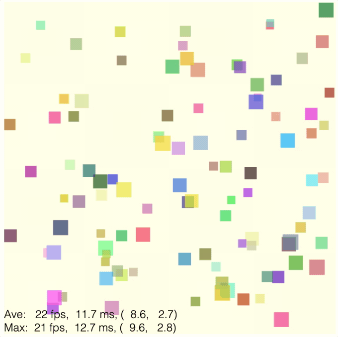

# Tutorial 19 - Performance Optimization

Optimizing performance for complex figures.

Download `index.html` and `index.js` into the same folder and open `index.html` in a browser to view example.



## Performance

When a figure is first created, FigureOne needs to:
  * Calculate the vertices of all shapes being created
  * Load the vertices into GPU memory (with WebGL)

To draw to the screen, FigureOne needs to:
  * Iterate through all the visible elements and update their state (position, color etc) - but only if they are animating or being moved (*setupDraw* step)
  * Iterate through all visible elements and apply the most recent element color and transform (chained with any parent transforms) to the vertices already in memory (*draw* step)

FigureOne only draws to the screen when:
  * the figure is first loaded
  * when a figure element is being animated, is being moved or is changed in some way
  * when the browser window is resized

If a figure element is being changed, then at the end of each draw, FigureOne will determine whether its elements are still changing, and if they are request a notification from the browser for the next screen refresh. When that notification occurs, FigureOne will draw again and the cycle repeats.

Browsers will ideally refresh their screen between 30 and 60 times per second. To refresh 30 times a second means FigureOne needs to complete processing a draw in less than 1/30s (<33ms) for smooth animations.

> Note: How much less than 33ms depends on a number of factors including, but not limited to, the client performance, browser, other tasks (like if mouse/touch movements are also being processed), and the complexity of drawing (remember that after the FigureOne processing is done, the GPU then has to render to the screen - if there are many vertices and/or complex shaders then it will need more time).

As FigureOne only draws when the screen is being refreshed, then it will never draw at a faster frame rate than the screen. However, if the draw time is longer than the period between frames, then the frame rate will drop below the browser's desired rate.

As such, figures with many elements, moving in complex ways running on old, low-end clients may see slower frame rates.

This will then lead to several questions:
  1) What is an acceptable frame rate?
  2) What are the target client devices?
  3) How can a figure be optimized to increase performance, and what are the trade-offs?

The first two questions need to be answered by the developer. My targets are:

  1) 30 frams per second (fps) is target, but it really depends on the speed of the animation. Usually 20fps looks sufficiently good to me, and for slow animations even 10-15 fps can look fine
  2) As I mostly use FigureOne for educational content, I want older, low-end chrome books or low-mid end mobile devices to have acceptable performance

The third question is the reason for this tutorial.

## Test Devices

The devices used to test the examples (in order of lowest performance) in this tutorial are:

* 2016 Asus C202S Chromebook (using an Intel Celeron N3060) - this was considered a decent quality, but low end (low performance) chromebook in 2016. The frame rate numbers of this device generally align with the desktop version of Chrome's developer device simulation for a low-end mobile.
* 2014 Ipad Air 2
* 2019 Iphone 11

## Baseline Code

As a basline, we will draw 100 squares to a screen. The squares will continually move freely and bounce off the figure boundaries, with no deceleration.

We can do this easily with FigureOne by creating 100 squares, each of which:
* has a random initial position and initial velocity
* has no deceleration
* is bounded to the figure bounds
* is set to move freely

```js
const figure = new Fig.Figure({
  limits: [-3, -3, 6, 6],
  backgroundColor: [1, 1, 0.9, 1],
});
const { rand } = Fig.tools.math;

// Add n polygons, each of which has a random size, start position and
// velocity. They move freely and bounce off the figure boundaries without
// deceleration.
const n = 100;
for (let i = 0; i < n; i += 1) {
  const r = rand(0.1, 0.2);
  const e = figure.add({
    make: 'polygon',
    radius: r,
    color: [rand(0, 1), rand(0, 1), rand(0, 1), 0.7],
    transform: [['t', rand(-2.9 + r, 2.9 - r), rand(-2.7 + r, 2.9 - r)]],
    mods: {
      move: {
        freely: { deceleration: 0, bounceLoss: 0 },
        bounds: 'figure',
      },
      state: {
        movement: { velocity: [['t', rand(-0.3, 0.3), rand(-0.3, 0.3)]] },
      },
    },
  });
  e.startMovingFreely();
}

// Add a frame rate annotation to the figure showing average and worst case
// frame rate in last 10 frames
figure.addFrameRate(10);
```


The files for this are [here](./01%20baseline). 


FigureOne can display animation metrics by using the `addFrameRate` method.

It will show the average and worst case values of the frame rate, the total time it takes to process a draw, and then the times for setupDraw and draw.

In this case, the statistics is for the last 10 frames.

This example has been chosen because FigureOne's calculations for moving freely and bouncing off boundaries are generalized for any shape. As FigureOne doesn't inherently know the properties of a shape, it must go through and calculate the boundary of a shape to know when a shape's boundary is meeting the figure boundary. By default, FigureOne also doesn't know how a user has changed a shape (or it's transform, or parent's transform) between each frame, and so must do this per frame.

This makes it very easy for a user to define an object and have it move freely, but it is not as efficient as the user specifying the algorithm to both move freely and bounce for a specific shape. While this doesn't matter normally, when applying this to many shapes, performance can be impacted on lower-end devices.

### Performance

The average frame rates and FigureOne processing times per frame on the test devices for the baseline `n=100` squares are:

* 2016 Chromebook: 6 fps at ~73ms per frame
* 2014 iPad: 27 fps at ~11ms per frame
* 2019 iPhone: 52 fps at ~3ms per frame

Visually, the iPad and iPhone look good, but the Chromebook is not smooth.

This gives us an initial feeling of how much time FigureOne can actually use per frame.

For instance, FigureOne takes 11ms to process a frame on the iPad. If this were the only processing needed by the browser to render a frame, then we could expect frame rates of 1 / 0.077 = 91 fps (which would then be browser limited back to 60 fps). But we are only seeing 27 fps. This shows FigureOne does not have the whole 33ms to render at 30 fps, but rather will have something closer to 10ms.

But the iPad is not our low end target. On the Chromebook we need to scale the number of squares back to 25 (`n=25`) to achieve just 20-25 fps.

For `n=25` [here](./02%20n%20is%2025), the Chromebook takes 18ms to process a frame, the iPad takes 5ms, and the iPhone takes 3ms.

### Is 25 elements the max then?

This DOES NOT mean the Chromebook can only support 25 FigureOne elements.

For instance, if we change n to 1, and then add another 250 static elements to the screen, the Chromebook can support 20 fps. Remember, each of the 25 elements is performing an unnecessarily expensive (because it is generic) algorithm to move freely and bounce off the boundaries.


```js
const n = 1;
for (let i = 0; i < n; i += 1) {
  const r = rand(0.1, 0.2);
  const e = figure.add({
    make: 'polygon',
    radius: r,
    color: [rand(0, 1), rand(0, 1), rand(0, 1), 0.7],
    transform: [['t', rand(-2.9 + r, 2.9 - r), rand(-2.7 + r, 2.9 - r)]],
    mods: {
      move: {
        freely: { deceleration: 0, bounceLoss: 0 },
        bounds: 'figure',
      },
      state: {
        movement: { velocity: [['t', rand(-0.3, 0.3), rand(-0.3, 0.3)]] },
      },
    },
  });
  e.startMovingFreely();
}

for (let i = 0; i < 250; i += 1) {
  const r = rand(0.1, 0.2);
  figure.add({
    make: 'polygon',
    radius: r,
    color: [rand(0, 1), rand(0, 1), rand(0, 1), 0.7],
    transform: [['t', rand(-2.9 + r, 2.9 - r), rand(-2.7 + r, 2.9 - r)]],
  });
}

figure.addFrameRate(10);
```


The files for this are [here](./03%20n1%20static250/).

It also DOES NOT mean the Chromebook can only support 25 *simple* elements (squares are two triangles, and so defined with 6 vertices).

If instead we make 25 independently moving elements each with 200 sides (5,000 triangles, 30,000 vertices), we can still achieve 20 fps.


```js
const n = 25;
for (let i = 0; i < n; i += 1) {
  const r = rand(0.1, 0.2);
  const e = figure.add({
    make: 'polygon',
    radius: r,
    sides: 200,
    color: [rand(0, 1), rand(0, 1), rand(0, 1), 0.7],
    transform: [['t', rand(-2.9 + r, 2.9 - r), rand(-2.7 + r, 2.9 - r)]],
    mods: {
      move: {
        freely: { deceleration: 0, bounceLoss: 0 },
        bounds: 'figure',
      },
      state: {
        movement: { velocity: [['t', rand(-0.3, 0.3), rand(-0.3, 0.3)]] },
      },
    },
  });
  e.startMovingFreely();
}
```


The files for this are [here](./04%20n25%20sides200).

### Optimization

Figure elements in FigureOne are optimized for ease of use by default. The performance is more than sufficient for many figures including complex graphs, animations and interactive videos.

However, there are situations where more performance is needed.

There are three levels of optimization that can be performed on the default elements, each of which is more complex than the last, but will result in better performance.

In fact, by the end of this tutorial we will have 70,000 circles (20 sided polygons) bouncing of walls on the Chromebook at 25 fps.

### Level 1 - Keep it Simple

The first optimization is to make FigureElements as simple as possible.

1) Minimize the FigureElementCollection tree depth
2) Minimize the per transform size
3) Make as few elements as possible touchable
4) Simplify the touch borders, or use separate, more simple invisible touch elements
5) Minimize changing element vertices - try to do everything by just changing transforms


Items 1) and 2) relate to how transforms are cascaded on every draw frame. Each FigureElement has a transform, which by default will be three chained transforms: a scale, rotation and translation. On each draw frame, all parent transforms are cascaded with the FigureElement transform. While for many situations this is trivial for even low-end processors, when using many elements, or when elements have many parents, the time to make all these calculations can become noticable on older, low-end clients.

In all the examples above, we have already done this optimization by placing all FigureElements in the root collection of the figure, and limiting the element's transform to just a single translation step.

Items 3) and 4) relate to interactivity. Determining whether a touch event has happened within the borders of a shape can be expensive if the border is complex. If there are hundreds of shapes that need to be checked, then the time it takes to do this can become noticable.

Item 5) relates to how WebGL works. WebGL can handle hundreds of thousands of vertices, even on low end devices, by leveraging the GPU to parallelize position and color calculations. For optimal performance, a shape's vertices should be defined once, and then any changes to that shape captured with a transformation matrix. Morphing the shapes vertices individually on a per frame basis is possible (and cannot be avoided sometimes), but should be limited to shapes with fewer vertices.

### Level 2 - Custom `setupDraw` and `draw` Methods

Each FigureElement executes two primary methods when processing a frame:
* `setupDraw` update the element's transform based on any ongoing animation, free movement or user movement
* `draw` cascade the parent transform with the element's transform and any additional transforms on the element (like a pulse transform)

All of an element's features like built in animations, the ability to move freely and bounce off boundaries, and the ability to be interacted with rely on the logic with these two methods. Once again however, these methods have some generalization overhead.

If instead we treat a FigureElement as simply a holder of a shape, and create our own animation logic that is specific to that shape we can get significant speed up.

#### Custom `setupDraw`

We start by replacing just the setupDraw method. In the new `setupDraw` we will move the squares manually and change the velocities so they bounce of the boundaries when they come to them.

```js
const figure = new Fig.Figure({
  limits: [-3, -3, 6, 6],
  backgroundColor: [1, 1, 0.9, 1],
});
const { rand } = Fig.tools.math;

for (let i = 0; i < 250; i += 1) {
  const r = rand(0.1, 0.2);
  const p = [rand(-2.9 + r, 2.9 - r), rand(-2.7 + r, 2.9 - r)];
  const e = figure.add({
    make: 'polygon',
    radius: r,
    sides: 4,
    color: [rand(0, 1), rand(0, 1), rand(0, 1), 0.7],
    transform: [['t', p[0], p[1]]],
    mods: {
      // Setting an element to 'simple' reduces a FigureElements functionality:
      //   - Transforms set on the element will not be reflected in
      //     methods like `getPosition` until after the next draw frame
      simple: true,
      // A custom property that stores the initial velocity
      custom: { velocity: [rand(-0.15, 0.15), rand(-0.15, 0.15)] },
      state: {
        // Use isChanging property to indicate the element needs to be updated
        // every draw frame
        isChanging: true,
      },
    },
  });
  e.setupDraw = (now) => {
    // Get the delta time from the last frame
    if (e.customState.lastTime == null) {
      e.customState.lastTime = now;
    }
    const deltaTime = now - e.customState.lastTime;
    const { velocity } = e.custom;
    const { transform } = e;

    // Calculate the new position coordinates
    const x = transform.order[0].x + velocity[0] * deltaTime;
    const y = transform.order[0].y + velocity[1] * deltaTime;

    // Manually update the transform and resulting matrix for the new position
    transform.order[0].x = x;
    transform.order[0].y = y;
    transform.mat = [1, 0, transform.order[0].x, 0, 1, transform.order[0].y, 0, 0, 1];

    // If the shape is on or crossing a boundary, then set the
    // velocity sign so it bounces back into the figure.
    if (x <= -3 + r) { velocity[0] = Math.abs(velocity[0]); }
    if (x >= 3 - r) { velocity[0] = -Math.abs(velocity[0]); }
    if (y <= -3 + r) { velocity[1] = Math.abs(velocity[1]); }
    if (y >= 3 - r) { velocity[1] = -Math.abs(velocity[1]); }

    // Set lastTime for the next frame delta calculation
    e.customState.lastTime = now;
  };
}
figure.addFrameRate(20);
figure.elements.transform = new Fig.Transform();
figure.animateNextFrame();
```

The files for this are [here](./05%20custom%20setupdraw).

We have increased the performance, and so we can now increase the number of squares until the Chromebook is once again at 20 fps. So for `n = 250`
* 2016 Chromebook: 20 fps at ~20ms per frame
* 2014 iPad: 35 fps at ~9ms per frame
* 2019 iPhone: 52 fps at ~2.5ms per frame

The performance improvements have come from several areas:
* Custom animation in `setupDraw`
* Transforms are manipulated directly instead of using helper functions
* FigureElement squares are set to `simple` which means their transform information is not updated till after a drawFrame. This means element methods that depend on the transform (such as `getPosition`) will return the position from the last draw frame and not whatever the current transform is.

#### Custom `draw`

Now that we are drawing a lot of elements on the screen, the `draw` method starts to become the biggest bottleneck. For the previous example of `n = 250` the Chromebook processing time of `20ms` is actually now mostly `draw` which takes 16ms.

The `draw` method takes a parent transform, and chains that with the element's transform, and any other transforms that modify the element (like pulse or copy transforms). Once again, the generalization of the default `draw` method has some inefficiencies which we can overcome for our specific case.

```js
for (let i = 0; i < 400; i += 1) {
  ...
  // Override element draw method
  e.draw = (now, parentTransform) => {
    // Get the current position directly
    const { x, y } = e.transform.order[0];

    // Cacluate the draw matrix as efficiently as possible
    const mat = Fig.tools.m2.mul(parentTransform[0].mat, [1, 0, x, 0, 1, y, 0, 0, 1]);

    // Draw
    e.drawingObject.drawWithTransformMatrix(
      mat, e.color,
    );
  };
}
```

The files for this are [here](./06%20custom%20draw).


This draw method is super simple, and will stop an element from being able to pulse, or use the `getPosition` or `getBorder` methods.

It almost halves the draw time however, so we can then increase `n` to `400` and still achieve 20 fps on the Chromebook.


### Level 3 - Custom Shaders

Customing WebGL shaders brings the next level of performance.

It is not in the scope of this tutorial to explain what WebGL is, and how to use it. There are many good resources on the web that already do this - for example [WebGLFundamentals](https://webglfundamentals.org/webgl/lessons/webgl-fundamentals.html) gives an excellent introduction to WebGL and this [quick reference guid](https://www.khronos.org/files/webgl/webgl-reference-card-1_0.pdf) is useful to refer to especially when writing shaders.

To briefly summarize how WebGL is typically used to draw and move a shape:
* Vertices of multiple triangles arranged to form a shape are defined in JavaScript
* JavaScript uses the native WebGL library to load the vertex data into a GPU memory buffer
* JavaScript tracks where the shape is, and its current color
* Each time a frame is drawn, JavaScript uses the native WebGL libraries to pass a transform that describes where the shape is to the GPU, and an array that describes it's current color
* The GPU executes the *vertex shader* - a user defined program that determines the final position of each vertex. In this case, the vertex shader program would take the position of an original vertex in the GPU memory buffer and transform it with the updated transform for the frame passed from Javascript. The vertex shader is executed on each vertex in parallel on the GPU's multiple cores.
* The GPU executes the *fragment shader* - a user defined program that determines the color of each pixel on the screen, based on the final position of the vertices, and the color of each vertex or an overall shape color for the frame passed from JavaScript
* On each draw frame, the only data passed between the CPU and GPU is the updated transform matrix for the shape, and a single color - 13 numbers in total for a 2D rendering. This means shapes with thousands or hundreds of thousands of vertices stay unmodified in the GPU memory buffer and can be rendered relatively quickly - even on low end devices

This is a relatively simple example, but it describes how the majority of FigureOnePrimitives use WebGL to render to the screen. FigureOnePrimitives track the position, rotation, scale and color of a shape, and pass this information to WebGL on every draw frame. Users of FigureOne only need to know how to change these properties of a shape and FigureOne does the rest.

However, FigureOne also allows users to define custom shaders. Custom shaders can be used to do more than just transform and color the vertices. They can use a number of different algorithms to apply different visual effects, or can be used to apply *vertex specific* transforms and colors.

Our example of many different shapes all moving independently and bouncing of boundaries is a great use case for a custom shader.

While shaders are powerful tools, they are only good for a finite set of problems - in particular problems that are deterministic and can be pre-planned.

To understand why, let's consider some of their challenges:
* You can only pass data to a shader - you cannot retrieve data from it (thus state changed by a shader cannot be fed back to a JavaScript program)
* The only data that can be shared between shaders is data from the vertex shader to the fragment shader in the same frame
* Data cannot be shared between shaders over different frames
* Data cannot be shared between vertex shaders operating on different vertices or fragment shaders operating on different pixels

This means for our example, we cannot use shaders to incrementally update the position of shapes based on their current position. There will be too many current positions to pass to the GPU each frame, and so instead the shaders will need an alogorithm that uses just the initial position, initial velocity and current time to calculate the position of each shape.


#### Attributes, Uniforms and Varyings

The data passed between parts of a WebGL program have three different names:

An *attribute* is data loaded into a GPU buffer, usually at the start of a program, for the vertex shader. It is usually a long array of values that represent the vertices of a shape, and vertex specific properties. A vertex shader instance will only have access to a single vertex and its associated attributes.

A *uniform* is the data passed from CPU to GPU at frame draw time. Each uniform can only be 1 to 4 values long. Uniforms are available to all vertices in the vertex shader and all pixels in the fragment shader.

A *varying* is data passed from the vertex shader to the fragment shader. The vertex shader will define a *varying* for the current vertex it is operating on. The fragment shader will operate on a pixel that will typically be inside a triangle defined with three vertices. The varying value for each of the three vertices will be interpolated to a single value passed to the fragment shader. For example, if each vertex has a different color and the color is passed as a varying from the vertex shader to the fragment shader, then the fragment shader will recieive a color that is the average of the three colors weighted by the position of the pixel relative to the three pixels.

#### Shader Language

A shader is written in strongly typed C.

Shaders are relatively small programs, but can be a handful to get working - mostly because its very hard to debug them. The programs are compiled in the GPU, and the only information you get is whether the shader compiled successfully, and the colors on the screen. There aren't debuggers or print statements to step through the program.

> Note: One way to debug a shader program is to use color. For example, if you want to check the number value of a variable in a vertex shader, you could pass the number to the fragment shader and map values to colors. If however the shader is not compiling, one strategy is simply to go back to a version of the shader that did compile and add one change at a time, compiling each time.

FigureOne's default shaders are below:

Vertex Shader:

```c
attribute vec2 a_position;
uniform mat3 u_matrix;
uniform float u_z;

void main() {
  gl_Position = vec4((u_matrix * vec3(a_position, 1)).xy, u_z, 1);'
}
```

Fragment Shader:
```c
precision mediump float;
uniform vec4 u_color;

void main() {
  gl_FragColor = u_color;
  gl_FragColor.rgb *= gl_FragColor.a;
}
```

The vertex shader takes in the vertex location (`a_position`) and transforms it by some transform matrix (`u_matrix`). Here the `a_` and `u_` prefixes denote attributes and uniforms respectively.

These shaders are 2D shaders, but everything in WebGL is in 3D space, meaning a z coordinate (`u_z`) is also needed. In this case the z coordinate can be used to position shapes over other shapes.

To define the final position of the vertex, the `gl_Position` variable is set. This variable is expected by the GPU.


The fragment shader accepts a color uniform (`u_color`) and then colors all the vertices in a shape the same color. To define the final color of the pixel, the `gl_FragColor` variable is set. This variable is expected by the GPU.


FigureOne also has two more pairs of built in shaders:
* `'vertexColor'` - color can be defined for each vertex. When colors are different between vertices, a color gradient is formed.
* `'texture'` - a texture (image) can be used to color the shape

#### Example Shader

We will first write a shader that does just a part of our example above - it will move shapes in one direction, but not bounce them of boundaries. The shader logic is much simpler, and it will allow introduction of FigureOne's api to define the shader and corresponding attributes and uniforms.

To start with, we will define two attribute arrays: 
* Initial vertex positions (`a_position`)
* Initial vertex velocities (`a_velocity`)

We will also define a uniform that has the time from the start of the animation (`u_time`).

Thus our vertex shader will be:

```c
attribute vec2 a_position;
attribute vec2 a_velocity;
uniform mat3 u_matrix;
uniform float u_time;

void main() {
  float x = a_position.x + a_velocity.x * u_time;
  float y = a_position.y + a_velocity.y * u_time;
  gl_Position = vec4((u_matrix * vec3(x, y, 1)).xy, 0, 1);
```

We will not use a customized fragment shader for this example, and so all shapes will be the same color.

Our final code is then:

```js
const figure = new Fig.Figure({
  limits: [-3, -3, 6, 6],
  backgroundColor: [1, 1, 0.9, 1],
});
const { rand } = Fig.tools.math;

// Vertex shader
// Input attributes:
//    - 'a_position' (vertex position)
//    - 'a_velocity: (vertex velocity)
// Input uniforms:
//    - u_time: time from start of animation
const vertexShader = `
attribute vec2 a_position;
attribute vec2 a_velocity;
uniform mat3 u_matrix;
uniform float u_time;
void main() {
  float x = a_position.x + a_velocity.x * u_time;
  float y = a_position.y + a_velocity.y * u_time;
  gl_Position = vec4((u_matrix * vec3(x, y, 1)).xy, 0, 1);
}`;

// Create vertices for 10,000 polygons. Each polygon is 20 triangles.
// Each triangle has vertices of the polygon center and the two corners of one
// side.
// Each vertex will need an associated velocity where the velocity should be the
// same for all vertices in a polygon
const points = [];
const velocities = [];
const sides = 20;
const step = Math.PI * 2 / (sides);
for (let i = 0; i < 10000; i += 1) {
  const r = rand(0.02, 0.05);
  const p = [rand(-1, 1), rand(-1, 1)];
  const v = [rand(-0.15, 0.15) * r * 50, rand(-0.15, 0.15) * r * 50];
  for (let j = 0; j < sides; j += 1) {
    points.push(p[0], p[1]);
    points.push(r * Math.cos(step * j) + p[0], r * Math.sin(step * j) + p[1]);
    points.push(r * Math.cos(step * (j + 1)) + p[0], r * Math.sin(step * (j + 1)) + p[1]);
    velocities.push(v[0], v[1], v[0], v[1], v[0], v[1]);
  }
}

const element = figure.add({
  make: 'gl',
  // Define the custom shader and variables (u_matrix is the element transform
  // matrix)
  vertexShader: {
    src: vertexShader,
    vars: ['a_position', 'a_velocity', 'u_matrix', 'u_time'],
  },
  // Build in shader with one color for all vertices
  fragShader: 'simple',
  // Define buffers and uniforms
  vertices: { data: points },
  buffers: [{ name: 'a_velocity', data: velocities }],
  uniforms: [{ name: 'u_time' }],
  // Element color and mods
  color: [1, 0, 1, 0.5],
  mods: { state: { isChanging: true } },
});

// Before each draw, we want to update the u_time value with the time
// delta between this frame and the start of the animation - it will
// then be passed to the vertex shader by FigureOne
let startTime = null;
figure.notifications.add('beforeDraw', () => {
  if (startTime == null) {
    startTime = figure.timeKeeper.now();
  }
  const deltaTime = (figure.timeKeeper.now() - startTime) / 1000;
  element.drawingObject.uniforms['u_time'].value = [deltaTime];
});
figure.addFrameRate();
figure.animateNextFrame();

```

The files for this are [here](./07%20custom%20shader%20intro).


The `'gl'` FigureElementPrimitive has options that allows us to define the shaders, and any attributes and uniforms.

This code essentially explodes 10,000 circles (polygons with 20 sides each, thus 200,000 vertices). Our performance numbers are:

* Chromebook: 53 fps at 2 ms processing time
* iPad: 36 fps at 2ms processing time
* iPhone: 57 fps at 1ms processing time

Note here, the iPad is the "worst" performer, though at 36 fps it is more than adequate. As the shapes leave the screen, meaning less shapes need to be drawn to the screen, the iPads numbers quickly rise to the low 50 fps as well.

It gets interesting if we increase `n`:

For `n = 100,000` (6,000,000 vertices):
* Chromebook: 40 fps at 2.5 ms processing time
* iPad: 10 fps at 3.6ms processing time
* iPhone: 30 fps at 1ms processing time


Interestingly, when we increase the number of shapes to 100,000 the Chromebook seems to handle this example better than Safari on the iPhone or iPad. Most of the heavy lifting is now being done by the GPU, and how WebGL is optimized for it, so what was once a low end device, might now be considered better than the other two higher end devices.

#### Final Shader

Let's now add logic to the shaders that:
* incorporates bouncing off the boundaries
* allows for each shape to have a different color

As shaders need to be deterministic, the bouncing is going to require logic to:
* Determine the total distance travelled by the ball at some time
* Determine how many bounces off walls this would result in, based on the initial position and velocity
* Determine the current position from the distance travelled from the last wall bounce

The x and y components of position and velocity are independant and so can be calculated separately.

The final program is then:

```js

const figure = new Fig.Figure({
  limits: [-3, -3, 6, 6],
  backgroundColor: [1, 1, 0.9, 1],
});
const { rand } = Fig.tools.math;

const vertexShader = `
attribute vec2 a_position;
attribute vec4 a_color;
attribute vec2 a_velocity;
attribute vec2 a_center;
attribute float a_radius;
varying vec4 v_col;
uniform mat3 u_matrix;
uniform float u_time;

float calc(float limit, float pos, float center, float vel) {
  float vDirection = vel / abs(vel);
  float offset = abs(center - vDirection * limit);
  float totalDistance = abs(vel * u_time);
  float numBounces = 0.0;
  if (totalDistance > offset) {
    numBounces = 1.0;
  }
  numBounces = numBounces + floor(abs((totalDistance - offset)) / (2.0 * limit));
  float xLastDirection = (mod(numBounces, 2.0) == 0.0) ? vDirection : -vDirection;
  float xLastWall = center;
  float xRemainderDistance = totalDistance;
  if (numBounces > 0.0) {
    xLastWall = (mod(numBounces, 2.0) == 0.0) ? -vDirection * limit : vDirection * limit;
    xRemainderDistance = mod(totalDistance - offset, 2.0 * limit);
  }
  float x = xLastWall + xRemainderDistance * xLastDirection + pos - center;
  return x;
}
void main() {
  float x = calc(3.0 - a_radius, a_position.x, a_center.x, a_velocity.x);
  float y = calc(3.0 - a_radius, a_position.y, a_center.y, a_velocity.y);
  gl_Position = vec4((u_matrix * vec3(x, y, 1)).xy, 0, 1);
  v_col = a_color;
}`;

const points = [];
const velocities = [];
const colors = [];
const centers = [];
const radii = [];
const sides = 20;
const step = Math.PI * 2 / (sides);
for (let i = 0; i < 10000; i += 1) {
  // Each shape gets a random radius, initial position, initial velocity and
  // color
  const r = rand(0.05, 0.1);
  const p = [rand(-3 + r, 3 - r), rand(-3 + r, 3 - r)];
  const v = [rand(-0.15, 0.15), rand(-0.15, 0.15)];
  const color = [rand(0, 255), rand(0, 255), rand(0, 255), rand(0, 255)];

  // Define all the vertices of the shape. Each side will have an associated
  // triangle formed with the center of the polygon. Thus, each side of the
  // shape will have three associated vertices. Each vertex will then have an
  // associated radius, center point, velocity and color.
  for (let j = 0; j < sides; j += 1) {
    points.push(p[0], p[1]);
    points.push(r * Math.cos(step * j) + p[0], r * Math.sin(step * j) + p[1]);
    points.push(r * Math.cos(step * (j + 1)) + p[0], r * Math.sin(step * (j + 1)) + p[1]);
    velocities.push(v[0], v[1], v[0], v[1], v[0], v[1]);
    centers.push(p[0], p[1], p[0], p[1], p[0], p[1]);
    radii.push(r, r, r);
    colors.push(...color, ...color, ...color);
  }
}

const element = figure.add({
  make: 'gl',
  // Define the custom shader and variables (u_matrix is the element transform
  // matrix)
  vertexShader: {
    src: vertexShader,
    vars: ['a_position', 'a_color', 'a_velocity', 'a_center', 'a_radius', 'u_matrix', 'u_time'],
  },
  // Built in shader that allows for colored vertices
  fragShader: 'vertexColor',
  // Define buffers and uniforms
  vertices: { data: points },
  buffers: [
    {
      name: 'a_color', size: 4, data: colors, type: 'UNSIGNED_BYTE', normalize: true,
    },
    { name: 'a_velocity', data: velocities },
    { name: 'a_center', data: centers },
    { name: 'a_radius', data: radii, size: 1 },
  ],
  uniforms: [
    { name: 'u_time' },
  ],
  // The animation will continue forever
  mods: { state: { isChanging: true } },
});

// Before each draw, we want to update the u_time value with the time
// delta between this frame and the start of the animation - it will
// then be passed to the vertex shader by FigureOne
let startTime = null;
figure.notifications.add('beforeDraw', () => {
  if (startTime == null) {
    startTime = figure.timeKeeper.now();
  }
  const deltaTime = (figure.timeKeeper.now() - startTime) / 1000;
  element.drawingObject.uniforms.u_time.value = [deltaTime];
});
figure.addFrameRate();
figure.animateNextFrame();
```

The files for this are [here](./08%20custom%20shader).


The performance of this on each device for n = 10,000 is:

* Chromebook: 55 fps at 1.5ms processing time
* iPad: 25 fps at 1ms processing time
* iPhone: 57 fps at 0.7ms

The maxium number of polygons that can still accomodate a smooth visualization for each device is:

* Chromebook: n = 70,000 (4.2 million vertices)
* iPad: n = 20,000 (1.2 million vertices)
* iPhone: n = 30,000 (1.8 million vertices)

Note, the performance of this example is lower than the previous exploding example because the shader calculation is more complex. Remember that the shader is run on each vertex, and we are operating on millions of vertices.

### Conclusions

FigureOne is optimized to be easy to use, but sufficiently performant for a large range of Figures, even on low end devices.

That said, there may be situations where many elements are needed on the screen and the performance on low end devices is insufficient.

Depending on the figure, this tutorial has shown three ways to potentially improve performance
* Simplify the figure definitions
* Override the `setupDraw` and `draw` methods of key elements to implement efficient animations
* Use WebGL shaders to render special effects or thousands of shapes at once very efficiently

