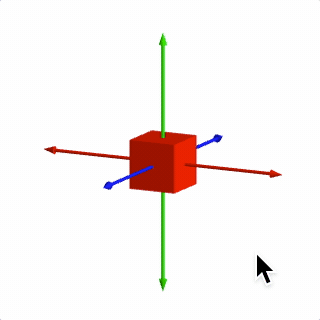

# Tutorial 20 - 3D Shapes

This example introduces how to create 3D shapes.

The user can drag in the figure to change their perspective.

Open `index.html` in a browser to view example.



## Code
`index.js`
```js
// Create a figure with an orthographic scene
const figure = new Fig.Figure({ scene: { style: 'orthographic' } });

figure.add([
  // Add x, y, z axes
  {
    make: 'collections.axis3',
    start: -0.8,
    length: 1.6,
    arrow: { ends: 'all' },
    width: 0.01,
  },
  // Add a cube at the origin
  {
    make: 'cube',
    side: 0.3,
    color: [1, 0, 0, 1],
  },
  // Allow user to rotate the scene
  {
    make: 'cameraControl',
  },
]);

```

## Explanation

To draw shapes in three dimensions some extra parameters within `Scene` are needed:
* The projection of 3D space onto a 2D screen - do dimensions far from the camera look smaller than dimensions closer to the camera like in real life (`Scene.style: 'perspective'`) or are they the same (`Scene.style: 'orthographic'`)
* The expanse of the 3D space to show (`Scene.left`, `Scene.right`, `Scene.bottom`, `Scene.top`, `Scene.near`, `Scene.far`, `Scene.aspectRatio`, `Scene.fieldOfView`)
* From where to view the space (`Scene.camera`)
* How to light the shapes as shapes without lighting look flat (`Scene.light`)

For a detailed explanation of each of these, see the [3D shapes](https://airladon.github.io/FigureOne/api/#3d-shape-primitives) introduction in the API reference.

For this example, all of the default settings are sufficient, we simply need to define the scene style as `orthographic` when we create the figure.

```js
const figure = new Fig.Figure({ scene: { style: 'orthographic' } });
```

Next we add some axes to help orient ourselves. For all the options of `axis3` see the [documentation](https://airladon.github.io/FigureOne/api/#collectionsaxis3).

```js
figure.add([
  // Add x, y, z axes
  {
    make: 'collections.axis3',
    start: -0.8,
    length: 1.6,
    arrow: { ends: 'all' },
    width: 0.01,
  },
...
};
```

FigureOne comes with a number of standard 3D shapes, of which [cube](https://airladon.github.io/FigureOne/api/#cube) is one.

```js
figure.add([
...
  // Add a cube at the origin
  {
    make: 'cube',
    side: 0.3,
    color: [1, 0, 0, 1],
  },
...
};
```

Finally, a control that allows the user to control the location of the camera - essentially allowing them to change the perspective of the figure is added (see [OBJ_CameraControl](https://airladon.github.io/FigureOne/api/#obj_cameracontrol) for all the options):

```js
figure.add([
...
  // Allow user to rotate the scene
  {
    make: 'cameraControl',
  },
};
```

