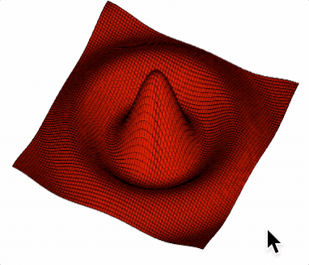

# Tutorial 21 - 3D Surface

This example introduces how to create 3D surfaces.

Open `index.html` in a browser to view example.



## Code

`index.js`
```js
const { Figure, surfaceGrid } = Fig;

// Orthographic scene with camera oriented so z is up
const figure = new Figure({
  scene: {
    style: 'orthographic',
    camera: { up: [0, 0, 1] },
  },
});

// Compute surface points
const points = surfaceGrid({
  x: [-0.8, 0.8, 0.02],
  y: [-0.8, 0.8, 0.02],
  z: (x, y) => {
    const r = Math.sqrt(x * x + y * y) * Math.PI * 2 * 2;
    return 0.9 * Math.sin(r) / r;
  },
});

figure.add([
  // Create a surface fill
  {
    make: 'surface',
    points,
    color: [1, 0, 0, 1],
    normals: 'curve',
  },
  // Create a surface wire mesh
  {
    make: 'surface',
    points,
    lines: true,
    color: [0, 0, 0, 1],
    position: [0, 0, 0.001],
  },
  // Add a camera control
  { make: 'cameraControl', axis: [0, 0, 1] },
]);
```

## Explanation

Custom surfaces can be defined and drawn in FigureOne.

In this case, the surface is created by applying a function to an evenly spaced grid of x and y coordinates:

```js
// Compute surface points
const points = surfaceGrid({
  x: [-0.8, 0.8, 0.02],
  y: [-0.8, 0.8, 0.02],
  z: (x, y) => {
    const r = Math.sqrt(x * x + y * y) * Math.PI * 2 * 2;
    return 0.9 * Math.sin(r) / r;
  },
});
```

The [surfaceGrid](https://airladon.github.io/FigureOne/api/#surfacegrid) function creates the points for a surface from two known x, y and/or z components.

These points can then be used in the `surface` shape (see [surfaceGrid](https://airladon.github.io/FigureOne/api/#obj_surface)).

```js
figure.add([
  // Create a surface fill
  {
    make: 'surface',
    points,
    color: [1, 0, 0, 1],
    normals: 'curve',
  },
  // Create a surface wire mesh
  {
    make: 'surface',
    points,
    lines: true,
    color: [0, 0, 0, 1],
    position: [0, 0, 0.001],
  },
  // Add a camera control
  { make: 'cameraControl', axis: [0, 0, 1] },
]);
```

In this case, two surfaces are created for stylistic effect. One surface is the red fill, while the second surface is a mesh of lines that make it easier to see the surface without moving it.
