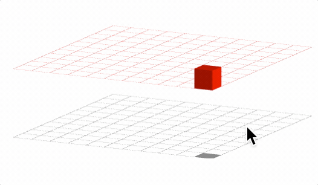

# Tutorial 22 - 3D Interactivity

This example introduces how to create 3D interactivity.

Open `index.html` in a browser to view example.



## Code

`index.js`
```js
const { Figure, round } = Fig;
const figure = new Figure({ scene: { style: 'orthographic' } });

// Top grid
figure.add({
  name: 'topGrid',
  make: 'grid',
  step: 0.2,
  transform: ['r', Math.PI / 2, 1, 0, 0],
  width: 0.005,
  color: [1, 0.4, 0.4, 1],
  bounds: [-1.1, -1.1, 2.2, 2.2],
});

// Bottom grid
figure.add({
  make: 'grid',
  step: 0.2,
  transform: [['r', Math.PI / 2, 1, 0, 0], ['t', 0, -0.7, 0]],
  width: 0.005,
  color: [0.5, 0.5, 0.5, 1],
  bounds: [-1.1, -1.1, 2.2, 2.2],
});

const shaddow = figure.add({
  make: 'rectangle',
  width: 0.2,
  height: 0.2,
  color: [0, 0, 0, 0.5],
  transform: [['r', Math.PI / 2, 1, 0, 0], ['t', 0, -0.7, 0]],
});

const cube = figure.add({
  make: 'cube',
  side: 0.2,
  position: [0, 0.1, 0],
  color: [1, 0, 0, 1],
  move: {
    plane: [[0, 0, 0.1], [0, 1, 0]],
    bounds: {
      left: -1, right: 1, bottom: -1, top: 1, position: [0, 0.1, 0], normal: [0, 1, 0],
    },
  },
});

// When the cube is moved, update the shaddow, but quantize it so it
// never between grids
cube.notifications.add('setTransform', (t) => {
  const p = t[0].t();
  shaddow.setPosition([
    round(p.x * 5, 0) / 5, -0.7, round(p.z * 5, 0) / 5,
  ]);
});

```

## Explanation

The first thing to note about the code above, is that 2D shapes (the grid and shaddow) can be drawn in 3D scenes. 2D shapes will look like very thin flat surfaces.

```js
const { Figure, round } = Fig;
const figure = new Figure({ scene: { style: 'orthographic' } });

// Top grid
figure.add({
  name: 'topGrid',
  make: 'grid',
  step: 0.2,
  transform: ['r', Math.PI / 2, 1, 0, 0],
  width: 0.005,
  color: [1, 0.4, 0.4, 1],
  bounds: [-1.1, -1.1, 2.2, 2.2],
});

// Bottom grid
figure.add({
  make: 'grid',
  step: 0.2,
  transform: [['r', Math.PI / 2, 1, 0, 0], ['t', 0, -0.7, 0]],
  width: 0.005,
  color: [0.5, 0.5, 0.5, 1],
  bounds: [-1.1, -1.1, 2.2, 2.2],
});

const shaddow = figure.add({
  make: 'rectangle',
  width: 0.2,
  height: 0.2,
  color: [0, 0, 0, 0.5],
  transform: [['r', Math.PI / 2, 1, 0, 0], ['t', 0, -0.7, 0]],
});
```

Note also the transform definition. The rotation component has three extra numbers, which represent the x, y and z components of the axis of rotation. Thus, `['r', Math.PI / 2, 1, 0, 0]` signifies a rotation of 90º around the x axis.

Defining movement in 3D space requires defining a plane in which to move.

```js

const cube = figure.add({
  make: 'cube',
  side: 0.2,
  position: [0, 0.1, 0],
  color: [1, 0, 0, 1],
  move: {
    plane: [[0, 0.1, 0], [0, 1, 0]],
    bounds: {
      left: -1, right: 1, bottom: -1, top: 1, position: [0, 0.1, 0], normal: [0, 1, 0],
    },
  },
});
```

A plane is defined as a position and normal to the plane. In this case, the movement plane is `plane: [[0, 0, 0.1], [0, 1, 0]],` which is an XZ plane (as the normal is `[0, 1, 0]` - the y axis) offset from the origin by 0.1.

Similarly, the movement bounds rectangle also needs to be within the same plane:
```js
    bounds: {
      left: -1, right: 1, bottom: -1, top: 1, position: [0, 0.1, 0], normal: [0, 1, 0],
    },
```

Finally, the shaddow is updated with cube movement. It is updated such that it only every fills one grid location. This is a stylistic choice for this example.

```js
// When the cube is moved, update the shaddow, but quantize it so it
// never between grids
cube.notifications.add('setTransform', (t) => {
  const p = t[0].t();
  shaddow.setPosition([
    round(p.x * 5, 0) / 5, -0.7, round(p.z * 5, 0) / 5,
  ]);
});
```