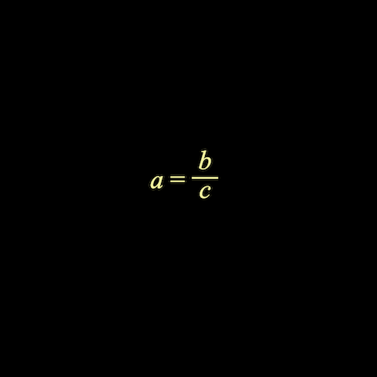

# Example 5 - Simple Equation

A simple equation including a fraction.

Open `index.html` in a browser to view example.



## Code
`index.js`
```js
const diagram = new Fig.Diagram();

diagram.addElement(
  // Add equation element
  {
    name: 'eqn',
    method: 'equation',
    options: {
      color: [0.95, 0.95, 0.6, 1],
      position: [-0.2, 0],
      // Equation elements are the individual terms in the equation
      elements: {
        a: 'a',
        b: 'b',
        c: 'c',
        v: { symbol: 'vinculum'},
        equals: ' = ',
      },
      // An equation form is how those terms are arranged
      forms: {
        base: ['a', 'equals', { frac: ['b', 'vinculum', 'c'] }],
      },
    },
  },
);
// Show the equation form
diagram.getElement('eqn').showForm('base');
diagram.initialize();
```

## Explanation

Consider the equation:

```
a = b + c
```

We could also rearrange it to a different FORM:

```
a - b = c
```

These equations have a number of TERMS (a, b, c), an OPERATOR (+) and an equals sign (which we will call an OPERATOR).

Each of these TERMS and OPERATORS are diagram elements - specifically `DiagramElementPrimitive` objects that can behave in any way a normal `DiagramElement` can.

An `Equation` object is a `DiagramElementCollection` that groups all the equation's elements and can arrange them into different equation FORMS.

In this example, the *equation elements* (TERMS and OPERATORS) are first defined in `options.elements`, then a *form* is defined in `options.forms.base` .

Some operators are either not in unicode, or are more convient to draw directly. In this example the *vinculum* of the fraction is a *symbol*.

Available *symbols* are:

* [Vinculum](../../docs/README.md#EQN_VinculumSymbol)
* [Radical](../../docs/README.md#EQN_RadicalSymbol)
* [Integral](../../docs/README.md#EQN_IntegralSymbol)
* [Sum](../../docs/README.md#EQN_SumSymbol)
* [Product](../../docs/README.md#EQN_ProdSymbol)
* [Bracket](../../docs/README.md#EQN_BracketSymbol)
* [Square bracket](../../docs/README.md#EQN_SquareBracketSymbol)
* [Angle bracket](../../docs/README.md#EQN_AngleBracketSymbol)
* [Brace](../../docs/README.md#EQN_BraceSymbol)
* [Bar](../../docs/README.md#EQN_BarSymbol)
* [Arrow](../../docs/README.md#EQN_ArrowSymbol)
* [Box](../../docs/README.md#EQN_BoxSymbol)
* [Strike](../../docs/README.md#EQN_StrikeSymbol)

The fraction is a layout function. The available layout functions are:

* [Container](../../docs/README.md#EQN_Container)
* [Fraction](../../docs/README.md#EQN_Fraction)
* [Scale](../../docs/README.md#EQN_Scale)
* [Bracket](../../docs/README.md#EQN_Bracket)
* [Root](../../docs/README.md#EQN_Root)
* [Strike](../../docs/README.md#EQN_Strike)
* [Box](../../docs/README.md#EQN_Box)
* [Bar](../../docs/README.md#EQN_Bar)
* [Integral](../../docs/README.md#EQN_Integral)
* [SumOf](../../docs/README.md#EQN_SumOf)
* [ProdOf](../../docs/README.md#EQN_ProdOf)
* [Subcript](../../docs/README.md#EQN_Subcript)
* [Superscript](../../docs/README.md#EQN_Superscript)
* [SuperscriptSubscript](../../docs/README.md#EQN_SuperscriptSubscript)
* [Comment](../../docs/README.md#EQN_Comment)
* [StrikeComment](../../docs/README.md#EQN_StrikeComment)
* [Pad](../../docs/README.md#EQN_Pad)
* [Matrix](../../docs/README.md#EQN_Matrix)
* [Annotate](../../docs/README.md#EQN_Annotate)

