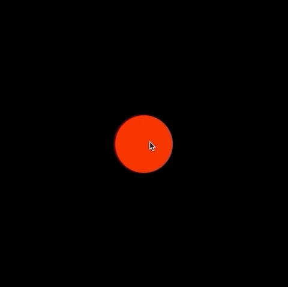

# Example 3 - Interactive Shape

This example shows a circle that can be moved in the container.

If the shape is released while dragging, it will continue to travel in its last dragged direction, and bounce of the container boundaries if it reaches them.

Open `index.html` in a browser to view example.



## Code
```js
// Create diagram and make it able to be touched
const diagram = new Fig.Diagram();
diagram.setTouchable();

// Add circle to diagram
diagram.addElement(
  {
    name: 'circle',
    method: 'polygon',
    options: {
      sides: 100,
      radius: 0.2,
      fill: true,
      color: [1, 0, 0, 1],
    },
    mods: {
      isTouchable: true,
      isMovable: true,
      move: {
        canBeMovedAfterLosingTouch: true,
        boundary: 'diagram',
      },
    },
  },
);

// Initialize diagram
diagram.initialize();
```

## Explanation
Diagram elements can be touched, moved, released (to move freely) and animated.

This example shows how an element can be setup to be moved and bounce of the diagram walls so it stays within the diagrams limits. By default, the object will move freely when released.

```js
    options: {
      sides: 100,
      radius: 0.2,
      fill: true,
      color: [1, 0, 0, 1],
    },
```

The `options` key in the circle definition defines parameters specific to the `polygon` shape creator method.

```js
    mods: {
      isTouchable: true,
      isMovable: true,
      move: {
        canBeMovedAfterLosingTouch: true,
        boundary: 'diagram',
      },
    },
```

The `mods` key in the circle definition can be used to set properties that belong to every `DiagramElement`. For instance, all diagram elements (`DiagramElementCollection` and `DiagramElementPrimitive` objects) have a `isTouchable` property that by default is `false`. In this case, we are setting it to `true`.

Properties of diagram elements may also be *objects*. For example, all diagram elements have a `move` object property that includes the properties `canBeMovedAfterLosingTouch` and `boundary`, as well as a number of others. Only the properties defined in `mods` will overwrite those in the diagram element. Other properties that are not defined (including those within the `move` object) will retian their default values.
