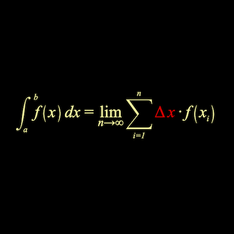

# Example 5 - Advanced Equation

A more advanced equation with an integral, sum operator, brackets, annotations, subscripts and color.

Open `index.html` in a browser to view example.



## Code
`index.js`
```js
const diagram = new Fig.Diagram();
diagram.setTouchable();

diagram.addElement(
  {
    name: 'eqn',
    method: 'equation',
    options: {
      color: [0.95, 0.95, 0.6, 1],
      position: [0, 0],
      // Not all elements need to be defined. Some can be inferred from the
      // form definition.
      // Typically, if the element needs properties (like color), or it has
      // text that is not compatible with a javascript object property name
      // (like " = "), then it should be defined in elements.
      // Full element definitions can happen in line in the form, but it tends
      // to reduce the readability of a form.
      elements: {
        lim: { style: 'normal' },
        integral: { symbol: 'int', sides: 20 },
        lb: { symbol: 'bracket', side: 'left' },
        lb1: { symbol: 'bracket', side: 'left' },
        rb: { symbol: 'bracket', side: 'right' },
        rb1: { symbol: 'bracket', side: 'right' },
        equals: ' = ',
        sigma: { symbol: 'sum', lineWidth: 0.006 },
        delta: { text: '\u0394', color: [1, 0, 0, 1] },
        x_1: { text: 'x', color: [1, 0, 0, 1]},
      },
      // An equation form is how those terms are arranged
      defaultFormAlignment: { alignH: 'center', alignV: 'center' },
      forms: {
        base: [
          {
            int: {
              symbol: 'integral',
              content: [
                // 'f' hasn't been definied in elements, so this is an inline
                // definition. In this case, the element name will be 'f', the
                // text it shows will be 'f', and its color will be the default
                // color
                'f',
                {
                  brac: {
                    left: 'lb',
                    content: 'x',
                    right: 'rb',
                    outsideSpace: 0.05,
                  }
                }, 'dx'],
              from: 'a',
              to: 'b',
            },
          },
          'equals',
          {
            annotate: {
              content: 'lim',
              annotation: {
                content: 'n\u2192\u221e',
                xPosition: 'center',      // Position is relative to content
                xAlign: 'center',         // Alignment is relative to annotation
                yPosition: 'bottom',
                yAlign: 'top',
                scale: 0.7,
              }
            }
          },
          ' ',
          {
            sumOf: {
              symbol: 'sigma',
              from: 'i=1',
              to: 'n',
              content: [
                // Both x and f have been defined before. These inline element
                // definitions include a '_1' as they need a unique element
                // name. In this case, the element name will be 'f_1', but the
                // element text will be 'f' (everything before the first '_')
                ' ', 'delta', ' ', 'x_1', ' ', '\u00b7', ' ', 'f_1',
                {
                  brac: {
                    left: 'lb1',
                    content: { sub: ['x_2', 'i'] },
                    right: 'rb1',
                    outsideSpace: 0.05,
                    bottomSpace: 0.02,
                  }
                },
              ],
            },
          },
        ],
      },
    },
    mods: {
      isTouchable: true,
      isMovable: true,
      touchInBoundingRect: true,
      move: {
        type: 'rotation',
      },
    },
  },
);

// Show the equation form
diagram.getElement('eqn').showForm('base');
diagram.initialize();
```