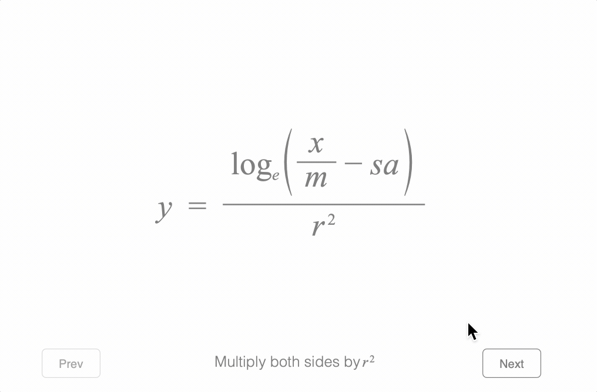

# Example - Holiday Example

Simplify the equation to it's final form.

Open `index.html` in a browser to view example.



## Explanation

The code is split into two main areas:

* Define equation (and its many forms)
* Define the slides (equation forms and corresponding descriptions)

### Define Equation (and Slide Navigator)

Most of the code in the initial section defines the many equation symbols and forms.

Several helper functions are defined initially for top comments, strikes and superscripts to make the equation forms as short as possible. In addition many reused equation phrases are defined to help make the final forms more readable.

Finally, a slide navigator is added that provides buttons and a description to navigate through the equations forms. The only customization done to the navigator is positions of the different elements.

```js
const figure = new Fig.Figure({
  limits: [-2, -1.5, 4, 3], color: [0.5, 0.5, 0.5, 1], font: { size: 0.1 },
});

// Define some helper functions for making the equation
const topCom = (content, comment, symbol) => ({
  topComment: { content, comment, inSize: false, symbol },
});
const s = (content, symbol) => ({ strike: { content, symbol, inSize: false } });
const sup = (content, superscript, offsetY = 0.05) => ({
  sup: { content, superscript, offset: [0, offsetY] },
});

figure.add([
  {
    name: 'eqn',
    method: 'collections.equation',
    options: {
      scale: 1.1,
      color: [0.5, 0.5, 0.5, 1],
      elements: {
        log: { font: { style: 'normal' } },
        min: ' \u2212 ',
        equals: '  =  ',
        lb: { symbol: 'bracket', side: 'left' },
        rb: { symbol: 'bracket', side: 'right' },
        v1: { symbol: 'vinculum', draw: 'static' },
        v2: { symbol: 'vinculum' },
        mul1: '  \u00d7  ',
        mul2: '  \u00d7  ',
        mul3: '  \u00d7  ',
        st1: { symbol: 'strike', lineWidth: 0.005 },
        st2: { symbol: 'strike', lineWidth: 0.005 },
        brace: { symbol: 'brace', side: 'top' },
      },
      phrases: {
        loge: { sub: ['log', 'e'] },
        xOnM: { frac: ['x', 'v1', 'm'] },
        xOnMStrk: { frac: ['x', 'v1', s('m', 'st1')] },
        xomsa: ['xOnM', 'min', 's', 'a'],
        xsam: ['x', 'min', 's', 'a', 'm_4'],
        r2: { sup: ['r', '_2'] },
        r21: { sup: ['r_1', '_2_1'] },
        r22: { sup: ['r_2', '_2_2'] },
        logeXomsa: ['loge', { brac: ['lb', 'xomsa', 'rb'] }],
        logeOnr2: { frac: ['logeXomsa', 'v2', 'r2'] },
        logeOnr2Strk: { frac: ['logeXomsa', 'v2', s('r2', 'st1')] },
        logeXomsaStrk: [s('loge', 'st2'), { brac: ['lb', 'xomsa', 'rb'] }],
        eyr2: sup('e_1', ['r21', 'y']),
        eyr2rry: sup('e_1', [topCom('r21', ['r_3', 'r_4'], 'brace'), 'y']),
        erry: sup('e_1', ['r_3', 'r_4', 'y']),
      },
      formDefaults: {
        alignment: { xAlign: 'center' },
        translation: {
          m_4: { style: 'linear' },
          s: { style: 'linear' },
        },
        duration: 1,
      },
      forms: {
        blank: [],
        0: ['y', 'equals', 'logeOnr2'],
        1: ['r21', 'mul1', 'y', 'equals', 'logeOnr2', 'mul2', 'r22'],
        2: ['r21', 'mul1', 'y', 'equals', 'logeOnr2Strk', 'mul2', s('r22', 'st2')],
        3: ['r21', 'y', 'equals', 'logeXomsa'],
        4: [sup('e_1', ['r21', 'y']), 'equals', sup('e_2', 'logeXomsa')],
        5: [
          sup('e_1', ['r21', 'y']),
          'equals',
          sup(s('e_2', 'st1'), 'logeXomsaStrk'),
        ],
        6: ['eyr2', 'equals', 'xomsa'],
        7: ['m_2', 'mul1', 'eyr2', 'equals', 'xOnM', 'mul2', 'm_3', '   ', 'min', '   ', 's', 'a', 'mul3', 'm_4'],
        8: ['m_2', 'mul1', 'eyr2', 'equals', 'xOnMStrk', 'mul2', s('m_3', 'st2'), '   ', 'min', '   ', 's', 'a', 'mul3', 'm_4'],
        9: ['m_2', 'eyr2', 'equals', 'xsam'],
        10: ['m_2', 'eyr2rry', 'equals', 'xsam'],
        11: ['m_2', 'erry', 'equals', 'xsam'],
        12: {
          content: ['m_2', 'erry', 'equals', 'x', 'min', 'm_4', 'a', 's'],
          translation: {
            m_4: { style: 'curved', direction: 'up', mag: 0.8 },
            s: { style: 'curved', direction: 'down', mag: 0.8 },
          },
        },
      },
    },
  },
  {
    name: 'nav',
    method: 'collections.slideNavigator',
    options: {
      equation: 'eqn',
      prevButton: { position: [-1.5, -0.7] },
      nextButton: { position: [1.5, -0.7] },
      text: { position: [0, -0.7] },
    },
  },
]);
```


### Define the Slides

The second part of the example defines a number of slides for the slide navigator to navigate through. Each slide has an associated description and equation form.

The descriptions are all [TextLines](https://airladon.github.io/FigureOne/api/#obj_textlines) objects, which uses modifiers to format specific words or phrases. As several of the modifiers are used on multiple slides, all the modifiers are defined once, and then made available to all slides.

For most slides, the progression has descriptions preceding changes in equation form. When the next button is pressed, the description will say what will happen next, and then subsequent touches will animate the equation to the correspdongind forms.

```js

// Common text modifiers that will be used by several different slides
const modifiersCommon = {
  2: {
    text: '2',
    offset: [0.01, 0.03],
    inLine: false,
    font: { size: 0.07, family: 'Times New Roman' },
  },
  e: { font: { family: 'Times New Roman', style: 'italic' } },
  r: { font: { family: 'Times New Roman', style: 'italic' } },
  m: { font: { family: 'Times New Roman', style: 'italic' } },
  log: { font: { family: 'Times New Roman' } },
  sube: {
    text: 'e',
    offset: [0, -0.03],
    inLine: false,
    font: { size: 0.07, family: 'Times New Roman', style: 'italic' },
  },
};

figure.getElement('nav').setSlides([
  {
    text: 'Multiply both sides by |r||2|',
    form: '0',
    modifiersCommon,
  },
  { form: '1' },
  { text: 'Cancel |r||2|   terms' },
  { form: '2' },
  { form: '3' },
  { text: [
    'As both sides are equal, then any value raised',
    'to the power of either side must also be equal',
  ] },
  { text: 'Raise Euler\'s number |e| to both sides' },
  { form: '4' },
  { text: 'Cancel |e| to the power of |log||sube|' },
  { form: '5' },
  { form: '6' },
  { text: 'Muliply both sides by |m|' },
  { form: '7' },
  { text: 'Cancel |m| terms' },
  { form: '8' },
  { form: '9' },
  { text: '|r||2|   is the same as |r|\u00d7|r|' },
  { form: '10' },
  { form: '11' },
  { text: [
    'Multiplication is commutative',
    { text: 'Multiplication can happen in any order', font: { size: 0.06 } },
  ] },
  { form: '12' },
  { text: 'Happy Holidays!!' },
]);
```