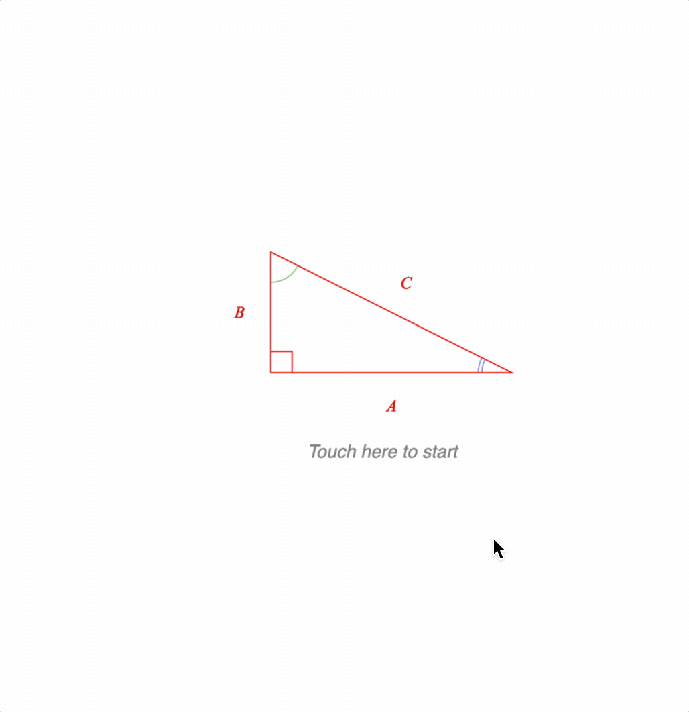

# Example 9 - Pythagorean Theorm

Uses animation and animation between equation forms to show a proof for the pythagorean theorem.

Open `index.html` in a browser to view example.



## Code

`index.js`
```js
// ////////////////////////////////////////////////////////////////////////
// Setup Equation
// ////////////////////////////////////////////////////////////////////////

// Helper function for equation bottom comments to make forms look clearner
const bc = (content, comment, symbol = null, scale = 0.6, inSize = false) => ({
  bottomComment: {
    content, comment, scale, symbol, inSize,
  }
});

// Add the equation with all it's forms
figure.addElement({
  name: 'eqn',
  method: 'equation',
  options: {
    position: [0, -2],
    scale: 1.4,
    touchBorder: 0.1,
    elements: {
      equals: '  =  ',
      plus_1: '  +  ',
      plus_2: '  +  ',
      plus_3: '  +  ',
      plus_4: '  +  ',
      lb: { symbol: 'bracket', side: 'left' },
      rb: { symbol: 'bracket', side: 'right' },
      brace1: { symbol: 'brace', side: 'bottom' },
      strike1: { symbol: 'strike', style: 'cross' },
      strike2: { symbol: 'strike', style: 'cross' },
      times: ' \u00D7 ',
    },
    formDefaults: {
      alignment: { xAlign: 'center' },
    },
    // Phrases allow for reuse, helping to keep forms shorter and more readable
    phrases: {
      area1: bc('Area_1', 'large square', null, 0.4, true),
      area2: bc('Area_2', 'triangle', null, 0.4, true),
      area3: bc('Area_3', 'small square', null, 0.4, true),
      A_B: { sup: [{ brac: ['lb', ['A', 'plus_2', 'B'], 'rb'] }, '2_1']},
      hAB: [{ frac: ['1_1', 'vinculum', '2_2', 0.7] }, 'A_2', 'B_2'],
      Csq: { sup: ['C', '2_3'] },
      Asq: { sup: ['A_3', '2_4'] },
      Bsq: { sup: ['B_3', '2_6'] },
      ABExp: ['Asq', 'plus_3', '2_5', 'A_4', 'B_4', 'plus_4', 'Bsq' ],
      equals_4t: ['equals', '4', 'times'],
      _4th: ['4', 'times', { frac: ['1_1', 'vinculum', '2_2', 0.7] }],
      s1: { strike: [['2_5', 'A_4', 'B_4'], 'strike1'] },
      s2: { strike: [['2_7', 'A_2', 'B_2'], 'strike2'] },
    },
    forms: {
      1: ['area1', 'equals_4t', 'area2', 'plus_1', 'area3'],
      2: [bc('area1', 'A_B', 'brace1'), 'equals_4t','area2', 'plus_1', 'area3'],
      3: ['A_B', 'equals_4t','area2', 'plus_1', 'area3'],
      4: ['A_B', 'equals_4t', bc('area2', 'hAB', 'brace1'), 'plus_1', 'area3'],
      5: ['A_B', 'equals_4t','hAB', 'plus_1', 'area3'],
      6: ['A_B', 'equals_4t','hAB', 'plus_1', bc('area3', 'Csq', 'brace1')],
      7: ['A_B', 'equals_4t','hAB', 'plus_1', 'Csq'],
      8: [bc('A_B', 'ABExp', 'brace1'), 'equals_4t','hAB', 'plus_1', 'Csq'],
      9: ['ABExp', 'equals_4t','hAB', 'plus_1', 'Csq'],
      10: ['ABExp', 'equals', bc('_4th', '2_7', 'brace1'), 'A_2', 'B_2', 'plus_1', 'Csq'],
      11: ['ABExp', 'equals', '2_7', 'A_2', 'B_2', 'plus_1', 'Csq'],
      12: ['Asq', 'plus_3', 's1', 'plus_4', 'Bsq', 'equals', 's2', 'plus_1', 'Csq'],
      13: ['Asq', 'plus_4', 'Bsq', 'equals', 'Csq'],
    },
    formSeries: ['1', '2', '3', '4', '5', '6', '7', '8', '9', '10', '11', '12', '13'],
  },
});
// Progress to the next form when the equation is clicked on
const eqn = figure.elements._eqn;
eqn.onClick = () => eqn.nextForm();
eqn.makeTouchable();

// ////////////////////////////////////////////////////////////////////////
// Setup Triangles
// ////////////////////////////////////////////////////////////////////////

// Helper function to make the right angle triangles
// Each triangle will have a different name, and final scenario (position
// and rotation)
const makeTriangle = (name, scenario) => ({
  name,
  method: 'collections.polyline',
  options: {
    color: [1, 0, 0, 1],
    points: [[0, 0], [0, 1], [2, 0]],
    close: true,
    side: [
      { label: { text: 'B' }, offset: 0.1 },
      { label: { text: 'C' }, offset: 0.1 },
      { label: { text: 'A' }, offset: 0.1 },
    ],
    angle: [
      { curve: { num: 1, sides: 70, radius: 0.25, step: 0.03 }, color: [0.5, 0.8, 0.5, 1] },
      { curve: { num: 2, sides: 70, radius: 0.25, step: 0.03 }, color: [0.5, 0.5, 1, 1] },
      { curve: { autoRightAngle: true, radius: 0.25, step: 0.03 } },
    ],
  },
  mods: {
    scenarios: {
      initial: { position: [-0.7, -0.3], rotation: 0 },
      lowerLeft: { position: [-1.5, -1], rotation: 0 },
      square: scenario,
    },
  },
});

// Add the right angle triangles to the figure
figure.addElements([
  makeTriangle('tri4', { position: [-1.5, 2], rotation: 3 * Math.PI / 2 }),
  makeTriangle('tri3', { position: [1.5, 2], rotation: Math.PI }),
  makeTriangle('tri2', { position: [1.5, -1], rotation: Math.PI / 2 }),
  makeTriangle('tri1', { position: [-1.5, -1], rotation: 0 }),
]);

// When the triangles rotate, the text needs to stay horizontal
const setUpdate = (element) => {
  element.setTransformCallback = () => {
    const rot = element.getRotation();
    element.updateLabels(rot);
  }
  element.dim();
};

const tri2 = figure.elements._tri2;
const tri3 = figure.elements._tri3;
const tri4 = figure.elements._tri4;
setUpdate(tri2);
setUpdate(tri3);
setUpdate(tri4);


// ////////////////////////////////////////////////////////////////////////
// Setup Text
// ////////////////////////////////////////////////////////////////////////

// Add some text to help the user start and navigate the equation
figure.addElements([
  {
    name: 'start',
    method: 'text',
    options: {
      text: 'Touch here to start',
      position: [-0.4, -1],
      touchBorder: 0.5,
      font: { size: 0.15, style: 'italic', color: [0.5, 0.5, 0.5, 1] },
    },
  },
  {
    name: 'prev',
    method: 'text',
    options: {
      text: 'Touch equation to step forward, or touch here to step back',
      position: [0, -2.8],
      touchBorder: 0.1,
      font: { size: 0.1, style: 'italic', color: [0.6, 0.6, 0.6, 1] },
      xAlign: 'center',
    },
  },
]);

// The start text kicks off an animation converting the right angle triangle
// into a square
figure.elements._start.setTouchable();
figure.elements._start.onClick = () => {
  figure.elements._start.hide();
  figure.elements.animations.new()
    .scenarios({ target: 'lowerLeft', duration: 1 })
    .scenario({ element: tri2, target: 'square', duration: 2 })
    .scenario({ element: tri3, target: 'square', duration: 2 })
    .scenario({ element: tri4, target: 'square', duration: 2 })
    .trigger(() => { eqn.showForm('1'); })
    .opacity({ element: eqn, start: 0.01, target: 1, duration: 1 })
    .dissolveIn({ element: figure.elements._prev, duration: 0.5 })
    .start();
}

// The prev text tells the user how to proceed. If it is touched, then
// the equation will go to the previous form
figure.elements._prev.onClick = () => {
  if (eqn.getCurrentForm().name !== '1') {
    eqn.prevForm({
      duration: 1,
      ifAnimating: { cancelGoTo: false }
    });
  }
};
figure.elements._prev.setTouchable();


// ////////////////////////////////////////////////////////////////////////
// Set starting positions
// ////////////////////////////////////////////////////////////////////////

// Start by hiding the equation and prev text, and setting all triangles
// to the same initial position
eqn.hide()
figure.elements._prev.hide();
figure.elements.setScenarios('initial');
```

## Explanation
There are three main parts to this example:
* Equation setup
* Triangles setup
* Text setup

Each part builds on previous examples and so only new concepts are explained in detail.

### Equation

The equation definition uses several tricks to keep it as readable as possible.

#### Helper function

Firstly, a helper function is defined that creates an equation **bottomComment** definition. Its name is short, and the default parameters are the most commonly used in the equation so its footprint in the forms is as light as possible.
```js
// Helper function for equation bottom comments to make forms look clearner
const bc = (content, comment, symbol = null, scale = 0.6, inSize = false) => ({
  bottomComment: {
    content, comment, scale, symbol, inSize,
  }
});
```

It is then used in several places. For example, in the definition of form '2':
```js
      2: [bc('area1', 'A_B', 'brace1'), 'equals_4t','area2', 'plus_1', 'area3'],
```

#### Phrases

The `phrases` property of the equation definition promotes reuse of equation phrases.

```js
    // Phrases allow for reuse, helping to keep forms shorter and more readable
    phrases: {
      area1: bc('Area_1', 'large square', null, 0.4, true),
      area2: bc('Area_2', 'triangle', null, 0.4, true),
      area3: bc('Area_3', 'small square', null, 0.4, true),
      A_B: { sup: [{ brac: ['lb', ['A', 'plus_2', 'B'], 'rb'] }, '2_1']},
      hAB: [{ frac: ['1_1', 'vinculum', '2_2', 0.7] }, 'A_2', 'B_2'],
      Csq: { sup: ['C', '2_3'] },
      Asq: { sup: ['A_3', '2_4'] },
      Bsq: { sup: ['B_3', '2_6'] },
      ABExp: ['Asq', 'plus_3', '2_5', 'A_4', 'B_4', 'plus_4', 'Bsq' ],
      equals_4t: ['equals', '4', 'times'],
      _4th: ['4', 'times', { frac: ['1_1', 'vinculum', '2_2', 0.7] }],
      s1: { strike: [['2_5', 'A_4', 'B_4'], 'strike1'] },
      s2: { strike: [['2_7', 'A_2', 'B_2'], 'strike2'] },
    },
```

Phrases can be reused in either other phrases (e.g. `Asq` and `Bsq` are used in phrase `ABExp`) or forms.

#### Inline definitions

Many elements have inline definitions to keep the `elements` property small.

There are many instances of simple letters (`A_1`, `A_2`...), numbers (`2_1`, `2_2`...) and even a symbol (`vinculum`) being defined inline.

#### Form progression

A form series defines how an equation progresses through forms when the `nextForm()` method is used.

```js
   formSeries: ['1', '2', '3', '4', '5', '6', '7', '8', '9', '10', '11', '12', '13'],
```

```js
// Progress to the next form when the equation is clicked on
const eqn = figure.elements._eqn;
eqn.onClick = () => eqn.nextForm();
eqn.stMovable();
```

### Triangles

This figure requires four triangles that are all the same, just in different positions and with different rotations.

**Scenarios** are a convenient way to imbed position, rotation, scale and color scenarios within a `FigureElement`. When orchestrating many elements, it can make code more readable.

Therefore, as all the triangles are the same except for their senarios, a helper function is used to create them. The method used to create the triangles is `collections.polyline` which creates a polyline which can be annotated with text and angles for each segment.

```js
// Helper function to make the right angle triangles
// Each triangle will have a different name, and final scenario (position
// and rotation)
const makeTriangle = (name, scenario) => ({
  name,
  method: 'collections.polyline',
  options: {
    color: [1, 0, 0, 1],
    points: [[0, 0], [0, 1], [2, 0]],
    close: true,
    side: [
      { label: { text: 'B' }, offset: 0.1 },
      { label: { text: 'C' }, offset: 0.1 },
      { label: { text: 'A' }, offset: 0.1 },
    ],
    angle: [
      { curve: { num: 1, sides: 70, radius: 0.25, step: 0.03 } },
      { curve: { num: 2, sides: 70, radius: 0.25, step: 0.03 }, color: [0.5, 0.5, 1, 1] },
      { curve: { num: 3, sides: 70, radius: 0.25, step: 0.03 }, color: [0.5, 0.8, 0.5, 1] },
    ],
  },
  mods: {
    scenarios: {
      initial: { position: [-0.7, -0.3], rotation: 0 },
      lowerLeft: { position: [-1.5, -1], rotation: 0 },
      square: scenario,
    },
  },
});

// Add the right angle triangles to the figure
figure.addElements([
  makeTriangle('tri1', { position: [-1.5, -1], rotation: 0 }),
  makeTriangle('tri2', { position: [1.5, -1], rotation: Math.PI / 2 }),
  makeTriangle('tri3', { position: [1.5, 2], rotation: Math.PI }),
  makeTriangle('tri4', { position: [-1.5, 2], rotation: 3 * Math.PI / 2 }),
]);
```

As the triangles rotate into their final position, it is desirable to have their annotations remain horizontal. The rotation is part of the element's transform, so the `setTransformCallback` property on a `FigureElement` can be used to update the label annotations. The `updateLabels` method is part of the `object.polyline` object that extends a `FigureElement`.

```js
// When the triangles rotate, the text needs to stay horizontal
const setUpdate = (element) => {
  element.setTransformCallback = () => {
    const rot = element.getRotation();
    element.updateLabels(rot);
  }
  element.dim();
};

const tri2 = figure.elements._tri2;
const tri3 = figure.elements._tri3;
const tri4 = figure.elements._tri4;
setUpdate(tri2);
setUpdate(tri3);
setUpdate(tri4);
```

### Text

Finally the text that helps the user navigate through the figure is created.

```js
// Add some text to help the user start and navigate the equation
figure.addElements([
  {
    name: 'start',
    method: 'text',
    options: {
      text: 'Touch here to start',
      position: [-0.4, -1],
      touchBorder: 0.5,
      font: { size: 0.15, style: 'italic', color: [0.5, 0.5, 0.5, 1] },
    },
  },
  {
    name: 'prev',
    method: 'text',
    options: {
      text: 'Touch equation to step forward, or touch here to step back',
      position: [0, -2.8],
      touchBorder: 0.1,
      font: { size: 0.1, style: 'italic', color: [0.6, 0.6, 0.6, 1] },
      xAlign: 'center',
    },
  },
]);
```

When the user presses the **start** text, an animation starts that moves all the triangles into position, and dissolves the equation showing the first form in.

```js
// The start text kicks off an animation converting the right angle triangle
// into a square
figure.elements._start.setTouchable();
figure.elements._start.onClick = () => {
  figure.elements._start.hide();
  figure.elements.animations.new()
    .scenarios({ target: 'lowerLeft', duration: 1 })
    .scenario({ element: tri2, target: 'square', duration: 2 })
    .scenario({ element: tri3, target: 'square', duration: 2 })
    .scenario({ element: tri4, target: 'square', duration: 2 })
    .trigger(() => { eqn.showForm('1'); })
    .opacity({ element: eqn, start: 0.01, target: 1, duration: 1 })
    .dissolveIn({ element: figure.elements._prev, duration: 0.5 })
    .start();
}
```

The **prev** text can be used to navigate backwards through the equation forms

```js
// The prev text tells the user how to proceed. If it is touched, then
// the equation will go to the previous form
figure.elements._prev.onClick = () => {
  if (eqn.getCurrentForm().name !== '1') {
    eqn.prevForm({
      duration: 1,
      ifAnimating: { cancelGoTo: false }
    });
  }
};
figure.elements._prev.setTouchable();
```

### Final Positions

Finally, the equation and **prev** text is hidden when the figure starts.

```js
eqn.hide()
figure.elements._prev.hide();
figure.elements.setScenarios('initial');
```