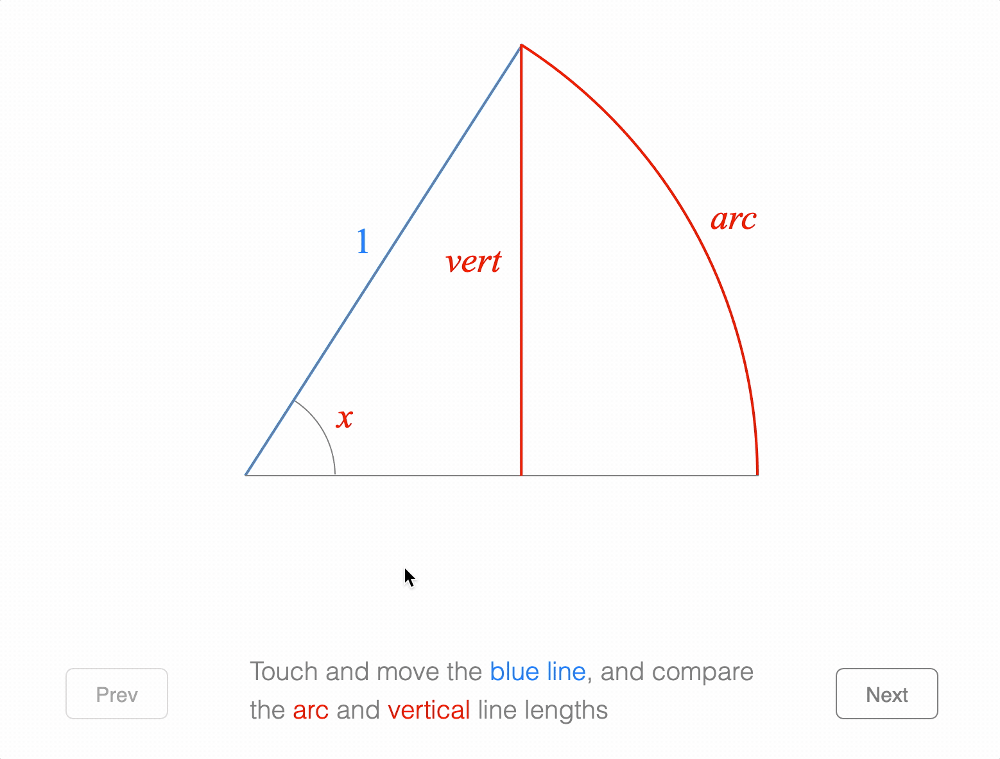

# Example - Sine Wave

Rotate the line manually, or press 'fast' or 'slow' to make a sine wave.

Open `index.html` in a browser to view example.



## Code

`index.js`
```js
const figure = new Fig.Figure({ limits: [-2, -1.5, 4, 3], color: [1, 0, 0, 1] });

// ////////////////////////////////////////////////////////////////////////
// Radius and Space between radius and recorded signal
// ////////////////////////////////////////////////////////////////////////

const r = 0.8;
const space = 0.2;


// ////////////////////////////////////////////////////////////////////////
// Data Class Setup
// ////////////////////////////////////////////////////////////////////////

// This class holds a time signal - when data is added slower than the sampling
// rate, then interpolated data for missing samples in time will be added.
// This class does not use FigureOne.
class DynamicSignal {
  constructor(initialValue) {
    // This data class will hold signal data for the most recent 10s at a
    // resolution (sampling rade) of 0.02s.
    this.duration = 10;
    this.timeStep = 0.01;
    const time = Fig.range(0, this.duration, this.timeStep);
    
    // The xRange is the x distance the duration will be plotted over
    const xRange = 2 - space;

    // Get the x values of the signal
    this.x = time.map(t => t * xRange / this.duration + r + space);

    // initial signal data
    // this.data = Array(this.duration / this.timeStep).fill(initialValue);
    this.data = [initialValue];

    // record the current time
    this.lastTime = new Date().getTime();
  }

  // Update the signal data with the new value. Signal data is has a resolution
  // of 0.02s, so if this value comes in more than 0.04s after the last value
  // was recorder, then use interpolation to fill in the missing samples.
  update(value) {
    const currentTime = new Date().getTime();
    const deltaTime = (currentTime - this.lastTime) / 1000;

    // If the value has come in faster than the time resolution, then
    // do nothing
    if (deltaTime < this.timeStep) {
      return;
    }

    this.lastTime = currentTime;

    // If more than 10s has passed, since the last value update, then
    // udpate all values to the latest value
    if (deltaTime > this.duration) {
      this.data = Array(this.x.length).fill(value);
      return;
    }

    // Count the number of samples that need to be added to the signal
    const count = Math.floor(deltaTime / this.timeStep);

    // Interpolate between the last recorded value and the new value
    const newValues = [];
    const deltaValue = (this.data[0] - value) / (count);
    for (let i = 0; i < count; i += 1) {
      newValues.push(value + deltaValue * i);
    }
    this.data = [...newValues, ...this.data.slice(0, this.x.length - count)];
  }

  // Make an array of points where this.data is plotted against this.x
  getPoints() {
    return this.data.map((value, index) => new Fig.Point(this.x[index], value));
  }
}

// Make a new signal
const signal = new DynamicSignal(0, 10);


// ////////////////////////////////////////////////////////////////////////
// Setup the figure
// ////////////////////////////////////////////////////////////////////////

// Helper method to create text buttons
const button = (name, label, position) => ({
  name,
  method: 'collections.rectangle',
  options: {
    label: {
      text: label,
      font: { size: 0.1 },
    },
    touchBorder: 0.1,
    position,
    color: [0.4, 0.4, 0.4, 1],
    width: 0.7,
    height: 0.25,
    corner: { radius: 0.05, sides: 10 },
    fill: [0.9, 0.9, 0.9, 1],
    button: {
      fill: [0.95, 0.95, 0.95, 1],
    },
  },
  mods: {
    isTouchable: true,
  },
});

figure.add([
  {
    name: 'diagram',
    method: 'collection',
    options: {
      position: [-1, 0],
    },
    elements: [
      {
        name: 'x',
        method: 'line',
        options: {
          length: 3.6,
          position: [-r, 0],
          width: 0.005,
          color: [0.7, 0.7, 0.7, 1],
        }
      },
      {
        name: 'y',
        method: 'line',
        options: {
          length: r * 2,
          position: [0, -r],
          width: 0.005,
          angle: Math.PI / 2,
          color: [0.7, 0.7, 0.7, 1],
        },
      },
      {
        name: 'circle',
        method: 'polygon',
        options: {
          radius: r,
          sides: 200,
          line: { width: 0.005 },
          color: [0.7, 0.7, 0.7, 1],
        },
      },
      {
        name: 'sine',
        method: 'collections.line',
        options: {
          maxLength: 3,
          width: 0.005,
          dash: [0.01, 0.02],
          color: [0.7, 0.7, 0.7, 1],
        },
      },
      {
        name: 'rotator',
        method: 'line',
        options: {
          length: r,
          width: 0.015,
          touchBorder: 0.3,
        },
        mods: {
          isMovable: true,
          move: { type: 'rotation' },
        },
      },
      {
        name: 'signalLine',
        method: 'polyline',
        options: {
          width: 0.01,
        },
      },
    ],
  },
  button('slow', 'Slow', [-1, -1.3]),
  button('fast', 'Fast', [0, -1.3]),
  button('stop', 'Stop', [1, -1.3]),
]);

// Get the rotator, sine line and signal line figure elements
const rotator = figure.getElement('diagram.rotator');
const sine = figure.getElement('diagram.sine');
const signalLine = figure.getElement('diagram.signalLine');

// Update function for everytime we want to update the signal
function update() {
  const angle = rotator.getRotation();
  const endPoint = Fig.polarToRect(r, angle);
  sine.setEndPoints(endPoint, [r + space, endPoint.y]);
  signal.update(endPoint.y);
  signalLine.custom.updatePoints({
    points: signal.getPoints(),
  })
  figure.animateNextFrame();
};

// Whenever the rotator line changes, call update
rotator.subscriptions.add('setTransform', () => {
  update();
});

// Also call update every 20ms
function updateNext() {
  update();
  setTimeout(updateNext, 20);
};


// ////////////////////////////////////////////////////////////////////////
// Button Logic
// ////////////////////////////////////////////////////////////////////////

function spinner(initialAngle, duration, frequency, percent) {
  const angle = initialAngle + 2 * Math.PI * frequency * percent * duration;
  rotator.setRotation(angle);
}

function startSpinning(frequency) {
  rotator.stop();
  const angle = rotator.getRotation();
  rotator.animations.new()
    .custom({
      callback: this.spinner.bind(this, angle, 100, frequency),
      duration: 100,
      })
    .start();
}

figure.getElement('fast').onClick = () => startSpinning(0.7);
figure.getElement('slow').onClick = () => startSpinning(0.2);
figure.getElement('stop').onClick = () => { rotator.stop(); };


// ////////////////////////////////////////////////////////////////////////
// Initialize
// ////////////////////////////////////////////////////////////////////////

rotator.animations.new()
  .rotation({ target: Math.PI / 4, duration: 1.5 })
  .trigger({ callback: updateNext })
  .start();
```

## Explanation

Most of the complexity in this example is in creating the dynamic signal data class. This logic doesn't use FigureOne, but it is convenient to create a time dependent, interpolated data signal.

The remainder is creating the figure elemnts, creating some update logic and enabling the buttons.

### Dynamic Signal

It is hoped the inline comments explains this logic sufficently.

```js
// This class holds a time signal - when data is added slower than the sampling
// rate, then interpolated data for missing samples in time will be added.
// This class does not use FigureOne.
class DynamicSignal {
  constructor(initialValue) {
    // This data class will hold signal data for the most recent 10s at a
    // resolution (sampling rade) of 0.02s.
    this.duration = 10;
    this.timeStep = 0.01;
    const time = Fig.range(0, this.duration, this.timeStep);
    
    // The xRange is the x distance the duration will be plotted over
    const xRange = 2 - space;

    // Get the x values of the signal
    this.x = time.map(t => t * xRange / this.duration + r + space);

    // initial signal data
    // this.data = Array(this.duration / this.timeStep).fill(initialValue);
    this.data = [initialValue];

    // record the current time
    this.lastTime = new Date().getTime();
  }

  // Update the signal data with the new value. Signal data is has a resolution
  // of 0.02s, so if this value comes in more than 0.04s after the last value
  // was recorder, then use interpolation to fill in the missing samples.
  update(value) {
    const currentTime = new Date().getTime();
    const deltaTime = (currentTime - this.lastTime) / 1000;

    // If the value has come in faster than the time resolution, then
    // do nothing
    if (deltaTime < this.timeStep) {
      return;
    }

    this.lastTime = currentTime;

    // If more than 10s has passed, since the last value update, then
    // udpate all values to the latest value
    if (deltaTime > this.duration) {
      this.data = Array(this.x.length).fill(value);
      return;
    }

    // Count the number of samples that need to be added to the signal
    const count = Math.floor(deltaTime / this.timeStep);

    // Interpolate between the last recorded value and the new value
    const newValues = [];
    const deltaValue = (this.data[0] - value) / (count);
    for (let i = 0; i < count; i += 1) {
      newValues.push(value + deltaValue * i);
    }
    this.data = [...newValues, ...this.data.slice(0, this.x.length - count)];
  }

  // Make an array of points where this.data is plotted against this.x
  getPoints() {
    return this.data.map((value, index) => new Fig.Point(this.x[index], value));
  }
}

// Make a new signal
const signal = new DynamicSignal(0, 10);
```

#### Setting up the Figure

First, a helper function to create the buttons is created, as most of this code is identical for each button.

```js
// Helper method to create text buttons
const button = (name, label, position) => ({
  name,
  method: 'collections.rectangle',
  options: {
    label: {
      text: label,
      font: { size: 0.1 },
    },
    touchBorder: 0.1,
    position,
    color: [0.4, 0.4, 0.4, 1],
    width: 0.7,
    height: 0.25,
    corner: { radius: 0.05, sides: 10 },
    fill: [0.9, 0.9, 0.9, 1],
    button: {
      fill: [0.95, 0.95, 0.95, 1],
    },
  },
  mods: {
    isTouchable: true,
  },
});
```

Next, the bulk of the figure is created. There is a main 'diagram' collection that contains all the graphical elements, and then three button elements.

The graphical elements are the 'x' and 'y' axes, a 'rotator' line, the recorded 'signalLine' and a horizontal line that shows the 'sine' of the rotator.

```js
figure.add([
  {
    name: 'diagram',
    method: 'collection',
    options: {
      position: [-1, 0],
    },
    elements: [
      {
        name: 'x',
        method: 'line',
        options: {
          length: 3.6,
          position: [-r, 0],
          width: 0.005,
          color: [0.7, 0.7, 0.7, 1],
        }
      },
      {
        name: 'y',
        method: 'line',
        options: {
          length: r * 2,
          position: [0, -r],
          width: 0.005,
          angle: Math.PI / 2,
          color: [0.7, 0.7, 0.7, 1],
        },
      },
      {
        name: 'circle',
        method: 'polygon',
        options: {
          radius: r,
          sides: 200,
          line: { width: 0.005 },
          color: [0.7, 0.7, 0.7, 1],
        },
      },
      {
        name: 'sine',
        method: 'collections.line',
        options: {
          maxLength: 3,
          width: 0.005,
          dash: [0.01, 0.02],
          color: [0.7, 0.7, 0.7, 1],
        },
      },
      {
        name: 'rotator',
        method: 'line',
        options: {
          length: r,
          width: 0.015,
          touchBorder: 0.3,
        },
        mods: {
          isMovable: true,
          move: { type: 'rotation' },
        },
      },
      {
        name: 'signalLine',
        method: 'polyline',
        options: {
          width: 0.01,
        },
      },
    ],
  },
  button('slow', 'Slow', [-1, -1.3]),
  button('fast', 'Fast', [0, -1.3]),
  button('stop', 'Stop', [1, -1.3]),
]);

// Get the rotator, sine line and signal line figure elements
const rotator = figure.getElement('diagram.rotator');
const sine = figure.getElement('diagram.sine');
const signalLine = figure.getElement('diagram.signalLine');

```

#### Update Functions

When the rotator is rotated, or as time passes, the 'signalLine' and 'sine' line needs to be updated. The next function finds the end point of the rotator, whose y coordinate is the sine, to update both lines.
```js
// Update function for everytime we want to update the signal
function update() {
  const angle = rotator.getRotation();
  const endPoint = Fig.polarToRect(r, angle);
  sine.setEndPoints(endPoint, [r + space, endPoint.y]);
  signal.update(endPoint.y);
  signalLine.custom.updatePoints({
    points: signal.getPoints(),
  })
  figure.animateNextFrame();
};
```

Whenever the rotator is rotated, a `setTransfrom` will be fired. We can subscribe to this to attach the udpate function.
```js
// Whenever the rotator line changes, call update
rotator.subscriptions.add('setTransform', () => {
  update();
});
```

We also want to update the signal every 20ms even if the rotator is not moving.
```js
// Also call update every 20ms
function updateNext() {
  update();
  setTimeout(updateNext, 20);
};
```

#### Button Setup

Next, the buttons need to be setup. Two buttons set the rotator to spin automatically, while the third stops all rotation.

```js
function spinner(initialAngle, duration, frequency, percent) {
  const angle = initialAngle + 2 * Math.PI * frequency * percent * duration;
  rotator.setRotation(angle);
}

function startSpinning(frequency) {
  rotator.stop();
  const angle = rotator.getRotation();
  rotator.animations.new()
    .custom({
      callback: this.spinner.bind(this, angle, 100, frequency),
      duration: 100,
      })
    .start();
}

figure.getElement('fast').onClick = () => startSpinning(0.7);
figure.getElement('slow').onClick = () => startSpinning(0.2);
figure.getElement('stop').onClick = () => { rotator.stop(); };
```

#### Initialize

To initialize the figure, we start by animating a rotation to make it obvious that the signal is being recorded, and then start the 20ms updates.

```js
rotator.animations.new()
  .rotation({ target: Math.PI / 4, duration: 1.5 })
  .trigger({ callback: updateNext })
  .start();
```