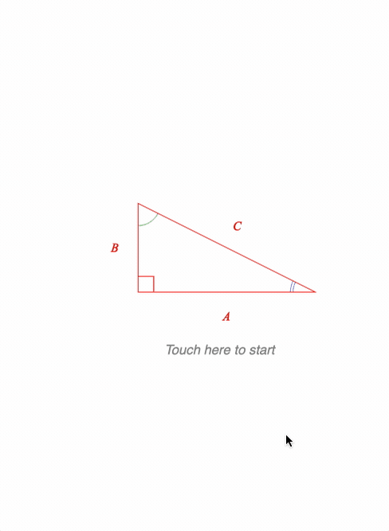

# Example - Sine Wave

Rotate the line manually, or press 'fast' or 'slow' to make a sine wave.

Open `index.html` in a browser to view example.



## Code

`index.js`
```js
const figure = new Fig.Figure({ limits: [-2, -1.5, 4, 3], color: [1, 0, 0, 1] });


const r = 0.8;
const space = 0.2;

// This class will hold a time vs value data points (signal trace)
class DynamicSignal {
  constructor(initialValue) {
    // This data class will hold signal data for the most recent 10s at a
    // resolution of 0.02s.
    this.duration = 10;
    this.timeStep = 0.01;
    const time = Fig.range(0, this.duration, this.timeStep);
    
    // The time range will be plotted over an x range of 1.8 figure units
    const xRange = 2 - space;

    // Get the x values of the signal
    this.x = time.map(t => t * xRange / this.duration + r + space);

    // initial signal data
    this.data = Array(this.duration / this.timeStep).fill(initialValue);

    // record the current time
    this.lastTime = new Date().getTime();
  }

  // Update the signal data with the new value. Signal data is has a resolution
  // of 0.02s, so if this value comes in more than 0.04s after the last value
  // was recorder, then use interpolation to fill in the missing samples.
  update(value) {
    const currentTime = new Date().getTime();
    const deltaTime = (currentTime - this.lastTime) / 1000;

    // If the value has come in faster than the time resolution, then
    // do nothing
    if (deltaTime < this.timeStep) {
      return;
    }

    this.lastTime = currentTime;

    // If more than 10s has passed, since the last value update, then
    // udpate all values to the latest value
    if (deltaTime > this.duration) {
      this.data = Array(this.data.length).fill(value);
      return;
    }

    // Count the number of samples that need to be added to the signal
    const count = Math.floor(deltaTime / this.timeStep);

    // Interpolate between the last recorded value and the new value
    const newValues = [];
    const deltaValue = (this.data[0] - value) / (count);
    for (let i = 0; i < count; i += 1) {
      newValues.push(value + deltaValue * i);
    }
    this.data = [...newValues, ...this.data.slice(0, this.data.length - count)];
  }

  // Make an array of points where this.data is plotted against this.x
  getPoints() {
    return this.data.map((value, index) => new Fig.Point(this.x[index], value));
  }
}

// Helper method to create text buttons
const button = (name, label, position) => ({
  name,
  method: 'collections.rectangle',
  options: {
    label: {
      text: label,
      font: { size: 0.1 },
    },
    touchBorder: 0.1,
    position,
    xAlign: 'center',
    yAlign: 'middle',
    color: [0.4, 0.4, 0.4, 1],
    width: 0.7,
    height: 0.25,
    corner: { radius: 0.05, sides: 10 },
    fill: [0.9, 0.9, 0.9, 1],
    button: {
      fill: [0.95, 0.95, 0.95, 1],
    },
  },
  mods: {
    isTouchable: true,
  },
});

figure.add([
  {
    name: 'diagram',
    method: 'collection',
    options: {
      position: [-1, 0],
    },
    elements: [
      {
        name: 'x',
        method: 'line',
        options: {
          length: 3.6,
          position: [-r, 0],
          width: 0.005,
          color: [0.7, 0.7, 0.7, 1],
        }
      },
      {
        name: 'y',
        method: 'line',
        options: {
          length: r * 2,
          position: [0, -r],
          width: 0.005,
          angle: Math.PI / 2,
          color: [0.7, 0.7, 0.7, 1],
        },
      },
      {
        name: 'sine',
        method: 'collections.line',
        options: {
          maxLength: 3,
          width: 0.005,
          dash: [0.01, 0.02],
          color: [0.7, 0.7, 0.7, 1],
        },
      },
      {
        name: 'rotator',
        method: 'line',
        options: {
          length: r,
          width: 0.015,
          touchBorder: 0.3,
        },
        mods: {
          isMovable: true,
          move: { type: 'rotation' },
        },
      },
      {
        name: 'signalLine',
        method: 'polyline',
        options: {
          width: 0.01,
        },
      },
    ],
  },
  button('slow', 'Slow', [-1, -1.3]),
  button('fast', 'Fast', [0, -1.3]),
  button('stop', 'Stop', [1, -1.3]),
]);

// Get the rotator, sine line and signal line figure elements
const rotator = figure.getElement('diagram.rotator');
const sine = figure.getElement('diagram.sine');
const signalLine = figure.getElement('diagram.signalLine');

// Make a new signal
const signal = new DynamicSignal(r * Math.sin(Math.PI / 4), 10);

// Update function for everytime we want to update the signal
function update() {
  const angle = rotator.getRotation();
  const endPoint = Fig.polarToRect(r, angle);
  sine.setEndPoints(endPoint, [r + space, endPoint.y]);
  signal.update(endPoint.y);
  signalLine.custom.updatePoints({
    points: signal.getPoints(),
  })
  figure.animateNextFrame();
};

// Whenever the rotator line changes, call update
rotator.subscriptions.add('setTransform', () => {
  update();
});

// Also call update every 20ms
function updateNext() {
  update();
  setTimeout(updateNext, 20);
};

// Initial rotator position
rotator.setRotation(Math.PI / 4);

// Start updating
updateNext();

// Setup the buttons
function spinner(initialAngle, duration, frequency, percent) {
  const angle = initialAngle + 2 * Math.PI * frequency * percent * duration;
  rotator.setRotation(angle);
}

function startSpinning(frequency) {
  rotator.stop();
  const angle = rotator.getRotation();
  rotator.animations.new()
    .custom({
      callback: this.spinner.bind(this, angle, 100, frequency),
      duration: 100,
      })
    .start();
}

figure.getElement('fast').onClick = () => startSpinning(0.7);
figure.getElement('slow').onClick = () => startSpinning(0.2);
figure.getElement('stop').onClick = () => { rotator.stop(); };
```

## Explanation
There are three main parts to this example:
* Equation setup
* Triangles setup
* Text setup

Each part builds on previous examples and so only new concepts are explained in detail.

### Equation

The equation definition uses several tricks to keep it as readable as possible.

#### Helper function

Firstly, a helper function is defined that creates an equation **bottomComment** definition. Its name is short, and the default parameters are the most commonly used in the equation so its footprint in the forms is as light as possible.
```js
// Helper function for equation bottom comments to make forms look clearner
const bc = (content, comment, symbol = null, scale = 0.6, inSize = false) => ({
  bottomComment: {
    content, comment, scale, symbol, inSize,
  }
});
```

It is then used in several places. For example, in the definition of form '2':
```js
      2: [bc('area1', 'A_B', 'brace1'), 'equals_4t','area2', 'plus_1', 'area3'],
```

#### Phrases

The `phrases` property of the equation definition promotes reuse of equation phrases.

```js
    // Phrases allow for reuse, helping to keep forms shorter and more readable
    phrases: {
      area1: bc('Area_1', 'large square', null, 0.4, true),
      area2: bc('Area_2', 'triangle', null, 0.4, true),
      area3: bc('Area_3', 'small square', null, 0.4, true),
      A_B: { sup: [{ brac: ['lb', ['A', 'plus_2', 'B'], 'rb'] }, '2_1']},
      hAB: [{ frac: ['1_1', 'vinculum', '2_2', 0.7] }, 'A_2', 'B_2'],
      Csq: { sup: ['C', '2_3'] },
      Asq: { sup: ['A_3', '2_4'] },
      Bsq: { sup: ['B_3', '2_6'] },
      ABExp: ['Asq', 'plus_3', '2_5', 'A_4', 'B_4', 'plus_4', 'Bsq' ],
      equals_4t: ['equals', '4', 'times'],
      _4th: ['4', 'times', { frac: ['1_1', 'vinculum', '2_2', 0.7] }],
      s1: { strike: [['2_5', 'A_4', 'B_4'], 'strike1'] },
      s2: { strike: [['2_7', 'A_2', 'B_2'], 'strike2'] },
    },
```

Phrases can be reused in either other phrases (e.g. `Asq` and `Bsq` are used in phrase `ABExp`) or forms.

#### Inline definitions

Many elements have inline definitions to keep the `elements` property small.

There are many instances of simple letters (`A_1`, `A_2`...), numbers (`2_1`, `2_2`...) and even a symbol (`vinculum`) being defined inline.

#### Form progression

A form series defines how an equation progresses through forms when the `nextForm()` method is used.

```js
   formSeries: ['1', '2', '3', '4', '5', '6', '7', '8', '9', '10', '11', '12', '13'],
```

```js
// Progress to the next form when the equation is clicked on
const eqn = figure.elements._eqn;
eqn.onClick = () => eqn.nextForm();
eqn.stMovable();
```

### Triangles

This figure requires four triangles that are all the same, just in different positions and with different rotations.

**Scenarios** are a convenient way to imbed position, rotation, scale and color scenarios within a `FigureElement`. When orchestrating many elements, it can make code more readable.

Therefore, as all the triangles are the same except for their senarios, a helper function is used to create them. The method used to create the triangles is `collections.polyline` which creates a polyline which can be annotated with text and angles for each segment.

```js
// Helper function to make the right angle triangles
// Each triangle will have a different name, and final scenario (position
// and rotation)
const makeTriangle = (name, scenario) => ({
  name,
  method: 'collections.polyline',
  options: {
    color: [1, 0, 0, 1],
    points: [[0, 0], [0, 1], [2, 0]],
    close: true,
    side: [
      { label: { text: 'B' }, offset: 0.1 },
      { label: { text: 'C' }, offset: 0.1 },
      { label: { text: 'A' }, offset: 0.1 },
    ],
    angle: [
      { curve: { num: 1, sides: 70, radius: 0.25, step: 0.03 } },
      { curve: { num: 2, sides: 70, radius: 0.25, step: 0.03 }, color: [0.5, 0.5, 1, 1] },
      { curve: { num: 3, sides: 70, radius: 0.25, step: 0.03 }, color: [0.5, 0.8, 0.5, 1] },
    ],
  },
  mods: {
    scenarios: {
      initial: { position: [-0.7, -0.3], rotation: 0 },
      lowerLeft: { position: [-1.5, -1], rotation: 0 },
      square: scenario,
    },
  },
});

// Add the right angle triangles to the figure
figure.add([
  makeTriangle('tri1', { position: [-1.5, -1], rotation: 0 }),
  makeTriangle('tri2', { position: [1.5, -1], rotation: Math.PI / 2 }),
  makeTriangle('tri3', { position: [1.5, 2], rotation: Math.PI }),
  makeTriangle('tri4', { position: [-1.5, 2], rotation: 3 * Math.PI / 2 }),
]);
```

As the triangles rotate into their final position, it is desirable to have their annotations remain horizontal. The rotation is part of the element's transform, so the `setTransformCallback` property on a `FigureElement` can be used to update the label annotations. The `updateLabels` method is part of the `object.polyline` object that extends a `FigureElement`.

```js
// When the triangles rotate, the text needs to stay horizontal
const setUpdate = (element) => {
  element.setTransformCallback = () => {
    const rot = element.getRotation();
    element.updateLabels(rot);
  }
  element.dim();
};

const tri2 = figure.elements._tri2;
const tri3 = figure.elements._tri3;
const tri4 = figure.elements._tri4;
setUpdate(tri2);
setUpdate(tri3);
setUpdate(tri4);
```

### Text

Finally the text that helps the user navigate through the figure is created.

```js
// Add some text to help the user start and navigate the equation
figure.add([
  {
    name: 'start',
    method: 'text',
    options: {
      text: 'Touch here to start',
      position: [-0.4, -1],
      touchBorder: 0.5,
      font: { size: 0.15, style: 'italic', color: [0.5, 0.5, 0.5, 1] },
    },
  },
  {
    name: 'prev',
    method: 'text',
    options: {
      text: 'Touch equation to step forward, or touch here to step back',
      position: [0, -2.8],
      touchBorder: 0.1,
      font: { size: 0.1, style: 'italic', color: [0.6, 0.6, 0.6, 1] },
      xAlign: 'center',
    },
  },
]);
```

When the user presses the **start** text, an animation starts that moves all the triangles into position, and dissolves the equation showing the first form in.

```js
// The start text kicks off an animation converting the right angle triangle
// into a square
figure.elements._start.setTouchable();
figure.elements._start.onClick = () => {
  figure.elements._start.hide();
  figure.elements.animations.new()
    .scenarios({ target: 'lowerLeft', duration: 1 })
    .scenario({ element: tri2, target: 'square', duration: 2 })
    .scenario({ element: tri3, target: 'square', duration: 2 })
    .scenario({ element: tri4, target: 'square', duration: 2 })
    .trigger(() => { eqn.showForm('1'); })
    .opacity({ element: eqn, start: 0.01, target: 1, duration: 1 })
    .dissolveIn({ element: figure.elements._prev, duration: 0.5 })
    .start();
}
```

The **prev** text can be used to navigate backwards through the equation forms

```js
// The prev text tells the user how to proceed. If it is touched, then
// the equation will go to the previous form
figure.elements._prev.onClick = () => {
  if (eqn.getCurrentForm().name !== '1') {
    eqn.prevForm({
      duration: 1,
      ifAnimating: { cancelGoTo: false }
    });
  }
};
figure.elements._prev.setTouchable();
```

### Final Positions

Finally, the equation and **prev** text is hidden when the figure starts.

```js
eqn.hide()
figure.elements._prev.hide();
figure.elements.setScenarios('initial');
```